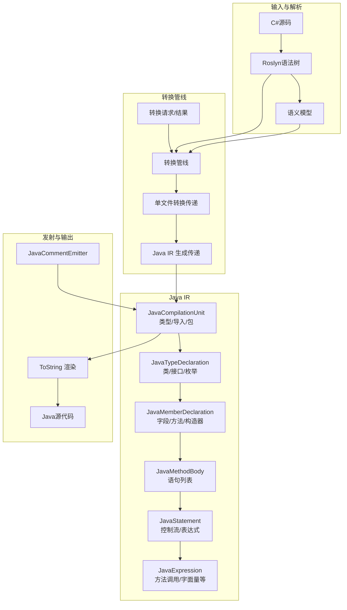
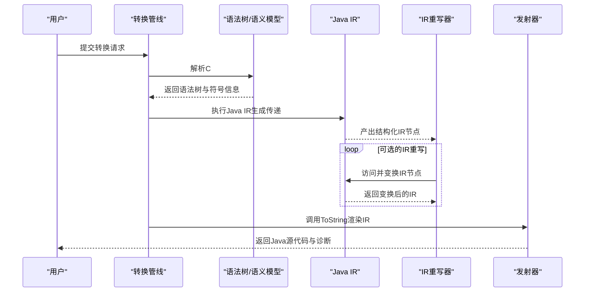
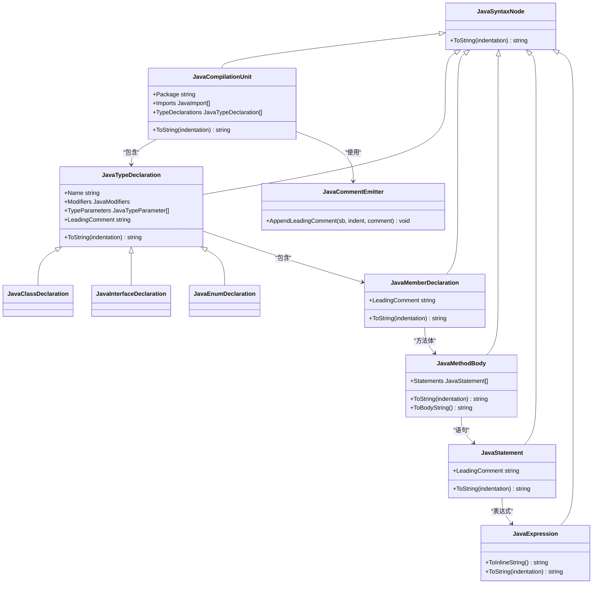
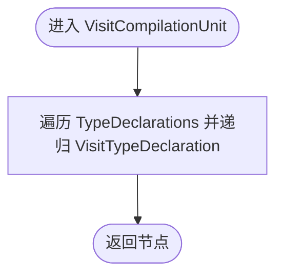
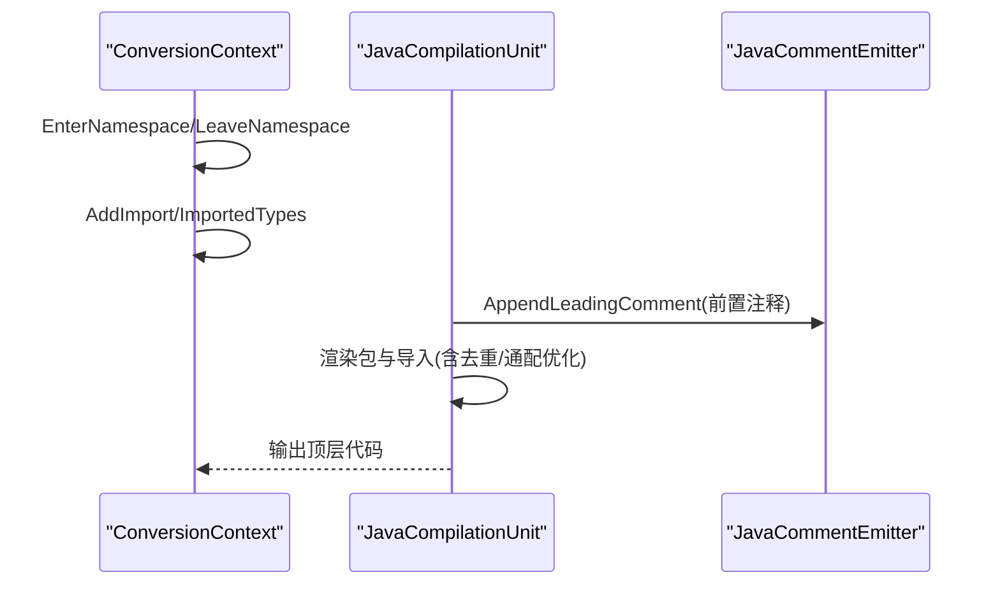
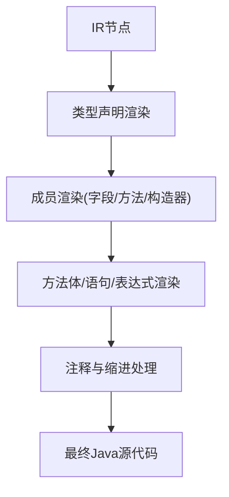
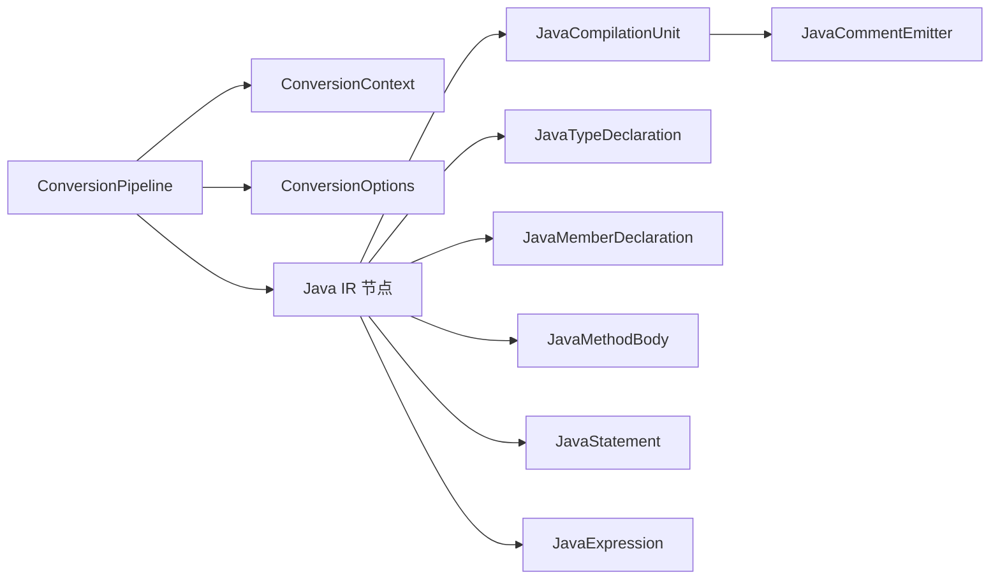

# Java语法生成

<cite>
**本文档引用的文件**
- [JavaSyntaxNode.cs](file://src/CSharpToJava.Core/Java/JavaSyntaxNode.cs)
- [JavaSyntaxRewriter.cs](file://src/CSharpToJava.Core/Java/JavaSyntaxRewriter.cs)
- [JavaCompilationUnit.cs](file://src/CSharpToJava.Core/Java/JavaCompilationUnit.cs)
- [JavaTypeDeclaration.cs](file://src/CSharpToJava.Core/Java/JavaTypeDeclaration.cs)
- [JavaMemberDeclaration.cs](file://src/CSharpToJava.Core/Java/JavaMemberDeclaration.cs)
- [JavaExpression.cs](file://src/CSharpToJava.Core/Java/JavaExpression.cs)
- [JavaStatement.cs](file://src/CSharpToJava.Core/Java/JavaStatement.cs)
- [JavaMethodBody.cs](file://src/CSharpToJava.Core/Java/JavaMethodBody.cs)
- [JavaCommentEmitter.cs](file://src/CSharpToJava.Core/Java/JavaCommentEmitter.cs)
- [ConversionPipeline.cs](file://src/CSharpToJava.Core/Pipeline/ConversionPipeline.cs)
- [ConversionContext.cs](file://src/CSharpToJava.Core/Context/ConversionContext.cs)
- [ConversionOptions.cs](file://src/CSharpToJava.Core/Context/ConversionOptions.cs)
- [DiagnosticCollector.cs](file://src/CSharpToJava.Core/Context/DiagnosticCollector.cs)
</cite>

## 目录
1. [简介](#简介)
2. [项目结构](#项目结构)
3. [核心组件](#核心组件)
4. [架构总览](#架构总览)
5. [详细组件分析](#详细组件分析)
6. [依赖关系分析](#依赖关系分析)
7. [性能考量](#性能考量)
8. [故障排查指南](#故障排查指南)
9. [结论](#结论)
10. [附录](#附录)

## 简介
本文件系统性阐述cs2j中Java语法生成功能，重点说明如何从C#语法树构建对应的Java中间表示（IR），以及IR到最终Java代码的发射过程。文档涵盖以下主题：
- Java IR的结构与生成流程
- 语法节点转换机制与代码发射器
- 注释转换、命名空间映射与导入管理
- 质量保证与验证机制
- 生成代码的可读性与可维护性
- 错误处理与调试支持

## 项目结构
cs2j采用分层设计：解析与语义分析位于Pipeline层；Java IR定义在Java命名空间；转换逻辑通过转换器与重写器组合完成；上下文与选项贯穿整个转换流程。

图表来源
- [ConversionPipeline.cs:115-221](file://src/CSharpToJava.Core/Pipeline/ConversionPipeline.cs#L115-L221)
- [JavaCompilationUnit.cs:8-62](file://src/CSharpToJava.Core/Java/JavaCompilationUnit.cs#L8-L62)
- [JavaTypeDeclaration.cs:8-61](file://src/CSharpToJava.Core/Java/JavaTypeDeclaration.cs#L8-L61)
- [JavaMemberDeclaration.cs:8-51](file://src/CSharpToJava.Core/Java/JavaMemberDeclaration.cs#L8-L51)
- [JavaMethodBody.cs:8-44](file://src/CSharpToJava.Core/Java/JavaMethodBody.cs#L8-L44)
- [JavaStatement.cs:8-36](file://src/CSharpToJava.Core/Java/JavaStatement.cs#L8-L36)
- [JavaExpression.cs:8-19](file://src/CSharpToJava.Core/Java/JavaExpression.cs#L8-L19)
- [JavaCommentEmitter.cs:5-17](file://src/CSharpToJava.Core/Java/JavaCommentEmitter.cs#L5-L17)

章节来源
- [ConversionPipeline.cs:115-221](file://src/CSharpToJava.Core/Pipeline/ConversionPipeline.cs#L115-L221)
- [JavaCompilationUnit.cs:8-62](file://src/CSharpToJava.Core/Java/JavaCompilationUnit.cs#L8-L62)

## 核心组件
- Java IR节点体系：以JavaSyntaxNode为基类，派生出编译单元、类型声明、成员声明、方法体、语句、表达式等，形成完整的Java AST。
- Java语法重写器：JavaSyntaxRewriter提供深度优先遍历与可选替换能力，子类可通过覆盖Visit*方法对IR进行变换。
- 发射器与注释：JavaCompilationUnit负责包、导入与类型声明的渲染；JavaCommentEmitter统一处理前置注释。
- 上下文与选项：ConversionContext承载命名空间、类型栈、方法状态、诊断、别名与导入集合；ConversionOptions控制目标版本、是否生成JavaDoc、是否使用Record等。

章节来源
- [JavaSyntaxNode.cs:6-32](file://src/CSharpToJava.Core/Java/JavaSyntaxNode.cs#L6-L32)
- [JavaSyntaxRewriter.cs:8-375](file://src/CSharpToJava.Core/Java/JavaSyntaxRewriter.cs#L8-L375)
- [JavaCompilationUnit.cs:8-92](file://src/CSharpToJava.Core/Java/JavaCompilationUnit.cs#L8-L92)
- [JavaCommentEmitter.cs:5-17](file://src/CSharpToJava.Core/Java/JavaCommentEmitter.cs#L5-L17)
- [ConversionContext.cs:14-234](file://src/CSharpToJava.Core/Context/ConversionContext.cs#L14-L234)
- [ConversionOptions.cs:6-103](file://src/CSharpToJava.Core/Context/ConversionOptions.cs#L6-L103)

## 架构总览
Java语法生成遵循“解析→语义分析→IR生成→IR重写→发射”的流水线模式。转换管线在单文件与项目级两种模式下运行，支持部分类型合并与并行优化。

图表来源
- [ConversionPipeline.cs:115-221](file://src/CSharpToJava.Core/Pipeline/ConversionPipeline.cs#L115-L221)
- [ConversionPipeline.cs:376-388](file://src/CSharpToJava.Core/Pipeline/ConversionPipeline.cs#L376-L388)
- [JavaCompilationUnit.cs:19-61](file://src/CSharpToJava.Core/Java/JavaCompilationUnit.cs#L19-L61)

章节来源
- [ConversionPipeline.cs:115-221](file://src/CSharpToJava.Core/Pipeline/ConversionPipeline.cs#L115-L221)
- [ConversionPipeline.cs:376-388](file://src/CSharpToJava.Core/Pipeline/ConversionPipeline.cs#L376-L388)

## 详细组件分析

### Java IR节点与发射
- JavaSyntaxNode：所有IR节点的抽象基类，提供统一的ToString接口。
- JavaCompilationUnit：封装包名、导入与类型声明集合，负责渲染顶层结构，含导入去重与JDK通配优化。
- JavaTypeDeclaration及其派生：类、接口、枚举声明，负责修饰符、注解、类型参数、继承与实现列表的渲染。
- JavaMemberDeclaration：字段、方法、构造器、静态初始化块等成员的结构化表示。
- JavaMethodBody：方法体容器，持有语句列表。
- JavaStatement与JavaExpression：语句与表达式的层次化建模，支持注释与结构化渲染。
- JavaCommentEmitter：统一处理前置注释，支持多行注释的逐行输出。

图表来源
- [JavaSyntaxNode.cs:6-32](file://src/CSharpToJava.Core/Java/JavaSyntaxNode.cs#L6-L32)
- [JavaCompilationUnit.cs:8-92](file://src/CSharpToJava.Core/Java/JavaCompilationUnit.cs#L8-L92)
- [JavaTypeDeclaration.cs:8-383](file://src/CSharpToJava.Core/Java/JavaTypeDeclaration.cs#L8-L383)
- [JavaMemberDeclaration.cs:8-349](file://src/CSharpToJava.Core/Java/JavaMemberDeclaration.cs#L8-L349)
- [JavaMethodBody.cs:8-45](file://src/CSharpToJava.Core/Java/JavaMethodBody.cs#L8-L45)
- [JavaStatement.cs:8-453](file://src/CSharpToJava.Core/Java/JavaStatement.cs#L8-L453)
- [JavaExpression.cs:8-344](file://src/CSharpToJava.Core/Java/JavaExpression.cs#L8-L344)
- [JavaCommentEmitter.cs:5-17](file://src/CSharpToJava.Core/Java/JavaCommentEmitter.cs#L5-L17)

章节来源
- [JavaSyntaxNode.cs:6-32](file://src/CSharpToJava.Core/Java/JavaSyntaxNode.cs#L6-L32)
- [JavaCompilationUnit.cs:8-92](file://src/CSharpToJava.Core/Java/JavaCompilationUnit.cs#L8-L92)
- [JavaTypeDeclaration.cs:8-383](file://src/CSharpToJava.Core/Java/JavaTypeDeclaration.cs#L8-L383)
- [JavaMemberDeclaration.cs:8-349](file://src/CSharpToJava.Core/Java/JavaMemberDeclaration.cs#L8-L349)
- [JavaMethodBody.cs:8-45](file://src/CSharpToJava.Core/Java/JavaMethodBody.cs#L8-L45)
- [JavaStatement.cs:8-453](file://src/CSharpToJava.Core/Java/JavaStatement.cs#L8-L453)
- [JavaExpression.cs:8-344](file://src/CSharpToJava.Core/Java/JavaExpression.cs#L8-L344)
- [JavaCommentEmitter.cs:5-17](file://src/CSharpToJava.Core/Java/JavaCommentEmitter.cs#L5-L17)

### 语法重写与IR变换
JavaSyntaxRewriter提供深度优先遍历与可选替换能力，覆盖编译单元、类型声明、成员、方法体、语句与表达式等节点族。子类可通过重写对应Visit*方法实现IR变换，如类型擦除校验、异常API映射、Stream链优化等。

图表来源
- [JavaSyntaxRewriter.cs:12-19](file://src/CSharpToJava.Core/Java/JavaSyntaxRewriter.cs#L12-L19)

章节来源
- [JavaSyntaxRewriter.cs:8-375](file://src/CSharpToJava.Core/Java/JavaSyntaxRewriter.cs#L8-L375)

### 注释转换、命名空间映射与导入管理
- 注释转换：前置注释通过JavaCommentEmitter统一处理，支持多行注释逐行渲染。
- 命名空间映射：ConversionContext封装命名空间栈与映射逻辑，用于推导Java包名与类型映射。
- 导入管理：ConversionContext维护导入集合，避免重复导入；JavaCompilationUnit在渲染时执行导入去重与JDK通配优化。

图表来源
- [ConversionContext.cs:167-187](file://src/CSharpToJava.Core/Context/ConversionContext.cs#L167-L187)
- [JavaCompilationUnit.cs:19-61](file://src/CSharpToJava.Core/Java/JavaCompilationUnit.cs#L19-L61)
- [JavaCommentEmitter.cs:7-16](file://src/CSharpToJava.Core/Java/JavaCommentEmitter.cs#L7-L16)

章节来源
- [ConversionContext.cs:167-187](file://src/CSharpToJava.Core/Context/ConversionContext.cs#L167-L187)
- [JavaCompilationUnit.cs:19-61](file://src/CSharpToJava.Core/Java/JavaCompilationUnit.cs#L19-L61)
- [JavaCommentEmitter.cs:7-16](file://src/CSharpToJava.Core/Java/JavaCommentEmitter.cs#L7-L16)

### 代码发射与质量保证
- 发射流程：JavaCompilationUnit.ToString负责包、导入与类型声明的整体渲染；类型声明的ToString负责修饰符、注解、泛型参数与成员的组织；方法体与语句/表达式负责缩进与结构化输出。
- 质量保证：ConversionPipeline在解析阶段收集语法错误；IR重写器可作为验证与补全阶段（如类型参数校验、静态上下文检查、API有效性检查等）；ConversionResult保留DiagnosticCollector消息与IR副本以便后续分析。

图表来源
- [JavaTypeDeclaration.cs:102-202](file://src/CSharpToJava.Core/Java/JavaTypeDeclaration.cs#L102-L202)
- [JavaMemberDeclaration.cs:20-159](file://src/CSharpToJava.Core/Java/JavaMemberDeclaration.cs#L20-L159)
- [JavaMethodBody.cs:22-44](file://src/CSharpToJava.Core/Java/JavaMethodBody.cs#L22-L44)
- [JavaStatement.cs:45-57](file://src/CSharpToJava.Core/Java/JavaStatement.cs#L45-L57)
- [JavaExpression.cs:31-52](file://src/CSharpToJava.Core/Java/JavaExpression.cs#L31-L52)
- [JavaCommentEmitter.cs:7-16](file://src/CSharpToJava.Core/Java/JavaCommentEmitter.cs#L7-L16)

章节来源
- [ConversionPipeline.cs:390-419](file://src/CSharpToJava.Core/Pipeline/ConversionPipeline.cs#L390-L419)
- [DiagnosticCollector.cs:8-50](file://src/CSharpToJava.Core/Context/DiagnosticCollector.cs#L8-L50)

## 依赖关系分析
- 转换管线依赖Roslyn进行解析与语义分析，随后驱动IR生成与重写。
- IR节点彼此组合：编译单元包含类型声明，类型声明包含成员，成员可持有方法体，方法体包含语句，语句可包含表达式。
- 上下文与选项贯穿始终：ConversionContext提供命名空间、类型映射、诊断与导入管理；ConversionOptions控制目标版本与特性开关。

图表来源
- [ConversionPipeline.cs:115-221](file://src/CSharpToJava.Core/Pipeline/ConversionPipeline.cs#L115-L221)
- [ConversionContext.cs:14-234](file://src/CSharpToJava.Core/Context/ConversionContext.cs#L14-L234)
- [ConversionOptions.cs:6-103](file://src/CSharpToJava.Core/Context/ConversionOptions.cs#L6-L103)
- [JavaCompilationUnit.cs:8-92](file://src/CSharpToJava.Core/Java/JavaCompilationUnit.cs#L8-L92)
- [JavaTypeDeclaration.cs:8-383](file://src/CSharpToJava.Core/Java/JavaTypeDeclaration.cs#L8-L383)
- [JavaMemberDeclaration.cs:8-349](file://src/CSharpToJava.Core/Java/JavaMemberDeclaration.cs#L8-L349)
- [JavaMethodBody.cs:8-45](file://src/CSharpToJava.Core/Java/JavaMethodBody.cs#L8-L45)
- [JavaStatement.cs:8-453](file://src/CSharpToJava.Core/Java/JavaStatement.cs#L8-L453)
- [JavaExpression.cs:8-344](file://src/CSharpToJava.Core/Java/JavaExpression.cs#L8-L344)
- [JavaCommentEmitter.cs:5-17](file://src/CSharpToJava.Core/Java/JavaCommentEmitter.cs#L5-L17)

章节来源
- [ConversionPipeline.cs:115-221](file://src/CSharpToJava.Core/Pipeline/ConversionPipeline.cs#L115-L221)
- [ConversionContext.cs:14-234](file://src/CSharpToJava.Core/Context/ConversionContext.cs#L14-L234)
- [ConversionOptions.cs:6-103](file://src/CSharpToJava.Core/Context/ConversionOptions.cs#L6-L103)

## 性能考量
- 并行化：项目级转换支持并行处理语法树，同时保持结果确定性。
- IR缓存：类型映射服务维护类型缓存，减少重复计算。
- 导入去重：在渲染阶段对JDK通配导入进行去重，减少冗余导入，提升可读性与编译效率。
- 重写器链：IR重写器按需注册，避免不必要的遍历与变换。

章节来源
- [ConversionPipeline.cs:332-339](file://src/CSharpToJava.Core/Pipeline/ConversionPipeline.cs#L332-L339)
- [ConversionContext.cs:117-127](file://src/CSharpToJava.Core/Context/ConversionContext.cs#L117-L127)
- [JavaCompilationUnit.cs:33-48](file://src/CSharpToJava.Core/Java/JavaCompilationUnit.cs#L33-L48)

## 故障排查指南
- 诊断收集：DiagnosticCollector统一记录Info/Warning/Error级别消息，便于定位问题。
- 失败路径：ConversionPipeline在解析失败或异常时返回失败结果，包含诊断与空代码。
- IR同步：ConversionResult提供SyncGeneratedCodeFromIR，可在IR后处理阶段同步字符串输出，确保一致性。
- 常见问题定位：
  - 语法错误：查看DiagnosticCollector中的错误消息与位置。
  - 类型映射问题：检查ConversionContext的类型映射与导入集合。
  - 导入冲突：确认JavaCompilationUnit的导入去重逻辑与命名空间映射。

章节来源
- [DiagnosticCollector.cs:8-50](file://src/CSharpToJava.Core/Context/DiagnosticCollector.cs#L8-L50)
- [ConversionPipeline.cs:142-150](file://src/CSharpToJava.Core/Pipeline/ConversionPipeline.cs#L142-L150)
- [ConversionPipeline.cs:216-221](file://src/CSharpToJava.Core/Pipeline/ConversionPipeline.cs#L216-L221)
- [ConversionPipeline.cs:57-62](file://src/CSharpToJava.Core/Pipeline/ConversionPipeline.cs#L57-L62)
- [ConversionContext.cs:167-187](file://src/CSharpToJava.Core/Context/ConversionContext.cs#L167-L187)
- [JavaCompilationUnit.cs:19-61](file://src/CSharpToJava.Core/Java/JavaCompilationUnit.cs#L19-L61)

## 结论
cs2j的Java语法生成以结构化的IR为核心，结合上下文与选项驱动的转换管线，实现了从C#语法树到Java IR再到Java源码的完整链路。IR重写器提供了强大的后处理能力，配合注释、命名空间与导入管理，确保生成代码的正确性与可维护性。通过诊断收集与IR同步机制，开发者能够高效定位问题并持续改进转换质量。

## 附录
- 关键流程参考路径
  - [转换入口与失败处理:115-221](file://src/CSharpToJava.Core/Pipeline/ConversionPipeline.cs#L115-L221)
  - [IR重写器注册与应用:94-110](file://src/CSharpToJava.Core/Pipeline/ConversionPipeline.cs#L94-L110)
  - [编译单元渲染与导入去重:19-61](file://src/CSharpToJava.Core/Java/JavaCompilationUnit.cs#L19-L61)
  - [类型声明渲染与修饰符:102-202](file://src/CSharpToJava.Core/Java/JavaTypeDeclaration.cs#L102-L202)
  - [方法体与语句渲染:22-44](file://src/CSharpToJava.Core/Java/JavaMethodBody.cs#L22-L44)
  - [表达式内联渲染:31-52](file://src/CSharpToJava.Core/Java/JavaExpression.cs#L31-L52)
  - [注释发射:7-16](file://src/CSharpToJava.Core/Java/JavaCommentEmitter.cs#L7-L16)
  - [上下文与导入管理:167-187](file://src/CSharpToJava.Core/Context/ConversionContext.cs#L167-L187)
  - [选项与特性开关:6-103](file://src/CSharpToJava.Core/Context/ConversionOptions.cs#L6-L103)
  - [诊断收集:8-50](file://src/CSharpToJava.Core/Context/DiagnosticCollector.cs#L8-L50)