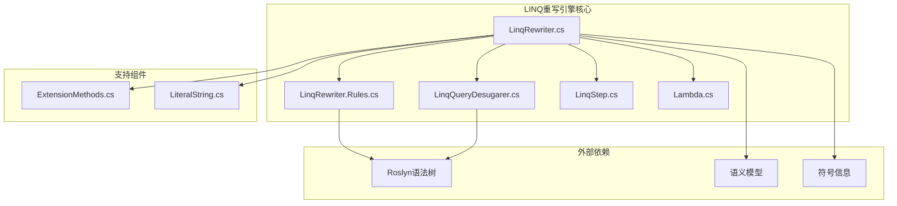
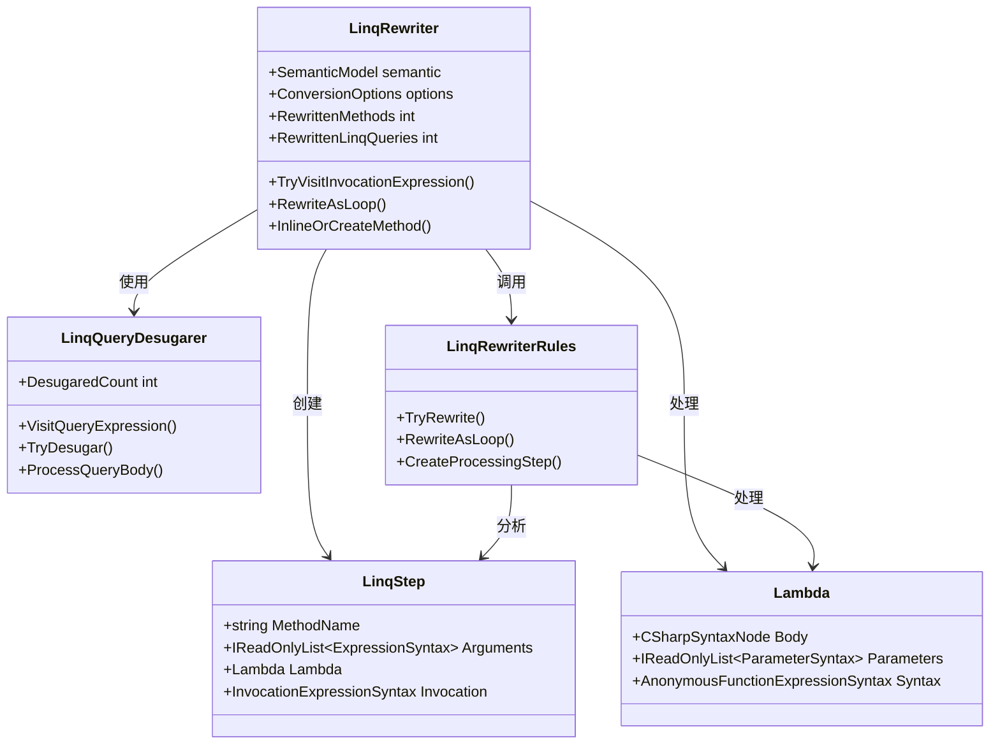
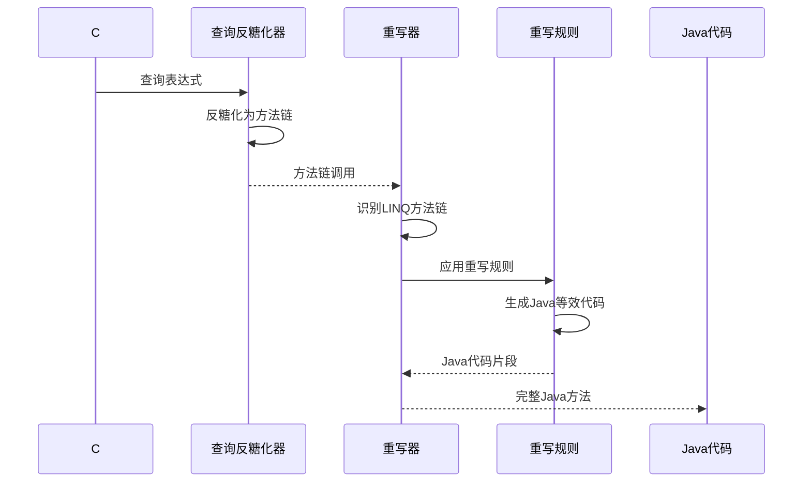
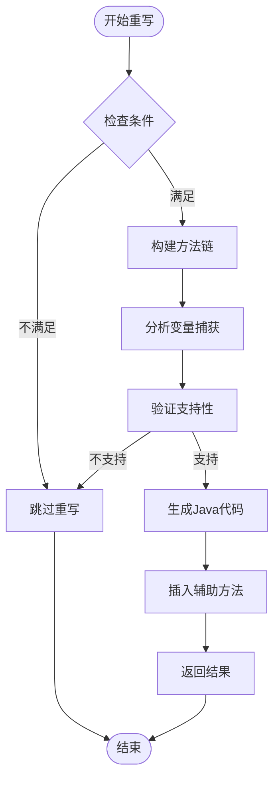
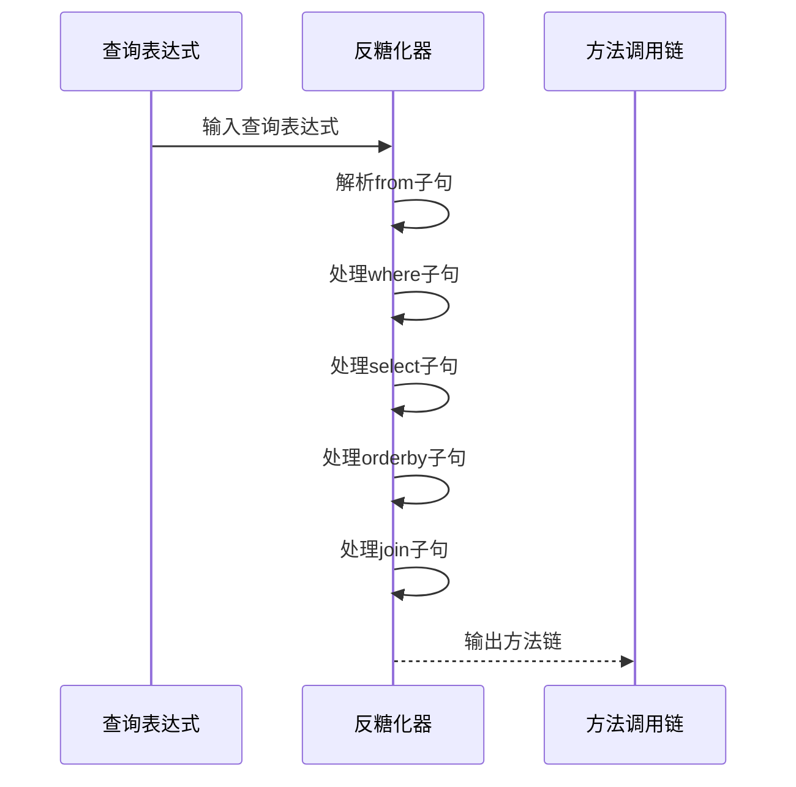
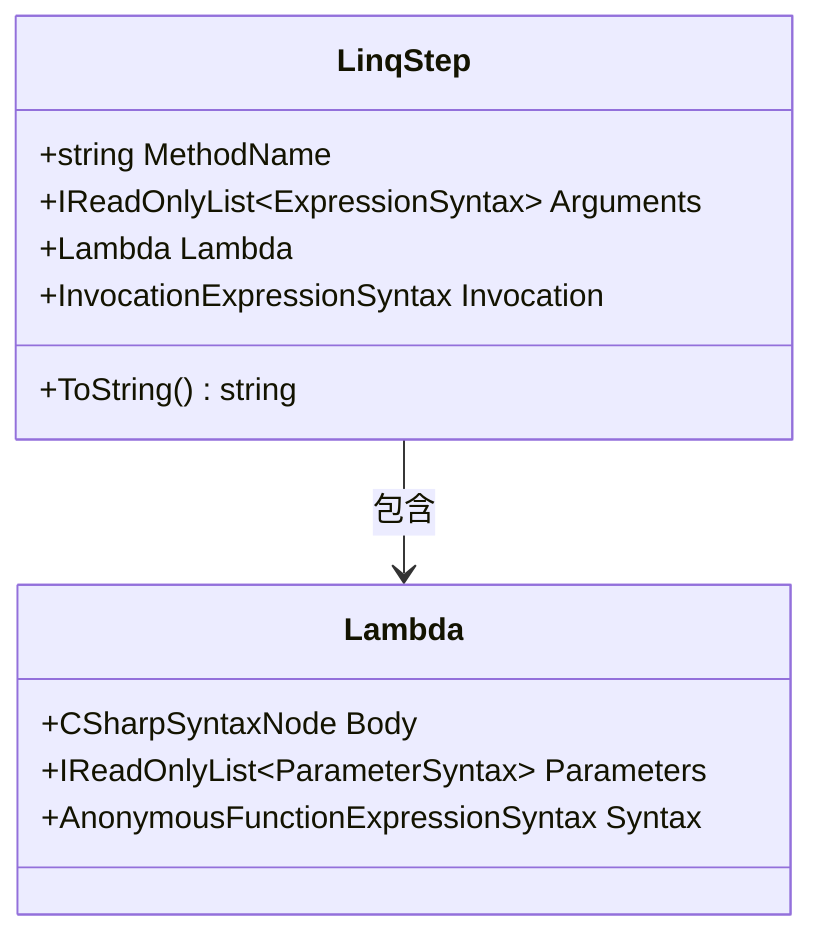
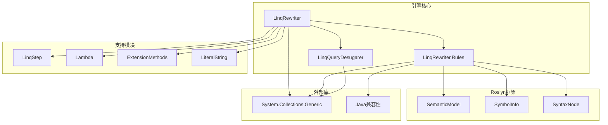
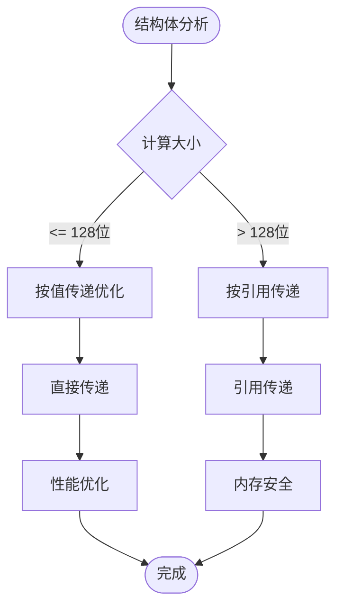
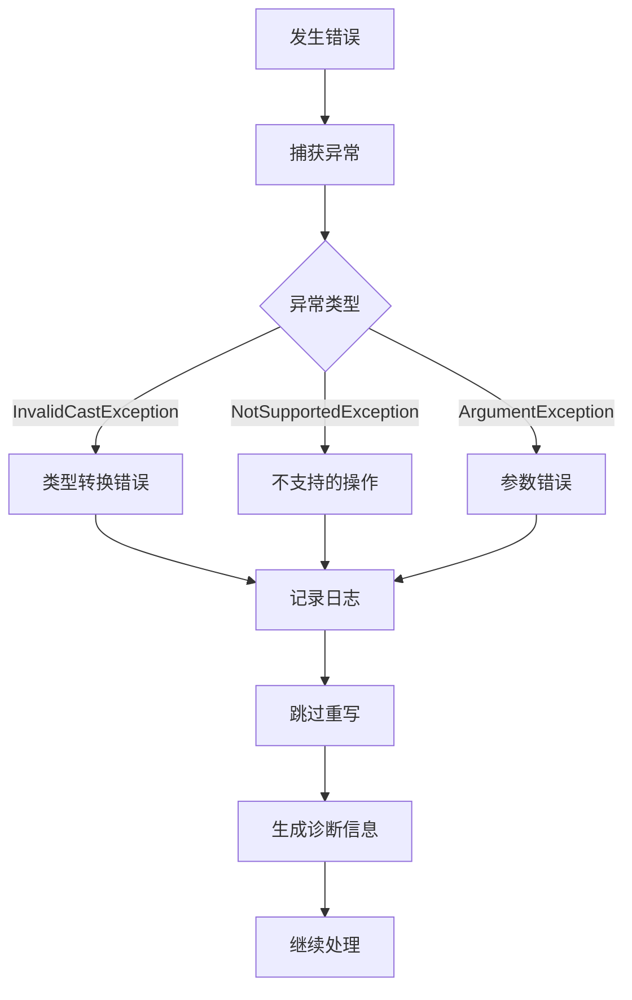

# LINQ重写引擎

<cite>
**本文档引用的文件**
- [LinqRewriter.cs](file://src/CSharpToJava.Core/LinqRewrite/LinqRewriter.cs)
- [LinqRewriter.Rules.cs](file://src/CSharpToJava.Core/LinqRewrite/LinqRewriter.Rules.cs)
- [LinqQueryDesugarer.cs](file://src/CSharpToJava.Core/LinqRewrite/LinqQueryDesugarer.cs)
- [Lambda.cs](file://src/CSharpToJava.Core/LinqRewrite/Lambda.cs)
- [LinqStep.cs](file://src/CSharpToJava.Core/LinqRewrite/LinqStep.cs)
- [ExtensionMethods.cs](file://src/CSharpToJava.Core/LinqRewrite/ExtensionMethods.cs)
- [LiteralString.cs](file://src/CSharpToJava.Core/LinqRewrite/LiteralString.cs)
</cite>

## 目录
1. [简介](#简介)
2. [项目结构](#项目结构)
3. [核心组件](#核心组件)
4. [架构概览](#架构概览)
5. [详细组件分析](#详细组件分析)
6. [依赖关系分析](#依赖关系分析)
7. [性能考虑](#性能考虑)
8. [故障排除指南](#故障排除指南)
9. [结论](#结论)
10. [附录](#附录)

## 简介

cs2j LINQ重写引擎是一个专门设计用于将C# LINQ查询转换为等效Java代码的高级编译器后端组件。该引擎通过Roslyn语法树重写技术，实现了从C#方法链调用到Java等效实现的精确转换，特别专注于处理复杂的LINQ操作符组合和匿名类型的处理。

该引擎的核心目标是提供无缝的跨语言转换体验，确保C#开发者能够充分利用LINQ的强大功能，同时在Java生态系统中保持相同的语义和性能特征。通过深度集成Roslyn语义模型，引擎能够准确分析变量捕获、数据流和类型信息，从而生成高质量的Java代码。

## 项目结构

LINQ重写引擎位于cs2j项目的核心模块中，采用模块化设计，主要包含以下关键组件：

**图表来源**
- [LinqRewriter.cs:1-50](file://src/CSharpToJava.Core/LinqRewrite/LinqRewriter.cs#L1-L50)
- [LinqRewriter.Rules.cs:1-50](file://src/CSharpToJava.Core/LinqRewrite/LinqRewriter.Rules.cs#L1-L50)
- [LinqQueryDesugarer.cs:1-50](file://src/CSharpToJava.Core/LinqRewrite/LinqQueryDesugarer.cs#L1-L50)

**章节来源**
- [LinqRewriter.cs:1-100](file://src/CSharpToJava.Core/LinqRewrite/LinqRewriter.cs#L1-L100)
- [LinqRewriter.Rules.cs:1-100](file://src/CSharpToJava.Core/LinqRewrite/LinqRewriter.Rules.cs#L1-L100)

## 核心组件

LINQ重写引擎由多个相互协作的组件构成，每个组件都有特定的职责和功能：

### 主要组件概述

1. **LinqRewriter**: 核心重写器，负责识别和转换LINQ方法链
2. **LinqQueryDesugarer**: 查询表达式反糖化器，将查询语法转换为方法链
3. **LinqStep**: 表示单个LINQ操作步骤的数据结构
4. **Lambda**: Lambda表达式的抽象表示和处理
5. **LinqRewriter.Rules**: 具体的重写规则实现

### 组件交互模式

**图表来源**
- [LinqRewriter.cs:37-60](file://src/CSharpToJava.Core/LinqRewrite/LinqRewriter.cs#L37-L60)
- [LinqRewriter.Rules.cs:37-55](file://src/CSharpToJava.Core/LinqRewrite/LinqRewriter.Rules.cs#L37-L55)
- [LinqStep.cs:33-52](file://src/CSharpToJava.Core/LinqRewrite/LinqStep.cs#L33-L52)
- [Lambda.cs:34-56](file://src/CSharpToJava.Core/LinqRewrite/Lambda.cs#L34-L56)

**章节来源**
- [LinqRewriter.cs:37-1317](file://src/CSharpToJava.Core/LinqRewrite/LinqRewriter.cs#L37-L1317)
- [LinqRewriter.Rules.cs:37-1950](file://src/CSharpToJava.Core/LinqRewrite/LinqRewriter.Rules.cs#L37-L1950)

## 架构概览

LINQ重写引擎采用分层架构设计，通过多阶段处理实现从C#到Java的转换：

**图表来源**
- [LinqQueryDesugarer.cs:19-37](file://src/CSharpToJava.Core/LinqRewrite/LinqQueryDesugarer.cs#L19-L37)
- [LinqRewriter.cs:71-121](file://src/CSharpToJava.Core/LinqRewrite/LinqRewriter.cs#L71-L121)
- [LinqRewriter.Rules.cs:37-55](file://src/CSharpToJava.Core/LinqRewrite/LinqRewriter.Rules.cs#L37-L55)

### 处理流程详解

引擎的处理流程包含三个主要阶段：

1. **查询表达式反糖化**: 将C#查询语法转换为标准的方法链调用
2. **方法链识别**: 识别连续的LINQ方法调用序列
3. **代码生成**: 为每个LINQ操作生成对应的Java实现

**章节来源**
- [LinqQueryDesugarer.cs:39-265](file://src/CSharpToJava.Core/LinqRewrite/LinqQueryDesugarer.cs#L39-L265)
- [LinqRewriter.cs:123-372](file://src/CSharpToJava.Core/LinqRewrite/LinqRewriter.cs#L123-L372)

## 详细组件分析

### LinqRewriter核心重写器

LinqRewriter是整个引擎的核心组件，负责识别和转换LINQ方法链。其设计采用了访问者模式，继承自CSharpSyntaxRewriter以遍历语法树。

#### 关键特性

1. **方法链检测**: 自动识别连续的LINQ方法调用
2. **语义分析**: 利用Roslyn语义模型分析变量捕获和数据流
3. **类型推断**: 准确推断泛型参数和返回类型
4. **异常处理**: 提供详细的错误诊断和恢复机制

#### 重写策略

**图表来源**
- [LinqRewriter.cs:123-213](file://src/CSharpToJava.Core/LinqRewrite/LinqRewriter.cs#L123-L213)
- [LinqRewriter.cs:343-358](file://src/CSharpToJava.Core/LinqRewrite/LinqRewriter.cs#L343-L358)

**章节来源**
- [LinqRewriter.cs:71-121](file://src/CSharpToJava.Core/LinqRewrite/LinqRewriter.cs#L71-L121)
- [LinqRewriter.cs:123-372](file://src/CSharpToJava.Core/LinqRewrite/LinqRewriter.cs#L123-L372)

### LinqQueryDesugarer查询反糖化器

查询反糖化器专门处理C#的查询表达式语法，将其转换为标准的方法链调用形式。这是LINQ重写过程中的关键预处理步骤。

#### 支持的查询操作

| 操作类型 | 描述 | 示例 |
|---------|------|------|
| From Clause | 数据源声明 | `from person in people` |
| Where Clause | 过滤条件 | `where person.Age > 25` |
| Select Clause | 投影操作 | `select person.Name` |
| OrderBy Clause | 排序操作 | `orderby person.Name ascending` |
| GroupBy Clause | 分组操作 | `group person by person.City` |
| Join Clause | 连接操作 | `join order in orders on person.Id equals order.CustomerId` |

#### 反糖化过程

**图表来源**
- [LinqQueryDesugarer.cs:19-94](file://src/CSharpToJava.Core/LinqRewrite/LinqQueryDesugarer.cs#L19-L94)
- [LinqQueryDesugarer.cs:96-218](file://src/CSharpToJava.Core/LinqRewrite/LinqQueryDesugarer.cs#L96-L218)

**章节来源**
- [LinqQueryDesugarer.cs:19-265](file://src/CSharpToJava.Core/LinqRewrite/LinqQueryDesugarer.cs#L19-L265)

### LinqStep方法步骤表示

LinqStep类用于表示LINQ操作序列中的单个步骤，封装了方法名、参数和相关的Lambda表达式信息。

#### 数据结构设计

**图表来源**
- [LinqStep.cs:33-52](file://src/CSharpToJava.Core/LinqRewrite/LinqStep.cs#L33-L52)
- [Lambda.cs:34-56](file://src/CSharpToJava.Core/LinqRewrite/Lambda.cs#L34-L56)

**章节来源**
- [LinqStep.cs:33-52](file://src/CSharpToJava.Core/LinqRewrite/LinqStep.cs#L33-L52)
- [Lambda.cs:34-56](file://src/CSharpToJava.Core/LinqRewrite/Lambda.cs#L34-L56)

### 重写规则实现

LinqRewriter.Rules.cs文件包含了所有具体的重写规则实现，涵盖了从基本聚合操作到复杂连接操作的所有LINQ方法。

#### 聚合操作重写

| LINQ方法 | Java等效实现 | 特殊处理 |
|---------|-------------|----------|
| Sum | 循环累加 | 类型安全检查 |
| Average | 循环累加+计数 | 浮点数精度处理 |
| Min/Max | 循环比较 | NaN值处理 |
| Count | 循环计数 | 长整型支持 |
| Any/All | 条件短路 | 布尔逻辑优化 |

#### 集合操作重写

| LINQ方法 | Java等效实现 | 复杂度 |
|---------|-------------|--------|
| Where | 条件过滤 | O(n) |
| Select | 映射变换 | O(n) |
| Distinct | 去重操作 | O(n) |
| Skip/Take | 分页操作 | O(n) |
| OrderBy | 排序操作 | O(n log n) |

**章节来源**
- [LinqRewriter.Rules.cs:37-1233](file://src/CSharpToJava.Core/LinqRewrite/LinqRewriter.Rules.cs#L37-L1233)

## 依赖关系分析

LINQ重写引擎的依赖关系体现了清晰的分层架构和模块化设计：

**图表来源**
- [LinqRewriter.cs:23-33](file://src/CSharpToJava.Core/LinqRewrite/LinqRewriter.cs#L23-L33)
- [LinqRewriter.Rules.cs:23-31](file://src/CSharpToJava.Core/LinqRewrite/LinqRewriter.Rules.cs#L23-L31)

### 关键依赖关系

1. **Roslyn集成**: 深度依赖Microsoft.CodeAnalysis库进行语法分析
2. **语义模型**: 利用SemanticModel进行类型推断和符号解析
3. **语法树操作**: 通过SyntaxFactory创建和修改语法节点
4. **Java兼容性**: 确保生成的代码符合Java语言规范

**章节来源**
- [LinqRewriter.cs:23-33](file://src/CSharpToJava.Core/LinqRewrite/LinqRewriter.cs#L23-L33)
- [LinqRewriter.Rules.cs:23-31](file://src/CSharpToJava.Core/LinqRewrite/LinqRewriter.Rules.cs#L23-L31)

## 性能考虑

LINQ重写引擎在设计时充分考虑了性能优化，采用了多种策略来确保高效的代码生成：

### 结构体大小优化

引擎实现了智能的结构体传递优化，对于小尺寸结构体会按值传递，而大尺寸结构体会按引用传递：

**图表来源**
- [LinqRewriter.cs:395-450](file://src/CSharpToJava.Core/LinqRewrite/LinqRewriter.cs#L395-L450)

### 内存管理策略

1. **缓存机制**: 结构体大小计算结果被缓存以避免重复计算
2. **对象池**: 重用临时对象减少垃圾回收压力
3. **延迟初始化**: 按需创建辅助数据结构

### 并发处理能力

引擎支持并行处理多个类型声明，通过线程安全的方式添加新方法：

**章节来源**
- [LinqRewriter.cs:1120-1149](file://src/CSharpToJava.Core/LinqRewrite/LinqRewriter.cs#L1120-L1149)

## 故障排除指南

LINQ重写引擎提供了完善的错误处理和诊断机制：

### 常见问题及解决方案

| 问题类型 | 错误原因 | 解决方案 |
|---------|---------|---------|
| 不支持的方法链 | 方法不在已知支持列表中 | 检查方法签名或使用替代实现 |
| 匿名类型错误 | Java版本不支持记录类型 | 启用Java 25记录或重构代码 |
| 变量捕获冲突 | 外部变量未正确捕获 | 检查lambda表达式的作用域 |
| 类型推断失败 | 泛型参数无法确定 | 提供显式类型参数 |
| 循环索引错误 | 数组访问越界 | 验证循环边界条件 |

### 错误诊断机制

**图表来源**
- [LinqRewriter.cs:106-121](file://src/CSharpToJava.Core/LinqRewrite/LinqRewriter.cs#L106-L121)

### 诊断信息格式

引擎生成详细的诊断信息，包括：
- 错误发生的具体行号
- 导致错误的方法名称
- 异常的详细描述
- 建议的修复方案

**章节来源**
- [LinqRewriter.cs:106-121](file://src/CSharpToJava.Core/LinqRewrite/LinqRewriter.cs#L106-L121)
- [LinqRewriter.cs:1303-1312](file://src/CSharpToJava.Core/LinqRewrite/LinqRewriter.cs#L1303-L1312)

## 结论

cs2j LINQ重写引擎代表了跨语言代码转换领域的先进实践，通过精心设计的架构和实现策略，成功解决了C#到Java转换中的复杂挑战。

### 主要成就

1. **完整的LINQ支持**: 覆盖了从基础操作到复杂连接的所有LINQ方法
2. **智能类型推断**: 准确处理泛型参数和返回类型
3. **高性能实现**: 优化的算法和数据结构确保高效的代码生成
4. **健壮的错误处理**: 完善的异常处理和诊断机制

### 技术创新

- **方法链重写**: 独特的方法链识别和重写机制
- **匿名类型处理**: 通过Java记录类型支持匿名类型
- **变量捕获分析**: 精确的变量捕获和作用域分析
- **查询表达式反糖化**: 将复杂查询语法转换为简单方法链

该引擎为现代C#代码的Java移植提供了可靠的技术基础，是cs2j项目的重要技术支柱。

## 附录

### 支持的LINQ方法清单

| 方法类别 | 支持的方法 | 备注 |
|---------|-----------|------|
| 聚合操作 | Sum, Average, Min, Max, Count | 基础聚合 |
| 条件操作 | Where, Any, All, Contains | 过滤和存在性检查 |
| 变换操作 | Select, OfType, Cast | 数据映射 |
| 分组操作 | GroupBy, GroupJoin | 数据分组 |
| 连接操作 | Join, Concat, Union, Intersect, Except | 集合运算 |
| 排序操作 | OrderBy, ThenBy, Skip, Take | 排序和分页 |
| 转换操作 | ToList, ToArray, ToDictionary, ToHashSet | 结果转换 |

### 配置选项

| 选项名称 | 类型 | 默认值 | 描述 |
|---------|------|--------|------|
| UseRecords | bool | false | 是否使用Java记录类型 |
| TargetJavaVersion | int | 8 | 目标Java版本 |
| EnableOptimizations | bool | true | 是否启用优化 |
| StrictMode | bool | false | 是否启用严格模式 |