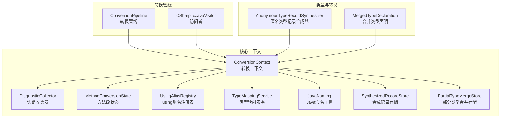
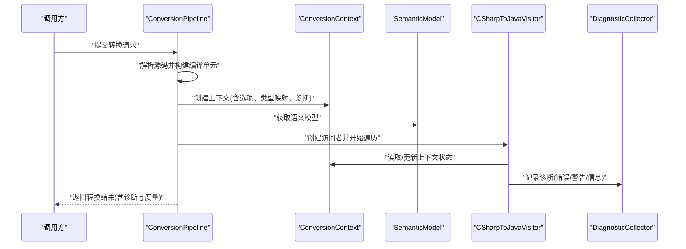
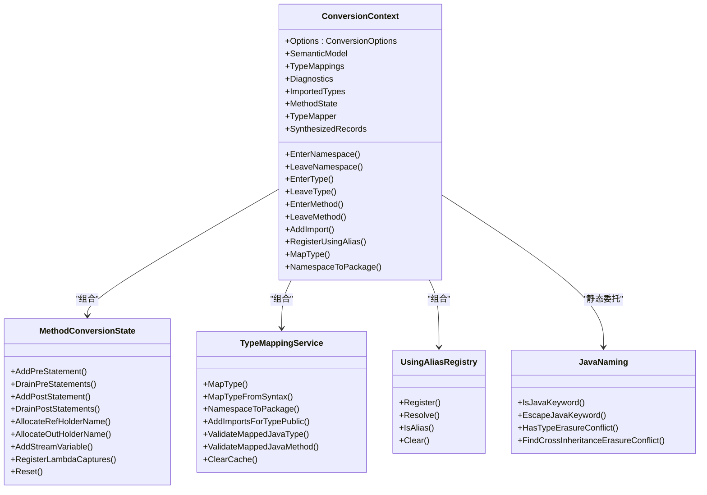
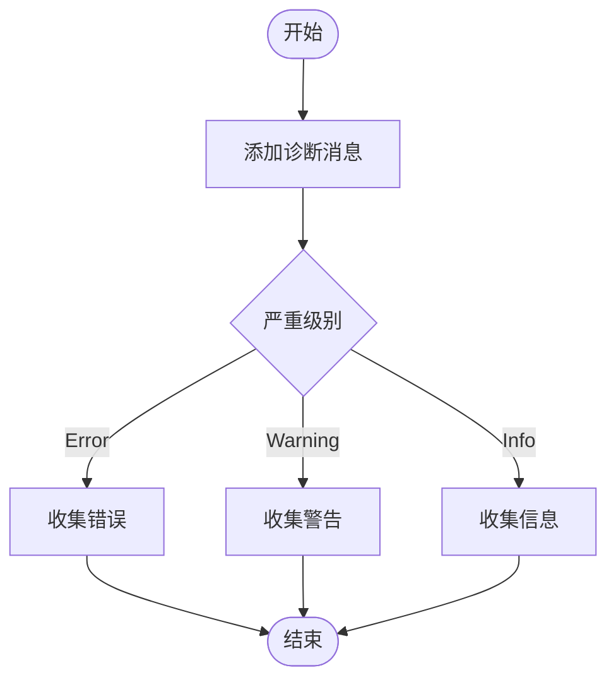
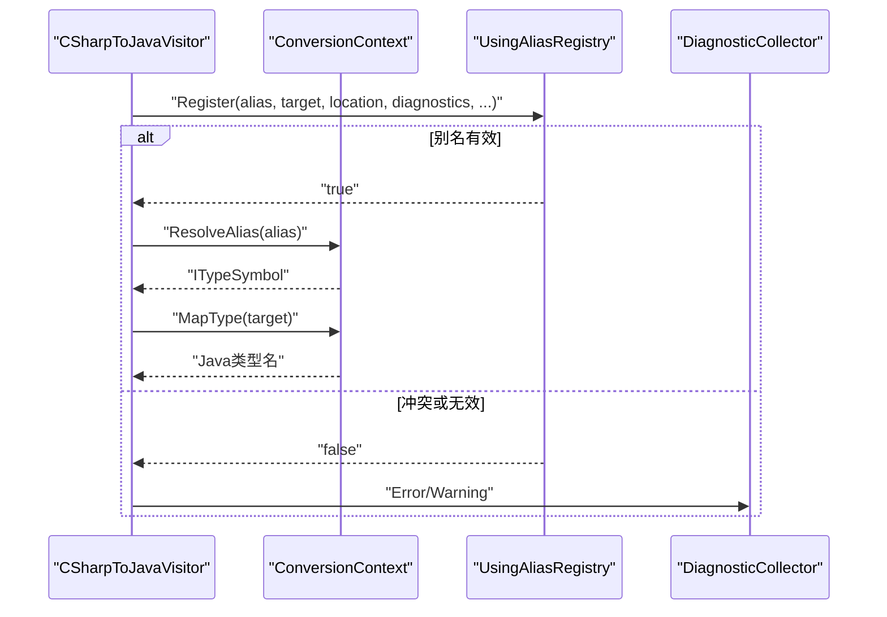
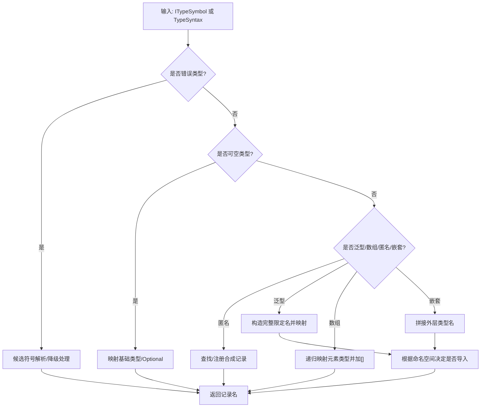
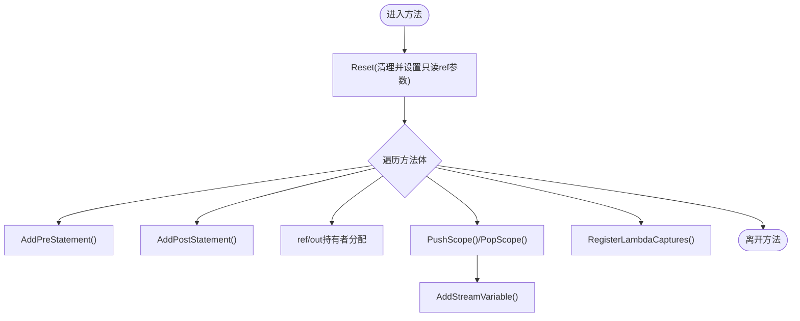
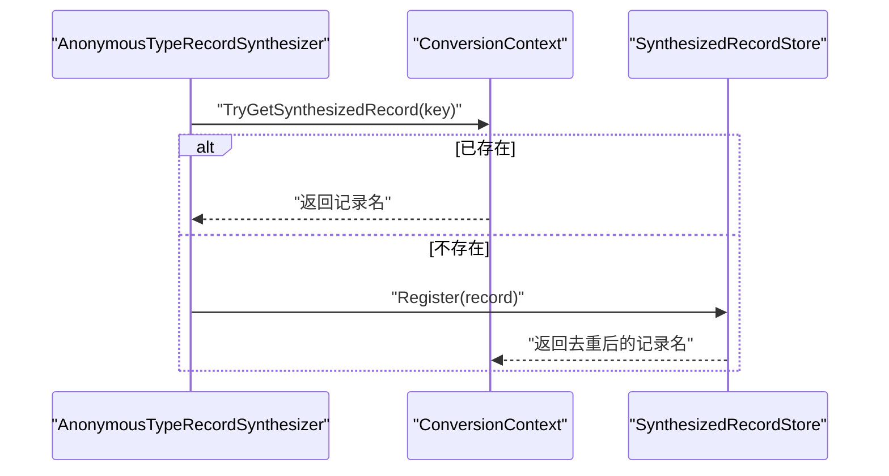
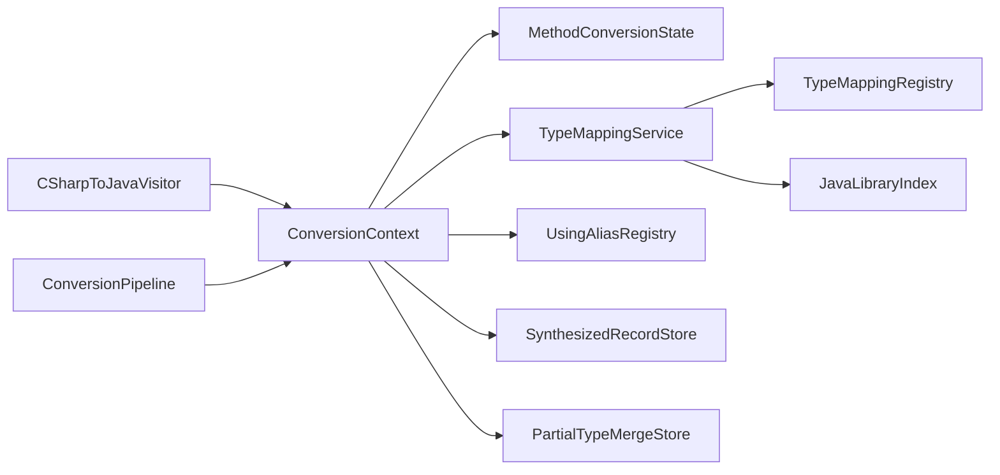

# 上下文和状态管理

<cite>
**本文档引用的文件**
- [ConversionContext.cs](file://src/CSharpToJava.Core/Context/ConversionContext.cs)
- [DiagnosticCollector.cs](file://src/CSharpToJava.Core/Context/DiagnosticCollector.cs)
- [UsingAliasRegistry.cs](file://src/CSharpToJava.Core/Context/UsingAliasRegistry.cs)
- [ConversionOptions.cs](file://src/CSharpToJava.Core/Context/ConversionOptions.cs)
- [JavaNaming.cs](file://src/CSharpToJava.Core/Context/JavaNaming.cs)
- [MethodConversionState.cs](file://src/CSharpToJava.Core/Context/MethodConversionState.cs)
- [SynthesizedRecordStore.cs](file://src/CSharpToJava.Core/Context/SynthesizedRecordStore.cs)
- [PartialTypeMergeStore.cs](file://src/CSharpToJava.Core/Context/PartialTypeMergeStore.cs)
- [TypeMappingService.cs](file://src/CSharpToJava.Core/Context/TypeMappingService.cs)
- [AnonymousTypeRecordSynthesizer.cs](file://src/CSharpToJava.Core/Transformers/AnonymousTypeRecordSynthesizer.cs)
- [MergedTypeDeclaration.cs](file://src/CSharpToJava.Core/PartialType/MergedTypeDeclaration.cs)
- [ConversionPipeline.cs](file://src/CSharpToJava.Core/Pipeline/ConversionPipeline.cs)
- [CSharpToJavaVisitor.cs](file://src/CSharpToJava.Core/Visitors/CSharpToJavaVisitor.cs)
</cite>

## 目录
1. [简介](#简介)
2. [项目结构](#项目结构)
3. [核心组件](#核心组件)
4. [架构总览](#架构总览)
5. [详细组件分析](#详细组件分析)
6. [依赖关系分析](#依赖关系分析)
7. [性能考虑](#性能考虑)
8. [故障排查指南](#故障排查指南)
9. [结论](#结论)

## 简介
本文件系统性阐述 cs2j 的上下文与状态管理系统，重点覆盖以下方面：
- 转换上下文的作用与实现机制，以及如何在转换过程中维护全局状态
- 诊断系统的设计与使用，包括错误收集、警告处理与调试信息输出
- 导入注册表的工作原理，包括 using 别名的处理与 Java 导入语句生成
- 状态管理最佳实践与性能优化建议
- 上下文在不同转换阶段中的作用与生命周期
- 常见状态管理问题的解决方案

## 项目结构
cs2j 的上下文与状态管理主要集中在 Core 工程的 Context 与 Pipeline 子目录中，配合 Transform、Visitors、PartialType 等模块协同工作。

**图表来源**
- [ConversionContext.cs:14-234](file://src/CSharpToJava.Core/Context/ConversionContext.cs#L14-L234)
- [DiagnosticCollector.cs:8-50](file://src/CSharpToJava.Core/Context/DiagnosticCollector.cs#L8-L50)
- [MethodConversionState.cs:8-198](file://src/CSharpToJava.Core/Context/MethodConversionState.cs#L8-L198)
- [UsingAliasRegistry.cs:10-95](file://src/CSharpToJava.Core/Context/UsingAliasRegistry.cs#L10-L95)
- [TypeMappingService.cs:11-677](file://src/CSharpToJava.Core/Context/TypeMappingService.cs#L11-L677)
- [JavaNaming.cs:9-119](file://src/CSharpToJava.Core/Context/JavaNaming.cs#L9-L119)
- [SynthesizedRecordStore.cs:9-42](file://src/CSharpToJava.Core/Context/SynthesizedRecordStore.cs#L9-L42)
- [PartialTypeMergeStore.cs:10-53](file://src/CSharpToJava.Core/Context/PartialTypeMergeStore.cs#L10-L53)
- [ConversionPipeline.cs:67-443](file://src/CSharpToJava.Core/Pipeline/ConversionPipeline.cs#L67-L443)
- [CSharpToJavaVisitor.cs:15-200](file://src/CSharpToJava.Core/Visitors/CSharpToJavaVisitor.cs#L15-L200)
- [AnonymousTypeRecordSynthesizer.cs:51-243](file://src/CSharpToJava.Core/Transformers/AnonymousTypeRecordSynthesizer.cs#L51-L243)
- [MergedTypeDeclaration.cs:11-181](file://src/CSharpToJava.Core/PartialType/MergedTypeDeclaration.cs#L11-L181)

**章节来源**
- [ConversionContext.cs:14-234](file://src/CSharpToJava.Core/Context/ConversionContext.cs#L14-L234)
- [ConversionPipeline.cs:67-443](file://src/CSharpToJava.Core/Pipeline/ConversionPipeline.cs#L67-L443)

## 核心组件
本节概述上下文与状态管理的关键组件及其职责。

- 转换上下文（ConversionContext）
  - 维护当前命名空间、类型、方法栈，以及异步/lambda/yield 等上下文标志
  - 提供方法级状态（预/后置语句、ref/out 持有者、流变量、LINQ let 别名等）
  - 管理导入集合、using 别名、合成记录、部分类型合并等
  - 提供类型映射服务（TypeMappingService）与命名工具（JavaNaming）

- 诊断收集器（DiagnosticCollector）
  - 收集 Info/Warning/Error 级别的诊断消息
  - 为后续转换结果与报告提供统一的数据源

- 方法级状态（MethodConversionState）
  - 跟踪方法体内的预/后置语句队列、ref/out 持有者分配、作用域内流变量
  - 维护 lambda 捕获信息与查询 let 别名映射
  - 在进入新方法时重置，确保状态隔离

- using 别名注册表（UsingAliasRegistry）
  - 跟踪文件级 using 别名，避免重复与关键字冲突
  - 提供别名解析与清理能力

- 类型映射服务（TypeMappingService）
  - 实现 C# 类型到 Java 类型的映射、命名空间到包的映射
  - 维护 per-file 类型缓存与导入集合，支持元数据驱动验证
  - 处理可空类型、数组、泛型、匿名类型、嵌套类型等复杂场景

- Java 命名工具（JavaNaming）
  - 关键字转义、类型擦除冲突检测与重命名后缀生成
  - 跨继承链的类型擦除冲突查找

- 合成记录存储（SynthesizedRecordStore）
  - 保存从 C# 匿名类型派生的 Java record 定义，去重与命名冲突处理

- 部分类型合并存储（PartialTypeMergeStore）
  - 记录项目级转换中部分类型的合并关系，支持跨文件分析

**章节来源**
- [ConversionContext.cs:14-234](file://src/CSharpToJava.Core/Context/ConversionContext.cs#L14-L234)
- [DiagnosticCollector.cs:8-50](file://src/CSharpToJava.Core/Context/DiagnosticCollector.cs#L8-L50)
- [MethodConversionState.cs:8-198](file://src/CSharpToJava.Core/Context/MethodConversionState.cs#L8-L198)
- [UsingAliasRegistry.cs:10-95](file://src/CSharpToJava.Core/Context/UsingAliasRegistry.cs#L10-L95)
- [TypeMappingService.cs:11-677](file://src/CSharpToJava.Core/Context/TypeMappingService.cs#L11-L677)
- [JavaNaming.cs:9-119](file://src/CSharpToJava.Core/Context/JavaNaming.cs#L9-L119)
- [SynthesizedRecordStore.cs:9-42](file://src/CSharpToJava.Core/Context/SynthesizedRecordStore.cs#L9-L42)
- [PartialTypeMergeStore.cs:10-53](file://src/CSharpToJava.Core/Context/PartialTypeMergeStore.cs#L10-L53)

## 架构总览
转换管线在执行前构建转换上下文，随后通过访问者遍历语法树，驱动各类转换器完成类型、成员、表达式与语句的转换。上下文贯穿始终，负责状态维护与跨组件协调。

**图表来源**
- [ConversionPipeline.cs:115-221](file://src/CSharpToJava.Core/Pipeline/ConversionPipeline.cs#L115-L221)
- [CSharpToJavaVisitor.cs:29-116](file://src/CSharpToJava.Core/Visitors/CSharpToJavaVisitor.cs#L29-L116)
- [ConversionContext.cs:113-127](file://src/CSharpToJava.Core/Context/ConversionContext.cs#L113-L127)

**章节来源**
- [ConversionPipeline.cs:115-221](file://src/CSharpToJava.Core/Pipeline/ConversionPipeline.cs#L115-L221)
- [CSharpToJavaVisitor.cs:29-116](file://src/CSharpToJava.Core/Visitors/CSharpToJavaVisitor.cs#L29-L116)

## 详细组件分析

### 转换上下文（ConversionContext）
- 全局状态
  - 命名空间/类型/方法栈用于确定当前转换位置
  - 异步/lambda/yield/接口体等上下文标志影响生成策略
  - 导入集合与类型缓存由 TypeMappingService 维护
- 方法级状态
  - MethodConversionState 提供预/后置语句队列、ref/out 持有者分配、作用域内流变量与 lambda 捕获登记
- 合成记录与部分类型
  - SynthesizedRecordStore 与 PartialTypeMergeStore 提供跨文件的记录与类型合并状态
- 别名与导入
  - UsingAliasRegistry 负责 using 别名注册与解析；AddImport 过滤无效导入并去重
- 类型映射与命名
  - TypeMappingService 执行映射与导入生成；JavaNaming 提供关键字转义与擦除冲突检测

**图表来源**
- [ConversionContext.cs:14-234](file://src/CSharpToJava.Core/Context/ConversionContext.cs#L14-L234)
- [MethodConversionState.cs:8-198](file://src/CSharpToJava.Core/Context/MethodConversionState.cs#L8-L198)
- [TypeMappingService.cs:11-677](file://src/CSharpToJava.Core/Context/TypeMappingService.cs#L11-L677)
- [UsingAliasRegistry.cs:10-95](file://src/CSharpToJava.Core/Context/UsingAliasRegistry.cs#L10-L95)
- [JavaNaming.cs:9-119](file://src/CSharpToJava.Core/Context/JavaNaming.cs#L9-L119)

**章节来源**
- [ConversionContext.cs:14-234](file://src/CSharpToJava.Core/Context/ConversionContext.cs#L14-L234)

### 诊断系统（DiagnosticCollector）
- 设计要点
  - 统一的消息结构包含严重级别、消息文本、位置、代码与分类
  - 提供 Error/Warning/Info 三类记录方法，便于分级处理
- 使用方式
  - 转换上下文与类型映射服务在遇到不确定或潜在问题时记录诊断
  - 转换结果汇总所有诊断，供 CLI 或测试框架消费

**图表来源**
- [DiagnosticCollector.cs:8-50](file://src/CSharpToJava.Core/Context/DiagnosticCollector.cs#L8-L50)

**章节来源**
- [DiagnosticCollector.cs:8-50](file://src/CSharpToJava.Core/Context/DiagnosticCollector.cs#L8-L50)

### 导入注册表（UsingAliasRegistry）
- 功能
  - 注册文件级 using 别名，检查重复、Java 关键字冲突与命名空间冲突
  - 提供别名解析与清理能力，确保访问者在处理 using 时能正确映射到 Java 类型
- 与上下文协作
  - 访问者在处理 using 时调用上下文的别名注册与解析接口
  - 上下文在文件开始时清空别名，保证每文件独立

**图表来源**
- [UsingAliasRegistry.cs:19-75](file://src/CSharpToJava.Core/Context/UsingAliasRegistry.cs#L19-L75)
- [CSharpToJavaVisitor.cs:180-200](file://src/CSharpToJava.Core/Visitors/CSharpToJavaVisitor.cs#L180-L200)

**章节来源**
- [UsingAliasRegistry.cs:10-95](file://src/CSharpToJava.Core/Context/UsingAliasRegistry.cs#L10-L95)
- [CSharpToJavaVisitor.cs:180-200](file://src/CSharpToJava.Core/Visitors/CSharpToJavaVisitor.cs#L180-L200)

### 类型映射与导入生成（TypeMappingService）
- 映射策略
  - 错误类型降级与候选符号解析、可空类型包装/Optional、数组与泛型参数映射
  - 匿名类型 → 合成记录查找、嵌套类型与跨命名空间导入
  - 基于配置与命名空间映射的类型替换
- 导入生成
  - 通过映射配置与语义分析推导所需 Java 导入，避免裸包导入与 java.lang 重复
- 元数据验证
  - 当配置了 Java 标准库元数据路径时，验证映射的 Java 类型与方法是否存在

**图表来源**
- [TypeMappingService.cs:122-455](file://src/CSharpToJava.Core/Context/TypeMappingService.cs#L122-L455)

**章节来源**
- [TypeMappingService.cs:11-677](file://src/CSharpToJava.Core/Context/TypeMappingService.cs#L11-L677)

### 方法级状态（MethodConversionState）
- 作用域与流变量
  - 以作用域深度跟踪局部流变量，离开作用域自动清理
- 预/后置语句
  - 避免重复插入，确保初始化与收尾逻辑有序执行
- ref/out 持有者
  - 为 ref/out 参数分配唯一持有者名称，支持只读 ref 结构体参数识别
- 查询与捕获
  - LINQ let 别名映射与 lambda 捕获信息登记，便于后续生成闭包与变量提升

**图表来源**
- [MethodConversionState.cs:175-196](file://src/CSharpToJava.Core/Context/MethodConversionState.cs#L175-L196)

**章节来源**
- [MethodConversionState.cs:8-198](file://src/CSharpToJava.Core/Context/MethodConversionState.cs#L8-L198)

### 合成记录与部分类型（SynthesizedRecordStore 与 PartialTypeMergeStore）
- 合成记录
  - 从 C# 匿名类型提取字段与类型，生成 Java record 名称与构造调用
  - 去重与命名冲突处理，确保同一结构仅生成一次
- 部分类型
  - 记录合并关系与原始语法节点映射，支持跨文件的类型合并与去重

**图表来源**
- [AnonymousTypeRecordSynthesizer.cs:59-86](file://src/CSharpToJava.Core/Transformers/AnonymousTypeRecordSynthesizer.cs#L59-L86)
- [SynthesizedRecordStore.cs:21-34](file://src/CSharpToJava.Core/Context/SynthesizedRecordStore.cs#L21-L34)

**章节来源**
- [AnonymousTypeRecordSynthesizer.cs:51-243](file://src/CSharpToJava.Core/Transformers/AnonymousTypeRecordSynthesizer.cs#L51-L243)
- [SynthesizedRecordStore.cs:9-42](file://src/CSharpToJava.Core/Context/SynthesizedRecordStore.cs#L9-L42)
- [PartialTypeMergeStore.cs:10-53](file://src/CSharpToJava.Core/Context/PartialTypeMergeStore.cs#L10-L53)
- [MergedTypeDeclaration.cs:11-181](file://src/CSharpToJava.Core/PartialType/MergedTypeDeclaration.cs#L11-L181)

## 依赖关系分析
- 组件耦合
  - ConversionContext 组合 MethodConversionState、TypeMappingService、UsingAliasRegistry、SynthesizedRecordStore、PartialTypeMergeStore，形成强内聚的状态中心
  - TypeMappingService 依赖类型映射配置与可选的 Java 元数据索引，提供类型映射与导入生成
  - JavaNaming 作为静态工具被多处调用，降低耦合度
- 外部依赖
  - Roslyn 语义模型与语法树用于类型解析与符号定位
  - .NET 反射与元数据引用用于扩展方法与标准库识别

**图表来源**
- [ConversionContext.cs:113-127](file://src/CSharpToJava.Core/Context/ConversionContext.cs#L113-L127)
- [TypeMappingService.cs:37-53](file://src/CSharpToJava.Core/Context/TypeMappingService.cs#L37-L53)
- [ConversionPipeline.cs:136-136](file://src/CSharpToJava.Core/Pipeline/ConversionPipeline.cs#L136-L136)
- [CSharpToJavaVisitor.cs:20-24](file://src/CSharpToJava.Core/Visitors/CSharpToJavaVisitor.cs#L20-L24)

**章节来源**
- [ConversionContext.cs:113-127](file://src/CSharpToJava.Core/Context/ConversionContext.cs#L113-L127)
- [TypeMappingService.cs:37-53](file://src/CSharpToJava.Core/Context/TypeMappingService.cs#L37-L53)
- [ConversionPipeline.cs:136-136](file://src/CSharpToJava.Core/Pipeline/ConversionPipeline.cs#L136-L136)
- [CSharpToJavaVisitor.cs:20-24](file://src/CSharpToJava.Core/Visitors/CSharpToJavaVisitor.cs#L20-L24)

## 性能考虑
- 缓存与去重
  - TypeCache 与 ImportedTypes 降低重复映射与导入开销
  - 合成记录去重避免重复生成
- 作用域与状态清理
  - 方法进入时 Reset，离开时清空临时状态，减少内存占用
  - 流变量按作用域自动清理，避免泄漏
- 并行与增量
  - 项目级转换支持并行处理（选项 EnableParallelProjectPasses），但需注意状态隔离
- 元数据验证
  - 仅在配置了 JavaMetadataPath 时启用，避免不必要的 IO 与校验

[本节为通用指导，无需特定文件引用]

## 故障排查指南
- 常见问题与定位
  - 未解析类型：检查候选符号解析与短名/全名映射，确认导入集合是否正确
  - Java 关键字冲突：使用 JavaNaming.EscapeJavaKeyword 转义，或调整命名
  - 类型擦除冲突：利用 JavaNaming.HasTypeErasureConflict 与重命名后缀规避
  - using 别名冲突：UsingAliasRegistry 会记录重复与关键字冲突，修正别名或目标类型
- 诊断信息使用
  - 通过 DiagnosticCollector.Messages 获取错误/警告/信息列表，结合位置定位问题
  - 转换结果中包含诊断与度量，便于 CI/CD 集成与自动化报告

**章节来源**
- [DiagnosticCollector.cs:8-50](file://src/CSharpToJava.Core/Context/DiagnosticCollector.cs#L8-L50)
- [JavaNaming.cs:37-51](file://src/CSharpToJava.Core/Context/JavaNaming.cs#L37-L51)
- [UsingAliasRegistry.cs:28-52](file://src/CSharpToJava.Core/Context/UsingAliasRegistry.cs#L28-L52)
- [TypeMappingService.cs:126-186](file://src/CSharpToJava.Core/Context/TypeMappingService.cs#L126-L186)

## 结论
cs2j 的上下文与状态管理体系通过 ConversionContext 将方法级状态、类型映射、导入管理、别名解析与诊断收集整合为一体，配合访问者与管线在不同转换阶段中维持一致且可追踪的状态。借助清晰的职责划分与严格的生命周期管理，系统在复杂 C# 到 Java 的转换场景中保持高可靠性与可维护性。