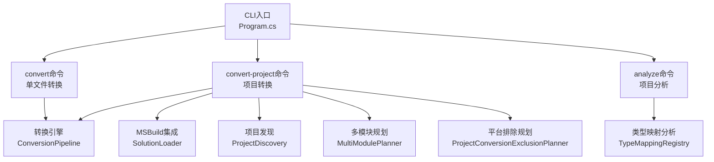
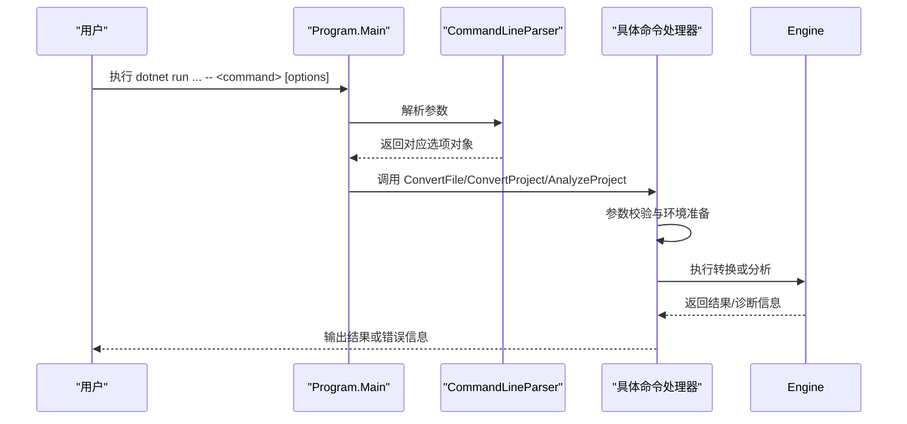
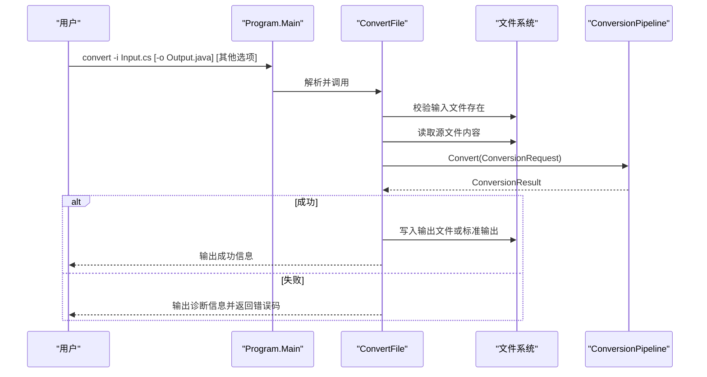
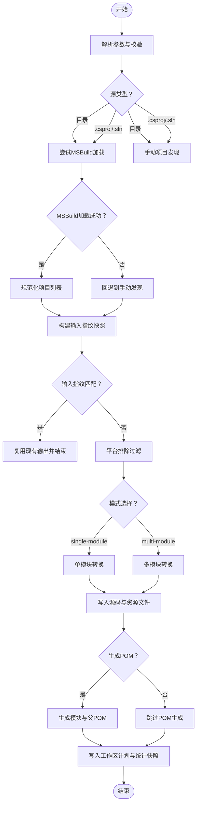
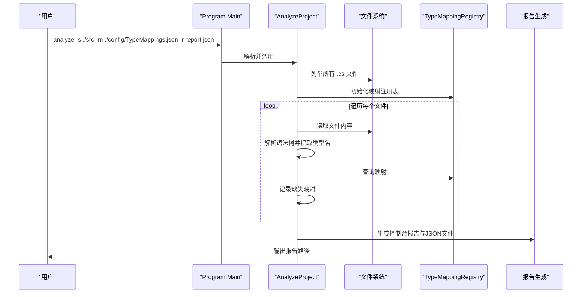
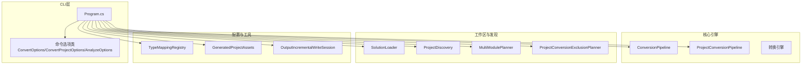

# CLI命令详解

<cite>
**本文档引用的文件**
- [Program.cs](file://src/CSharpToJava.CLI/Program.cs)
- [CSharpToJava.CLI.csproj](file://src/CSharpToJava.CLI/CSharpToJava.CLI.csproj)
- [README.md](file://README.md)
- [CLAUDE.md](file://CLAUDE.md)
- [ProjectDiscovery.cs](file://src/CSharpToJava.CLI/ProjectDiscovery.cs)
- [MultiModulePlanner.cs](file://src/CSharpToJava.CLI/MultiModulePlanner.cs)
- [ProjectConversionExclusionPlanner.cs](file://src/CSharpToJava.CLI/ProjectConversionExclusionPlanner.cs)
- [convert-agl-graphlayout.sh](file://convert-agl-graphlayout.sh)
- [convert-agl-graphlayout.bat](file://convert-agl-graphlayout.bat)
</cite>

## 目录
1. [简介](#简介)
2. [项目结构](#项目结构)
3. [核心组件](#核心组件)
4. [架构总览](#架构总览)
5. [详细组件分析](#详细组件分析)
6. [依赖关系分析](#依赖关系分析)
7. [性能考虑](#性能考虑)
8. [故障排除指南](#故障排除指南)
9. [结论](#结论)
10. [附录](#附录)

## 简介
本文件为 cs2j CLI 命令系统的详细参考文档，覆盖以下三个核心命令：
- convert：单文件转换，支持输入输出处理与错误诊断
- convert-project：项目级转换，支持单模块/多模块模式、MSBuild 集成、增量转换与并行处理
- analyze：项目分析与兼容性检查，生成类型映射覆盖率报告

文档基于仓库源码进行深入分析，提供命令使用方法、执行流程、数据流、错误处理策略以及最佳实践与常见问题解决方案。

## 项目结构
CLI 位于 src/CSharpToJava.CLI 目录，核心入口为 Program.cs，采用 CommandLineParser 库解析命令与参数。项目通过引用核心转换引擎与工作区加载器实现从单文件到大型项目的完整转换能力。

**图表来源**
- [Program.cs:13-25](file://src/CSharpToJava.CLI/Program.cs#L13-L25)
- [CSharpToJava.CLI.csproj:3-7](file://src/CSharpToJava.CLI/CSharpToJava.CLI.csproj#L3-L7)

**章节来源**
- [Program.cs:13-25](file://src/CSharpToJava.CLI/Program.cs#L13-L25)
- [CSharpToJava.CLI.csproj:1-34](file://src/CSharpToJava.CLI/CSharpToJava.CLI.csproj#L1-L34)

## 核心组件
- 命令分发：通过 CommandLineParser 将命令行参数映射到 ConvertOptions、ConvertProjectOptions、AnalyzeOptions，并调用对应处理函数
- 转换引擎：ConversionPipeline 提供单文件转换；ProjectConversionPipeline 提供项目级转换
- 工作区加载：SolutionLoader 用于 MSBuild 方式加载解决方案与项目
- 项目发现：ProjectDiscovery 解析 .sln/.csproj，构建项目图并按拓扑排序
- 多模块规划：MultiModulePlanner 将项目图映射为模块计划，支持测试模块与编译依赖
- 平台排除：ProjectConversionExclusionPlanner 基于项目文件属性判断 Windows-only 项目并排除
- 增量转换：基于输入指纹快照与输出清单实现重复转换复用

**章节来源**
- [Program.cs:18-24](file://src/CSharpToJava.CLI/Program.cs#L18-L24)
- [ProjectDiscovery.cs:36-116](file://src/CSharpToJava.CLI/ProjectDiscovery.cs#L36-L116)
- [MultiModulePlanner.cs:25-127](file://src/CSharpToJava.CLI/MultiModulePlanner.cs#L25-L127)
- [ProjectConversionExclusionPlanner.cs:13-104](file://src/CSharpToJava.CLI/ProjectConversionExclusionPlanner.cs#L13-L104)

## 架构总览
CLI 的整体执行路径如下：

**图表来源**
- [Program.cs:13-25](file://src/CSharpToJava.CLI/Program.cs#L13-L25)

## 详细组件分析

### convert 命令详解
- 功能概述
  - 将单个 C# 文件转换为 Java 源码，支持输出到文件或标准输出
  - 支持类型映射配置、Java 版本、是否生成 JavaDoc、是否使用 Java Records、是否使用 Optional 等选项
- 输入输出处理
  - 输入：通过 -i/--input 指定 C# 源文件路径
  - 输出：通过 -o/--output 指定 Java 输出文件路径；未指定时输出到标准输出
  - 写入编码：UTF-8（无 BOM）
- 错误处理机制
  - 文件不存在：直接返回错误码 1
  - 转换失败：打印诊断信息（严重性、类别、消息、位置），返回错误码 1
  - 异常捕获：捕获通用异常并输出错误消息，可选输出堆栈跟踪
- 执行流程
  1) 参数解析与校验
  2) 读取源文件内容
  3) 构造 ConversionOptions（含目标 Java 版本、映射配置、是否生成 JavaDoc、是否使用 Records、是否使用 Optional、是否启用 LINQ 重写、是否偏好 Stream API、是否启用并行项目 Pass）
  4) 创建 ConversionPipeline 并执行 Convert
  5) 成功：写入输出文件或标准输出；可选打印诊断信息
  6) 失败：打印诊断信息并返回错误码

**图表来源**
- [Program.cs:27-109](file://src/CSharpToJava.CLI/Program.cs#L27-L109)

**章节来源**
- [Program.cs:27-109](file://src/CSharpToJava.CLI/Program.cs#L27-L109)
- [README.md:32-48](file://README.md#L32-L48)

- 使用示例
  - 单文件转换到文件：dotnet run --project src/CSharpToJava.CLI/CSharpToJava.CLI.csproj -- convert -i Input.cs -o Output.java
  - 单文件转换到标准输出：dotnet run --project src/CSharpToJava.CLI/CSharpToJava.CLI.csproj -- convert -i Input.cs
  - 指定类型映射配置与 Java 版本：dotnet run --project src/CSharpToJava.CLI/CSharpToJava.CLI.csproj -- convert -i Input.cs -o Output.java -m ./config/TypeMappings.json -j Java25
- 最佳实践
  - 明确指定 -m 以确保类型映射一致性
  - 在 CI 中使用 -v 查看诊断信息以便定位问题
  - 对大文件转换建议先在小范围内验证映射配置
- 常见问题
  - 输入文件不存在：检查 -i 路径是否正确
  - 类型映射缺失：查看诊断信息中的缺失类型并补充映射配置
  - 编码问题：确保输入文件为 UTF-8 编码

### convert-project 命令详解
- 功能概述
  - 将整个 C# 项目（目录、.csproj 或 .sln）转换为 Java 项目
  - 支持单模块与多模块两种输出模式
  - 支持 MSBuild 集成、增量转换、并行处理与 Maven POM 生成
- 模式说明
  - single-module：将所有项目合并到单一模块中，适合小型项目或快速原型
  - multi-module：根据项目依赖关系生成多个模块，支持测试模块与内部模块引用，适合大型企业级项目
- MSBuild 集成
  - 优先尝试通过 SolutionLoader 加载解决方案与项目，获得更准确的语义上下文
  - 若加载失败，回退到手动项目发现（ProjectDiscovery），扫描 .csproj 与资源文件
- 增量转换
  - 通过输入指纹快照（InputFingerprintSnapshot）与输出清单（OutputIncrementalWriteSession）判断输入是否变化
  - 未变化则直接复用已有输出，避免重复转换
- 并行处理
  - 支持项目级 Pass 的并行执行（可通过选项控制）
  - 多模块模式下，模块间转换可独立进行
- 执行流程（概览）

**图表来源**
- [Program.cs:111-304](file://src/CSharpToJava.CLI/Program.cs#L111-L304)
- [Program.cs:306-964](file://src/CSharpToJava.CLI/Program.cs#L306-L964)

**章节来源**
- [Program.cs:111-304](file://src/CSharpToJava.CLI/Program.cs#L111-L304)
- [Program.cs:306-964](file://src/CSharpToJava.CLI/Program.cs#L306-L964)
- [ProjectDiscovery.cs:36-116](file://src/CSharpToJava.CLI/ProjectDiscovery.cs#L36-L116)
- [MultiModulePlanner.cs:25-127](file://src/CSharpToJava.CLI/MultiModulePlanner.cs#L25-L127)
- [ProjectConversionExclusionPlanner.cs:13-104](file://src/CSharpToJava.CLI/ProjectConversionExclusionPlanner.cs#L13-L104)

- 使用示例
  - 项目转换（默认多模块）：dotnet run --project src/CSharpToJava.CLI/CSharpToJava.CLI.csproj -- convert-project -s ./src -d ./output
  - 单模块转换：dotnet run --project src/CSharpToJava.CLI/CSharpToJava.CLI.csproj -- convert-project -s ./src -d ./output --mode single-module
  - 多模块转换并生成 POM：dotnet run --project src/CSharpToJava.CLI/CSharpToJava.CLI.csproj -- convert-project -s ./GraphLayout.sln -d ./agl-java --mode multi-module --generate-pom --maven-group-id io.github.example --maven-version 1.0.0
  - 启用详细日志：dotnet run --project src/CSharpToJava.CLI/CSharpToJava.CLI.csproj -- convert-project -s ./src -d ./output -v
- 最佳实践
  - 大型项目优先使用 multi-module 模式，便于模块化管理与构建
  - 使用 --generate-pom 自动生成 Maven 构建文件，简化后续构建流程
  - 在 CI 中启用 --force 以确保输出目录干净，避免历史残留影响
  - 对包含 Windows-only 组件的项目，提前使用 analyze 命令识别潜在兼容性问题
- 常见问题
  - MSBuild 加载失败：确认已安装 .NET SDK 且解决方案/项目有效
  - 目标目录已存在：使用 --force 覆盖，或更换输出目录
  - 平台排除：被排除的项目会显示跳过原因，需调整项目配置或迁移至跨平台框架

### analyze 命令详解
- 功能概述
  - 分析 C# 项目中的类型使用情况，生成类型映射覆盖率报告
  - 统计最常用类型、潜在缺失映射，并可输出 JSON 报告
- 执行流程
  1) 校验源目录存在
  2) 初始化 TypeMappingRegistry（可选自定义映射配置）
  3) 遍历所有 .cs 文件，解析语法树，收集类型名称
  4) 查询映射注册表，标记缺失映射类型
  5) 生成报告（控制台输出与 JSON 文件）
- 兼容性检查机制
  - 基于映射注册表检查类型映射是否可用
  - 对非 System.* 且未映射的类型标记为“潜在缺失”
  - 支持输出到指定报告文件，便于持续集成与质量门禁

**图表来源**
- [Program.cs:1547-1670](file://src/CSharpToJava.CLI/Program.cs#L1547-L1670)

**章节来源**
- [Program.cs:1547-1670](file://src/CSharpToJava.CLI/Program.cs#L1547-L1670)

- 使用示例
  - 生成类型映射报告：dotnet run --project src/CSharpToJava.CLI/CSharpToJava.CLI.csproj -- analyze -s ./src -m ./config/TypeMappings.json -r report.json
- 最佳实践
  - 在转换前运行 analyze，提前发现缺失映射，减少转换过程中的失败
  - 将报告纳入 CI，作为质量门禁的一部分
- 常见问题
  - 映射配置无效：检查 -m 路径与 JSON 格式
  - 报告为空：确认 -s 指向正确的源码目录，且包含 .cs 文件

## 依赖关系分析

**图表来源**
- [Program.cs:1-25](file://src/CSharpToJava.CLI/Program.cs#L1-L25)
- [CSharpToJava.CLI.csproj:3-7](file://src/CSharpToJava.CLI/CSharpToJava.CLI.csproj#L3-L7)

**章节来源**
- [Program.cs:1-25](file://src/CSharpToJava.CLI/Program.cs#L1-L25)
- [CSharpToJava.CLI.csproj:1-34](file://src/CSharpToJava.CLI/CSharpToJava.CLI.csproj#L1-L34)

## 性能考虑
- 增量转换
  - 通过输入指纹快照与输出清单避免重复转换，显著提升二次转换速度
- 并行处理
  - 项目级 Pass 的并行执行可充分利用多核 CPU，缩短转换时间
- 模块化输出
  - 多模块模式下，模块间可并行转换，同时便于增量构建与缓存
- I/O 优化
  - 使用增量写入会话批量写入文件，减少磁盘操作次数

[本节为通用指导，无需特定文件引用]

## 故障排除指南
- convert 命令
  - 输入文件不存在：检查 -i 路径拼写与权限
  - 转换失败：查看诊断信息中的严重性、类别与位置，定位具体问题
  - 异常：开启 -v 查看堆栈跟踪，便于定位底层异常
- convert-project 命令
  - MSBuild 加载失败：确认 .NET SDK 安装与项目有效性；可回退到手动发现
  - 目标目录冲突：使用 --force 覆盖或更换输出目录
  - 平台排除：被排除项目会显示原因，需调整项目配置或迁移
- analyze 命令
  - 映射配置错误：检查 -m 路径与 JSON 格式
  - 报告为空：确认 -s 指向包含 .cs 文件的目录

**章节来源**
- [Program.cs:29-109](file://src/CSharpToJava.CLI/Program.cs#L29-L109)
- [Program.cs:111-304](file://src/CSharpToJava.CLI/Program.cs#L111-L304)
- [Program.cs:1547-1670](file://src/CSharpToJava.CLI/Program.cs#L1547-L1670)

## 结论
cs2j CLI 提供了从单文件到大型项目的完整转换能力，具备良好的增量转换、并行处理与模块化输出特性。结合 analyze 命令的类型映射分析，可在转换前识别潜在问题，提高转换成功率与质量。建议在实际项目中优先采用多模块模式与增量转换，并配合 CI 流水线自动化执行。

[本节为总结性内容，无需特定文件引用]

## 附录
- 常用脚本
  - convert-agl-graphlayout.sh：一键转换 GraphLayout 解决方案并构建 Maven 项目
  - convert-agl-graphlayout.bat：Windows 下对应的批处理脚本

**章节来源**
- [convert-agl-graphlayout.sh:1-59](file://convert-agl-graphlayout.sh#L1-L59)
- [convert-agl-graphlayout.bat:1-57](file://convert-agl-graphlayout.bat#L1-L57)