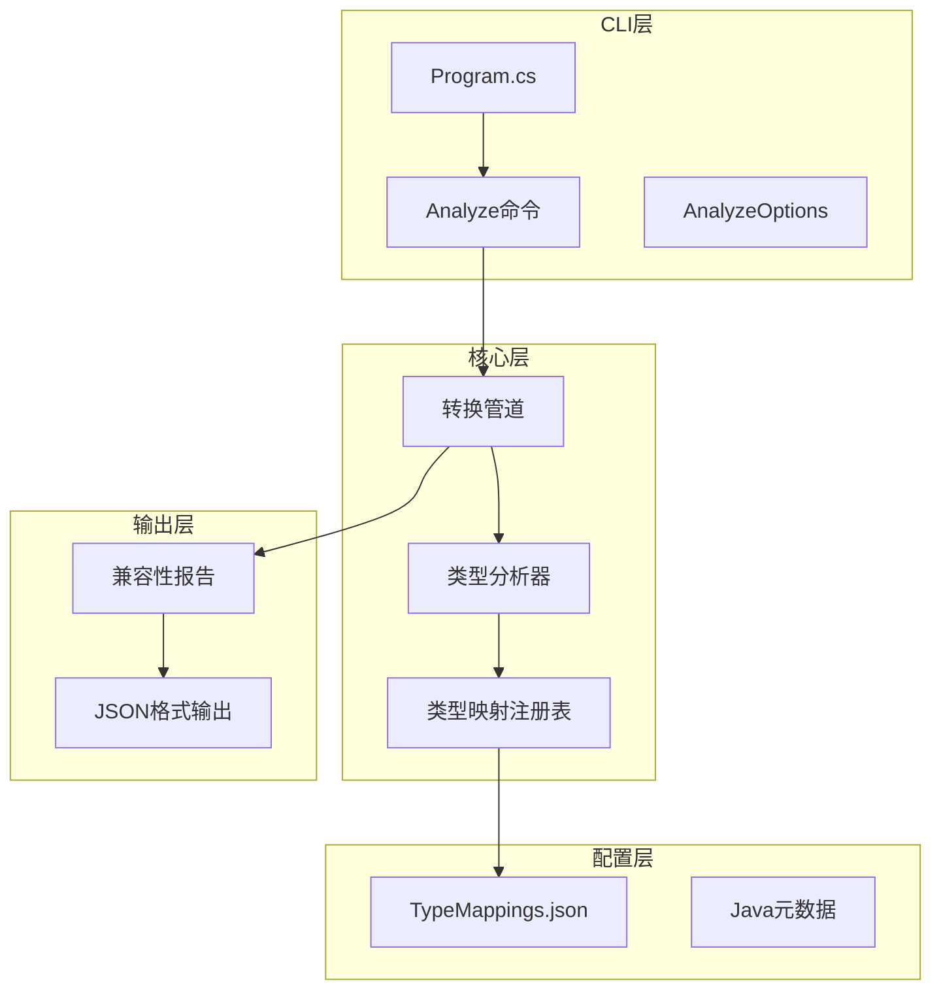
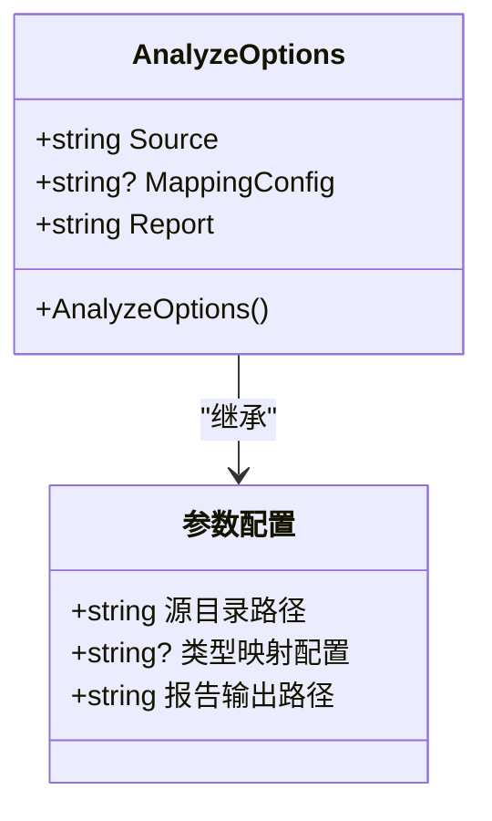
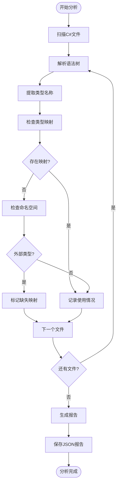
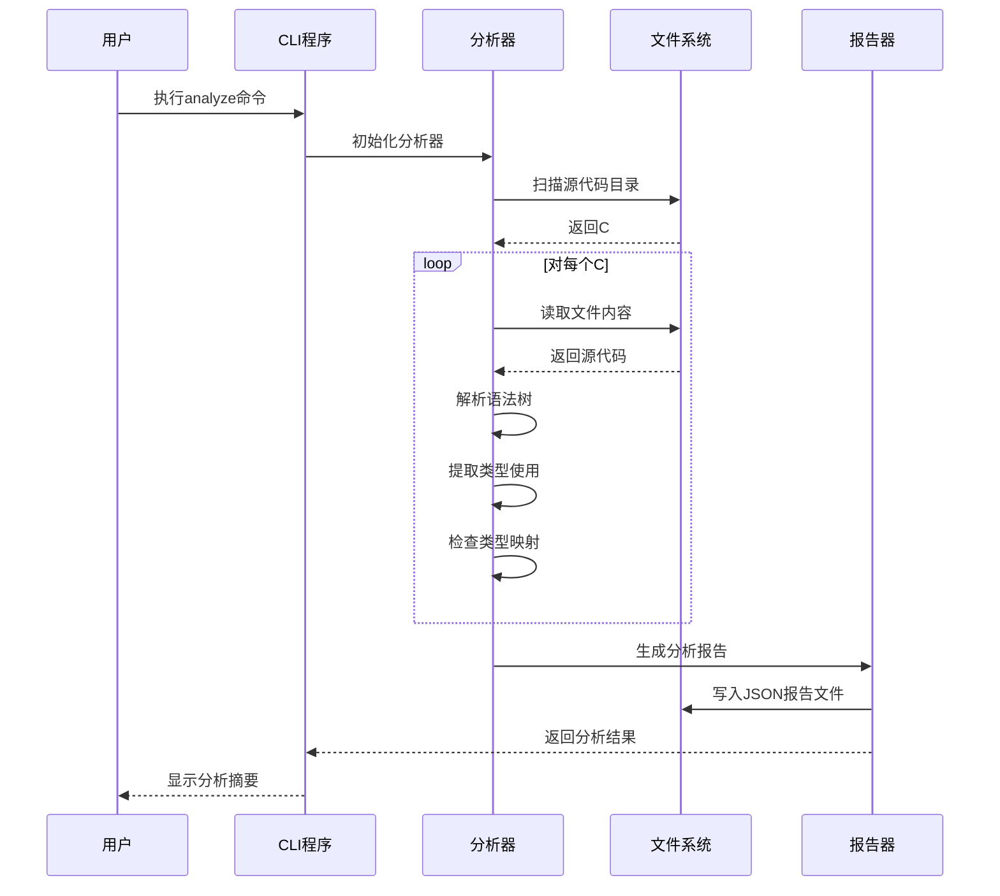
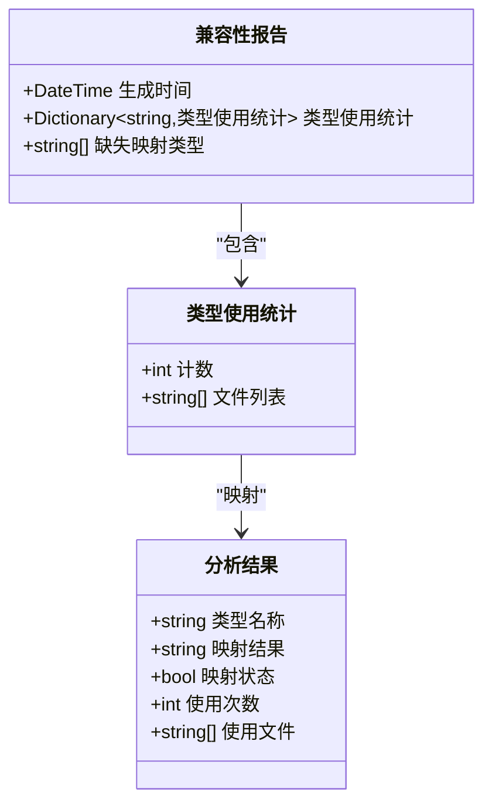
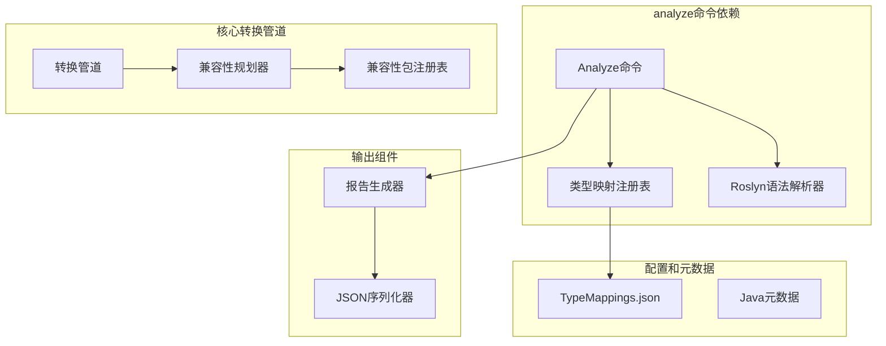

# analyze命令详解

<cite>
**本文档引用的文件**
- [Program.cs](file://src/CSharpToJava.CLI/Program.cs)
- [README.md](file://README.md)
- [CLAUDE.md](file://CLAUDE.md)
- [AnalyzeOptions.cs](file://src/CSharpToJava.CLI/Program.cs)
- [CompatibilityPackPlanner.cs](file://src/CSharpToJava.Core/Pipeline/Planning/CompatibilityPackPlanner.cs)
- [CompatibilityClassGenerator.cs](file://src/CSharpToJava.Core/Pipeline/CompatibilityClassGenerator.cs)
- [TypeMappings.json](file://config/TypeMappings.json)
</cite>

## 目录
1. [简介](#简介)
2. [项目结构](#项目结构)
3. [核心组件](#核心组件)
4. [架构概览](#架构概览)
5. [详细组件分析](#详细组件分析)
6. [依赖关系分析](#依赖关系分析)
7. [性能考虑](#性能考虑)
8. [故障排除指南](#故障排除指南)
9. [结论](#结论)
10. [附录](#附录)

## 简介

analyze命令是cs2j项目中的一个专用工具，用于分析C#项目的类型映射覆盖情况并生成兼容性报告。该命令通过静态分析C#源代码文件，识别潜在的类型映射缺失问题，为代码转换提供重要的兼容性检查和迁移规划支持。

analyze命令的核心价值在于：
- 自动化类型映射覆盖率分析
- 识别潜在的兼容性问题
- 生成详细的兼容性报告
- 为迁移策略制定提供数据支撑

## 项目结构

cs2j项目采用分层架构设计，analyze命令位于CLI层，通过调用核心转换管道来实现项目分析功能。



**图表来源**
- [Program.cs:1546-1745](file://src/CSharpToJava.CLI/Program.cs#L1546-L1745)
- [AnalyzeOptions.cs:2442-2453](file://src/CSharpToJava.CLI/Program.cs#L2442-L2453)

**章节来源**
- [Program.cs:1546-1745](file://src/CSharpToJava.CLI/Program.cs#L1546-L1745)
- [README.md:44-48](file://README.md#L44-L48)

## 核心组件

### AnalyzeOptions类
AnalyzeOptions是analyze命令的参数配置类，定义了命令行参数和默认行为。



**图表来源**
- [AnalyzeOptions.cs:2442-2453](file://src/CSharpToJava.CLI/Program.cs#L2442-L2453)

### 类型使用分析器
analyze命令的核心分析逻辑，负责扫描项目中的类型使用情况并生成报告。



**图表来源**
- [Program.cs:1546-1745](file://src/CSharpToJava.CLI/Program.cs#L1546-L1745)

**章节来源**
- [Program.cs:1546-1745](file://src/CSharpToJava.CLI/Program.cs#L1546-L1745)
- [AnalyzeOptions.cs:2442-2453](file://src/CSharpToJava.CLI/Program.cs#L2442-L2453)

## 架构概览

analyze命令的执行流程展示了从输入到输出的完整处理过程：



**图表来源**
- [Program.cs:1546-1745](file://src/CSharpToJava.CLI/Program.cs#L1546-L1745)

## 详细组件分析

### 命令语法和参数

analyze命令的完整语法如下：

```bash
dotnet run --project src/CSharpToJava.CLI/CSharpToJava.CLI.csproj -- analyze -s <源目录> -r <报告文件> [-m <映射配置>]
```

#### 参数说明

| 参数 | 短格式 | 长格式 | 必需 | 描述 | 默认值 |
|------|--------|--------|------|------|--------|
| 源目录 | -s | --source | 是 | 要分析的C#项目源代码目录路径 | 无 |
| 映射配置 | -m | --mapping | 否 | 自定义类型映射配置文件路径 | ./config/TypeMappings.json |
| 报告文件 | -r | --report | 是 | 输出兼容性报告的JSON文件路径 | 无 |

#### 使用示例

基本用法：
```bash
dotnet run --project src/CSharpToJava.CLI/CSharpToJava.CLI.csproj -- analyze -s ./src -r report.json
```

指定自定义映射配置：
```bash
dotnet run --project src/CSharpToJava.CLI/CSharpToJava.CLI.csproj -- analyze -s ./src -r report.json -m ./custom-mappings.json
```

### 分析算法实现

analyze命令采用以下分析策略：

1. **文件扫描**：递归扫描指定目录下的所有`.cs`文件
2. **语法解析**：使用Roslyn解析每个C#文件的语法树
3. **类型提取**：从语法树中提取所有使用的类型名称
4. **映射验证**：检查类型映射注册表以确定映射状态
5. **报告生成**：汇总统计结果并生成JSON格式报告

### 兼容性报告结构

analyze命令生成的报告包含以下关键信息：



**图表来源**
- [Program.cs:1643-1651](file://src/CSharpToJava.CLI/Program.cs#L1643-L1651)

**章节来源**
- [Program.cs:1546-1745](file://src/CSharpToJava.CLI/Program.cs#L1546-L1745)

## 依赖关系分析

analyze命令与其他组件的依赖关系展示了完整的分析生态系统：



**图表来源**
- [Program.cs:1546-1745](file://src/CSharpToJava.CLI/Program.cs#L1546-L1745)
- [CompatibilityPackPlanner.cs:1-59](file://src/CSharpToJava.Core/Pipeline/Planning/CompatibilityPackPlanner.cs#L1-L59)

**章节来源**
- [CompatibilityPackPlanner.cs:1-59](file://src/CSharpToJava.Core/Pipeline/Planning/CompatibilityPackPlanner.cs#L1-L59)
- [CompatibilityClassGenerator.cs:1-800](file://src/CSharpToJava.Core/Pipeline/CompatibilityClassGenerator.cs#L1-L800)

## 性能考虑

### 分析性能优化

analyze命令在设计时考虑了以下性能因素：

1. **增量分析**：仅分析新增或修改的文件
2. **并行处理**：利用多核处理器并行解析多个文件
3. **内存管理**：及时释放语法树和中间结果
4. **缓存机制**：重用已解析的类型信息

### 大型项目处理

对于大型项目，建议：
- 使用适当的源目录范围，避免不必要的文件扫描
- 考虑分阶段分析，先分析核心模块
- 监控内存使用情况，必要时增加系统内存

## 故障排除指南

### 常见问题及解决方案

#### 1. 源目录不存在
**问题**：指定的源目录路径无效
**解决方案**：确认目录路径正确且存在

#### 2. 类型映射配置错误
**问题**：自定义映射配置文件格式不正确
**解决方案**：检查JSON格式，参考默认配置文件

#### 3. 权限不足
**问题**：无法读取某些文件或写入报告文件
**解决方案**：确保有足够的文件系统权限

#### 4. 内存不足
**问题**：大型项目分析时内存不足
**解决方案**：分批处理或增加系统内存

**章节来源**
- [Program.cs:1546-1745](file://src/CSharpToJava.CLI/Program.cs#L1546-L1745)

## 结论

analyze命令为cs2j项目提供了强大的兼容性分析能力，通过自动化的方式帮助开发者识别和解决类型映射问题。该命令的设计体现了以下优势：

1. **全面性**：能够分析整个项目的类型使用情况
2. **准确性**：基于Roslyn的精确语法分析
3. **实用性**：生成可操作的兼容性报告
4. **可扩展性**：支持自定义映射配置

通过合理使用analyze命令，开发团队可以：
- 提前发现潜在的兼容性问题
- 制定更有针对性的迁移策略
- 优化转换质量和效率
- 减少手动分析的工作量

## 附录

### 实际使用示例

#### 示例1：基础项目分析
```bash
# 分析当前目录下的所有C#文件
dotnet run --project src/CSharpToJava.CLI/CSharpToJava.CLI.csproj -- analyze -s . -r analysis-report.json
```

#### 示例2：指定特定目录
```bash
# 分析特定子目录
dotnet run --project src/CSharpToJava.CLI/CSharpToJava.CLI.csproj -- analyze -s ./src/MyProject -r report.json
```

#### 示例3：自定义映射配置
```bash
# 使用自定义类型映射配置
dotnet run --project src/CSharpToJava.CLI/CSharpToJava.CLI.csproj -- analyze -s ./src -r report.json -m ./config/custom-mappings.json
```

### 最佳实践建议

1. **定期运行分析**：在项目开发过程中定期运行analyze命令
2. **关注缺失映射**：重点关注报告中标记为缺失映射的类型
3. **更新映射配置**：根据分析结果及时更新类型映射配置
4. **分阶段迁移**：优先处理高使用频率的缺失类型
5. **版本控制**：将分析报告纳入版本控制系统

### 报告解读指南

当收到分析报告时，重点关注以下指标：

1. **最常用类型**：识别项目中最频繁使用的类型
2. **缺失映射类型**：优先处理这些类型以提高转换质量
3. **使用分布**：了解不同类型在整个项目中的分布情况
4. **迁移优先级**：根据使用频率和复杂度制定迁移计划