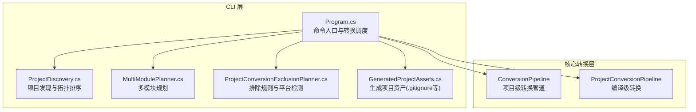
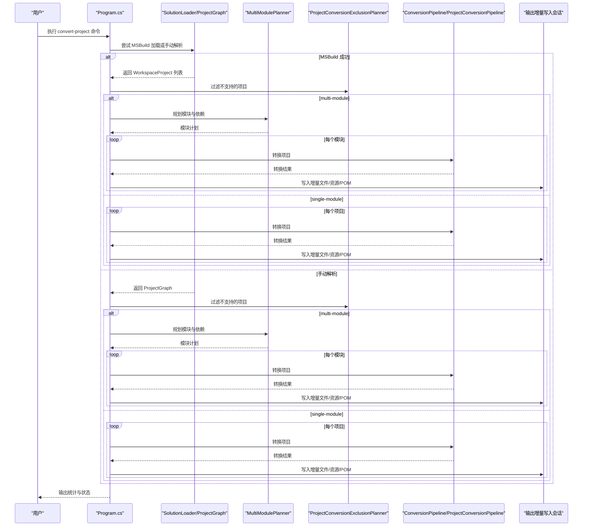
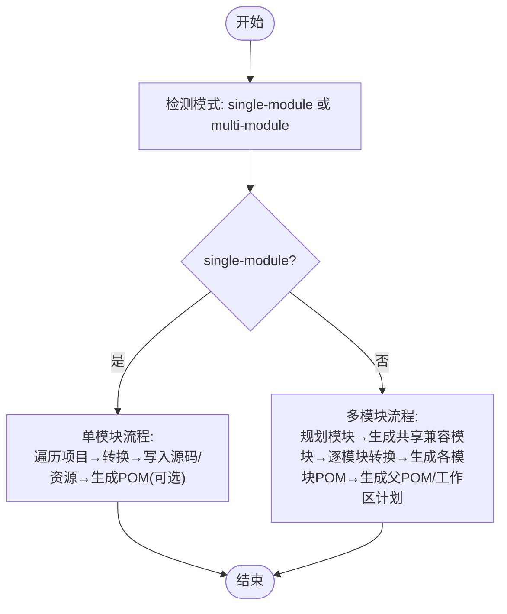
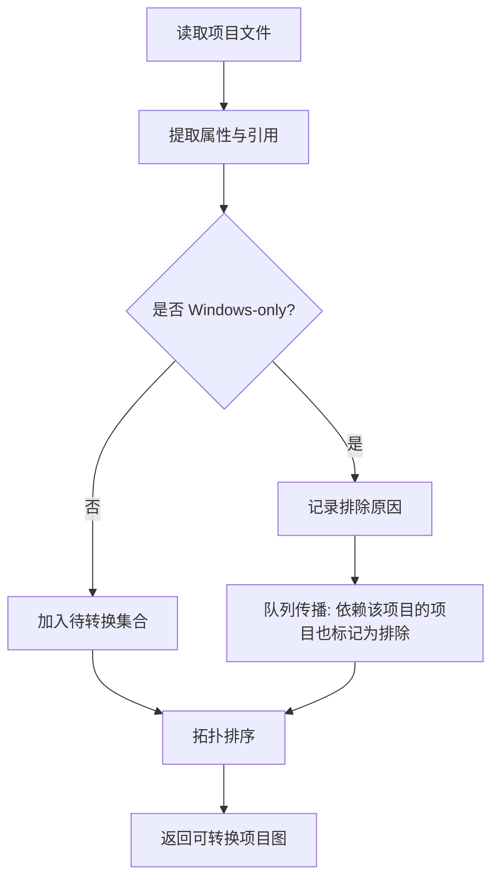
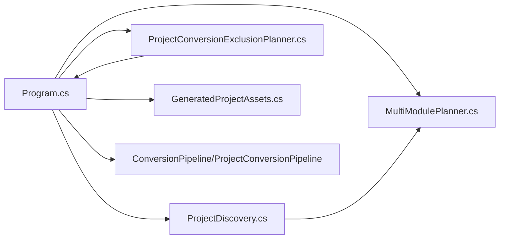

# convert-project命令详解

<cite>
**本文档引用的文件**
- [Program.cs](file://src/CSharpToJava.CLI/Program.cs)
- [MultiModulePlanner.cs](file://src/CSharpToJava.CLI/MultiModulePlanner.cs)
- [ProjectDiscovery.cs](file://src/CSharpToJava.CLI/ProjectDiscovery.cs)
- [ProjectConversionExclusionPlanner.cs](file://src/CSharpToJava.CLI/ProjectConversionExclusionPlanner.cs)
- [GeneratedProjectAssets.cs](file://src/CSharpToJava.CLI/GeneratedProjectAssets.cs)
- [README.md](file://README.md)
- [convert-agl-graphlayout.sh](file://convert-agl-graphlayout.sh)
- [convert-agl-graphlayout.bat](file://convert-agl-graphlayout.bat)
</cite>

## 目录
1. [简介](#简介)
2. [项目结构](#项目结构)
3. [核心组件](#核心组件)
4. [架构总览](#架构总览)
5. [详细组件分析](#详细组件分析)
6. [依赖关系分析](#依赖关系分析)
7. [性能考虑](#性能考虑)
8. [故障排除指南](#故障排除指南)
9. [结论](#结论)
10. [附录](#附录)

## 简介
convert-project 命令用于将整个 C# 解决方案或项目转换为 Java 源码与构建配置。它支持两种输出模式：single-module（单模块）与 multi-module（多模块），并提供 MSBuild 集成、增量转换、资源复制、兼容性包生成、POM 文件创建以及模块规划等功能。该命令可自动发现项目图谱、过滤不支持的平台项目，并在转换过程中生成报告与工件。

## 项目结构
CLI 层负责解析命令行参数、选择转换路径（MSBuild 或手动扫描）、执行转换流程、管理增量写入会话与生成构建资产。核心转换逻辑由 CSharpToJava.Core 提供，CLI 负责项目发现、模块规划与输出组织。

**图表来源**
- [Program.cs:111-304](file://src/CSharpToJava.CLI/Program.cs#L111-L304)
- [ProjectDiscovery.cs:36-116](file://src/CSharpToJava.CLI/ProjectDiscovery.cs#L36-L116)
- [MultiModulePlanner.cs:25-127](file://src/CSharpToJava.CLI/MultiModulePlanner.cs#L25-L127)
- [ProjectConversionExclusionPlanner.cs:13-104](file://src/CSharpToJava.CLI/ProjectConversionExclusionPlanner.cs#L13-L104)
- [GeneratedProjectAssets.cs:5-34](file://src/CSharpToJava.CLI/GeneratedProjectAssets.cs#L5-L34)

**章节来源**
- [Program.cs:111-304](file://src/CSharpToJava.CLI/Program.cs#L111-L304)
- [README.md:30-48](file://README.md#L30-L48)

## 核心组件
- 命令行参数模型 ConvertProjectOptions：定义所有可用选项，包括源路径、目标路径、映射配置、Java 版本、记录类开关、可选类型、JavaDoc、详细输出、LINQ 策略、POM 生成、Maven 组织与版本、是否包含测试、模式（single/multi）、LINQ 报告等。
- 项目发现与图构建：ProjectDiscovery 支持从 .sln 或 .csproj 入口解析项目图，识别生产与测试项目、资源文件与引用关系，并进行拓扑排序。
- 多模块规划：MultiModulePlanner 将项目映射到模块，计算编译与测试依赖，保证构建顺序。
- 排除规划：ProjectConversionExclusionPlanner 基于项目文件属性与包引用判断 Windows-only 项目并传播排除。
- 输出增量写入：Program 中的增量写入会话确保重复运行时仅更新变更内容。
- 生成资产：生成 .gitignore 等项目根文件。

**章节来源**
- [Program.cs:2377-2440](file://src/CSharpToJava.CLI/Program.cs#L2377-L2440)
- [ProjectDiscovery.cs:36-116](file://src/CSharpToJava.CLI/ProjectDiscovery.cs#L36-L116)
- [MultiModulePlanner.cs:25-127](file://src/CSharpToJava.CLI/MultiModulePlanner.cs#L25-L127)
- [ProjectConversionExclusionPlanner.cs:13-104](file://src/CSharpToJava.CLI/ProjectConversionExclusionPlanner.cs#L13-L104)
- [GeneratedProjectAssets.cs:5-34](file://src/CSharpToJava.CLI/GeneratedProjectAssets.cs#L5-L34)

## 架构总览
convert-project 的执行流程分为两条主干：MSBuild 加载路径与手动项目图路径。MSBuild 路径优先，失败后回退到目录扫描；两者均支持 single-module 与 multi-module 模式，且都具备增量转换能力。

**图表来源**
- [Program.cs:111-304](file://src/CSharpToJava.CLI/Program.cs#L111-L304)
- [Program.cs:306-451](file://src/CSharpToJava.CLI/Program.cs#L306-L451)
- [Program.cs:569-747](file://src/CSharpToJava.CLI/Program.cs#L569-L747)
- [ProjectDiscovery.cs:92-116](file://src/CSharpToJava.CLI/ProjectDiscovery.cs#L92-L116)
- [MultiModulePlanner.cs:27-127](file://src/CSharpToJava.CLI/MultiModulePlanner.cs#L27-L127)
- [ProjectConversionExclusionPlanner.cs:15-104](file://src/CSharpToJava.CLI/ProjectConversionExclusionPlanner.cs#L15-L104)

## 详细组件分析

### 命令语法与关键参数
- 基本语法
  - dotnet run --project src/CSharpToJava.CLI/CSharpToJava.CLI.csproj -- convert-project -s <源路径> -d <目标路径> [选项]
- 关键参数
  - -s, --source：源目录、.csproj 或 .sln 路径
  - -d, --destination：目标目录路径
  - -m, --mapping：类型映射配置文件路径
  - -j, --java-version：目标 Java 版本，默认 Java25
  - -f, --force：覆盖现有文件
  - --no-records：不使用 Java records
  - --use-optional：用 Optional 表示可空类型
  - --no-javadoc：不生成 JavaDoc
  - -v, --verbose：显示详细进度
  - --no-linq-rewrite：不预处理 LINQ
  - --prefer-stream-api：优先使用 Stream API（与 Java 版本相关）
  - --prefer-procedural：优先使用过程式循环
  - --generate-pom：生成 Maven pom.xml（默认开启）
  - --maven-group-id：Maven groupId（默认值见选项定义）
  - --maven-version：Maven 版本（默认值见选项定义）
  - --include-tests：包含测试项目（默认开启）
  - --mode：输出模式 single-module 或 multi-module（默认 multi-module）
  - --linq-report：输出 LINQ 预处理报告

**章节来源**
- [Program.cs:2377-2440](file://src/CSharpToJava.CLI/Program.cs#L2377-L2440)
- [README.md:38-42](file://README.md#L38-L42)

### single-module 与 multi-module 模式对比
- single-module（单模块）
  - 将所有项目合并到一个 Java 项目中，按 main/test 分类输出源码与资源。
  - 适合小型或中型项目，便于一次性构建。
  - 资源复制：自动复制项目中标记为复制到输出目录的资源文件。
- multi-module（多模块）
  - 基于项目依赖关系生成多个 Java 模块，包含共享兼容性模块。
  - 生成每个模块的 pom.xml，并在需要时生成父 pom 与工作区计划清单。
  - 适合大型项目，保持模块边界清晰，利于增量构建与依赖管理。

**图表来源**
- [Program.cs:187-193](file://src/CSharpToJava.CLI/Program.cs#L187-L193)
- [Program.cs:569-747](file://src/CSharpToJava.CLI/Program.cs#L569-L747)
- [Program.cs:306-451](file://src/CSharpToJava.CLI/Program.cs#L306-L451)

**章节来源**
- [Program.cs:187-193](file://src/CSharpToJava.CLI/Program.cs#L187-L193)
- [Program.cs:569-747](file://src/CSharpToJava.CLI/Program.cs#L569-L747)
- [Program.cs:306-451](file://src/CSharpToJava.CLI/Program.cs#L306-L451)

### MSBuild 集成机制
- 早期注册 MSBuild 定位器，确保 Roslyn 工作区 API 可用。
- 优先尝试通过 SolutionLoader 打开 .sln/.csproj 获取 WorkspaceProject 列表，以获得完整的语义信息与引用关系。
- 若加载失败，回退到手动项目发现（ProjectGraph），解析 .csproj 与 .sln 并进行拓扑排序。

**章节来源**
- [Program.cs:15-16](file://src/CSharpToJava.CLI/Program.cs#L15-L16)
- [Program.cs:150-164](file://src/CSharpToJava.CLI/Program.cs#L150-L164)
- [ProjectDiscovery.cs:92-116](file://src/CSharpToJava.CLI/ProjectDiscovery.cs#L92-L116)

### 增量转换与并行处理
- 增量转换
  - 使用输出增量写入会话跟踪输入指纹、上次转换产物与本次变更，仅写入变更文件，避免重复转换。
  - 支持资源文件增量复制与构建资产写入。
- 并行处理
  - 单模块模式下按项目顺序转换，未显式并行化。
  - 多模块模式下逐模块转换，未显式并行化。
  - 建议通过外部工具（如并行构建脚本）控制多模块构建阶段。

**章节来源**
- [Program.cs:166-173](file://src/CSharpToJava.CLI/Program.cs#L166-L173)
- [Program.cs:215-219](file://src/CSharpToJava.CLI/Program.cs#L215-L219)
- [Program.cs:332-362](file://src/CSharpToJava.CLI/Program.cs#L332-L362)
- [Program.cs:459-487](file://src/CSharpToJava.CLI/Program.cs#L459-L487)
- [Program.cs:575-591](file://src/CSharpToJava.CLI/Program.cs#L575-L591)

### 项目发现机制与过滤规则
- 项目发现
  - 从 .sln 或 .csproj 入口递归解析项目，提取名称、目录、引用、资源项与测试标识。
  - 对 .sln 文件解析其中的项目列表；对 .csproj 文件解析 ProjectReference 与 PackageReference。
- 过滤规则
  - 基于项目属性与包引用判断 Windows-only 项目（如 WindowsDesktop SDK、UseWPF、UseWindowsForms、特定 TargetFramework/PlatformIdentifier、UWP 包等）。
  - 采用反向依赖传播策略，排除依赖被排除项目的其他项目。

**图表来源**
- [ProjectConversionExclusionPlanner.cs:106-170](file://src/CSharpToJava.CLI/ProjectConversionExclusionPlanner.cs#L106-L170)
- [ProjectConversionExclusionPlanner.cs:57-101](file://src/CSharpToJava.CLI/ProjectConversionExclusionPlanner.cs#L57-L101)
- [ProjectDiscovery.cs:153-203](file://src/CSharpToJava.CLI/ProjectDiscovery.cs#L153-L203)

**章节来源**
- [ProjectDiscovery.cs:92-116](file://src/CSharpToJava.CLI/ProjectDiscovery.cs#L92-L116)
- [ProjectDiscovery.cs:153-203](file://src/CSharpToJava.CLI/ProjectDiscovery.cs#L153-L203)
- [ProjectConversionExclusionPlanner.cs:13-104](file://src/CSharpToJava.CLI/ProjectConversionExclusionPlanner.cs#L13-L104)

### 兼容性包生成、POM 文件创建与模块规划
- 共享兼容性模块
  - multi-module 模式下先生成共享兼容性模块，供其他模块引用，减少重复代码。
- 模块规划
  - 基于项目依赖计算编译与测试依赖，保证构建顺序。
  - 测试模块可选择独立模块或附加到对应生产模块的 test 源集中。
- POM 生成
  - 为每个模块生成 pom.xml，设置 groupId/version、依赖与桥接需求。
  - 可生成父 pom 与工作区计划清单，便于统一管理。
- 生成资产
  - 写入 .gitignore 等项目根文件，确保生成项目符合标准。

**章节来源**
- [Program.cs:580-620](file://src/CSharpToJava.CLI/Program.cs#L580-L620)
- [Program.cs:677-733](file://src/CSharpToJava.CLI/Program.cs#L677-L733)
- [MultiModulePlanner.cs:27-127](file://src/CSharpToJava.CLI/MultiModulePlanner.cs#L27-L127)
- [GeneratedProjectAssets.cs:9-34](file://src/CSharpToJava.CLI/GeneratedProjectAssets.cs#L9-L34)

### 命令使用示例
- 基本用法
  - dotnet run --project src/CSharpToJava.CLI/CSharpToJava.CLI.csproj -- convert-project -s ./src -d ./output
- 多模块 + 过程式 LINQ + 详细输出
  - dotnet run --project src/CSharpToJava.CLI/CSharpToJava.CLI.csproj -- convert-project -s "./解决方案.sln" -d "./输出目录" --mode multi-module --prefer-procedural --verbose
- 单模块 + POM + Maven 组织与版本
  - dotnet run --project src/CSharpToJava.CLI/CSharpToJava.CLI.csproj -- convert-project -s "./项目.csproj" -d "./output" --mode single-module --generate-pom --maven-group-id "com.example" --maven-version "1.0.0"

**章节来源**
- [README.md:38-42](file://README.md#L38-L42)
- [convert-agl-graphlayout.sh:36-44](file://convert-agl-graphlayout.sh#L36-L44)
- [convert-agl-graphlayout.bat:26-26](file://convert-agl-graphlayout.bat#L26-L26)

## 依赖关系分析
- CLI 与核心模块
  - Program.cs 依赖 ProjectDiscovery、MultiModulePlanner、ProjectConversionExclusionPlanner、GeneratedProjectAssets 以及核心转换管道。
- 项目图与模块规划
  - ProjectDiscovery 提供拓扑排序后的项目序列；MultiModulePlanner 基于引用关系生成模块与依赖。
- 排除规则
  - ProjectConversionExclusionPlanner 依据项目属性与包引用判定排除，并传播至依赖项目。

**图表来源**
- [Program.cs:111-304](file://src/CSharpToJava.CLI/Program.cs#L111-L304)
- [ProjectDiscovery.cs:36-116](file://src/CSharpToJava.CLI/ProjectDiscovery.cs#L36-L116)
- [MultiModulePlanner.cs:25-127](file://src/CSharpToJava.CLI/MultiModulePlanner.cs#L25-L127)
- [ProjectConversionExclusionPlanner.cs:13-104](file://src/CSharpToJava.CLI/ProjectConversionExclusionPlanner.cs#L13-L104)

**章节来源**
- [Program.cs:111-304](file://src/CSharpToJava.CLI/Program.cs#L111-L304)
- [ProjectDiscovery.cs:36-116](file://src/CSharpToJava.CLI/ProjectDiscovery.cs#L36-L116)
- [MultiModulePlanner.cs:25-127](file://src/CSharpToJava.CLI/MultiModulePlanner.cs#L25-L127)
- [ProjectConversionExclusionPlanner.cs:13-104](file://src/CSharpToJava.CLI/ProjectConversionExclusionPlanner.cs#L13-L104)

## 性能考虑
- 优先使用 MSBuild 加载以获得完整语义与引用信息，提升转换准确性。
- 在 multi-module 模式下，合理规划模块边界，减少不必要的模块间依赖，有利于并行构建。
- 启用增量转换可显著减少重复工作量，建议在 CI 中保留输出目录以利用增量能力。
- 对大型项目，建议分阶段构建（例如先构建共享兼容模块，再构建业务模块），以缩短整体耗时。

## 故障排除指南
- 源路径不存在
  - 确认 -s 指定的路径存在，支持目录、.csproj 或 .sln。
- 目标目录已存在且未指定 --force
  - 使用 --force 覆盖，或更换目标目录。
- 所有项目被排除（平台限制）
  - 检查项目属性（如 WindowsDesktop SDK、UseWPF/UseWindowsForms、TargetFramework/PlatformIdentifier、UWP 包等），必要时调整项目配置。
- MSBuild 加载失败
  - 回退到手动项目发现；若仍失败，检查 .sln/.csproj 是否有效。
- 转换失败
  - 查看详细诊断输出（--verbose），定位具体文件与错误信息。
- Maven 构建问题
  - 确保已安装 Maven；若使用 multi-module 模式，确认生成的 pom.xml 正确且依赖完整。

**章节来源**
- [Program.cs:115-136](file://src/CSharpToJava.CLI/Program.cs#L115-L136)
- [Program.cs:150-164](file://src/CSharpToJava.CLI/Program.cs#L150-L164)
- [ProjectConversionExclusionPlanner.cs:106-170](file://src/CSharpToJava.CLI/ProjectConversionExclusionPlanner.cs#L106-L170)

## 结论
convert-project 命令提供了从 C# 到 Java 的端到端转换能力，支持多种输出模式、MSBuild 集成、增量转换与模块化构建。通过合理的参数配置与最佳实践，可在大型项目中高效完成迁移，并生成可直接构建的 Java 项目。

## 附录
- 常用参数速查
  - -s/--source：源路径
  - -d/--destination：目标路径
  - -m/--mapping：类型映射配置
  - -j/--java-version：目标 Java 版本
  - --mode：single-module 或 multi-module
  - --generate-pom：生成 POM
  - --maven-group-id/--maven-version：Maven 坐标
  - --include-tests：包含测试
  - --prefer-stream-api/--prefer-procedural：LINQ 策略
  - --linq-report：LINQ 报告
  - -v/--verbose：详细输出
  - -f/--force：覆盖输出