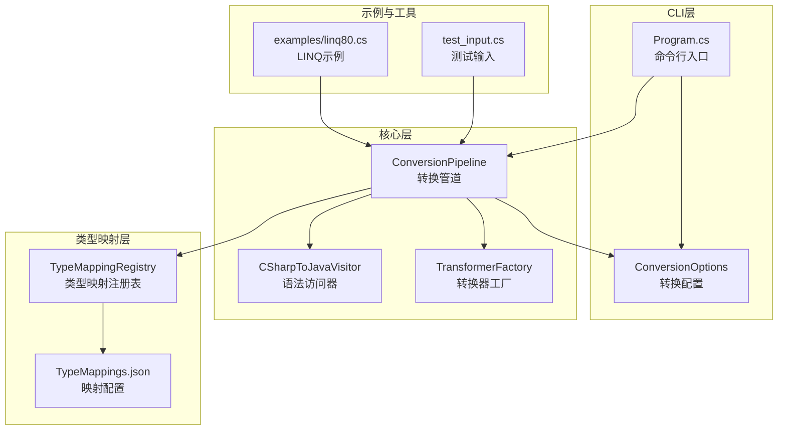
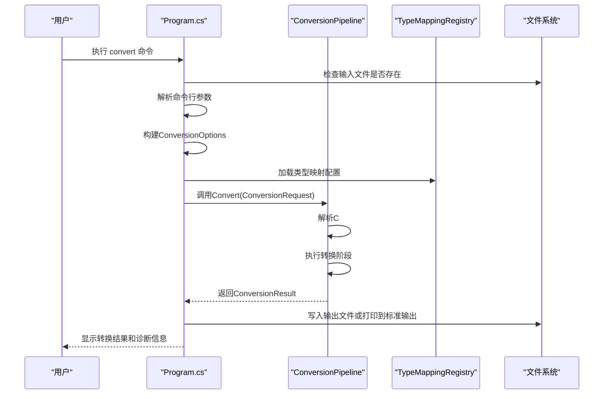
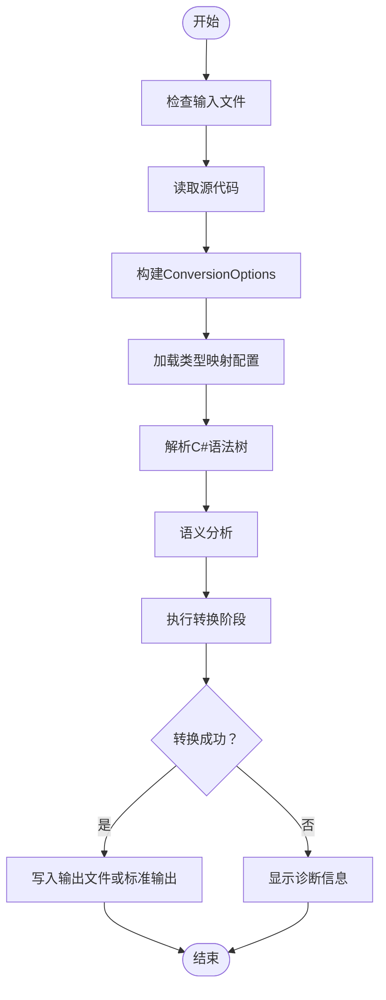
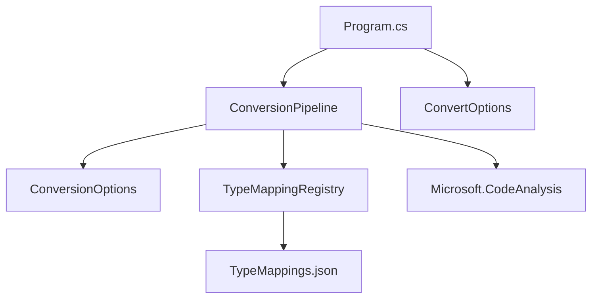

# convert命令详解

<cite>
**本文档引用的文件**
- [README.md](file://README.md)
- [Program.cs](file://src/CSharpToJava.CLI/Program.cs)
- [ConvertOptions.cs](file://src/CSharpToJava.CLI/Program.cs)
- [ConversionOptions.cs](file://src/CSharpToJava.Core/Context/ConversionOptions.cs)
- [ConversionPipeline.cs](file://src/CSharpToJava.Core/Pipeline/ConversionPipeline.cs)
- [TypeMappings.json](file://config/TypeMappings.json)
- [linq80.cs](file://examples/linq80.cs)
- [test_input.cs](file://test_input.cs)
- [CLAUDE.md](file://CLAUDE.md)
</cite>

## 目录
1. [简介](#简介)
2. [项目结构](#项目结构)
3. [核心组件](#核心组件)
4. [架构总览](#架构总览)
5. [详细组件分析](#详细组件分析)
6. [依赖关系分析](#依赖关系分析)
7. [性能考虑](#性能考虑)
8. [故障排除指南](#故障排除指南)
9. [结论](#结论)
10. [附录](#附录)

## 简介
convert命令用于将单个C#源文件转换为Java源码。该命令基于Roslyn解析C#语法树，通过转换管道执行多阶段处理，最终生成可编译的Java代码。本文档详细说明convert命令的功能、参数选项、使用场景、转换流程、输出结果与错误处理，并提供最佳实践和调试技巧。

## 项目结构
cs2j项目采用分层架构：
- CLI层：命令行接口，负责解析用户输入、构建转换选项并调用核心转换管道
- 核心层：转换引擎，基于Roslyn进行语法分析、语义解析和代码生成
- 类型映射层：JSON驱动的类型映射配置，支持自定义映射规则
- 工具与示例：测试输入、LINQ示例、脚本工具

图表来源
- [Program.cs:13-25](file://src/CSharpToJava.CLI/Program.cs#L13-L25)
- [ConversionPipeline.cs:67-221](file://src/CSharpToJava.Core/Pipeline/ConversionPipeline.cs#L67-L221)
- [ConversionOptions.cs:6-94](file://src/CSharpToJava.Core/Context/ConversionOptions.cs#L6-L94)
- [TypeMappings.json:1-200](file://config/TypeMappings.json#L1-L200)

章节来源
- [README.md:64-74](file://README.md#L64-L74)
- [Program.cs:13-25](file://src/CSharpToJava.CLI/Program.cs#L13-L25)

## 核心组件
- convert命令入口：解析命令行参数，验证输入文件存在性，构建ConversionOptions，调用ConversionPipeline执行转换
- 转换管道：包含解析、预处理、转换、代码生成等多个阶段，支持LINQ重写、JavaDoc生成、记录类型处理等
- 转换选项：控制目标Java版本、类型映射路径、是否生成JavaDoc、是否使用记录、是否使用Optional、是否启用LINQ重写等
- 类型映射系统：基于JSON配置的类型映射注册表，支持基础类型、泛型类型、方法名映射、命名空间映射等

章节来源
- [Program.cs:27-109](file://src/CSharpToJava.CLI/Program.cs#L27-L109)
- [ConversionPipeline.cs:67-221](file://src/CSharpToJava.Core/Pipeline/ConversionPipeline.cs#L67-L221)
- [ConversionOptions.cs:6-94](file://src/CSharpToJava.Core/Context/ConversionOptions.cs#L6-L94)
- [TypeMappings.json:1-200](file://config/TypeMappings.json#L1-L200)

## 架构总览
convert命令的执行流程如下：
1. CLI解析参数并验证输入文件
2. 构建ConversionOptions（目标Java版本、类型映射路径、功能开关等）
3. 初始化TypeMappingRegistry并加载配置
4. 创建ConversionPipeline并执行转换
5. 输出结果或错误信息

图表来源
- [Program.cs:27-109](file://src/CSharpToJava.CLI/Program.cs#L27-L109)
- [ConversionPipeline.cs:115-221](file://src/CSharpToJava.Core/Pipeline/ConversionPipeline.cs#L115-L221)

章节来源
- [Program.cs:27-109](file://src/CSharpToJava.CLI/Program.cs#L27-L109)
- [ConversionPipeline.cs:115-221](file://src/CSharpToJava.Core/Pipeline/ConversionPipeline.cs#L115-L221)

## 详细组件分析

### convert命令语法与参数
- 基本语法
  - dotnet run --project src/CSharpToJava.CLI/CSharpToJava.CLI.csproj -- convert -i 输入文件 -o 输出文件
- 参数说明
  - -i, --input：必需，输入C#文件路径
  - -o, --output：可选，输出Java文件路径；未指定时输出到标准输出
  - -m, --mapping：可选，类型映射配置文件路径，默认使用./config/TypeMappings.json
  - -j, --java-version：可选，目标Java版本，默认Java25
  - --no-records：可选，不使用Java记录类型表示C#记录
  - --use-optional：可选，使用Optional包装可空类型
  - --no-javadoc：可选，不生成JavaDoc注释
  - --no-linq-rewrite：可选，禁用LINQ预处理（将LINQ转换为过程化代码）
  - -v, --verbose：可选，显示诊断信息
  - --prefer-stream-api：可选，优先使用Java Stream API进行LINQ转换（默认适用于Java 25）
  - --prefer-procedural：可选，优先使用过程化循环进行LINQ转换
  - --no-parallel-project-passes：可选，禁用项目级树局部传递的并行执行

章节来源
- [README.md:50-62](file://README.md#L50-L62)
- [CLAUDE.md:31-41](file://CLAUDE.md#L31-L41)
- [ConvertOptions.cs:2328-2375](file://src/CSharpToJava.CLI/Program.cs#L2328-L2375)

### 转换流程详解
- 输入文件处理
  - 验证输入文件存在性
  - 读取文件内容作为源代码字符串
- 转换选项构建
  - 解析目标Java版本（默认Java25）
  - 设置类型映射配置路径和Java元数据路径
  - 控制JavaDoc生成、记录类型使用、可空类型处理、LINQ重写开关等
- 类型映射初始化
  - 加载TypeMappings.json配置
  - 可选：注入Java标准库元数据索引以支持语义验证
- 转换执行
  - 解析C#语法树并进行语义分析
  - 执行转换阶段（LINQ预处理、编译检查、平台边界检查、上下文规范化、Java代码生成）
  - 收集诊断信息和统计信息
- 结果输出
  - 将生成的Java代码写入指定文件或标准输出
  - 在详细模式下输出诊断信息

图表来源
- [Program.cs:27-109](file://src/CSharpToJava.CLI/Program.cs#L27-L109)
- [ConversionPipeline.cs:115-221](file://src/CSharpToJava.Core/Pipeline/ConversionPipeline.cs#L115-L221)

章节来源
- [Program.cs:27-109](file://src/CSharpToJava.CLI/Program.cs#L27-L109)
- [ConversionPipeline.cs:115-221](file://src/CSharpToJava.Core/Pipeline/ConversionPipeline.cs#L115-L221)

### 转换选项对结果的影响
- Java版本选择
  - 影响可用语言特性和API映射
  - 默认Java25，可通过--java-version调整
- 类型映射配置
  - 自定义基础类型、泛型类型、方法名、命名空间映射
  - 通过-m参数指定自定义映射文件
- LINQ重写策略
  - --prefer-stream-api：优先使用Java Stream API
  - --prefer-procedural：优先使用过程化循环
  - --no-linq-rewrite：禁用LINQ预处理
- 记录类型处理
  - --no-records：不使用Java记录类型
  - 默认使用Java记录类型表示C#记录
- 可空类型处理
  - --use-optional：使用Optional包装可空类型
- JavaDoc生成
  - --no-javadoc：不生成JavaDoc注释
- 并行执行
  - --no-parallel-project-passes：禁用并行执行（仅影响项目级转换）

章节来源
- [ConversionOptions.cs:6-94](file://src/CSharpToJava.Core/Context/ConversionOptions.cs#L6-L94)
- [ConvertOptions.cs:2328-2375](file://src/CSharpToJava.CLI/Program.cs#L2328-L2375)

### 使用示例
- 单文件转换
  - dotnet run --project src/CSharpToJava.CLI/CSharpToJava.CLI.csproj -- convert -i test_input.cs -o Program.java
- 指定Java版本
  - dotnet run --project src/CSharpToJava.CLI/CSharpToJava.CLI.csproj -- convert -i test_input.cs -o Program.java -j Java25
- 禁用JavaDoc
  - dotnet run --project src/CSharpToJava.CLI/CSharpToJava.CLI.csproj -- convert -i test_input.cs -o Program.java --no-javadoc
- 使用自定义类型映射
  - dotnet run --project src/CSharpToJava.CLI/CSharpToJava.CLI.csproj -- convert -i test_input.cs -o Program.java -m ./custom-mappings.json
- 启用详细模式
  - dotnet run --project src/CSharpToJava.CLI/CSharpToJava.CLI.csproj -- convert -i test_input.cs -o Program.java -v

章节来源
- [README.md:32-36](file://README.md#L32-L36)
- [test_input.cs:1-16](file://test_input.cs#L1-L16)

### 最佳实践
- 选择合适的Java版本：根据目标运行环境选择Java版本，确保映射的API可用
- 定制类型映射：针对特定框架或库定制类型映射，提高转换质量
- 处理LINQ：根据团队偏好选择Stream API或过程化循环策略
- 管理可空类型：根据业务需求决定是否使用Optional包装
- 使用详细模式：在开发和调试阶段启用-v选项查看诊断信息
- 分批转换：对于大型项目，建议先转换关键模块，验证后再扩展

## 依赖关系分析
convert命令的关键依赖关系：
- CLI层依赖核心转换管道和类型映射系统
- 转换管道依赖Roslyn进行语法分析和语义解析
- 类型映射系统依赖JSON配置文件
- 转换选项控制各组件的行为

图表来源
- [Program.cs:1-8](file://src/CSharpToJava.CLI/Program.cs#L1-L8)
- [ConversionPipeline.cs:1-11](file://src/CSharpToJava.Core/Pipeline/ConversionPipeline.cs#L1-L11)
- [ConversionOptions.cs:1-6](file://src/CSharpToJava.Core/Context/ConversionOptions.cs#L1-L6)

章节来源
- [Program.cs:1-8](file://src/CSharpToJava.CLI/Program.cs#L1-L8)
- [ConversionPipeline.cs:1-11](file://src/CSharpToJava.Core/Pipeline/ConversionPipeline.cs#L1-L11)

## 性能考虑
- 并行执行：项目级转换支持并行执行以提升性能，但convert命令主要用于单文件转换
- 缓存与增量：CLI层支持增量写入会话，避免重复转换
- 依赖加载：合理配置类型映射和Java元数据路径，减少加载开销
- 诊断输出：在生产环境中避免使用-v选项以减少输出开销

## 故障排除指南
- 输入文件不存在
  - 症状：提示输入文件未找到
  - 处理：确认文件路径正确且文件存在
- 转换失败
  - 症状：返回非零退出码并显示错误信息
  - 处理：查看详细诊断信息，检查类型映射配置和Java版本设置
- 语法错误
  - 症状：解析阶段出现语法错误
  - 处理：修正C#源代码中的语法问题
- 类型映射冲突
  - 症状：类型映射配置导致的转换异常
  - 处理：检查TypeMappings.json配置，必要时创建自定义映射文件
- JavaDoc生成问题
  - 症状：JavaDoc注释生成异常
  - 处理：尝试禁用JavaDoc生成（--no-javadoc）以排除问题

章节来源
- [Program.cs:29-35](file://src/CSharpToJava.CLI/Program.cs#L29-L35)
- [Program.cs:60-71](file://src/CSharpToJava.CLI/Program.cs#L60-L71)
- [Program.cs:100-108](file://src/CSharpToJava.CLI/Program.cs#L100-L108)

## 结论
convert命令提供了灵活高效的单文件C#到Java转换能力。通过合理的参数配置和类型映射定制，可以满足不同项目的需求。建议在实际使用中结合项目特点选择合适的转换策略，并利用详细模式进行调试和优化。

## 附录
- 常用命令速查
  - 单文件转换：dotnet run --project src/CSharpToJava.CLI/CSharpToJava.CLI.csproj -- convert -i Input.cs -o Output.java
  - 指定Java版本：dotnet run --project src/CSharpToJava.CLI/CSharpToJava.CLI.csproj -- convert -i Input.cs -o Output.java -j Java25
  - 禁用JavaDoc：dotnet run --project src/CSharpToJava.CLI/CSharpToJava.CLI.csproj -- convert -i Input.cs -o Output.java --no-javadoc
  - 自定义映射：dotnet run --project src/CSharpToJava.CLI/CSharpToJava.CLI.csproj -- convert -i Input.cs -o Output.java -m ./custom-mappings.json
  - 详细模式：dotnet run --project src/CSharpToJava.CLI/CSharpToJava.CLI.csproj -- convert -i Input.cs -o Output.java -v