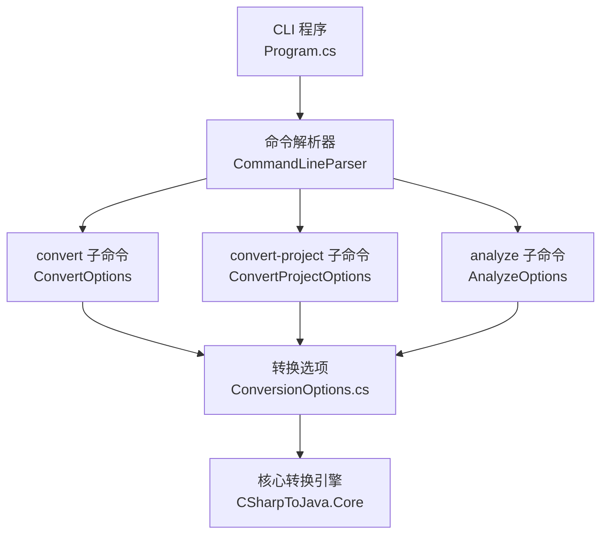
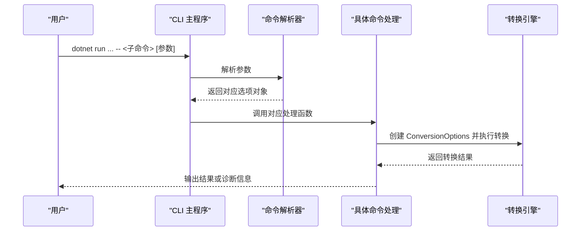
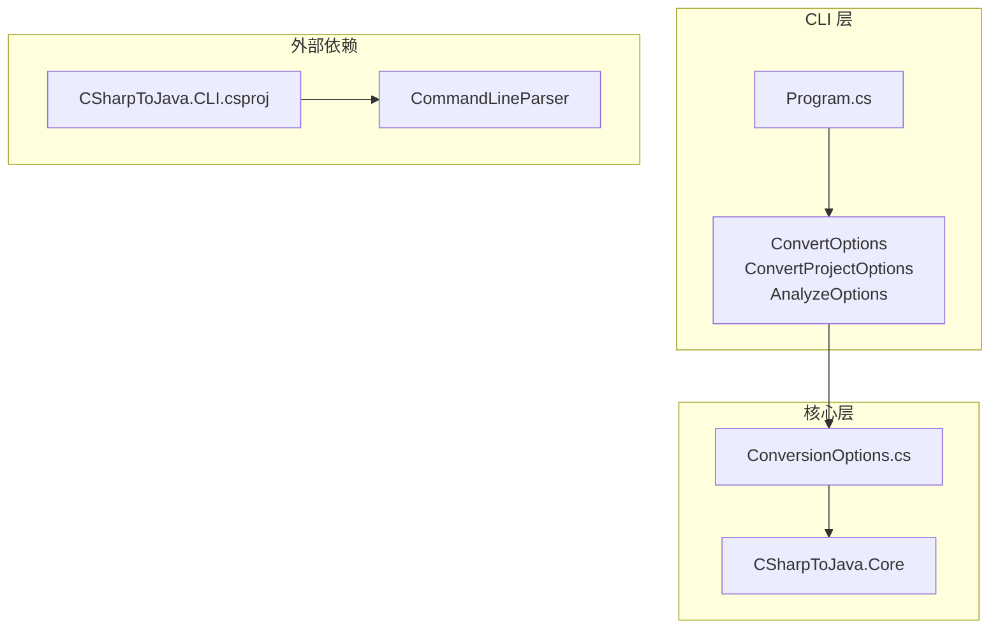

# 命令行界面

<cite>
**本文档引用的文件**
- [Program.cs](file://src/CSharpToJava.CLI/Program.cs)
- [CSharpToJava.CLI.csproj](file://src/CSharpToJava.CLI/CSharpToJava.CLI.csproj)
- [ConversionOptions.cs](file://src/CSharpToJava.Core/Context/ConversionOptions.cs)
- [README.md](file://README.md)
- [TypeMappings.json](file://config/TypeMappings.json)
</cite>

## 目录
1. [简介](#简介)
2. [项目结构](#项目结构)
3. [核心组件](#核心组件)
4. [架构总览](#架构总览)
5. [详细组件分析](#详细组件分析)
6. [依赖关系分析](#依赖关系分析)
7. [性能考虑](#性能考虑)
8. [故障排除指南](#故障排除指南)
9. [结论](#结论)
10. [附录](#附录)

## 简介
本文件为 cs2j 命令行界面（CLI）的完整 API 参考与使用指南。文档覆盖以下三个子命令及其参数选项：
- convert：将单个 C# 文件转换为 Java 源码
- convert-project：将整个 C# 项目转换为 Java 源码（支持单模块与多模块输出）
- analyze：对 C# 项目进行类型映射分析并生成报告

文档内容包括：
- 每个命令的用途、参数说明、类型与默认值
- 参数组合使用方式与注意事项
- 使用示例与最佳实践
- 错误处理与故障排除建议
- 与核心转换选项的对应关系

## 项目结构
cs2j 的 CLI 位于 CSharpToJava.CLI 工程中，通过命令行解析库实现子命令分发，并将参数映射到核心转换选项。

**图表来源**
- [Program.cs:13-25](file://src/CSharpToJava.CLI/Program.cs#L13-L25)
- [CSharpToJava.CLI.csproj:1-34](file://src/CSharpToJava.CLI/CSharpToJava.CLI.csproj#L1-L34)
- [ConversionOptions.cs:6-94](file://src/CSharpToJava.Core/Context/ConversionOptions.cs#L6-L94)

**章节来源**
- [Program.cs:13-25](file://src/CSharpToJava.CLI/Program.cs#L13-L25)
- [CSharpToJava.CLI.csproj:1-34](file://src/CSharpToJava.CLI/CSharpToJava.CLI.csproj#L1-L34)

## 核心组件
- CLI 主程序负责注册 MSBuild 定位器、解析命令行参数并分发到具体命令处理逻辑。
- 转换选项对象承载所有转换行为配置，如目标 Java 版本、是否生成 JavaDoc、是否使用 Optional、是否启用 LINQ 预处理、是否优先使用 Stream API 等。
- 子命令选项类定义了各命令的参数与默认值，并提供便捷属性用于解析最终行为。

**章节来源**
- [Program.cs:13-25](file://src/CSharpToJava.CLI/Program.cs#L13-L25)
- [ConversionOptions.cs:6-94](file://src/CSharpToJava.Core/Context/ConversionOptions.cs#L6-L94)

## 架构总览
CLI 的执行流程如下：

**图表来源**
- [Program.cs:13-25](file://src/CSharpToJava.CLI/Program.cs#L13-L25)
- [Program.cs:27-109](file://src/CSharpToJava.CLI/Program.cs#L27-L109)
- [Program.cs:111-304](file://src/CSharpToJava.CLI/Program.cs#L111-L304)

## 详细组件分析

### convert 子命令
将单个 C# 文件转换为 Java 源码。若未指定输出路径，则打印到标准输出。

- 基本参数
  - -i, --input
    - 类型：字符串（必填）
    - 说明：输入 C# 文件路径
  - -o, --output
    - 类型：字符串（可选）
    - 说明：输出 Java 文件路径；未指定时输出到标准输出
  - -m, --mapping
    - 类型：字符串（可选）
    - 说明：类型映射配置文件路径（默认使用内置配置）
  - -j, --java-version
    - 类型：字符串（可选，默认值：Java25）
    - 说明：目标 Java 版本（当前仅支持 Java25）

- 行为控制参数
  - --no-records
    - 类型：布尔（可选，默认：false）
    - 说明：不使用 Java records 表示 C# records
  - --use-optional
    - 类型：布尔（可选，默认：false）
    - 说明：使用 Optional 替代可空类型
  - --no-javadoc
    - 类型：布尔（可选，默认：false）
    - 说明：不生成 JavaDoc 注释
  - --no-linq-rewrite
    - 类型：布尔（可选，默认：false）
    - 说明：不预处理 LINQ 为过程化代码
  - --prefer-stream-api
    - 类型：布尔（可选，默认：由版本决定）
    - 说明：优先使用 Java Stream API 进行 LINQ 转换（Java 25 默认）
  - --prefer-procedural
    - 类型：布尔（可选，默认：false）
    - 说明：优先使用过程式循环进行 LINQ 转换
  - --no-parallel-project-passes
    - 类型：布尔（可选，默认：false）
    - 说明：禁用项目级树局部传递的并行执行
  - -v, --verbose
    - 类型：布尔（可选，默认：false）
    - 说明：显示诊断信息

- 便捷属性（由上述参数派生）
  - UseRecords：当 --no-records 为 false 时启用
  - GenerateJavaDoc：当 --no-javadoc 为 false 时启用
  - EnableLinqRewrite：当 --no-linq-rewrite 为 false 时启用
  - PreferStreamApi：显式设置时优先；否则根据 Java 版本默认
  - EnableParallelProjectPasses：当 --no-parallel-project-passes 为 false 时启用

- 处理流程要点
  - 输入文件存在性校验
  - 将 CLI 选项映射到核心转换选项
  - 执行转换并输出到文件或标准输出
  - 在详细模式下输出诊断信息

- 使用示例
  - 将单个文件转换到标准输出
    - 示例：dotnet run --project src/CSharpToJava.CLI/CSharpToJava.CLI.csproj -- convert -i Input.cs
  - 指定输出文件
    - 示例：dotnet run --project src/CSharpToJava.CLI/CSharpToJava.CLI.csproj -- convert -i Input.cs -o Output.java
  - 指定类型映射配置
    - 示例：dotnet run --project src/CSharpToJava.CLI/CSharpToJava.CLI.csproj -- convert -i Input.cs -m ./config/TypeMappings.json -o Output.java
  - 控制 JavaDoc 与 Optional
    - 示例：dotnet run --project src/CSharpToJava.CLI/CSharpToJava.CLI.csproj -- convert -i Input.cs --no-javadoc --use-optional -o Output.java
  - 显式选择 LINQ 转换策略
    - 示例：dotnet run --project src/CSharpToJava.CLI/CSharpToJava.CLI.csproj -- convert -i Input.cs --prefer-procedural -o Output.java

- 最佳实践
  - 在大型项目中建议使用 convert-project，以获得更好的增量构建与模块化输出
  - 对于需要严格控制生成代码风格的场景，使用 --no-javadoc 与 --no-records
  - 当目标 Java 版本较新时，可利用默认的 Stream API 策略；若需兼容旧版 JDK，可切换为过程式策略

**章节来源**
- [Program.cs:27-109](file://src/CSharpToJava.CLI/Program.cs#L27-L109)
- [Program.cs:2328-2375](file://src/CSharpToJava.CLI/Program.cs#L2328-L2375)
- [ConversionOptions.cs:6-94](file://src/CSharpToJava.Core/Context/ConversionOptions.cs#L6-L94)

### convert-project 子命令
将 C# 项目（目录、.csproj 或 .sln）转换为 Java 源码，支持单模块与多模块输出。

- 基本参数
  - -s, --source
    - 类型：字符串（必填）
    - 说明：源目录、.csproj 或 .sln 路径
  - -d, --destination
    - 类型：字符串（必填）
    - 说明：目标目录路径
  - -m, --mapping
    - 类型：字符串（可选）
    - 说明：类型映射配置文件路径
  - -j, --java-version
    - 类型：字符串（可选，默认值：Java25）
    - 说明：目标 Java 版本

- 行为控制参数
  - -f, --force
    - 类型：布尔（可选，默认：true）
    - 说明：覆盖现有文件
  - --no-records
    - 类型：布尔（可选，默认：false）
    - 说明：不使用 Java records
  - --use-optional
    - 类型：布尔（可选，默认：false）
    - 说明：使用 Optional 替代可空类型
  - --no-javadoc
    - 类型：布尔（可选，默认：false）
    - 说明：不生成 JavaDoc
  - --no-linq-rewrite
    - 类型：布尔（可选，默认：false）
    - 说明：不预处理 LINQ 为过程化代码
  - --prefer-stream-api
    - 类型：布尔（可选，默认：由版本决定）
    - 说明：优先使用 Java Stream API（Java 25 默认）
  - --prefer-procedural
    - 类型：布尔（可选，默认：false）
    - 说明：优先使用过程式循环
  - --generate-pom
    - 类型：布尔（可选，默认：true）
    - 说明：生成标准 Maven 结构的 pom.xml
  - --maven-group-id
    - 类型：字符串（可选，默认：io.github.ningpp）
    - 说明：Maven groupId
  - --maven-version
    - 类型：字符串（可选，默认：0.0.1-SNAPSHOT）
    - 说明：Maven 版本
  - --include-tests
    - 类型：布尔（可选，默认：true）
    - 说明：包含测试项目并输出到 src/test/java
  - --mode
    - 类型：字符串（可选，默认：multi-module）
    - 说明：输出模式：single-module 或 multi-module
  - --linq-report
    - 类型：布尔（可选，默认：false）
    - 说明：输出 LINQ 预处理报告（统计、跳过链路、未覆盖操作符）
  - -v, --verbose
    - 类型：布尔（可选，默认：false）
    - 说明：显示详细进度

- 处理流程要点
  - 支持 MSBuild 加载与目录扫描两种项目发现方式
  - 支持单模块与多模块输出；多模块时可生成共享兼容模块
  - 支持增量写入会话，避免重复写入
  - 可生成 pom.xml 与工作区计划清单
  - 可输出 LINQ 报告与传递性能快照

- 使用示例
  - 单模块输出（默认）
    - 示例：dotnet run --project src/CSharpToJava.CLI/CSharpToJava.CLI.csproj -- convert-project -s ./src -d ./output
  - 多模块输出
    - 示例：dotnet run --project src/CSharpToJava.CLI/CSharpToJava.CLI.csproj -- convert-project -s ./solution.sln -d ./workspace --mode multi-module
  - 生成 pom 并自定义坐标
    - 示例：dotnet run --project src/CSharpToJava.CLI/CSharpToJava.CLI.csproj -- convert-project -s ./src -d ./output --generate-pom --maven-group-id com.example --maven-version 1.0.0
  - 包含测试项目
    - 示例：dotnet run --project src/CSharpToJava.CLI/CSharpToJava.CLI.csproj -- convert-project -s ./src -d ./output --include-tests
  - 输出 LINQ 报告
    - 示例：dotnet run --project src/CSharpToJava.CLI/CSharpToJava.CLI.csproj -- convert-project -s ./src -d ./output --linq-report

- 最佳实践
  - 大型解决方案建议使用 multi-module 模式，便于模块化管理与 CI 构建
  - 在 CI 环境中开启 --linq-report 以便持续监控 LINQ 转换质量
  - 使用 --force 时谨慎，确保不会意外覆盖重要文件

**章节来源**
- [Program.cs:111-304](file://src/CSharpToJava.CLI/Program.cs#L111-L304)
- [Program.cs:2377-2440](file://src/CSharpToJava.CLI/Program.cs#L2377-L2440)
- [ConversionOptions.cs:6-94](file://src/CSharpToJava.Core/Context/ConversionOptions.cs#L6-L94)

### analyze 子命令
对 C# 项目进行类型映射分析，生成覆盖报告。

- 基本参数
  - -s, --source
    - 类型：字符串（必填）
    - 说明：源目录路径
  - -m, --mapping
    - 类型：字符串（可选）
    - 说明：类型映射配置文件路径
  - -r, --report
    - 类型：字符串（必填）
    - 说明：报告输出文件路径

- 使用示例
  - 示例：dotnet run --project src/CSharpToJava.CLI/CSharpToJava.CLI.csproj -- analyze -s ./src -r report.json

- 最佳实践
  - 在修改类型映射配置前先运行分析，评估影响范围
  - 将报告纳入版本控制，便于追踪映射变化

**章节来源**
- [Program.cs:2442-2453](file://src/CSharpToJava.CLI/Program.cs#L2442-L2453)

## 依赖关系分析

**图表来源**
- [Program.cs:1-10](file://src/CSharpToJava.CLI/Program.cs#L1-L10)
- [CSharpToJava.CLI.csproj](file://src/CSharpToJava.CLI/CSharpToJava.CLI.csproj#L10)
- [ConversionOptions.cs:6-94](file://src/CSharpToJava.Core/Context/ConversionOptions.cs#L6-L94)

**章节来源**
- [Program.cs:1-10](file://src/CSharpToJava.CLI/Program.cs#L1-L10)
- [CSharpToJava.CLI.csproj](file://src/CSharpToJava.CLI/CSharpToJava.CLI.csproj#L10)

## 性能考虑
- 并行项目传递：在支持的场景下，可通过启用并行项目传递提升转换速度；在多模块模式下，兼容模块集中化可减少重复生成。
- 增量输出：CLI 提供增量写入会话，避免重复写入，提高重复运行效率。
- LINQ 策略：在 Java 25 下默认优先使用 Stream API，通常性能更优；若需兼容旧版 JDK，可切换为过程式策略。
- 资源复制：在项目转换过程中，资源文件会被复制到对应资源目录，注意磁盘 I/O 开销。

[本节为通用性能建议，无需特定文件引用]

## 故障排除指南
- 输入/输出路径问题
  - convert：检查 -i 指定的输入文件是否存在；-o 未指定时输出到标准输出。
  - convert-project：检查 -s 源路径是否为有效目录、.csproj 或 .sln；-d 目标目录权限是否足够。
- 目标目录已存在
  - convert-project 在目标目录存在且未启用 --force 时会报错；请使用 --force 覆盖或更换目标目录。
- MSBuild 加载失败
  - 若 MSBuild 加载失败，CLI 会回退到目录扫描；可在详细模式下查看回退提示。
- 平台规则排除
  - 若所有发现的项目被平台规则排除，会提示错误；请检查项目类型与平台支持。
- 诊断信息
  - 使用 -v/--verbose 查看详细诊断；转换失败时会输出诊断列表。
- 异常与堆栈
  - 发生异常时会输出错误消息；在详细模式下可查看堆栈跟踪。

**章节来源**
- [Program.cs:29-109](file://src/CSharpToJava.CLI/Program.cs#L29-L109)
- [Program.cs:111-304](file://src/CSharpToJava.CLI/Program.cs#L111-L304)

## 结论
cs2j CLI 提供了从单文件到项目级的完整转换能力，支持灵活的行为控制与模块化输出。通过合理选择参数与策略，可在保证代码质量的同时提升转换效率。建议在大型项目中采用 convert-project 并结合多模块输出与 pom 生成，以获得更好的工程化体验。

[本节为总结性内容，无需特定文件引用]

## 附录

### 参数与默认值速查表
- convert
  - -i/--input：必填，字符串
  - -o/--output：可选，字符串（默认：标准输出）
  - -m/--mapping：可选，字符串（默认：内置映射）
  - -j/--java-version：可选，字符串（默认：Java25）
  - --no-records：可选，布尔（默认：false）
  - --use-optional：可选，布尔（默认：false）
  - --no-javadoc：可选，布尔（默认：false）
  - --no-linq-rewrite：可选，布尔（默认：false）
  - --prefer-stream-api：可选，布尔（默认：由版本决定）
  - --prefer-procedural：可选，布尔（默认：false）
  - --no-parallel-project-passes：可选，布尔（默认：false）
  - -v/--verbose：可选，布尔（默认：false）

- convert-project
  - -s/--source：必填，字符串
  - -d/--destination：必填，字符串
  - -m/--mapping：可选，字符串
  - -j/--java-version：可选，字符串（默认：Java25）
  - -f/--force：可选，布尔（默认：true）
  - --no-records：可选，布尔（默认：false）
  - --use-optional：可选，布尔（默认：false）
  - --no-javadoc：可选，布尔（默认：false）
  - --no-linq-rewrite：可选，布尔（默认：false）
  - --prefer-stream-api：可选，布尔（默认：由版本决定）
  - --prefer-procedural：可选，布尔（默认：false）
  - --generate-pom：可选，布尔（默认：true）
  - --maven-group-id：可选，字符串（默认：io.github.ningpp）
  - --maven-version：可选，字符串（默认：0.0.1-SNAPSHOT）
  - --include-tests：可选，布尔（默认：true）
  - --mode：可选，字符串（默认：multi-module）
  - --linq-report：可选，布尔（默认：false）
  - -v/--verbose：可选，布尔（默认：false）

- analyze
  - -s/--source：必填，字符串
  - -m/--mapping：可选，字符串
  - -r/--report：必填，字符串

**章节来源**
- [Program.cs:2328-2453](file://src/CSharpToJava.CLI/Program.cs#L2328-L2453)
- [ConversionOptions.cs:6-94](file://src/CSharpToJava.Core/Context/ConversionOptions.cs#L6-L94)

### 使用示例与最佳实践
- convert
  - 将单文件转换到标准输出
    - 示例：dotnet run --project src/CSharpToJava.CLI/CSharpToJava.CLI.csproj -- convert -i Input.cs
  - 指定输出文件
    - 示例：dotnet run --project src/CSharpToJava.CLI/CSharpToJava.CLI.csproj -- convert -i Input.cs -o Output.java
  - 指定类型映射配置
    - 示例：dotnet run --project src/CSharpToJava.CLI/CSharpToJava.CLI.csproj -- convert -i Input.cs -m ./config/TypeMappings.json -o Output.java
  - 控制 JavaDoc 与 Optional
    - 示例：dotnet run --project src/CSharpToJava.CLI/CSharpToJava.CLI.csproj -- convert -i Input.cs --no-javadoc --use-optional -o Output.java
  - 显式选择 LINQ 转换策略
    - 示例：dotnet run --project src/CSharpToJava.CLI/CSharpToJava.CLI.csproj -- convert -i Input.cs --prefer-procedural -o Output.java

- convert-project
  - 单模块输出（默认）
    - 示例：dotnet run --project src/CSharpToJava.CLI/CSharpToJava.CLI.csproj -- convert-project -s ./src -d ./output
  - 多模块输出
    - 示例：dotnet run --project src/CSharpToJava.CLI/CSharpToJava.CLI.csproj -- convert-project -s ./solution.sln -d ./workspace --mode multi-module
  - 生成 pom 并自定义坐标
    - 示例：dotnet run --project src/CSharpToJava.CLI/CSharpToJava.CLI.csproj -- convert-project -s ./src -d ./output --generate-pom --maven-group-id com.example --maven-version 1.0.0
  - 包含测试项目
    - 示例：dotnet run --project src/CSharpToJava.CLI/CSharpToJava.CLI.csproj -- convert-project -s ./src -d ./output --include-tests
  - 输出 LINQ 报告
    - 示例：dotnet run --project src/CSharpToJava.CLI/CSharpToJava.CLI.csproj -- convert-project -s ./src -d ./output --linq-report

- analyze
  - 示例：dotnet run --project src/CSharpToJava.CLI/CSharpToJava.CLI.csproj -- analyze -s ./src -r report.json

**章节来源**
- [README.md:30-48](file://README.md#L30-L48)

### 类型映射配置
- 默认映射文件位置：./config/TypeMappings.json
- 可通过 -m/--mapping 指定自定义映射文件
- 建议在修改映射前先运行 analyze 获取覆盖报告

**章节来源**
- [TypeMappings.json:1-800](file://config/TypeMappings.json#L1-L800)