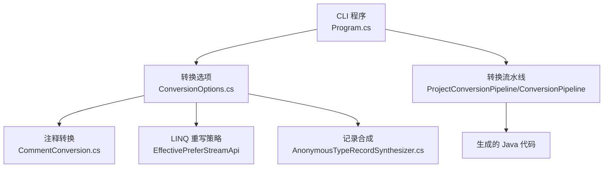
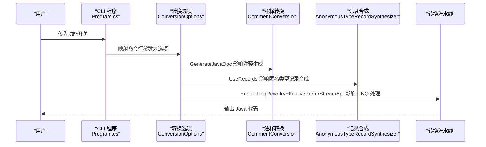
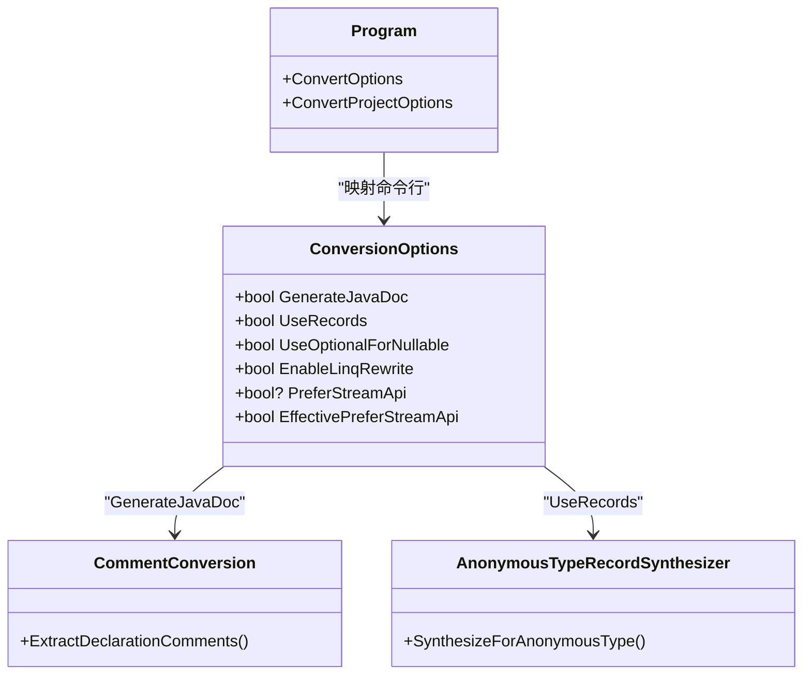

# 功能开关选项

<cite>
**本文档引用的文件**
- [README.md](file://README.md)
- [Program.cs](file://src/CSharpToJava.CLI/Program.cs)
- [ConversionOptions.cs](file://src/CSharpToJava.Core/Context/ConversionOptions.cs)
- [CommentConversion.cs](file://src/CSharpToJava.Core/Comments/CommentConversion.cs)
- [AnonymousTypeRecordSynthesizer.cs](file://src/CSharpToJava.Core/Transformers/AnonymousTypeRecordSynthesizer.cs)
- [LinqQueryDesugarTests.cs](file://tests/CSharpToJava.Tests/LinqQueryDesugarTests.cs)
- [RecordTransformerTests.cs](file://tests/CSharpToJava.Tests/RecordTransformerTests.cs)
- [convert-agl-graphlayout.sh](file://convert-agl-graphlayout.sh)
</cite>

## 目录
1. [简介](#简介)
2. [项目结构](#项目结构)
3. [核心组件](#核心组件)
4. [架构总览](#架构总览)
5. [详细组件分析](#详细组件分析)
6. [依赖关系分析](#依赖关系分析)
7. [性能考量](#性能考量)
8. [故障排查指南](#故障排查指南)
9. [结论](#结论)
10. [附录](#附录)

## 简介
本文件为 cs2j 的功能开关选项提供权威参考，重点覆盖以下五个关键开关：
- JavaDoc 生成选项：--generate-javadoc（或 --no-javadoc）
- 记录类型使用选项：--use-records（或 --no-records）
- 可空类型处理选项：--use-optional-for-nullable
- LINQ 重写启用选项：--enable-linq-rewrite（或 --no-linq-rewrite）
- Stream API 偏好选项：--prefer-stream-api（或 --prefer-procedural）

我们将解释每个功能开关对转换结果的影响，包括代码风格变化、性能影响和兼容性考虑，并提供不同场景下的推荐配置组合。

## 项目结构
cs2j 的 CLI 层负责解析命令行参数并将它们映射到转换选项；核心转换逻辑在 Pipeline 中执行；具体行为由转换选项驱动。

**图表来源**
- [Program.cs:39-50](file://src/CSharpToJava.CLI/Program.cs#L39-L50)
- [ConversionOptions.cs:25-60](file://src/CSharpToJava.Core/Context/ConversionOptions.cs#L25-L60)
- [CommentConversion.cs:29-41](file://src/CSharpToJava.Core/Comments/CommentConversion.cs#L29-L41)
- [AnonymousTypeRecordSynthesizer.cs:46-49](file://src/CSharpToJava.Core/Transformers/AnonymousTypeRecordSynthesizer.cs#L46-L49)

**章节来源**
- [README.md:50-62](file://README.md#L50-L62)
- [Program.cs:39-50](file://src/CSharpToJava.CLI/Program.cs#L39-L50)
- [ConversionOptions.cs:25-60](file://src/CSharpToJava.Core/Context/ConversionOptions.cs#L25-L60)

## 核心组件
- 转换选项模型（ConversionOptions）：集中管理所有转换行为开关及其默认值。
- CLI 参数映射：将命令行开关映射到转换选项。
- 注释转换：受 GenerateJavaDoc 控制，决定是否生成 JavaDoc。
- 记录合成：受 UseRecords 控制，决定匿名类型是否转为 Java 记录。
- LINQ 重写策略：EnableLinqRewrite 决定是否启用预处理，EffectivePreferStreamApi 决定使用 Stream API 还是过程化代码。

**章节来源**
- [ConversionOptions.cs:25-60](file://src/CSharpToJava.Core/Context/ConversionOptions.cs#L25-L60)
- [Program.cs:2328-2375](file://src/CSharpToJava.CLI/Program.cs#L2328-L2375)
- [CommentConversion.cs:29-41](file://src/CSharpToJava.Core/Comments/CommentConversion.cs#L29-L41)
- [AnonymousTypeRecordSynthesizer.cs:46-49](file://src/CSharpToJava.Core/Transformers/AnonymousTypeRecordSynthesizer.cs#L46-L49)

## 架构总览
下图展示了从 CLI 到转换选项再到具体转换行为的关键流程。

**图表来源**
- [Program.cs:39-50](file://src/CSharpToJava.CLI/Program.cs#L39-L50)
- [ConversionOptions.cs:25-60](file://src/CSharpToJava.Core/Context/ConversionOptions.cs#L25-L60)
- [CommentConversion.cs:29-41](file://src/CSharpToJava.Core/Comments/CommentConversion.cs#L29-L41)
- [AnonymousTypeRecordSynthesizer.cs:46-49](file://src/CSharpToJava.Core/Transformers/AnonymousTypeRecordSynthesizer.cs#L46-L49)

## 详细组件分析

### JavaDoc 生成选项（--generate-javadoc / --no-javadoc）
- 功能说明
  - 开启时：读取 C# XML 文档注释，转换为 JavaDoc 风格的注释块，包含摘要、备注、参数、返回值、异常等标签。
  - 关闭时：不生成 JavaDoc 注释，仅保留普通注释（若存在）。
- 对转换结果的影响
  - 代码风格：生成更规范的 JavaDoc 注释，提升 API 文档质量。
  - 性能：开启会触发 Roslyn 文档注释提取与 XML 解析，轻微增加转换时间。
  - 兼容性：不影响运行时行为，仅影响源码注释。
- 推荐场景
  - 需要生成完整 API 文档的项目。
  - 团队有严格的文档规范要求。
- 相关实现点
  - 选项字段：GenerateJavaDoc（默认 true）
  - 注释转换入口：ExtractDeclarationComments 中根据 GenerateJavaDoc 决定是否转换文档注释

**章节来源**
- [README.md](file://README.md#L60)
- [ConversionOptions.cs:25-28](file://src/CSharpToJava.Core/Context/ConversionOptions.cs#L25-L28)
- [CommentConversion.cs:29-41](file://src/CSharpToJava.Core/Comments/CommentConversion.cs#L29-L41)

### 记录类型使用选项（--use-records / --no-records）
- 功能说明
  - 开启时：C# record 类型转换为 Java record；匿名对象创建表达式在 Java 25 目标下合成局部记录类，保持类型安全与访问器方法。
  - 关闭时：record 转换为普通类；匿名对象创建表达式降级为其他结构（如 Map）以兼容旧版本 Java。
- 对转换结果的影响
  - 代码风格：使用现代 Java 语法，减少样板代码。
  - 性能：record 在某些场景下具有更好的不可变性与哈希性能优势。
  - 兼容性：需要目标 Java 版本支持 record（当前默认 Java25）。
- 推荐场景
  - 目标 JDK 25+，追求不可变数据结构与简洁 API。
  - 需要保留匿名类型的类型安全与可读性。
- 相关实现点
  - 选项字段：UseRecords（默认 true）
  - 匿名类型记录合成：在 Java 25 下将匿名类型转为本地记录类

**章节来源**
- [README.md](file://README.md#L11)
- [ConversionOptions.cs:30-33](file://src/CSharpToJava.Core/Context/ConversionOptions.cs#L30-L33)
- [AnonymousTypeRecordSynthesizer.cs:46-49](file://src/CSharpToJava.Core/Transformers/AnonymousTypeRecordSynthesizer.cs#L46-L49)
- [RecordTransformerTests.cs:319-329](file://tests/CSharpToJava.Tests/RecordTransformerTests.cs#L319-L329)

### 可空类型处理选项（--use-optional-for-nullable）
- 功能说明
  - 开启时：将 C# 可空类型（如 int?）映射为 Java Optional 类型，显式表达“可能为空”的语义。
  - 关闭时：采用传统映射策略（如基本类型的包装或特殊占位），不引入 Optional。
- 对转换结果的影响
  - 代码风格：Optional 显式表达空值风险，但可能增加调用链复杂度。
  - 性能：Optional 的装箱/拆箱与分支判断带来额外开销。
  - 兼容性：需要 Java 8+ 支持 Optional。
- 推荐场景
  - 需要强类型约束空值传播的大型项目。
  - 与 Java 生态中广泛使用 Optional 的模块集成。
- 注意事项
  - 该选项在当前仓库未见直接测试覆盖，建议结合项目实际进行验证。

**章节来源**
- [README.md](file://README.md#L59)
- [ConversionOptions.cs:34-38](file://src/CSharpToJava.Core/Context/ConversionOptions.cs#L34-L38)

### LINQ 重写启用选项（--enable-linq-rewrite / --no-linq-rewrite）
- 功能说明
  - 开启时：将 LINQ 查询转换为过程化代码或 Stream API（取决于 PreferStreamApi），提升可读性与性能。
  - 关闭时：跳过预处理，直接按默认策略转换。
- 对转换结果的影响
  - 代码风格：启用后通常生成更贴近 Java 习惯的链式调用或循环实现。
  - 性能：Stream API 在大数据集上具备惰性求值与并行流潜力；过程化代码在小数据集上更直接。
  - 兼容性：需要目标 Java 版本支持相关 API。
- 推荐场景
  - 需要高性能与可读性兼顾的数据处理。
  - 与现有 Java 流式 API 生态一致的项目。

**章节来源**
- [README.md](file://README.md#L9)
- [ConversionOptions.cs:45-48](file://src/CSharpToJava.Core/Context/ConversionOptions.cs#L45-L48)
- [LinqQueryDesugarTests.cs:26-39](file://tests/CSharpToJava.Tests/LinqQueryDesugarTests.cs#L26-L39)

### Stream API 偏好选项（--prefer-stream-api / --prefer-procedural）
- 功能说明
  - 当 EnableLinqRewrite 为真时，PreferStreamApi 决定 LINQ 转换策略：
    - 显式设置为 true：优先使用 Stream API（默认适用于 Java 25）。
    - 显式设置为 false：优先使用过程化循环。
    - 未设置：基于目标 Java 版本（当前默认 Java25）采用 Stream API。
- 对转换结果的影响
  - 代码风格：Stream API 更函数式、链式；过程化代码更直观、易调试。
  - 性能：Stream API 在并行流与惰性求值上有优势；过程化代码在简单场景更高效。
  - 兼容性：两者均需 Java 8+。
- 推荐场景
  - Java 25+ 且偏向函数式编程风格。
  - 需要与现有 Java 流式处理一致的团队约定。
- 相关实现点
  - EffectivePreferStreamApi：综合 PreferStreamApi 与目标版本的最终策略
  - CLI 中通过 --prefer-stream-api 与 --prefer-procedural 互斥组控制

**章节来源**
- [ConversionOptions.cs:50-60](file://src/CSharpToJava.Core/Context/ConversionOptions.cs#L50-L60)
- [Program.cs:2358-2362](file://src/CSharpToJava.CLI/Program.cs#L2358-L2362)
- [Program.cs:2410-2414](file://src/CSharpToJava.CLI/Program.cs#L2410-L2414)
- [LinqQueryDesugarTests.cs:26-39](file://tests/CSharpToJava.Tests/LinqQueryDesugarTests.cs#L26-L39)

## 依赖关系分析
- CLI 选项到转换选项的映射
  - CLI 将命令行开关映射到 ConversionOptions 的对应字段，再由转换流水线读取这些选项。
- 转换选项对具体模块的影响
  - GenerateJavaDoc → CommentConversion
  - UseRecords → AnonymousTypeRecordSynthesizer
  - EnableLinqRewrite/EffectivePreferStreamApi → LINQ 重写与链式策略
- 测试用例验证
  - LinqQueryDesugarTests 通过 ProceduralOptions/StreamOptions 验证两种策略差异。
  - RecordTransformerTests 验证 UseRecords 与降级行为。

**图表来源**
- [Program.cs:39-50](file://src/CSharpToJava.CLI/Program.cs#L39-L50)
- [ConversionOptions.cs:25-60](file://src/CSharpToJava.Core/Context/ConversionOptions.cs#L25-L60)
- [CommentConversion.cs:29-41](file://src/CSharpToJava.Core/Comments/CommentConversion.cs#L29-L41)
- [AnonymousTypeRecordSynthesizer.cs:46-49](file://src/CSharpToJava.Core/Transformers/AnonymousTypeRecordSynthesizer.cs#L46-L49)

**章节来源**
- [Program.cs:39-50](file://src/CSharpToJava.CLI/Program.cs#L39-L50)
- [ConversionOptions.cs:25-60](file://src/CSharpToJava.Core/Context/ConversionOptions.cs#L25-L60)
- [LinqQueryDesugarTests.cs:118-138](file://tests/CSharpToJava.Tests/LinqQueryDesugarTests.cs#L118-L138)
- [RecordTransformerTests.cs:319-329](file://tests/CSharpToJava.Tests/RecordTransformerTests.cs#L319-L329)

## 性能考量
- JavaDoc 生成
  - 会触发文档注释提取与 XML 解析，对大型项目略有额外开销。
- 记录类型
  - record 在不可变性与哈希方面有优势，但在频繁复制场景下需权衡。
- 可空类型 Optional
  - Optional 可读性强，但装箱/拆箱与分支判断会带来一定性能成本。
- LINQ 重写与 Stream API
  - Stream API 在大数据与并行场景表现更好；过程化代码在小数据与调试友好性上更优。
- 建议
  - 在 CI 中开启 JavaDoc 生成以保证文档质量。
  - 在生产环境优先考虑性能与团队接受度，选择合适的 LINQ 策略。

[本节为通用指导，无需特定文件来源]

## 故障排查指南
- 问题：生成的 Java 代码缺少注释
  - 检查是否使用了 --no-javadoc 或 GenerateJavaDoc=false
  - 确认源代码存在 XML 文档注释
- 问题：record 未生效或匿名类型未转为记录
  - 检查是否使用了 --no-records 或 UseRecords=false
  - 确认目标 Java 版本为 Java25
- 问题：LINQ 未按预期转换为 Stream API 或过程化代码
  - 检查是否使用了 --no-linq-rewrite 或 EnableLinqRewrite=false
  - 检查是否设置了 --prefer-procedural 或 PreferStreamApi=false
  - 若未设置，确认目标 Java 版本默认策略
- 问题：脚本中使用了 --prefer-procedural
  - 参考 convert-agl-graphlayout.sh 中的示例，确保与其他选项配合使用

**章节来源**
- [README.md:50-62](file://README.md#L50-L62)
- [Program.cs:2343-2375](file://src/CSharpToJava.CLI/Program.cs#L2343-L2375)
- [Program.cs:2395-2440](file://src/CSharpToJava.CLI/Program.cs#L2395-L2440)
- [convert-agl-graphlayout.sh:38-44](file://convert-agl-graphlayout.sh#L38-L44)

## 结论
- JavaDoc 生成：提升文档质量，适合需要完整 API 文档的项目。
- 记录类型：在 Java 25+ 下显著改善不可变数据结构表达，建议默认开启。
- 可空类型 Optional：增强空值表达力，但需权衡性能与复杂度。
- LINQ 重写与 Stream API：根据数据规模与团队偏好选择，Java 25 默认倾向 Stream API。
- 组合建议：优先保证文档与类型安全，再根据性能与团队习惯调整 LINQ 策略。

[本节为总结，无需特定文件来源]

## 附录

### 常用推荐配置组合
- 高质量文档 + 现代记录 + Stream API（Java 25）
  - --generate-javadoc
  - --use-records
  - --prefer-stream-api
- 兼容性优先 + 过程式 LINQ
  - --no-javadoc
  - --use-records
  - --prefer-procedural
- 强空值约束 + 现代记录
  - --generate-javadoc
  - --use-records
  - --use-optional-for-nullable

[本节为实践建议，无需特定文件来源]