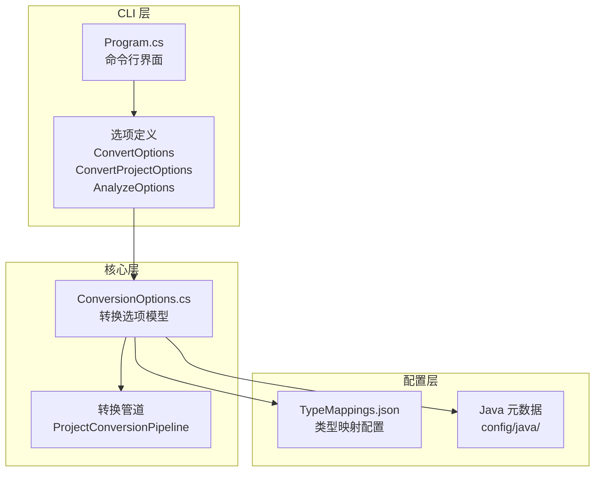
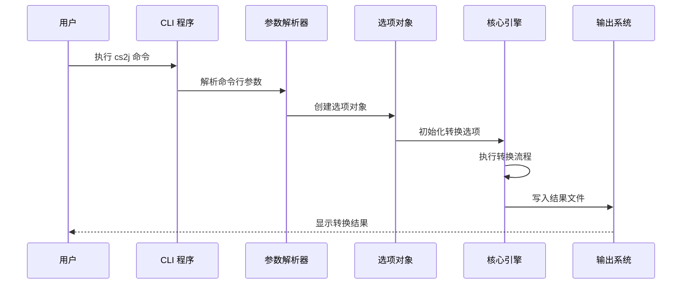
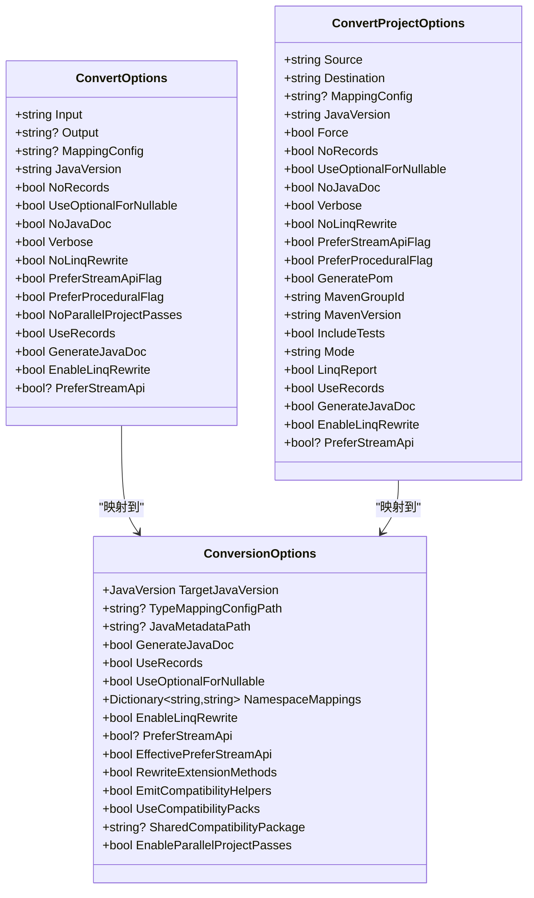

# 命令行选项参考

<cite>
**本文档引用的文件**
- [Program.cs](file://src/CSharpToJava.CLI/Program.cs)
- [ConversionOptions.cs](file://src/CSharpToJava.Core/Context/ConversionOptions.cs)
- [README.md](file://README.md)
- [CSharpToJava.CLI.csproj](file://src/CSharpToJava.CLI/CSharpToJava.CLI.csproj)
</cite>

## 目录
1. [简介](#简介)
2. [项目结构](#项目结构)
3. [核心组件](#核心组件)
4. [架构概览](#架构概览)
5. [详细组件分析](#详细组件分析)
6. [依赖分析](#依赖分析)
7. [性能考虑](#性能考虑)
8. [故障排除指南](#故障排除指南)
9. [结论](#结论)

## 简介

cs2j 是一个基于 Roslyn 的 C# 到 Java 源代码转换器。本文档提供了完整的命令行选项参考，涵盖所有可用的命令行参数、它们的含义、类型、默认值以及使用示例。

## 项目结构

cs2j 采用多项目架构，主要包含以下组件：



**图表来源**
- [Program.cs:2328-2454](file://src/CSharpToJava.CLI/Program.cs#L2328-L2454)
- [ConversionOptions.cs:1-103](file://src/CSharpToJava.Core/Context/ConversionOptions.cs#L1-L103)

**章节来源**
- [Program.cs:1-50](file://src/CSharpToJava.CLI/Program.cs#L1-L50)
- [README.md:64-74](file://README.md#L64-L74)

## 核心组件

cs2j 提供三种主要的命令行操作模式：

### 1. 文件转换模式 (`convert`)
用于转换单个 C# 文件到 Java 文件

### 2. 项目转换模式 (`convert-project`)
用于转换整个 C# 项目或解决方案

### 3. 分析模式 (`analyze`)
用于分析项目的类型映射覆盖情况

**章节来源**
- [Program.cs:18-25](file://src/CSharpToJava.CLI/Program.cs#L18-L25)
- [Program.cs:2328-2454](file://src/CSharpToJava.CLI/Program.cs#L2328-L2454)

## 架构概览

cs2j 的命令行架构采用分层设计，从命令行解析到核心转换引擎：



**图表来源**
- [Program.cs:13-25](file://src/CSharpToJava.CLI/Program.cs#L13-L25)
- [Program.cs:39-58](file://src/CSharpToJava.CLI/Program.cs#L39-L58)

## 详细组件分析

### 输入输出选项

#### -i, --input (必需)
- **类型**: 字符串
- **默认值**: 无
- **描述**: 指定要转换的输入 C# 文件路径
- **使用场景**: 单文件转换时指定源文件
- **示例**: `dotnet run --project src/CSharpToJava.CLI/CSharpToJava.CLI.csproj -- convert -i Input.cs -o Output.java`

#### -o, --output (可选)
- **类型**: 字符串
- **默认值**: 标准输出
- **描述**: 指定输出 Java 文件路径，省略时表示标准输出
- **使用场景**: 将转换结果保存到文件
- **示例**: `dotnet run --project src/CSharpToJava.CLI/CSharpToJava.CLI.csproj -- convert -i Input.cs -o Output.java`

#### -s, --source (必需)
- **类型**: 字符串
- **默认值**: 无
- **描述**: 指定源目录、.csproj 文件或 .sln 文件路径
- **使用场景**: 项目转换时指定源位置
- **示例**: `dotnet run --project src/CSharpToJava.CLI/CSharpToJava.CLI.csproj -- convert-project -s ./src -d ./output`

#### -d, --destination (必需)
- **类型**: 字符串
- **默认值**: 无
- **描述**: 指定目标目录路径
- **使用场景**: 项目转换时指定输出目录
- **示例**: `dotnet run --project src/CSharpToJava.CLI/CSharpToJava.CLI.csproj -- convert-project -s ./src -d ./output`

**章节来源**
- [Program.cs:2331-2335](file://src/CSharpToJava.CLI/Program.cs#L2331-L2335)
- [Program.cs:2380-2384](file://src/CSharpToJava.CLI/Program.cs#L2380-L2384)

### 配置选项

#### -m, --mapping (可选)
- **类型**: 字符串
- **默认值**: ./config/TypeMappings.json
- **描述**: 指定类型映射配置文件的路径
- **使用场景**: 自定义类型映射规则
- **示例**: `dotnet run --project src/CSharpToJava.CLI/CSharpToJava.CLI.csproj -- convert -i Input.cs -m ./custom-mappings.json`

#### -j, --java-version (可选)
- **类型**: 字符串
- **默认值**: Java25
- **描述**: 指定目标 Java 版本
- **使用场景**: 指定兼容的 Java 版本
- **示例**: `dotnet run --project src/CSharpToJava.CLI/CSharpToJava.CLI.csproj -- convert -i Input.cs -j Java25`

**章节来源**
- [Program.cs:2337-2341](file://src/CSharpToJava.CLI/Program.cs#L2337-L2341)
- [Program.cs:2386-2390](file://src/CSharpToJava.CLI/Program.cs#L2386-L2390)
- [README.md:56-57](file://README.md#L56-L57)

### 功能开关选项

#### --no-records (可选)
- **类型**: 布尔值
- **默认值**: false
- **描述**: 不使用 Java records 处理 C# records
- **使用场景**: 需要向后兼容旧版 Java
- **示例**: `dotnet run --project src/CSharpToJava.CLI/CSharpToJava.CLI.csproj -- convert -i Input.cs --no-records`

#### --use-optional (可选)
- **类型**: 布尔值
- **默认值**: false
- **描述**: 使用 Optional 处理可空类型
- **使用场景**: 更严格的空值处理
- **示例**: `dotnet run --project src/CSharpToJava.CLI/CSharpToJava.CLI.csproj -- convert -i Input.cs --use-optional`

#### --no-javadoc (可选)
- **类型**: 布尔值
- **默认值**: false
- **描述**: 不生成 JavaDoc 注释
- **使用场景**: 减少注释生成时间
- **示例**: `dotnet run --project src/CSharpToJava.CLI/CSharpToJava.CLI.csproj -- convert -i Input.cs --no-javadoc`

#### --no-linq-rewrite (可选)
- **类型**: 布尔值
- **默认值**: false
- **描述**: 不预处理 LINQ 到过程化代码
- **使用场景**: 保持原始 LINQ 结构
- **示例**: `dotnet run --project src/CSharpToJava.CLI/CSharpToJava.CLI.csproj -- convert -i Input.cs --no-linq-rewrite`

#### -v, --verbose (可选)
- **类型**: 布尔值
- **默认值**: false
- **描述**: 显示诊断消息
- **使用场景**: 调试转换问题
- **示例**: `dotnet run --project src/CSharpToJava.CLI/CSharpToJava.CLI.csproj -- convert -i Input.cs -v`

**章节来源**
- [Program.cs:2343-2356](file://src/CSharpToJava.CLI/Program.cs#L2343-L2356)
- [Program.cs:2395-2408](file://src/CSharpToJava.CLI/Program.cs#L2395-L2408)

### LINQ 转换策略选项

#### --prefer-stream-api (可选)
- **类型**: 布尔值
- **默认值**: false
- **描述**: 优先使用 Java Stream API 进行 LINQ 转换（Java 25 默认）
- **使用场景**: 生成更现代的 Java 代码
- **示例**: `dotnet run --project src/CSharpToJava.CLI/CSharpToJava.CLI.csproj -- convert -i Input.cs --prefer-stream-api`

#### --prefer-procedural (可选)
- **类型**: 布尔值
- **默认值**: false
- **描述**: 优先使用过程化循环进行 LINQ 转换
- **使用场景**: 保持更接近原始 C# 逻辑的结构
- **示例**: `dotnet run --project src/CSharpToJava.CLI/CSharpToJava.CLI.csproj -- convert -i Input.cs --prefer-procedural`

**章节来源**
- [Program.cs:2357-2362](file://src/CSharpToJava.CLI/Program.cs#L2357-L2362)

### 项目转换选项

#### -f, --force (可选)
- **类型**: 布尔值
- **默认值**: true
- **描述**: 覆盖现有文件
- **使用场景**: 强制重新生成输出
- **示例**: `dotnet run --project src/CSharpToJava.CLI/CSharpToJava.CLI.csproj -- convert-project -s ./src -d ./output -f`

#### --generate-pom (可选)
- **类型**: 布尔值
- **默认值**: true
- **描述**: 生成 Maven pom.xml 文件和标准项目结构
- **使用场景**: 生成可直接编译的 Maven 项目
- **示例**: `dotnet run --project src/CSharpToJava.CLI/CSharpToJava.CLI.csproj -- convert-project -s ./src -d ./output --generate-pom`

#### --maven-group-id (可选)
- **类型**: 字符串
- **默认值**: io.github.ningpp
- **描述**: Maven groupId
- **使用场景**: 设置项目的 Maven 组标识符
- **示例**: `dotnet run --project src/CSharpToJava.CLI/CSharpToJava.CLI.csproj -- convert-project -s ./src -d ./output --maven-group-id com.example`

#### --maven-version (可选)
- **类型**: 字符串
- **默认值**: 0.0.1-SNAPSHOT
- **描述**: Maven 版本
- **使用场景**: 设置项目的 Maven 版本号
- **示例**: `dotnet run --project src/CSharpToJava.CLI/CSharpToJava.CLI.csproj -- convert-project -s ./src -d ./output --maven-version 1.0.0`

#### --include-tests (可选)
- **类型**: 布尔值
- **默认值**: true
- **描述**: 包含发现的测试项目并写入 src/test/java
- **使用场景**: 转换测试代码
- **示例**: `dotnet run --project src/CSharpToJava.CLI/CSharpToJava.CLI.csproj -- convert-project -s ./src -d ./output --include-tests`

#### --mode (可选)
- **类型**: 字符串
- **默认值**: multi-module
- **描述**: 输出模式：single-module 或 multi-module
- **使用场景**: 控制输出项目的模块化程度
- **示例**: `dotnet run --project src/CSharpToJava.CLI/CSharpToJava.CLI.csproj -- convert-project -s ./src -d ./output --mode single-module`

#### --linq-report (可选)
- **类型**: 布尔值
- **默认值**: false
- **描述**: 输出 LINQ 预处理报告（重写统计、跳过的链、未覆盖的操作符）
- **使用场景**: 分析 LINQ 转换效果
- **示例**: `dotnet run --project src/CSharpToJava.CLI/CSharpToJava.CLI.csproj -- convert-project -s ./src -d ./output --linq-report`

**章节来源**
- [Program.cs:2392-2393](file://src/CSharpToJava.CLI/Program.cs#L2392-L2393)
- [Program.cs:2415-2432](file://src/CSharpToJava.CLI/Program.cs#L2415-L2432)

### 分析选项

#### -r, --report (必需)
- **类型**: 字符串
- **默认值**: 无
- **描述**: 指定输出报告文件路径
- **使用场景**: 生成类型映射分析报告
- **示例**: `dotnet run --project src/CSharpToJava.CLI/CSharpToJava.CLI.csproj -- analyze -s ./src -r report.json`

**章节来源**
- [Program.cs:2451-2452](file://src/CSharpToJava.CLI/Program.cs#L2451-L2452)

## 依赖分析

cs2j 的命令行选项与核心转换引擎之间存在清晰的依赖关系：



**图表来源**
- [Program.cs:2328-2440](file://src/CSharpToJava.CLI/Program.cs#L2328-L2440)
- [ConversionOptions.cs:6-94](file://src/CSharpToJava.Core/Context/ConversionOptions.cs#L6-L94)

**章节来源**
- [Program.cs:39-50](file://src/CSharpToJava.CLI/Program.cs#L39-L50)
- [Program.cs:138-148](file://src/CSharpToJava.CLI/Program.cs#L138-L148)

## 性能考虑

cs2j 提供了多个影响性能的选项：

### 并行处理选项
- `--no-parallel-project-passes`: 禁用项目级树局部传递的并行执行
- 默认情况下启用并行处理以提高转换速度

### LINQ 转换策略
- `--prefer-stream-api`: 优先使用 Stream API（Java 25 默认）
- `--prefer-procedural`: 优先使用过程化循环
- Stream API 通常提供更好的性能但可能产生更复杂的代码

### 缓存和增量转换
- CLI 实现了增量写入会话，支持缓存之前的转换结果
- 在重复运行时可以避免不必要的重新转换

## 故障排除指南

### 常见错误和解决方案

#### 输入文件不存在
**错误**: `Error: Input file not found: {path}`
**解决**: 确保输入文件路径正确且文件存在

#### 源目录不存在
**错误**: `Error: Source not found: {path}`
**解决**: 检查源目录路径是否正确，确认 .csproj 或 .sln 文件存在

#### 目标目录已存在
**错误**: `Error: Destination directory already exists: {path}. Use --force to overwrite.`
**解决**: 使用 `--force` 选项覆盖现有文件，或更改目标目录

#### 类型映射配置错误
**错误**: `Configuration Error: {message}`
**解决**: 检查映射配置文件格式，确保所有必需字段都正确设置

### 调试技巧

#### 使用详细模式
添加 `-v` 或 `--verbose` 选项获取详细的诊断信息：
```bash
dotnet run --project src/CSharpToJava.CLI/CSharpToJava.CLI.csproj -- convert -i Input.cs -v
```

#### 分析类型映射覆盖
使用分析模式检查项目中的类型映射覆盖情况：
```bash
dotnet run --project src/CSharpToJava.CLI/CSharpToJava.CLI.csproj -- analyze -s ./src -r report.json
```

**章节来源**
- [Program.cs:31-35](file://src/CSharpToJava.CLI/Program.cs#L31-L35)
- [Program.cs:119-123](file://src/CSharpToJava.CLI/Program.cs#L119-L123)
- [Program.cs:127-131](file://src/CSharpToJava.CLI/Program.cs#L127-L131)
- [Program.cs:1562-1567](file://src/CSharpToJava.CLI/Program.cs#L1562-L1567)

## 结论

cs2j 提供了全面而灵活的命令行接口，支持从简单文件转换到复杂项目转换的各种需求。通过合理配置这些选项，用户可以根据具体需求优化转换质量和性能。

关键要点：
- 选项具有明确的默认值，适合大多数使用场景
- 提供了丰富的调试和分析工具
- 支持多种输出模式和项目结构
- 通过类型映射配置实现高度定制化

建议在开始转换前先使用分析模式检查类型映射覆盖情况，然后根据需要调整相应的选项设置。