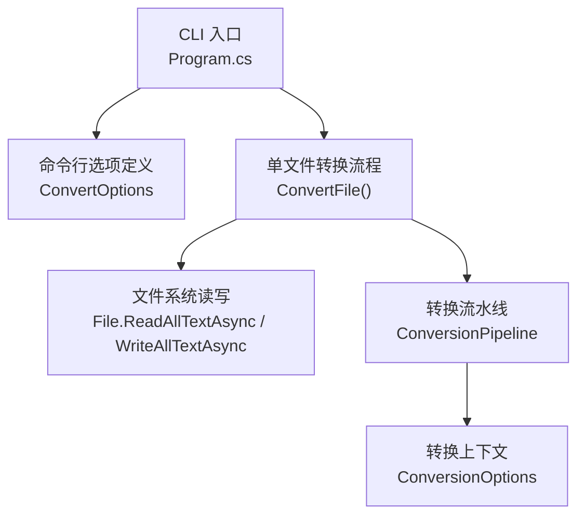
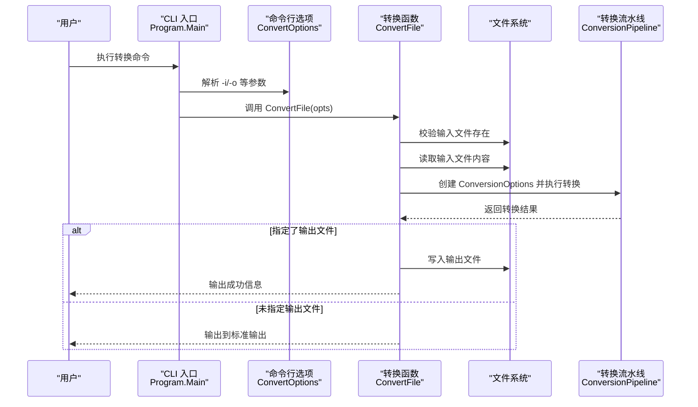
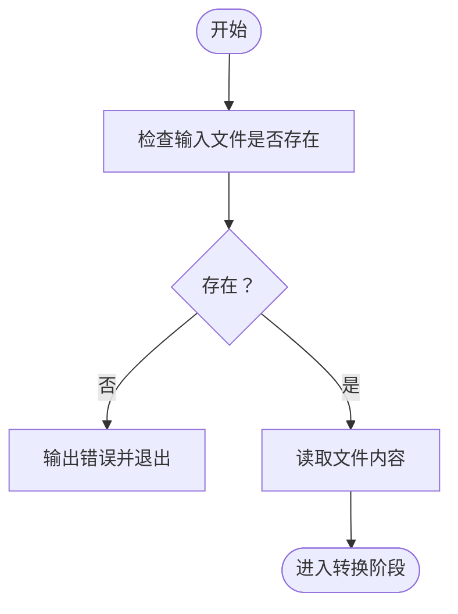
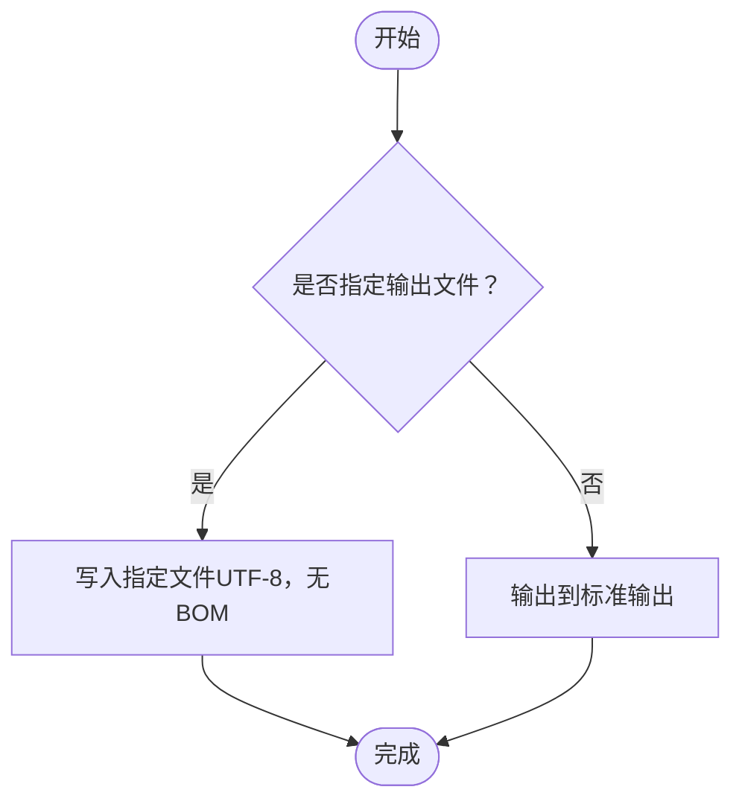
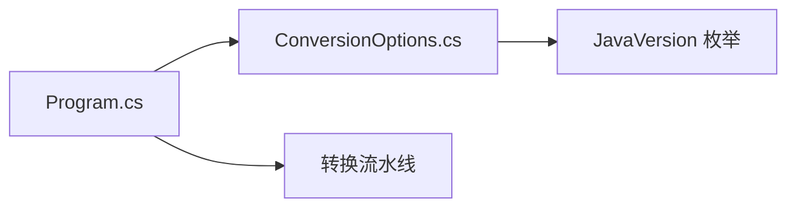

# 输入输出选项

<cite>
**本文档引用的文件**
- [Program.cs](file://src/CSharpToJava.CLI/Program.cs)
- [ConversionOptions.cs](file://src/CSharpToJava.Core/Context/ConversionOptions.cs)
- [README.md](file://README.md)
- [CLAUDE.md](file://CLAUDE.md)
- [convert-agl-graphlayout.sh](file://convert-agl-graphlayout.sh)
- [convert-agl-graphlayout.bat](file://convert-agl-graphlayout.bat)
</cite>

## 目录
1. [简介](#简介)
2. [项目结构](#项目结构)
3. [核心组件](#核心组件)
4. [架构总览](#架构总览)
5. [详细组件分析](#详细组件分析)
6. [依赖关系分析](#依赖关系分析)
7. [性能考量](#性能考量)
8. [故障排查指南](#故障排查指南)
9. [结论](#结论)
10. [附录](#附录)

## 简介
本章节面向 cs2j 的命令行用户，系统性地说明输入输出选项的使用方法与行为规则，重点覆盖以下内容：
- 单文件转换模式下输入文件选项 (-i/--input) 与输出文件选项 (-o/--output) 的语义与默认行为
- 输入文件路径解析规则：支持相对路径、绝对路径与通配符的处理边界
- 输出文件命名与位置选择策略：当未显式指定输出路径时的行为
- 标准输入输出的处理方式：在当前实现中，单文件转换默认将结果写入标准输出
- 不同操作系统下的路径处理差异：Windows 与类 Unix 系统的路径分隔符与大小写敏感性
- 提供具体命令行示例，涵盖相对路径、绝对路径与通配符的使用注意事项

## 项目结构
cs2j 的 CLI 实现位于 src/CSharpToJava.CLI，核心入口为 Program.cs；单文件转换逻辑集中在 ConvertFile 方法中；命令行参数通过 CommandLineParser 定义于 ConvertOptions 类。

图表来源
- [Program.cs:13-109](file://src/CSharpToJava.CLI/Program.cs#L13-L109)
- [Program.cs:2328-2375](file://src/CSharpToJava.CLI/Program.cs#L2328-L2375)
- [ConversionOptions.cs:6-94](file://src/CSharpToJava.Core/Context/ConversionOptions.cs#L6-L94)

章节来源
- [Program.cs:13-109](file://src/CSharpToJava.CLI/Program.cs#L13-L109)
- [Program.cs:2328-2375](file://src/CSharpToJava.CLI/Program.cs#L2328-L2375)
- [ConversionOptions.cs:6-94](file://src/CSharpToJava.Core/Context/ConversionOptions.cs#L6-L94)

## 核心组件
- 命令行选项定义（ConvertOptions）
  - -i, --input：必需参数，指定输入 C# 源文件路径
  - -o, --output：可选参数，默认不指定时将结果输出至标准输出
- 单文件转换流程（ConvertFile）
  - 校验输入文件存在性
  - 读取源码文本
  - 构造 ConversionOptions 并执行转换
  - 将生成的 Java 代码写入指定输出文件或标准输出
- 转换上下文（ConversionOptions）
  - 控制目标 Java 版本、类型映射配置、是否生成 JavaDoc、是否使用记录类等

章节来源
- [Program.cs:27-109](file://src/CSharpToJava.CLI/Program.cs#L27-L109)
- [Program.cs:2328-2375](file://src/CSharpToJava.CLI/Program.cs#L2328-L2375)
- [ConversionOptions.cs:6-94](file://src/CSharpToJava.Core/Context/ConversionOptions.cs#L6-L94)

## 架构总览
单文件转换的端到端流程如下：

图表来源
- [Program.cs:13-109](file://src/CSharpToJava.CLI/Program.cs#L13-L109)
- [Program.cs:27-109](file://src/CSharpToJava.CLI/Program.cs#L27-L109)

## 详细组件分析

### 输入文件选项 (-i/--input)
- 必填项，用于指定要转换的 C# 源文件路径
- 在 ConvertFile 中会先检查该路径对应的文件是否存在，若不存在则直接报错退出
- 支持相对路径与绝对路径；通配符不在单文件模式下使用，仅支持单个文件路径

图表来源
- [Program.cs:27-58](file://src/CSharpToJava.CLI/Program.cs#L27-L58)

章节来源
- [Program.cs:27-58](file://src/CSharpToJava.CLI/Program.cs#L27-L58)

### 输出文件选项 (-o/--output)
- 可选项，默认不指定时将转换结果输出到标准输出
- 若指定 -o，则将生成的 Java 代码写入该文件（UTF-8 编码，无 BOM）
- 文件路径支持相对路径与绝对路径；不支持通配符

图表来源
- [Program.cs:73-81](file://src/CSharpToJava.CLI/Program.cs#L73-L81)

章节来源
- [Program.cs:73-81](file://src/CSharpToJava.CLI/Program.cs#L73-L81)

### 单文件转换时的路径解析与输出策略
- 输入文件解析规则
  - 严格要求单个文件存在；不支持通配符
  - 支持相对路径与绝对路径
- 输出文件命名与位置选择
  - 若未指定 -o，则输出到标准输出
  - 若指定 -o，则写入到该文件路径；如父目录不存在，将由运行环境决定是否自动创建（当前实现依赖 .NET 文件 API 行为）

章节来源
- [Program.cs:27-58](file://src/CSharpToJava.CLI/Program.cs#L27-L58)
- [Program.cs:73-81](file://src/CSharpToJava.CLI/Program.cs#L73-L81)

### 标准输入输出处理
- 当未指定 -o 时，转换结果直接输出到标准输出
- 该行为在 ConvertFile 的分支逻辑中明确体现

章节来源
- [Program.cs:73-81](file://src/CSharpToJava.CLI/Program.cs#L73-L81)

### 不同操作系统下的路径处理差异
- Windows
  - 路径分隔符为反斜杠，大小写不敏感
  - 绝对路径通常以盘符开头（如 C:\...）
- 类 Unix（Linux/macOS）
  - 路径分隔符为正斜杠，大小写敏感
  - 绝对路径以斜杠开头（如 /home/...）
- 通用建议
  - 在脚本或 CI 环境中，优先使用绝对路径以避免工作目录差异导致的问题
  - 跨平台脚本中，建议统一使用正斜杠或通过平台 API 处理路径

（本节为通用实践说明，不直接分析具体源码文件）

### 命令行示例与最佳实践
- 单文件转换到标准输出
  - 示例：dotnet run --project src/CSharpToJava.CLI/CSharpToJava.CLI.csproj -- convert -i Input.cs -o
  - 说明：-o 省略表示输出到标准输出
- 单文件转换到指定文件
  - 示例：dotnet run --project src/CSharpToJava.CLI/CSharpToJava.CLI.csproj -- convert -i Input.cs -o Output.java
  - 说明：将结果写入 Output.java
- 使用绝对路径
  - 示例：dotnet run --project src/CSharpToJava.CLI/CSharpToJava.CLI.csproj -- convert -i /abs/path/Input.cs -o /abs/path/Output.java
  - 说明：适用于跨目录或 CI 环境
- 使用相对路径
  - 示例：dotnet run --project src/CSharpToJava.CLI/CSharpToJava.CLI.csproj -- convert -i ../src/Input.cs -o ../out/Output.java
  - 说明：基于当前工作目录解析
- 通配符使用注意事项
  - 单文件模式不支持通配符；请先在外部工具中展开为具体文件列表后再调用 cs2j

章节来源
- [README.md:32-48](file://README.md#L32-L48)
- [CLAUDE.md:19-29](file://CLAUDE.md#L19-L29)

## 依赖关系分析
- CLI 入口依赖命令行选项定义
- 单文件转换流程依赖文件系统 API 与转换流水线
- 转换流水线依赖转换上下文（ConversionOptions）

图表来源
- [Program.cs:13-109](file://src/CSharpToJava.CLI/Program.cs#L13-L109)
- [ConversionOptions.cs:6-103](file://src/CSharpToJava.Core/Context/ConversionOptions.cs#L6-L103)

章节来源
- [Program.cs:13-109](file://src/CSharpToJava.CLI/Program.cs#L13-L109)
- [ConversionOptions.cs:6-103](file://src/CSharpToJava.Core/Context/ConversionOptions.cs#L6-L103)

## 性能考量
- 单文件转换的 I/O 主要发生在读取输入文件与写入输出文件两个环节
- 对于大型源文件，建议：
  - 使用绝对路径减少路径解析开销
  - 将输出文件写入本地磁盘而非网络驱动器
  - 在 CI 环境中避免频繁切换工作目录

（本节为通用指导，不直接分析具体源码文件）

## 故障排查指南
- 输入文件不存在
  - 现象：程序立即报错并退出
  - 排查：确认 -i 指定的路径是否正确，文件是否存在
- 输出文件写入失败
  - 现象：写入阶段抛出异常
  - 排查：确认 -o 指定的路径父目录是否存在且具备写权限；尝试使用绝对路径
- 转换过程中出现诊断信息
  - 现象：控制台输出诊断消息
  - 排查：使用 -v 参数查看更多细节；根据诊断提示修正源代码或调整映射配置

章节来源
- [Program.cs:27-109](file://src/CSharpToJava.CLI/Program.cs#L27-L109)

## 结论
- 单文件转换模式下，-i 为必需参数，-o 为可选参数，默认输出到标准输出
- 输入与输出均支持相对路径与绝对路径；不支持通配符
- 在不同操作系统下，请遵循各平台的路径规范与大小写敏感性
- 建议在脚本与 CI 环境中使用绝对路径，确保可重复性与稳定性

## 附录
- 参考命令示例
  - 单文件转换到标准输出：参见 README.md 中的 convert 示例
  - 单文件转换到指定文件：参见 README.md 中的 convert 示例
  - 跨平台脚本示例：参见 convert-agl-graphlayout.sh 与 convert-agl-graphlayout.bat

章节来源
- [README.md:32-48](file://README.md#L32-L48)
- [convert-agl-graphlayout.sh:17-26](file://convert-agl-graphlayout.sh#L17-L26)
- [convert-agl-graphlayout.bat:13-23](file://convert-agl-graphlayout.bat#L13-L23)