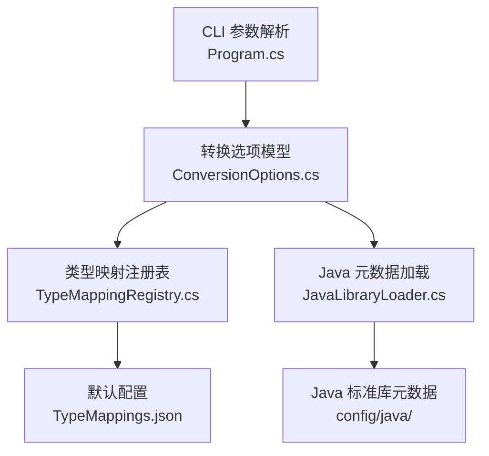
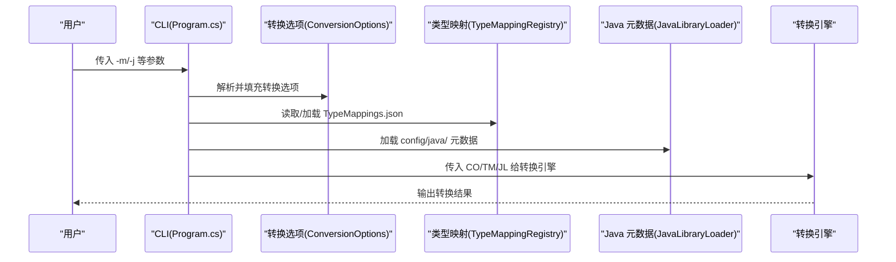
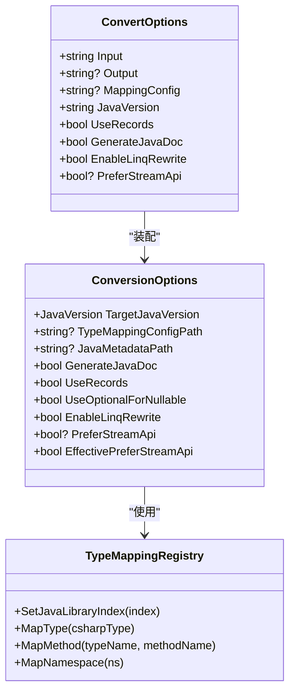

# 配置选项

<cite>
**本文引用的文件**
- [Program.cs](file://src/CSharpToJava.CLI/Program.cs)
- [ConversionOptions.cs](file://src/CSharpToJava.Core/Context/ConversionOptions.cs)
- [TypeMappingRegistry.cs](file://src/CSharpToJava.TypeMapping/TypeMappingRegistry.cs)
- [JavaLibraryLoader.cs](file://src/CSharpToJava.TypeMapping/JavaModel/JavaLibraryLoader.cs)
- [TypeMappings.json](file://config/TypeMappings.json)
- [README.md](file://README.md)
- [CLAUDE.md](file://CLAUDE.md)
</cite>

## 目录
1. [简介](#简介)
2. [项目结构](#项目结构)
3. [核心组件](#核心组件)
4. [架构总览](#架构总览)
5. [详细组件分析](#详细组件分析)
6. [依赖关系分析](#依赖关系分析)
7. [性能考量](#性能考量)
8. [故障排查指南](#故障排查指南)
9. [结论](#结论)
10. [附录](#附录)

## 简介
本文面向 cs2j 的使用者与维护者，系统性梳理“配置选项”相关内容，重点覆盖：
- 类型映射配置选项（-m/--mapping）的使用与优先级
- Java 版本选项（-j/--java-version）对转换行为的影响
- 配置文件的加载顺序与覆盖规则
- Java 元数据（config/java/）对转换质量与验证的支持
- 配置文件格式说明与常用配置项示例

目标是帮助用户正确配置转换参数，以满足不同 Java 版本与项目需求。

## 项目结构
围绕配置选项的关键目录与文件如下：
- CLI 层：命令行参数解析与转换选项装配
- 核心层：转换选项模型与 Java 版本枚举
- 类型映射层：类型映射注册表与配置文件加载
- Java 元数据层：标准库元数据索引与加载
- 默认配置：TypeMappings.json 与 config/java/

图表来源
- [Program.cs](file://src/CSharpToJava.CLI/Program.cs)
- [ConversionOptions.cs](file://src/CSharpToJava.Core/Context/ConversionOptions.cs)
- [TypeMappingRegistry.cs](file://src/CSharpToJava.TypeMapping/TypeMappingRegistry.cs)
- [JavaLibraryLoader.cs](file://src/CSharpToJava.TypeMapping/JavaModel/JavaLibraryLoader.cs)
- [TypeMappings.json](file://config/TypeMappings.json)

章节来源
- [Program.cs](file://src/CSharpToJava.CLI/Program.cs)
- [ConversionOptions.cs](file://src/CSharpToJava.Core/Context/ConversionOptions.cs)
- [TypeMappingRegistry.cs](file://src/CSharpToJava.TypeMapping/TypeMappingRegistry.cs)
- [JavaLibraryLoader.cs](file://src/CSharpToJava.TypeMapping/JavaModel/JavaLibraryLoader.cs)
- [TypeMappings.json](file://config/TypeMappings.json)

## 核心组件
- 命令行选项与默认值
  - -m/--mapping：类型映射配置文件路径，默认指向 ./config/TypeMappings.json
  - -j/--java-version：目标 Java 版本，默认 Java25
  - 其他相关选项：--no-records、--use-optional、--no-javadoc、--no-linq-rewrite、--prefer-stream-api、--prefer-procedural、--no-parallel-project-passes 等
- 转换选项模型（ConversionOptions）
  - 目标 Java 版本（JavaVersion）
  - 类型映射配置路径（TypeMappingConfigPath）
  - Java 元数据根路径（JavaMetadataPath）
  - 其他影响转换行为的布尔开关与策略（如是否生成 JavaDoc、是否使用记录、是否启用 LINQ 预处理、是否偏好 Stream API 等）

章节来源
- [Program.cs](file://src/CSharpToJava.CLI/Program.cs)
- [ConversionOptions.cs](file://src/CSharpToJava.Core/Context/ConversionOptions.cs)
- [README.md](file://README.md)
- [CLAUDE.md](file://CLAUDE.md)

## 架构总览
下图展示从 CLI 到核心转换引擎的配置传递链路，以及类型映射与 Java 元数据在转换过程中的作用。

图表来源
- [Program.cs](file://src/CSharpToJava.CLI/Program.cs)
- [ConversionOptions.cs](file://src/CSharpToJava.Core/Context/ConversionOptions.cs)
- [TypeMappingRegistry.cs](file://src/CSharpToJava.TypeMapping/TypeMappingRegistry.cs)
- [JavaLibraryLoader.cs](file://src/CSharpToJava.TypeMapping/JavaModel/JavaLibraryLoader.cs)

## 详细组件分析

### 类型映射配置选项（-m/--mapping）
- 作用
  - 指定类型映射配置文件路径，用于控制 C# 类型到 Java 类型的映射、方法名映射、命名空间到包的映射等。
- 默认行为
  - 若未显式指定 -m，则默认加载 ./config/TypeMappings.json。
- 加载流程
  - CLI 层将 -m 传给转换选项；核心层通过 TypeMappingRegistry 读取 JSON 并构建映射表。
  - TypeMappingRegistry 支持：
    - 解析配置文件路径（支持绝对/相对路径）
    - 反序列化 JSON 为 TypeMappingConfig
    - 加载三类映射：类型映射、方法映射、命名空间映射
    - 提供校验与自动推断能力（结合 Java 元数据）
- 优先级与覆盖
  - CLI 传入的 -m 路径优先于默认路径。
  - 若同一键出现多次（例如重复的类型映射），TypeMappingRegistry 会以最后加载的条目覆盖之前条目（内部使用字典存储，后写覆盖先写）。
- 常见用途
  - 自定义集合类型映射（如 List<T> → ArrayList）
  - 自定义异常类型映射（如 InvalidOperationException → IllegalStateException）
  - 自定义方法名映射（如 Add → put）
  - 自定义命名空间映射（如 System.* → com.example.*）

章节来源
- [Program.cs](file://src/CSharpToJava.CLI/Program.cs)
- [TypeMappingRegistry.cs](file://src/CSharpToJava.TypeMapping/TypeMappingRegistry.cs)
- [TypeMappings.json](file://config/TypeMappings.json)

### Java 版本选项（-j/--java-version）
- 作用
  - 指定目标 Java 版本，影响转换策略与默认行为（如是否启用某些特性或默认偏好）。
- 当前实现
  - JavaVersion 枚举目前包含 Java25。
  - CLI 层将字符串解析为 JavaVersion，并注入到 ConversionOptions。
- 对转换行为的影响
  - LINQ 转换策略：当未显式设置时，EffectivePreferStreamApi 默认为 true（针对 Java25）。可通过 --prefer-stream-api 或 --prefer-procedural 显式覆盖。
  - 记录类型：UseRecords 默认开启，但可通过 --no-records 关闭。
  - 其他行为：具体影响取决于后续转换阶段的实现细节与版本相关的特性支持。

章节来源
- [Program.cs](file://src/CSharpToJava.CLI/Program.cs)
- [ConversionOptions.cs](file://src/CSharpToJava.Core/Context/ConversionOptions.cs)
- [README.md](file://README.md)
- [CLAUDE.md](file://CLAUDE.md)

### Java 元数据（config/java/）与加载
- 作用
  - 提供 Java 标准库的元数据（模块、包、类型、方法等），用于：
    - 自动推断方法名映射（如 PascalCase → camelCase）
    - 校验映射的 Java 类型与方法是否存在
    - 分析生成代码所需的 Java 平台模块依赖
- 加载方式
  - TypeMappingRegistry 可注入 JavaLibraryIndex（由 JavaLibraryLoader 加载）。
  - JavaLibraryLoader 递归扫描 config/java/ 下的模块目录，按需加载模块与类型元数据。
- 与转换的关系
  - 当 JavaMetadataPath 设置后，TypeMappingRegistry 会在无显式配置时尝试基于元数据进行推断与校验。
  - 转换后的 Java 代码可进一步由 JavaModuleDependencyRewriter 分析导入，推导所需模块。

章节来源
- [TypeMappingRegistry.cs](file://src/CSharpToJava.TypeMapping/TypeMappingRegistry.cs)
- [JavaLibraryLoader.cs](file://src/CSharpToJava.TypeMapping/JavaModel/JavaLibraryLoader.cs)

### 配置文件格式说明（TypeMappings.json）
- 结构概览
  - typeMappings：类型映射列表
  - methodMappings：方法映射列表
  - namespaceMappings：命名空间映射列表
- 字段说明
  - typeMappings[].csharp：C# 类型全名
  - typeMappings[].java：Java 类型名或完全限定名
  - typeMappings[].imports：需要的导入语句
  - typeMappings[].converter：可选的转换器名称
  - methodMappings[].type：C# 类型名
  - methodMappings[].method：C# 方法名
  - methodMappings[].javaMethod：Java 方法名
  - methodMappings[].signature：可选签名约束（参数个数）
  - namespaceMappings[].csharp：C# 命名空间模式
  - namespaceMappings[].java：Java 包名替换
- 示例要点
  - 基础类型映射：System.String → String，System.Int32 → int
  - 泛型类型映射：System.Collections.Generic.List`1 → ArrayList（并声明 java.util.ArrayList 导入）
  - 异常类型映射：System.InvalidOperationException → java.lang.IllegalStateException
  - 命名空间映射：System.* → java.lang.* 或自定义包
  - 方法映射：Add → put（根据签名约束区分重载）

章节来源
- [TypeMappings.json](file://config/TypeMappings.json)
- [TypeMappingRegistry.cs](file://src/CSharpToJava.TypeMapping/TypeMappingRegistry.cs)

### 配置加载顺序与优先级规则
- 默认配置
  - TypeMappings.json 默认位于 ./config/TypeMappings.json
  - Java 元数据默认来自 ./config/java/
- 用户自定义配置
  - 通过 -m 指定自定义类型映射文件路径，覆盖默认配置
  - 通过 -j 指定目标 Java 版本，影响默认策略（如 LINQ 偏好）
- 覆盖与合并
  - TypeMappingRegistry 内部以字典存储映射，后写覆盖先写，因此可在自定义配置中覆盖默认映射
  - Java 元数据仅在设置 JavaMetadataPath 后启用，否则为“乐观模式”（不进行严格校验）
- 实际应用建议
  - 建议复制默认 TypeMappings.json 作为起点，再按需修改
  - 如需启用元数据驱动的校验与推断，请确保 JavaMetadataPath 指向正确的 config/java/ 目录

章节来源
- [Program.cs](file://src/CSharpToJava.CLI/Program.cs)
- [TypeMappingRegistry.cs](file://src/CSharpToJava.TypeMapping/TypeMappingRegistry.cs)
- [JavaLibraryLoader.cs](file://src/CSharpToJava.TypeMapping/JavaModel/JavaLibraryLoader.cs)

### Java 版本选项对转换行为的影响
- 默认策略
  - Java25 下，EffectivePreferStreamApi 默认为 true（即默认优先使用 Stream API 进行 LINQ 转换）
  - 可通过 --prefer-stream-api 或 --prefer-procedural 显式覆盖
- 其他影响
  - 记录类型：UseRecords 默认开启，可通过 --no-records 关闭
  - JavaDoc：默认生成，可通过 --no-javadoc 关闭
  - LINQ 预处理：默认启用，可通过 --no-linq-rewrite 关闭
  - 并行项目处理：默认启用，可通过 --no-parallel-project-passes 关闭

章节来源
- [ConversionOptions.cs](file://src/CSharpToJava.Core/Context/ConversionOptions.cs)
- [Program.cs](file://src/CSharpToJava.CLI/Program.cs)
- [README.md](file://README.md)
- [CLAUDE.md](file://CLAUDE.md)

## 依赖关系分析
- CLI 与核心
  - CLI 将命令行参数解析为 ConversionOptions，并将其传入转换引擎
- 类型映射与元数据
  - TypeMappingRegistry 依赖 TypeMappings.json；当存在 Java 元数据时，可提升映射准确性与一致性
- 转换策略
  - JavaVersion 影响默认策略（如 LINQ 偏好），可通过显式标志覆盖

图表来源
- [Program.cs](file://src/CSharpToJava.CLI/Program.cs)
- [ConversionOptions.cs](file://src/CSharpToJava.Core/Context/ConversionOptions.cs)
- [TypeMappingRegistry.cs](file://src/CSharpToJava.TypeMapping/TypeMappingRegistry.cs)

章节来源
- [Program.cs](file://src/CSharpToJava.CLI/Program.cs)
- [ConversionOptions.cs](file://src/CSharpToJava.Core/Context/ConversionOptions.cs)
- [TypeMappingRegistry.cs](file://src/CSharpToJava.TypeMapping/TypeMappingRegistry.cs)

## 性能考量
- 元数据加载
  - JavaLibraryLoader 采用惰性加载策略（按模块目录扫描），避免一次性加载全部元数据
- 映射查找
  - TypeMappingRegistry 使用字典存储映射，查找复杂度近似 O(1)，适合大规模配置
- 并行处理
  - ConversionOptions 中的 EnableParallelProjectPasses 可控制项目级树局部处理的并行执行，提高大项目的转换效率

章节来源
- [JavaLibraryLoader.cs](file://src/CSharpToJava.TypeMapping/JavaModel/JavaLibraryLoader.cs)
- [TypeMappingRegistry.cs](file://src/CSharpToJava.TypeMapping/TypeMappingRegistry.cs)
- [ConversionOptions.cs](file://src/CSharpToJava.Core/Context/ConversionOptions.cs)

## 故障排查指南
- 类型映射配置文件缺失
  - 症状：抛出 TypeMappingConfigurationException，提示配置文件不存在
  - 排查：确认 -m 指向的路径存在且可读
- JSON 格式错误
  - 症状：反序列化失败，抛出 TypeMappingConfigurationException
  - 排查：检查 TypeMappings.json 的 JSON 语法与字段拼写
- Java 元数据路径无效
  - 症状：元数据未生效，映射推断与校验不可用
  - 排查：确认 JavaMetadataPath 指向包含模块子目录的 config/java/ 根目录
- 版本策略冲突
  - 症状：LINQ 转换结果不符合预期
  - 排查：检查 --prefer-stream-api 与 --prefer-procedural 的设置，以及 JavaVersion 的默认策略

章节来源
- [TypeMappingRegistry.cs](file://src/CSharpToJava.TypeMapping/TypeMappingRegistry.cs)
- [JavaLibraryLoader.cs](file://src/CSharpToJava.TypeMapping/JavaModel/JavaLibraryLoader.cs)
- [Program.cs](file://src/CSharpToJava.CLI/Program.cs)

## 结论
- -m/--mapping 用于指定类型映射配置文件，支持覆盖默认映射；-j/--java-version 用于设定目标 Java 版本，影响默认策略与行为偏好
- 默认配置位于 ./config/TypeMappings.json，Java 元数据位于 ./config/java/，可通过 -m 与 JavaMetadataPath 进行覆盖
- TypeMappingRegistry 提供了强大的映射加载、校验与自动推断能力，配合 Java 元数据可显著提升转换质量
- 建议在自定义映射时遵循 JSON 格式规范，合理设置 JavaVersion 与相关策略，以获得最佳转换效果

## 附录
- 常用配置项示例（基于默认配置）
  - 基础类型映射：System.String → String，System.Int32 → int
  - 集合类型映射：System.Collections.Generic.List`1 → ArrayList（并声明 java.util.ArrayList 导入）
  - 异常类型映射：System.InvalidOperationException → java.lang.IllegalStateException
  - 命名空间映射：System.* → java.lang.*
  - 方法映射：Add → put（可结合 signature 约束区分重载）
- 常用命令示例
  - 单文件转换：dotnet run --project src/CSharpToJava.CLI/CSharpToJava.CLI.csproj -- convert -i Input.cs -o Output.java -m custom-mappings.json -j Java25
  - 项目转换：dotnet run --project src/CSharpToJava.CLI/CSharpToJava.CLI.csproj -- convert-project -s ./src -d ./output -m custom-mappings.json -j Java25

章节来源
- [TypeMappings.json](file://config/TypeMappings.json)
- [README.md](file://README.md)
- [CLAUDE.md](file://CLAUDE.md)