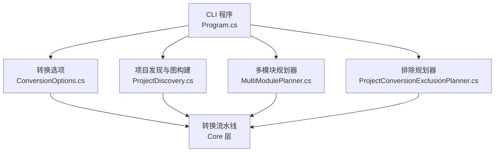
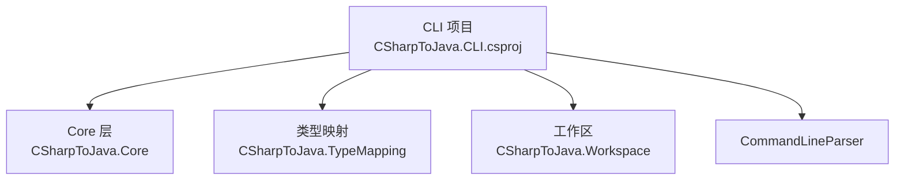

# 项目转换选项

<cite>
**本文档引用的文件**
- [Program.cs](file://src/CSharpToJava.CLI/Program.cs)
- [ConversionOptions.cs](file://src/CSharpToJava.Core/Context/ConversionOptions.cs)
- [MultiModulePlanner.cs](file://src/CSharpToJava.CLI/MultiModulePlanner.cs)
- [ProjectDiscovery.cs](file://src/CSharpToJava.CLI/ProjectDiscovery.cs)
- [ProjectConversionExclusionPlanner.cs](file://src/CSharpToJava.CLI/ProjectConversionExclusionPlanner.cs)
- [CSharpToJava.CLI.csproj](file://src/CSharpToJava.CLI/CSharpToJava.CLI.csproj)
- [README.md](file://README.md)
- [convert-agl-graphlayout.sh](file://convert-agl-graphlayout.sh)
- [convert-agl-graphlayout.bat](file://convert-agl-graphlayout.bat)
</cite>

## 目录
1. [简介](#简介)
2. [项目结构](#项目结构)
3. [核心组件](#核心组件)
4. [架构总览](#架构总览)
5. [详细组件分析](#详细组件分析)
6. [依赖关系分析](#依赖关系分析)
7. [性能考虑](#性能考虑)
8. [故障排除指南](#故障排除指南)
9. [结论](#结论)
10. [附录](#附录)

## 简介
本文件为 cs2j 项目转换选项的完整参考文档，重点围绕以下六个核心选项展开：项目模式选项（--mode）、测试包含选项（--include-tests）、强制覆盖选项（--force）、POM 生成选项（--generate-pom）、并行处理选项（--enable-parallel-project-passes）与详细输出选项（--verbose）。文档将解释各选项的含义、默认值、使用方法以及在不同场景下的最佳实践，并结合源码实现说明单模块与多模块项目的转换策略、测试项目的处理方式与资源文件复制规则。

## 项目结构
cs2j 的 CLI 层负责解析命令行参数、构建转换上下文、选择转换流程（单模块/多模块），并在必要时生成 Maven POM 文件。核心转换逻辑由 Core 层提供，CLI 将命令行选项映射为 ConversionOptions 并驱动转换流水线。



图表来源
- [Program.cs](file://src/CSharpToJava.CLI/Program.cs#L13)
- [ConversionOptions.cs](file://src/CSharpToJava.Core/Context/ConversionOptions.cs#L6)
- [ProjectDiscovery.cs](file://src/CSharpToJava.CLI/ProjectDiscovery.cs#L36)
- [MultiModulePlanner.cs](file://src/CSharpToJava.CLI/MultiModulePlanner.cs#L25)
- [ProjectConversionExclusionPlanner.cs](file://src/CSharpToJava.CLI/ProjectConversionExclusionPlanner.cs#L13)

章节来源
- [Program.cs:13-304](file://src/CSharpToJava.CLI/Program.cs#L13-L304)
- [CSharpToJava.CLI.csproj:1-34](file://src/CSharpToJava.CLI/CSharpToJava.CLI.csproj#L1-L34)

## 核心组件
本节聚焦于与项目转换选项直接相关的组件与数据结构，包括命令行选项定义、转换选项模型、项目发现与排除机制，以及多模块规划。

- 命令行选项定义（ConvertProjectOptions）
  - 定义了 --mode、--include-tests、--force、--generate-pom、--enable-parallel-project-passes、--verbose 等选项及其默认行为。
  - 参考路径：[ConvertProjectOptions:2378-2440](file://src/CSharpToJava.CLI/Program.cs#L2378-L2440)

- 转换选项模型（ConversionOptions）
  - 描述目标 Java 版本、类型映射配置、是否生成 JavaDoc、是否使用记录类、是否启用 LINQ 重写、是否优先使用 Stream API、是否启用并行项目级 Pass 等。
  - 参考路径：[ConversionOptions:6-94](file://src/CSharpToJava.Core/Context/ConversionOptions.cs#L6-L94)

- 项目发现与图构建（ProjectDiscovery）
  - 解析 .sln 或 .csproj，识别生产项目与测试项目，收集资源文件列表，构建拓扑有序的项目图。
  - 参考路径：[ProjectDiscovery:36-347](file://src/CSharpToJava.CLI/ProjectDiscovery.cs#L36-L347)

- 多模块规划（MultiModulePlanner）
  - 基于项目图构建模块计划，支持将测试项目分配到对应模块或独立模块，计算编译与测试依赖。
  - 参考路径：[MultiModulePlanner:25-216](file://src/CSharpToJava.CLI/MultiModulePlanner.cs#L25-L216)

- 项目转换排除规划（ProjectConversionExclusionPlanner）
  - 基于项目文件属性与包引用判断是否支持转换，若不支持则标记排除并传播至依赖方。
  - 参考路径：[ProjectConversionExclusionPlanner:13-207](file://src/CSharpToJava.CLI/ProjectConversionExclusionPlanner.cs#L13-L207)

章节来源
- [Program.cs:2378-2440](file://src/CSharpToJava.CLI/Program.cs#L2378-L2440)
- [ConversionOptions.cs:6-94](file://src/CSharpToJava.Core/Context/ConversionOptions.cs#L6-L94)
- [ProjectDiscovery.cs:36-347](file://src/CSharpToJava.CLI/ProjectDiscovery.cs#L36-L347)
- [MultiModulePlanner.cs:25-216](file://src/CSharpToJava.CLI/MultiModulePlanner.cs#L25-L216)
- [ProjectConversionExclusionPlanner.cs:13-207](file://src/CSharpToJava.CLI/ProjectConversionExclusionPlanner.cs#L13-L207)

## 架构总览
下图展示了 CLI 如何根据命令行选项选择转换路径，并在需要时生成 Maven POM：

```mermaid
sequenceDiagram
participant U as "用户"
participant CLI as "CLI 程序<br/>Program.cs"
participant OPT as "转换选项<br/>ConversionOptions"
participant DISC as "项目发现<br/>ProjectDiscovery"
participant PLAN as "多模块规划<br/>MultiModulePlanner"
participant PIPE as "转换流水线<br/>Core"
U->>CLI : 执行 convert-project 命令
CLI->>OPT : 解析命令行选项
CLI->>DISC : 尝试 MSBuild 加载或目录扫描
alt MSBuild 成功
CLI->>PLAN : 构建模块计划多模块模式
PLAN-->>CLI : 返回模块计划
CLI->>PIPE : 按模块转换并生成 POM
else 目录扫描
CLI->>PIPE : 单模块转换
CLI->>CLI : 条件生成 POM
end
CLI-->>U : 输出结果与统计信息
```

图表来源
- [Program.cs:111-304](file://src/CSharpToJava.CLI/Program.cs#L111-L304)
- [Program.cs:306-451](file://src/CSharpToJava.CLI/Program.cs#L306-L451)
- [Program.cs:569-747](file://src/CSharpToJava.CLI/Program.cs#L569-L747)
- [ProjectDiscovery.cs:92-116](file://src/CSharpToJava.CLI/ProjectDiscovery.cs#L92-L116)
- [MultiModulePlanner.cs:27-127](file://src/CSharpToJava.CLI/MultiModulePlanner.cs#L27-L127)

## 详细组件分析

### 项目模式选项（--mode）
- 作用：控制输出模式，支持 single-module 与 multi-module。
- 行为差异：
  - single-module：将所有项目（可选测试）合并到单一输出树中，适合小型项目或快速原型。
  - multi-module：基于项目依赖关系拆分为多个模块，生成共享兼容模块与各模块的 POM，适合大型多项目工程。
- 实现要点：
  - 在 MSBuild 成功加载时，根据 --mode 决定调用单模块或多模块转换流程。
  - 多模块模式会先生成共享兼容模块，再逐模块转换，并在生成 POM 时注入依赖关系。
- 参考路径：
  - [模式选择与分支:187-193](file://src/CSharpToJava.CLI/Program.cs#L187-L193)
  - [单模块转换流程:326-451](file://src/CSharpToJava.CLI/Program.cs#L326-L451)
  - [多模块转换流程:569-747](file://src/CSharpToJava.CLI/Program.cs#L569-L747)
  - [多模块规划:27-127](file://src/CSharpToJava.CLI/MultiModulePlanner.cs#L27-L127)

章节来源
- [Program.cs:187-193](file://src/CSharpToJava.CLI/Program.cs#L187-L193)
- [Program.cs:326-451](file://src/CSharpToJava.CLI/Program.cs#L326-L451)
- [Program.cs:569-747](file://src/CSharpToJava.CLI/Program.cs#L569-L747)
- [MultiModulePlanner.cs:27-127](file://src/CSharpToJava.CLI/MultiModulePlanner.cs#L27-L127)

### 测试包含选项（--include-tests）
- 作用：决定是否包含测试项目与测试资源。
- 行为：
  - 当启用时，测试项目会被转换并写入 src/test/java（或 multi-module 模式下的各模块 test 目录），测试资源也会被复制。
  - 当禁用时，测试项目与测试资源会被跳过。
- 实现要点：
  - 在单模块与多模块转换流程中均检查该选项，过滤测试项目与测试资源。
  - 资源复制遵循项目声明的 CopyToOutputDirectory 规则，并补充 Resources 目录中的非代码文件。
- 参考路径：
  - [测试项目过滤与资源复制:373-431](file://src/CSharpToJava.CLI/Program.cs#L373-L431)
  - [测试项目过滤与资源复制（MSBuild）:497-548](file://src/CSharpToJava.CLI/Program.cs#L497-L548)
  - [测试项目判定与资源扫描:205-296](file://src/CSharpToJava.CLI/ProjectDiscovery.cs#L205-L296)

章节来源
- [Program.cs:373-431](file://src/CSharpToJava.CLI/Program.cs#L373-L431)
- [Program.cs:497-548](file://src/CSharpToJava.CLI/Program.cs#L497-L548)
- [ProjectDiscovery.cs:205-296](file://src/CSharpToJava.CLI/ProjectDiscovery.cs#L205-L296)

### 强制覆盖选项（--force）
- 作用：允许覆盖已存在的输出文件。
- 行为：
  - 若目标目录存在且未启用 --force，转换会失败并提示使用 --force。
  - 启用 --force 时，会在无先前清单的情况下删除现有输出根目录，确保干净转换。
- 参考路径：
  - [强制覆盖检查与清理:125-136](file://src/CSharpToJava.CLI/Program.cs#L125-L136)
  - [强制覆盖清理（单模块）:347-353](file://src/CSharpToJava.CLI/Program.cs#L347-L353)
  - [强制覆盖清理（MSBuild）:473-479](file://src/CSharpToJava.CLI/Program.cs#L473-L479)
  - [强制覆盖清理（多模块）:587-591](file://src/CSharpToJava.CLI/Program.cs#L587-L591)

章节来源
- [Program.cs:125-136](file://src/CSharpToJava.CLI/Program.cs#L125-L136)
- [Program.cs:347-353](file://src/CSharpToJava.CLI/Program.cs#L347-L353)
- [Program.cs:473-479](file://src/CSharpToJava.CLI/Program.cs#L473-L479)
- [Program.cs:587-591](file://src/CSharpToJava.CLI/Program.cs#L587-L591)

### POM 生成选项（--generate-pom）
- 作用：在单模块模式下生成标准 Maven 结构；在多模块模式下为每个模块生成子 POM，并生成父 POM。
- 行为：
  - 启用时，输出根目录结构调整为 src/main/java、src/test/java 等；资源目录也相应调整。
  - 单模块：生成一个模块的 POM。
  - 多模块：生成共享兼容模块 POM、各业务模块 POM 以及父 POM。
- 参考路径：
  - [单模块 POM 生成:277-280](file://src/CSharpToJava.CLI/Program.cs#L277-L280)
  - [单模块 POM 生成（项目图）:434-437](file://src/CSharpToJava.CLI/Program.cs#L434-L437)
  - [多模块 POM 生成与父 POM:715-733](file://src/CSharpToJava.CLI/Program.cs#L715-L733)

章节来源
- [Program.cs:277-280](file://src/CSharpToJava.CLI/Program.cs#L277-L280)
- [Program.cs:434-437](file://src/CSharpToJava.CLI/Program.cs#L434-L437)
- [Program.cs:715-733](file://src/CSharpToJava.CLI/Program.cs#L715-L733)

### 并行处理选项（--enable-parallel-project-passes）
- 作用：控制项目级树局部 Pass 是否并行执行。
- 行为：
  - 默认启用，提升转换性能；在某些需要确定性或线程安全的场景可关闭。
  - 该选项通过转换选项模型传递给流水线，影响具体 Pass 的执行策略。
- 参考路径：
  - [命令行选项映射:2364-2371](file://src/CSharpToJava.CLI/Program.cs#L2364-L2371)
  - [转换选项模型:90-94](file://src/CSharpToJava.Core/Context/ConversionOptions.cs#L90-L94)

章节来源
- [Program.cs:2364-2371](file://src/CSharpToJava.CLI/Program.cs#L2364-L2371)
- [ConversionOptions.cs:90-94](file://src/CSharpToJava.Core/Context/ConversionOptions.cs#L90-L94)

### 详细输出选项（--verbose）
- 作用：输出诊断信息与进度详情。
- 行为：
  - 在文件级转换中打印诊断摘要。
  - 在项目级转换中输出项目发现、模块构建、Pass 统计等详细信息。
- 参考路径：
  - [文件级详细输出:83-97](file://src/CSharpToJava.CLI/Program.cs#L83-L97)
  - [项目级详细输出（MSBuild）:155-185](file://src/CSharpToJava.CLI/Program.cs#L155-L185)
  - [项目级详细输出（单模块）:379-449](file://src/CSharpToJava.CLI/Program.cs#L379-L449)
  - [项目级详细输出（多模块）:642-745](file://src/CSharpToJava.CLI/Program.cs#L642-L745)

章节来源
- [Program.cs:83-97](file://src/CSharpToJava.CLI/Program.cs#L83-L97)
- [Program.cs:155-185](file://src/CSharpToJava.CLI/Program.cs#L155-L185)
- [Program.cs:379-449](file://src/CSharpToJava.CLI/Program.cs#L379-L449)
- [Program.cs:642-745](file://src/CSharpToJava.CLI/Program.cs#L642-L745)

### 项目模式对比与适用场景
- 单模块（single-module）
  - 适合小型项目、学习与演示，输出结构简单，便于快速验证转换效果。
  - 优点：部署与构建简单；缺点：大型项目可能产生模块边界模糊的问题。
- 多模块（multi-module）
  - 适合大型企业级项目，能保留原有模块边界与依赖关系，便于后续 Maven 构建与发布。
  - 优点：模块化清晰、可扩展性强；缺点：生成文件较多，配置相对复杂。

章节来源
- [Program.cs:187-193](file://src/CSharpToJava.CLI/Program.cs#L187-L193)
- [Program.cs:326-451](file://src/CSharpToJava.CLI/Program.cs#L326-L451)
- [Program.cs:569-747](file://src/CSharpToJava.CLI/Program.cs#L569-L747)
- [MultiModulePlanner.cs:27-127](file://src/CSharpToJava.CLI/MultiModulePlanner.cs#L27-L127)

### 测试项目处理与资源复制规则
- 测试项目识别：
  - 通过项目属性 IsTestProject 显式标记、包引用包含测试 SDK/框架、或项目名称以特定后缀结尾等方式识别。
- 资源复制：
  - 依据项目文件中 None/Content 元素的 CopyToOutputDirectory 设置进行复制；
  - 自动扫描 Resources 目录中的非代码文件作为资源。
- 参考路径：
  - [测试项目判定:205-234](file://src/CSharpToJava.CLI/ProjectDiscovery.cs#L205-L234)
  - [资源复制规则:236-296](file://src/CSharpToJava.CLI/ProjectDiscovery.cs#L236-L296)
  - [资源复制实现（单模块）:419-431](file://src/CSharpToJava.CLI/Program.cs#L419-L431)
  - [资源复制实现（MSBuild）:548-566](file://src/CSharpToJava.CLI/Program.cs#L548-L566)

章节来源
- [ProjectDiscovery.cs:205-234](file://src/CSharpToJava.CLI/ProjectDiscovery.cs#L205-L234)
- [ProjectDiscovery.cs:236-296](file://src/CSharpToJava.CLI/ProjectDiscovery.cs#L236-L296)
- [Program.cs:419-431](file://src/CSharpToJava.CLI/Program.cs#L419-L431)
- [Program.cs:548-566](file://src/CSharpToJava.CLI/Program.cs#L548-L566)

### 命令行使用示例
- 多模块 + 禁用流式 API（偏好过程式）：
  - 参考脚本：[convert-agl-graphlayout.sh:38-44](file://convert-agl-graphlayout.sh#L38-L44)
  - 参考脚本：[convert-agl-graphlayout.bat:17-26](file://convert-agl-graphlayout.bat#L17-L26)
- 单模块 + 生成 POM：
  - 可通过 --mode single-module 与 --generate-pom 配合使用。

章节来源
- [convert-agl-graphlayout.sh:38-44](file://convert-agl-graphlayout.sh#L38-L44)
- [convert-agl-graphlayout.bat:17-26](file://convert-agl-graphlayout.bat#L17-L26)

## 依赖关系分析
- CLI 与 Core 的耦合：
  - CLI 仅负责参数解析与流程调度，核心转换逻辑位于 Core 层，二者通过 ConversionOptions 解耦。
- 外部依赖：
  - CLI 依赖 CommandLineParser 进行参数解析。
  - 项目发现与多模块规划依赖 Roslyn 工作区与 MSBuild（可选）。
- 参考路径：
  - [CLI 项目文件:9-11](file://src/CSharpToJava.CLI/CSharpToJava.CLI.csproj#L9-L11)



图表来源
- [CSharpToJava.CLI.csproj:9-11](file://src/CSharpToJava.CLI/CSharpToJava.CLI.csproj#L9-L11)

章节来源
- [CSharpToJava.CLI.csproj:9-11](file://src/CSharpToJava.CLI/CSharpToJava.CLI.csproj#L9-L11)

## 性能考虑
- 并行处理（--enable-parallel-project-passes）：
  - 默认启用可显著提升大型项目的转换速度；在需要严格顺序或线程安全的场景可关闭。
- 项目级 Pass 并行：
  - 适用于语法树级 Pass 的并行化，同时保证合并后的确定性。
- 参考路径：
  - [转换选项模型中的并行开关:90-94](file://src/CSharpToJava.Core/Context/ConversionOptions.cs#L90-L94)
  - [命令行映射:2364-2371](file://src/CSharpToJava.CLI/Program.cs#L2364-L2371)

## 故障排除指南
- 目标目录已存在但未启用 --force：
  - 现象：转换失败并提示使用 --force。
  - 处理：添加 --force 或更换输出目录。
  - 参考路径：[强制覆盖检查:125-136](file://src/CSharpToJava.CLI/Program.cs#L125-L136)
- 全部项目被平台规则排除：
  - 现象：提示“所有发现的项目都被平台规则排除”。
  - 处理：检查项目文件属性（如 WindowsDesktop SDK、UseWPF/UseWindowsForms、Windows 目标框架等），必要时调整项目配置。
  - 参考路径：[排除规则与传播:106-207](file://src/CSharpToJava.CLI/ProjectConversionExclusionPlanner.cs#L106-L207)
- 无法生成 POM：
  - 现象：多模块模式下未生成 POM。
  - 处理：确认 --generate-pom 已启用，且多模块规划成功。
  - 参考路径：[多模块 POM 生成:715-733](file://src/CSharpToJava.CLI/Program.cs#L715-L733)
- 测试资源未复制：
  - 现象：测试资源缺失。
  - 处理：确认项目文件中资源元素的 CopyToOutputDirectory 设置，或检查 Resources 目录是否存在非代码文件。
  - 参考路径：[资源复制规则:236-296](file://src/CSharpToJava.CLI/ProjectDiscovery.cs#L236-L296)

章节来源
- [Program.cs:125-136](file://src/CSharpToJava.CLI/Program.cs#L125-L136)
- [ProjectConversionExclusionPlanner.cs:106-207](file://src/CSharpToJava.CLI/ProjectConversionExclusionPlanner.cs#L106-L207)
- [Program.cs:715-733](file://src/CSharpToJava.CLI/Program.cs#L715-L733)
- [ProjectDiscovery.cs:236-296](file://src/CSharpToJava.CLI/ProjectDiscovery.cs#L236-L296)

## 结论
- 正确选择 --mode 是决定输出结构与后续构建方式的关键；
- --include-tests 与资源复制规则共同决定了测试覆盖率与运行时数据完整性；
- --force 提供了灵活的覆盖能力，但需谨慎使用以避免意外覆盖；
- --generate-pom 为多模块工程提供了标准化的 Maven 支持；
- --enable-parallel-project-passes 默认开启以获得更好性能；
- --verbose 有助于定位问题与优化转换流程。

## 附录
- 命令行选项速查表（基于源码定义）
  - --mode：输出模式（single-module | multi-module，默认 multi-module）
  - --include-tests：是否包含测试项目与资源（默认 true）
  - --force：是否强制覆盖现有输出（默认 true）
  - --generate-pom：是否生成 Maven POM（默认 true）
  - --enable-parallel-project-passes：是否启用并行项目级 Pass（默认 true）
  - --verbose：是否输出详细诊断（默认 false）

章节来源
- [Program.cs:2378-2440](file://src/CSharpToJava.CLI/Program.cs#L2378-L2440)
- [Program.cs:2328-2375](file://src/CSharpToJava.CLI/Program.cs#L2328-L2375)
- [README.md:50-62](file://README.md#L50-L62)