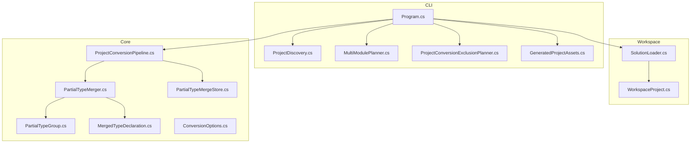
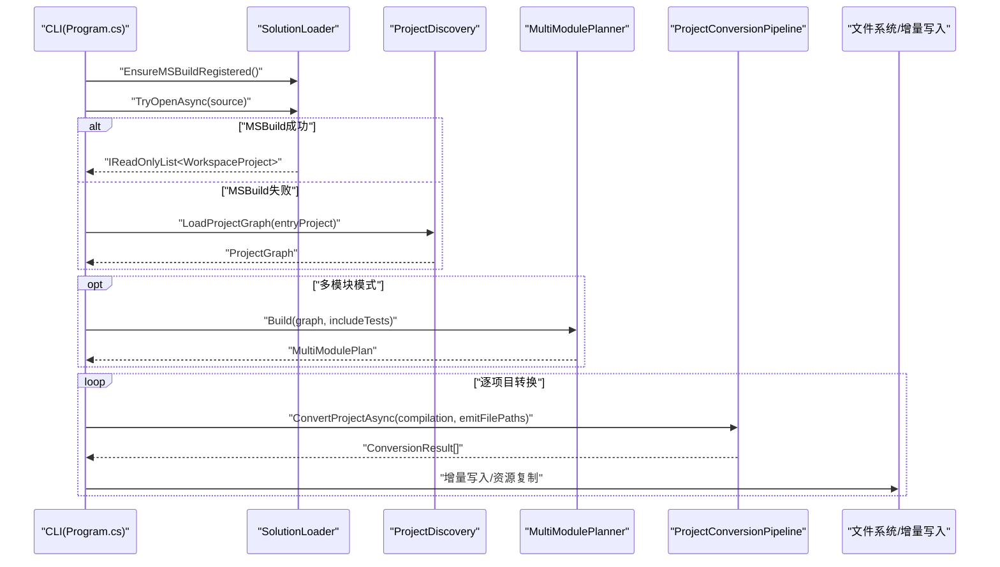
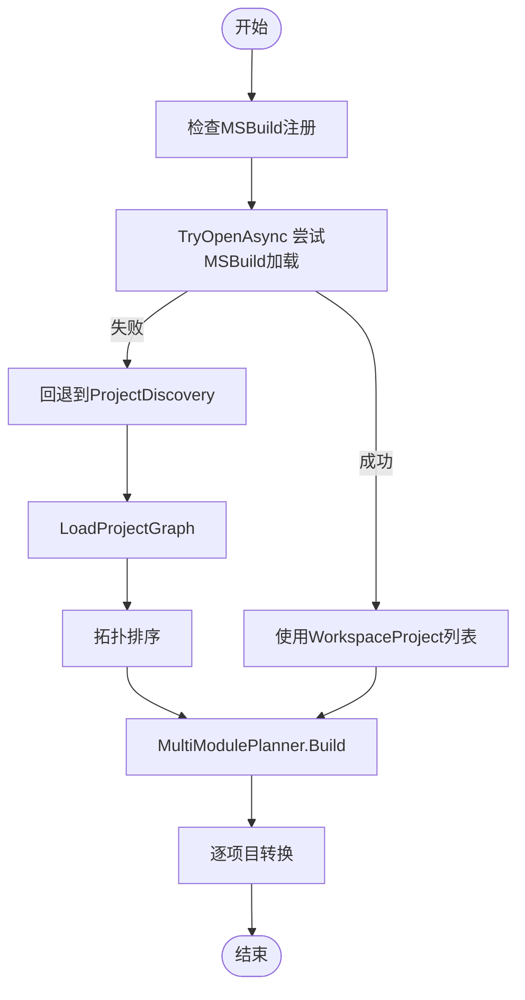
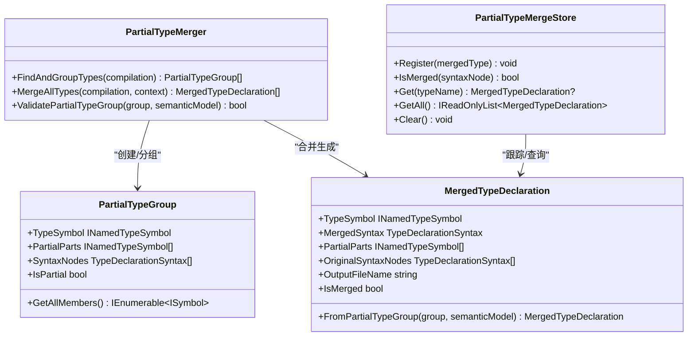
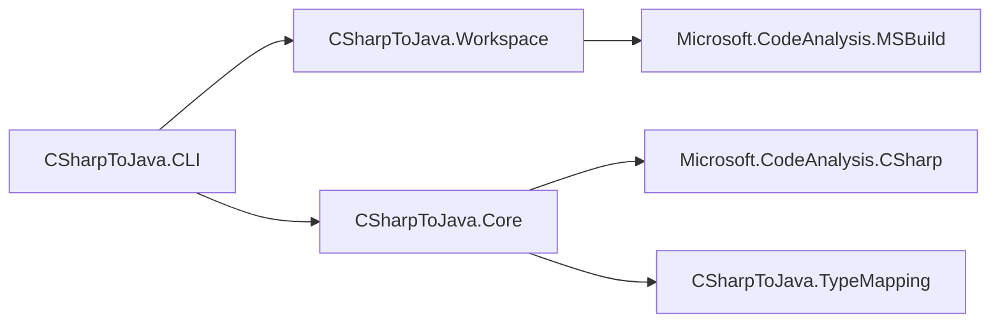

# 工作区项目管理

<cite>
**本文档引用的文件**
- [SolutionLoader.cs](file://src/CSharpToJava.Workspace/SolutionLoader.cs)
- [WorkspaceProject.cs](file://src/CSharpToJava.Workspace/WorkspaceProject.cs)
- [ProjectDiscovery.cs](file://src/CSharpToJava.CLI/ProjectDiscovery.cs)
- [MultiModulePlanner.cs](file://src/CSharpToJava.CLI/MultiModulePlanner.cs)
- [Program.cs](file://src/CSharpToJava.CLI/Program.cs)
- [PartialTypeMerger.cs](file://src/CSharpToJava.Core/PartialType/PartialTypeMerger.cs)
- [PartialTypeGroup.cs](file://src/CSharpToJava.Core/PartialType/PartialTypeGroup.cs)
- [MergedTypeDeclaration.cs](file://src/CSharpToJava.Core/PartialType/MergedTypeDeclaration.cs)
- [PartialTypeMergeStore.cs](file://src/CSharpToJava.Core/Context/PartialTypeMergeStore.cs)
- [ProjectConversionPipeline.cs](file://src/CSharpToJava.Core/Pipeline/ProjectConversionPipeline.cs)
- [ConversionOptions.cs](file://src/CSharpToJava.Core/Context/ConversionOptions.cs)
- [ProjectConversionExclusionPlanner.cs](file://src/CSharpToJava.CLI/ProjectConversionExclusionPlanner.cs)
- [GeneratedProjectAssets.cs](file://src/CSharpToJava.CLI/GeneratedProjectAssets.cs)
- [convert-agl-graphlayout.sh](file://convert-agl-graphlayout.sh)
- [convert-agl-graphlayout.bat](file://convert-agl-graphlayout.bat)
- [CSharpToJavaConverter.slnx](file://CSharpToJavaConverter.slnx)
- [.gitignore](file://.gitignore)
- [ProjectDiscoveryTests.cs](file://tests/CSharpToJava.Tests/ProjectDiscoveryTests.cs)
</cite>

## 目录
1. [简介](#简介)
2. [项目结构](#项目结构)
3. [核心组件](#核心组件)
4. [架构总览](#架构总览)
5. [详细组件分析](#详细组件分析)
6. [依赖关系分析](#依赖关系分析)
7. [性能考虑](#性能考虑)
8. [故障排查指南](#故障排查指南)
9. [结论](#结论)
10. [附录](#附录)

## 简介
本文件面向cs2j工作区项目管理系统，聚焦以下目标：
- 解释项目发现机制：如何识别与加载C#解决方案与项目文件，以及在无MSBuild环境下的回退方案。
- 文档化部分类型合并的实现细节：基于Roslyn符号模型的部分类型查找、分组与合并策略。
- 说明MSBuild集成支持与配置选项：如何注册MSBuild定位器、通过MSBuildWorkspace解析完整语义。
- 提供项目级转换最佳实践与性能优化建议：流水线阶段、并行化、增量输出等。
- 解释工作区管理中的错误处理与故障恢复机制：排除不支持平台的项目、增量写入、失败诊断。
- 大型项目转换策略与注意事项：多模块规划、兼容性包、并行与增量。

## 项目结构
该仓库采用多项目结构，核心模块如下：
- CSharpToJava.Workspace：基于MSBuildWorkspace的工作区加载与项目表示。
- CSharpToJava.CLI：命令行入口、项目发现与多模块规划、转换流程编排。
- CSharpToJava.Core：转换流水线、部分类型合并、上下文与选项、类型映射。
- CSharpToJava.TypeMapping：Java标准库元数据索引与类型映射注册。
- tests：覆盖项目发现、排除策略等行为的单元测试。

图表来源
- [Program.cs](file://src/CSharpToJava.CLI/Program.cs)
- [SolutionLoader.cs](file://src/CSharpToJava.Workspace/SolutionLoader.cs)
- [WorkspaceProject.cs](file://src/CSharpToJava.Workspace/WorkspaceProject.cs)
- [ProjectDiscovery.cs](file://src/CSharpToJava.CLI/ProjectDiscovery.cs)
- [MultiModulePlanner.cs](file://src/CSharpToJava.CLI/MultiModulePlanner.cs)
- [ProjectConversionExclusionPlanner.cs](file://src/CSharpToJava.CLI/ProjectConversionExclusionPlanner.cs)
- [GeneratedProjectAssets.cs](file://src/CSharpToJava.CLI/GeneratedProjectAssets.cs)
- [ProjectConversionPipeline.cs](file://src/CSharpToJava.Core/Pipeline/ProjectConversionPipeline.cs)
- [PartialTypeMerger.cs](file://src/CSharpToJava.Core/PartialType/PartialTypeMerger.cs)
- [PartialTypeGroup.cs](file://src/CSharpToJava.Core/PartialType/PartialTypeGroup.cs)
- [MergedTypeDeclaration.cs](file://src/CSharpToJava.Core/PartialType/MergedTypeDeclaration.cs)
- [PartialTypeMergeStore.cs](file://src/CSharpToJava.Core/Context/PartialTypeMergeStore.cs)
- [ConversionOptions.cs](file://src/CSharpToJava.Core/Context/ConversionOptions.cs)

章节来源
- [Program.cs](file://src/CSharpToJava.CLI/Program.cs)
- [SolutionLoader.cs](file://src/CSharpToJava.Workspace/SolutionLoader.cs)
- [WorkspaceProject.cs](file://src/CSharpToJava.Workspace/WorkspaceProject.cs)
- [ProjectDiscovery.cs](file://src/CSharpToJava.CLI/ProjectDiscovery.cs)
- [MultiModulePlanner.cs](file://src/CSharpToJava.CLI/MultiModulePlanner.cs)
- [ProjectConversionExclusionPlanner.cs](file://src/CSharpToJava.CLI/ProjectConversionExclusionPlanner.cs)
- [GeneratedProjectAssets.cs](file://src/CSharpToJava.CLI/GeneratedProjectAssets.cs)
- [ProjectConversionPipeline.cs](file://src/CSharpToJava.Core/Pipeline/ProjectConversionPipeline.cs)
- [PartialTypeMerger.cs](file://src/CSharpToJava.Core/PartialType/PartialTypeMerger.cs)
- [PartialTypeGroup.cs](file://src/CSharpToJava.Core/PartialType/PartialTypeGroup.cs)
- [MergedTypeDeclaration.cs](file://src/CSharpToJava.Core/PartialType/MergedTypeDeclaration.cs)
- [PartialTypeMergeStore.cs](file://src/CSharpToJava.Core/Context/PartialTypeMergeStore.cs)
- [ConversionOptions.cs](file://src/CSharpToJava.Core/Context/ConversionOptions.cs)

## 核心组件
- SolutionLoader：负责注册MSBuild定位器、打开.sln/.csproj，构建MSBuildWorkspace，解析解决方案拓扑顺序，提取每个项目的C#编译、文档、引用与测试标识。
- WorkspaceProject：封装单个已解析项目的所有信息，作为后续转换流水线的输入。
- ProjectDiscovery：在无MSBuild时，解析.sln/.csproj与目录，手工构建项目图，识别测试项目与资源文件，执行拓扑排序。
- MultiModulePlanner：基于生产/测试项目关系，生成多模块计划，确保编译与测试依赖关系正确。
- Program：CLI主流程，优先尝试MSBuild加载；失败则回退到手动项目发现；根据模式选择单模块或多模块转换；管理增量输出与POM生成。
- PartialTypeMerger/PartialTypeGroup/MergedTypeDeclaration/PartialTypeMergeStore：部分类型合并流水线，基于Roslyn符号模型查找、分组、验证与合并部分类型声明，生成统一的语法树并跟踪已合并类型。
- ProjectConversionPipeline：项目级转换流水线，包含LINQ预处理、扩展方法索引、部分类型规范化、类型发射、兼容性支持、跨包导入与模块依赖等阶段。
- ConversionOptions：转换配置项，如目标Java版本、是否生成JavaDoc、是否使用Record、是否启用LINQ重写、是否并行处理等。
- ProjectConversionExclusionPlanner：排除不支持平台的项目（如WindowsDesktop/WPF/Windows特定TFM/UWP），并传播到其依赖方。
- GeneratedProjectAssets：生成项目根部资产（如.gitignore模板）。

章节来源
- [SolutionLoader.cs](file://src/CSharpToJava.Workspace/SolutionLoader.cs)
- [WorkspaceProject.cs](file://src/CSharpToJava.Workspace/WorkspaceProject.cs)
- [ProjectDiscovery.cs](file://src/CSharpToJava.CLI/ProjectDiscovery.cs)
- [MultiModulePlanner.cs](file://src/CSharpToJava.CLI/MultiModulePlanner.cs)
- [Program.cs](file://src/CSharpToJava.CLI/Program.cs)
- [PartialTypeMerger.cs](file://src/CSharpToJava.Core/PartialType/PartialTypeMerger.cs)
- [PartialTypeGroup.cs](file://src/CSharpToJava.Core/PartialType/PartialTypeGroup.cs)
- [MergedTypeDeclaration.cs](file://src/CSharpToJava.Core/PartialType/MergedTypeDeclaration.cs)
- [PartialTypeMergeStore.cs](file://src/CSharpToJava.Core/Context/PartialTypeMergeStore.cs)
- [ProjectConversionPipeline.cs](file://src/CSharpToJava.Core/Pipeline/ProjectConversionPipeline.cs)
- [ConversionOptions.cs](file://src/CSharpToJava.Core/Context/ConversionOptions.cs)
- [ProjectConversionExclusionPlanner.cs](file://src/CSharpToJava.CLI/ProjectConversionExclusionPlanner.cs)
- [GeneratedProjectAssets.cs](file://src/CSharpToJava.CLI/GeneratedProjectAssets.cs)

## 架构总览
下图展示从CLI到工作区加载、项目发现、部分类型合并与转换流水线的整体交互。

图表来源
- [Program.cs](file://src/CSharpToJava.CLI/Program.cs)
- [SolutionLoader.cs](file://src/CSharpToJava.Workspace/SolutionLoader.cs)
- [ProjectDiscovery.cs](file://src/CSharpToJava.CLI/ProjectDiscovery.cs)
- [MultiModulePlanner.cs](file://src/CSharpToJava.CLI/MultiModulePlanner.cs)
- [ProjectConversionPipeline.cs](file://src/CSharpToJava.Core/Pipeline/ProjectConversionPipeline.cs)

## 详细组件分析

### 项目发现机制（MSBuild与回退）
- MSBuild路径优先：CLI启动即调用SolutionLoader.EnsureMSBuildRegistered()注册MSBuild定位器；随后TryOpenAsync优先尝试以.sln/.csproj或目录作为入口，自动选择打开方案。
- 解决方案加载：OpenSolutionAsync/OpenProjectAsync分别加载解决方案或单个项目，订阅WorkspaceFailed事件以报告警告；按项目依赖拓扑顺序编译与收集文档。
- 测试项目识别：通过引用的可移植可执行文件名称集合与项目名启发式判断测试项目。
- 回退路径：当MSBuild不可用或失败时，回退到ProjectDiscovery，解析.sln/.csproj与目录，手工扫描ProjectReference/PackageReference，识别测试项目与资源文件，执行拓扑排序。
- 多模块规划：MultiModulePlanner将生产项目独立成模块，测试项目尽可能就近并入被引用的生产模块，否则单独成测试模块，保证编译与测试依赖关系。

图表来源
- [Program.cs](file://src/CSharpToJava.CLI/Program.cs)
- [SolutionLoader.cs](file://src/CSharpToJava.Workspace/SolutionLoader.cs)
- [ProjectDiscovery.cs](file://src/CSharpToJava.CLI/ProjectDiscovery.cs)
- [MultiModulePlanner.cs](file://src/CSharpToJava.CLI/MultiModulePlanner.cs)

章节来源
- [Program.cs](file://src/CSharpToJava.CLI/Program.cs)
- [SolutionLoader.cs](file://src/CSharpToJava.Workspace/SolutionLoader.cs)
- [ProjectDiscovery.cs](file://src/CSharpToJava.CLI/ProjectDiscovery.cs)
- [MultiModulePlanner.cs](file://src/CSharpToJava.CLI/MultiModulePlanner.cs)

### 部分类型合并实现细节
- 符号级查找：PartialTypeMerger基于CSharpCompilation的命名空间层次遍历，仅处理具有源位置的类型，避免仅来自引用程序集的类型。
- 分组策略：通过INamedTypeSymbol.DeclaringSyntaxReferences数量判断是否为部分类型；同一类型在嵌套类型或命名空间中可能有多个声明，统一归并。
- 语法节点收集：遍历所有部分的DeclaringSyntaxReferences，提取TypeDeclarationSyntax节点，去重后用于后续合并。
- 合并与去重：MergedTypeDeclaration.FromPartialTypeGroup将所有成员合并到单一语法节点，移除partial修饰符，生成统一的输出文件名。
- 验证与诊断：ValidatePartialTypeGroup检查类型参数一致性、访问级别与基类一致性，冲突处发出错误或警告。
- 运行期跟踪：PartialTypeMergeStore记录已合并类型，便于转换过程中快速查询与复用。

图表来源
- [PartialTypeMerger.cs](file://src/CSharpToJava.Core/PartialType/PartialTypeMerger.cs)
- [PartialTypeGroup.cs](file://src/CSharpToJava.Core/PartialType/PartialTypeGroup.cs)
- [MergedTypeDeclaration.cs](file://src/CSharpToJava.Core/PartialType/MergedTypeDeclaration.cs)
- [PartialTypeMergeStore.cs](file://src/CSharpToJava.Core/Context/PartialTypeMergeStore.cs)

章节来源
- [PartialTypeMerger.cs](file://src/CSharpToJava.Core/PartialType/PartialTypeMerger.cs)
- [PartialTypeGroup.cs](file://src/CSharpToJava.Core/PartialType/PartialTypeGroup.cs)
- [MergedTypeDeclaration.cs](file://src/CSharpToJava.Core/PartialType/MergedTypeDeclaration.cs)
- [PartialTypeMergeStore.cs](file://src/CSharpToJava.Core/Context/PartialTypeMergeStore.cs)

### MSBuild集成与配置选项
- MSBuild注册：EnsureMSBuildRegistered()线程安全地注册默认MSBuild定位器，捕获未找到SDK的异常并返回false。
- 工作区操作：OpenSolutionAsync/OpenProjectAsync创建MSBuildWorkspace，订阅WorkspaceFailed事件，按拓扑顺序编译项目，过滤非C#与非常规文档，识别测试项目。
- 配置选项：ConversionOptions提供目标Java版本、类型映射配置路径、Java标准库元数据路径、是否生成JavaDoc、是否使用Record、是否使用Optional替代nullable、是否启用LINQ重写、是否偏好Stream API、是否重写扩展方法、是否生成兼容性辅助类、是否使用兼容性包、共享兼容性包、是否启用项目级并行等。
- 兼容性支持：ProjectConversionPipeline支持生成共享兼容性模块并在多模块模式下禁用当前模块的兼容类生成，由共享模块集中提供。

章节来源
- [SolutionLoader.cs](file://src/CSharpToJava.Workspace/SolutionLoader.cs)
- [ConversionOptions.cs](file://src/CSharpToJava.Core/Context/ConversionOptions.cs)
- [ProjectConversionPipeline.cs](file://src/CSharpToJava.Core/Pipeline/ProjectConversionPipeline.cs)

### 项目级转换最佳实践与性能优化
- 优先使用MSBuild：在存在MSBuild SDK时，优先通过SolutionLoader加载完整语义模型，避免手工解析XML带来的遗漏。
- 多模块规划：对大型项目采用MultiModulePlanner，将测试就近并入被引用模块，减少跨模块依赖；必要时生成共享兼容性模块，统一依赖。
- 并行与增量：开启EnableParallelProjectPasses以提升吞吐；使用OutputIncrementalWriteSession进行增量写入，避免重复生成；生成POM文件以适配Maven构建。
- 资源复制：ProjectDiscovery扫描None/Content并标记CopyToOutputDirectory的资源，Program在单模块模式下复制至对应资源目录。
- 排除不支持项目：使用ProjectConversionExclusionPlanner排除WindowsDesktop/WPF/Windows特定TFM/UWP项目及其依赖，防止转换失败或无效产物。

章节来源
- [Program.cs](file://src/CSharpToJava.CLI/Program.cs)
- [MultiModulePlanner.cs](file://src/CSharpToJava.CLI/MultiModulePlanner.cs)
- [ProjectConversionExclusionPlanner.cs](file://src/CSharpToJava.CLI/ProjectConversionExclusionPlanner.cs)

### 错误处理与故障恢复机制
- MSBuild失败回退：Program在TryOpenAsync失败时记录消息并回退到ProjectDiscovery；若仍失败则进入手动输入指纹快照与增量复用逻辑。
- 平台排除：ProjectConversionExclusionPlanner基于SDK、UseWPF/UseWindowsForms、TargetFramework/TargetPlatformIdentifier与UWP包引用综合判定，排除Windows-only项目并传播到下游依赖。
- 增量与资产：GeneratedProjectAssets在输出根目录写入.gitignore模板；OutputIncrementalWriteSession记录写入历史，支持覆盖/删除策略与失败诊断。
- 诊断与日志：SolutionLoader订阅WorkspaceFailed事件；各阶段Pass收集Cs2jPassMetric与Linq统计；CLI输出诊断信息与详细堆栈（verbose模式）。

章节来源
- [Program.cs](file://src/CSharpToJava.CLI/Program.cs)
- [ProjectConversionExclusionPlanner.cs](file://src/CSharpToJava.CLI/ProjectConversionExclusionPlanner.cs)
- [GeneratedProjectAssets.cs](file://src/CSharpToJava.CLI/GeneratedProjectAssets.cs)
- [SolutionLoader.cs](file://src/CSharpToJava.Workspace/SolutionLoader.cs)

### 大型项目转换策略与注意事项
- 多模块策略：先生成共享兼容性模块，再为每个WorkspaceProject生成独立模块；模块间通过内部模块引用与外部依赖统一管理。
- 兼容性包：启用UseCompatibilityPacks按需生成所需兼容类，降低体积与复杂度。
- 并行与缓存：启用EnableParallelProjectPasses；利用输入指纹快照与增量写入避免重复转换。
- CI/CD集成：convert-agl-graphlayout脚本提供端到端转换与Maven构建示例，便于在CI中复用。

章节来源
- [Program.cs](file://src/CSharpToJava.CLI/Program.cs)
- [convert-agl-graphlayout.sh](file://convert-agl-graphlayout.sh)
- [convert-agl-graphlayout.bat](file://convert-agl-graphlayout.bat)

## 依赖关系分析
- CLI依赖Workspace与Core模块：Program依赖SolutionLoader与ProjectConversionPipeline；在多模块模式下依赖MultiModulePlanner与ProjectConversionExclusionPlanner。
- Workspace依赖MSBuild：SolutionLoader依赖Microsoft.Build.Locator与Microsoft.CodeAnalysis.MSBuild。
- Core依赖Roslyn：PartialTypeMerger与ProjectConversionPipeline依赖Microsoft.CodeAnalysis与Microsoft.CodeAnalysis.CSharp。
- 类型映射：Core通过TypeMappingRegistry与JavaLibraryIndex加载Java标准库元数据，增强语义校验与方法映射。

图表来源
- [Program.cs](file://src/CSharpToJava.CLI/Program.cs)
- [SolutionLoader.cs](file://src/CSharpToJava.Workspace/SolutionLoader.cs)
- [ProjectConversionPipeline.cs](file://src/CSharpToJava.Core/Pipeline/ProjectConversionPipeline.cs)

章节来源
- [Program.cs](file://src/CSharpToJava.CLI/Program.cs)
- [SolutionLoader.cs](file://src/CSharpToJava.Workspace/SolutionLoader.cs)
- [ProjectConversionPipeline.cs](file://src/CSharpToJava.Core/Pipeline/ProjectConversionPipeline.cs)

## 性能考虑
- 并行化：启用EnableParallelProjectPasses可在项目级Pass中并行处理语法树，同时保持结果确定性。
- 增量转换：通过输入指纹快照与OutputIncrementalWriteSession避免重复写入，显著缩短二次运行时间。
- 依赖拓扑：MSBuild拓扑排序与ProjectDiscovery拓扑排序确保先处理上游依赖，减少无效重算。
- 资源扫描：ProjectDiscovery对Resources目录的非代码文件进行扫描，避免遗漏但注意I/O开销。
- 多模块：共享兼容性模块减少重复生成，模块间依赖清晰，利于并行构建。

## 故障排查指南
- MSBuild未安装：EnsureMSBuildRegistered返回false，CLI会回退到ProjectDiscovery；确认MSBuild SDK可用或使用手动模式。
- Windows-only项目：被ProjectConversionExclusionPlanner排除，检查SDK/TFM/UseWPF/UseWindowsForms/UWP包引用。
- 转换失败：查看CLI输出的诊断信息与详细堆栈；关注WorkspaceFailed事件与各Pass的Cs2jPassMetric。
- 输出未更新：确认增量写入开关与Force覆盖策略；检查.gitignore模板是否正确生成。
- CI构建：参考convert-agl-graphlayout脚本，确保dotnet run与mvn命令链路正确。

章节来源
- [Program.cs](file://src/CSharpToJava.CLI/Program.cs)
- [ProjectConversionExclusionPlanner.cs](file://src/CSharpToJava.CLI/ProjectConversionExclusionPlanner.cs)
- [GeneratedProjectAssets.cs](file://src/CSharpToJava.CLI/GeneratedProjectAssets.cs)
- [convert-agl-graphlayout.sh](file://convert-agl-graphlayout.sh)
- [convert-agl-graphlayout.bat](file://convert-agl-graphlayout.bat)

## 结论
cs2j工作区项目管理系统通过MSBuildWorkspace实现对C#解决方案与项目的完整语义解析，并在缺失MSBuild时提供可靠的回退方案。部分类型合并基于Roslyn符号模型，确保跨文件声明的一致性与完整性。CLI在多模块模式下提供清晰的模块规划与兼容性支持，结合并行与增量机制，能够高效处理大型项目转换。配套的排除策略与诊断体系有助于在复杂工程中实现稳定与可维护的转换流程。

## 附录
- 解决方案文件：CSharpToJavaConverter.slnx定义了项目与文件夹布局。
- 构建脚本：convert-agl-graphlayout.*提供端到端转换与Maven构建示例。
- .gitignore：仓库根部.gitignore定义了.NET与生成文件的忽略规则。

章节来源
- [CSharpToJavaConverter.slnx](file://CSharpToJavaConverter.slnx)
- [convert-agl-graphlayout.sh](file://convert-agl-graphlayout.sh)
- [convert-agl-graphlayout.bat](file://convert-agl-graphlayout.bat)
- [.gitignore](file://.gitignore)