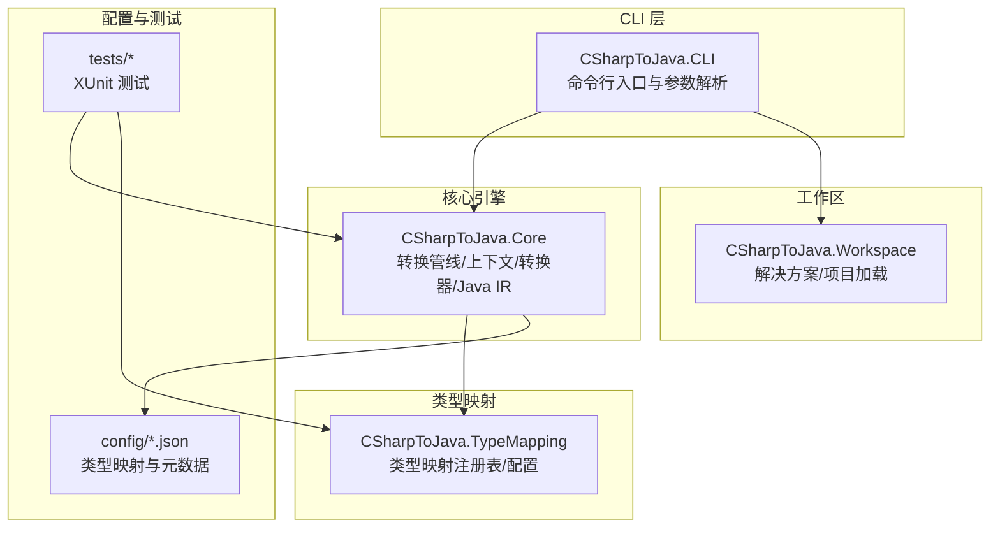
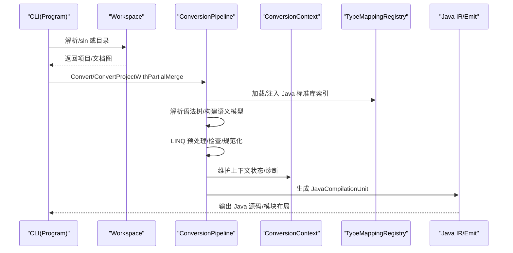
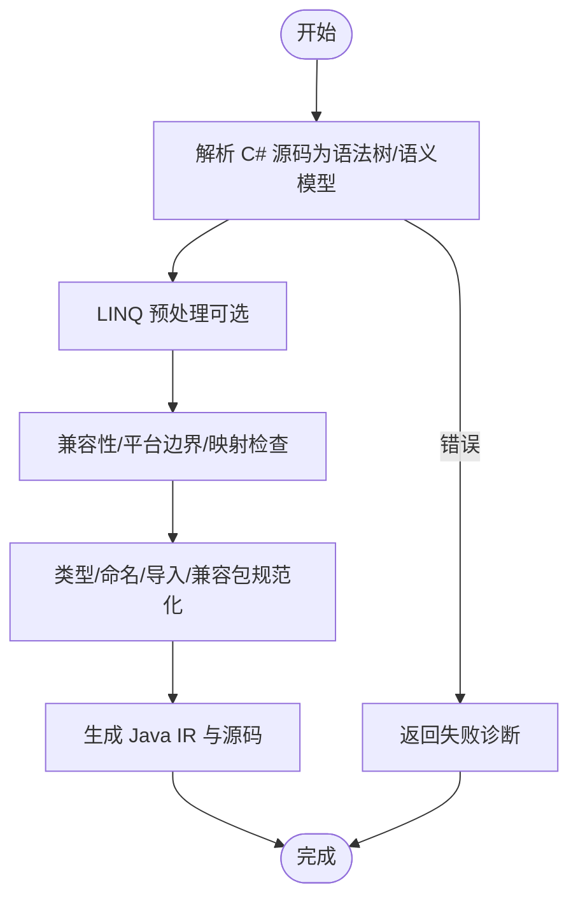
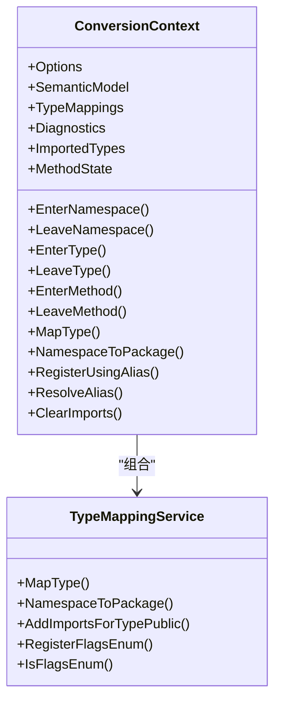
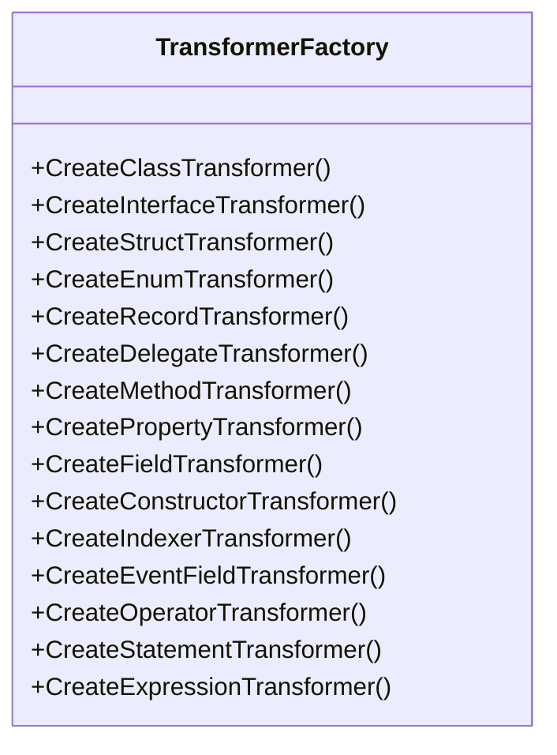
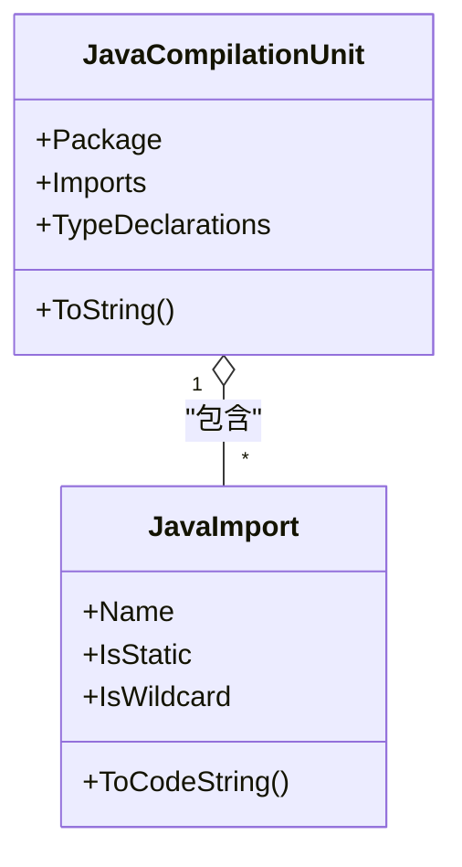
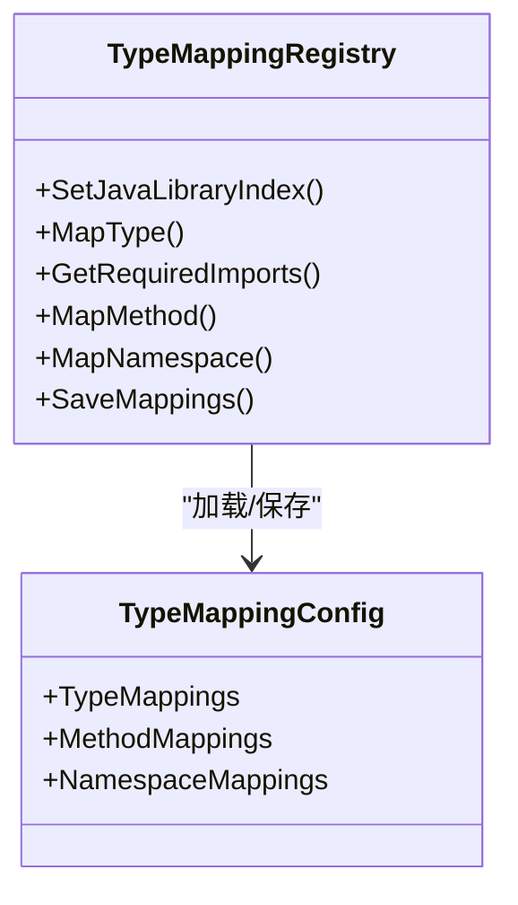
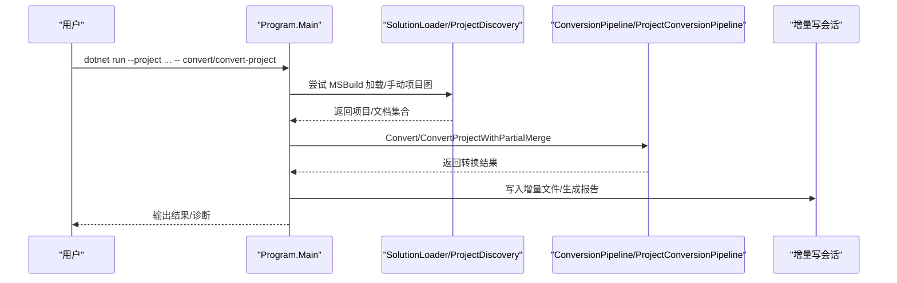
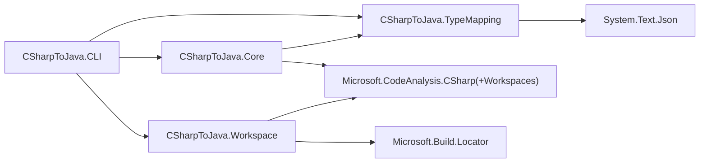

# 开发者指南

<cite>
**本文引用的文件**
- [README.md](file://README.md)
- [CSharpToJava.CLI.csproj](file://src/CSharpToJava.CLI/CSharpToJava.CLI.csproj)
- [CSharpToJava.Core.csproj](file://src/CSharpToJava.Core/CSharpToJava.Core.csproj)
- [CSharpToJava.TypeMapping.csproj](file://src/CSharpToJava.TypeMapping/CSharpToJava.TypeMapping.csproj)
- [CSharpToJava.Workspace.csproj](file://src/CSharpToJava.Workspace/CSharpToJava.Workspace.csproj)
- [Program.cs](file://src/CSharpToJava.CLI/Program.cs)
- [ConversionPipeline.cs](file://src/CSharpToJava.Core/Pipeline/ConversionPipeline.cs)
- [ConversionContext.cs](file://src/CSharpToJava.Core/Context/ConversionContext.cs)
- [TransformerFactory.cs](file://src/CSharpToJava.Core/Transformers/TransformerFactory.cs)
- [JavaCompilationUnit.cs](file://src/CSharpToJava.Core/Java/JavaCompilationUnit.cs)
- [TypeMappingRegistry.cs](file://src/CSharpToJava.TypeMapping/TypeMappingRegistry.cs)
- [TypeMappings.json](file://config/TypeMappings.json)
- [CSharpToJava.Tests.csproj](file://tests/CSharpToJava.Tests/CSharpToJava.Tests.csproj)
- [TestPaths.cs](file://tests/CSharpToJava.Tests/TestPaths.cs)
- [linq-rewrite-engine-architecture.md](file://docs/linq-rewrite-engine-architecture.md)
- [j2cl-architecture-upgrade.md](file://docs/j2cl-architecture-upgrade.md)
</cite>

## 目录
1. [简介](#简介)
2. [项目结构](#项目结构)
3. [核心组件](#核心组件)
4. [架构总览](#架构总览)
5. [详细组件分析](#详细组件分析)
6. [依赖分析](#依赖分析)
7. [性能考虑](#性能考虑)
8. [故障排查指南](#故障排查指南)
9. [结论](#结论)
10. [附录](#附录)

## 简介
cs2j 是一个基于 Roslyn 的 C# 到 Java 源码转换器，支持现代 Java 版本（最高 Java 25），提供类型映射配置（JSON 驱动）、LINQ 到过程式代码重写、async/await 翻译（Task → CompletableFuture）、Java Records 支持、项目级转换与 partial 类型合并等功能。项目采用模块化架构，CLI、核心转换引擎、类型映射与工作区加载相互解耦，便于扩展与维护。

## 项目结构
仓库采用多项目（Solution）组织方式，核心模块与 CLI、测试、配置与文档分离，便于独立开发与测试。

- src/CSharpToJava.CLI：命令行界面，负责解析参数、加载工作区、协调转换流程与输出。
- src/CSharpToJava.Core：核心转换引擎，基于 Roslyn 的语法树与语义模型，提供转换管线、上下文、转换器工厂与 Java IR。
- src/CSharpToJava.TypeMapping：类型映射注册表与配置，支持 JSON 驱动的类型/方法/命名空间映射。
- src/CSharpToJava.Workspace：工作区与解决方案加载，支持 MSBuild 与项目图解析。
- config：类型映射配置与 Java 标准库元数据索引（大量 JSON 描述文件）。
- tests：XUnit 测试项目，覆盖转换流程、类型映射、LINQ 重写、项目级转换等。
- docs：架构设计文档，包括 LINQ 重写引擎与 Java-only 大型项目架构升级方案。

图表来源
- [CSharpToJava.CLI.csproj:1-34](file://src/CSharpToJava.CLI/CSharpToJava.CLI.csproj#L1-L34)
- [CSharpToJava.Core.csproj:1-19](file://src/CSharpToJava.Core/CSharpToJava.Core.csproj#L1-L19)
- [CSharpToJava.TypeMapping.csproj:1-14](file://src/CSharpToJava.TypeMapping/CSharpToJava.TypeMapping.csproj#L1-L14)
- [CSharpToJava.Workspace.csproj:1-17](file://src/CSharpToJava.Workspace/CSharpToJava.Workspace.csproj#L1-L17)

章节来源
- [README.md:1-84](file://README.md#L1-L84)
- [CSharpToJava.CLI.csproj:1-34](file://src/CSharpToJava.CLI/CSharpToJava.CLI.csproj#L1-L34)
- [CSharpToJava.Core.csproj:1-19](file://src/CSharpToJava.Core/CSharpToJava.Core.csproj#L1-L19)
- [CSharpToJava.TypeMapping.csproj:1-14](file://src/CSharpToJava.TypeMapping/CSharpToJava.TypeMapping.csproj#L1-L14)
- [CSharpToJava.Workspace.csproj:1-17](file://src/CSharpToJava.Workspace/CSharpToJava.Workspace.csproj#L1-L17)

## 核心组件
- 转换管线（ConversionPipeline）：负责单文件与项目级转换，串联解析、预处理（LINQ）、检查、规范化与 Java 源码生成。
- 转换上下文（ConversionContext）：贯穿转换过程的状态容器，管理命名空间、类型、方法栈、诊断、导入、类型映射服务与 partial 类型合并。
- 转换器工厂（TransformerFactory）：集中创建各类转换器（类型、成员、语句、表达式），采用静态单例共享。
- Java IR（JavaCompilationUnit/JavaImport）：结构化的 Java 源码表示，支持包、导入与类型声明的生成与去重。
- 类型映射注册表（TypeMappingRegistry）：加载与解析 JSON 配置，提供类型/方法/命名空间映射，并支持 Java 标准库元数据索引校验。
- CLI（Program）：命令行入口，支持单文件转换、项目转换（MSBuild/手动项目图）、多模块规划与增量输出。

章节来源
- [ConversionPipeline.cs:67-443](file://src/CSharpToJava.Core/Pipeline/ConversionPipeline.cs#L67-L443)
- [ConversionContext.cs:14-234](file://src/CSharpToJava.Core/Context/ConversionContext.cs#L14-L234)
- [TransformerFactory.cs:16-59](file://src/CSharpToJava.Core/Transformers/TransformerFactory.cs#L16-L59)
- [JavaCompilationUnit.cs:8-92](file://src/CSharpToJava.Core/Java/JavaCompilationUnit.cs#L8-L92)
- [TypeMappingRegistry.cs:93-562](file://src/CSharpToJava.TypeMapping/TypeMappingRegistry.cs#L93-L562)
- [Program.cs:13-800](file://src/CSharpToJava.CLI/Program.cs#L13-L800)

## 架构总览
cs2j 的转换流程遵循“解析 → 预处理（LINQ）→ 检查 → 规范化 → 生成 Java 源码”的主线。CLI 负责入口与工作区加载，核心引擎负责语义分析与 IR 生成，类型映射模块提供跨语言映射与校验，工作区模块提供项目图与增量输出能力。

图表来源
- [Program.cs:13-800](file://src/CSharpToJava.CLI/Program.cs#L13-L800)
- [ConversionPipeline.cs:115-221](file://src/CSharpToJava.Core/Pipeline/ConversionPipeline.cs#L115-L221)
- [TypeMappingRegistry.cs:130-147](file://src/CSharpToJava.TypeMapping/TypeMappingRegistry.cs#L130-L147)

章节来源
- [j2cl-architecture-upgrade.md:112-134](file://docs/j2cl-architecture-upgrade.md#L112-L134)
- [linq-rewrite-engine-architecture.md:394-425](file://docs/linq-rewrite-engine-architecture.md#L394-L425)

## 详细组件分析

### 转换管线（ConversionPipeline）
- 单文件转换：解析 C# 源码为语法树与语义模型，执行预处理（LINQ）、检查、规范化与 Java 源码生成；支持全局 using 注入与框架补充引用。
- 项目级转换：支持独立文件转换与合并 partial 类型的完整语义模型；支持 MSBuild 工作区与手动项目图两种入口。
- IR 层后处理：允许在生成 Java 源码前对结构化 IR 进行重写，保持与下游分析（跨包导入、模块依赖）的衔接。

图表来源
- [ConversionPipeline.cs:115-221](file://src/CSharpToJava.Core/Pipeline/ConversionPipeline.cs#L115-L221)
- [ConversionPipeline.cs:376-388](file://src/CSharpToJava.Core/Pipeline/ConversionPipeline.cs#L376-L388)

章节来源
- [ConversionPipeline.cs:67-443](file://src/CSharpToJava.Core/Pipeline/ConversionPipeline.cs#L67-L443)

### 转换上下文（ConversionContext）
- 管理命名空间、类型、方法栈，提供当前上下文访问与状态切换。
- 维护诊断收集器、导入集合、类型映射服务、partial 类型合并存储、合成 record 存储与方法级状态（前置/后置语句、ref/out 持有者、lambda/异步/yield 上下文）。
- 提供别名注册与解析、命名空间到包映射、类型缓存与导入清理等能力。

图表来源
- [ConversionContext.cs:14-234](file://src/CSharpToJava.Core/Context/ConversionContext.cs#L14-L234)

章节来源
- [ConversionContext.cs:14-234](file://src/CSharpToJava.Core/Context/ConversionContext.cs#L14-L234)

### 转换器工厂（TransformerFactory）
- 静态单例工厂，集中创建类型转换器（类/接口/结构/枚举/记录/委托）、成员转换器（方法/属性/字段/构造器/索引器/事件/操作符）与语句/表达式转换器。
- 设计目标：无状态、可共享、职责单一，便于扩展与测试。

图表来源
- [TransformerFactory.cs:16-59](file://src/CSharpToJava.Core/Transformers/TransformerFactory.cs#L16-L59)

章节来源
- [TransformerFactory.cs:16-59](file://src/CSharpToJava.Core/Transformers/TransformerFactory.cs#L16-L59)

### Java IR（JavaCompilationUnit/JavaImport）
- JavaCompilationUnit 表示一个 Java 源文件，包含包、导入与类型声明；支持 JDK 导入去重与空白优化。
- JavaImport 表示 import 声明，支持静态导入与通配符导入。

图表来源
- [JavaCompilationUnit.cs:8-92](file://src/CSharpToJava.Core/Java/JavaCompilationUnit.cs#L8-L92)

章节来源
- [JavaCompilationUnit.cs:8-92](file://src/CSharpToJava.Core/Java/JavaCompilationUnit.cs#L8-L92)

### 类型映射注册表（TypeMappingRegistry）
- 加载 JSON 配置，支持类型映射、方法映射与命名空间映射。
- 支持 Java 标准库元数据索引注入，启用方法名自动推断与类型存在性校验。
- 提供保存映射能力，便于扩展与维护。

图表来源
- [TypeMappingRegistry.cs:93-562](file://src/CSharpToJava.TypeMapping/TypeMappingRegistry.cs#L93-L562)

章节来源
- [TypeMappingRegistry.cs:93-562](file://src/CSharpToJava.TypeMapping/TypeMappingRegistry.cs#L93-L562)
- [TypeMappings.json:1-800](file://config/TypeMappings.json#L1-L800)

### CLI（Program）
- 支持单文件转换与项目转换（MSBuild/手动项目图），多模块规划与增量输出。
- 提供详细诊断输出、可选的 JavaDoc 生成、Records/Optional 等选项控制。
- 支持工作区项目过滤、兼容包与运行时桥接需求分析、Pass 指标与 LINQ 报告输出。

图表来源
- [Program.cs:13-800](file://src/CSharpToJava.CLI/Program.cs#L13-L800)

章节来源
- [Program.cs:13-800](file://src/CSharpToJava.CLI/Program.cs#L13-L800)

## 依赖分析
- CLI 依赖核心引擎与类型映射模块，并通过工作区模块加载解决方案/项目。
- 核心引擎依赖类型映射模块与 Roslyn（C# 语法与语义分析）。
- 类型映射模块依赖 System.Text.Json 进行配置解析。
- 工作区模块依赖 Roslyn 工作区与 MSBuild 定位器，支持增量与并行。

图表来源
- [CSharpToJava.CLI.csproj:3-7](file://src/CSharpToJava.CLI/CSharpToJava.CLI.csproj#L3-L7)
- [CSharpToJava.Core.csproj:9-16](file://src/CSharpToJava.Core/CSharpToJava.Core.csproj#L9-L16)
- [CSharpToJava.TypeMapping.csproj:9-11](file://src/CSharpToJava.TypeMapping/CSharpToJava.TypeMapping.csproj#L9-L11)
- [CSharpToJava.Workspace.csproj:9-14](file://src/CSharpToJava.Workspace/CSharpToJava.Workspace.csproj#L9-L14)

章节来源
- [CSharpToJava.CLI.csproj:1-34](file://src/CSharpToJava.CLI/CSharpToJava.CLI.csproj#L1-L34)
- [CSharpToJava.Core.csproj:1-19](file://src/CSharpToJava.Core/CSharpToJava.Core.csproj#L1-L19)
- [CSharpToJava.TypeMapping.csproj:1-14](file://src/CSharpToJava.TypeMapping/CSharpToJava.TypeMapping.csproj#L1-L14)
- [CSharpToJava.Workspace.csproj:1-17](file://src/CSharpToJava.Workspace/CSharpToJava.Workspace.csproj#L1-L17)

## 性能考虑
- 增量与缓存：通过输入指纹快照、增量写会话与 Pass 指标，避免全量重跑；按项目依赖图传播失效。
- 并行与确定性：按项目/模块/类型组并行执行安全的 Pass，共享只读符号索引，确保结果稳定。
- 内存治理：在 Library 级明确资源释放时机，建立声明库存与跨项目符号索引，Pass 只持有必要快照。
- 大项目专项：对超大解决方案支持分模块输出与受控缓存上限，降低峰值内存占用。

章节来源
- [j2cl-architecture-upgrade.md:260-290](file://docs/j2cl-architecture-upgrade.md#L260-L290)
- [j2cl-architecture-upgrade.md:360-372](file://docs/j2cl-architecture-upgrade.md#L360-L372)

## 故障排查指南
- 类型映射配置错误：检查 TypeMappings.json 路径与 JSON 格式，确认类型/方法/命名空间映射是否完整；可通过异常信息定位具体配置项。
- 语义模型不可用：确认 Roslyn 引用与全局 using 注入是否正确；检查 .NET SDK 版本与引用集合。
- 诊断输出：CLI 支持详细诊断输出，包含严重级别与位置信息；结合 ConversionContext.Diagnostics 与 Pass 指标定位问题。
- LINQ 重写失败：查看跳过原因分类与统计，逐步补齐规则或回退到 Stream 路径；关注匿名类型与透明标识符支持情况。
- 工作区加载失败：尝试手动项目图加载或检查 MSBuild 定位器注册；确认 .csproj/.sln 路径与权限。

章节来源
- [TypeMappingRegistry.cs:130-182](file://src/CSharpToJava.TypeMapping/TypeMappingRegistry.cs#L130-L182)
- [ConversionPipeline.cs:115-221](file://src/CSharpToJava.Core/Pipeline/ConversionPipeline.cs#L115-L221)
- [Program.cs:27-109](file://src/CSharpToJava.CLI/Program.cs#L27-L109)
- [linq-rewrite-engine-architecture.md:452-475](file://docs/linq-rewrite-engine-architecture.md#L452-L475)

## 结论
cs2j 通过模块化架构与显式 Pass 主线，实现了从 C# 到 Java 的高保真转换。核心在于：以 Roslyn 为基础的语义分析、可扩展的类型映射、结构化的 Java IR 与完善的可观测性。面向大型复杂项目，建议采用 Library 级批处理模型、前置 unsupported-domain 检查与兼容包/运行时桥接策略，配合增量、并行与内存治理，确保可转换、可回归与可扩展。

## 附录

### 开发环境搭建与调试
- 要求：.NET 10 SDK。
- 构建：dotnet build。
- 运行测试：dotnet test。
- CLI 使用：支持单文件与项目转换、分析类型映射覆盖等。

章节来源
- [README.md:14-48](file://README.md#L14-L48)

### 代码贡献流程与规范
- 提交流程：Fork → 分支 → 提交 → Pull Request（PR）→ 审查 → 合并。
- 编码规范：采用静态单例转换器工厂、无状态转换器、清晰的上下文与诊断；JSON 配置与测试夹具位于 config 与 tests 目录。
- 提交规范：变更需附带测试用例与必要的文档更新；对类型映射与 LINQ 规则变更，补充相应测试与统计指标。

章节来源
- [TransformerFactory.cs:16-59](file://src/CSharpToJava.Core/Transformers/TransformerFactory.cs#L16-L59)
- [CSharpToJava.Tests.csproj:1-35](file://tests/CSharpToJava.Tests/CSharpToJava.Tests.csproj#L1-L35)

### 扩展开发指导与最佳实践
- 新增类型映射：在 TypeMappings.json 中添加条目，必要时提供方法签名约束；通过 TypeMappingRegistry 保存与校验。
- 新增 LINQ 规则：在 LinqRewriter.Rules 中补充展开规则，完善测试覆盖与跳过原因分类。
- 新增 Pass：遵循显式 Pass 体系，明确顺序、依赖与诊断契约；在 ConversionPipeline 中注册。
- 大项目能力：采用 Library 级批处理根对象、统一项目图与符号索引、增量与并行执行策略。

章节来源
- [TypeMappings.json:1-800](file://config/TypeMappings.json#L1-L800)
- [linq-rewrite-engine-architecture.md:487-514](file://docs/linq-rewrite-engine-architecture.md#L487-L514)
- [j2cl-architecture-upgrade.md:179-216](file://docs/j2cl-architecture-upgrade.md#L179-L216)