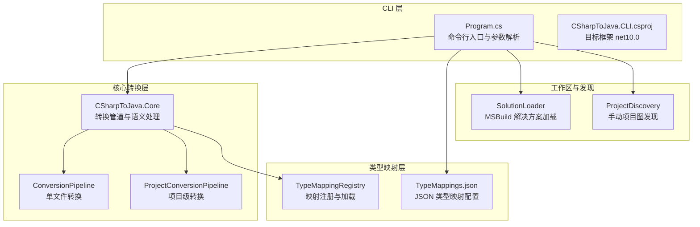
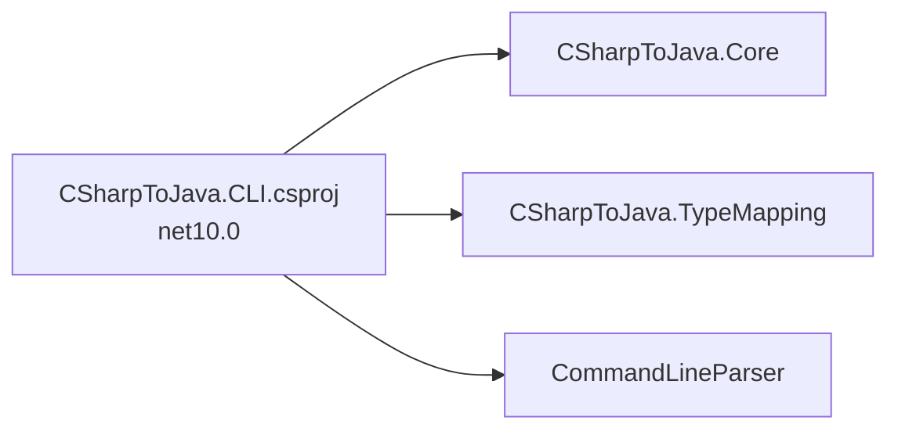

# 快速开始

<cite>
**本文引用的文件**
- [README.md](file://README.md)
- [Program.cs](file://src/CSharpToJava.CLI/Program.cs)
- [CSharpToJava.CLI.csproj](file://src/CSharpToJava.CLI/CSharpToJava.CLI.csproj)
- [TypeMappings.json](file://config/TypeMappings.json)
- [test_input.cs](file://test_input.cs)
- [test_input2.cs](file://test_input2.cs)
- [linq80.cs](file://examples/linq80.cs)
- [convert-agl-graphlayout.sh](file://convert-agl-graphlayout.sh)
- [convert-agl-graphlayout.bat](file://convert-agl-graphlayout.bat)
</cite>

## 目录
1. [简介](#简介)
2. [项目结构](#项目结构)
3. [核心组件](#核心组件)
4. [架构总览](#架构总览)
5. [详细组件分析](#详细组件分析)
6. [依赖关系分析](#依赖关系分析)
7. [性能考虑](#性能考虑)
8. [故障排查指南](#故障排查指南)
9. [结论](#结论)
10. [附录](#附录)

## 简介
本指南面向初学者，帮助你快速上手 cs2j 工具，完成从 C# 到 Java 的代码转换。你将学到：
- 环境要求与安装步骤（.NET 10.0 SDK）
- 第一个转换示例：单文件转换与项目转换
- 常用 CLI 选项与参数配置
- 完整命令行示例与预期输出
- 从准备 C# 代码到生成 Java 代码的完整流程

## 项目结构
cs2j 是一个基于 Roslyn 的 C# 到 Java 转换器，采用多项目架构：
- CLI 层：提供命令行入口与参数解析
- 核心转换层：负责语义分析、类型映射、LINQ 重写、代码生成
- 类型映射层：提供 JSON 驱动的类型映射配置
- 测试与示例：验证转换质量与演示常见场景



图表来源
- [Program.cs:13-25](file://src/CSharpToJava.CLI/Program.cs#L13-L25)
- [CSharpToJava.CLI.csproj:26-31](file://src/CSharpToJava.CLI/CSharpToJava.CLI.csproj#L26-L31)
- [TypeMappings.json:1-20](file://config/TypeMappings.json#L1-L20)

章节来源
- [README.md:14-16](file://README.md#L14-L16)
- [CSharpToJava.CLI.csproj:26-31](file://src/CSharpToJava.CLI/CSharpToJava.CLI.csproj#L26-L31)

## 核心组件
- CLI 入口与命令分发：解析 convert、convert-project、analyze 子命令，调用对应转换逻辑
- 单文件转换：读取输入 C# 文件，构建 ConversionOptions，执行 ConversionPipeline
- 项目转换：支持 MSBuild 加载与手动项目图两种路径，按模块或单模块输出
- 类型映射：默认使用 config/TypeMappings.json，可自定义覆盖
- 分析报告：统计类型映射覆盖率并输出报告

章节来源
- [Program.cs:13-25](file://src/CSharpToJava.CLI/Program.cs#L13-L25)
- [Program.cs:27-109](file://src/CSharpToJava.CLI/Program.cs#L27-L109)
- [Program.cs:111-304](file://src/CSharpToJava.CLI/Program.cs#L111-L304)
- [README.md:30-48](file://README.md#L30-L48)

## 架构总览
下面的序列图展示了“单文件转换”从命令行到生成 Java 输出的端到端流程。

```mermaid
sequenceDiagram
participant U as "用户"
participant CLI as "CLI(Program.cs)"
participant Opt as "ConvertOptions"
participant Pipe as "ConversionPipeline"
participant Res as "ConversionResult"
U->>CLI : 执行 convert 命令
CLI->>Opt : 解析参数(-i,-o,-m,-j,...)
CLI->>Pipe : 创建转换管道
CLI->>Pipe : Convert(源码, 选项, 文件名)
Pipe-->>Res : 返回转换结果
alt 成功
CLI->>U : 写入输出文件或标准输出
else 失败
CLI->>U : 输出诊断信息与错误码
end
```

图表来源
- [Program.cs:27-109](file://src/CSharpToJava.CLI/Program.cs#L27-L109)

章节来源
- [Program.cs:27-109](file://src/CSharpToJava.CLI/Program.cs#L27-L109)

## 详细组件分析

### 环境要求与安装
- 环境要求：.NET 10.0 SDK
- 安装方式：直接安装 .NET 10.0 SDK 即可；无需额外依赖
- 验证安装：在终端运行 dotnet 命令查看版本

章节来源
- [README.md:14-16](file://README.md#L14-L16)

### 第一个转换示例：单文件转换
- 准备输入：使用仓库中的示例 C# 文件作为输入
- 基本命令：convert 子命令 + 输入输出参数
- 常用选项：指定类型映射文件、目标 Java 版本、是否生成 JavaDoc、是否启用 LINQ 重写等

命令示例（Windows）：
- dotnet run --project src/CSharpToJava.CLI/CSharpToJava.CLI.csproj -- convert -i test_input.cs -o Program.java
- dotnet run --project src/CSharpToJava.CLI/CSharpToJava.CLI.csproj -- convert -i test_input2.cs -o Program2.java -m config/TypeMappings.json -j Java25 --no-javadoc --no-linq-rewrite

命令示例（Linux/macOS）：
- dotnet run --project src/CSharpToJava.CLI/CSharpToJava.CLI.csproj -- convert -i test_input.cs -o Program.java
- dotnet run --project src/CSharpToJava.CLI/CSharpToJava.CLI.csproj -- convert -i test_input2.cs -o Program2.java -m config/TypeMappings.json -j Java25 --no-javadoc --no-linq-rewrite

预期输出：
- 若未指定输出文件，将在标准输出打印生成的 Java 代码
- 指定输出文件时，会在当前目录生成对应的 Java 文件
- 若发生错误，会输出诊断信息并返回非零退出码

章节来源
- [README.md:32-36](file://README.md#L32-L36)
- [Program.cs:27-109](file://src/CSharpToJava.CLI/Program.cs#L27-L109)
- [test_input.cs:1-16](file://test_input.cs#L1-L16)
- [test_input2.cs:1-28](file://test_input2.cs#L1-L28)

### 第二个转换示例：项目转换
- 支持源路径为目录、.csproj 或 .sln
- 支持单模块与多模块输出模式
- 可选择是否生成 Maven pom.xml、是否包含测试项目、是否强制覆盖等

命令示例（Windows）：
- dotnet run --project src/CSharpToJava.CLI/CSharpToJava.CLI.csproj -- convert-project -s ./src -d ./output
- dotnet run --project src/CSharpToJava.CLI/CSharpToJava.CLI.csproj -- convert-project -s ./examples/linq80.cs -d ./output --mode multi-module --generate-pom --include-tests

命令示例（Linux/macOS）：
- dotnet run --project src/CSharpToJava.CLI/CSharpToJava.CLI.csproj -- convert-project -s ./src -d ./output
- dotnet run --project src/CSharpToJava.CLI/CSharpToJava.CLI.csproj -- convert-project -s ./examples/linq80.cs -d ./output --mode multi-module --generate-pom --include-tests

预期输出：
- 在目标目录生成 Java 源码与资源文件
- 多模块模式下会生成各模块的 pom.xml
- 包含测试项目的工程会输出到 test 目录

章节来源
- [README.md:38-42](file://README.md#L38-L42)
- [Program.cs:111-304](file://src/CSharpToJava.CLI/Program.cs#L111-L304)
- [convert-agl-graphlayout.sh:36-44](file://convert-agl-graphlayout.sh#L36-L44)
- [convert-agl-graphlayout.bat:26-34](file://convert-agl-graphlayout.bat#L26-L34)

### 常用 CLI 选项与参数配置
- convert 子命令常用选项
  - -i, --input：输入 C# 文件路径（必填）
  - -o, --output：输出 Java 文件路径（默认：标准输出）
  - -m, --mapping：类型映射配置文件路径（默认：./config/TypeMappings.json）
  - -j, --java-version：目标 Java 版本（默认：Java25）
  - --no-records：不使用 Java record（默认：使用）
  - --use-optional：对可空类型使用 Optional（默认：不使用）
  - --no-javadoc：不生成 JavaDoc 注释（默认：生成）
  - --no-linq-rewrite：不预处理 LINQ 为过程式代码（默认：启用）
  - -v, --verbose：显示诊断信息（默认：关闭）

- convert-project 子命令常用选项
  - -s, --source：源目录、.csproj 或 .sln 路径（必填）
  - -d, --destination：目标目录（必填）
  - -m, --mapping：类型映射配置文件路径
  - -j, --java-version：目标 Java 版本（默认：Java25）
  - -f, --force：覆盖已存在文件（默认：开启）
  - --no-records/--use-optional/--no-javadoc/--no-linq-rewrite：同上
  - --prefer-stream-api/--prefer-procedural：LINQ 转换策略（互斥）
  - --generate-pom：生成 Maven pom.xml（默认：开启）
  - --maven-group-id/--maven-version：Maven 组 ID 与版本
  - --include-tests：包含测试项目（默认：开启）
  - --mode：输出模式（single-module 或 multi-module，默认：multi-module）
  - --linq-report：输出 LINQ 预处理报告（默认：关闭）

章节来源
- [README.md:50-62](file://README.md#L50-L62)
- [Program.cs:2328-2375](file://src/CSharpToJava.CLI/Program.cs#L2328-L2375)
- [Program.cs:2377-2440](file://src/CSharpToJava.CLI/Program.cs#L2377-L2440)

### 类型映射配置
- 默认映射文件：config/TypeMappings.json
- 支持覆盖：通过 -m/--mapping 指定自定义映射文件
- 常见映射示例：基础类型、集合接口与实现、异常类型、时间类型、并发容器等

章节来源
- [README.md:56](file://README.md#L56)
- [TypeMappings.json:1-20](file://config/TypeMappings.json#L1-L20)

### 使用流程（从准备到生成）
- 准备 C# 代码：编写或选择现有 C# 示例文件
- 选择转换方式：
  - 单文件转换：适合小片段或独立类
  - 项目转换：适合完整工程，自动发现依赖与资源
- 设置选项：根据需要调整 Java 版本、是否生成 JavaDoc、是否启用 LINQ 重写、是否使用 Optional 等
- 运行命令：在终端执行相应 dotnet run 命令
- 查看输出：检查生成的 Java 文件与控制台输出
- 故障排查：结合 -v/--verbose 查看诊断信息

章节来源
- [README.md:30-48](file://README.md#L30-L48)
- [Program.cs:27-109](file://src/CSharpToJava.CLI/Program.cs#L27-L109)
- [Program.cs:111-304](file://src/CSharpToJava.CLI/Program.cs#L111-L304)

## 依赖关系分析
- CLI 项目目标框架为 net10.0，依赖核心转换库与类型映射库
- CLI 使用 CommandLineParser 解析命令行参数
- 转换过程中依赖 Roslyn 进行语法与语义分析



图表来源
- [CSharpToJava.CLI.csproj:1-34](file://src/CSharpToJava.CLI/CSharpToJava.CLI.csproj#L1-L34)

章节来源
- [CSharpToJava.CLI.csproj:1-34](file://src/CSharpToJava.CLI/CSharpToJava.CLI.csproj#L1-L34)

## 性能考虑
- 并行项目转换：可通过相关选项启用并行执行以提升大型工程转换速度
- LINQ 转换策略：Java 25 默认优先使用 Stream API；也可选择更保守的过程式转换
- 仅转换必要文件：项目转换时可过滤测试项目或排除不受支持的项目

章节来源
- [Program.cs:2364-2366](file://src/CSharpToJava.CLI/Program.cs#L2364-L2366)
- [Program.cs:2410-2414](file://src/CSharpToJava.CLI/Program.cs#L2410-L2414)

## 故障排查指南
- 输入文件不存在：convert 会提示错误并返回非零退出码
- 项目源路径无效：convert-project 会提示错误并返回非零退出码
- 目标目录已存在且未启用覆盖：convert-project 会提示错误并返回非零退出码
- 诊断信息：使用 -v/--verbose 查看详细诊断
- 常见问题定位：
  - 检查 .NET SDK 是否正确安装
  - 确认输入路径与输出路径权限
  - 检查类型映射文件路径是否正确
  - 对于复杂工程，尝试先进行单文件转换验证

章节来源
- [Program.cs:31-35](file://src/CSharpToJava.CLI/Program.cs#L31-L35)
- [Program.cs:119-123](file://src/CSharpToJava.CLI/Program.cs#L119-L123)
- [Program.cs:125-132](file://src/CSharpToJava.CLI/Program.cs#L125-L132)
- [Program.cs:83-97](file://src/CSharpToJava.CLI/Program.cs#L83-L97)

## 结论
通过本快速开始指南，你可以：
- 正确安装 .NET 10.0 SDK
- 使用 convert 与 convert-project 子命令完成单文件与项目转换
- 掌握常用 CLI 选项与类型映射配置
- 按照推荐流程从准备 C# 代码到生成 Java 代码
- 在遇到问题时利用 verbose 输出与错误提示进行定位

建议后续深入：
- 自定义类型映射配置
- 使用 analyze 子命令生成类型映射覆盖率报告
- 在大型工程中选择合适的输出模式与转换策略

## 附录

### 常用命令参考
- 单文件转换
  - dotnet run --project src/CSharpToJava.CLI/CSharpToJava.CLI.csproj -- convert -i 输入.cs -o 输出.java
- 项目转换
  - dotnet run --project src/CSharpToJava.CLI/CSharpToJava.CLI.csproj -- convert-project -s 源路径 -d 目标路径
- 分析类型映射覆盖率
  - dotnet run --project src/CSharpToJava.CLI/CSharpToJava.CLI.csproj -- analyze -s 源路径 -r 报告.json

章节来源
- [README.md:30-48](file://README.md#L30-L48)

### 示例输入文件
- test_input.cs：包含枚举与主函数的简单示例
- test_input2.cs：包含带 Flags 特性的枚举与多个枚举的示例
- linq80.cs：大量 LINQ 查询示例，适合测试 LINQ 重写与转换

章节来源
- [test_input.cs:1-16](file://test_input.cs#L1-L16)
- [test_input2.cs:1-28](file://test_input2.cs#L1-L28)
- [linq80.cs:1-280](file://examples/linq80.cs#L1-L280)