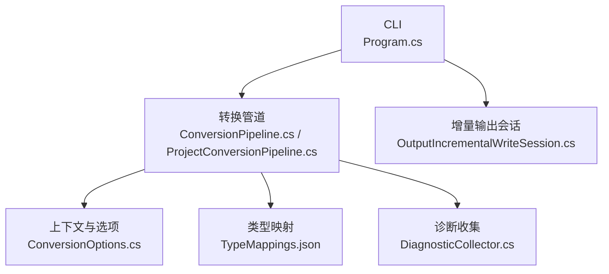
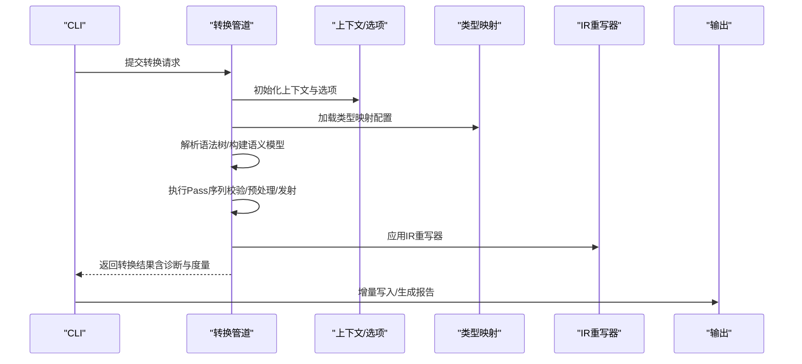
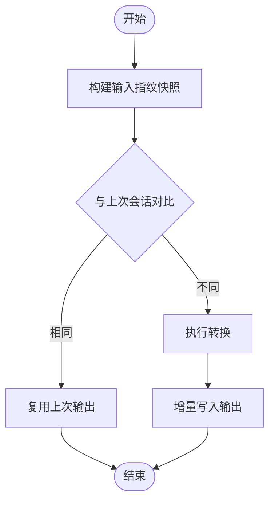
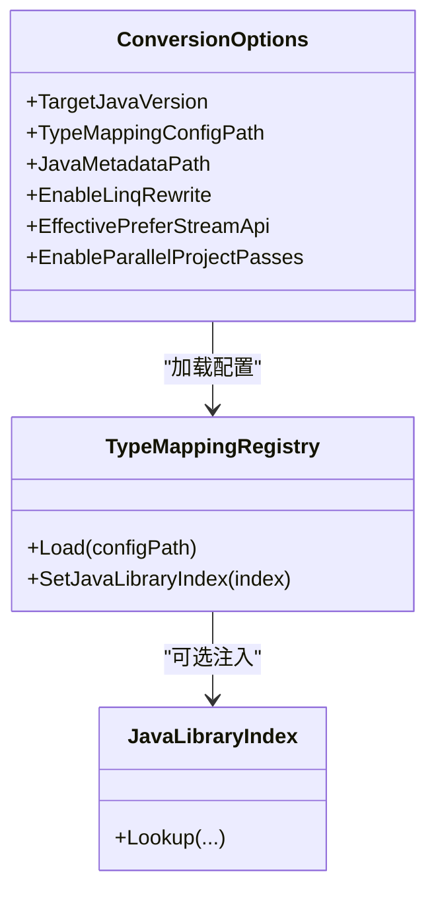
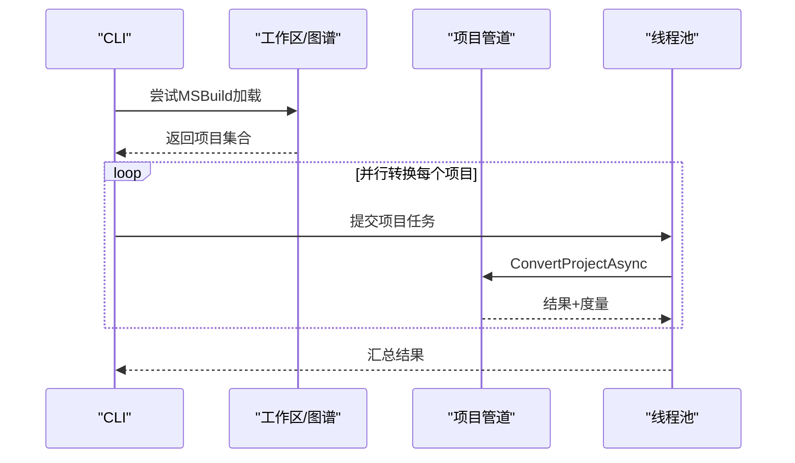
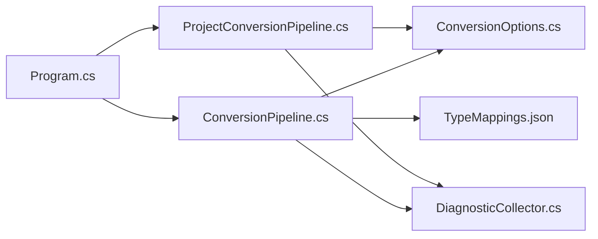

# 性能优化和故障排除

<cite>
**本文档引用的文件**
- [README.md](file://README.md)
- [ConversionPipeline.cs](file://src/CSharpToJava.Core/Pipeline/ConversionPipeline.cs)
- [ProjectConversionPipeline.cs](file://src/CSharpToJava.Core/Pipeline/ProjectConversionPipeline.cs)
- [ConversionOptions.cs](file://src/CSharpToJava.Core/Context/ConversionOptions.cs)
- [DiagnosticCollector.cs](file://src/CSharpToJava.Core/Context/DiagnosticCollector.cs)
- [Program.cs](file://src/CSharpToJava.CLI/Program.cs)
- [TypeMappings.json](file://config/TypeMappings.json)
</cite>

## 目录
1. [简介](#简介)
2. [项目结构](#项目结构)
3. [核心组件](#核心组件)
4. [架构总览](#架构总览)
5. [详细组件分析](#详细组件分析)
6. [依赖关系分析](#依赖关系分析)
7. [性能考量](#性能考量)
8. [故障排除指南](#故障排除指南)
9. [结论](#结论)
10. [附录](#附录)

## 简介
本指南面向cs2j（C#到Java转换器）的性能优化与故障排除，重点覆盖以下方面：
- 增量转换的实现原理与性能提升策略
- 缓存机制的工作方式与配置选项
- 并行处理的实现与性能优化技巧
- 常见性能问题的诊断方法与解决方案
- 内存使用优化与大文件处理最佳实践
- 故障排除流程与调试技巧
- 性能监控与分析工具与方法
- 生产环境部署的性能调优建议

## 项目结构
cs2j采用分层架构：CLI负责命令行交互与增量输出会话管理；Core提供转换管道、上下文与类型映射；TypeMapping提供JSON驱动的类型映射配置；Workspace支持MSBuild工作区加载。

图表来源
- [Program.cs](file://src/CSharpToJava.CLI/Program.cs)
- [ConversionPipeline.cs](file://src/CSharpToJava.Core/Pipeline/ConversionPipeline.cs)
- [ProjectConversionPipeline.cs](file://src/CSharpToJava.Core/Pipeline/ProjectConversionPipeline.cs)
- [ConversionOptions.cs](file://src/CSharpToJava.Core/Context/ConversionOptions.cs)
- [DiagnosticCollector.cs](file://src/CSharpToJava.Core/Context/DiagnosticCollector.cs)
- [TypeMappings.json](file://config/TypeMappings.json)

章节来源
- [README.md](file://README.md)
- [Program.cs](file://src/CSharpToJava.CLI/Program.cs)

## 核心组件
- 转换管道（单文件与项目级）
  - 单文件管道：解析C#语法树、构建语义模型、执行一系列Pass（校验、LINQ预处理、Java发射等），最终生成Java代码。
  - 项目级管道：基于完整编译语义模型，支持partial类型合并、扩展方法索引、跨包导入与模块依赖分析。
- 转换选项（ConversionOptions）
  - 控制目标Java版本、是否生成JavaDoc、是否使用Java Records、是否启用LINQ重写、是否使用Stream API、是否启用并行Pass等。
- 诊断系统（DiagnosticCollector）
  - 统一记录Info/Warning/Error级别诊断信息，便于性能分析与故障定位。
- CLI与增量输出
  - CLI负责输入指纹快照、增量写入会话、Pass性能快照与canary摘要等，支撑增量转换与可观测性。

章节来源
- [ConversionPipeline.cs](file://src/CSharpToJava.Core/Pipeline/ConversionPipeline.cs)
- [ProjectConversionPipeline.cs](file://src/CSharpToJava.Core/Pipeline/ProjectConversionPipeline.cs)
- [ConversionOptions.cs](file://src/CSharpToJava.Core/Context/ConversionOptions.cs)
- [DiagnosticCollector.cs](file://src/CSharpToJava.Core/Context/DiagnosticCollector.cs)
- [Program.cs](file://src/CSharpToJava.CLI/Program.cs)

## 架构总览
cs2j的转换流程由“解析—语义分析—Pass执行—IR重写—Java发射”构成。项目级转换通过多项目编译与扩展方法索引，实现跨文件语义一致性与更高质量的映射。

图表来源
- [ConversionPipeline.cs](file://src/CSharpToJava.Core/Pipeline/ConversionPipeline.cs)
- [ProjectConversionPipeline.cs](file://src/CSharpToJava.Core/Pipeline/ProjectConversionPipeline.cs)
- [Program.cs](file://src/CSharpToJava.CLI/Program.cs)

## 详细组件分析

### 增量转换与增量输出
- 输入指纹快照与增量写入
  - CLI在转换前构建输入指纹快照，比较与上次会话差异，仅对变更文件进行转换与写入，避免重复I/O。
  - 输出会话负责记录manifest、pass profile、canary摘要与输入指纹，确保可重复与可追溯。
- 项目级增量
  - 项目转换时，CLI根据工作区/图谱解析结果，结合指纹快照决定是否复用上一次输出，显著减少大规模工程转换时间。
- 性能收益
  - 减少磁盘读写与重复转换，缩短CI/CD流水线时间；对大型工程尤为明显。

图表来源
- [Program.cs](file://src/CSharpToJava.CLI/Program.cs)

章节来源
- [Program.cs](file://src/CSharpToJava.CLI/Program.cs)

### 缓存机制与配置
- 类型映射缓存
  - 通过TypeMappingRegistry加载TypeMappings.json，支持按需注入Java标准库元数据索引，加速类型解析与方法映射判定。
- Java元数据注入
  - 当配置JavaMetadataPath时，自动注入JavaLibraryIndex，启用语义验证与方法映射自动推断，降低运行期错误率。
- 诊断与度量缓存
  - 每个Pass执行后生成Cs2jPassMetric，CLI聚合为Pass Profile快照，用于后续性能分析与回归检测。

图表来源
- [ConversionOptions.cs](file://src/CSharpToJava.Core/Context/ConversionOptions.cs)
- [TypeMappings.json](file://config/TypeMappings.json)

章节来源
- [ConversionOptions.cs](file://src/CSharpToJava.Core/Context/ConversionOptions.cs)
- [TypeMappings.json](file://config/TypeMappings.json)

### 并行处理与性能优化
- 项目级Pass并行
  - ConversionOptions.EnableParallelProjectPasses控制项目级树局部Pass是否并行执行，并保证结果确定性顺序合并。
- MSBuild工作区并行
  - CLI优先尝试MSBuild加载，获得完整语义模型后并行转换各项目，显著提升多模块工程吞吐。
- 优化建议
  - 合理设置CPU核数与内存上限，避免过度并行导致GC压力。
  - 对超大工程启用多模块拆分，降低单次编译与转换压力。
  - 使用增量转换与指纹快照，减少不必要的并行开销。

图表来源
- [Program.cs](file://src/CSharpToJava.CLI/Program.cs)
- [ProjectConversionPipeline.cs](file://src/CSharpToJava.Core/Pipeline/ProjectConversionPipeline.cs)
- [ConversionOptions.cs](file://src/CSharpToJava.Core/Context/ConversionOptions.cs)

章节来源
- [Program.cs](file://src/CSharpToJava.CLI/Program.cs)
- [ProjectConversionPipeline.cs](file://src/CSharpToJava.Core/Pipeline/ProjectConversionPipeline.cs)
- [ConversionOptions.cs](file://src/CSharpToJava.Core/Context/ConversionOptions.cs)

### 常见性能问题与诊断
- 解析与语义模型构建慢
  - 症状：大量语法错误或语义解析失败。
  - 排查：检查TypeMappingConfigPath与JavaMetadataPath是否正确；确认引用程序集路径完整。
  - 优化：启用增量转换；减少无关目录扫描；使用MSBuild模式以获得完整引用。
- LINQ重写与Stream API选择
  - 症状：LINQ链过长导致生成代码膨胀或运行时性能下降。
  - 排查：查看LastLinqStatistics与Pass Metrics；评估EffectivePreferStreamApi配置。
  - 优化：对Java 25默认启用Stream API；必要时关闭预处理以简化IR。
- 诊断信息与错误定位
  - 使用DiagnosticCollector统一收集Info/Warning/Error；CLI在Verbose模式下打印详细堆栈。
  - 建议：将诊断输出重定向至日志系统，结合Pass Profile进行趋势分析。

章节来源
- [DiagnosticCollector.cs](file://src/CSharpToJava.Core/Context/DiagnosticCollector.cs)
- [Program.cs](file://src/CSharpToJava.CLI/Program.cs)

### 内存使用优化与大文件处理
- 大文件与多文件转换
  - 建议：启用增量转换与并行项目Pass；对超大文件拆分为多个小文件或模块。
- 语义模型与IR内存占用
  - 建议：合理设置.NET GC参数与JIT优化；避免一次性加载过多项目；使用多模块模式隔离内存压力。
- 生成代码体积控制
  - 建议：精简类型映射配置；关闭不必要的JavaDoc；按需生成兼容层（UseCompatibilityPacks）。

章节来源
- [ConversionPipeline.cs](file://src/CSharpToJava.Core/Pipeline/ConversionPipeline.cs)
- [ProjectConversionPipeline.cs](file://src/CSharpToJava.Core/Pipeline/ProjectConversionPipeline.cs)
- [ConversionOptions.cs](file://src/CSharpToJava.Core/Context/ConversionOptions.cs)

### 故障排除流程与调试技巧
- 快速定位
  - 步骤1：确认CLI参数与配置文件路径正确。
  - 步骤2：开启Verbose模式，查看诊断与堆栈。
  - 步骤3：检查TypeMappings.json与JavaMetadataPath是否匹配目标Java版本。
- 常见问题
  - 类型映射缺失：补充TypeMappings.json或调整命名空间映射。
  - 语法错误：先修复C#源码语法，再进行转换。
  - 平台边界：检查平台规则过滤后的项目数量与排除原因。
- 调试技巧
  - 使用Pass Profile与canary摘要对比前后差异。
  - 在CI中保留最近N次转换产物，便于回溯与对比。

章节来源
- [Program.cs](file://src/CSharpToJava.CLI/Program.cs)
- [DiagnosticCollector.cs](file://src/CSharpToJava.Core/Context/DiagnosticCollector.cs)

## 依赖关系分析
- CLI依赖转换管道与增量输出会话，负责整体流程编排与可观测性数据落盘。
- 转换管道依赖上下文、类型映射与诊断系统，形成清晰的职责分离。
- 项目级管道进一步依赖扩展方法索引与跨包导入分析，确保跨文件一致性。

图表来源
- [Program.cs](file://src/CSharpToJava.CLI/Program.cs)
- [ConversionPipeline.cs](file://src/CSharpToJava.Core/Pipeline/ConversionPipeline.cs)
- [ProjectConversionPipeline.cs](file://src/CSharpToJava.Core/Pipeline/ProjectConversionPipeline.cs)
- [ConversionOptions.cs](file://src/CSharpToJava.Core/Context/ConversionOptions.cs)
- [DiagnosticCollector.cs](file://src/CSharpToJava.Core/Context/DiagnosticCollector.cs)
- [TypeMappings.json](file://config/TypeMappings.json)

章节来源
- [Program.cs](file://src/CSharpToJava.CLI/Program.cs)
- [ConversionPipeline.cs](file://src/CSharpToJava.Core/Pipeline/ConversionPipeline.cs)
- [ProjectConversionPipeline.cs](file://src/CSharpToJava.Core/Pipeline/ProjectConversionPipeline.cs)
- [ConversionOptions.cs](file://src/CSharpToJava.Core/Context/ConversionOptions.cs)
- [DiagnosticCollector.cs](file://src/CSharpToJava.Core/Context/DiagnosticCollector.cs)
- [TypeMappings.json](file://config/TypeMappings.json)

## 性能考量
- 增量转换
  - 通过输入指纹快照与增量写入，避免重复I/O与转换，显著缩短CI时间。
- 并行化
  - 项目级Pass并行与MSBuild工作区并行，提升吞吐；注意资源配额与GC压力。
- 类型映射与元数据
  - 合理配置TypeMappings.json与JavaMetadataPath，减少运行期错误与回退成本。
- 代码生成质量
  - 适当启用Stream API与禁用冗余注释，平衡可读性与性能。

## 故障排除指南
- 参数与配置
  - 确认TypeMappingConfigPath与JavaMetadataPath存在且有效。
  - 检查TargetJavaVersion与EffectivePreferStreamApi是否符合预期。
- 诊断与日志
  - 开启Verbose模式，收集DiagnosticCollector输出。
  - 分析Pass Profile与canary摘要，定位瓶颈与回归点。
- 回归与对比
  - 在CI中保留最近N次转换产物，进行对比分析与趋势监控。

章节来源
- [Program.cs](file://src/CSharpToJava.CLI/Program.cs)
- [DiagnosticCollector.cs](file://src/CSharpToJava.Core/Context/DiagnosticCollector.cs)

## 结论
cs2j通过“增量转换 + 并行处理 + 可观测性数据”的组合拳，在保证转换质量的同时显著提升性能。建议在生产环境中：
- 默认启用增量转换与并行项目Pass；
- 合理配置类型映射与Java元数据；
- 利用Pass Profile与canary摘要进行持续性能监控；
- 对超大工程采用多模块拆分与兼容层按需生成策略。

## 附录
- CLI常用选项与用途
  - -i/--input：输入C#文件路径
  - -o/--output：输出Java文件路径（默认stdout）
  - -m/--mapping：类型映射配置文件（默认config/TypeMappings.json）
  - -j/--java-version：目标Java版本（默认Java25）
  - --no-records：不使用Java records
  - --use-optional：可空类型使用Optional
  - --no-javadoc：不生成JavaDoc
  - --no-linq-rewrite：不预处理LINQ
  - -v/--verbose：显示诊断信息
- 关键配置项
  - ConversionOptions.TargetJavaVersion：目标Java版本
  - ConversionOptions.EffectivePreferStreamApi：是否优先使用Stream API
  - ConversionOptions.EnableParallelProjectPasses：是否启用并行项目Pass
  - ConversionOptions.JavaMetadataPath：Java标准库元数据根目录

章节来源
- [README.md](file://README.md)
- [ConversionOptions.cs](file://src/CSharpToJava.Core/Context/ConversionOptions.cs)
- [Program.cs](file://src/CSharpToJava.CLI/Program.cs)