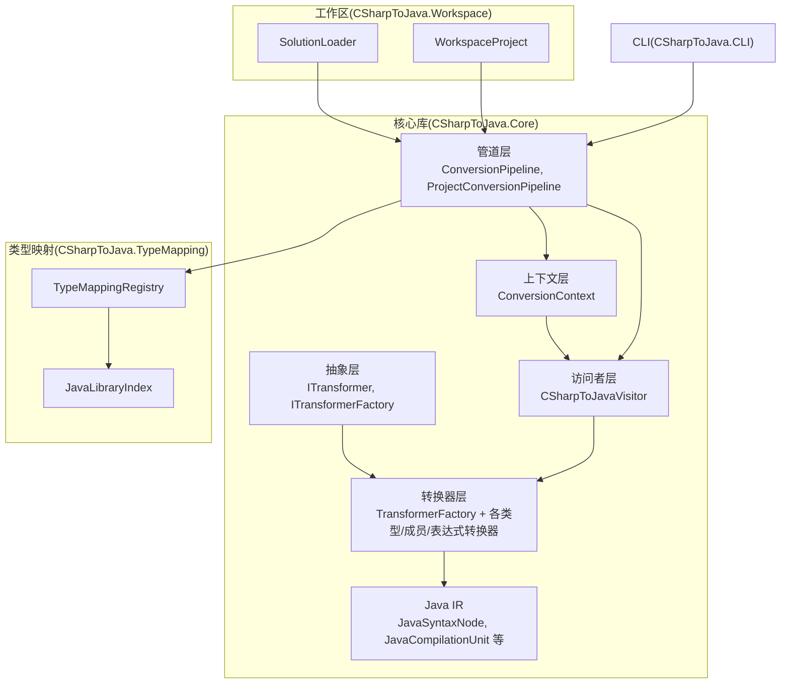
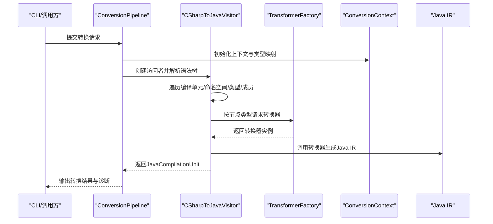
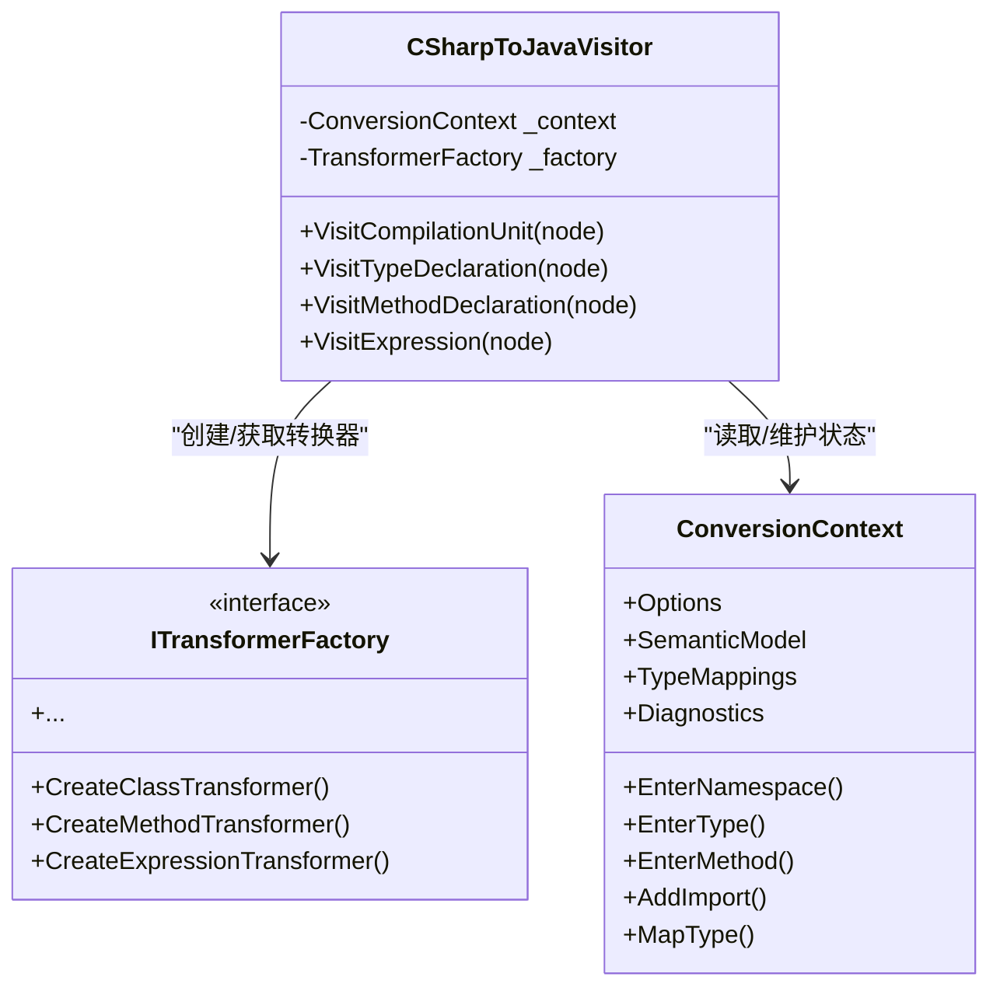
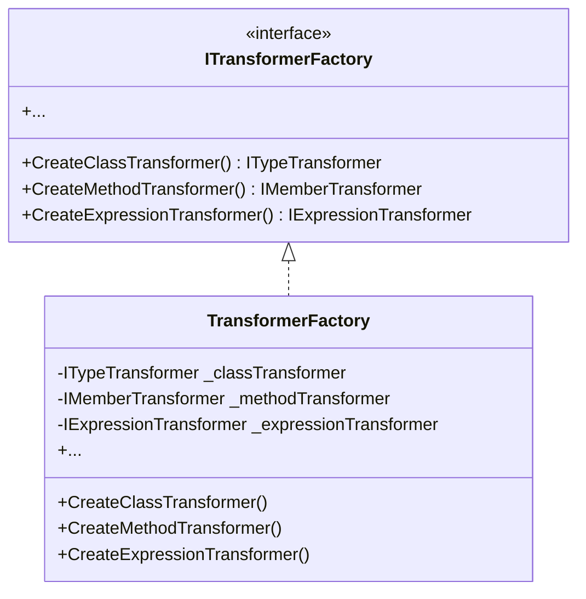
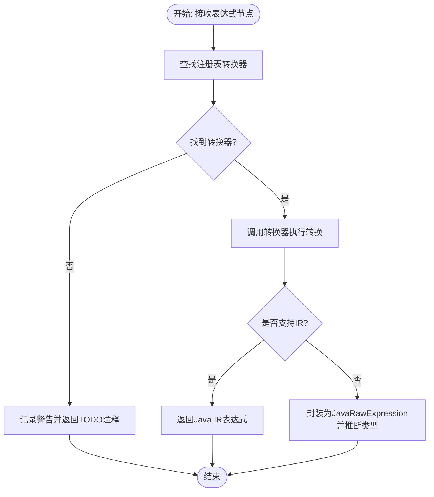
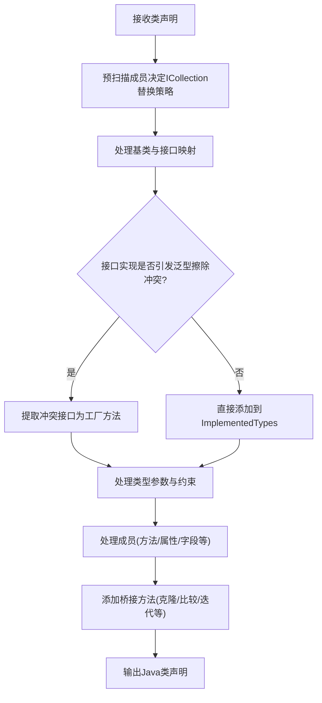
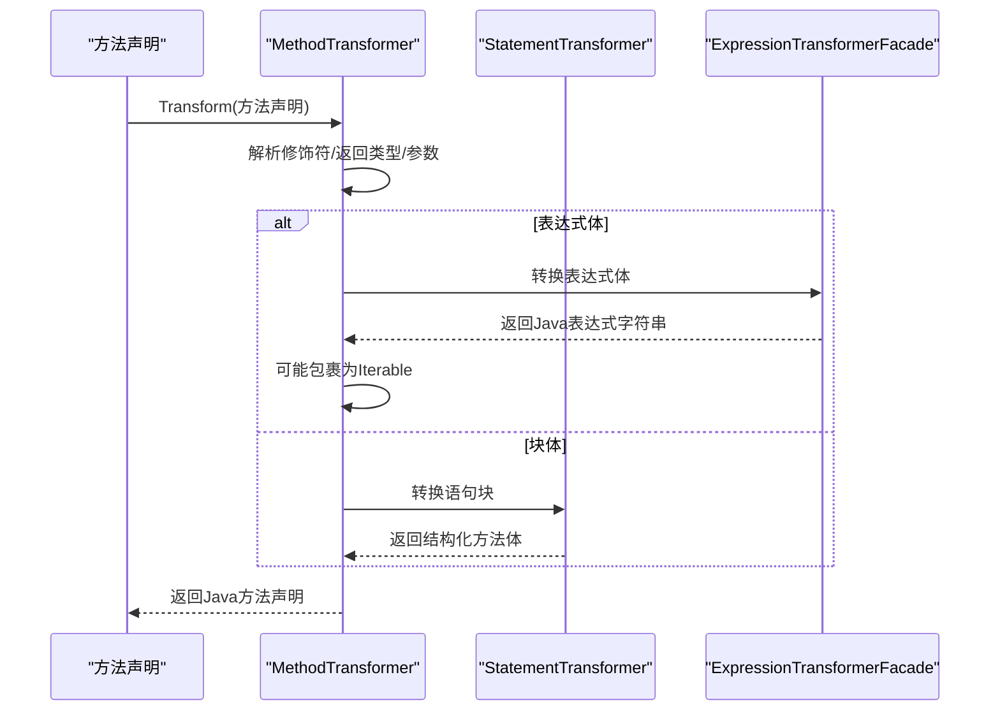
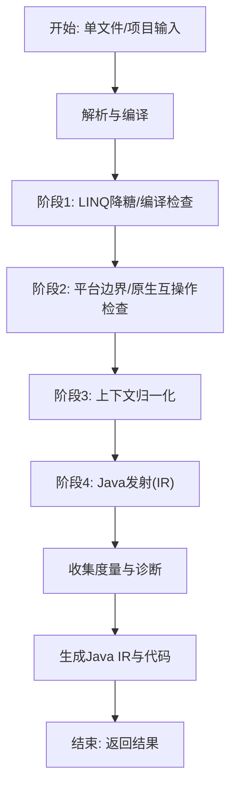
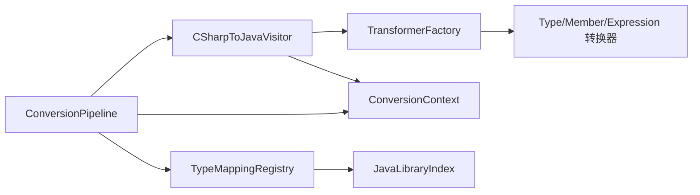

# 核心架构

<cite>
**本文档引用的文件**
- [CSharpToJava.Core.csproj](file://src/CSharpToJava.Core/CSharpToJava.Core.csproj)
- [ITransformer.cs](file://src/CSharpToJava.Core/Abstractions/ITransformer.cs)
- [ITransformerFactory.cs](file://src/CSharpToJava.Core/Abstractions/ITransformerFactory.cs)
- [TransformerFactory.cs](file://src/CSharpToJava.Core/Transformers/TransformerFactory.cs)
- [CSharpToJavaVisitor.cs](file://src/CSharpToJava.Core/Visitors/CSharpToJavaVisitor.cs)
- [ConversionPipeline.cs](file://src/CSharpToJava.Core/Pipeline/ConversionPipeline.cs)
- [ProjectConversionPipeline.cs](file://src/CSharpToJava.Core/Pipeline/ProjectConversionPipeline.cs)
- [ConversionContext.cs](file://src/CSharpToJava.Core/Context/ConversionContext.cs)
- [JavaSyntaxNode.cs](file://src/CSharpToJava.Core/Java/JavaSyntaxNode.cs)
- [JavaCompilationUnit.cs](file://src/CSharpToJava.Core/Java/JavaCompilationUnit.cs)
- [ExpressionTransformerFacade.cs](file://src/CSharpToJava.Core/Transformers/Expression/ExpressionTransformerFacade.cs)
- [ClassTransformer.cs](file://src/CSharpToJava.Core/Transformers/Type/ClassTransformer.cs)
- [MethodTransformer.cs](file://src/CSharpToJava.Core/Transformers/Member/MethodTransformer.cs)
</cite>

## 目录
1. [引言](#引言)
2. [项目结构](#项目结构)
3. [核心组件](#核心组件)
4. [架构总览](#架构总览)
5. [详细组件分析](#详细组件分析)
6. [依赖关系分析](#依赖关系分析)
7. [性能考量](#性能考量)
8. [故障排查指南](#故障排查指南)
9. [结论](#结论)
10. [附录](#附录)

## 引言
本文件面向cs2j（C#到Java）转换器的核心架构，聚焦于高层设计、架构模式与系统边界，系统性阐述转换管道的设计理念与实现方式。重点覆盖以下方面：
- 访问者模式在Roslyn AST遍历中的应用
- 工厂模式在转换器创建中的使用
- 组件交互、数据流与控制流
- 技术决策、权衡与约束条件
- 基础设施要求、可扩展性与部署拓扑
- 性能优化、并发处理与内存管理策略

## 项目结构
cs2j采用分层与职责分离的模块化组织方式：
- 核心库（CSharpToJava.Core）：包含转换抽象、上下文、访问者、转换器、管道与Java IR模型
- 类型映射（CSharpToJava.TypeMapping）：提供C#/Java类型映射注册表与标准库索引
- 工作区（CSharpToJava.Workspace）：提供解决方案加载与项目解析能力
- CLI（CSharpToJava.CLI）：提供命令行工具与多模块规划能力

图表来源
- [CSharpToJava.Core.csproj:1-19](file://src/CSharpToJava.Core/CSharpToJava.Core.csproj#L1-L19)
- [ConversionPipeline.cs:1-443](file://src/CSharpToJava.Core/Pipeline/ConversionPipeline.cs#L1-L443)
- [ProjectConversionPipeline.cs:1-254](file://src/CSharpToJava.Core/Pipeline/ProjectConversionPipeline.cs#L1-L254)

章节来源
- [CSharpToJava.Core.csproj:1-19](file://src/CSharpToJava.Core/CSharpToJava.Core.csproj#L1-L19)
- [ConversionPipeline.cs:1-443](file://src/CSharpToJava.Core/Pipeline/ConversionPipeline.cs#L1-L443)
- [ProjectConversionPipeline.cs:1-254](file://src/CSharpToJava.Core/Pipeline/ProjectConversionPipeline.cs#L1-L254)

## 核心组件
- 转换抽象与接口族
  - ITransformer及其特化接口（表达式、语句、类型、成员、委托、事件等），统一转换契约
  - ITransformerFactory：集中创建与复用转换器实例，支持依赖注入与测试替身
- 访问者与转换器
  - CSharpToJavaVisitor：基于Roslyn CSharpSyntaxVisitor的访问者，驱动转换流程
  - TransformerFactory：单例工厂，按需创建具体转换器实例（均无状态）
  - ExpressionTransformerFacade：表达式转换门面，注册表发现与IR回退
- 上下文与状态
  - ConversionContext：贯穿转换过程的状态容器（命名空间、类型、方法栈、诊断、导入、类型映射服务等）
- 管道与IR
  - ConversionPipeline/ProjectConversionPipeline：单文件与项目级转换流水线，定义阶段与度量
  - JavaCompilationUnit/JavaSyntaxNode：Java侧AST与编译单元，支持IR重写与代码生成

章节来源
- [ITransformer.cs:1-86](file://src/CSharpToJava.Core/Abstractions/ITransformer.cs#L1-L86)
- [ITransformerFactory.cs:1-33](file://src/CSharpToJava.Core/Abstractions/ITransformerFactory.cs#L1-L33)
- [TransformerFactory.cs:1-59](file://src/CSharpToJava.Core/Transformers/TransformerFactory.cs#L1-L59)
- [CSharpToJavaVisitor.cs:1-476](file://src/CSharpToJava.Core/Visitors/CSharpToJavaVisitor.cs#L1-L476)
- [ConversionContext.cs:1-234](file://src/CSharpToJava.Core/Context/ConversionContext.cs#L1-L234)
- [JavaCompilationUnit.cs:1-92](file://src/CSharpToJava.Core/Java/JavaCompilationUnit.cs#L1-L92)
- [JavaSyntaxNode.cs:1-33](file://src/CSharpToJava.Core/Java/JavaSyntaxNode.cs#L1-L33)
- [ExpressionTransformerFacade.cs:1-239](file://src/CSharpToJava.Core/Transformers/Expression/ExpressionTransformerFacade.cs#L1-L239)

## 架构总览
cs2j采用“访问者 + 工厂 + 管道”的混合架构模式：
- 访问者模式：CSharpToJavaVisitor遍历Roslyn语法树，按节点类型委派给对应转换器
- 工厂模式：TransformerFactory集中创建与缓存转换器实例，确保无状态与可共享
- 管道模式：ConversionPipeline/ProjectConversionPipeline将转换划分为若干阶段（Pass），每阶段负责特定检查或转换任务，并产出度量与诊断

图表来源
- [ConversionPipeline.cs:115-221](file://src/CSharpToJava.Core/Pipeline/ConversionPipeline.cs#L115-L221)
- [CSharpToJavaVisitor.cs:29-116](file://src/CSharpToJava.Core/Visitors/CSharpToJavaVisitor.cs#L29-L116)
- [TransformerFactory.cs:16-58](file://src/CSharpToJava.Core/Transformers/TransformerFactory.cs#L16-L58)

章节来源
- [ConversionPipeline.cs:115-221](file://src/CSharpToJava.Core/Pipeline/ConversionPipeline.cs#L115-L221)
- [CSharpToJavaVisitor.cs:29-116](file://src/CSharpToJava.Core/Visitors/CSharpToJavaVisitor.cs#L29-L116)
- [TransformerFactory.cs:16-58](file://src/CSharpToJava.Core/Transformers/TransformerFactory.cs#L16-L58)

## 详细组件分析

### 访问者模式：Roslyn AST遍历与委派
- 入口：CSharpToJavaVisitor继承CSharpSyntaxVisitor<JavaSyntaxNode?>，在VisitCompilationUnit等方法中按节点类型委派
- 委派策略：
  - 类型声明：根据节点种类选择Class/Interface/Struct/Enum/Record转换器
  - 成员声明：方法、属性、字段、构造函数、索引器、事件等分别委派
  - 表达式：通过ExpressionTransformerFacade统一入口，内部注册表发现具体转换器
- 使用者：访问者持有ConversionContext与TransformerFactory，确保上下文与转换器可复用

图表来源
- [CSharpToJavaVisitor.cs:15-476](file://src/CSharpToJava.Core/Visitors/CSharpToJavaVisitor.cs#L15-L476)
- [ITransformerFactory.cs:8-32](file://src/CSharpToJava.Core/Abstractions/ITransformerFactory.cs#L8-L32)
- [ConversionContext.cs:14-234](file://src/CSharpToJava.Core/Context/ConversionContext.cs#L14-L234)

章节来源
- [CSharpToJavaVisitor.cs:29-457](file://src/CSharpToJava.Core/Visitors/CSharpToJavaVisitor.cs#L29-L457)

### 工厂模式：转换器创建与复用
- TransformerFactory采用静态单例缓存各转换器实例，所有转换器均为无状态对象，便于共享与测试
- 通过ITransformerFactory接口抽象，支持替换与依赖注入；同时保留具体工厂用于默认实现

图表来源
- [ITransformerFactory.cs:8-32](file://src/CSharpToJava.Core/Abstractions/ITransformerFactory.cs#L8-L32)
- [TransformerFactory.cs:16-58](file://src/CSharpToJava.Core/Transformers/TransformerFactory.cs#L16-L58)

章节来源
- [TransformerFactory.cs:16-58](file://src/CSharpToJava.Core/Transformers/TransformerFactory.cs#L16-L58)
- [ITransformerFactory.cs:8-32](file://src/CSharpToJava.Core/Abstractions/ITransformerFactory.cs#L8-L32)

### 表达式转换：门面与注册表发现
- ExpressionTransformerFacade作为统一入口，基于节点种类从注册表查找转换器
- 对未注册的表达式类型发出警告并返回TODO注释，避免崩溃
- 支持IR路径（TransformToIR），若底层转换器未实现IR，则回退为JavaRawExpression包裹字符串与推断类型

图表来源
- [ExpressionTransformerFacade.cs:28-86](file://src/CSharpToJava.Core/Transformers/Expression/ExpressionTransformerFacade.cs#L28-L86)

章节来源
- [ExpressionTransformerFacade.cs:28-86](file://src/CSharpToJava.Core/Transformers/Expression/ExpressionTransformerFacade.cs#L28-L86)

### 类型转换：类转换器的桥接与擦除处理
- ClassTransformer负责类声明的完整转换，包括基类、接口、类型参数与约束、成员处理
- 关键特性：
  - 部分类型合并：通过MergedTypeDeclaration与TransformMerged统一处理
  - 泛型擦除冲突检测与提取：当父子类存在相同原始泛型接口不同类型参数时，提取为工厂方法
  - 桥接方法：为Cloneable、Comparable、Iterator、Iterable等添加适配方法
  - ICollection到Iterable的智能替换：仅在类未声明ICollection成员时替换，避免过度简化

图表来源
- [ClassTransformer.cs:21-255](file://src/CSharpToJava.Core/Transformers/Type/ClassTransformer.cs#L21-L255)

章节来源
- [ClassTransformer.cs:21-255](file://src/CSharpToJava.Core/Transformers/Type/ClassTransformer.cs#L21-L255)

### 成员转换：方法转换器的默认参数与yield处理
- MethodTransformer负责方法声明转换，处理修饰符、返回类型、参数、异常、体与表达式体
- 关键特性：
  - 默认参数：在Java中通过重载生成“省略尾部参数”的方法，但抽象方法不生成重载
  - yield返回：转换为List/Iterator累积模式，并在必要时推断匿名记录元素类型
  - 异步方法：Task<T>映射为CompletableFuture<T>
  - 扩展方法：可选择降级为静态方法（移除this参数）

图表来源
- [MethodTransformer.cs:18-324](file://src/CSharpToJava.Core/Transformers/Member/MethodTransformer.cs#L18-L324)

章节来源
- [MethodTransformer.cs:18-324](file://src/CSharpToJava.Core/Transformers/Member/MethodTransformer.cs#L18-L324)

### 管道与阶段：单文件与项目级转换
- 单文件管道（ConversionPipeline）
  - 解析与编译：构建CSharpSyntaxTree与CSharpCompilation，注入全局using树
  - 阶段执行：LINQ降糖、编译检查、平台边界检查、上下文归一化、Java发射
  - 结果：生成Java IR与字符串代码，附带诊断与度量
- 项目管道（ProjectConversionPipeline）
  - 支持多文件合并与跨文件语义分析
  - 额外阶段：扩展方法检查、部分类型归一化、兼容性发射、跨包导入与模块依赖分析

图表来源
- [ConversionPipeline.cs:376-388](file://src/CSharpToJava.Core/Pipeline/ConversionPipeline.cs#L376-L388)
- [ProjectConversionPipeline.cs:124-141](file://src/CSharpToJava.Core/Pipeline/ProjectConversionPipeline.cs#L124-L141)

章节来源
- [ConversionPipeline.cs:115-221](file://src/CSharpToJava.Core/Pipeline/ConversionPipeline.cs#L115-L221)
- [ProjectConversionPipeline.cs:152-230](file://src/CSharpToJava.Core/Pipeline/ProjectConversionPipeline.cs#L152-L230)

## 依赖关系分析
- 内部依赖
  - 访问者依赖工厂与上下文；工厂依赖各类转换器；转换器依赖上下文与类型映射
  - 管道依赖访问者、上下文与类型映射注册表
- 外部依赖
  - Microsoft.CodeAnalysis.CSharp：Roslyn解析与语义模型
  - System.Text.Json：配置与元数据序列化
  - Java标准库索引：通过TypeMappingRegistry与JavaLibraryIndex注入

图表来源
- [CSharpToJavaVisitor.cs:18-24](file://src/CSharpToJava.Core/Visitors/CSharpToJavaVisitor.cs#L18-L24)
- [TransformerFactory.cs:16-58](file://src/CSharpToJava.Core/Transformers/TransformerFactory.cs#L16-L58)
- [ConversionPipeline.cs:117-136](file://src/CSharpToJava.Core/Pipeline/ConversionPipeline.cs#L117-L136)

章节来源
- [CSharpToJava.Core.csproj:10-16](file://src/CSharpToJava.Core/CSharpToJava.Core.csproj#L10-L16)
- [ConversionPipeline.cs:117-136](file://src/CSharpToJava.Core/Pipeline/ConversionPipeline.cs#L117-L136)

## 性能考量
- 访问者与工厂的无状态设计：转换器实例可复用，减少GC压力
- 表达式转换门面的延迟与回退：避免未覆盖节点抛异常，降低早期失败成本
- 项目级转换的跨文件语义：通过完整编译模型提升类型解析准确性，但增加内存占用
- IR重写与代码生成：先构建IR再生成字符串，便于跨阶段优化与去重导入
- 并发与部署建议
  - 单文件转换：串行即可满足大多数场景
  - 项目转换：可并行处理多个文件，但需注意跨文件依赖与一致性
  - 建议：限制同时活跃的转换任务数量，结合内存上限与垃圾回收策略

## 故障排查指南
- 诊断收集
  - ConversionContext.Diagnostics：统一记录警告与错误
  - ConversionResult.Diagnostics：返回给调用方
- 常见问题
  - 未覆盖的表达式/语法节点：查看TODO注释与警告消息
  - 类型映射失败：检查TypeMappingConfig与JavaLibraryIndex配置
  - 泛型擦除冲突：观察桥接方法生成与工厂方法提取
  - 项目级扩展方法：在多项目模式禁用RewriteExtensionMethods并接受静态调用
- 定位步骤
  - 从ConversionPipeline/ProjectConversionPipeline的阶段日志入手
  - 检查ExpressionTransformerFacade的注册表命中情况
  - 核对JavaCompilationUnit的导入去重与包名映射

章节来源
- [ConversionContext.cs:23-234](file://src/CSharpToJava.Core/Context/ConversionContext.cs#L23-L234)
- [ConversionPipeline.cs:390-420](file://src/CSharpToJava.Core/Pipeline/ConversionPipeline.cs#L390-L420)
- [ExpressionTransformerFacade.cs:33-36](file://src/CSharpToJava.Core/Transformers/Expression/ExpressionTransformerFacade.cs#L33-L36)

## 结论
cs2j以访问者与工厂为核心，结合阶段化的管道设计，实现了从C#到Java的高保真转换。通过无状态转换器与IR中间表示，系统具备良好的可扩展性与可维护性；通过类型映射与语义模型，保证了跨语言差异的正确处理。建议在生产环境中配合严格的配置与可观测性，以获得稳定可靠的转换体验。

## 附录
- 基础设施要求
  - .NET 10运行时
  - 可选：Java标准库元数据目录（用于更精确的类型映射）
- 部署拓扑
  - 单机CLI：适合本地开发与小规模转换
  - 服务化：将ConversionPipeline封装为服务，支持并发与队列
  - CI集成：在流水线中执行转换与验证，结合测试框架（JUnit/Jupiter）