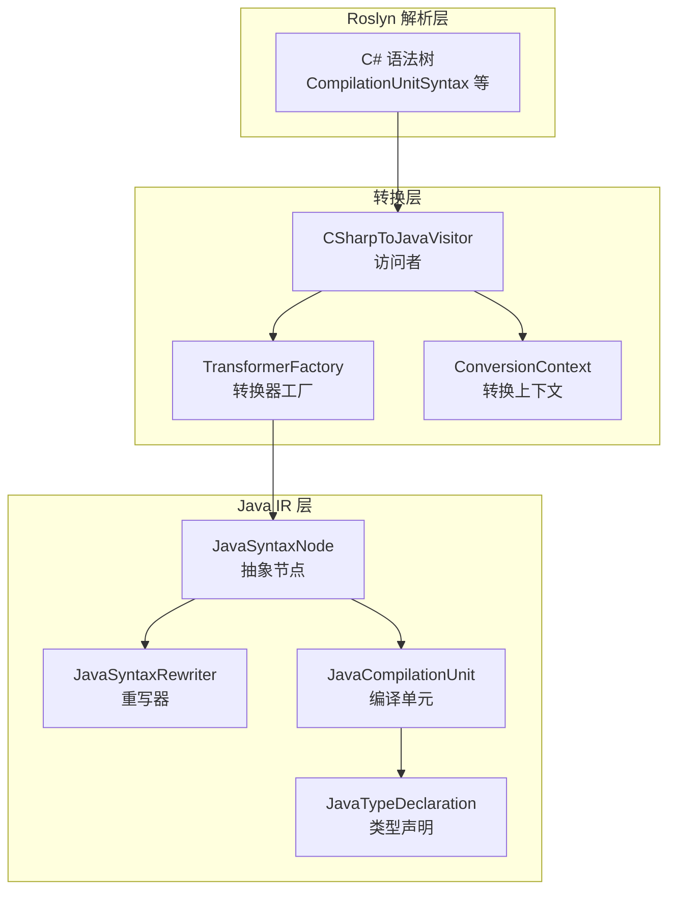
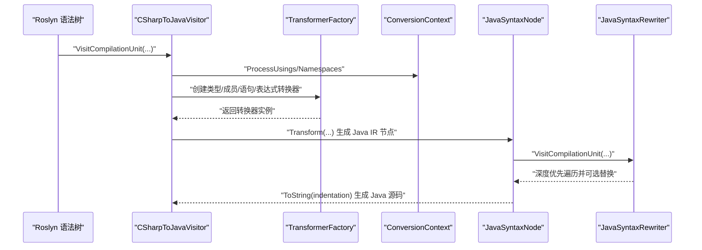
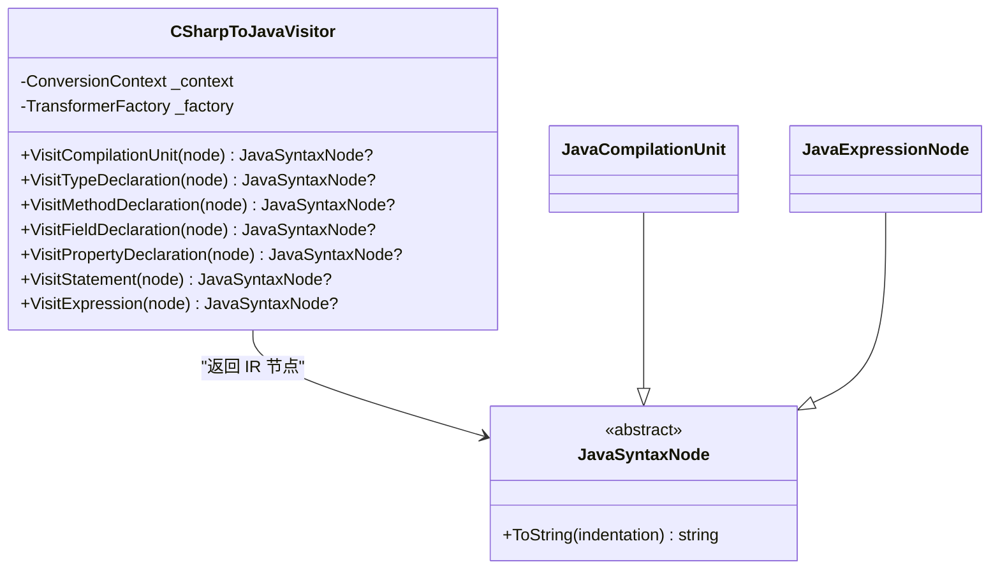
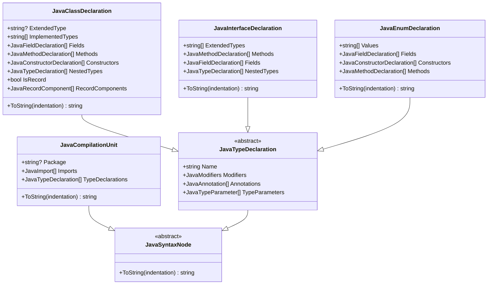
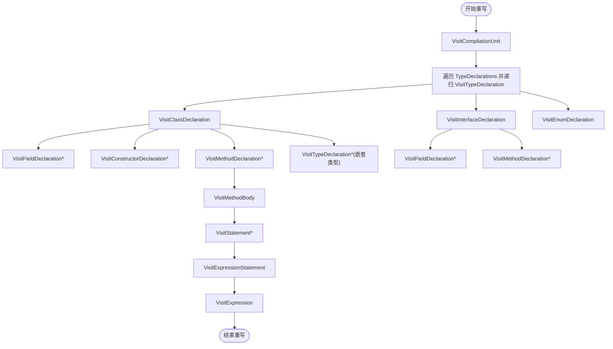
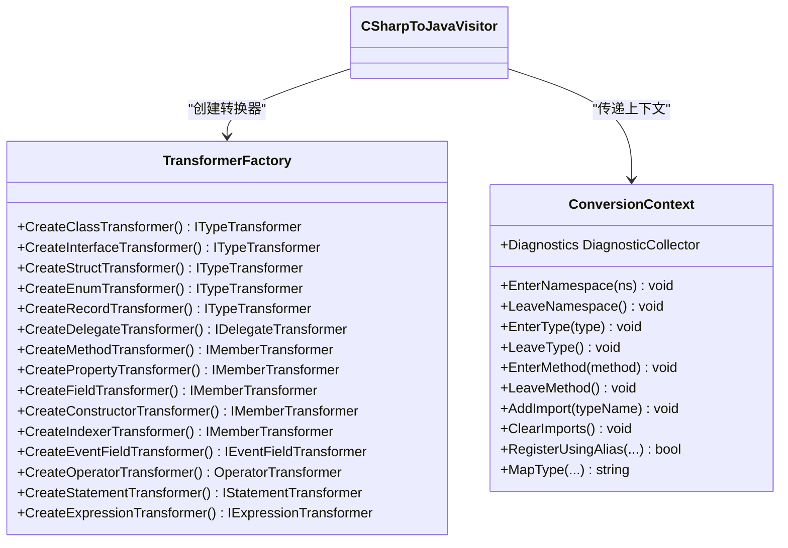
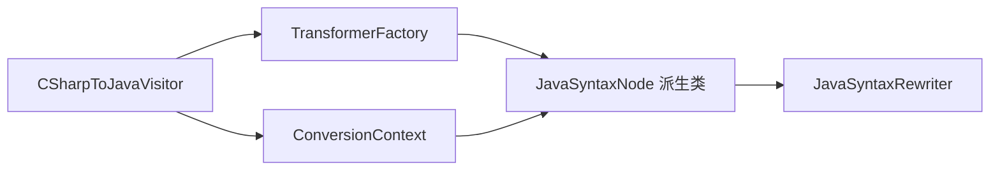

# 访问者模式实现

<cite>
**本文档引用的文件**
- [CSharpToJavaVisitor.cs](file://src/CSharpToJava.Core/Visitors/CSharpToJavaVisitor.cs)
- [JavaSyntaxNode.cs](file://src/CSharpToJava.Core/Java/JavaSyntaxNode.cs)
- [JavaSyntaxRewriter.cs](file://src/CSharpToJava.Core/Java/JavaSyntaxRewriter.cs)
- [JavaCompilationUnit.cs](file://src/CSharpToJava.Core/Java/JavaCompilationUnit.cs)
- [JavaTypeDeclaration.cs](file://src/CSharpToJava.Core/Java/JavaTypeDeclaration.cs)
- [ConversionContext.cs](file://src/CSharpToJava.Core/Context/ConversionContext.cs)
- [TransformerFactory.cs](file://src/CSharpToJava.Core/Transformers/TransformerFactory.cs)
</cite>

## 目录
1. [引言](#引言)
2. [项目结构](#项目结构)
3. [核心组件](#核心组件)
4. [架构概览](#架构概览)
5. [详细组件分析](#详细组件分析)
6. [依赖关系分析](#依赖关系分析)
7. [性能考虑](#性能考虑)
8. [故障排查指南](#故障排查指南)
9. [结论](#结论)

## 引言
本文件系统性阐述 cs2j 中基于 Roslyn 的 C# 到 Java 转换中访问者模式的实现与设计。重点解析 CSharpToJavaVisitor 如何遍历 Roslyn 语法树，结合语义分析与转换器工厂完成节点访问策略、属性提取、上下文传递与转换结果生成；同时说明 JavaSyntaxNode 与 JavaSyntaxRewriter 的设计模式，展示如何通过访问者模式实现代码生成的解耦与扩展，并提供具体用法示例与性能优化建议。

## 项目结构
cs2j 的转换管线围绕访问者模式展开：CSharpToJavaVisitor 作为 Roslyn 语法访问者，负责遍历 C# 语法树并委派给各类转换器生成 Java IR（中间表示）节点；JavaSyntaxNode/JavaSyntaxRewriter 提供 Java IR 的节点模型与重写机制，支持对 Java AST 进行变换与扩展。

**图表来源**
- [CSharpToJavaVisitor.cs:15-476](file://src/CSharpToJava.Core/Visitors/CSharpToJavaVisitor.cs#L15-L476)
- [TransformerFactory.cs:16-58](file://src/CSharpToJava.Core/Transformers/TransformerFactory.cs#L16-L58)
- [ConversionContext.cs:14-234](file://src/CSharpToJava.Core/Context/ConversionContext.cs#L14-L234)
- [JavaSyntaxNode.cs:6-32](file://src/CSharpToJava.Core/Java/JavaSyntaxNode.cs#L6-L32)
- [JavaSyntaxRewriter.cs:8-375](file://src/CSharpToJava.Core/Java/JavaSyntaxRewriter.cs#L8-L375)
- [JavaCompilationUnit.cs:8-92](file://src/CSharpToJava.Core/Java/JavaCompilationUnit.cs#L8-L92)
- [JavaTypeDeclaration.cs:8-383](file://src/CSharpToJava.Core/Java/JavaTypeDeclaration.cs#L8-L383)

**章节来源**
- [CSharpToJavaVisitor.cs:15-476](file://src/CSharpToJava.Core/Visitors/CSharpToJavaVisitor.cs#L15-L476)
- [JavaSyntaxNode.cs:6-32](file://src/CSharpToJava.Core/Java/JavaSyntaxNode.cs#L6-L32)
- [JavaSyntaxRewriter.cs:8-375](file://src/CSharpToJava.Core/Java/JavaSyntaxRewriter.cs#L8-L375)
- [JavaCompilationUnit.cs:8-92](file://src/CSharpToJava.Core/Java/JavaCompilationUnit.cs#L8-L92)
- [JavaTypeDeclaration.cs:8-383](file://src/CSharpToJava.Core/Java/JavaTypeDeclaration.cs#L8-L383)
- [ConversionContext.cs:14-234](file://src/CSharpToJava.Core/Context/ConversionContext.cs#L14-L234)
- [TransformerFactory.cs:16-58](file://src/CSharpToJava.Core/Transformers/TransformerFactory.cs#L16-L58)

## 核心组件
- CSharpToJavaVisitor：继承 Roslyn 的 CSharpSyntaxVisitor 并以 JavaSyntaxNode 为返回类型，统一处理 C# 语法节点到 Java IR 的转换。
- JavaSyntaxNode 及其派生类：JavaCompilationUnit、JavaTypeDeclaration 等，构成 Java IR 的节点模型。
- JavaSyntaxRewriter：深度优先遍历 Java IR 节点，支持按需替换节点，是 Java AST 变换的核心。
- ConversionContext：贯穿转换流程的状态容器，提供命名空间栈、类型映射、诊断收集、导入管理、别名注册等能力。
- TransformerFactory：集中管理各类转换器实例，采用静态单例避免重复创建，提升性能与一致性。

**章节来源**
- [CSharpToJavaVisitor.cs:15-476](file://src/CSharpToJava.Core/Visitors/CSharpToJavaVisitor.cs#L15-L476)
- [JavaSyntaxNode.cs:6-32](file://src/CSharpToJava.Core/Java/JavaSyntaxNode.cs#L6-L32)
- [JavaSyntaxRewriter.cs:8-375](file://src/CSharpToJava.Core/Java/JavaSyntaxRewriter.cs#L8-L375)
- [JavaCompilationUnit.cs:8-92](file://src/CSharpToJava.Core/Java/JavaCompilationUnit.cs#L8-L92)
- [JavaTypeDeclaration.cs:8-383](file://src/CSharpToJava.Core/Java/JavaTypeDeclaration.cs#L8-L383)
- [ConversionContext.cs:14-234](file://src/CSharpToJava.Core/Context/ConversionContext.cs#L14-L234)
- [TransformerFactory.cs:16-58](file://src/CSharpToJava.Core/Transformers/TransformerFactory.cs#L16-L58)

## 架构概览
访问者模式在 cs2j 中分两阶段实现：
- 第一阶段（C# → Java IR）：CSharpToJavaVisitor 遍历 Roslyn 语法树，依据节点类型选择对应转换器，生成 JavaSyntaxNode 实例，填充 CompilationUnit、TypeDeclaration、Method、Field 等节点。
- 第二阶段（Java IR → Java 代码）：JavaSyntaxRewriter 对 Java IR 进行遍历与可选重写，最终由 JavaSyntaxNode 的 ToString 输出生成 Java 源码。

**图表来源**
- [CSharpToJavaVisitor.cs:29-116](file://src/CSharpToJava.Core/Visitors/CSharpToJavaVisitor.cs#L29-L116)
- [TransformerFactory.cs:36-58](file://src/CSharpToJava.Core/Transformers/TransformerFactory.cs#L36-L58)
- [JavaSyntaxRewriter.cs:12-19](file://src/CSharpToJava.Core/Java/JavaSyntaxRewriter.cs#L12-L19)
- [JavaSyntaxNode.cs:8-9](file://src/CSharpToJava.Core/Java/JavaSyntaxNode.cs#L8-L9)

**章节来源**
- [CSharpToJavaVisitor.cs:29-116](file://src/CSharpToJava.Core/Visitors/CSharpToJavaVisitor.cs#L29-L116)
- [JavaSyntaxRewriter.cs:12-19](file://src/CSharpToJava.Core/Java/JavaSyntaxRewriter.cs#L12-L19)

## 详细组件分析

### CSharpToJavaVisitor：语法访问与转换委派
- 继承关系与职责
  - 继承 Roslyn 的 CSharpSyntaxVisitor，并以 JavaSyntaxNode 为返回类型，确保所有访问方法都产出 Java IR 节点。
  - 通过 TransformerFactory 按节点类型动态选择转换器，实现“按类型分发”的访问策略。
- 关键访问方法
  - VisitCompilationUnit：处理 using、命名空间、顶层类型与委托声明，构建 JavaCompilationUnit 并注入导入与合成记录。
  - VisitTypeDeclaration：根据节点种类（类、接口、结构体、枚举、记录）委派至相应类型转换器。
  - VisitMethodDeclaration/VisitFieldDeclaration/VisitPropertyDeclaration：委派成员转换器。
  - VisitStatement/VisitExpression：委派语句与表达式转换器；表达式转换后封装为 JavaExpressionNode。
- 上下文与语义集成
  - 使用 ConversionContext 进行命名空间切换、别名注册、类型映射、导入收集与诊断记录。
  - 在 using 别名解析中调用语义模型获取符号信息，保证别名目标类型正确映射。
- 转换决策
  - 对不支持的节点类型发出警告并跳过。
  - 对枚举声明单独处理，因为 Roslyn 中 EnumDeclarationSyntax 不属于 TypeDeclarationSyntax。

**图表来源**
- [CSharpToJavaVisitor.cs:15-476](file://src/CSharpToJava.Core/Visitors/CSharpToJavaVisitor.cs#L15-L476)
- [JavaSyntaxNode.cs:6-32](file://src/CSharpToJava.Core/Java/JavaSyntaxNode.cs#L6-L32)
- [JavaCompilationUnit.cs:8-92](file://src/CSharpToJava.Core/Java/JavaCompilationUnit.cs#L8-L92)

**章节来源**
- [CSharpToJavaVisitor.cs:29-116](file://src/CSharpToJava.Core/Visitors/CSharpToJavaVisitor.cs#L29-L116)
- [CSharpToJavaVisitor.cs:339-456](file://src/CSharpToJava.Core/Visitors/CSharpToJavaVisitor.cs#L339-L456)

### JavaSyntaxNode 与 Java IR 节点族
- 抽象基类与集合包装
  - JavaSyntaxNode 定义 ToString(indentation) 抽象方法，统一 IR 节点的代码生成接口。
  - JavaMemberCollection 用于包装多个成员节点，便于批量输出。
- 编译单元与导入
  - JavaCompilationUnit 维护包名、导入列表与类型声明集合，并在 ToString 中进行 JDK 导入去重与格式化。
- 类型声明家族
  - JavaTypeDeclaration 为抽象基类，包含修饰符、注解、类型参数等通用属性。
  - JavaClassDeclaration/JavaInterfaceDeclaration/JavaEnumDeclaration 分别实现类、接口、枚举的输出逻辑，含字段、方法、构造函数、嵌套类型等。

**图表来源**
- [JavaSyntaxNode.cs:6-32](file://src/CSharpToJava.Core/Java/JavaSyntaxNode.cs#L6-L32)
- [JavaCompilationUnit.cs:8-92](file://src/CSharpToJava.Core/Java/JavaCompilationUnit.cs#L8-L92)
- [JavaTypeDeclaration.cs:8-383](file://src/CSharpToJava.Core/Java/JavaTypeDeclaration.cs#L8-L383)

**章节来源**
- [JavaSyntaxNode.cs:6-32](file://src/CSharpToJava.Core/Java/JavaSyntaxNode.cs#L6-L32)
- [JavaCompilationUnit.cs:8-92](file://src/CSharpToJava.Core/Java/JavaCompilationUnit.cs#L8-L92)
- [JavaTypeDeclaration.cs:8-383](file://src/CSharpToJava.Core/Java/JavaTypeDeclaration.cs#L8-L383)

### JavaSyntaxRewriter：IR 遍历与可选替换
- 设计要点
  - 深度优先遍历 Java IR 节点，默认返回原节点，子类可通过覆盖 Visit* 方法实现节点替换或增强。
  - 支持编译单元、类型声明（类/接口/枚举）、成员（字段/方法/构造函数）、方法体、语句、表达式等全量节点类型。
- 典型用途
  - 在生成 Java 代码前对 IR 进行二次加工（如插入注释、调整修饰符、规范化表达式等）。
  - 作为扩展点，允许用户自定义重写规则，实现特定的代码风格或兼容性处理。

**图表来源**
- [JavaSyntaxRewriter.cs:12-375](file://src/CSharpToJava.Core/Java/JavaSyntaxRewriter.cs#L12-L375)

**章节来源**
- [JavaSyntaxRewriter.cs:8-375](file://src/CSharpToJava.Core/Java/JavaSyntaxRewriter.cs#L8-L375)

### 转换器工厂与上下文传递
- TransformerFactory
  - 静态单例持有各类型转换器实例，避免重复创建，降低内存与 GC 压力。
  - 按节点类型返回对应转换器，实现“访问策略”与“转换实现”的解耦。
- ConversionContext
  - 维护命名空间栈、当前类型/方法、异步/lambda/yield 等上下文标记。
  - 提供类型映射、导入管理、别名注册、诊断收集、部分类型合并存储等能力，贯穿转换全流程。

**图表来源**
- [TransformerFactory.cs:16-58](file://src/CSharpToJava.Core/Transformers/TransformerFactory.cs#L16-L58)
- [ConversionContext.cs:14-234](file://src/CSharpToJava.Core/Context/ConversionContext.cs#L14-L234)
- [CSharpToJavaVisitor.cs:17-24](file://src/CSharpToJava.Core/Visitors/CSharpToJavaVisitor.cs#L17-L24)

**章节来源**
- [TransformerFactory.cs:16-58](file://src/CSharpToJava.Core/Transformers/TransformerFactory.cs#L16-L58)
- [ConversionContext.cs:14-234](file://src/CSharpToJava.Core/Context/ConversionContext.cs#L14-L234)

## 依赖关系分析
- 访问者与转换器
  - CSharpToJavaVisitor 依赖 TransformerFactory 以获得类型/成员/语句/表达式转换器。
  - 转换器通过 ConversionContext 获取语义信息、类型映射与导入集合。
- IR 节点与重写器
  - JavaSyntaxNode 作为 IR 节点基类，被 JavaSyntaxRewriter 深度遍历。
  - JavaCompilationUnit/JavaTypeDeclaration 等具体节点实现 ToString，承担最终代码生成职责。
- 语义与类型映射
  - ConversionContext 将 Roslyn 语义模型与类型映射服务整合，为访问者提供准确的符号解析与类型名称映射。

**图表来源**
- [CSharpToJavaVisitor.cs:15-476](file://src/CSharpToJava.Core/Visitors/CSharpToJavaVisitor.cs#L15-L476)
- [TransformerFactory.cs:16-58](file://src/CSharpToJava.Core/Transformers/TransformerFactory.cs#L16-L58)
- [ConversionContext.cs:14-234](file://src/CSharpToJava.Core/Context/ConversionContext.cs#L14-L234)
- [JavaSyntaxNode.cs:6-32](file://src/CSharpToJava.Core/Java/JavaSyntaxNode.cs#L6-L32)
- [JavaSyntaxRewriter.cs:8-375](file://src/CSharpToJava.Core/Java/JavaSyntaxRewriter.cs#L8-L375)

**章节来源**
- [CSharpToJavaVisitor.cs:15-476](file://src/CSharpToJava.Core/Visitors/CSharpToJavaVisitor.cs#L15-L476)
- [TransformerFactory.cs:16-58](file://src/CSharpToJava.Core/Transformers/TransformerFactory.cs#L16-L58)
- [ConversionContext.cs:14-234](file://src/CSharpToJava.Core/Context/ConversionContext.cs#L14-L234)
- [JavaSyntaxNode.cs:6-32](file://src/CSharpToJava.Core/Java/JavaSyntaxNode.cs#L6-L32)
- [JavaSyntaxRewriter.cs:8-375](file://src/CSharpToJava.Core/Java/JavaSyntaxRewriter.cs#L8-L375)

## 性能考虑
- 访问策略与工厂复用
  - 使用静态单例的 TransformerFactory 减少对象分配与 GC 压力，适合大规模文件转换场景。
- 深度优先遍历与惰性生成
  - JavaSyntaxRewriter 默认返回原节点，仅在覆盖方法中进行必要替换，避免不必要的复制与开销。
- 导入去重与缓存
  - JavaCompilationUnit 在 ToString 中对 JDK 包进行通配导入去重，减少冗余 import，提高生成代码可读性与编译效率。
- 上下文状态管理
  - ConversionContext 通过栈结构维护命名空间与类型/方法上下文，避免全局状态污染，提升并发安全性。

[本节为通用性能讨论，无需列出具体文件来源]

## 故障排查指南
- 使用别名解析失败
  - 症状：using 别名无法解析为类型，出现警告或错误。
  - 排查：确认语义模型可用且别名目标为 ITypeSymbol；检查别名注册与类型映射缓存。
  - 参考位置：[别名解析与注册:180-249](file://src/CSharpToJava.Core/Visitors/CSharpToJavaVisitor.cs#L180-L249)，[别名注册与解析:213-224](file://src/CSharpToJava.Core/Context/ConversionContext.cs#L213-L224)
- 不支持的类型声明
  - 症状：某些 C# 类型声明未被转换，访问者发出警告。
  - 排查：确认节点种类是否在 VisitTypeDeclaration 的分发逻辑中覆盖。
  - 参考位置：[类型声明访问:339-359](file://src/CSharpToJava.Core/Visitors/CSharpToJavaVisitor.cs#L339-L359)
- 导入重复或缺失
  - 症状：生成的 Java 文件存在冗余 import 或编译报错找不到类型。
  - 排查：检查 ConversionContext.ImportedTypes 与 JavaCompilationUnit 的导入去重逻辑。
  - 参考位置：[导入去重与生成:33-48](file://src/CSharpToJava.Core/Java/JavaCompilationUnit.cs#L33-L48)，[导入管理:167-187](file://src/CSharpToJava.Core/Context/ConversionContext.cs#L167-L187)

**章节来源**
- [CSharpToJavaVisitor.cs:180-249](file://src/CSharpToJava.Core/Visitors/CSharpToJavaVisitor.cs#L180-L249)
- [ConversionContext.cs:167-187](file://src/CSharpToJava.Core/Context/ConversionContext.cs#L167-L187)
- [JavaCompilationUnit.cs:33-48](file://src/CSharpToJava.Core/Java/JavaCompilationUnit.cs#L33-L48)

## 结论
cs2j 的访问者模式实现通过 CSharpToJavaVisitor 将 Roslyn 语法树与 Java IR 解耦，借助 TransformerFactory 与 ConversionContext 实现灵活的节点访问与上下文传递；JavaSyntaxNode/JavaSyntaxRewriter 则提供了清晰的 IR 模型与可扩展的重写机制。该设计既保证了转换逻辑的模块化与可维护性，又为后续扩展（如自定义重写规则、新节点类型支持）提供了稳定基础。