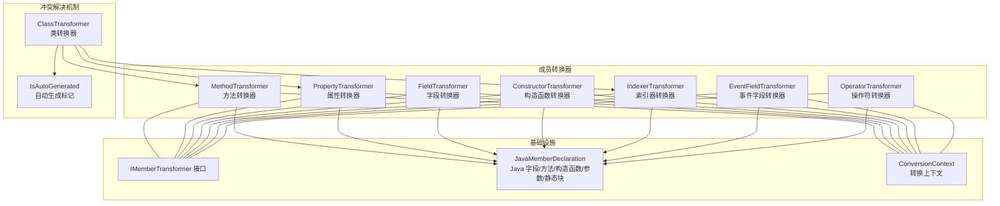
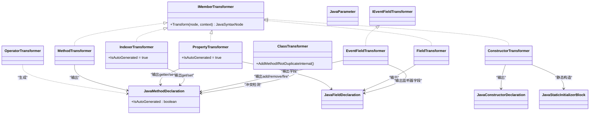
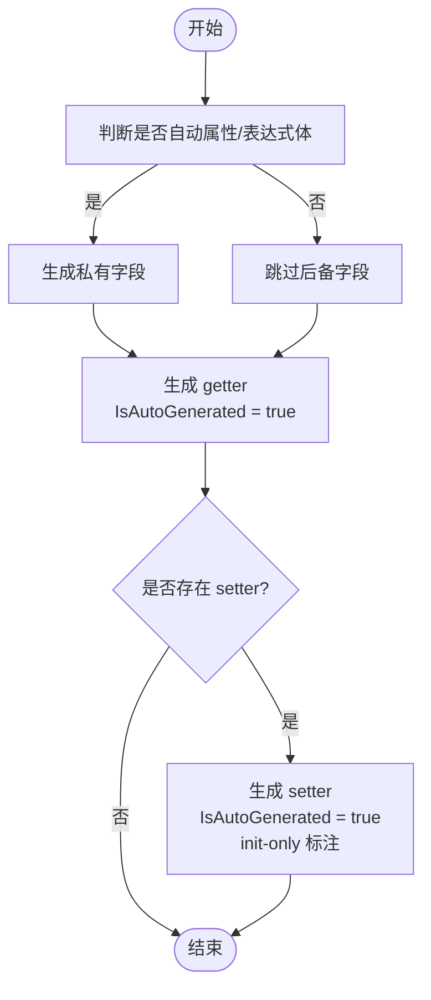
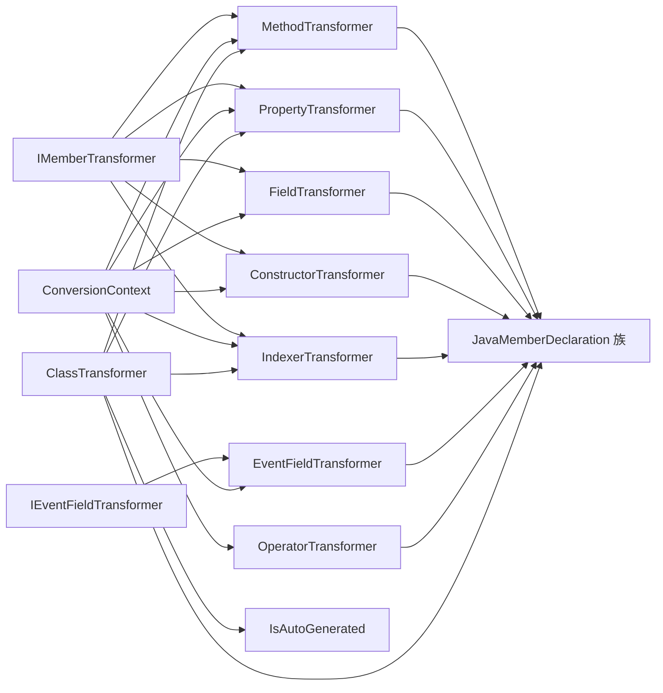

# 成员转换器

<cite>
**本文档引用的文件**
- [MethodTransformer.cs](file://src/CSharpToJava.Core/Transformers/Member/MethodTransformer.cs)
- [PropertyTransformer.cs](file://src/CSharpToJava.Core/Transformers/Member/PropertyTransformer.cs)
- [FieldTransformer.cs](file://src/CSharpToJava.Core/Transformers/Member/FieldTransformer.cs)
- [ConstructorTransformer.cs](file://src/CSharpToJava.Core/Transformers/Member/ConstructorTransformer.cs)
- [IndexerTransformer.cs](file://src/CSharpToJava.Core/Transformers/Member/IndexerTransformer.cs)
- [EventFieldTransformer.cs](file://src/CSharpToJava.Core/Transformers/Member/EventFieldTransformer.cs)
- [OperatorTransformer.cs](file://src/CSharpToJava.Core/Transformers/Member/OperatorTransformer.cs)
- [JavaMemberDeclaration.cs](file://src/CSharpToJava.Core/Java/JavaMemberDeclaration.cs)
- [ITransformer.cs](file://src/CSharpToJava.Core/Abstractions/ITransformer.cs)
- [ConversionContext.cs](file://src/CSharpToJava.Core/Context/ConversionContext.cs)
- [ClassTransformer.cs](file://src/CSharpToJava.Core/Transformers/Type/ClassTransformer.cs)
- [MethodPropertyNameCollisionTests.cs](file://tests/CSharpToJava.Tests/MethodPropertyNameCollisionTests.cs)
</cite>

## 更新摘要
**变更内容**
- 新增方法-属性名称冲突解决机制
- 为JavaMethodDeclaration添加IsAutoGenerated属性
- 属性转换器和索引器转换器现在标记自动生成的方法为IsAutoGenerated=true
- 类转换器实现了冲突检测和重命名逻辑
- 新增测试用例验证冲突解决机制

## 目录
1. [简介](#简介)
2. [项目结构](#项目结构)
3. [核心组件](#核心组件)
4. [架构总览](#架构总览)
5. [详细组件分析](#详细组件分析)
6. [依赖关系分析](#依赖关系分析)
7. [性能考量](#性能考量)
8. [故障排查指南](#故障排查指南)
9. [结论](#结论)

## 简介
本文件面向 cs2j 的"成员转换器"体系，系统性阐述各类成员（方法、属性、字段、构造函数、索引器、事件字段、操作符）的转换策略与实现细节。重点覆盖：
- 访问修饰符映射与默认访问级别处理
- 成员签名转换（参数、返回类型、泛型、异常）
- 特殊成员处理（属性 getter/setter、事件 add/remove、操作符重载）
- 复杂成员场景（重载、虚/抽象、静态、yield、表达式体、扩展方法等）
- **新增**：方法-属性名称冲突解决机制与IsAutoGenerated属性

## 项目结构
成员转换器位于核心库的成员转换子模块，统一实现 IMemberTransformer 接口，并通过转换上下文与类型映射协作完成转换。

**图表来源**
- [MethodTransformer.cs](file://src/CSharpToJava.Core/Transformers/Member/MethodTransformer.cs)
- [PropertyTransformer.cs](file://src/CSharpToJava.Core/Transformers/Member/PropertyTransformer.cs)
- [IndexerTransformer.cs](file://src/CSharpToJava.Core/Transformers/Member/IndexerTransformer.cs)
- [JavaMemberDeclaration.cs](file://src/CSharpToJava.Core/Java/JavaMemberDeclaration.cs)
- [ClassTransformer.cs](file://src/CSharpToJava.Core/Transformers/Type/ClassTransformer.cs)

**章节来源**
- [MethodTransformer.cs](file://src/CSharpToJava.Core/Transformers/Member/MethodTransformer.cs)
- [PropertyTransformer.cs](file://src/CSharpToJava.Core/Transformers/Member/PropertyTransformer.cs)
- [FieldTransformer.cs](file://src/CSharpToJava.Core/Transformers/Member/FieldTransformer.cs)
- [ConstructorTransformer.cs](file://src/CSharpToJava.Core/Transformers/Member/ConstructorTransformer.cs)
- [IndexerTransformer.cs](file://src/CSharpToJava.Core/Transformers/Member/IndexerTransformer.cs)
- [EventFieldTransformer.cs](file://src/CSharpToJava.Core/Transformers/Member/EventFieldTransformer.cs)
- [OperatorTransformer.cs](file://src/CSharpToJava.Core/Transformers/Member/OperatorTransformer.cs)
- [JavaMemberDeclaration.cs](file://src/CSharpToJava.Core/Java/JavaMemberDeclaration.cs)
- [ITransformer.cs](file://src/CSharpToJava.Core/Abstractions/ITransformer.cs)
- [ConversionContext.cs](file://src/CSharpToJava.Core/Context/ConversionContext.cs)
- [ClassTransformer.cs](file://src/CSharpToJava.Core/Transformers/Type/ClassTransformer.cs)

## 核心组件
- 方法转换器：处理方法签名、修饰符、参数（含 ref/out/params/this）、默认参数重载生成、yield/迭代器、表达式体、异步、扩展方法、类型擦除冲突、throws 声明、静态方法的类型参数提升等。
- 属性转换器：将属性转为字段与 getter/setter 方法；处理自动属性、表达式体属性、init-only setter、只读/只写属性、访问修饰符合并与默认可见性；**新增**：自动生成的getter/setter标记IsAutoGenerated=true。
- 字段转换器：处理多变量字段、const/readonly/static、volatile 非基元提示、数组/集合初始化适配、多变量初始化顺序差异警告。
- 构造函数转换器：静态构造函数转静态初始化块；this()/super() 初始化器；参数 this/params；表达式体校验；protected internal 注释标注。
- 索引器转换器：根据容器是否实现 Map 决定 getter/setter 名称；多参数索引器的方括号语法规范化；init-only 访问器注释；接口上下文 setter 生成策略；**新增**：自动生成的getter/setter标记IsAutoGenerated=true。
- 事件字段转换器：将事件转为监听器集合字段与 add/remove/fire 方法；线程安全采用 CopyOnWriteArrayList；按事件可见性推导 fire 方法可见性；委托签名解析。
- 操作符转换器：将 C# 运算符方法转为静态 Java 方法；隐式/显式转换运算符转 toXxx；checked 后缀区分；类类型参数提升；符号表一致性诊断。

**章节来源**
- [MethodTransformer.cs](file://src/CSharpToJava.Core/Transformers/Member/MethodTransformer.cs)
- [PropertyTransformer.cs](file://src/CSharpToJava.Core/Transformers/Member/PropertyTransformer.cs)
- [FieldTransformer.cs](file://src/CSharpToJava.Core/Transformers/Member/FieldTransformer.cs)
- [ConstructorTransformer.cs](file://src/CSharpToJava.Core/Transformers/Member/ConstructorTransformer.cs)
- [IndexerTransformer.cs](file://src/CSharpToJava.Core/Transformers/Member/IndexerTransformer.cs)
- [EventFieldTransformer.cs](file://src/CSharpToJava.Core/Transformers/Member/EventFieldTransformer.cs)
- [OperatorTransformer.cs](file://src/CSharpToJava.Core/Transformers/Member/OperatorTransformer.cs)

## 架构总览
成员转换器遵循统一接口 IMemberTransformer，接收 C# 成员语法节点与转换上下文，输出 Java 语法节点或节点集合。Java 侧以 JavaMemberDeclaration 为核心数据结构族，包含字段、方法、构造函数、参数、静态块等。**新增**：冲突检测机制通过IsAutoGenerated属性识别自动生成的方法，实现智能重命名。

**图表来源**
- [ITransformer.cs](file://src/CSharpToJava.Core/Abstractions/ITransformer.cs)
- [MethodTransformer.cs](file://src/CSharpToJava.Core/Transformers/Member/MethodTransformer.cs)
- [PropertyTransformer.cs](file://src/CSharpToJava.Core/Transformers/Member/PropertyTransformer.cs)
- [IndexerTransformer.cs](file://src/CSharpToJava.Core/Transformers/Member/IndexerTransformer.cs)
- [JavaMemberDeclaration.cs](file://src/CSharpToJava.Core/Java/JavaMemberDeclaration.cs)
- [ClassTransformer.cs](file://src/CSharpToJava.Core/Transformers/Type/ClassTransformer.cs)

## 详细组件分析

### 方法转换器（MethodTransformer）
- 访问修饰符映射
  - public/protected/private 直接映射
  - internal 在 Java 中映射为 public（保持可编译性）
  - protected internal 仅保留 protected
  - virtual 在 Java 默认生效，不额外标记
  - sealed → final；override/new → override；abstract → abstract；unsafe 忽略
  - extern → native；若带方法体则抛出不支持的桩
- 方法签名
  - 名称：运算符重载转为 add/subtract/div/mod 等；属性访问器样式（get_/set_）转驼峰；类型映射表查找；特殊名称映射（GetHashCode→hashCode、GetEnumerator→iterator、GetType→getClass、Dispose→close、大小写变体）
  - 泛型：类型参数与约束传播；跨继承类型擦除冲突检测与重命名后缀
  - 参数：ref/out 转持有者包装；params → 可变参数；extension method 的 this 参数在重写为实例方法时移除
  - 返回类型：async → CompletableFuture<T>；表达式体返回 IEnumerable/ICollection/IList 时进行 Collect/Arrays.asList 包装
  - 异常：throws 子句由上下文收集；yield/using 语义触发异常声明
  - 静态方法类型参数提升：若静态方法签名引用外部类类型参数但自身无同名参数，则前置提升至方法级类型参数
- 特殊处理
  - yield/iterator：生成累积列表并返回迭代器或列表
  - 表达式体：手动处理 Iterable/Collection/List 的 Stream/array 包装
  - Clone 抽象方法：生成 concrete 实现并调用 super.clone()
  - P/Invoke extern：生成 UnsupportedOperationException 桩
  - 默认参数：生成尾部默认参数的重载版本（忽略抽象方法）
- **新增**：冲突检测机制
  - 通过调用ClassTransformer.AddMethodIfNotDuplicateInternal进行冲突检测
  - 支持IsAutoGenerated属性的智能重命名
  - 保持用户定义方法与自动生成方法共存

**章节来源**
- [MethodTransformer.cs](file://src/CSharpToJava.Core/Transformers/Member/MethodTransformer.cs)
- [ClassTransformer.cs](file://src/CSharpToJava.Core/Transformers/Type/ClassTransformer.cs)

### 属性转换器（PropertyTransformer）
- 字段与访问器
  - 自动属性/表达式体属性：生成私有后备字段与对应 getter；init-only setter 标注
  - 显式属性：直接在 getter/setter 中操作现有字段，不生成后备字段
  - 只读/只写：仅生成相应访问器
  - 访问修饰符：属性默认 public；访问器显式修饰符优先；最终确保单一可见性
- 签名与返回类型
  - 返回类型映射；表达式体 getter 手工包装 Iterable/Collection/List
  - 结构体值类型赋值时调用 clone()
- **新增**：IsAutoGenerated属性
  - 自动生成的getter/setter标记IsAutoGenerated=true
  - 用于冲突检测机制识别自动生成的方法
  - 支持智能重命名策略

**图表来源**
- [PropertyTransformer.cs](file://src/CSharpToJava.Core/Transformers/Member/PropertyTransformer.cs)

**章节来源**
- [PropertyTransformer.cs](file://src/CSharpToJava.Core/Transformers/Member/PropertyTransformer.cs)

### 字段转换器（FieldTransformer）
- 修饰符与常量
  - const/readonly/static → Java static final；实例 readonly 不标记 final（C# 允许在构造函数中重赋）
  - volatile 非基元类型给出并发建议注释
- 多变量字段
  - 跨变量初始化引用检测并发出顺序差异提示
- 初始化适配
  - 集合/数组初始化：针对不同数组类型生成 Arrays.asList/Arrays.stream.boxed.collect 或 IntStream.range 包装
  - 适配目标类型表达式
- **新增**：冲突检测集成
  - 通过调用ClassTransformer.AddMethodIfNotDuplicateInternal进行冲突检测
  - 支持字段与方法的命名冲突处理

**章节来源**
- [FieldTransformer.cs](file://src/CSharpToJava.Core/Transformers/Member/FieldTransformer.cs)

### 构造函数转换器（ConstructorTransformer）
- 静态构造函数 → Java 静态初始化块
- this()/super() 初始化器：仅当存在实参时发出；表达式体仅允许兼容语句
- 参数：this/params 修饰符处理
- 访问修饰符：protected internal 标注注释说明语义
- **新增**：冲突检测支持
  - 通过调用ClassTransformer.AddCtorIfNotDuplicateInternal进行冲突检测
  - 支持构造函数重载与适配器委托的智能处理

**章节来源**
- [ConstructorTransformer.cs](file://src/CSharpToJava.Core/Transformers/Member/ConstructorTransformer.cs)

### 索引器转换器（IndexerTransformer）
- 命名策略
  - 容器实现 Map 时，setter 名称为 put；否则为 set
  - getter 固定为 get
- 多参数索引器
  - 方括号语法规范化：[a,b] → [a][b]
- 访问器可见性
  - 若访问器显式修饰符存在则优先；否则回退到索引器修饰符
  - 接口上下文：仅当显式 set 访问器存在时生成 setter
- init-only 访问器：生成注释提示仅在构造期间调用
- **新增**：IsAutoGenerated属性
  - 自动生成的getter/setter标记IsAutoGenerated=true
  - 支持与属性转换器一致的冲突检测机制

**章节来源**
- [IndexerTransformer.cs](file://src/CSharpToJava.Core/Transformers/Member/IndexerTransformer.cs)

### 事件字段转换器（EventFieldTransformer）
- 事件到监听器集合的三件套
  - 私有监听器字段：CopyOnWriteArrayList<ListenerType>
  - addXxxListener/removeXxxListener：委托注册/注销
  - fireXxx：遍历并调用监听器
- 签名解析
  - EventHandler<Action<T>>/Action<T>/泛型委托：推断 SAM 方法名与参数
  - 默认：BiConsumer<Object,Object> 或 Runnable
- 可见性
  - fire 方法可见性依据事件声明修饰符推导（private/internal/protected/public）
- **新增**：冲突检测支持
  - 通过调用ClassTransformer.AddMethodIfNotDuplicateInternal进行冲突检测
  - 支持事件方法与用户定义方法的命名冲突处理

**章节来源**
- [EventFieldTransformer.cs](file://src/CSharpToJava.Core/Transformers/Member/EventFieldTransformer.cs)

### 操作符转换器（OperatorTransformer）
- 运算符重载
  - 将 C# 运算符方法转为静态 Java 方法；op_Addition → add 等
  - checked 关键字附加后缀以避免重复
  - 类型参数提升：若静态方法签名引用外部类类型参数则前置提升
- 转换运算符
  - implicit/explicit 转 toXxx；保留显式/隐式注释
- 符号一致性
  - 对比语义模型与语法回退的返回类型，发出非致命警告
- **新增**：冲突检测集成
  - 通过调用ClassTransformer.AddMethodIfNotDuplicateInternal进行冲突检测
  - 支持操作符方法与用户定义方法的命名冲突处理

**章节来源**
- [OperatorTransformer.cs](file://src/CSharpToJava.Core/Transformers/Member/OperatorTransformer.cs)

## 依赖关系分析
- 统一接口：所有成员转换器实现 IMemberTransformer
- 输出结构：JavaMemberDeclaration 族（字段/方法/构造函数/参数/静态块）
- 上下文协作：ConversionContext 提供类型映射、导入管理、方法状态、注释提取、接口实现判定等
- 修饰符枚举：JavaModifiers 标志位统一表示访问级别与语言特性
- **新增**：冲突检测机制
  - ClassTransformer负责方法冲突检测与重命名
  - IsAutoGenerated属性用于识别自动生成的方法
  - 支持用户定义方法与自动生成方法的智能共存

**图表来源**
- [ITransformer.cs](file://src/CSharpToJava.Core/Abstractions/ITransformer.cs)
- [JavaMemberDeclaration.cs](file://src/CSharpToJava.Core/Java/JavaMemberDeclaration.cs)
- [ConversionContext.cs](file://src/CSharpToJava.Core/Context/ConversionContext.cs)
- [ClassTransformer.cs](file://src/CSharpToJava.Core/Transformers/Type/ClassTransformer.cs)

**章节来源**
- [ITransformer.cs](file://src/CSharpToJava.Core/Abstractions/ITransformer.cs)
- [JavaMemberDeclaration.cs](file://src/CSharpToJava.Core/Java/JavaMemberDeclaration.cs)
- [ConversionContext.cs](file://src/CSharpToJava.Core/Context/ConversionContext.cs)
- [ClassTransformer.cs](file://src/CSharpToJava.Core/Transformers/Type/ClassTransformer.cs)

## 性能考量
- 语义模型优先：尽可能使用语义模型解析类型与符号，保证映射准确性与一致性
- 缓存与导入：ConversionContext 维护导入集合与类型缓存，避免重复计算
- 结构化 IR：优先使用结构化方法体（StructuredBody）减少字符串拼接与格式化开销
- 正则与替换：仅在必要处使用正则（如多维索引器方括号规范化、yield 元素类型提取），控制复杂度
- 生成重载：默认参数重载生成仅在满足条件时进行，避免无谓的代码膨胀
- **新增**：冲突检测优化
  - IsAutoGenerated属性提供快速识别机制
  - 智能重命名避免不必要的方法重命名
  - 类型擦除签名比较优化冲突检测性能

## 故障排查指南
- 访问修饰符冲突
  - 症状：internal/protected internal 导致可见性异常
  - 处理：确认 internal → public；protected internal 仅保留 protected，并在构造函数体添加注释说明
  - 参考路径：[修饰符映射与注释标注](file://src/CSharpToJava.Core/Transformers/Member/ConstructorTransformer.cs)
- 类型擦除冲突
  - 症状：Java 编译错误（同名擦除签名）
  - 处理：方法转换器会检测并添加重命名后缀；同时发出警告
  - 参考路径：[类型擦除冲突检测](file://src/CSharpToJava.Core/Transformers/Member/MethodTransformer.cs)
- yield/using 与异常检查
  - 症状：AutoCloseable.close 声明 throws Exception，导致 using 语义不匹配
  - 处理：在相关方法中自动添加 throws Exception
  - 参考路径：[Dispose → close 与 throws 异常](file://src/CSharpToJava.Core/Transformers/Member/MethodTransformer.cs)
- 表达式体 Iterable/Collection/List 包装
  - 症状：返回 IEnumerable/ICollection/IList 的表达式体在 Java 中不可赋值
  - 处理：使用包装辅助方法进行 Collect/Arrays.asList 包装
  - 参考路径：[表达式体包装](file://src/CSharpToJava.Core/Transformers/Member/MethodTransformer.cs)
- 事件可见性与 fire 方法
  - 症状：fireXxx 可见性不符合预期
  - 处理：按事件声明修饰符推导 fire 方法可见性
  - 参考路径：[事件可见性推导](file://src/CSharpToJava.Core/Transformers/Member/EventFieldTransformer.cs)
- 操作符返回类型不一致
  - 症状：语义模型与语法回退结果不一致
  - 处理：收到非致命警告，以语义模型为准
  - 参考路径：[操作符返回类型一致性诊断](file://src/CSharpToJava.Core/Transformers/Member/OperatorTransformer.cs)
- **新增**：方法-属性名称冲突
  - 症状：用户定义方法被自动生成的属性访问器覆盖
  - 处理：通过IsAutoGenerated属性识别冲突，自动重命名为PascalCase
  - 参考路径：[冲突检测与重命名](file://src/CSharpToJava.Core/Transformers/Type/ClassTransformer.cs)
  - 测试用例：[方法属性名称冲突测试](file://tests/CSharpToJava.Tests/MethodPropertyNameCollisionTests.cs)

**章节来源**
- [ConstructorTransformer.cs](file://src/CSharpToJava.Core/Transformers/Member/ConstructorTransformer.cs)
- [MethodTransformer.cs](file://src/CSharpToJava.Core/Transformers/Member/MethodTransformer.cs)
- [EventFieldTransformer.cs](file://src/CSharpToJava.Core/Transformers/Member/EventFieldTransformer.cs)
- [OperatorTransformer.cs](file://src/CSharpToJava.Core/Transformers/Member/OperatorTransformer.cs)
- [ClassTransformer.cs](file://src/CSharpToJava.Core/Transformers/Type/ClassTransformer.cs)
- [MethodPropertyNameCollisionTests.cs](file://tests/CSharpToJava.Tests/MethodPropertyNameCollisionTests.cs)

## 结论
成员转换器体系以统一接口与结构化输出为核心，结合转换上下文与类型映射，实现了从 C# 成员到 Java 的高保真转换。通过对修饰符、签名、特殊成员（属性/事件/操作符/索引器）与复杂场景（yield/using/默认参数/类型擦除）的细致处理，确保生成代码在 Java 端具备可编译性与可维护性。

**新增的冲突解决机制**进一步增强了系统的健壮性：
- IsAutoGenerated属性提供了精确的自动生成方法识别
- 智能重命名策略确保用户定义方法与自动生成方法共存
- 类转换器的冲突检测逻辑处理了复杂的命名冲突场景
- 完整的测试用例验证了各种冲突场景的正确处理

建议在实际工程中配合测试用例与诊断日志，持续验证转换质量与边界行为。新增的冲突解决机制显著提升了系统对复杂 C# 代码的兼容性和稳定性。