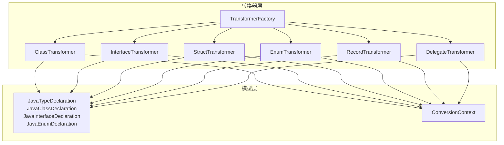
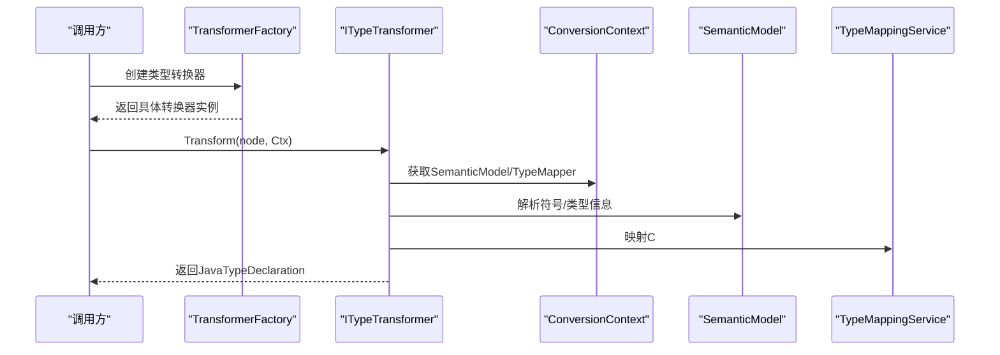
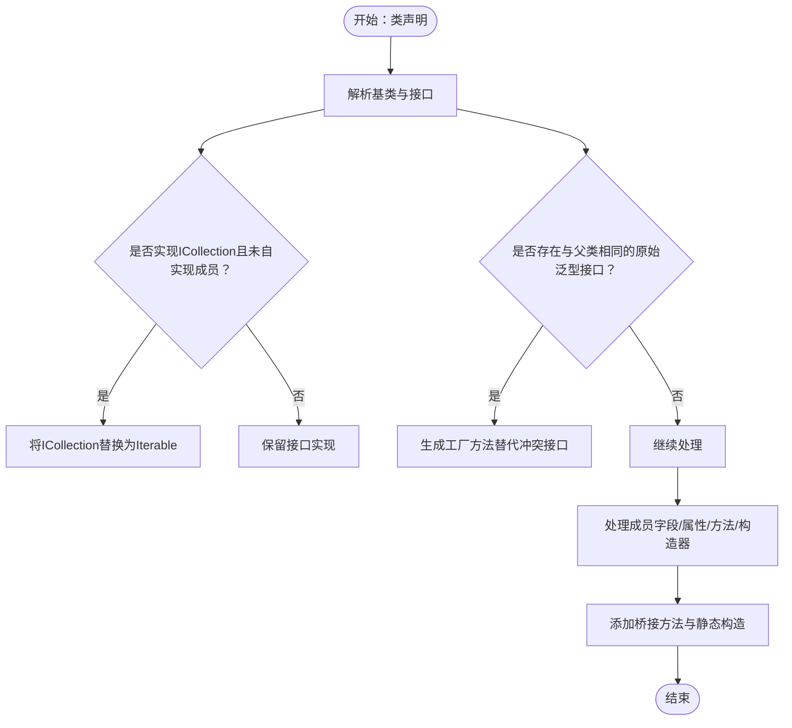
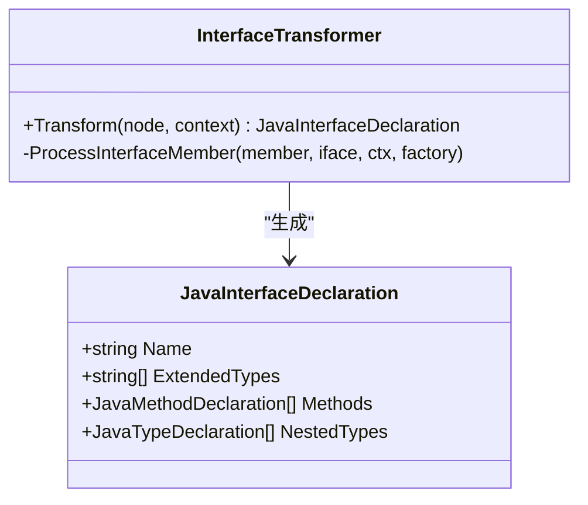
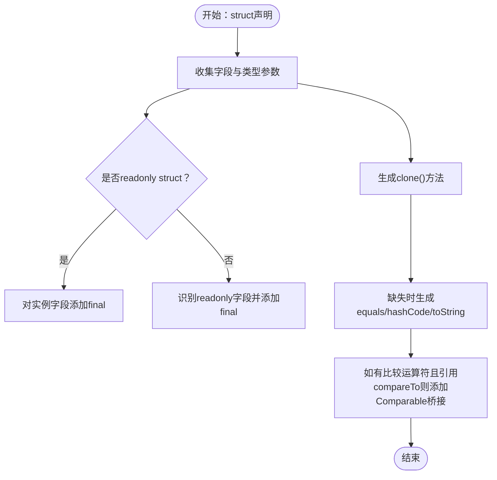
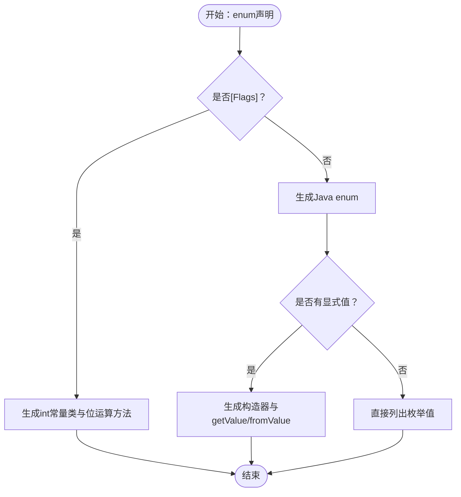
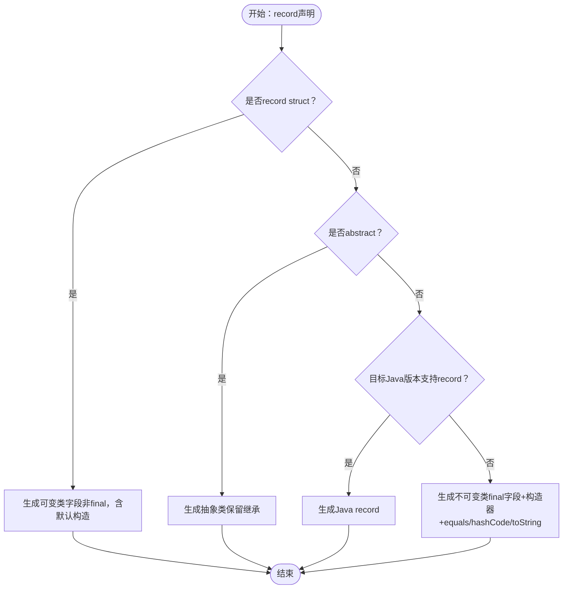
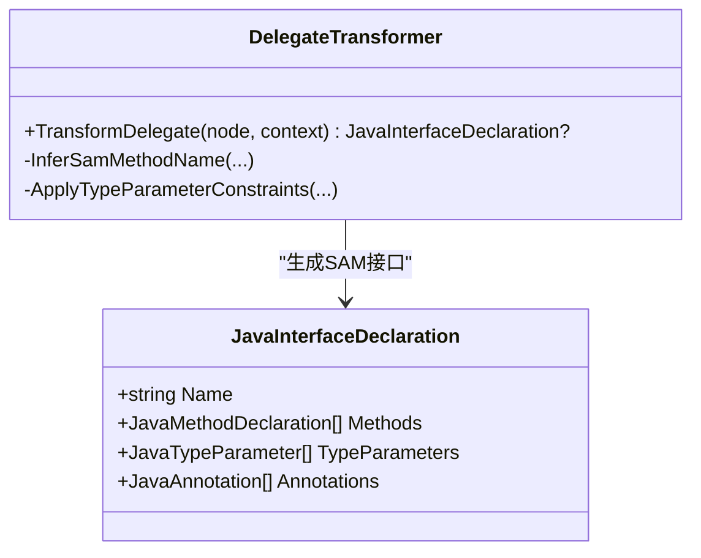
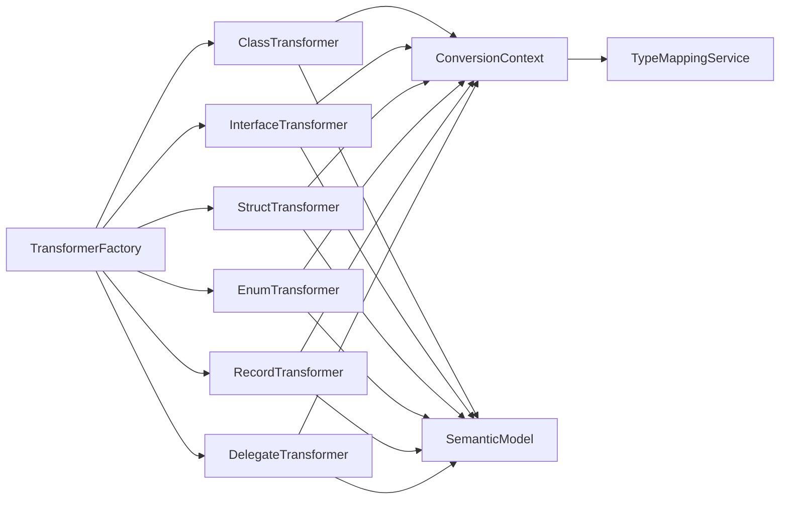

# 类型转换器

<cite>
**本文档引用的文件**
- [ClassTransformer.cs](file://src/CSharpToJava.Core/Transformers/Type/ClassTransformer.cs)
- [InterfaceTransformer.cs](file://src/CSharpToJava.Core/Transformers/Type/InterfaceTransformer.cs)
- [StructTransformer.cs](file://src/CSharpToJava.Core/Transformers/Type/StructTransformer.cs)
- [EnumTransformer.cs](file://src/CSharpToJava.Core/Transformers/Type/EnumTransformer.cs)
- [RecordTransformer.cs](file://src/CSharpToJava.Core/Transformers/Type/RecordTransformer.cs)
- [DelegateTransformer.cs](file://src/CSharpToJava.Core/Transformers/Type/DelegateTransformer.cs)
- [TransformerFactory.cs](file://src/CSharpToJava.Core/Transformers/TransformerFactory.cs)
- [JavaTypeDeclaration.cs](file://src/CSharpToJava.Core/Java/JavaTypeDeclaration.cs)
- [ConversionContext.cs](file://src/CSharpToJava.Core/Context/ConversionContext.cs)
- [ITransformer.cs](file://src/CSharpToJava.Core/Abstractions/ITransformer.cs)
- [MethodTransformer.cs](file://src/CSharpToJava.Core/Transformers/Member/MethodTransformer.cs)
- [PropertyTransformer.cs](file://src/CSharpToJava.Core/Transformers/Member/PropertyTransformer.cs)
</cite>

## 目录
1. [简介](#简介)
2. [项目结构](#项目结构)
3. [核心组件](#核心组件)
4. [架构总览](#架构总览)
5. [详细组件分析](#详细组件分析)
6. [依赖分析](#依赖分析)
7. [性能考虑](#性能考虑)
8. [故障排除指南](#故障排除指南)
9. [结论](#结论)

## 简介
本文件系统性阐述 cs2j 类型转换器体系的设计与实现，覆盖类、接口、结构体、枚举、记录与委托六类类型的转换策略与扩展机制。重点说明继承关系处理、泛型参数映射、成员访问权限转换、语言特异性处理，以及复杂场景如嵌套类型、内部类、泛型约束与类型擦除的应对方法。同时提供可操作的扩展指南，帮助开发者实现自定义类型转换器以满足特殊映射需求。

## 项目结构
类型转换器位于 CSharpToJava.Core/Transformers/Type 目录下，采用“单一职责”的转换器模式：每种 C# 类型由独立的转换器负责，遵循统一的 ITypeTransformer 接口约定；转换器通过 TransformerFactory 统一创建与复用；转换结果以 JavaTypeDeclaration 家族对象表示，最终由 JavaEmitter 输出为 Java 源码。

图表来源
- [TransformerFactory.cs:16-58](file://src/CSharpToJava.Core/Transformers/TransformerFactory.cs#L16-L58)
- [JavaTypeDeclaration.cs:82-336](file://src/CSharpToJava.Core/Java/JavaTypeDeclaration.cs#L82-L336)
- [ConversionContext.cs:14-233](file://src/CSharpToJava.Core/Context/ConversionContext.cs#L14-L233)

章节来源
- [TransformerFactory.cs:16-58](file://src/CSharpToJava.Core/Transformers/TransformerFactory.cs#L16-L58)
- [JavaTypeDeclaration.cs:82-336](file://src/CSharpToJava.Core/Java/JavaTypeDeclaration.cs#L82-L336)
- [ConversionContext.cs:14-233](file://src/CSharpToJava.Core/Context/ConversionContext.cs#L14-L233)

## 核心组件
- ITypeTransformer：类型声明转换器接口，定义 Transform(TypeDeclarationSyntax, ConversionContext) → JavaTypeDeclaration。
- TransformerFactory：转换器工厂，集中管理所有类型/成员/表达式转换器实例，确保无状态、可共享。
- JavaTypeDeclaration 家族：Java 类型声明的统一建模，包含类、接口、枚举等，支持注解、泛型、修饰符、嵌套类型等。
- ConversionContext：转换上下文，维护命名空间、当前类型、导入集合、诊断信息、类型映射服务等全局状态。

章节来源
- [ITransformer.cs:52-69](file://src/CSharpToJava.Core/Abstractions/ITransformer.cs#L52-L69)
- [TransformerFactory.cs:16-58](file://src/CSharpToJava.Core/Transformers/TransformerFactory.cs#L16-L58)
- [JavaTypeDeclaration.cs:8-61](file://src/CSharpToJava.Core/Java/JavaTypeDeclaration.cs#L8-L61)
- [ConversionContext.cs:14-233](file://src/CSharpToJava.Core/Context/ConversionContext.cs#L14-L233)

## 架构总览
类型转换流程从 TransformerFactory 获取具体类型转换器，传入 C# 类型语法节点与 ConversionContext，返回 JavaTypeDeclaration 对象。转换器内部利用 SemanticModel 解析符号信息，结合 TypeMappingService 执行类型映射，再根据语言差异进行修饰符、成员、泛型与桥接方法的适配。

图表来源
- [TransformerFactory.cs:16-58](file://src/CSharpToJava.Core/Transformers/TransformerFactory.cs#L16-L58)
- [ConversionContext.cs:113-127](file://src/CSharpToJava.Core/Context/ConversionContext.cs#L113-L127)
- [ClassTransformer.cs:44-55](file://src/CSharpToJava.Core/Transformers/Type/ClassTransformer.cs#L44-L55)

章节来源
- [TransformerFactory.cs:16-58](file://src/CSharpToJava.Core/Transformers/TransformerFactory.cs#L16-L58)
- [ConversionContext.cs:113-127](file://src/CSharpToJava.Core/Context/ConversionContext.cs#L113-L127)

## 详细组件分析

### 类转换器（ClassTransformer）
- 继承关系处理
  - 基类映射：跳过 System.Object 与 System.MarshalByRefObject，保留其他基类映射。
  - 接口实现：仅记录直接实现接口，避免重复；对 ICollection<T> 在未自实现成员时替换为 Iterable。
  - 泛型擦除冲突：当父子类实现相同原始接口（如 Comparator<String> 与 Comparator<Integer>）时，将冲突接口提取为工厂方法，避免 Java 类型擦除冲突。
- 成员处理
  - 静态类：生成私有无参构造以阻止实例化。
  - 桥接方法：移除 CompareTo/Clone 冲突、添加 Iterator/Iterable/Collection/Comparable/List/Cloneable 等桥接方法。
  - 重载去重：基于擦除签名与参数类型去重，保留更具体返回类型或用户自定义方法。
- 泛型与约束
  - 类型参数：复制类型形参与边界；丢弃 C# 声明处协变/逆变，使用使用处变体。
  - 约束传播：通过 ApplyTypeParameterConstraints 将 where 约束映射到 Java 边界。
- 访问修饰符
  - internal → public；protected internal → protected；默认无修饰符的顶级类型映射为 public。

图表来源
- [ClassTransformer.cs:46-175](file://src/CSharpToJava.Core/Transformers/Type/ClassTransformer.cs#L46-L175)
- [ClassTransformer.cs:242-251](file://src/CSharpToJava.Core/Transformers/Type/ClassTransformer.cs#L242-L251)

章节来源
- [ClassTransformer.cs:16-445](file://src/CSharpToJava.Core/Transformers/Type/ClassTransformer.cs#L16-L445)

### 接口转换器（InterfaceTransformer）
- 基接口与泛型：扩展接口列表与类型参数，丢弃声明处协变/逆变。
- 成员映射
  - 方法：默认抽象；带默认实现的方法标记为 default。
  - 属性/索引器：生成抽象 getter/setter 方法。
  - 事件：仅生成 add/remove 抽象监听器签名。
  - 嵌套类型：接口内嵌套类/接口/枚举均标记为 static。
- 语言特性
  - C# 8 默认接口方法 → Java default 关键字。
  - 事件字段 → 仅生成监听器抽象方法，无实现细节。

图表来源
- [InterfaceTransformer.cs:14-79](file://src/CSharpToJava.Core/Transformers/Type/InterfaceTransformer.cs#L14-L79)
- [JavaTypeDeclaration.cs:208-263](file://src/CSharpToJava.Core/Java/JavaTypeDeclaration.cs#L208-L263)

章节来源
- [InterfaceTransformer.cs:14-229](file://src/CSharpToJava.Core/Transformers/Type/InterfaceTransformer.cs#L14-L229)

### 结构体转换器（StructTransformer）
- 值语义适配
  - 转换为 Java 类，保留字段与方法；对 readonly struct 对实例字段添加 final。
  - 生成 clone() 方法近似 C# 值拷贝语义；若存在 struct-typed 字段则生成默认构造器。
- 等价性与可打印性
  - 自动补全 equals/hashCode/toString，必要时生成 hashCode。
  - 若检测到比较运算符并引用 compareTo，则添加 Comparable<T> 桥接。
- 语言差异
  - IEquatable<T> 接口跳过；ref struct 生成注释提示。
  - 无参构造器：C# struct 总有隐式无参构造，Java 需显式生成以保证引用字段初始化一致。

图表来源
- [StructTransformer.cs:27-196](file://src/CSharpToJava.Core/Transformers/Type/StructTransformer.cs#L27-L196)

章节来源
- [StructTransformer.cs:14-835](file://src/CSharpToJava.Core/Transformers/Type/StructTransformer.cs#L14-L835)

### 枚举转换器（EnumTransformer）
- Flags 枚举：生成 int 常量类，提供位运算工具方法（and/or/complement/has），并注册上下文以便类型引用映射为 int。
- 普通枚举：生成标准 Java enum；若成员带显式值，生成带构造器与 getValue/fromValue 的等价形式。
- 底层类型：警告 Java 枚举底层固定为 int，忽略 C# 指定的底层类型。

图表来源
- [EnumTransformer.cs:26-263](file://src/CSharpToJava.Core/Transformers/Type/EnumTransformer.cs#L26-L263)

章节来源
- [EnumTransformer.cs:16-318](file://src/CSharpToJava.Core/Transformers/Type/EnumTransformer.cs#L16-L318)

### 记录转换器（RecordTransformer）
- 记录结构体：生成等效的可变类（字段非 final，提供全参构造与默认构造），以保持值语义。
- 普通记录：优先使用 Java 25+ record；否则回退为不可变类，生成 final 字段、公共 getter、构造器与 equals/hashCode/toString。
- 抽象记录：回退为抽象类以保留继承语义。
- 位置参数：记录的参数成为构造器参数与字段，驼峰化命名。

图表来源
- [RecordTransformer.cs:17-52](file://src/CSharpToJava.Core/Transformers/Type/RecordTransformer.cs#L17-L52)
- [RecordTransformer.cs:119-228](file://src/CSharpToJava.Core/Transformers/Type/RecordTransformer.cs#L119-L228)

章节来源
- [RecordTransformer.cs:15-524](file://src/CSharpToJava.Core/Transformers/Type/RecordTransformer.cs#L15-L524)

### 委托转换器（DelegateTransformer）
- SAM（单一抽象方法）推断：根据返回类型与参数数量推断方法名（run/accept/get/apply）。
- 函数式接口：生成 @FunctionalInterface 接口，包含唯一抽象方法。
- 泛型与约束：过滤未使用的外部类型参数，传播约束；丢弃声明处协变/逆变。
- 参数 ref/out/in：ref/out 映射为持有者类型，in 映射为只读值传递。

图表来源
- [DelegateTransformer.cs:15-114](file://src/CSharpToJava.Core/Transformers/Type/DelegateTransformer.cs#L15-L114)
- [JavaTypeDeclaration.cs:208-263](file://src/CSharpToJava.Core/Java/JavaTypeDeclaration.cs#L208-L263)

章节来源
- [DelegateTransformer.cs:15-239](file://src/CSharpToJava.Core/Transformers/Type/DelegateTransformer.cs#L15-L239)

### 成员转换器与上下文协作
- 方法转换器：处理方法体、yield 语义、扩展方法重写、类型擦除冲突与跨继承擦除冲突。
- 属性转换器：自动属性生成后备字段与 getter/setter；表达式体属性仅生成 getter。
- 上下文：统一管理命名空间、当前类型、导入集合、类型映射缓存、诊断与别名解析。

章节来源
- [MethodTransformer.cs:16-200](file://src/CSharpToJava.Core/Transformers/Member/MethodTransformer.cs#L16-L200)
- [PropertyTransformer.cs:15-200](file://src/CSharpToJava.Core/Transformers/Member/PropertyTransformer.cs#L15-L200)
- [ConversionContext.cs:14-233](file://src/CSharpToJava.Core/Context/ConversionContext.cs#L14-L233)

## 依赖分析
- 耦合关系
  - ClassTransformer 与 StructTransformer 共享桥接方法与去重逻辑（AddMethodIfNotDuplicateInternal/AddCtorIfNotDuplicateInternal）。
  - 所有类型转换器依赖 ConversionContext 的类型映射与诊断能力。
  - TransformerFactory 提供统一实例化入口，降低上层耦合。
- 外部依赖
  - Roslyn SemanticModel 用于符号解析与类型信息获取。
  - TypeMappingService 负责 C#/Java 类型映射与导入管理。

图表来源
- [TransformerFactory.cs:16-58](file://src/CSharpToJava.Core/Transformers/TransformerFactory.cs#L16-L58)
- [ConversionContext.cs:113-127](file://src/CSharpToJava.Core/Context/ConversionContext.cs#L113-L127)

章节来源
- [TransformerFactory.cs:16-58](file://src/CSharpToJava.Core/Transformers/TransformerFactory.cs#L16-L58)
- [ConversionContext.cs:113-127](file://src/CSharpToJava.Core/Context/ConversionContext.cs#L113-L127)

## 性能考虑
- 单例工厂：TransformerFactory 以静态单例缓存转换器实例，避免重复分配。
- 类型映射缓存：ConversionContext.TypeMapper 维护类型缓存与导入集合，减少重复映射开销。
- 语义模型选择：针对不同语法树选择对应 SemanticModel，避免无效解析。
- 去重与冲突检测：在方法/构造器层面基于擦除签名去重，减少冗余桥接方法生成。

## 故障排除指南
- 类型擦除冲突
  - 症状：父子类实现相同原始泛型接口导致编译错误。
  - 处理：使用工厂方法替代冲突接口；检查 AddCtorIfNotDuplicateInternal 与 AddMethodIfNotDuplicateInternal 的去重逻辑。
- 泛型约束丢失
  - 症状：Java 缺少边界约束。
  - 处理：确认 ApplyTypeParameterConstraints 是否正确传播约束。
- 访问修饰符不一致
  - 症状：internal/protected internal 未按预期映射。
  - 处理：核对 ConvertModifiers 的映射规则与默认访问控制。
- 委托 SAM 名称不匹配
  - 症状：SAM 方法名与调用站点不一致。
  - 处理：确保 InferSamMethodName 与调用端一致。

章节来源
- [ClassTransformer.cs:618-795](file://src/CSharpToJava.Core/Transformers/Type/ClassTransformer.cs#L618-L795)
- [DelegateTransformer.cs:120-126](file://src/CSharpToJava.Core/Transformers/Type/DelegateTransformer.cs#L120-L126)

## 结论
cs2j 类型转换器体系通过清晰的接口分层、统一的工厂模式与上下文驱动的类型映射，实现了 C# 与 Java 之间高保真的类型转换。针对语言差异与高级特性（如泛型、记录、委托、结构体等），转换器提供了稳健的策略与桥接机制。扩展方面，新增类型转换器只需实现 ITypeTransformer 并在 TransformerFactory 中注册，即可无缝融入现有流水线。