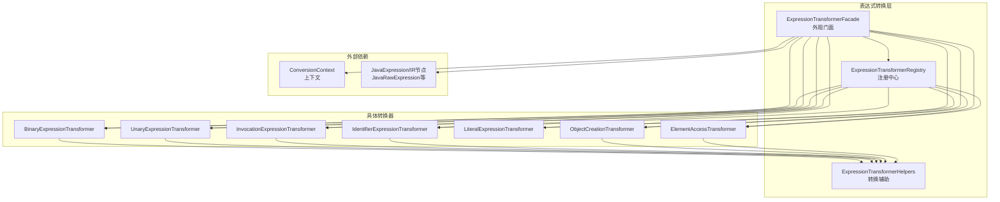
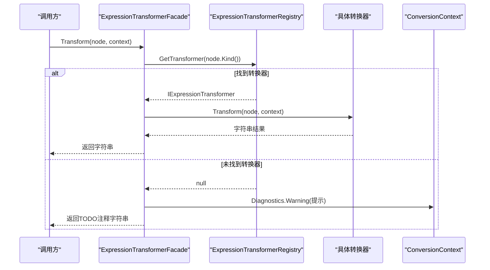
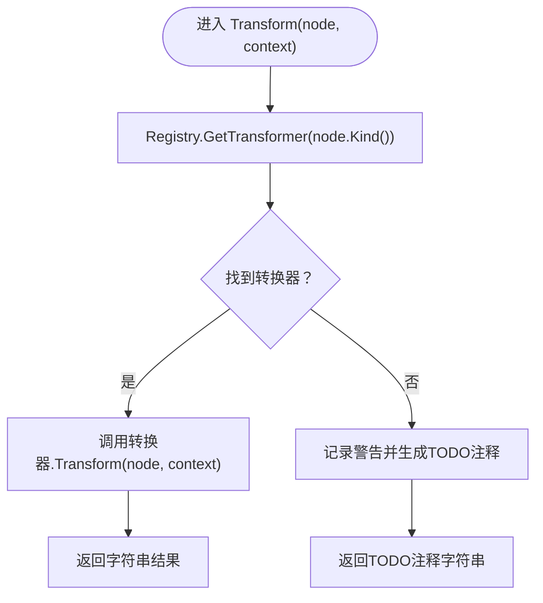
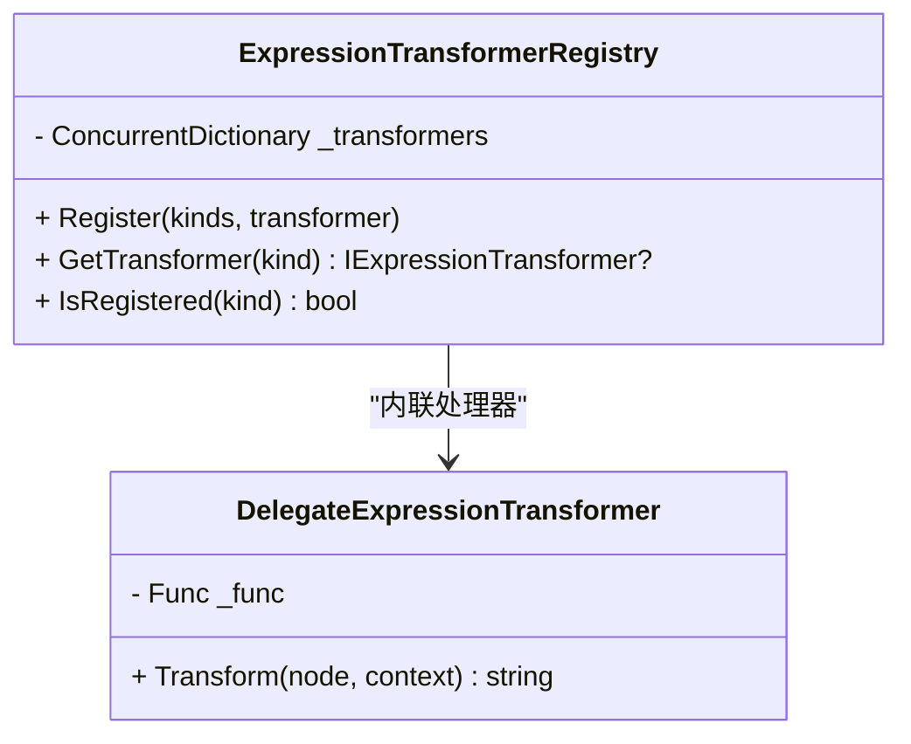
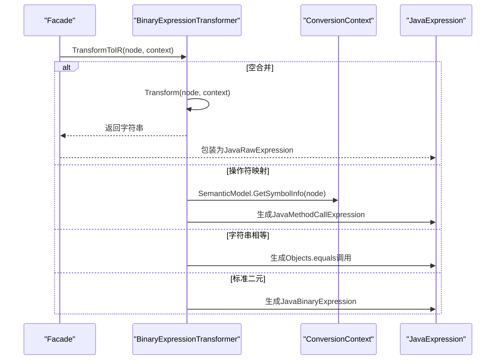
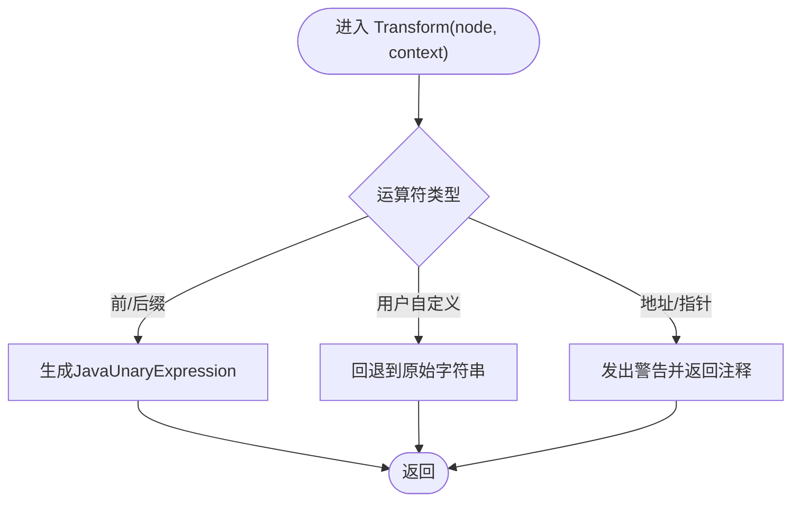
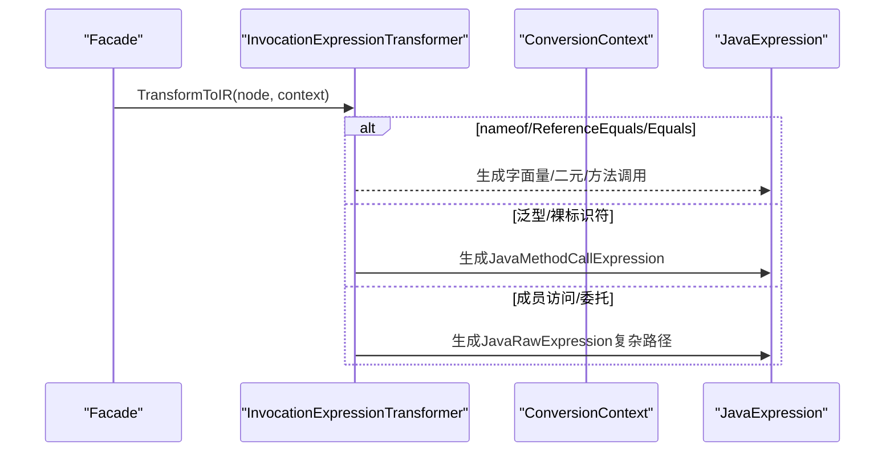
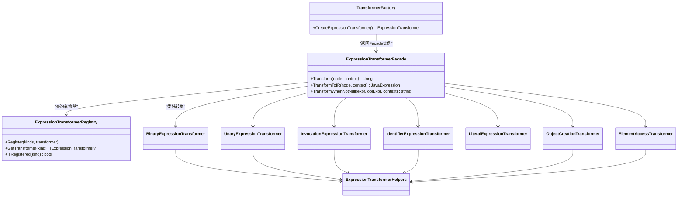

# 表达式转换器

<cite>
**本文档引用的文件**
- [ExpressionTransformerFacade.cs](file://src/CSharpToJava.Core/Transformers/Expression/ExpressionTransformerFacade.cs)
- [ExpressionTransformerRegistry.cs](file://src/CSharpToJava.Core/Transformers/Expression/ExpressionTransformerRegistry.cs)
- [BinaryExpressionTransformer.cs](file://src/CSharpToJava.Core/Transformers/Expression/Transformers/BinaryExpressionTransformer.cs)
- [UnaryExpressionTransformer.cs](file://src/CSharpToJava.Core/Transformers/Expression/Transformers/UnaryExpressionTransformer.cs)
- [InvocationExpressionTransformer.cs](file://src/CSharpToJava.Core/Transformers/Expression/Transformers/InvocationExpressionTransformer.cs)
- [IdentifierExpressionTransformer.cs](file://src/CSharpToJava.Core/Transformers/Expression/Transformers/IdentifierExpressionTransformer.cs)
- [LiteralExpressionTransformer.cs](file://src/CSharpToJava.Core/Transformers/Expression/Transformers/LiteralExpressionTransformer.cs)
- [ObjectCreationTransformer.cs](file://src/CSharpToJava.Core/Transformers/Expression/Transformers/ObjectCreationTransformer.cs)
- [ElementAccessTransformer.cs](file://src/CSharpToJava.Core/Transformers/Expression/Transformers/ElementAccessTransformer.cs)
- [ExpressionTransformerHelpers.cs](file://src/CSharpToJava.Core/Transformers/Expression/Utilities/ExpressionTransformerHelpers.cs)
- [TransformerFactory.cs](file://src/CSharpToJava.Core/Transformers/TransformerFactory.cs)
- [PhaseCExpressionIRTests.cs](file://tests/CSharpToJava.Tests/PhaseCExpressionIRTests.cs)
</cite>

## 目录
1. [简介](#简介)
2. [项目结构](#项目结构)
3. [核心组件](#核心组件)
4. [架构总览](#架构总览)
5. [详细组件分析](#详细组件分析)
6. [依赖关系分析](#依赖关系分析)
7. [性能考虑](#性能考虑)
8. [故障排除指南](#故障排除指南)
9. [结论](#结论)

## 简介
本文件面向cs2j表达式转换器系统，系统性阐述ExpressionTransformerFacade外观模式与ExpressionTransformerRegistry注册机制的设计与实现，详解各类表达式转换器（二元/一元/成员访问/调用/字面量/对象创建/元素访问）的转换逻辑与IR生成策略，说明上下文传递、类型推导与错误处理机制，并提供复杂表达式嵌套转换与结果生成的实践指导。

## 项目结构
表达式转换体系位于CSharpToJava.Core工程的Transformers/Expression目录下，采用“外观门面 + 注册中心 + 多种具体转换器”的分层设计：
- 外观门面：ExpressionTransformerFacade负责统一入口与IR桥接
- 注册中心：ExpressionTransformerRegistry负责自动发现与注册
- 具体转换器：按C#语法节点类型划分，如二元表达式、一元表达式、成员访问、调用、字面量、对象创建、元素访问等
- 工具与辅助：ExpressionTransformerHelpers提供通用转换辅助方法
- 测试验证：PhaseCExpressionIRTests验证IR接口与桥接行为

图示来源
- [ExpressionTransformerFacade.cs:12-86](file://src/CSharpToJava.Core/Transformers/Expression/ExpressionTransformerFacade.cs#L12-L86)
- [ExpressionTransformerRegistry.cs:17-147](file://src/CSharpToJava.Core/Transformers/Expression/ExpressionTransformerRegistry.cs#L17-L147)
- [ExpressionTransformerHelpers.cs:15-100](file://src/CSharpToJava.Core/Transformers/Expression/Utilities/ExpressionTransformerHelpers.cs#L15-L100)

章节来源
- [ExpressionTransformerFacade.cs:12-86](file://src/CSharpToJava.Core/Transformers/Expression/ExpressionTransformerFacade.cs#L12-L86)
- [ExpressionTransformerRegistry.cs:17-147](file://src/CSharpToJava.Core/Transformers/Expression/ExpressionTransformerRegistry.cs#L17-L147)

## 核心组件
- 外观门面（ExpressionTransformerFacade）
  - 统一入口：根据SyntaxKind从注册表获取转换器并执行Transform或TransformToIR
  - IR桥接：若底层转换器不支持IR，则将字符串结果包装为JavaRawExpression并补充ResolvedType
  - 条件访问（?.）特殊处理：TransformWhenNotNull递归替换MemberBinding/Invocation/MemberAccess/ElementAccess
  - 类型解析：ResolveJavaType通过SemanticModel推断表达式类型并映射到Java类型
- 注册中心（ExpressionTransformerRegistry）
  - 自动发现：扫描带[TransformerRegistration]特性的转换器类型，触发静态构造以完成注册
  - 内联处理器：对缺失专用转换器的SyntaxKind（如元组、声明表达式、ref表达式等）注册委托处理器
  - 并发安全：使用ConcurrentDictionary存储转换器映射
  - 调试告警：重复注册时在调试构建中输出警告
- 转换器工厂（TransformerFactory）
  - 提供CreateExpressionTransformer返回Facade单例，作为表达式转换的统一入口

章节来源
- [ExpressionTransformerFacade.cs:28-86](file://src/CSharpToJava.Core/Transformers/Expression/ExpressionTransformerFacade.cs#L28-L86)
- [ExpressionTransformerRegistry.cs:24-122](file://src/CSharpToJava.Core/Transformers/Expression/ExpressionTransformerRegistry.cs#L24-L122)
- [TransformerFactory.cs:57-58](file://src/CSharpToJava.Core/Transformers/TransformerFactory.cs#L57-L58)

## 架构总览
外观模式与注册机制协同工作，Facade作为客户端唯一可见接口，内部通过Registry按SyntaxKind查找对应转换器；IR桥接确保所有转换器都能输出结构化IR，便于后续阶段复用。

图示来源
- [ExpressionTransformerFacade.cs:28-39](file://src/CSharpToJava.Core/Transformers/Expression/ExpressionTransformerFacade.cs#L28-L39)
- [ExpressionTransformerRegistry.cs:146-147](file://src/CSharpToJava.Core/Transformers/Expression/ExpressionTransformerRegistry.cs#L146-L147)

## 详细组件分析

### 外观门面（ExpressionTransformerFacade）
- 统一入口与错误处理
  - 若无对应转换器，记录警告并返回TODO注释，避免抛出异常
- IR桥接策略
  - TransformToIR优先检查转换器是否实现IIRExpressionTransformer
  - 若不支持IR，则调用Transform得到字符串，再包装为JavaRawExpression并尝试解析ResolvedType
- 条件访问（?.）处理
  - TransformWhenNotNull针对MemberBinding/Invocation/MemberAccess/ElementAccess进行递归转换
  - 支持LINQ方法（Select/Where）在条件访问链中的流式转换
  - 属性到方法的映射（如Count→size），以及数组长度的特殊处理
- 类型解析
  - ResolveJavaType基于SemanticModel.GetTypeInfo推断类型，结合TypeMappings映射为Java类型

图示来源
- [ExpressionTransformerFacade.cs:28-39](file://src/CSharpToJava.Core/Transformers/Expression/ExpressionTransformerFacade.cs#L28-L39)

章节来源
- [ExpressionTransformerFacade.cs:28-86](file://src/CSharpToJava.Core/Transformers/Expression/ExpressionTransformerFacade.cs#L28-L86)

### 注册中心（ExpressionTransformerRegistry）
- 自动发现与注册
  - 静态构造中扫描Assembly中带[TransformerRegistration]的类型，触发其静态构造以完成注册
- 内联处理器
  - 对缺失专用转换器的SyntaxKind（如TupleExpression、DeclarationExpression、RefExpression、StackAllocArrayCreationExpression、ImplicitStackAllocArrayCreationExpression、CollectionExpression）注册委托处理器
- 注册与查询
  - Register：将SyntaxKind映射到转换器实例
  - GetTransformer/IsRegistered：提供查询能力
- 并发与调试
  - 使用ConcurrentDictionary保证线程安全
  - 重复注册在调试构建中输出警告

图示来源
- [ExpressionTransformerRegistry.cs:19-165](file://src/CSharpToJava.Core/Transformers/Expression/ExpressionTransformerRegistry.cs#L19-L165)

章节来源
- [ExpressionTransformerRegistry.cs:17-167](file://src/CSharpToJava.Core/Transformers/Expression/ExpressionTransformerRegistry.cs#L17-L167)

### 二元表达式转换器（BinaryExpressionTransformer）
- 覆盖语法种类
  - 算术、比较、逻辑、位运算、移位、空合并等
- IR生成策略
  - 优先生成结构化IR（JavaBinaryExpression/JavaMethodCallExpression/JavaConditionalExpression）
  - 用户自定义操作符映射为方法调用，必要时去除泛型参数
  - 字符串相等性使用Objects.equals，事件比较回退到原始字符串
- 特殊处理
  - 事件与null比较（例如ProgressChanged != null）转换为监听集合判空
  - 空合并（??）在IR路径中委派给Transform以处理临时变量提升

图示来源
- [BinaryExpressionTransformer.cs:74-195](file://src/CSharpToJava.Core/Transformers/Expression/Transformers/BinaryExpressionTransformer.cs#L74-L195)

章节来源
- [BinaryExpressionTransformer.cs:14-465](file://src/CSharpToJava.Core/Transformers/Expression/Transformers/BinaryExpressionTransformer.cs#L14-L465)

### 一元表达式转换器（UnaryExpressionTransformer）
- 覆盖语法种类
  - 前缀/后缀自增/自减、一元加/减、逻辑非、按位非、地址/指针间接、抑制可空警告
- IR生成策略
  - 简单前/后缀运算生成JavaUnaryExpression
  - 用户自定义操作符或属性/索引器增量需要回退到原始字符串
- 特殊处理
  - 地址与指针间接：发出警告并返回注释占位
  - 属性/索引器增量：在表达式上下文通过hoist预语句保存旧值，在语句上下文直接就地修改
  - 字面量一元加：对非数值类型去除无效的+号

图示来源
- [UnaryExpressionTransformer.cs:38-111](file://src/CSharpToJava.Core/Transformers/Expression/Transformers/UnaryExpressionTransformer.cs#L38-L111)

章节来源
- [UnaryExpressionTransformer.cs:14-631](file://src/CSharpToJava.Core/Transformers/Expression/Transformers/UnaryExpressionTransformer.cs#L14-L631)

### 调用表达式转换器（InvocationExpressionTransformer）
- 覆盖语法种类
  - 方法调用（含泛型、静态、成员访问、委托invoke）
- IR生成策略
  - nameof/ReferenceEquals/静态Equals等特殊内置映射
  - 泛型方法名去类型参数，必要时追加类型擦除重命名后缀
  - 委托调用映射到SAM方法（apply/get/run/accept等）
- 特殊处理
  - 成员访问调用的名称映射与扩展方法接收者插入防护
  - 无法解析的委托调用使用启发式SAM方法名
  - 事件调用映射到fire方法

图示来源
- [InvocationExpressionTransformer.cs:51-130](file://src/CSharpToJava.Core/Transformers/Expression/Transformers/InvocationExpressionTransformer.cs#L51-L130)

章节来源
- [InvocationExpressionTransformer.cs:15-800](file://src/CSharpToJava.Core/Transformers/Expression/Transformers/InvocationExpressionTransformer.cs#L15-L800)

### 标识符与成员访问转换器（IdentifierExpressionTransformer）
- 覆盖语法种类
  - 标识符、预定义类型、泛型名、成员访问、指针成员访问
- IR生成策略
  - 局部变量/参数→JavaIdentifierExpression
  - 属性读取→JavaMethodCallExpression（getXxx）
  - 常量字段→JavaIdentifierExpression
  - 成员访问→优先JavaMemberAccessExpression或JavaMethodCallExpression
- 特殊处理
  - LINQ let别名、out/ref参数持有者.value访问
  - 事件引用的null比较与fire方法映射
  - 方法组（非调用）→Java方法引用或显式lambda
  - 原始类型静态常量（Double.MaxValue等）映射到Java静态常量

章节来源
- [IdentifierExpressionTransformer.cs:15-830](file://src/CSharpToJava.Core/Transformers/Expression/Transformers/IdentifierExpressionTransformer.cs#L15-L830)

### 字面量转换器（LiteralExpressionTransformer）
- 覆盖语法种类
  - 数值、字符串、字符、null、true/false、UTF-8字符串
- IR生成策略
  - TransformToIR返回JavaLiteralExpression
- 特殊处理
  - 数值后缀（f/d/m/ul/u/l）映射与越界处理（BigDecimal/BigInteger）
  - 原始字符串字面量（C# 11）在目标Java版本≥15时转为文本块
  - UTF-8字符串字面量转为字节数组

章节来源
- [LiteralExpressionTransformer.cs:16-213](file://src/CSharpToJava.Core/Transformers/Expression/Transformers/LiteralExpressionTransformer.cs#L16-L213)

### 对象与数组创建转换器（ObjectCreationTransformer）
- 覆盖语法种类
  - new表达式、隐式new、匿名对象、数组创建、隐式数组创建、数组初始化器、栈分配数组
- IR生成策略
  - 简单构造且无复杂参数→JavaNewExpression
  - 否则回退到原始字符串
- 特殊处理
  - Map.Entry→AbstractMap.SimpleEntry映射并强转为Map.Entry接口
  - Exception→RuntimeException映射
  - 泛型构造器参数数组包装（Arrays.asList/Stream.collect）
  - 委托构造→函数式值而非接口实例
  - Rectangle/LineSegment等特定类型构造器参数适配

章节来源
- [ObjectCreationTransformer.cs:17-1164](file://src/CSharpToJava.Core/Transformers/Expression/Transformers/ObjectCreationTransformer.cs#L17-L1164)

### 元素访问转换器（ElementAccessTransformer）
- 覆盖语法种类
  - ElementAccess、Index（^n）
- IR生成策略
  - 单参数且简单索引：数组→JavaArrayAccessExpression；List/Dict/String→JavaMethodCallExpression（get/charAt）
- 特殊处理
  - 范围切片（lo..hi）→Arrays.copyOfRange
  - 从末尾索引（^n）→基于length的计算
  - 多参数索引→get(…, …)

章节来源
- [ElementAccessTransformer.cs:14-203](file://src/CSharpToJava.Core/Transformers/Expression/Transformers/ElementAccessTransformer.cs#L14-L203)

### 转换辅助工具（ExpressionTransformerHelpers）
- 通用功能
  - 数值字面量识别、类型适配（AdaptExpressionToTargetType/ConvertedType）、Java包装类型映射
  - 静态接收者类型解析与Java引用格式化、枚举成员访问格式化
  - 数组到Stream/Collection的转换（Arrays.stream、IntStream.range、boxed、collect）
  - 判断是否可直接调用collection.stream（排除Map）

章节来源
- [ExpressionTransformerHelpers.cs:15-1063](file://src/CSharpToJava.Core/Transformers/Expression/Utilities/ExpressionTransformerHelpers.cs#L15-L1063)

## 依赖关系分析
- 外观门面依赖注册中心与各转换器实现
- 各转换器依赖转换辅助工具与上下文（SemanticModel、TypeMappings、Diagnostic等）
- 转换器工厂提供统一入口，返回Facade单例

图示来源
- [ExpressionTransformerFacade.cs:28-86](file://src/CSharpToJava.Core/Transformers/Expression/ExpressionTransformerFacade.cs#L28-L86)
- [ExpressionTransformerRegistry.cs:17-167](file://src/CSharpToJava.Core/Transformers/Expression/ExpressionTransformerRegistry.cs#L17-L167)
- [TransformerFactory.cs:57-58](file://src/CSharpToJava.Core/Transformers/TransformerFactory.cs#L57-L58)

章节来源
- [ExpressionTransformerFacade.cs:28-86](file://src/CSharpToJava.Core/Transformers/Expression/ExpressionTransformerFacade.cs#L28-L86)
- [ExpressionTransformerRegistry.cs:17-167](file://src/CSharpToJava.Core/Transformers/Expression/ExpressionTransformerRegistry.cs#L17-L167)
- [TransformerFactory.cs:57-58](file://src/CSharpToJava.Core/Transformers/TransformerFactory.cs#L57-L58)

## 性能考虑
- 注册中心使用并发字典，避免锁竞争
- IR桥接优先使用结构化IR，减少字符串拼接与正则处理
- 数组到Stream/Collection转换采用高效的Arrays.stream与IntStream.range策略
- 重复注册在调试构建中告警，有助于早期发现配置问题

## 故障排除指南
- 未注册的表达式类型
  - 现象：返回TODO注释字符串并记录警告
  - 处理：为该SyntaxKind添加转换器或内联处理器
- 条件访问（?.）链异常
  - 现象：属性到方法映射失败或LINQ方法未正确流式化
  - 处理：检查TypeMappings与TransformWhenNotNull分支；确认SemanticModel可用
- 事件比较与调用
  - 现象：事件与null比较或fire方法未正确生成
  - 处理：确认事件符号解析与当前类名匹配；检查事件到监听集合的映射
- 数值字面量溢出
  - 现象：ulong/decimal字面量超出范围
  - 处理：使用BigInteger/BigDecimal包装；检查目标Java版本对数字字面量的支持

章节来源
- [ExpressionTransformerFacade.cs:33-36](file://src/CSharpToJava.Core/Transformers/Expression/ExpressionTransformerFacade.cs#L33-L36)
- [ExpressionTransformerRegistry.cs:134-137](file://src/CSharpToJava.Core/Transformers/Expression/ExpressionTransformerRegistry.cs#L134-L137)

## 结论
cs2j表达式转换器系统通过外观门面与注册中心实现了高内聚、低耦合的转换框架，配合丰富的具体转换器与IR桥接策略，能够稳定地将C#表达式转换为Java代码。借助ExpressionTransformerHelpers提供的通用工具与完善的测试覆盖，系统在复杂表达式、边界情况与错误处理方面具备良好的鲁棒性与可维护性。