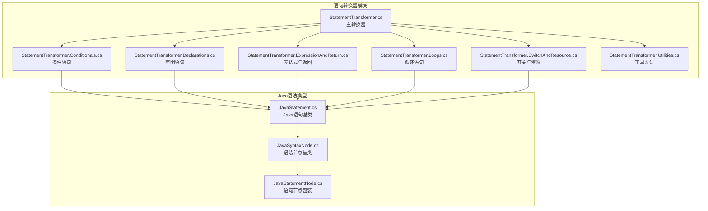
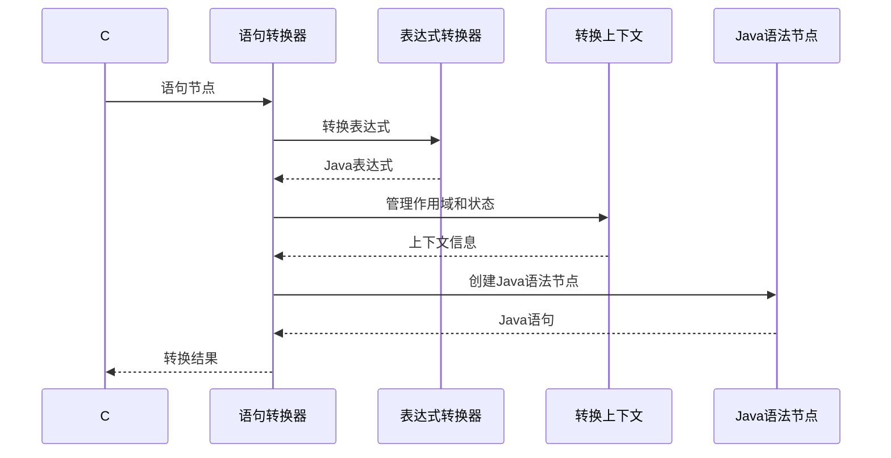
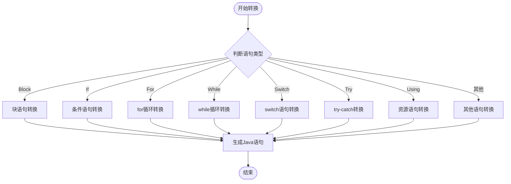
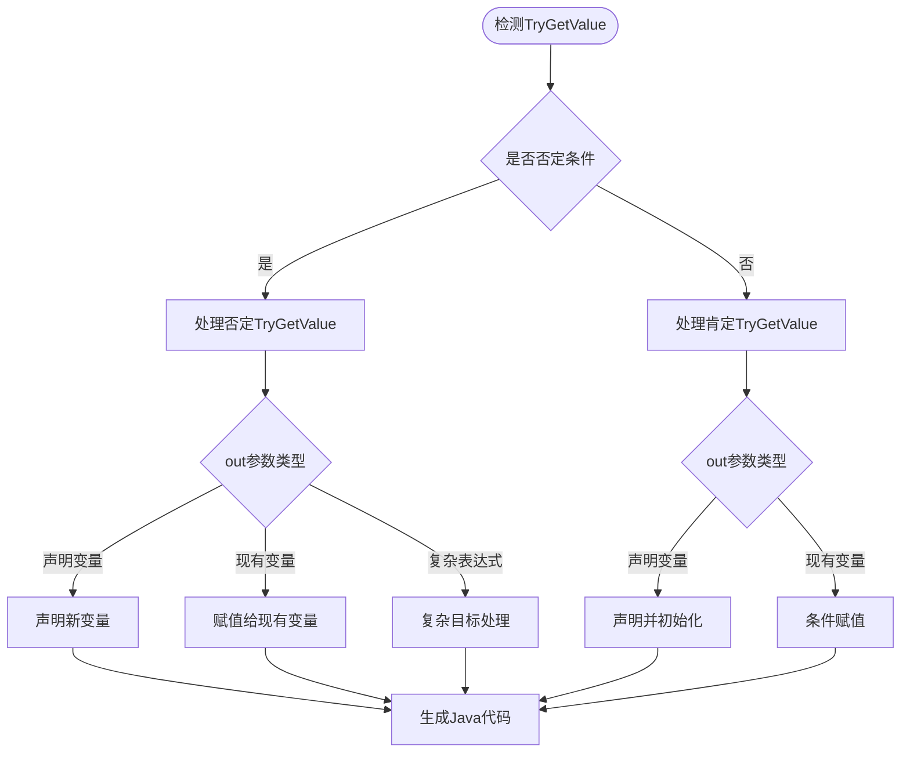
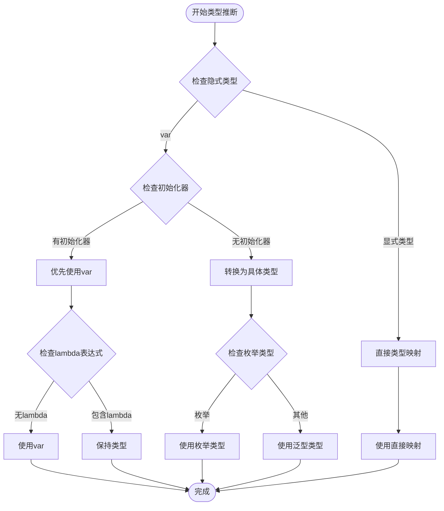
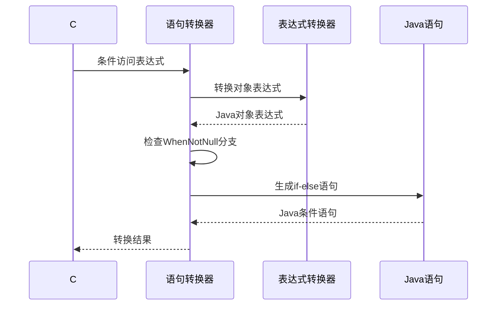
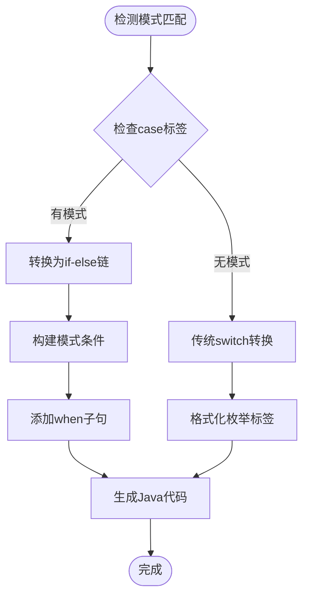
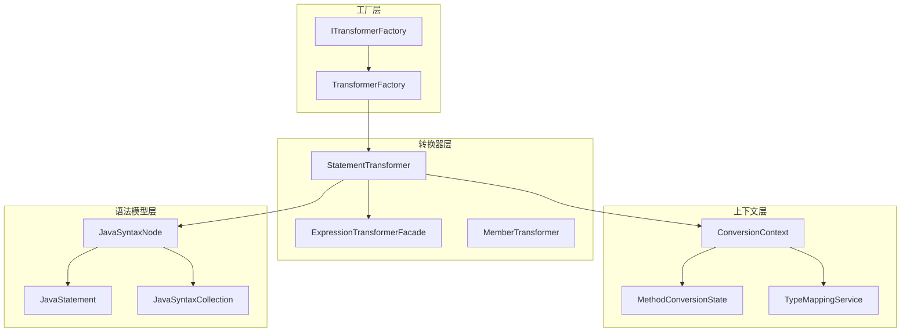

# 语句转换器

<cite>
**本文档引用的文件**
- [StatementTransformer.cs](file://src/CSharpToJava.Core/Transformers/Statement/StatementTransformer.cs)
- [StatementTransformer.Conditionals.cs](file://src/CSharpToJava.Core/Transformers/Statement/StatementTransformer.Conditionals.cs)
- [StatementTransformer.Declarations.cs](file://src/CSharpToJava.Core/Transformers/Statement/StatementTransformer.Declarations.cs)
- [StatementTransformer.ExpressionAndReturn.cs](file://src/CSharpToJava.Core/Transformers/Statement/StatementTransformer.ExpressionAndReturn.cs)
- [StatementTransformer.Loops.cs](file://src/CSharpToJava.Core/Transformers/Statement/StatementTransformer.Loops.cs)
- [StatementTransformer.SwitchAndResource.cs](file://src/CSharpToJava.Core/Transformers/Statement/StatementTransformer.SwitchAndResource.cs)
- [StatementTransformer.Utilities.cs](file://src/CSharpToJava.Core/Transformers/Statement/StatementTransformer.Utilities.cs)
- [JavaStatement.cs](file://src/CSharpToJava.Core/Java/JavaStatement.cs)
- [JavaSyntaxNode.cs](file://src/CSharpToJava.Core/Java/JavaSyntaxNode.cs)
- [JavaStatementNode.cs](file://src/CSharpToJava.Core/Transformers/Statement/JavaStatementNode.cs)
- [TransformerFactory.cs](file://src/CSharpToJava.Core/Transformers/TransformerFactory.cs)
- [ITransformer.cs](file://src/CSharpToJava.Core/Abstractions/ITransformer.cs)
</cite>

## 目录
1. [简介](#简介)
2. [项目结构](#项目结构)
3. [核心组件](#核心组件)
4. [架构概览](#架构概览)
5. [详细组件分析](#详细组件分析)
6. [依赖关系分析](#依赖关系分析)
7. [性能考虑](#性能考虑)
8. [故障排除指南](#故障排除指南)
9. [结论](#结论)

## 简介

cs2j语句转换器是C#到Java转换器的核心组件之一，负责将C#语法树中的语句节点转换为对应的Java语法节点。该转换器实现了完整的语句类型支持，包括控制流语句、声明语句、表达式语句、跳转语句等，并处理了C#和Java之间的语法差异和兼容性问题。

语句转换器采用分层设计，通过模式匹配机制处理不同类型的C#语句，并将其转换为相应的Java语句表示。转换过程中充分考虑了作用域管理、变量声明、控制流分析等关键因素，确保转换结果的正确性和可编译性。

## 项目结构

语句转换器位于`src/CSharpToJava.Core/Transformers/Statement/`目录下，采用模块化设计，按语句类型进行功能分离：



**图表来源**
- [StatementTransformer.cs:1-192](file://src/CSharpToJava.Core/Transformers/Statement/StatementTransformer.cs#L1-L192)
- [JavaStatement.cs:1-453](file://src/CSharpToJava.Core/Java/JavaStatement.cs#L1-L453)

**章节来源**
- [StatementTransformer.cs:1-192](file://src/CSharpToJava.Core/Transformers/Statement/StatementTransformer.cs#L1-L192)
- [JavaStatement.cs:1-453](file://src/CSharpToJava.Core/Java/JavaStatement.cs#L1-L453)

## 核心组件

### 主转换器类

StatementTransformer是语句转换的核心类，实现了IStatementTransformer接口，提供了统一的语句转换入口。该类采用分层设计，将复杂的转换逻辑分解为多个专门的方法处理不同类型的语句。

### Java语法节点体系

Java语法节点体系提供了完整的Java语句表示能力：

- **JavaStatement基类**：所有Java语句的抽象基类，提供通用的注释处理和格式化功能
- **具体语句类型**：包括块语句、变量声明语句、表达式语句、if语句、for循环、while循环、switch语句等
- **语句节点包装**：JavaStatementNode用于包装原始字符串形式的语句

### 转换上下文管理

转换器通过ConversionContext管理转换过程中的状态信息，包括：
- 作用域栈管理
- 预处理和后处理语句队列
- 类型映射服务
- 诊断信息收集

**章节来源**
- [StatementTransformer.cs:17-48](file://src/CSharpToJava.Core/Transformers/Statement/StatementTransformer.cs#L17-L48)
- [JavaStatement.cs:8-36](file://src/CSharpToJava.Core/Java/JavaStatement.cs#L8-L36)
- [JavaSyntaxNode.cs:6-32](file://src/CSharpToJava.Core/Java/JavaSyntaxNode.cs#L6-L32)

## 架构概览

语句转换器采用分层架构设计，通过职责分离确保代码的可维护性和扩展性：



**图表来源**
- [StatementTransformer.cs:19-48](file://src/CSharpToJava.Core/Transformers/Statement/StatementTransformer.cs#L19-L48)
- [TransformerFactory.cs:34](file://src/CSharpToJava.Core/Transformers/TransformerFactory.cs#L34)

### 转换流程控制

语句转换器通过模式匹配机制处理不同类型的C#语句：



**图表来源**
- [StatementTransformer.cs:21-47](file://src/CSharpToJava.Core/Transformers/Statement/StatementTransformer.cs#L21-L47)

**章节来源**
- [StatementTransformer.cs:19-77](file://src/CSharpToJava.Core/Transformers/Statement/StatementTransformer.cs#L19-L77)

## 详细组件分析

### 条件语句转换

条件语句转换器专门处理if语句的复杂转换逻辑，包括TryGetValue方法的特殊处理和out参数的转换。

#### TryGetValue语句转换

针对C#中TryGetValue方法在Java中的特殊处理：



**图表来源**
- [StatementTransformer.Conditionals.cs:16-166](file://src/CSharpToJava.Core/Transformers/Statement/StatementTransformer.Conditionals.cs#L16-L166)

#### out参数处理策略

转换器实现了三种out参数处理策略：

1. **声明变量模式**：为out变量创建新的局部变量
2. **现有变量模式**：将值赋给已存在的变量
3. **复杂目标模式**：处理属性或字段等复杂赋值目标

**章节来源**
- [StatementTransformer.Conditionals.cs:16-338](file://src/CSharpToJava.Core/Transformers/Statement/StatementTransformer.Conditionals.cs#L16-L338)

### 声明语句转换

声明语句转换器处理C#变量声明到Java变量声明的转换，包括类型推断、隐式类型处理、泛型类型映射等功能。

#### 类型推断优化

转换器实现了智能的类型推断机制：



**图表来源**
- [StatementTransformer.Declarations.cs:16-92](file://src/CSharpToJava.Core/Transformers/Statement/StatementTransformer.Declarations.cs#L16-L92)

#### 特殊场景处理

转换器处理了多种特殊场景：

- **LINQ查询转换**：将C# LINQ查询转换为Java Stream操作
- **数组初始化**：处理C#数组到Java数组的转换
- **枚举默认值**：处理枚举数组的默认值初始化
- **结构体克隆**：处理用户定义结构体的值复制语义

**章节来源**
- [StatementTransformer.Declarations.cs:16-508](file://src/CSharpToJava.Core/Transformers/Statement/StatementTransformer.Declarations.cs#L16-L508)

### 表达式与返回语句转换

表达式语句转换器处理C#表达式到Java表达式的转换，特别关注了条件访问表达式、TryGetValue调用、断言方法等特殊情况。

#### 条件访问表达式转换

条件访问表达式（?.）在Java中没有直接对应语法，转换器将其转换为if-else语句：



**图表来源**
- [StatementTransformer.ExpressionAndReturn.cs:23-51](file://src/CSharpToJava.Core/Transformers/Statement/StatementTransformer.ExpressionAndReturn.cs#L23-L51)

#### 断言方法处理

断言方法（Debug.Assert、Trace.Assert、Contract.Requires）在Java中对应关键字，转换器直接生成Java断言语句：

**章节来源**
- [StatementTransformer.ExpressionAndReturn.cs:16-261](file://src/CSharpToJava.Core/Transformers/Statement/StatementTransformer.ExpressionAndReturn.cs#L16-L261)

### 循环语句转换

循环语句转换器处理C#循环结构到Java循环结构的转换，包括for循环、while循环、foreach循环等。

#### foreach循环特殊处理

foreach循环转换器实现了多项特殊处理：

1. **LINQ匿名类型支持**：处理from...select匿名类型查询
2. **字典遍历优化**：将C#字典遍历转换为Java Map.entrySet()遍历
3. **流处理集成**：处理Java Stream表达式在foreach中的使用
4. **类型降级处理**：处理C#隐式类型降级到Java泛型

```mermaid
flowchart TD
Start([开始foreach转换]) --> CheckQuery{检查LINQ查询}
CheckQuery --> |是| QueryCase[处理LINQ查询]
CheckQuery --> |否| NormalCase[处理普通循环]
QueryCase --> Expand[展开嵌套循环]
Expand --> Replace[替换字段访问]
Replace --> Build[构建Java代码]
NormalCase --> CheckDict{检查字典类型}
CheckDict --> |是| DictCase[字典遍历处理]
CheckDict --> |否| StreamCase[流处理]
DictCase --> MapEntry[Map.entrySet()处理]
StreamCase --> Collect[收集到列表]
Build --> End([完成])
MapEntry --> End
Collect --> End
```

**图表来源**
- [StatementTransformer.Loops.cs:123-325](file://src/CSharpToJava.Core/Transformers/Statement/StatementTransformer.Loops.cs#L123-L325)

**章节来源**
- [StatementTransformer.Loops.cs:16-547](file://src/CSharpToJava.Core/Transformers/Statement/StatementTransformer.Loops.cs#L16-L547)

### 开关与资源语句转换

开关语句转换器处理C# switch语句到Java switch语句的转换，包括模式匹配和传统case标签的支持。

#### 模式匹配转换

C#的高级模式匹配在Java中没有直接对应，转换器将其转换为if-else链：



**图表来源**
- [StatementTransformer.SwitchAndResource.cs:16-88](file://src/CSharpToJava.Core/Transformers/Statement/StatementTransformer.SwitchAndResource.cs#L16-L88)

#### try-with-resources支持

转换器实现了C# using语句到Java try-with-resources的转换：

**章节来源**
- [StatementTransformer.SwitchAndResource.cs:157-245](file://src/CSharpToJava.Core/Transformers/Statement/StatementTransformer.SwitchAndResource.cs#L157-L245)

### 工具方法集

工具方法提供了语句转换过程中的辅助功能：

- **类型检查**：判断Java集合类型
- **表达式检测**：检测lambda表达式和方法引用
- **默认值生成**：为值类型生成默认值表达式
- **字符串转换**：将标识符转换为PascalCase格式

**章节来源**
- [StatementTransformer.Utilities.cs:16-107](file://src/CSharpToJava.Core/Transformers/Statement/StatementTransformer.Utilities.cs#L16-L107)

## 依赖关系分析

语句转换器与其他组件之间存在清晰的依赖关系：



**图表来源**
- [TransformerFactory.cs:26-54](file://src/CSharpToJava.Core/Transformers/TransformerFactory.cs#L26-L54)
- [ITransformer.cs:23](file://src/CSharpToJava.Core/Abstractions/ITransformer.cs#L23)

### 关键依赖关系

1. **表达式转换器依赖**：语句转换器依赖表达式转换器进行表达式处理
2. **上下文管理依赖**：转换器通过ConversionContext管理状态信息
3. **类型映射依赖**：转换器依赖TypeMappingService进行类型转换
4. **工厂模式应用**：通过TransformerFactory提供统一的转换器实例

**章节来源**
- [StatementTransformer.cs:17-192](file://src/CSharpToJava.Core/Transformers/Statement/StatementTransformer.cs#L17-L192)
- [TransformerFactory.cs:26-54](file://src/CSharpToJava.Core/Transformers/TransformerFactory.cs#L26-L54)

## 性能考虑

语句转换器在设计时充分考虑了性能优化：

### 内存管理
- 使用StringBuilder减少字符串拼接开销
- 避免不必要的对象创建
- 合理使用缓存机制

### 复杂度优化
- 采用分层设计降低算法复杂度
- 通过预处理减少重复计算
- 优化条件判断顺序

### 扩展性设计
- 模块化架构便于功能扩展
- 接口抽象支持多态实现
- 工厂模式简化对象创建

## 故障排除指南

### 常见问题及解决方案

1. **类型推断失败**
   - 检查语句转换器的类型推断逻辑
   - 验证语义模型的可用性

2. **作用域管理问题**
   - 确认作用域栈的正确push/pop操作
   - 检查局部变量的生命周期管理

3. **表达式转换异常**
   - 验证表达式转换器的状态管理
   - 检查预处理和后处理语句的正确性

### 调试技巧

- 使用DiagnosticCollector收集转换过程中的诊断信息
- 通过单元测试验证特定语句类型的转换结果
- 利用注释提取功能定位转换问题

**章节来源**
- [StatementTransformer.cs:165-190](file://src/CSharpToJava.Core/Transformers/Statement/StatementTransformer.cs#L165-L190)

## 结论

cs2j语句转换器通过精心设计的架构和完善的转换逻辑，成功解决了C#到Java语句转换中的关键挑战。其模块化设计、智能类型推断、特殊场景处理等特性，确保了转换结果的正确性和可编译性。

转换器不仅处理了基本的语句类型转换，还针对C#和Java之间的语法差异提供了创新的解决方案，如TryGetValue方法的特殊处理、条件访问表达式的转换、LINQ查询的流式处理等。

通过持续的优化和扩展，语句转换器为cs2j项目提供了稳定可靠的语句转换能力，为后续的表达式转换、成员转换等组件奠定了坚实的基础。