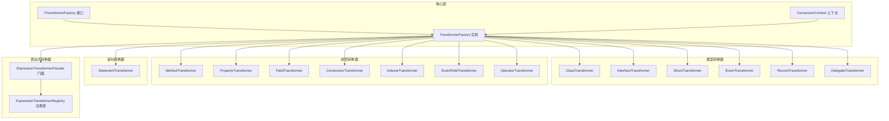
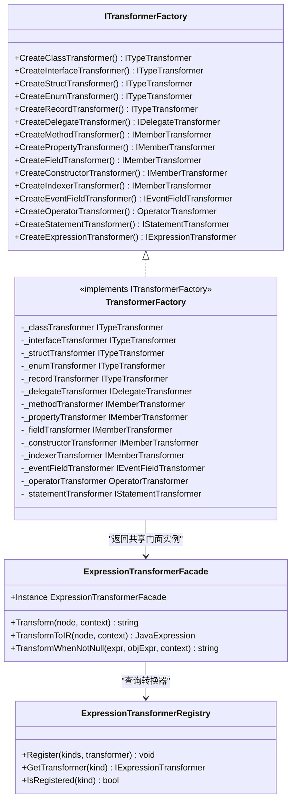
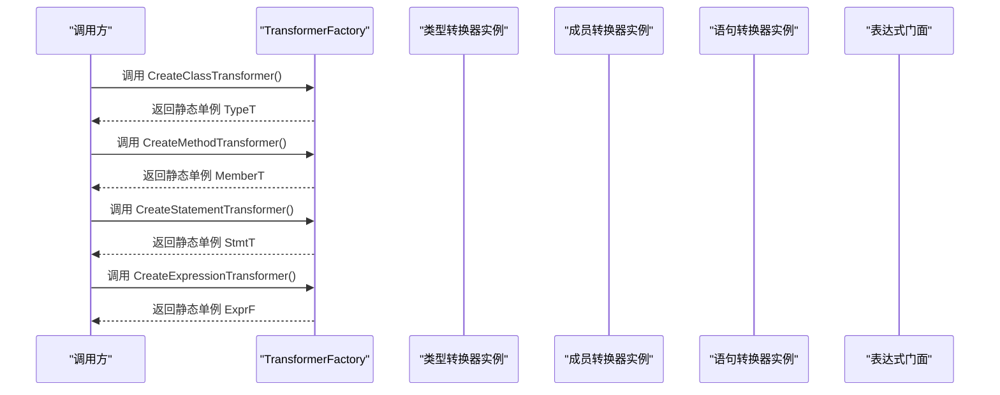
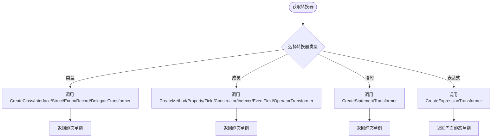
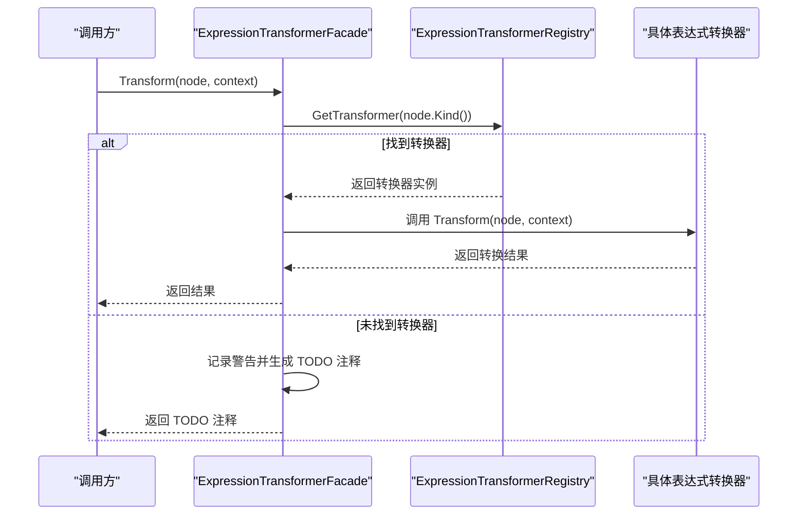
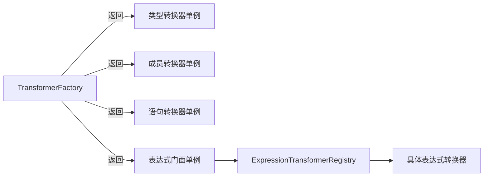

# 转换器工厂

<cite>
**本文引用的文件**
- [TransformerFactory.cs](file://src/CSharpToJava.Core/Transformers/TransformerFactory.cs)
- [ITransformerFactory.cs](file://src/CSharpToJava.Core/Abstractions/ITransformerFactory.cs)
- [ExpressionTransformerFacade.cs](file://src/CSharpToJava.Core/Transformers/Expression/ExpressionTransformerFacade.cs)
- [ExpressionTransformerRegistry.cs](file://src/CSharpToJava.Core/Transformers/Expression/ExpressionTransformerRegistry.cs)
- [ClassTransformer.cs](file://src/CSharpToJava.Core/Transformers/Type/ClassTransformer.cs)
- [InterfaceTransformer.cs](file://src/CSharpToJava.Core/Transformers/Type/InterfaceTransformer.cs)
- [MethodTransformer.cs](file://src/CSharpToJava.Core/Transformers/Member/MethodTransformer.cs)
- [ConversionContext.cs](file://src/CSharpToJava.Core/Context/ConversionContext.cs)
</cite>

## 目录
1. [简介](#简介)
2. [项目结构](#项目结构)
3. [核心组件](#核心组件)
4. [架构总览](#架构总览)
5. [详细组件分析](#详细组件分析)
6. [依赖关系分析](#依赖关系分析)
7. [性能考量](#性能考量)
8. [故障排查指南](#故障排查指南)
9. [结论](#结论)
10. [附录](#附录)

## 简介
本文件围绕 cs2j 转换器工厂展开，系统化阐述 TransformerFactory 的单例设计与工厂方法实现，解释静态转换器实例的创建、管理与共享机制；梳理类型转换器、成员转换器、语句转换器与表达式转换器的工厂方法；阐明工厂模式在转换器生命周期管理中的作用，解释为何所有转换器均为无状态且通过静态单例实现资源高效共享；提供常见转换器获取模式与最佳实践；最后说明工厂方法的扩展机制，指导如何新增转换器类型与集成新的转换逻辑。

## 项目结构
- 工厂与抽象位于 Core 层：
  - 抽象接口 ITransformerFactory 定义了各类转换器的工厂方法契约。
  - 具体实现 TransformerFactory 提供静态单例与工厂方法。
- 表达式转换采用门面 + 注册表模式：
  - ExpressionTransformerFacade 作为表达式转换门面，内部通过 ExpressionTransformerRegistry 动态查找具体转换器。
- 类型与成员转换器分别位于 Type 与 Member 命名空间下，均实现各自的 I*Transformer 接口。
- 转换上下文 ConversionContext 提供类型映射、诊断收集、导入管理等共享状态。

**图表来源**
- [ITransformerFactory.cs:1-33](file://src/CSharpToJava.Core/Abstractions/ITransformerFactory.cs#L1-L33)
- [TransformerFactory.cs:16-58](file://src/CSharpToJava.Core/Transformers/TransformerFactory.cs#L16-L58)
- [ExpressionTransformerFacade.cs:12-86](file://src/CSharpToJava.Core/Transformers/Expression/ExpressionTransformerFacade.cs#L12-L86)
- [ExpressionTransformerRegistry.cs:17-147](file://src/CSharpToJava.Core/Transformers/Expression/ExpressionTransformerRegistry.cs#L17-L147)

**章节来源**
- [ITransformerFactory.cs:1-33](file://src/CSharpToJava.Core/Abstractions/ITransformerFactory.cs#L1-L33)
- [TransformerFactory.cs:16-58](file://src/CSharpToJava.Core/Transformers/TransformerFactory.cs#L16-L58)
- [ExpressionTransformerFacade.cs:12-86](file://src/CSharpToJava.Core/Transformers/Expression/ExpressionTransformerFacade.cs#L12-L86)
- [ExpressionTransformerRegistry.cs:17-147](file://src/CSharpToJava.Core/Transformers/Expression/ExpressionTransformerRegistry.cs#L17-L147)

## 核心组件
- 工厂接口 ITransformerFactory：统一定义类型、成员、语句与表达式转换器的工厂方法，便于依赖注入与测试替身。
- 工厂实现 TransformerFactory：以静态只读字段持有各转换器单例，提供对应的工厂方法，确保全局共享与线程安全。
- 表达式转换门面 ExpressionTransformerFacade：封装表达式转换流程，内部通过注册表动态选择具体转换器。
- 表达式转换注册表 ExpressionTransformerRegistry：集中注册与发现表达式转换器，支持自动发现与内联处理器。

**章节来源**
- [ITransformerFactory.cs:8-32](file://src/CSharpToJava.Core/Abstractions/ITransformerFactory.cs#L8-L32)
- [TransformerFactory.cs:16-58](file://src/CSharpToJava.Core/Transformers/TransformerFactory.cs#L16-L58)
- [ExpressionTransformerFacade.cs:12-86](file://src/CSharpToJava.Core/Transformers/Expression/ExpressionTransformerFacade.cs#L12-L86)
- [ExpressionTransformerRegistry.cs:17-147](file://src/CSharpToJava.Core/Transformers/Expression/ExpressionTransformerRegistry.cs#L17-L147)

## 架构总览
TransformerFactory 采用“静态单例 + 工厂方法”的组合模式：
- 静态单例：在类加载时创建一次，保证内存复用与线程安全。
- 工厂方法：对外暴露创建方法，返回共享实例，避免重复构造。
- 表达式转换采用门面 + 注册表：门面负责调度与回退，注册表负责按语法节点类型分发到具体转换器。

**图表来源**
- [ITransformerFactory.cs:8-32](file://src/CSharpToJava.Core/Abstractions/ITransformerFactory.cs#L8-L32)
- [TransformerFactory.cs:16-58](file://src/CSharpToJava.Core/Transformers/TransformerFactory.cs#L16-L58)
- [ExpressionTransformerFacade.cs:12-86](file://src/CSharpToJava.Core/Transformers/Expression/ExpressionTransformerFacade.cs#L12-L86)
- [ExpressionTransformerRegistry.cs:17-147](file://src/CSharpToJava.Core/Transformers/Expression/ExpressionTransformerRegistry.cs#L17-L147)

## 详细组件分析

### 单例设计与静态共享机制
- 静态字段持有各转换器实例，仅在类加载时初始化一次，确保全局唯一与线程安全。
- 工厂方法直接返回这些静态实例，避免重复构造与内存浪费。
- 该设计适用于无状态转换器，所有转换逻辑依赖传入的上下文对象（如 ConversionContext）进行状态传递。

**图表来源**
- [TransformerFactory.cs:37-57](file://src/CSharpToJava.Core/Transformers/TransformerFactory.cs#L37-L57)

**章节来源**
- [TransformerFactory.cs:18-57](file://src/CSharpToJava.Core/Transformers/TransformerFactory.cs#L18-L57)

### 工厂方法与转换器类型
- 类型转换器：类、接口、结构体、枚举、记录、委托。
- 成员转换器：方法、属性、字段、构造函数、索引器、事件字段、运算符。
- 语句转换器：统一的语句转换器。
- 表达式转换器：通过 ExpressionTransformerFacade 返回共享实例，内部由注册表按语法节点类型分发。

**图表来源**
- [TransformerFactory.cs:37-57](file://src/CSharpToJava.Core/Transformers/TransformerFactory.cs#L37-L57)

**章节来源**
- [ITransformerFactory.cs:10-31](file://src/CSharpToJava.Core/Abstractions/ITransformerFactory.cs#L10-L31)
- [TransformerFactory.cs:37-57](file://src/CSharpToJava.Core/Transformers/TransformerFactory.cs#L37-L57)

### 表达式转换器的门面与注册表
- ExpressionTransformerFacade.Instance 作为全局入口，负责：
  - 按 SyntaxKind 查找对应转换器。
  - 若未注册则发出警告并返回 TODO 注释占位。
  - 支持 Transform 与 TransformToIR 两种输出形式。
- ExpressionTransformerRegistry 负责：
  - 自动发现带特定特性的转换器类型并触发其静态构造完成注册。
  - 内置若干缺失语法节点类型的内联处理器。
  - 提供注册、查询与存在性检查能力。

**图表来源**
- [ExpressionTransformerFacade.cs:28-39](file://src/CSharpToJava.Core/Transformers/Expression/ExpressionTransformerFacade.cs#L28-L39)
- [ExpressionTransformerRegistry.cs:146-147](file://src/CSharpToJava.Core/Transformers/Expression/ExpressionTransformerRegistry.cs#L146-L147)

**章节来源**
- [ExpressionTransformerFacade.cs:12-86](file://src/CSharpToJava.Core/Transformers/Expression/ExpressionTransformerFacade.cs#L12-L86)
- [ExpressionTransformerRegistry.cs:17-147](file://src/CSharpToJava.Core/Transformers/Expression/ExpressionTransformerRegistry.cs#L17-L147)

### 转换器生命周期与无状态设计
- 无状态：转换器不保存任何可变状态，所有行为由输入的语法节点与上下文决定。
- 生命周期：随工厂类加载而创建，随进程结束而销毁，无需手动释放。
- 资源共享：通过静态单例实现跨模块共享，降低内存占用与初始化开销。
- 线程安全：静态只读实例在多线程环境下可安全共享，但需确保上下文对象的正确隔离。

**章节来源**
- [TransformerFactory.cs:12-15](file://src/CSharpToJava.Core/Transformers/TransformerFactory.cs#L12-L15)
- [ConversionContext.cs:14-127](file://src/CSharpToJava.Core/Context/ConversionContext.cs#L14-L127)

### 使用示例与最佳实践
- 获取类型转换器：
  - 示例路径：[TransformerFactory.cs:37-42](file://src/CSharpToJava.Core/Transformers/TransformerFactory.cs#L37-L42)
- 获取成员转换器：
  - 示例路径：[TransformerFactory.cs:44-51](file://src/CSharpToJava.Core/Transformers/TransformerFactory.cs#L44-L51)
- 获取语句转换器：
  - 示例路径：[TransformerFactory.cs:54](file://src/CSharpToJava.Core/Transformers/TransformerFactory.cs#L54)
- 获取表达式转换器：
  - 示例路径：[TransformerFactory.cs:57](file://src/CSharpToJava.Core/Transformers/TransformerFactory.cs#L57)
- 在类型/成员转换器中使用工厂：
  - 类型转换器内部创建工厂并获取成员转换器：
    - 示例路径：[InterfaceTransformer.cs:72-76](file://src/CSharpToJava.Core/Transformers/Type/InterfaceTransformer.cs#L72-L76)
  - 方法转换器中使用表达式门面：
    - 示例路径：[MethodTransformer.cs:157](file://src/CSharpToJava.Core/Transformers/Member/MethodTransformer.cs#L157)

最佳实践：
- 优先使用工厂方法获取转换器，避免直接 new。
- 对于表达式转换，尽量依赖注册表自动发现，减少硬编码。
- 通过 ConversionContext 传递共享状态，避免在转换器中维护局部状态。

**章节来源**
- [TransformerFactory.cs:37-57](file://src/CSharpToJava.Core/Transformers/TransformerFactory.cs#L37-L57)
- [InterfaceTransformer.cs:72-76](file://src/CSharpToJava.Core/Transformers/Type/InterfaceTransformer.cs#L72-L76)
- [MethodTransformer.cs:157](file://src/CSharpToJava.Core/Transformers/Member/MethodTransformer.cs#L157)

### 扩展机制：新增转换器类型与集成新逻辑
- 新增表达式转换器：
  - 定义转换器类并实现 IExpressionTransformer 或 IIRExpressionTransformer。
  - 在静态构造中调用注册表的 Register 方法，或通过特性标记以启用自动发现。
  - 示例参考注册表的内联处理器注册方式：
    - 示例路径：[ExpressionTransformerRegistry.cs:24-32](file://src/CSharpToJava.Core/Transformers/Expression/ExpressionTransformerRegistry.cs#L24-L32)
    - 示例路径：[ExpressionTransformerRegistry.cs:130-139](file://src/CSharpToJava.Core/Transformers/Expression/ExpressionTransformerRegistry.cs#L130-L139)
- 新增类型/成员转换器：
  - 实现相应 I*Transformer 接口。
  - 在工厂中添加静态字段与工厂方法，保持单例与共享。
  - 示例路径：[ITransformerFactory.cs:10-25](file://src/CSharpToJava.Core/Abstractions/ITransformerFactory.cs#L10-L25)，[TransformerFactory.cs:19-51](file://src/CSharpToJava.Core/Transformers/TransformerFactory.cs#L19-L51)
- 集成转换逻辑：
  - 在目标转换器内部通过工厂方法获取所需子转换器。
  - 示例路径：[ClassTransformer.cs:1380-1391](file://src/CSharpToJava.Core/Transformers/Type/ClassTransformer.cs#L1380-L1391)，[StructTransformer.cs:664-684](file://src/CSharpToJava.Core/Transformers/Type/StructTransformer.cs#L664-L684)

**章节来源**
- [ExpressionTransformerRegistry.cs:24-32](file://src/CSharpToJava.Core/Transformers/Expression/ExpressionTransformerRegistry.cs#L24-L32)
- [ExpressionTransformerRegistry.cs:130-139](file://src/CSharpToJava.Core/Transformers/Expression/ExpressionTransformerRegistry.cs#L130-L139)
- [ITransformerFactory.cs:10-25](file://src/CSharpToJava.Core/Abstractions/ITransformerFactory.cs#L10-L25)
- [TransformerFactory.cs:19-51](file://src/CSharpToJava.Core/Transformers/TransformerFactory.cs#L19-L51)
- [ClassTransformer.cs:1380-1391](file://src/CSharpToJava.Core/Transformers/Type/ClassTransformer.cs#L1380-L1391)
- [StructTransformer.cs:664-684](file://src/CSharpToJava.Core/Transformers/Type/StructTransformer.cs#L664-L684)

## 依赖关系分析
- 工厂对转换器的依赖是“只读共享”，通过静态字段持有，耦合度低、内聚性强。
- 表达式转换器依赖注册表进行动态分发，注册表通过反射自动发现转换器，降低维护成本。
- 转换器之间通过工厂解耦，避免循环依赖与紧耦合。

**图表来源**
- [TransformerFactory.cs:19-57](file://src/CSharpToJava.Core/Transformers/TransformerFactory.cs#L19-L57)
- [ExpressionTransformerRegistry.cs:17-147](file://src/CSharpToJava.Core/Transformers/Expression/ExpressionTransformerRegistry.cs#L17-L147)

**章节来源**
- [TransformerFactory.cs:19-57](file://src/CSharpToJava.Core/Transformers/TransformerFactory.cs#L19-L57)
- [ExpressionTransformerRegistry.cs:17-147](file://src/CSharpToJava.Core/Transformers/Expression/ExpressionTransformerRegistry.cs#L17-L147)

## 性能考量
- 静态单例避免重复构造，降低 GC 压力与启动时间。
- 无状态设计提升并发安全性，减少锁竞争。
- 表达式转换注册表使用并发字典，查询效率高；自动发现减少硬编码带来的维护成本。
- 建议：
  - 保持转换器无状态，避免缓存跨请求的状态。
  - 合理使用 ConversionContext 的导入与类型映射缓存，避免重复计算。

## 故障排查指南
- 表达式转换器未注册：
  - 现象：返回 TODO 注释或警告。
  - 排查：确认转换器是否已通过特性标记或显式注册；检查注册表初始化是否执行。
  - 参考路径：[ExpressionTransformerFacade.cs:33-37](file://src/CSharpToJava.Core/Transformers/Expression/ExpressionTransformerFacade.cs#L33-L37)，[ExpressionTransformerRegistry.cs:146-147](file://src/CSharpToJava.Core/Transformers/Expression/ExpressionTransformerRegistry.cs#L146-L147)
- 类型映射错误导致的转换失败：
  - 现象：类型映射为空或错误。
  - 排查：检查 ConversionContext 的类型映射服务与导入集合。
  - 参考路径：[ConversionContext.cs:113-127](file://src/CSharpToJava.Core/Context/ConversionContext.cs#L113-L127)，[ConversionContext.cs:190](file://src/CSharpToJava.Core/Context/ConversionContext.cs#L190)
- 重复注册警告：
  - 现象：调试输出重复注册提示。
  - 排查：检查注册逻辑，避免同一 SyntaxKind 多次注册。
  - 参考路径：[ExpressionTransformerRegistry.cs:134-137](file://src/CSharpToJava.Core/Transformers/Expression/ExpressionTransformerRegistry.cs#L134-L137)

**章节来源**
- [ExpressionTransformerFacade.cs:33-37](file://src/CSharpToJava.Core/Transformers/Expression/ExpressionTransformerFacade.cs#L33-L37)
- [ExpressionTransformerRegistry.cs:134-137](file://src/CSharpToJava.Core/Transformers/Expression/ExpressionTransformerRegistry.cs#L134-L137)
- [ConversionContext.cs:113-127](file://src/CSharpToJava.Core/Context/ConversionContext.cs#L113-L127)
- [ConversionContext.cs:190](file://src/CSharpToJava.Core/Context/ConversionContext.cs#L190)

## 结论
TransformerFactory 通过静态单例与工厂方法实现了转换器的高效共享与统一管理，结合表达式转换的门面与注册表模式，形成了清晰、可扩展且易于维护的转换体系。无状态设计与上下文驱动使转换器具备良好的并发安全性与可测试性。遵循本文的最佳实践与扩展机制，可平滑地新增转换器类型并集成新的转换逻辑。

## 附录
- 关键实现路径速览：
  - 工厂接口与实现：[ITransformerFactory.cs:8-32](file://src/CSharpToJava.Core/Abstractions/ITransformerFactory.cs#L8-L32)，[TransformerFactory.cs:16-58](file://src/CSharpToJava.Core/Transformers/TransformerFactory.cs#L16-L58)
  - 表达式门面与注册表：[ExpressionTransformerFacade.cs:12-86](file://src/CSharpToJava.Core/Transformers/Expression/ExpressionTransformerFacade.cs#L12-L86)，[ExpressionTransformerRegistry.cs:17-147](file://src/CSharpToJava.Core/Transformers/Expression/ExpressionTransformerRegistry.cs#L17-L147)
  - 类型/成员转换器使用工厂：[ClassTransformer.cs:1380-1391](file://src/CSharpToJava.Core/Transformers/Type/ClassTransformer.cs#L1380-L1391)，[StructTransformer.cs:664-684](file://src/CSharpToJava.Core/Transformers/Type/StructTransformer.cs#L664-L684)，[InterfaceTransformer.cs:72-76](file://src/CSharpToJava.Core/Transformers/Type/InterfaceTransformer.cs#L72-L76)，[MethodTransformer.cs:157](file://src/CSharpToJava.Core/Transformers/Member/MethodTransformer.cs#L157)
  - 转换上下文：[ConversionContext.cs:14-127](file://src/CSharpToJava.Core/Context/ConversionContext.cs#L14-L127)