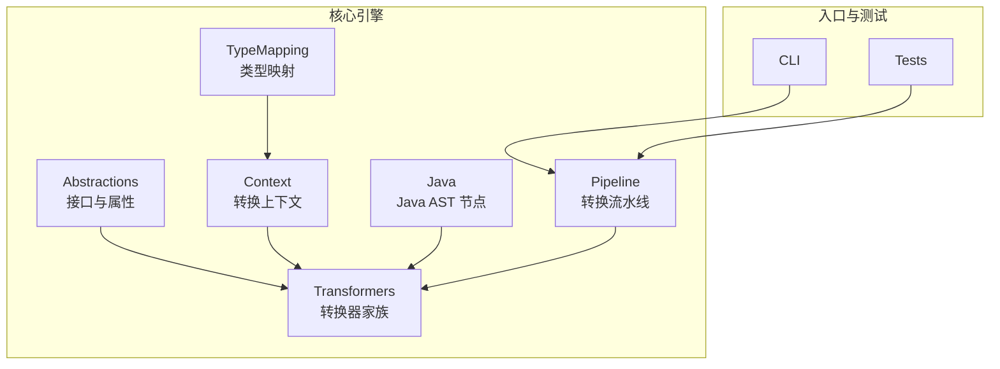
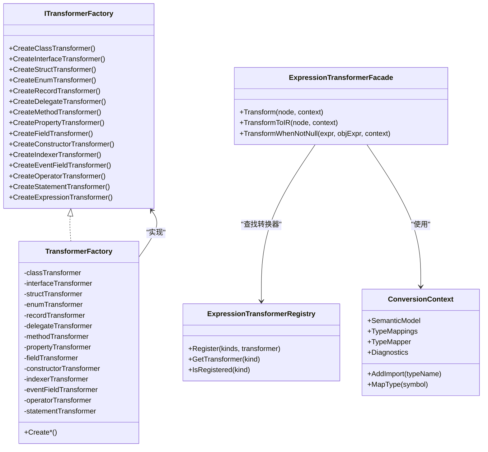
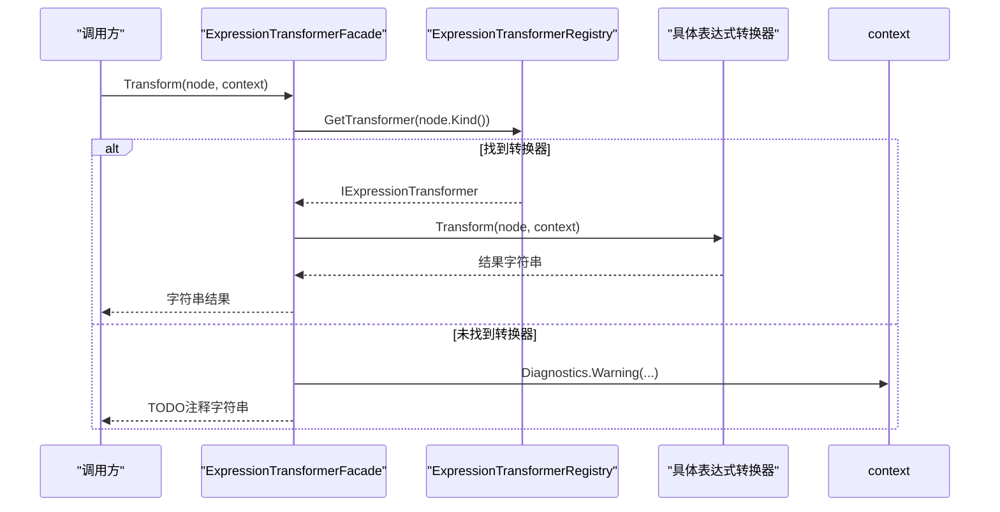
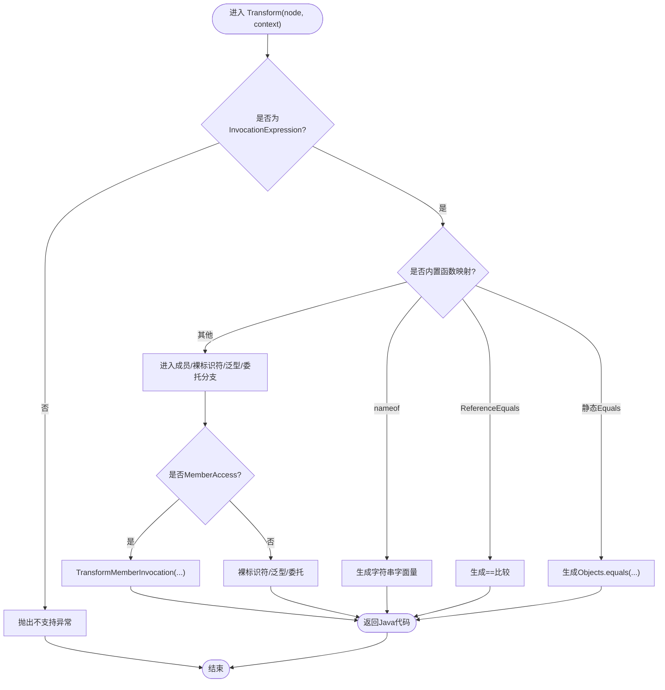
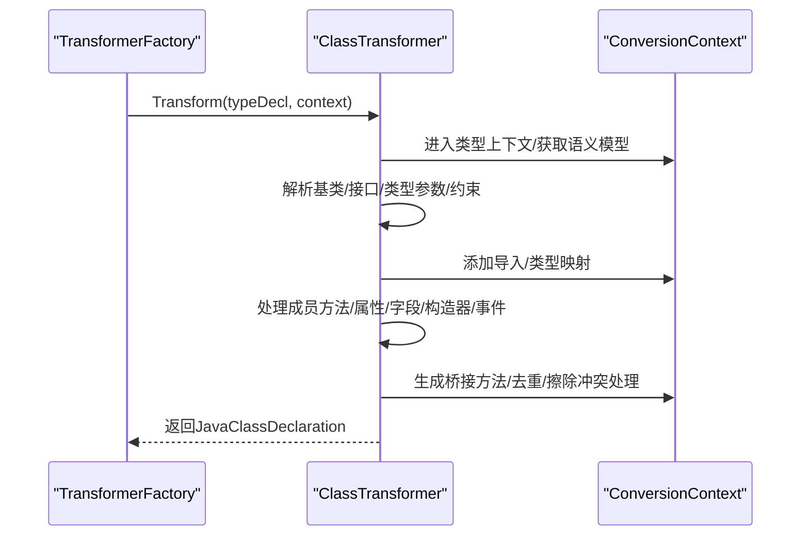
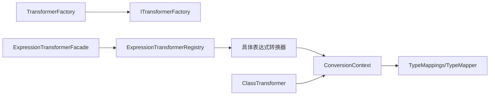

# 转换器系统

<cite>
**本文引用的文件**
- [TransformerFactory.cs](file://src/CSharpToJava.Core/Transformers/TransformerFactory.cs)
- [ITransformerFactory.cs](file://src/CSharpToJava.Core/Abstractions/ITransformerFactory.cs)
- [ITransformer.cs](file://src/CSharpToJava.Core/Abstractions/ITransformer.cs)
- [ExpressionTransformerFacade.cs](file://src/CSharpToJava.Core/Transformers/Expression/ExpressionTransformerFacade.cs)
- [ExpressionTransformerRegistry.cs](file://src/CSharpToJava.Core/Transformers/Expression/ExpressionTransformerRegistry.cs)
- [LiteralExpressionTransformer.cs](file://src/CSharpToJava.Core/Transformers/Expression/Transformers/LiteralExpressionTransformer.cs)
- [InvocationExpressionTransformer.cs](file://src/CSharpToJava.Core/Transformers/Expression/Transformers/InvocationExpressionTransformer.cs)
- [ConversionContext.cs](file://src/CSharpToJava.Core/Context/ConversionContext.cs)
- [JavaSyntaxNode.cs](file://src/CSharpToJava.Core/Java/JavaSyntaxNode.cs)
- [ClassTransformer.cs](file://src/CSharpToJava.Core/Transformers/Type/ClassTransformer.cs)
- [ExpressionTransformerHelpers.cs](file://src/CSharpToJava.Core/Transformers/Expression/Utilities/ExpressionTransformerHelpers.cs)
- [README.md](file://README.md)
- [DelegateTransformerTests.cs](file://tests/CSharpToJava.Tests/DelegateTransformerTests.cs)
</cite>

## 目录
1. [简介](#简介)
2. [项目结构](#项目结构)
3. [核心组件](#核心组件)
4. [架构总览](#架构总览)
5. [详细组件分析](#详细组件分析)
6. [依赖关系分析](#依赖关系分析)
7. [性能考量](#性能考量)
8. [故障排查指南](#故障排查指南)
9. [结论](#结论)
10. [附录](#附录)

## 简介
本文件面向cs2j转换器系统，系统基于Roslyn解析C#语法树，通过“转换器”将C#语言特性映射到Java。本文重点阐述以下内容：
- TransformerFactory的设计与工厂方法：如何创建、注册与复用各类转换器实例
- 表达式、语句、类型转换器的实现原理：转换策略、上下文传递、结果生成
- 扩展机制：如何开发自定义转换器并接入注册体系
- 典型用法示例：表达式重写、语句块转换、类型映射
- 设计考虑：错误处理、性能优化、调试支持

## 项目结构
cs2j采用分层与按职责划分的组织方式：
- Abstractions：抽象接口与公共契约（如ITransformer、ITransformerFactory）
- Context：转换上下文与诊断、导入管理、类型映射服务等
- Java：Java侧AST节点与生成物模型
- Transformers：转换器家族（类型、成员、语句、表达式）
- Pipeline：转换流水线与项目级编排
- TypeMapping：类型映射配置与索引
- CLI与Tests：命令行工具与测试套件

章节来源
- [README.md:64-74](file://README.md#L64-L74)

## 核心组件
- ITransformer与派生接口：统一表达“将某类语法节点转换为另一类目标”的能力，涵盖表达式、语句、类型、成员、委托、事件字段等
- ITransformerFactory：集中创建与复用转换器实例，确保无状态转换器的单例共享
- ExpressionTransformerFacade：表达式转换门面，负责根据SyntaxKind路由到具体转换器，并提供IR与字符串两种输出路径
- ExpressionTransformerRegistry：表达式转换器注册中心，支持自动发现与内联处理器注册
- ConversionContext：贯穿转换全过程的状态容器，承载诊断、导入、类型映射、方法状态等
- JavaSyntaxNode：Java侧AST节点基类与集合包装

章节来源
- [ITransformer.cs:12-86](file://src/CSharpToJava.Core/Abstractions/ITransformer.cs#L12-L86)
- [ITransformerFactory.cs:8-32](file://src/CSharpToJava.Core/Abstractions/ITransformerFactory.cs#L8-L32)
- [TransformerFactory.cs:16-58](file://src/CSharpToJava.Core/Transformers/TransformerFactory.cs#L16-L58)
- [ExpressionTransformerFacade.cs:12-86](file://src/CSharpToJava.Core/Transformers/Expression/ExpressionTransformerFacade.cs#L12-L86)
- [ExpressionTransformerRegistry.cs:17-147](file://src/CSharpToJava.Core/Transformers/Expression/ExpressionTransformerRegistry.cs#L17-L147)
- [ConversionContext.cs:14-233](file://src/CSharpToJava.Core/Context/ConversionContext.cs#L14-L233)
- [JavaSyntaxNode.cs:6-32](file://src/CSharpToJava.Core/Java/JavaSyntaxNode.cs#L6-L32)

## 架构总览
转换器系统遵循“工厂 + 注册 + 门面”的架构：
- 工厂：TransformerFactory集中持有各转换器单例，提供统一创建入口
- 注册：ExpressionTransformerRegistry通过静态构造与特性标注实现自动发现与注册
- 门面：ExpressionTransformerFacade统一调度表达式转换，兼顾IR与字符串输出
- 上下文：ConversionContext贯穿所有转换器，提供语义模型、类型映射、导入管理、诊断收集等

图表来源
- [TransformerFactory.cs:16-58](file://src/CSharpToJava.Core/Transformers/TransformerFactory.cs#L16-L58)
- [ITransformerFactory.cs:8-32](file://src/CSharpToJava.Core/Abstractions/ITransformerFactory.cs#L8-L32)
- [ExpressionTransformerRegistry.cs:17-147](file://src/CSharpToJava.Core/Transformers/Expression/ExpressionTransformerRegistry.cs#L17-L147)
- [ExpressionTransformerFacade.cs:12-86](file://src/CSharpToJava.Core/Transformers/Expression/ExpressionTransformerFacade.cs#L12-L86)
- [ConversionContext.cs:14-233](file://src/CSharpToJava.Core/Context/ConversionContext.cs#L14-L233)

## 详细组件分析

### 表达式转换器：门面与注册
- 门面职责
  - 根据SyntaxKind从注册表获取转换器
  - 若未注册，记录警告并返回TODO注释
  - 提供TransformToIR：优先调用IIRExpressionTransformer，否则回退为字符串包裹并推断类型
  - 提供TransformWhenNotNull：对条件访问表达式进行链式重写，含属性到方法映射、LINQ流式处理等
- 注册机制
  - 自动发现：扫描带[TransformerRegistration]特性的转换器类型，触发其静态构造完成注册
  - 内联处理器：对缺失专用转换器的SyntaxKind（如元组、声明表达式、栈分配数组等）直接注册委托处理器
  - 去重告警：重复注册在调试构建中发出警告

图表来源
- [ExpressionTransformerFacade.cs:28-39](file://src/CSharpToJava.Core/Transformers/Expression/ExpressionTransformerFacade.cs#L28-L39)
- [ExpressionTransformerRegistry.cs:146-147](file://src/CSharpToJava.Core/Transformers/Expression/ExpressionTransformerRegistry.cs#L146-L147)

章节来源
- [ExpressionTransformerFacade.cs:12-239](file://src/CSharpToJava.Core/Transformers/Expression/ExpressionTransformerFacade.cs#L12-L239)
- [ExpressionTransformerRegistry.cs:17-167](file://src/CSharpToJava.Core/Transformers/Expression/ExpressionTransformerRegistry.cs#L17-L167)

### 表达式转换器示例：字面量与调用
- 字面量转换器（LiteralExpressionTransformer）
  - 实现IIRExpressionTransformer，支持数字、字符串、字符、null、true/false、UTF-8字符串等
  - 关键点：数字后缀映射（f/d/m/ul/lu/u/l）、长整型溢出处理（BigInteger）、原始字符串与verbatim字符串处理、字符转义
- 方法调用转换器（InvocationExpressionTransformer）
  - 支持静态相等、ReferenceEquals、枚举HasFlag、字符串比较/包含/索引等特殊映射
  - 支持委托调用（SAM方法推断）、泛型方法名映射、类型擦除冲突处理、参数列表复杂度检测（命名参数/ref/out/in）

图表来源
- [InvocationExpressionTransformer.cs:44-338](file://src/CSharpToJava.Core/Transformers/Expression/Transformers/InvocationExpressionTransformer.cs#L44-L338)

章节来源
- [LiteralExpressionTransformer.cs:17-213](file://src/CSharpToJava.Core/Transformers/Expression/Transformers/LiteralExpressionTransformer.cs#L17-L213)
- [InvocationExpressionTransformer.cs:16-800](file://src/CSharpToJava.Core/Transformers/Expression/Transformers/InvocationExpressionTransformer.cs#L16-L800)

### 语句转换器：统一入口
- IStatementTransformer接口定义了将C#语句语法节点转换为Java语法节点的能力
- TransformerFactory提供CreateStatementTransformer()统一创建入口
- 具体实现位于Transformers/Statement目录，配合ConversionContext进行上下文传递与导入管理

章节来源
- [ITransformer.cs:24-26](file://src/CSharpToJava.Core/Abstractions/ITransformer.cs#L24-L26)
- [TransformerFactory.cs:34-54](file://src/CSharpToJava.Core/Transformers/TransformerFactory.cs#L34-L54)

### 类型转换器：类、接口、结构、枚举、记录、委托
- ITypeTransformer接口定义了将C#类型声明转换为Java类型声明的能力
- TransformerFactory提供CreateClassTransformer、CreateInterfaceTransformer、CreateStructTransformer、CreateEnumTransformer、CreateRecordTransformer、CreateDelegateTransformer
- ClassTransformer展示了完整的类转换流程：修饰符映射、基类与接口处理、泛型约束、部分类型合并、桥接方法生成、导入与类型擦除冲突规避等

图表来源
- [TransformerFactory.cs:37-42](file://src/CSharpToJava.Core/Transformers/TransformerFactory.cs#L37-L42)
- [ClassTransformer.cs:257-445](file://src/CSharpToJava.Core/Transformers/Type/ClassTransformer.cs#L257-L445)

章节来源
- [ITransformer.cs:52-54](file://src/CSharpToJava.Core/Abstractions/ITransformer.cs#L52-L54)
- [TransformerFactory.cs:18-42](file://src/CSharpToJava.Core/Transformers/TransformerFactory.cs#L18-L42)
- [ClassTransformer.cs:16-800](file://src/CSharpToJava.Core/Transformers/Type/ClassTransformer.cs#L16-L800)

### 成员转换器与事件字段转换器
- IMemberTransformer、IEventFieldTransformer分别负责成员与事件字段的转换
- TransformerFactory提供对应创建方法，用于在类型转换过程中按需获取

章节来源
- [ITransformer.cs:59-78](file://src/CSharpToJava.Core/Abstractions/ITransformer.cs#L59-L78)
- [TransformerFactory.cs:26-51](file://src/CSharpToJava.Core/Transformers/TransformerFactory.cs#L26-L51)

### 转换器扩展机制：开发自定义转换器
- 开发步骤
  - 实现相应接口：IExpressionTransformer/IIRExpressionTransformer（表达式），IStatementTransformer（语句），ITypeTransformer/IMemberTransformer（类型与成员）
  - 在静态构造函数中通过ExpressionTransformerRegistry.Register或使用[TransformerRegistration]特性触发自动注册
  - 在Transform/TransformToIR中读取ConversionContext，结合TypeMappings与SemanticModel进行转换
- 示例参考
  - 字面量转换器：演示了[TransformerRegistration]与静态构造注册、IIRExpressionTransformer输出IR节点
  - 调用转换器：演示了复杂分支与内置函数映射、参数复杂度检测、SAM推断等

章节来源
- [LiteralExpressionTransformer.cs:19-32](file://src/CSharpToJava.Core/Transformers/Expression/Transformers/LiteralExpressionTransformer.cs#L19-L32)
- [InvocationExpressionTransformer.cs:18-24](file://src/CSharpToJava.Core/Transformers/Expression/Transformers/InvocationExpressionTransformer.cs#L18-L24)
- [ExpressionTransformerRegistry.cs:24-32](file://src/CSharpToJava.Core/Transformers/Expression/ExpressionTransformerRegistry.cs#L24-L32)

### 上下文传递与结果生成
- ConversionContext提供：
  - 语义模型SemanticModel与类型映射TypeMappings
  - 导入管理AddImport与类型缓存TypeCache
  - 方法级状态MethodState（前置/后置语句、out/ref持有者、流变量等）
  - 诊断收集Diagnostics与命名空间/类型/方法栈
- 结果生成：
  - 表达式：字符串或Java.JavaExpression（IR）
  - 语句：Java.JavaSyntaxNode
  - 类型：Java.JavaTypeDeclaration

章节来源
- [ConversionContext.cs:14-233](file://src/CSharpToJava.Core/Context/ConversionContext.cs#L14-L233)
- [JavaSyntaxNode.cs:6-32](file://src/CSharpToJava.Core/Java/JavaSyntaxNode.cs#L6-L32)

## 依赖关系分析
- 组件耦合
  - TransformerFactory与各转换器实现为弱耦合：仅依赖接口；通过静态单例共享实例
  - ExpressionTransformerFacade依赖ExpressionTransformerRegistry进行动态路由
  - 各转换器依赖ConversionContext进行语义分析与类型映射
- 可能的循环依赖
  - 未见直接循环依赖；门面与注册表之间为单向依赖
- 外部依赖
  - Roslyn（Microsoft.CodeAnalysis）用于语法与语义分析
  - JSON配置驱动类型映射（TypeMappings.json）

图表来源
- [TransformerFactory.cs:16-58](file://src/CSharpToJava.Core/Transformers/TransformerFactory.cs#L16-L58)
- [ExpressionTransformerFacade.cs:12-86](file://src/CSharpToJava.Core/Transformers/Expression/ExpressionTransformerFacade.cs#L12-L86)
- [ExpressionTransformerRegistry.cs:17-147](file://src/CSharpToJava.Core/Transformers/Expression/ExpressionTransformerRegistry.cs#L17-L147)
- [ConversionContext.cs:14-233](file://src/CSharpToJava.Core/Context/ConversionContext.cs#L14-L233)

## 性能考量
- 单例与共享：所有转换器均为无状态对象，通过静态单例共享，减少GC与初始化开销
- 注册表并发：ExpressionTransformerRegistry使用ConcurrentDictionary，保证高并发下的查找与注册安全
- 语义模型缓存：ConversionContext维护TypeCache与Import缓存，避免重复计算
- 条件访问链重写：ExpressionTransformerFacade.TransformWhenNotNull对常见链路进行优化，减少不必要的字符串拼接
- 数值类型适配：ExpressionTransformerHelpers.AdaptExpressionToTargetType在必要时插入显式转换，避免运行期装箱/拆箱

章节来源
- [TransformerFactory.cs:18-24](file://src/CSharpToJava.Core/Transformers/TransformerFactory.cs#L18-L24)
- [ExpressionTransformerRegistry.cs:19](file://src/CSharpToJava.Core/Transformers/Expression/ExpressionTransformerRegistry.cs#L19)
- [ExpressionTransformerHelpers.cs:35-114](file://src/CSharpToJava.Core/Transformers/Expression/Utilities/ExpressionTransformerHelpers.cs#L35-L114)

## 故障排查指南
- 未注册的表达式种类
  - 现象：生成TODO注释
  - 排查：确认SyntaxKind是否已在ExpressionTransformerRegistry注册；必要时添加内联处理器或实现专用转换器
- 语义模型不可用
  - 现象：类型推断失败、导入缺失
  - 排查：检查ConversionContext.SemanticModel是否设置；在合成树场景下回退到当前SemanticModel
- 类型映射缺失
  - 现象：生成Object或导入不完整
  - 排查：核对TypeMappings配置；使用ConversionContext.MapTypeFromSyntax进行语法级映射
- 泛型与类型擦除冲突
  - 现象：编译报错或运行时行为不符
  - 排查：ClassTransformer会自动提取冲突接口为工厂方法；检查生成的桥接方法与泛型实参
- 调试支持
  - 使用ConversionContext.Diagnostics.Warning记录警告；启用CLI选项显示诊断信息

章节来源
- [ExpressionTransformerFacade.cs:33-36](file://src/CSharpToJava.Core/Transformers/Expression/ExpressionTransformerFacade.cs#L33-L36)
- [ConversionContext.cs:196-207](file://src/CSharpToJava.Core/Context/ConversionContext.cs#L196-L207)
- [ClassTransformer.cs:138-175](file://src/CSharpToJava.Core/Transformers/Type/ClassTransformer.cs#L138-L175)

## 结论
cs2j转换器系统通过“工厂 + 注册 + 门面 + 上下文”的组合，实现了可扩展、可维护、高性能的C#到Java转换能力。表达式转换器采用自动注册与内联处理器机制，覆盖广泛语法；类型转换器（尤其是类转换器）处理了复杂的继承、接口、泛型与桥接问题；上下文贯穿始终，提供语义分析、类型映射与诊断能力。开发者可通过实现相应接口与注册机制快速扩展新转换逻辑。

## 附录

### 使用示例（路径引用）
- 表达式重写（字面量）
  - [LiteralExpressionTransformer.cs:37-114](file://src/CSharpToJava.Core/Transformers/Expression/Transformers/LiteralExpressionTransformer.cs#L37-L114)
- 表达式重写（调用）
  - [InvocationExpressionTransformer.cs:164-338](file://src/CSharpToJava.Core/Transformers/Expression/Transformers/InvocationExpressionTransformer.cs#L164-L338)
- 语句块转换
  - [ITransformer.cs:24](file://src/CSharpToJava.Core/Abstractions/ITransformer.cs#L24)
  - [TransformerFactory.cs:54](file://src/CSharpToJava.Core/Transformers/TransformerFactory.cs#L54)
- 类型映射（类）
  - [ClassTransformer.cs:257-445](file://src/CSharpToJava.Core/Transformers/Type/ClassTransformer.cs#L257-L445)
- 委托转换（测试）
  - [DelegateTransformerTests.cs:14-83](file://tests/CSharpToJava.Tests/DelegateTransformerTests.cs#L14-L83)