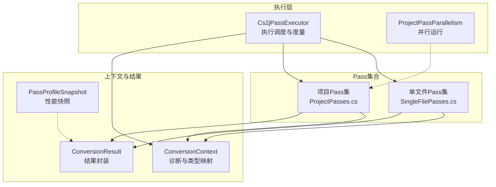
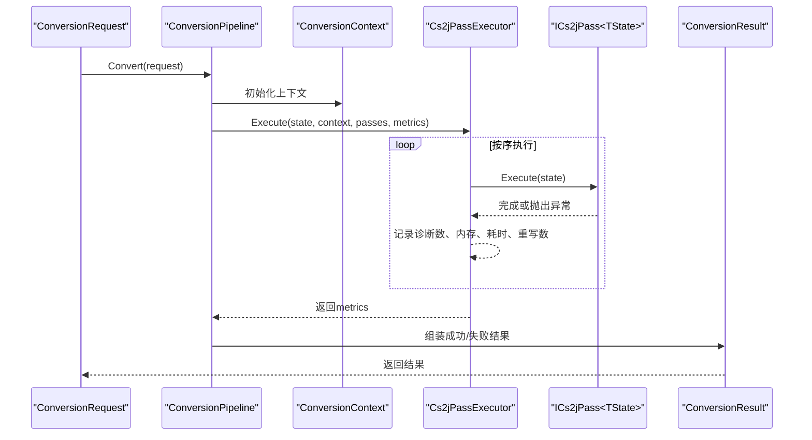
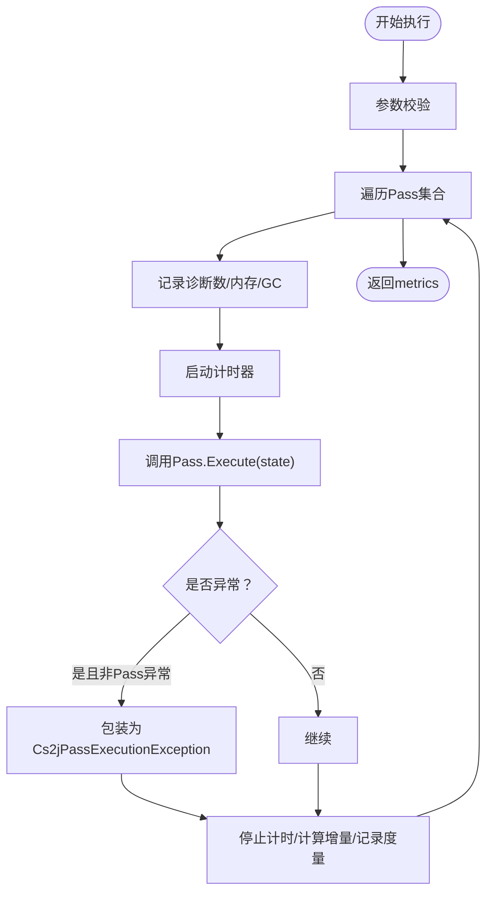
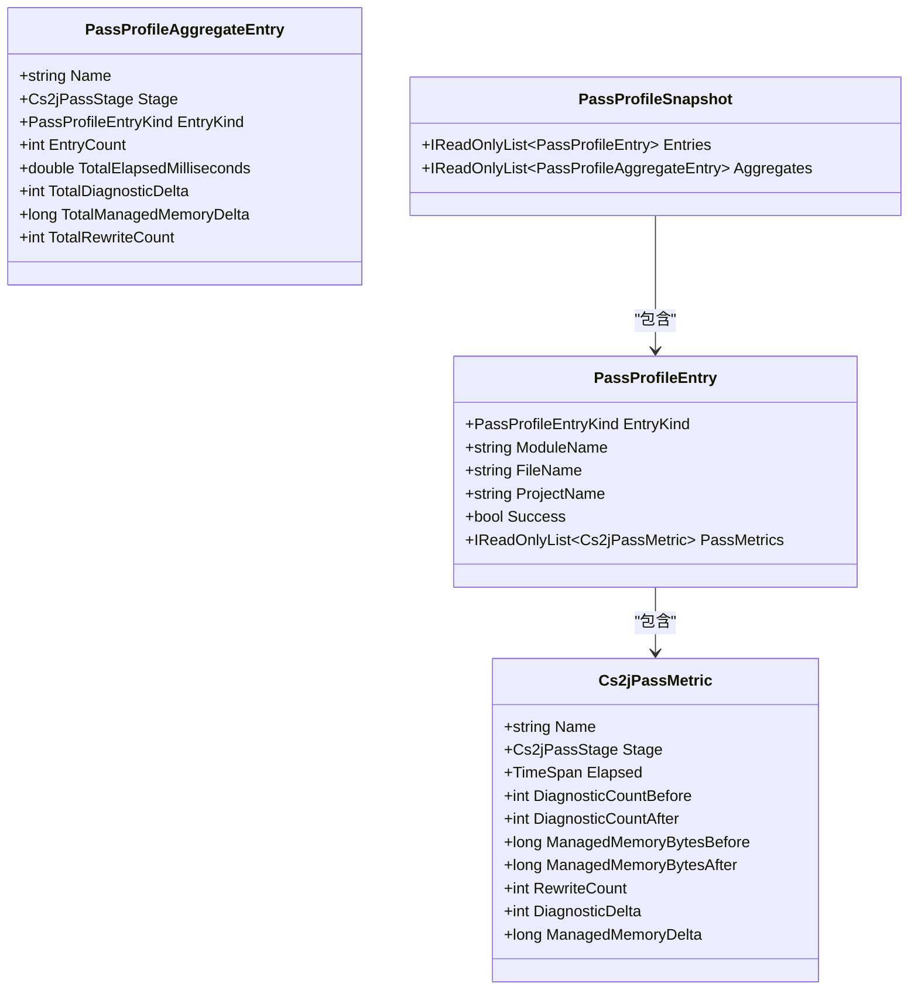
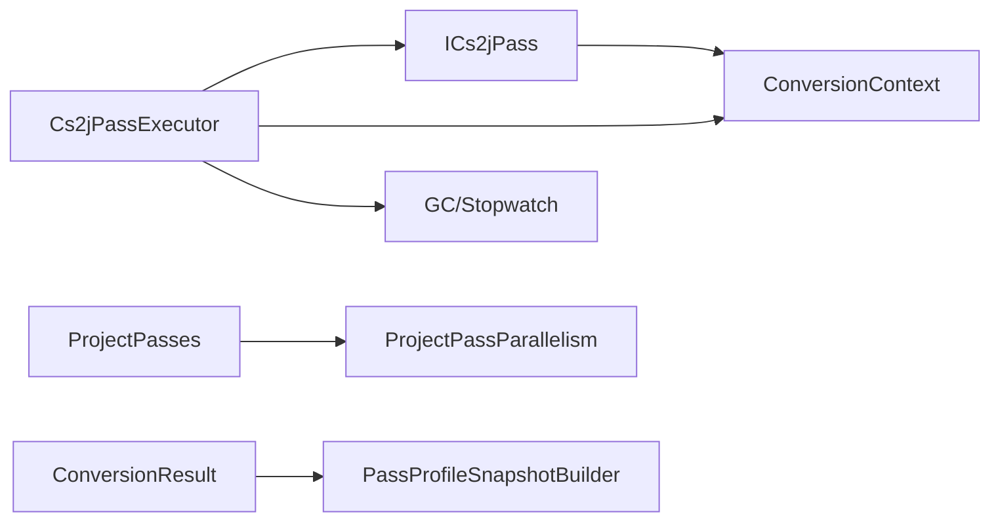

# Pass执行机制

<cite>
**本文引用的文件**
- [Cs2jPassInfrastructure.cs](file://src/CSharpToJava.Core/Pipeline/Passes/Cs2jPassInfrastructure.cs)
- [ProjectPasses.cs](file://src/CSharpToJava.Core/Pipeline/Passes/ProjectPasses.cs)
- [SingleFilePasses.cs](file://src/CSharpToJava.Core/Pipeline/Passes/SingleFilePasses.cs)
- [ProjectPassParallelism.cs](file://src/CSharpToJava.Core/Pipeline/Passes/ProjectPassParallelism.cs)
- [PassProfileSnapshot.cs](file://src/CSharpToJava.Core/Pipeline/Planning/PassProfileSnapshot.cs)
- [ConversionPipeline.cs](file://src/CSharpToJava.Core/Pipeline/ConversionPipeline.cs)
- [ConversionContext.cs](file://src/CSharpToJava.Core/Context/ConversionContext.cs)
- [Phase2PassPipelineTests.cs](file://tests/CSharpToJava.Tests/Phase2PassPipelineTests.cs)
- [PlanningTests.cs](file://tests/CSharpToJava.Tests/PlanningTests.cs)
</cite>

## 目录
1. [简介](#简介)
2. [项目结构](#项目结构)
3. [核心组件](#核心组件)
4. [架构总览](#架构总览)
5. [详细组件分析](#详细组件分析)
6. [依赖关系分析](#依赖关系分析)
7. [性能考量](#性能考量)
8. [故障排查指南](#故障排查指南)
9. [结论](#结论)
10. [附录：自定义Pass开发指南](#附录自定义pass开发指南)

## 简介
本文件系统性阐述cs2j的Pass执行机制，重点覆盖以下方面：
- Cs2jPassExecutor的核心职责：Pass注册、调度、执行顺序控制与性能监控
- Pass接口设计：ICs2jPass泛型接口、PassState状态管理、ICs2jPassContext上下文机制
- 生命周期管理：初始化、执行、错误处理、清理
- 并行化策略与性能优化：ProjectPassParallelism并行运行、Cs2jPassMetric度量采集、PassProfileSnapshot性能分析
- 自定义Pass开发示例：接口实现、状态访问、错误报告
- 调试与故障排除：执行日志记录、性能分析工具使用

## 项目结构
cs2j的Pass执行机制主要分布在以下模块：
- 核心执行与接口：src/CSharpToJava.Core/Pipeline/Passes/Cs2jPassInfrastructure.cs
- 单文件与项目级Pass：src/CSharpToJava.Core/Pipeline/Passes/SingleFilePasses.cs、ProjectPasses.cs
- 并行化支持：src/CSharpToJava.Core/Pipeline/Passes/ProjectPassParallelism.cs
- 性能分析与快照：src/CSharpToJava.Core/Pipeline/Planning/PassProfileSnapshot.cs
- 转换管道与上下文：src/CSharpToJava.Core/Pipeline/ConversionPipeline.cs、src/CSharpToJava.Core/Context/ConversionContext.cs
- 测试用例：tests/CSharpToJava.Tests/Phase2PassPipelineTests.cs、PlanningTests.cs

图表来源
- [Cs2jPassInfrastructure.cs:53-99](file://src/CSharpToJava.Core/Pipeline/Passes/Cs2jPassInfrastructure.cs#L53-L99)
- [SingleFilePasses.cs:1-334](file://src/CSharpToJava.Core/Pipeline/Passes/SingleFilePasses.cs#L1-L334)
- [ProjectPasses.cs:1-699](file://src/CSharpToJava.Core/Pipeline/Passes/ProjectPasses.cs#L1-L699)
- [ProjectPassParallelism.cs:3-32](file://src/CSharpToJava.Core/Pipeline/Passes/ProjectPassParallelism.cs#L3-L32)
- [ConversionPipeline.cs:67-443](file://src/CSharpToJava.Core/Pipeline/ConversionPipeline.cs#L67-L443)
- [ConversionContext.cs:14-234](file://src/CSharpToJava.Core/Context/ConversionContext.cs#L14-L234)
- [PassProfileSnapshot.cs:1-143](file://src/CSharpToJava.Core/Pipeline/Planning/PassProfileSnapshot.cs#L1-L143)

章节来源
- [Cs2jPassInfrastructure.cs:1-99](file://src/CSharpToJava.Core/Pipeline/Passes/Cs2jPassInfrastructure.cs#L1-L99)
- [SingleFilePasses.cs:1-334](file://src/CSharpToJava.Core/Pipeline/Passes/SingleFilePasses.cs#L1-L334)
- [ProjectPasses.cs:1-699](file://src/CSharpToJava.Core/Pipeline/Passes/ProjectPasses.cs#L1-L699)
- [ProjectPassParallelism.cs:1-32](file://src/CSharpToJava.Core/Pipeline/Passes/ProjectPassParallelism.cs#L1-L32)
- [ConversionPipeline.cs:1-443](file://src/CSharpToJava.Core/Pipeline/ConversionPipeline.cs#L1-L443)
- [ConversionContext.cs:1-234](file://src/CSharpToJava.Core/Context/ConversionContext.cs#L1-L234)
- [PassProfileSnapshot.cs:1-143](file://src/CSharpToJava.Core/Pipeline/Planning/PassProfileSnapshot.cs#L1-L143)

## 核心组件
- Pass接口与执行器
  - ICs2jPass<TState>：统一的Pass抽象，包含Name、Stage、Execute(TState)
  - Cs2jPassExecutor：负责按序执行Pass、统计度量、异常包装
  - Cs2jPassMetric：度量项，记录Pass名称、阶段、耗时、诊断增量、内存增量、重写次数
  - Cs2jPassExecutionException：统一的执行异常包装
- 状态与上下文
  - SingleFilePassState/ProjectPassState：单文件/项目级状态容器
  - ConversionContext：诊断、类型映射、命名空间/类型/方法栈等上下文能力
- 并行化与性能分析
  - ProjectPassParallelism：确定性并行运行，保证结果可复现
  - PassProfileSnapshot/PassProfileEntry/PassProfileAggregateEntry：性能快照与聚合

章节来源
- [Cs2jPassInfrastructure.cs:6-99](file://src/CSharpToJava.Core/Pipeline/Passes/Cs2jPassInfrastructure.cs#L6-L99)
- [SingleFilePasses.cs:12-26](file://src/CSharpToJava.Core/Pipeline/Passes/SingleFilePasses.cs#L12-L26)
- [ProjectPasses.cs:11-131](file://src/CSharpToJava.Core/Pipeline/Passes/ProjectPasses.cs#L11-L131)
- [ConversionContext.cs:14-234](file://src/CSharpToJava.Core/Context/ConversionContext.cs#L14-L234)
- [ProjectPassParallelism.cs:3-32](file://src/CSharpToJava.Core/Pipeline/Passes/ProjectPassParallelism.cs#L3-L32)
- [PassProfileSnapshot.cs:6-143](file://src/CSharpToJava.Core/Pipeline/Planning/PassProfileSnapshot.cs#L6-L143)

## 架构总览
Pass执行采用“分层流水线”模式：
- 单文件转换：解析→语法树→语义模型→多阶段Pass→IR重写→Java代码生成
- 项目转换：构建完整编译单元→并行分析→多阶段Pass→类型组归并→IR重写→Java代码生成

图表来源
- [ConversionPipeline.cs:115-221](file://src/CSharpToJava.Core/Pipeline/ConversionPipeline.cs#L115-L221)
- [Cs2jPassInfrastructure.cs:53-99](file://src/CSharpToJava.Core/Pipeline/Passes/Cs2jPassInfrastructure.cs#L53-L99)

章节来源
- [ConversionPipeline.cs:67-443](file://src/CSharpToJava.Core/Pipeline/ConversionPipeline.cs#L67-L443)
- [Cs2jPassInfrastructure.cs:53-99](file://src/CSharpToJava.Core/Pipeline/Passes/Cs2jPassInfrastructure.cs#L53-L99)

## 详细组件分析

### Cs2jPassExecutor与度量体系
- 执行流程
  - 参数校验：state/context/passes均不可为空
  - 对每个Pass：记录执行前诊断数、GC内存；启动计时器；调用Execute；捕获非Cs2jPassExecutionException并包装；finally阶段计算诊断增量、内存增量、重写数，追加到metrics
  - 返回metrics列表
- 度量项Cs2jPassMetric
  - 字段：名称、阶段、耗时、执行前后诊断数、执行前后托管内存、重写次数
  - 派生字段：诊断增量、内存增量
- 异常处理
  - 非Cs2jPassExecutionException统一包装为Cs2jPassExecutionException，携带Pass名称与阶段

图表来源
- [Cs2jPassInfrastructure.cs:53-99](file://src/CSharpToJava.Core/Pipeline/Passes/Cs2jPassInfrastructure.cs#L53-L99)

章节来源
- [Cs2jPassInfrastructure.cs:53-99](file://src/CSharpToJava.Core/Pipeline/Passes/Cs2jPassInfrastructure.cs#L53-L99)

### Pass接口与状态管理
- 接口ICs2jPass<TState>
  - Name：Pass标识
  - Stage：阶段枚举（Desugar/Check/Normalize/Emit）
  - Execute(TState)：执行逻辑
- 泛型状态
  - SingleFilePassState：单文件转换状态（请求、上下文、语法树、编译、库、生成代码、阻断标记、IR保留、LINQ统计）
  - ProjectPassState：项目级状态（库、上下文、编译、类型组、阻断路径、按文件诊断、结果集合）
- 上下文ICs2jPassContext
  - 通过ConversionContext提供：诊断收集、类型映射、命名空间/类型/方法栈、别名注册、导入管理、语义模型获取等

章节来源
- [Cs2jPassInfrastructure.cs:46-51](file://src/CSharpToJava.Core/Pipeline/Passes/Cs2jPassInfrastructure.cs#L46-L51)
- [SingleFilePasses.cs:12-26](file://src/CSharpToJava.Core/Pipeline/Passes/SingleFilePasses.cs#L12-L26)
- [ProjectPasses.cs:11-131](file://src/CSharpToJava.Core/Pipeline/Passes/ProjectPasses.cs#L11-L131)
- [ConversionContext.cs:14-234](file://src/CSharpToJava.Core/Context/ConversionContext.cs#L14-L234)

### 单文件Pass集
- 阶段划分与职责
  - Desugar：LINQ降级与重写（统计重写次数，更新语法树/编译/库）
  - Check：语法树检查（不支持域、平台边界、原生互操作），错误则阻断发射
  - Normalize：上下文规范化（重建语义模型、清空导入/别名/合并类型）
  - Emit：Java IR生成与内置兼容性重写、结构重写、元数据验证重写、最终代码输出
- 关键点
  - 支持ICs2jPassMetricSource以暴露重写次数
  - BlockEmit标志用于阻止发射
  - Java IR保留以便后续阶段使用

章节来源
- [SingleFilePasses.cs:28-334](file://src/CSharpToJava.Core/Pipeline/Passes/SingleFilePasses.cs#L28-L334)

### 项目级Pass集
- 阶段划分与职责
  - Desugar：项目级LINQ降级与重写，支持并行确定性运行
  - Check：项目级不支持域/平台边界/原生互操作检查，聚合诊断并阻断对应文件
  - Normalize：部分类型合并与分组
  - Emit：类型组转换、IR重写、兼容性类生成、跨包导入注入
- 关键点
  - 多个Check Pass会将诊断按文件聚合，避免重复
  - 支持ICs2jPassMetricSource以暴露重写次数
  - ProjectPassParallelism确保并行时结果顺序一致

章节来源
- [ProjectPasses.cs:143-699](file://src/CSharpToJava.Core/Pipeline/Passes/ProjectPasses.cs#L143-L699)
- [ProjectPassParallelism.cs:3-32](file://src/CSharpToJava.Core/Pipeline/Passes/ProjectPassParallelism.cs#L3-L32)

### 并行化策略与确定性
- ProjectPassParallelism.RunDeterministic
  - 当启用并行且元素数量大于1时，使用Parallel.For并保持索引顺序
  - 否则串行遍历，保证结果顺序一致性
- 适用场景
  - 项目级Pass中对语法树/类型组的分析与重写
  - 通过确定性排序确保不同并行/串行配置下的行为一致

章节来源
- [ProjectPassParallelism.cs:3-32](file://src/CSharpToJava.Core/Pipeline/Passes/ProjectPassParallelism.cs#L3-L32)
- [ProjectPasses.cs:166-190](file://src/CSharpToJava.Core/Pipeline/Passes/ProjectPasses.cs#L166-L190)

### 性能分析与度量采集
- Cs2jPassMetric
  - 记录Pass名称、阶段、耗时、诊断增量、内存增量、重写次数
- PassProfileSnapshot
  - PassProfileEntry：文件/项目级条目，包含成功标志与PassMetrics
  - PassProfileAggregateEntry：按Pass名称+阶段+条目类型聚合，统计总数与平均值
  - PassProfileSnapshotBuilder：构建聚合视图
  - PassProfileEntryBuilder：从ConversionResult或PassMetrics构造条目
- 序列化
  - PassProfileSnapshotJsonSerializer：JSON序列化，驼峰命名与枚举字符串化

图表来源
- [Cs2jPassInfrastructure.cs:14-26](file://src/CSharpToJava.Core/Pipeline/Passes/Cs2jPassInfrastructure.cs#L14-L26)
- [PassProfileSnapshot.cs:12-38](file://src/CSharpToJava.Core/Pipeline/Planning/PassProfileSnapshot.cs#L12-L38)

章节来源
- [PassProfileSnapshot.cs:87-143](file://src/CSharpToJava.Core/Pipeline/Planning/PassProfileSnapshot.cs#L87-L143)
- [Phase2PassPipelineTests.cs:10-64](file://tests/CSharpToJava.Tests/Phase2PassPipelineTests.cs#L10-L64)

## 依赖关系分析
- 执行器依赖
  - Cs2jPassExecutor依赖ICs2jPass<TState>、ConversionContext、Stopwatch、GC
  - 通过ICs2jPassMetricSource获取重写次数
- Pass依赖
  - 单文件/项目Pass依赖ConversionContext进行诊断与类型映射
  - 项目Pass依赖ProjectPassParallelism进行并行运行
- 结果与快照
  - ConversionResult承载PassMetrics与生成代码
  - PassProfileSnapshotBuilder消费ConversionResult/PassMetrics生成聚合视图

图表来源
- [Cs2jPassInfrastructure.cs:53-99](file://src/CSharpToJava.Core/Pipeline/Passes/Cs2jPassInfrastructure.cs#L53-L99)
- [ProjectPasses.cs:166-190](file://src/CSharpToJava.Core/Pipeline/Passes/ProjectPasses.cs#L166-L190)
- [ProjectPassParallelism.cs:3-32](file://src/CSharpToJava.Core/Pipeline/Passes/ProjectPassParallelism.cs#L3-L32)
- [ConversionPipeline.cs:390-419](file://src/CSharpToJava.Core/Pipeline/ConversionPipeline.cs#L390-L419)
- [PassProfileSnapshot.cs:87-119](file://src/CSharpToJava.Core/Pipeline/Planning/PassProfileSnapshot.cs#L87-L119)

章节来源
- [ConversionPipeline.cs:376-388](file://src/CSharpToJava.Core/Pipeline/ConversionPipeline.cs#L376-L388)
- [PassProfileSnapshot.cs:40-84](file://src/CSharpToJava.Core/Pipeline/Planning/PassProfileSnapshot.cs#L40-L84)

## 性能考量
- 度量粒度
  - 每个Pass记录耗时、诊断增量、内存增量、重写次数，便于定位瓶颈
- 并行策略
  - 仅在项目级Pass中启用并行，且通过确定性排序保证结果一致性
- 内存与GC
  - 执行前后记录托管内存，结合诊断增量评估Pass对内存与诊断的影响
- 重写统计
  - LINQ降级Pass实现ICs2jPassMetricSource，暴露RewriteCount，便于评估重写成本

章节来源
- [Cs2jPassInfrastructure.cs:14-26](file://src/CSharpToJava.Core/Pipeline/Passes/Cs2jPassInfrastructure.cs#L14-L26)
- [ProjectPasses.cs:166-190](file://src/CSharpToJava.Core/Pipeline/Passes/ProjectPasses.cs#L166-L190)
- [SingleFilePasses.cs:52-117](file://src/CSharpToJava.Core/Pipeline/Passes/SingleFilePasses.cs#L52-L117)

## 故障排查指南
- 常见问题
  - 不支持域/平台边界/原生互操作：Check阶段产生错误诊断，阻断发射
  - LINQ重写失败：捕获异常并记录警告，必要时回退到Stream API
  - 生成代码为空：可能因无可转换内容或阻断标志被置位
- 调试建议
  - 查看ConversionResult.Diagnostics与PassMetrics，定位具体Pass与阶段
  - 使用PassProfileSnapshot聚合视图，识别耗时长/重写多的Pass
  - 在本地启用/禁用并行选项，确认是否由并行导致的差异
- 日志与诊断
  - ConversionContext.Diagnostics提供Error/Warning/Info收集
  - Pass内部可通过Context.Diagnostics.Warning/Error记录诊断

章节来源
- [SingleFilePasses.cs:147-201](file://src/CSharpToJava.Core/Pipeline/Passes/SingleFilePasses.cs#L147-L201)
- [ProjectPasses.cs:327-355](file://src/CSharpToJava.Core/Pipeline/Passes/ProjectPasses.cs#L327-L355)
- [ConversionContext.cs:23-234](file://src/CSharpToJava.Core/Context/ConversionContext.cs#L23-L234)
- [PlanningTests.cs:238-278](file://tests/CSharpToJava.Tests/PlanningTests.cs#L238-L278)

## 结论
cs2j的Pass执行机制通过统一的ICs2jPass接口、严格的阶段划分、完善的度量与快照体系，以及确定性的并行策略，实现了可观察、可扩展、可优化的转换流水线。开发者可基于此框架快速实现自定义Pass，并利用度量与快照进行性能分析与问题定位。

## 附录：自定义Pass开发指南
- 实现步骤
  - 实现ICs2jPass<TState>接口，定义Name、Stage、Execute(TState)
  - 若需要暴露重写次数，实现ICs2jPassMetricSource并提供RewriteCount
  - 在Execute中访问TState与ConversionContext，进行诊断、重写、发射等操作
  - 将Pass加入对应的Pass集合（单文件/项目级）
- 示例参考
  - 测试用例中的TestListPass展示了最小化实现方式
  - Phase2PassPipelineTests演示了Pass顺序、诊断增量与度量收集
- 最佳实践
  - 明确Pass职责与阶段，避免跨阶段副作用
  - 使用ConversionContext.Diagnostics进行诊断记录，区分Warning/Error
  - 如涉及大规模重写，实现ICs2jPassMetricSource并统计RewriteCount
  - 在项目级Pass中谨慎使用并行，确保确定性结果

章节来源
- [Phase2PassPipelineTests.cs:356-375](file://tests/CSharpToJava.Tests/Phase2PassPipelineTests.cs#L356-L375)
- [Cs2jPassInfrastructure.cs:46-51](file://src/CSharpToJava.Core/Pipeline/Passes/Cs2jPassInfrastructure.cs#L46-L51)
- [SingleFilePasses.cs:28-334](file://src/CSharpToJava.Core/Pipeline/Passes/SingleFilePasses.cs#L28-L334)
- [ProjectPasses.cs:143-699](file://src/CSharpToJava.Core/Pipeline/Passes/ProjectPasses.cs#L143-L699)