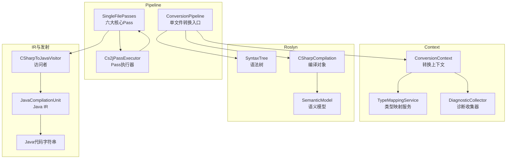
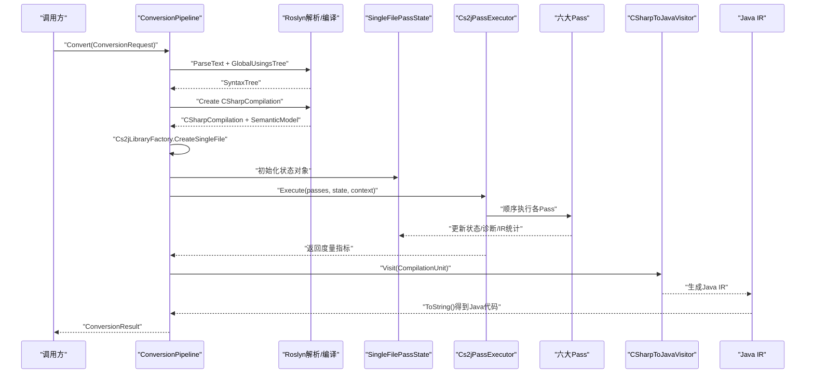
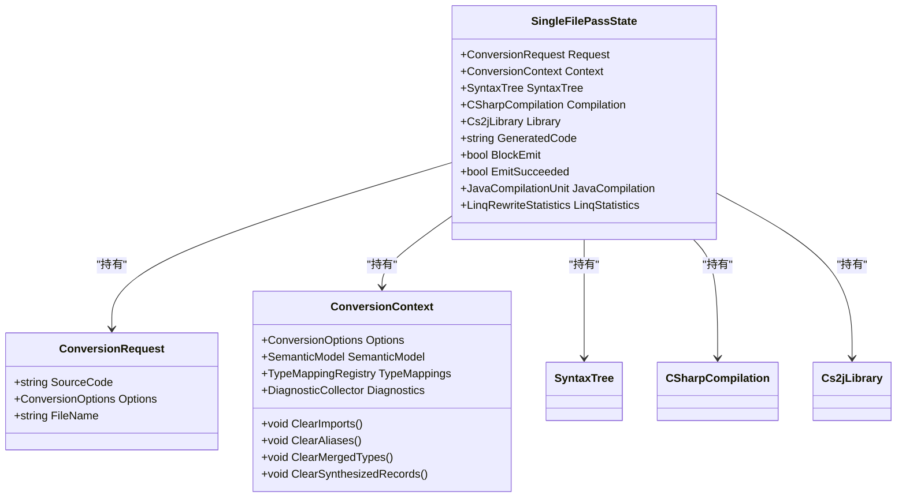
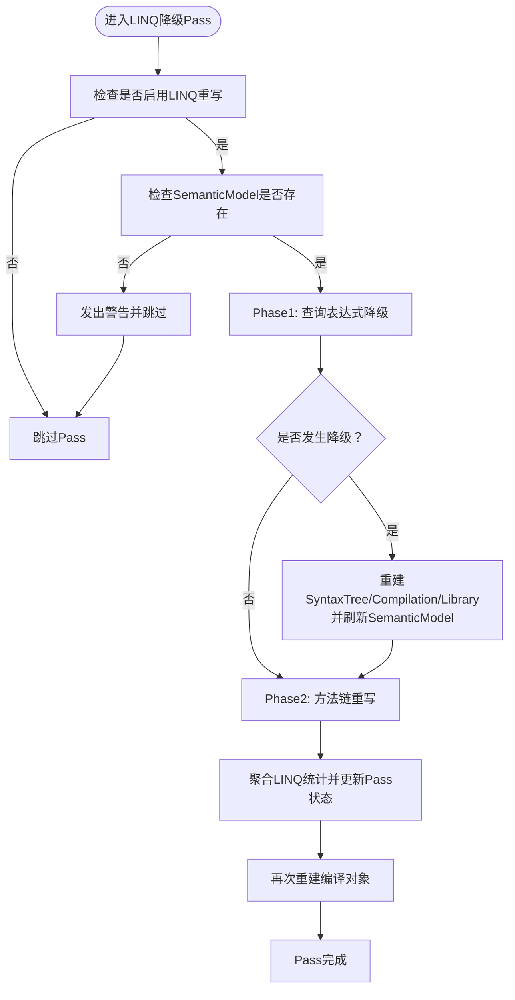
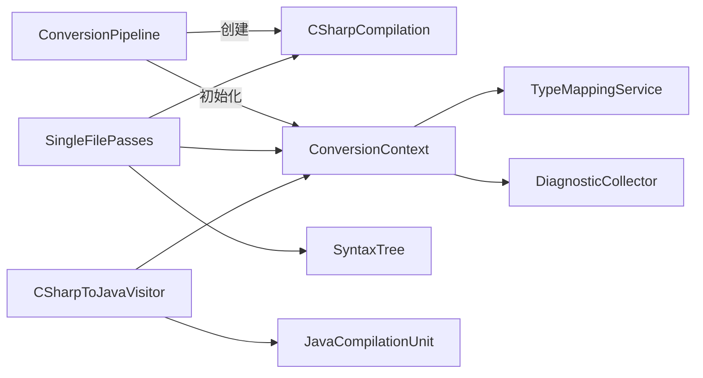

# 单文件转换流程

<cite>
**本文档引用的文件**
- [ConversionPipeline.cs](file://src/CSharpToJava.Core/Pipeline/ConversionPipeline.cs)
- [SingleFilePasses.cs](file://src/CSharpToJava.Core/Pipeline/Passes/SingleFilePasses.cs)
- [Cs2jPassInfrastructure.cs](file://src/CSharpToJava.Core/Pipeline/Passes/Cs2jPassInfrastructure.cs)
- [ConversionContext.cs](file://src/CSharpToJava.Core/Context/ConversionContext.cs)
- [CSharpToJavaVisitor.cs](file://src/CSharpToJava.Core/Visitors/CSharpToJavaVisitor.cs)
- [ProjectConversionPipeline.cs](file://src/CSharpToJava.Core/Pipeline/ProjectConversionPipeline.cs)
</cite>

## 目录
1. [简介](#简介)
2. [项目结构](#项目结构)
3. [核心组件](#核心组件)
4. [架构总览](#架构总览)
5. [详细组件分析](#详细组件分析)
6. [依赖关系分析](#依赖关系分析)
7. [性能考虑](#性能考虑)
8. [故障排查指南](#故障排查指南)
9. [结论](#结论)
10. [附录](#附录)

## 简介
本文件面向cs2j单文件转换流程，系统性阐述从C#语法树解析到Java IR生成与代码发射的完整生命周期。重点覆盖以下内容：
- SingleFilePassState状态管理机制：语法树、语义模型、编译上下文的初始化与传递
- 六大核心Pass的作用与实现：SingleFileLinqDesugarPass、SingleFileCompilationCheckPass、SingleFileUnsupportedDomainCheckPass、SingleFilePlatformBoundaryCheckPass、SingleFileNativeInteropCheckPass、SingleFileJavaEmitPass
- 单文件转换的调用方式、配置选项（全局using注入、框架引用、Java元数据路径）与错误处理策略
- 以序列图、类图、流程图等形式可视化转换过程与组件交互

## 项目结构
单文件转换位于核心库的Pipeline与Context模块中，主要涉及：
- Pipeline层：负责构建Roslyn编译对象、执行Pass流水线、收集度量指标与诊断信息
- Passes层：定义单文件转换的六大阶段任务
- Context层：维护转换过程中的全局状态（类型映射、诊断、导入、别名、方法状态等）
- Visitors层：将C#语法树转换为Java IR（JavaCompilationUnit）

图表来源
- [ConversionPipeline.cs:115-221](file://src/CSharpToJava.Core/Pipeline/ConversionPipeline.cs#L115-L221)
- [SingleFilePasses.cs:28-334](file://src/CSharpToJava.Core/Pipeline/Passes/SingleFilePasses.cs#L28-L334)
- [Cs2jPassInfrastructure.cs:53-99](file://src/CSharpToJava.Core/Pipeline/Passes/Cs2jPassInfrastructure.cs#L53-L99)
- [ConversionContext.cs:14-234](file://src/CSharpToJava.Core/Context/ConversionContext.cs#L14-L234)
- [CSharpToJavaVisitor.cs:15-476](file://src/CSharpToJava.Core/Visitors/CSharpToJavaVisitor.cs#L15-L476)

章节来源
- [ConversionPipeline.cs:115-221](file://src/CSharpToJava.Core/Pipeline/ConversionPipeline.cs#L115-L221)
- [SingleFilePasses.cs:28-334](file://src/CSharpToJava.Core/Pipeline/Passes/SingleFilePasses.cs#L28-L334)
- [Cs2jPassInfrastructure.cs:53-99](file://src/CSharpToJava.Core/Pipeline/Passes/Cs2jPassInfrastructure.cs#L53-L99)
- [ConversionContext.cs:14-234](file://src/CSharpToJava.Core/Context/ConversionContext.cs#L14-L234)
- [CSharpToJavaVisitor.cs:15-476](file://src/CSharpToJava.Core/Visitors/CSharpToJavaVisitor.cs#L15-L476)

## 核心组件
- SingleFilePassState：承载单文件转换的状态容器，包含请求、上下文、语法树、编译对象、库对象、生成代码、发射控制标志以及LINQ统计信息
- ConversionContext：转换上下文，集中管理类型映射、诊断、导入、别名、方法状态、项目编译等
- Cs2jPassExecutor：统一的Pass执行器，负责按序执行各Pass并收集度量指标（耗时、内存、诊断数、重写次数）
- CSharpToJavaVisitor：核心访问者，将C#语法树转换为Java IR（JavaCompilationUnit），并支持IR重写器链

章节来源
- [SingleFilePasses.cs:12-26](file://src/CSharpToJava.Core/Pipeline/Passes/SingleFilePasses.cs#L12-L26)
- [ConversionContext.cs:14-234](file://src/CSharpToJava.Core/Context/ConversionContext.cs#L14-L234)
- [Cs2jPassInfrastructure.cs:53-99](file://src/CSharpToJava.Core/Pipeline/Passes/Cs2jPassInfrastructure.cs#L53-L99)
- [CSharpToJavaVisitor.cs:15-476](file://src/CSharpToJava.Core/Visitors/CSharpToJavaVisitor.cs#L15-L476)

## 架构总览
单文件转换的总体流程如下：
1. 解析C#源码为SyntaxTree，并注入全局using语法树以确保裸标识符可正确解析
2. 构建CSharpCompilation并获取SemanticModel
3. 创建Cs2jLibrary（单文件场景）
4. 初始化SingleFilePassState并执行六大Pass
5. 通过CSharpToJavaVisitor生成Java IR，运行IR重写器链
6. 输出Java代码字符串与可选的IR对象

图表来源
- [ConversionPipeline.cs:115-221](file://src/CSharpToJava.Core/Pipeline/ConversionPipeline.cs#L115-L221)
- [SingleFilePasses.cs:376-388](file://src/CSharpToJava.Core/Pipeline/Passes/SingleFilePasses.cs#L376-L388)
- [Cs2jPassInfrastructure.cs:55-95](file://src/CSharpToJava.Core/Pipeline/Passes/Cs2jPassInfrastructure.cs#L55-L95)
- [CSharpToJavaVisitor.cs:29-116](file://src/CSharpToJava.Core/Visitors/CSharpToJavaVisitor.cs#L29-L116)

## 详细组件分析

### SingleFilePassState状态管理机制
SingleFilePassState是单文件转换的“全局状态”，贯穿六大Pass的执行周期：
- 请求与上下文：ConversionRequest、ConversionContext
- Roslyn对象：SyntaxTree、CSharpCompilation、Cs2jLibrary
- 发射控制：BlockEmit（阻止发射）、EmitSucceeded（发射成功标记）
- IR与统计：JavaCompilation（保留Java IR供后处理）、LinQ统计

状态在转换过程中被多个Pass修改：
- SingleFileLinqDesugarPass：可能重建SyntaxTree/Compilation/Library并更新SemanticModel
- SingleFileCompilationCheckPass：校验主编译与当前语法树一致性并设置SemanticModel
- SingleFileContextNormalizationPass：标准化上下文（清理导入/别名/合并类型/合成记录）
- SingleFileJavaEmitPass：生成Java IR与代码字符串，设置EmitSucceeded

图表来源
- [SingleFilePasses.cs:12-26](file://src/CSharpToJava.Core/Pipeline/Passes/SingleFilePasses.cs#L12-L26)
- [ConversionContext.cs:20-23](file://src/CSharpToJava.Core/Context/ConversionContext.cs#L20-L23)
- [ConversionPipeline.cs:18-23](file://src/CSharpToJava.Core/Pipeline/ConversionPipeline.cs#L18-L23)

章节来源
- [SingleFilePasses.cs:12-26](file://src/CSharpToJava.Core/Pipeline/Passes/SingleFilePasses.cs#L12-L26)
- [ConversionPipeline.cs:196-203](file://src/CSharpToJava.Core/Pipeline/ConversionPipeline.cs#L196-L203)

### 六大核心Pass详解

#### SingleFileLinqDesugarPass（LINQ降级）
职责：
- 在启用LINQ重写的前提下，先进行语法层面的查询表达式降级（from…in…where…select → Where/Select/…）
- 若发生降级，重建SyntaxTree/Compilation/Library并刷新SemanticModel
- 再进行语义驱动的方法链重写（方法调用转为过程式循环）
- 聚合并暴露LINQ重写统计信息

关键点：
- 条件执行：仅当EnableLinqRewrite为true且未启用Stream API优先策略时才执行
- 语义依赖：需要有效的SemanticModel；否则发出警告并跳过
- 重建机制：每次降级后重建编译对象以保证后续重写器能解析新语法树

图表来源
- [SingleFilePasses.cs:28-118](file://src/CSharpToJava.Core/Pipeline/Passes/SingleFilePasses.cs#L28-L118)

章节来源
- [SingleFilePasses.cs:28-118](file://src/CSharpToJava.Core/Pipeline/Passes/SingleFilePasses.cs#L28-L118)

#### SingleFileCompilationCheckPass（编译一致性检查）
职责：
- 校验Cs2jLibrary的主编译是否包含当前语法树
- 将SemanticModel设置为当前语法树对应的语义模型

异常与错误：
- 若主编译不包含当前语法树，抛出InvalidOperationException

章节来源
- [SingleFilePasses.cs:120-140](file://src/CSharpToJava.Core/Pipeline/Passes/SingleFilePasses.cs#L120-L140)

#### SingleFileUnsupportedDomainCheckPass（不支持领域检查）
职责：
- 对语法树进行不支持特性分析（如unsafe、fixed buffer等）
- 将诊断信息写入上下文；若出现错误级别诊断，则阻断发射（BlockEmit=true）

章节来源
- [SingleFilePasses.cs:142-160](file://src/CSharpToJava.Core/Pipeline/Passes/SingleFilePasses.cs#L142-L160)

#### SingleFilePlatformBoundaryCheckPass（平台边界检查）
职责：
- 基于SemanticModel分析平台边界相关问题（如Windows特定API）
- 错误级别诊断将阻断发射

章节来源
- [SingleFilePasses.cs:162-181](file://src/CSharpToJava.Core/Pipeline/Passes/SingleFilePasses.cs#L162-L181)

#### SingleFileNativeInteropCheckPass（原生互操作检查）
职责：
- 分析原生互操作相关语法（如P/Invoke、指针运算）
- 错误级别诊断将阻断发射

章节来源
- [SingleFilePasses.cs:183-202](file://src/CSharpToJava.Core/Pipeline/Passes/SingleFilePasses.cs#L183-L202)

#### SingleFileContextNormalizationPass（上下文规范化）
职责：
- 将Library的主编译赋给Compilation
- 设置上下文的ProjectCompilation
- 清空导入、别名、合并类型、合成记录
- 重新获取SemanticModel

章节来源
- [SingleFilePasses.cs:204-219](file://src/CSharpToJava.Core/Pipeline/Passes/SingleFilePasses.cs#L204-L219)

#### SingleFileJavaEmitPass（Java发射）
职责：
- 若BlockEmit为true则直接失败
- 否则使用CSharpToJavaVisitor生成Java IR（JavaCompilationUnit）
- 应用用户注册的IR重写器与内置兼容性/结构/验证重写器
- 生成Java代码字符串并设置EmitSucceeded

内置IR重写器链（按顺序应用）：
- 兼容性重写器：运算符优先级、Map.Entry类型、Math方法、委托调用、泛型数组创建、IntStream装箱、数组→Iterable转换、Collect/Stream往返、Stopwatch API、字符串拼接、事件处理器lambda、异常API
- 结构重写器：变量名去重、隐式类型转换补全
- 验证重写器：变量引用、静态上下文、类型参数合法性

章节来源
- [SingleFilePasses.cs:221-334](file://src/CSharpToJava.Core/Pipeline/Passes/SingleFilePasses.cs#L221-L334)
- [CSharpToJavaVisitor.cs:29-116](file://src/CSharpToJava.Core/Visitors/CSharpToJavaVisitor.cs#L29-L116)

### Pass执行基础设施
Cs2jPassExecutor提供统一的执行框架：
- 按序执行ICs2jPass<TState>集合
- 统计每个Pass的耗时、诊断数量变化、托管内存变化、重写次数
- 将异常包装为Cs2jPassExecutionException以便定位具体Pass与阶段

章节来源
- [Cs2jPassInfrastructure.cs:53-99](file://src/CSharpToJava.Core/Pipeline/Passes/Cs2jPassInfrastructure.cs#L53-L99)

## 依赖关系分析
单文件转换的关键依赖关系如下：
- ConversionPipeline依赖Roslyn（解析/编译）、TypeMappingRegistry（类型映射配置）、JavaLibraryIndex（可选Java标准库元数据）
- SingleFilePasses依赖ConversionContext（诊断、类型映射、导入/别名）、Roslyn（语法树/语义模型）
- CSharpToJavaVisitor依赖TransformerFactory与各类Transformer（类型、成员、语句、表达式），输出Java IR

图表来源
- [ConversionPipeline.cs:115-221](file://src/CSharpToJava.Core/Pipeline/ConversionPipeline.cs#L115-L221)
- [SingleFilePasses.cs:28-334](file://src/CSharpToJava.Core/Pipeline/Passes/SingleFilePasses.cs#L28-L334)
- [ConversionContext.cs:113-127](file://src/CSharpToJava.Core/Context/ConversionContext.cs#L113-L127)
- [CSharpToJavaVisitor.cs:15-476](file://src/CSharpToJava.Core/Visitors/CSharpToJavaVisitor.cs#L15-L476)

章节来源
- [ConversionPipeline.cs:115-221](file://src/CSharpToJava.Core/Pipeline/ConversionPipeline.cs#L115-L221)
- [SingleFilePasses.cs:28-334](file://src/CSharpToJava.Core/Pipeline/Passes/SingleFilePasses.cs#L28-L334)
- [ConversionContext.cs:113-127](file://src/CSharpToJava.Core/Context/ConversionContext.cs#L113-L127)
- [CSharpToJavaVisitor.cs:15-476](file://src/CSharpToJava.Core/Visitors/CSharpToJavaVisitor.cs#L15-L476)

## 性能考虑
- Pass度量采集：Cs2jPassExecutor记录每个Pass的耗时、诊断数变化与内存占用，便于定位性能瓶颈
- 重写器链：IR重写器分层（兼容性/结构/验证），避免重复扫描与修改
- 语义模型重建：LINQ降级后重建编译对象以确保后续重写器解析正确，但会带来额外开销，建议在必要时启用
- 全局using注入：通过GlobalUsingsTree确保裸标识符解析，减少后期类型映射失败导致的回退成本

## 故障排查指南
常见问题与处理策略：
- 语法错误：解析阶段即收集Roslyn诊断并写入上下文，随后返回失败结果
- 配置错误：TypeMapping配置异常时，构造基础上下文并记录错误，返回失败结果
- 不支持特性：UnsupportedDomainAnalyzer、PlatformBoundaryAnalyzer、NativeInteropAnalyzer检测到错误级别诊断时阻断发射
- LINQ重写失败：捕获异常并发出警告，跳过该阶段
- 发射失败：SingleFileJavaEmitPass在BlockEmit为true时直接失败；否则在生成IR失败时返回空代码

章节来源
- [ConversionPipeline.cs:118-127](file://src/CSharpToJava.Core/Pipeline/ConversionPipeline.cs#L118-L127)
- [ConversionPipeline.cs:142-150](file://src/CSharpToJava.Core/Pipeline/ConversionPipeline.cs#L142-L150)
- [SingleFilePasses.cs:46-50](file://src/CSharpToJava.Core/Pipeline/Passes/SingleFilePasses.cs#L46-L50)
- [SingleFilePasses.cs:149-159](file://src/CSharpToJava.Core/Pipeline/Passes/SingleFilePasses.cs#L149-L159)
- [SingleFilePasses.cs:169-180](file://src/CSharpToJava.Core/Pipeline/Passes/SingleFilePasses.cs#L169-L180)
- [SingleFilePasses.cs:190-201](file://src/CSharpToJava.Core/Pipeline/Passes/SingleFilePasses.cs#L190-L201)
- [SingleFilePasses.cs:235-240](file://src/CSharpToJava.Core/Pipeline/Passes/SingleFilePasses.cs#L235-L240)

## 结论
单文件转换通过明确的Pass阶段划分与严格的状态管理，实现了从C#语法树到Java IR的稳健转换。六大核心Pass分别承担语法降级、一致性检查、平台边界与原生互操作约束、上下文规范化与Java发射职责。配合Cs2jPassExecutor的度量采集与CSharpToJavaVisitor的IR生成，整体流程具备良好的可观测性与扩展性。

## 附录

### 单文件转换调用方式与配置选项
- 调用入口：ConversionPipeline.Convert(ConversionRequest)
- 关键配置项（ConversionOptions）：
  - EnableLinqRewrite：是否启用LINQ重写
  - EffectivePreferStreamApi：是否优先使用Stream API（影响LINQ重写策略）
  - TypeMappingConfigPath：类型映射配置路径
  - JavaMetadataPath：Java标准库元数据目录（用于API验证与模块依赖分析）
  - RewriteExtensionMethods：扩展方法重写策略（多文件模式下有特殊限制）
- 全局using注入：ConversionPipeline内部维护GlobalUsingsTree，自动注入常用命名空间，确保裸标识符解析正确

章节来源
- [ConversionPipeline.cs:86-92](file://src/CSharpToJava.Core/Pipeline/ConversionPipeline.cs#L86-L92)
- [ConversionPipeline.cs:118-134](file://src/CSharpToJava.Core/Pipeline/ConversionPipeline.cs#L118-L134)
- [ConversionPipeline.cs:179-192](file://src/CSharpToJava.Core/Pipeline/ConversionPipeline.cs#L179-L192)
- [SingleFilePasses.cs:40-44](file://src/CSharpToJava.Core/Pipeline/Passes/SingleFilePasses.cs#L40-L44)