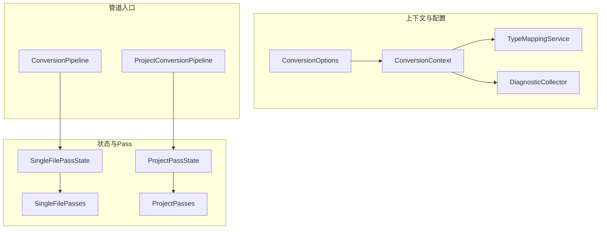
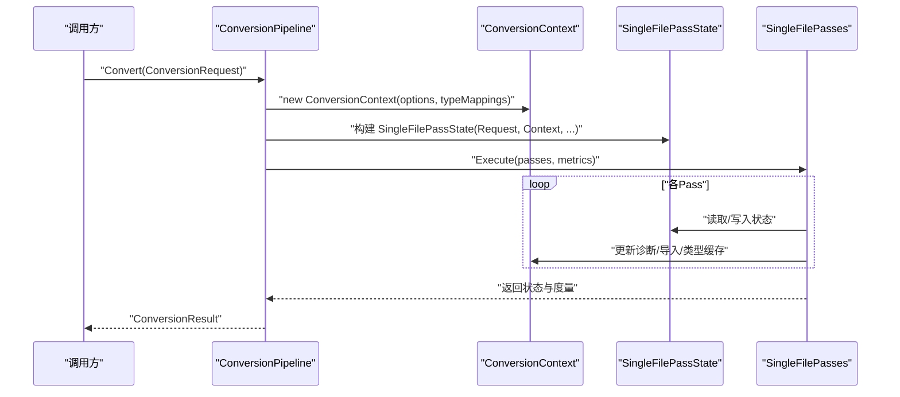
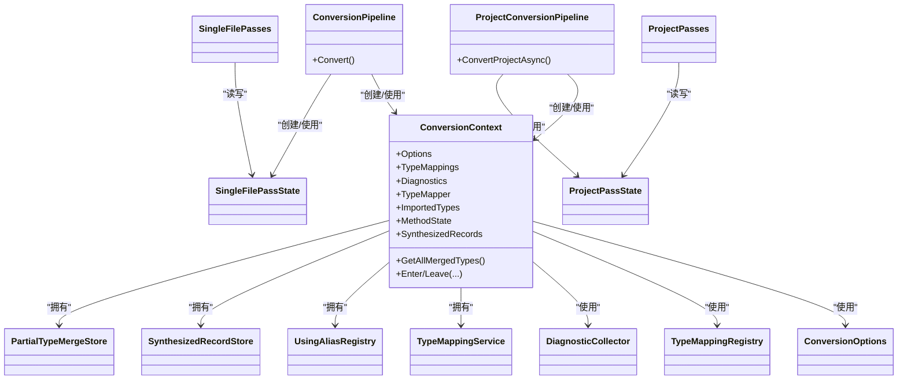

# 状态管理

<cite>
**本文引用的文件**
- [ConversionContext.cs](file://src/CSharpToJava.Core/Context/ConversionContext.cs)
- [ConversionOptions.cs](file://src/CSharpToJava.Core/Context/ConversionOptions.cs)
- [DiagnosticCollector.cs](file://src/CSharpToJava.Core/Context/DiagnosticCollector.cs)
- [TypeMappingService.cs](file://src/CSharpToJava.Core/Context/TypeMappingService.cs)
- [ConversionPipeline.cs](file://src/CSharpToJava.Core/Pipeline/ConversionPipeline.cs)
- [ProjectConversionPipeline.cs](file://src/CSharpToJava.Core/Pipeline/ProjectConversionPipeline.cs)
- [SingleFilePasses.cs](file://src/CSharpToJava.Core/Pipeline/Passes/SingleFilePasses.cs)
- [ProjectPasses.cs](file://src/CSharpToJava.Core/Pipeline/Passes/ProjectPasses.cs)
</cite>

## 目录
1. [引言](#引言)
2. [项目结构](#项目结构)
3. [核心组件](#核心组件)
4. [架构总览](#架构总览)
5. [详细组件分析](#详细组件分析)
6. [依赖关系分析](#依赖关系分析)
7. [性能考量](#性能考量)
8. [故障排查指南](#故障排查指南)
9. [结论](#结论)

## 引言
本文聚焦于 cs2j 转换管道中的“状态管理”子系统，系统性阐述两类状态模型 SingleFilePassState 与 ProjectPassState 的设计差异与使用场景；详解 ConversionContext 作为全局上下文如何承载类型映射注册表、诊断收集器、命名空间解析器与导入注册表等关键能力；梳理 ConversionOptions 配置体系的设置、传递与验证机制；并说明状态在不同 Pass 之间的传递与共享方式（含序列化、持久化与清理策略），最后给出最佳实践与调试技巧。

## 项目结构
围绕状态管理的关键代码分布如下：
- 上下文与配置：ConversionContext、ConversionOptions、DiagnosticCollector、TypeMappingService
- 管道入口与状态容器：ConversionPipeline、ProjectConversionPipeline
- 单文件与项目级 Pass 及其状态：SingleFilePasses、ProjectPasses

图表来源
- [ConversionContext.cs:14-234](file://src/CSharpToJava.Core/Context/ConversionContext.cs#L14-L234)
- [ConversionOptions.cs:6-103](file://src/CSharpToJava.Core/Context/ConversionOptions.cs#L6-L103)
- [ConversionPipeline.cs:115-221](file://src/CSharpToJava.Core/Pipeline/ConversionPipeline.cs#L115-L221)
- [ProjectConversionPipeline.cs:50-108](file://src/CSharpToJava.Core/Pipeline/ProjectConversionPipeline.cs#L50-L108)
- [SingleFilePasses.cs:12-26](file://src/CSharpToJava.Core/Pipeline/Passes/SingleFilePasses.cs#L12-L26)
- [ProjectPasses.cs:11-21](file://src/CSharpToJava.Core/Pipeline/Passes/ProjectPasses.cs#L11-L21)

章节来源
- [ConversionContext.cs:14-234](file://src/CSharpToJava.Core/Context/ConversionContext.cs#L14-L234)
- [ConversionOptions.cs:6-103](file://src/CSharpToJava.Core/Context/ConversionOptions.cs#L6-L103)
- [ConversionPipeline.cs:115-221](file://src/CSharpToJava.Core/Pipeline/ConversionPipeline.cs#L115-L221)
- [ProjectConversionPipeline.cs:50-108](file://src/CSharpToJava.Core/Pipeline/ProjectConversionPipeline.cs#L50-L108)
- [SingleFilePasses.cs:12-26](file://src/CSharpToJava.Core/Pipeline/Passes/SingleFilePasses.cs#L12-L26)
- [ProjectPasses.cs:11-21](file://src/CSharpToJava.Core/Pipeline/Passes/ProjectPasses.cs#L11-L21)

## 核心组件
- ConversionContext：全局上下文，聚合类型映射、诊断、导入、命名空间栈、类型栈、方法栈、合成记录与部分类型合并等状态，并提供便捷访问器与清理方法。
- ConversionOptions：转换配置，包含目标 Java 版本、类型映射配置路径、Java 元数据路径、是否生成 JavaDoc、是否使用 Java Record、是否使用 Optional 替代可空、命名空间映射、是否启用 LINQ 预处理、是否优先使用 Stream API、扩展方法改写策略、兼容层生成策略等。
- DiagnosticCollector：统一的诊断消息收集器，支持 Info/Warning/Error 三类严重级别。
- TypeMappingService：从 ConversionContext 中抽离的类型映射逻辑，负责 C# 类型到 Java 类型的映射、命名空间到包的映射、导入跟踪与缓存、以及基于 Java 标准库元数据的 API/异常校验。

章节来源
- [ConversionContext.cs:14-234](file://src/CSharpToJava.Core/Context/ConversionContext.cs#L14-L234)
- [ConversionOptions.cs:6-103](file://src/CSharpToJava.Core/Context/ConversionOptions.cs#L6-L103)
- [DiagnosticCollector.cs:8-50](file://src/CSharpToJava.Core/Context/DiagnosticCollector.cs#L8-L50)
- [TypeMappingService.cs:11-677](file://src/CSharpToJava.Core/Context/TypeMappingService.cs#L11-L677)

## 架构总览
状态管理贯穿单文件与项目级转换流程：
- 单文件模式：由 ConversionPipeline 构建 SingleFilePassState，依次执行 SingleFilePasses；每个 Pass 通过该状态对象读写转换中间产物（如语法树、语义模型、生成的 Java IR、统计信息等），并在必要时更新 ConversionContext 的导入与诊断。
- 项目模式：由 ProjectConversionPipeline 构建 ProjectPassState，依次执行 ProjectPasses；ProjectPasses 在多文件/多树上并行执行检查与重写，汇总诊断并决定哪些文件需要输出。

图表来源
- [ConversionPipeline.cs:115-221](file://src/CSharpToJava.Core/Pipeline/ConversionPipeline.cs#L115-L221)
- [SingleFilePasses.cs:28-118](file://src/CSharpToJava.Core/Pipeline/Passes/SingleFilePasses.cs#L28-L118)

章节来源
- [ConversionPipeline.cs:115-221](file://src/CSharpToJava.Core/Pipeline/ConversionPipeline.cs#L115-L221)
- [SingleFilePasses.cs:28-118](file://src/CSharpToJava.Core/Pipeline/Passes/SingleFilePasses.cs#L28-L118)

## 详细组件分析

### SingleFilePassState 与 ProjectPassState 的设计差异与使用场景
- SingleFilePassState
  - 作用域：单文件转换，封装当前文件的语法树、编译单元、库对象、生成代码、是否阻断发射、发射成功标志、Java IR 编译单元、LINQ 统计等。
  - 生命周期：由 ConversionPipeline 在 Convert() 中创建，贯穿 SingleFilePasses 执行期。
  - 关键字段：Request、Context、SyntaxTree、Compilation、Library、GeneratedCode、BlockEmit、EmitSucceeded、JavaCompilation、LinqStatistics。
- ProjectPassState
  - 作用域：项目级转换，封装库对象、编译单元、待发射文件集合、类型分组、被阻断文件集合、按文件聚合的诊断、最终结果集等。
  - 生命周期：由 ProjectConversionPipeline 在 ConvertProjectAsync/ConvertLibraryAsync 中创建，贯穿 ProjectPasses 执行期。
  - 关键字段：Library、Context、Compilation、EmitFilePaths、TypeGroups、BlockedFilePaths、DiagnosticsByFile、Results。

使用场景
- SingleFilePassState：适用于独立文件转换，无需跨文件语义分析，适合快速验证与小规模转换。
- ProjectPassState：适用于完整项目转换，需要跨文件语义分析、部分类型合并、扩展方法索引、兼容层生成与跨包导入解析等。

章节来源
- [SingleFilePasses.cs:12-26](file://src/CSharpToJava.Core/Pipeline/Passes/SingleFilePasses.cs#L12-L26)
- [ProjectPasses.cs:11-21](file://src/CSharpToJava.Core/Pipeline/Passes/ProjectPasses.cs#L11-L21)
- [ConversionPipeline.cs:196-205](file://src/CSharpToJava.Core/Pipeline/ConversionPipeline.cs#L196-L205)
- [ProjectConversionPipeline.cs:170-176](file://src/CSharpToJava.Core/Pipeline/ProjectConversionPipeline.cs#L170-L176)

### ConversionContext 作为全局上下文
- 类型映射注册表与服务
  - TypeMappings：类型映射注册表实例，用于 C# 类型到 Java 类型的映射与导入要求查询。
  - TypeMapper：TypeMappingService 实例，提供 MapType、NamespaceToPackage、AddImportsForType 等能力，并维护 per-file 类型缓存。
- 诊断收集器
  - Diagnostics：DiagnosticCollector 实例，统一收集 Info/Warning/Error 级别诊断。
- 命名空间与导入
  - CurrentNamespace、ImportedTypes：命名空间栈与导入集合，支持 ClearImports 以刷新缓存。
- 方法级状态
  - MethodState：MethodConversionState 实例，保存预/后置语句、ref/out 持有者、流局部变量、查询 let 别名等。
- 合成记录与部分类型
  - SynthesizedRecords、MergedTypeDeclaration：用于记录与复用合成 record 与合并后的部分类型声明。
- 项目编译
  - ProjectCompilation：项目级编译单元，供跨文件分析与 IR 验证使用。
- 访问器与工具
  - Enter/Leave 命名空间/类型/方法栈，生成合成名称，别名注册与解析，语义模型选择等。

章节来源
- [ConversionContext.cs:20-234](file://src/CSharpToJava.Core/Context/ConversionContext.cs#L20-L234)
- [TypeMappingService.cs:11-677](file://src/CSharpToJava.Core/Context/TypeMappingService.cs#L11-L677)
- [DiagnosticCollector.cs:8-50](file://src/CSharpToJava.Core/Context/DiagnosticCollector.cs#L8-L50)

### ConversionOptions 配置系统
- 目标 Java 版本、类型映射配置路径、Java 元数据路径、是否生成 JavaDoc、是否使用 Java Record、是否使用 Optional 替代可空、命名空间映射、是否启用 LINQ 预处理、是否优先使用 Stream API（带 EffectivePreferStreamApi 决策）、扩展方法改写策略、兼容层生成策略、是否启用项目级并行 Pass 等。
- 有效值推导：EffectivePreferStreamApi 在未显式设置时根据目标版本默认为 true（Java 25）。

章节来源
- [ConversionOptions.cs:6-103](file://src/CSharpToJava.Core/Context/ConversionOptions.cs#L6-L103)

### 状态在不同 Pass 之间的传递与共享
- 单文件传递
  - ConversionPipeline 将 ConversionContext 与 SingleFilePassState 注入 Cs2jPassExecutor，各 SingleFilePass 通过 state 对象读写中间结果（如替换 SyntaxTree/Compilation、设置 GeneratedCode/EmitSucceeded、累积 LinqStatistics）。
  - Context 在 Pass 间共享，用于导入与诊断的累积与传播。
- 项目级传递
  - ProjectConversionPipeline 将 ConversionContext 与 ProjectPassState 注入 Cs2jPassExecutor，ProjectPasses 在多树上并行执行，通过 DiagnosticsByFile 与 BlockedFilePaths 跨文件聚合诊断与阻断决策。
  - 最终结果集 Results 聚合每个类型组的转换结果，并附加度量与统计。

章节来源
- [ConversionPipeline.cs:196-205](file://src/CSharpToJava.Core/Pipeline/ConversionPipeline.cs#L196-L205)
- [ProjectConversionPipeline.cs:170-176](file://src/CSharpToJava.Core/Pipeline/ProjectConversionPipeline.cs#L170-L176)
- [SingleFilePasses.cs:28-118](file://src/CSharpToJava.Core/Pipeline/Passes/SingleFilePasses.cs#L28-L118)
- [ProjectPasses.cs:143-230](file://src/CSharpToJava.Core/Pipeline/Passes/ProjectPasses.cs#L143-L230)

### 序列化、持久化与清理策略
- 序列化/持久化
  - SingleFilePassState 与 ProjectPassState 仅作为内存状态对象，不直接序列化；但其承载的数据（如 GeneratedCode、JavaCompilation、DiagnosticsByFile、Results）可在 ConversionResult 中持久化返回。
- 清理策略
  - ConversionContext 提供 ClearImports、ClearAliases、ClearMergedTypes、ClearSynthesizedRecords 等清理方法，确保每文件转换前的干净状态。
  - TypeMappingService 提供 ClearCache 以清空 per-file 类型缓存，避免跨文件污染。

章节来源
- [SingleFilePasses.cs:204-219](file://src/CSharpToJava.Core/Pipeline/Passes/SingleFilePasses.cs#L204-L219)
- [ProjectPasses.cs:430-440](file://src/CSharpToJava.Core/Pipeline/Passes/ProjectPasses.cs#L430-L440)
- [ConversionContext.cs:182-187](file://src/CSharpToJava.Core/Context/ConversionContext.cs#L182-L187)
- [TypeMappingService.cs:64-67](file://src/CSharpToJava.Core/Context/TypeMappingService.cs#L64-L67)

### 最佳实践与示例（以路径代替代码）
- 初始化
  - 单文件：在 ConversionPipeline.Convert 中创建 ConversionContext 与 SingleFilePassState，并注入 Cs2jPassExecutor。
    - 参考路径：[ConversionPipeline.cs:136-205](file://src/CSharpToJava.Core/Pipeline/ConversionPipeline.cs#L136-L205)
  - 项目：在 ProjectConversionPipeline.ConvertProjectAsync/ConvertLibraryAsync 中创建 ConversionContext 与 ProjectPassState，并注入 Cs2jPassExecutor。
    - 参考路径：[ProjectConversionPipeline.cs:58-101](file://src/CSharpToJava.Core/Pipeline/ProjectConversionPipeline.cs#L58-L101)
- 更新
  - 在 Pass 中更新状态：例如 SingleFileLinqDesugarPass 重建 SyntaxTree/Compilation 并更新 Context.SemanticModel。
    - 参考路径：[SingleFilePasses.cs:68-112](file://src/CSharpToJava.Core/Pipeline/Passes/SingleFilePasses.cs#L68-L112)
  - 在项目 Pass 中聚合诊断：ProjectPasses 使用 DiagnosticsByFile 与 BlockedFilePaths 聚合与阻断。
    - 参考路径：[ProjectPasses.cs:22-68](file://src/CSharpToJava.Core/Pipeline/Passes/ProjectPasses.cs#L22-L68)
- 恢复
  - 通过 Context.GetSemanticModelForTree 在不同阶段选择合适的语义模型。
    - 参考路径：[ConversionContext.cs:196-207](file://src/CSharpToJava.Core/Context/ConversionContext.cs#L196-L207)
- 清理
  - 在 SingleFileContextNormalizationPass 中清理导入、别名、部分类型与合成记录。
    - 参考路径：[SingleFilePasses.cs:210-218](file://src/CSharpToJava.Core/Pipeline/Passes/SingleFilePasses.cs#L210-L218)
  - 在 TypeMappingService 中清理 per-file 类型缓存。
    - 参考路径：[TypeMappingService.cs:64-67](file://src/CSharpToJava.Core/Context/TypeMappingService.cs#L64-L67)

章节来源
- [ConversionPipeline.cs:136-205](file://src/CSharpToJava.Core/Pipeline/ConversionPipeline.cs#L136-L205)
- [ProjectConversionPipeline.cs:58-101](file://src/CSharpToJava.Core/Pipeline/ProjectConversionPipeline.cs#L58-L101)
- [SingleFilePasses.cs:68-112](file://src/CSharpToJava.Core/Pipeline/Passes/SingleFilePasses.cs#L68-L112)
- [ProjectPasses.cs:22-68](file://src/CSharpToJava.Core/Pipeline/Passes/ProjectPasses.cs#L22-L68)
- [ConversionContext.cs:196-207](file://src/CSharpToJava.Core/Context/ConversionContext.cs#L196-L207)
- [TypeMappingService.cs:64-67](file://src/CSharpToJava.Core/Context/TypeMappingService.cs#L64-L67)

### 错误处理与调试中的状态快照与追踪
- 诊断聚合
  - SingleFilePasses 与 ProjectPasses 在遇到错误时设置 BlockEmit 或在 DiagnosticsByFile 中登记阻断诊断，确保最终结果中包含完整诊断。
  - 参考路径：[SingleFilePasses.cs:155-201](file://src/CSharpToJava.Core/Pipeline/Passes/SingleFilePasses.cs#L155-L201)，[ProjectPasses.cs:327-427](file://src/CSharpToJava.Core/Pipeline/Passes/ProjectPasses.cs#L327-L427)
- 状态追踪
  - Cs2jPassExecutor 会记录每个 Pass 的度量（PassMetrics），便于定位耗时与重写次数。
  - 参考路径：[Phase2PassPipelineTests.cs:10-60](file://tests/CSharpToJava.Tests/Phase2PassPipelineTests.cs#L10-L60)
- 快照与统计
  - SingleFilePassState 与 ProjectPassState 分别携带 LinqStatistics 与度量集合，便于后续分析与报告。
  - 参考路径：[SingleFilePasses.cs:24-25](file://src/CSharpToJava.Core/Pipeline/Passes/SingleFilePasses.cs#L24-L25)，[ProjectPasses.cs:143-149](file://src/CSharpToJava.Core/Pipeline/Passes/ProjectPasses.cs#L143-L149)

章节来源
- [SingleFilePasses.cs:155-201](file://src/CSharpToJava.Core/Pipeline/Passes/SingleFilePasses.cs#L155-L201)
- [ProjectPasses.cs:327-427](file://src/CSharpToJava.Core/Pipeline/Passes/ProjectPasses.cs#L327-L427)
- [Phase2PassPipelineTests.cs:10-60](file://tests/CSharpToJava.Tests/Phase2PassPipelineTests.cs#L10-L60)

## 依赖关系分析
- ConversionContext 依赖 ConversionOptions、TypeMappingRegistry、DiagnosticCollector、TypeMappingService、UsingAliasRegistry、SynthesizedRecordStore、PartialTypeMergeStore 等。
- ConversionPipeline 与 ProjectConversionPipeline 分别持有 ConversionContext 与状态对象，驱动 Cs2jPassExecutor 执行 Pass。
- SingleFilePasses 与 ProjectPasses 通过状态对象读写中间结果，同时更新 ConversionContext 的诊断与导入。

图表来源
- [ConversionContext.cs:20-234](file://src/CSharpToJava.Core/Context/ConversionContext.cs#L20-L234)
- [ConversionPipeline.cs:115-221](file://src/CSharpToJava.Core/Pipeline/ConversionPipeline.cs#L115-L221)
- [ProjectConversionPipeline.cs:50-108](file://src/CSharpToJava.Core/Pipeline/ProjectConversionPipeline.cs#L50-L108)
- [SingleFilePasses.cs:12-26](file://src/CSharpToJava.Core/Pipeline/Passes/SingleFilePasses.cs#L12-L26)
- [ProjectPasses.cs:11-21](file://src/CSharpToJava.Core/Pipeline/Passes/ProjectPasses.cs#L11-L21)

章节来源
- [ConversionContext.cs:20-234](file://src/CSharpToJava.Core/Context/ConversionContext.cs#L20-L234)
- [ConversionPipeline.cs:115-221](file://src/CSharpToJava.Core/Pipeline/ConversionPipeline.cs#L115-L221)
- [ProjectConversionPipeline.cs:50-108](file://src/CSharpToJava.Core/Pipeline/ProjectConversionPipeline.cs#L50-L108)
- [SingleFilePasses.cs:12-26](file://src/CSharpToJava.Core/Pipeline/Passes/SingleFilePasses.cs#L12-L26)
- [ProjectPasses.cs:11-21](file://src/CSharpToJava.Core/Pipeline/Passes/ProjectPasses.cs#L11-L21)

## 性能考量
- 项目级并行：ProjectPasses 支持在多树上并行执行（如 LINQ 预处理、边界检查），并保证确定性合并结果。
  - 参考路径：[ProjectPasses.cs:166-190](file://src/CSharpToJava.Core/Pipeline/Passes/ProjectPasses.cs#L166-L190)，[ProjectPasses.cs:333-355](file://src/CSharpToJava.Core/Pipeline/Passes/ProjectPasses.cs#L333-L355)
- 缓存与清理：TypeMappingService 的类型缓存按文件清理，避免跨文件缓存污染；ConversionContext 的 ClearImports 触发 TypeMapper.ClearCache。
  - 参考路径：[TypeMappingService.cs:64-67](file://src/CSharpToJava.Core/Context/TypeMappingService.cs#L64-L67)，[ConversionContext.cs:182-187](file://src/CSharpToJava.Core/Context/ConversionContext.cs#L182-L187)
- IR 层重写：在 SingleFileJavaEmitPass 与 ProjectTypeEmitPass 中，先运行用户注册的 IR 重写器，再运行内置兼容性与验证重写器，减少字符串级后处理的脆弱性。
  - 参考路径：[SingleFilePasses.cs:250-290](file://src/CSharpToJava.Core/Pipeline/Passes/SingleFilePasses.cs#L250-L290)，[ProjectPasses.cs:456-515](file://src/CSharpToJava.Core/Pipeline/Passes/ProjectPasses.cs#L456-L515)

## 故障排查指南
- 诊断聚合与阻断
  - 若某 Pass 报告错误，应检查其是否设置了 BlockEmit 或在 DiagnosticsByFile 中登记阻断诊断。
  - 参考路径：[SingleFilePasses.cs:155-201](file://src/CSharpToJava.Core/Pipeline/Passes/SingleFilePasses.cs#L155-L201)，[ProjectPasses.cs:327-427](file://src/CSharpToJava.Core/Pipeline/Passes/ProjectPasses.cs#L327-L427)
- 状态快照
  - 通过 ConversionResult 中的 Diagnostics、PassMetrics、LinqStatistics 等字段进行回溯与定位。
  - 参考路径：[ConversionPipeline.cs:390-404](file://src/CSharpToJava.Core/Pipeline/ConversionPipeline.cs#L390-L404)，[ProjectPasses.cs:143-149](file://src/CSharpToJava.Core/Pipeline/Passes/ProjectPasses.cs#L143-L149)
- 导入与类型映射问题
  - 使用 ConversionContext.AddImport 与 TypeMappingService.AddImportsForTypePublic 显式添加导入；若出现 unresolved 类型，检查 TypeMappings 配置与 NamespaceMappings。
  - 参考路径：[ConversionContext.cs:167-180](file://src/CSharpToJava.Core/Context/ConversionContext.cs#L167-L180)，[TypeMappingService.cs:525-532](file://src/CSharpToJava.Core/Context/TypeMappingService.cs#L525-L532)

章节来源
- [SingleFilePasses.cs:155-201](file://src/CSharpToJava.Core/Pipeline/Passes/SingleFilePasses.cs#L155-L201)
- [ProjectPasses.cs:327-427](file://src/CSharpToJava.Core/Pipeline/Passes/ProjectPasses.cs#L327-L427)
- [ConversionPipeline.cs:390-404](file://src/CSharpToJava.Core/Pipeline/ConversionPipeline.cs#L390-L404)
- [ProjectPasses.cs:143-149](file://src/CSharpToJava.Core/Pipeline/Passes/ProjectPasses.cs#L143-L149)
- [ConversionContext.cs:167-180](file://src/CSharpToJava.Core/Context/ConversionContext.cs#L167-L180)
- [TypeMappingService.cs:525-532](file://src/CSharpToJava.Core/Context/TypeMappingService.cs#L525-L532)

## 结论
本文系统阐述了 cs2j 状态管理子系统：SingleFilePassState 与 ProjectPassState 的职责划分与适用场景；ConversionContext 作为全局上下文如何整合类型映射、诊断、导入与方法级状态；ConversionOptions 的配置项与生效逻辑；以及状态在 Pass 间的传递、共享与清理策略。通过合理的初始化、更新与清理实践，结合诊断聚合与度量记录，可显著提升转换过程的可观测性与稳定性。