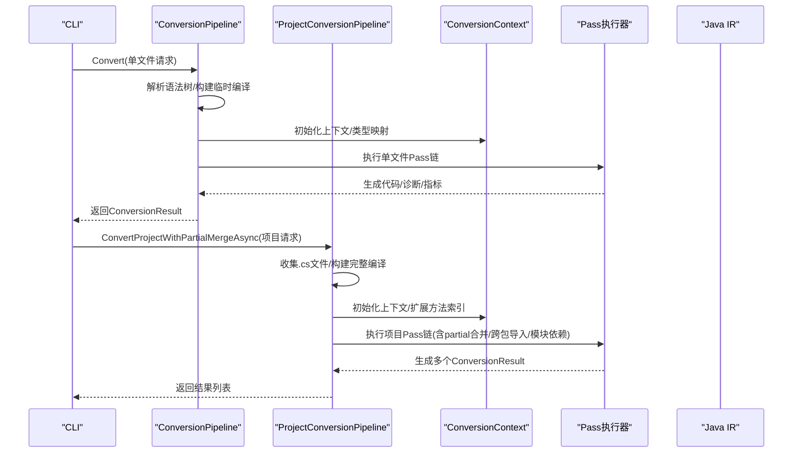
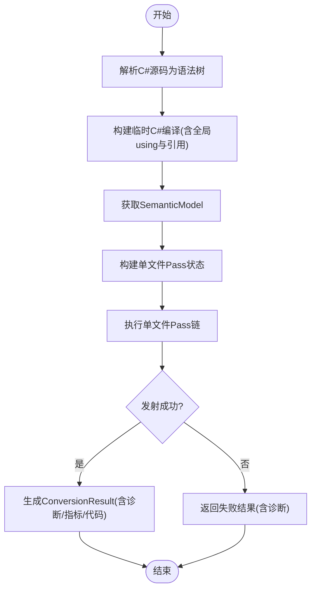
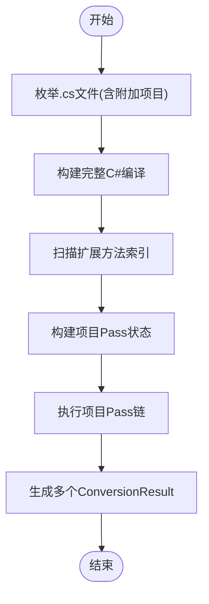
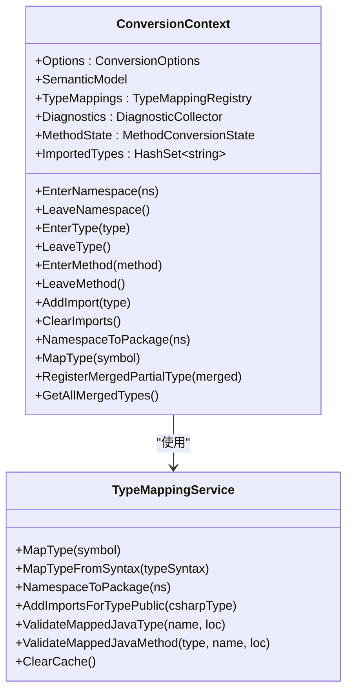
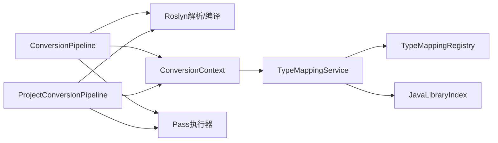

# 转换管道详解

<cite>
**本文档引用的文件**
- [README.md](file://README.md)
- [ConversionPipeline.cs](file://src/CSharpToJava.Core/Pipeline/ConversionPipeline.cs)
- [ProjectConversionPipeline.cs](file://src/CSharpToJava.Core/Pipeline/ProjectConversionPipeline.cs)
- [ConversionContext.cs](file://src/CSharpToJava.Core/Context/ConversionContext.cs)
- [ConversionOptions.cs](file://src/CSharpToJava.Core/Context/ConversionOptions.cs)
- [DiagnosticCollector.cs](file://src/CSharpToJava.Core/Context/DiagnosticCollector.cs)
- [TypeMappingService.cs](file://src/CSharpToJava.Core/Context/TypeMappingService.cs)
- [JavaCompilationUnit.cs](file://src/CSharpToJava.Core/Java/JavaCompilationUnit.cs)
- [PartialTypeMerger.cs](file://src/CSharpToJava.Core/PartialType/PartialTypeMerger.cs)
- [TransformerFactory.cs](file://src/CSharpToJava.Core/Transformers/TransformerFactory.cs)
</cite>

## 目录
1. [引言](#引言)
2. [项目结构](#项目结构)
3. [核心组件](#核心组件)
4. [架构总览](#架构总览)
5. [详细组件分析](#详细组件分析)
6. [依赖关系分析](#依赖关系分析)
7. [性能考量](#性能考量)
8. [故障排查指南](#故障排查指南)
9. [结论](#结论)
10. [附录](#附录)

## 引言
本文件面向cs2j转换管道的技术文档，系统阐述从单文件转换到项目级转换的完整流程与差异，覆盖语法树解析、语义分析、转换阶段执行、代码生成、状态管理、Pass执行机制、错误处理策略与性能监控，并给出单文件与项目转换两种模式在partial类型合并、跨文件语义分析与增量转换支持方面的技术实现差异。同时提供使用示例与扩展点说明，帮助开发者正确配置、调用与扩展转换管道。

## 项目结构
cs2j采用分层模块化设计：核心转换引擎位于CSharpToJava.Core，命令行接口在CSharpToJava.CLI，类型映射配置在config目录，测试在tests目录。转换管道由单文件与项目级两条主线构成，分别对应独立文件转换与多文件、跨文件语义分析的场景。

```mermaid
graph TB
subgraph "CLI"
CLI["CSharpToJava.CLI<br/>命令行入口"]
end
subgraph "核心引擎"
CORE["CSharpToJava.Core"]
PIPE_SINGLE["ConversionPipeline<br/>单文件转换"]
PIPE_PROJECT["ProjectConversionPipeline<br/>项目转换"]
CTX["ConversionContext<br/>上下文/状态"]
OPT["ConversionOptions<br/>配置"]
TMS["TypeMappingService<br/>类型映射"]
PARTIAL["PartialTypeMerger<br/>partial合并"]
JAVAIR["JavaCompilationUnit<br/>Java IR"]
TRANS["TransformerFactory<br/>转换器工厂"]
end
subgraph "类型映射"
TMREG["TypeMappingRegistry<br/>配置注册表"]
JLIB["JavaLibraryIndex<br/>Java元数据索引"]
end
CLI --> PIPE_SINGLE
CLI --> PIPE_PROJECT
PIPE_SINGLE --> CTX
PIPE_PROJECT --> CTX
CTX --> TMS
CTX --> PARTIAL
CTX --> JAVAIR
TRANS --> CTX
TMS --> TMREG
TMS --> JLIB
```

图示来源
- [ConversionPipeline.cs:67-221](file://src/CSharpToJava.Core/Pipeline/ConversionPipeline.cs#L67-L221)
- [ProjectConversionPipeline.cs:13-120](file://src/CSharpToJava.Core/Pipeline/ProjectConversionPipeline.cs#L13-L120)
- [ConversionContext.cs:14-127](file://src/CSharpToJava.Core/Context/ConversionContext.cs#L14-L127)
- [TypeMappingService.cs:11-53](file://src/CSharpToJava.Core/Context/TypeMappingService.cs#L11-L53)
- [JavaCompilationUnit.cs:8-62](file://src/CSharpToJava.Core/Java/JavaCompilationUnit.cs#L8-L62)
- [PartialTypeMerger.cs:12-35](file://src/CSharpToJava.Core/PartialType/PartialTypeMerger.cs#L12-L35)
- [TransformerFactory.cs:16-58](file://src/CSharpToJava.Core/Transformers/TransformerFactory.cs#L16-L58)

章节来源
- [README.md:1-84](file://README.md#L1-L84)
- [ConversionPipeline.cs:67-221](file://src/CSharpToJava.Core/Pipeline/ConversionPipeline.cs#L67-L221)
- [ProjectConversionPipeline.cs:13-120](file://src/CSharpToJava.Core/Pipeline/ProjectConversionPipeline.cs#L13-L120)

## 核心组件
- 转换请求与结果
  - 请求对象包含源码、选项与文件名；结果对象包含成功标志、生成代码、诊断、Pass指标、LINQ统计、包名与模块依赖等。
- 上下文与配置
  - 上下文承载命名空间/类型/方法栈、导入集合、类型映射服务、诊断收集器、partial合并存储、合成记录存储等；配置控制目标版本、是否生成JavaDoc、是否使用Record、是否启用LINQ重写、是否启用扩展方法重写等。
- 类型映射服务
  - 提供C#类型到Java类型的映射、命名空间到包的映射、导入去重与缓存、Java标准库元数据验证等能力。
- Java IR
  - 结构化的Java编译单元，包含包、导入与类型声明，支持字符串化输出与导入去重。
- Partial类型合并
  - 基于符号分析识别并合并partial类型，校验类型参数、可访问性与基类一致性。
- 转换器工厂
  - 统一创建各类类型/成员/语句/表达式转换器，保证无状态与复用。

章节来源
- [ConversionPipeline.cs:18-62](file://src/CSharpToJava.Core/Pipeline/ConversionPipeline.cs#L18-L62)
- [ConversionContext.cs:14-233](file://src/CSharpToJava.Core/Context/ConversionContext.cs#L14-L233)
- [ConversionOptions.cs:6-103](file://src/CSharpToJava.Core/Context/ConversionOptions.cs#L6-L103)
- [TypeMappingService.cs:11-677](file://src/CSharpToJava.Core/Context/TypeMappingService.cs#L11-L677)
- [JavaCompilationUnit.cs:8-92](file://src/CSharpToJava.Core/Java/JavaCompilationUnit.cs#L8-L92)
- [PartialTypeMerger.cs:12-285](file://src/CSharpToJava.Core/PartialType/PartialTypeMerger.cs#L12-L285)
- [TransformerFactory.cs:16-58](file://src/CSharpToJava.Core/Transformers/TransformerFactory.cs#L16-L58)

## 架构总览
转换管道分为两条主线：
- 单文件转换：解析单个C#文件，构建临时编译，注入全局using，执行单文件Pass链，生成Java IR并转字符串。
- 项目转换：收集所有.cs文件，构建完整编译，扫描扩展方法索引，执行项目级Pass链，支持partial合并、跨包导入解析与模块依赖分析。



图示来源
- [ConversionPipeline.cs:115-221](file://src/CSharpToJava.Core/Pipeline/ConversionPipeline.cs#L115-L221)
- [ProjectConversionPipeline.cs:82-120](file://src/CSharpToJava.Core/Pipeline/ProjectConversionPipeline.cs#L82-L120)

## 详细组件分析

### 单文件转换流程
- 输入：单个C#源码字符串与选项。
- 解析与编译：使用Roslyn解析文本为语法树，构建临时编译，注入全局using以确保裸标识符能解析到完整类型，加载必要的系统程序集引用。
- 语义分析：基于PrimaryCompilation获取SemanticModel，建立符号解析基础。
- Pass执行：顺序执行单文件Pass链，包括LINQ预处理、编译检查、不支持域检查、平台边界检查、原生互操作检查、上下文归一化、Java发射。
- 代码生成：通过Java IR生成最终Java代码字符串，同步诊断与指标。



图示来源
- [ConversionPipeline.cs:141-221](file://src/CSharpToJava.Core/Pipeline/ConversionPipeline.cs#L141-L221)

章节来源
- [ConversionPipeline.cs:115-221](file://src/CSharpToJava.Core/Pipeline/ConversionPipeline.cs#L115-L221)

### 项目转换流程（含partial合并）
- 输入：项目根路径与附加语义项目路径集合。
- 文件发现：递归枚举.cs文件，支持忽略常见目录。
- 编译构建：将所有源文件构建为单一C#编译，形成跨文件语义分析基础。
- 扩展方法索引：扫描各项目编译，构建扩展方法索引，用于后续调用降级与实例化。
- Pass执行：执行项目级Pass链，包含LINQ预处理、编译/不支持域/平台边界/原生互操作检查、扩展方法检查、partial类型规范化、Java发射、兼容性发射、跨包导入发射、Java模块依赖分析。
- 输出：每个输入文件对应一个ConversionResult，携带包名、模块依赖、IR等信息。



图示来源
- [ConversionPipeline.cs:268-339](file://src/CSharpToJava.Core/Pipeline/ConversionPipeline.cs#L268-L339)
- [ProjectConversionPipeline.cs:82-141](file://src/CSharpToJava.Core/Pipeline/ProjectConversionPipeline.cs#L82-L141)

章节来源
- [ConversionPipeline.cs:268-339](file://src/CSharpToJava.Core/Pipeline/ConversionPipeline.cs#L268-L339)
- [ProjectConversionPipeline.cs:82-141](file://src/CSharpToJava.Core/Pipeline/ProjectConversionPipeline.cs#L82-L141)

### 状态管理与上下文
- 命名空间/类型/方法栈：用于跟踪当前转换上下文，支撑导入与名称映射。
- 方法级状态：记录前置/后置语句、ref/out持有者、流变量、查询let别名等。
- 类型映射服务：集中管理类型缓存、导入集合、命名空间到包映射、Java元数据验证。
- Partial类型存储：注册/查询/清理合并后的类型，支持跨文件一致性校验。
- 合成记录：记录匿名类型派生的Java Record，避免重复生成。



图示来源
- [ConversionContext.cs:14-233](file://src/CSharpToJava.Core/Context/ConversionContext.cs#L14-L233)
- [TypeMappingService.cs:11-118](file://src/CSharpToJava.Core/Context/TypeMappingService.cs#L11-L118)

章节来源
- [ConversionContext.cs:14-233](file://src/CSharpToJava.Core/Context/ConversionContext.cs#L14-L233)
- [TypeMappingService.cs:11-118](file://src/CSharpToJava.Core/Context/TypeMappingService.cs#L11-L118)

### 语法树解析与语义分析
- 单文件：解析文本为语法树，构建临时编译，注入全局using与系统引用，确保裸标识符能解析到完整类型（如Console、List<T>），从而触发正确的语义映射路径。
- 项目：构建完整编译，使扩展方法、LINQ方法、跨文件类型与接口得以解析，为跨文件Pass提供语义基础。

章节来源
- [ConversionPipeline.cs:141-193](file://src/CSharpToJava.Core/Pipeline/ConversionPipeline.cs#L141-L193)
- [ConversionPipeline.cs:341-374](file://src/CSharpToJava.Core/Pipeline/ConversionPipeline.cs#L341-L374)

### 转换阶段执行与Pass机制
- 单文件Pass链：LINQ预处理、编译/不支持域/平台边界/原生互操作检查、上下文归一化、Java发射。
- 项目Pass链：LINQ预处理、编译/不支持域/平台边界/原生互操作检查、扩展方法检查、partial类型规范化、Java发射、兼容性发射、跨包导入发射、Java模块依赖分析。
- Pass执行器：统一调度Pass，收集Cs2jPassMetric指标与LinqRewriteStatistics统计。

章节来源
- [ConversionPipeline.cs:376-388](file://src/CSharpToJava.Core/Pipeline/ConversionPipeline.cs#L376-L388)
- [ProjectConversionPipeline.cs:124-141](file://src/CSharpToJava.Core/Pipeline/ProjectConversionPipeline.cs#L124-L141)

### 代码生成与IR
- Java IR：JavaCompilationUnit封装包、导入与类型声明，支持导入去重（尤其是java./javax.通配符包），并提供ToString序列化。
- IR重写器：可在IR层面进行后处理重写，再同步回生成代码字符串。

章节来源
- [JavaCompilationUnit.cs:8-92](file://src/CSharpToJava.Core/Java/JavaCompilationUnit.cs#L8-L92)
- [ConversionPipeline.cs:94-110](file://src/CSharpToJava.Core/Pipeline/ConversionPipeline.cs#L94-L110)

### 错误处理与诊断
- 诊断收集器：统一记录Info/Warning/Error级别消息，支持带位置与分类的诊断。
- 单文件：语法错误直接终止并返回失败结果；运行时异常捕获并记录错误。
- 项目：编译失败或Pass执行异常均记录诊断并返回失败结果；必要时补充默认结果占位。

章节来源
- [DiagnosticCollector.cs:8-50](file://src/CSharpToJava.Core/Context/DiagnosticCollector.cs#L8-L50)
- [ConversionPipeline.cs:141-150](file://src/CSharpToJava.Core/Pipeline/ConversionPipeline.cs#L141-L150)
- [ProjectConversionPipeline.cs:95-107](file://src/CSharpToJava.Core/Pipeline/ProjectConversionPipeline.cs#L95-L107)

### 性能监控与指标
- Pass指标：Cs2jPassMetric记录每个Pass的耗时与规模，便于定位瓶颈。
- LINQ统计：LinqRewriteStatistics记录LINQ重写过程的关键统计，辅助优化与回归检测。
- 并行项目Pass：可通过配置开启项目级Pass并行化，提升大规模项目的转换效率。

章节来源
- [ConversionPipeline.cs:96-97](file://src/CSharpToJava.Core/Pipeline/ConversionPipeline.cs#L96-L97)
- [ProjectConversionPipeline.cs:19-20](file://src/CSharpToJava.Core/Pipeline/ProjectConversionPipeline.cs#L19-L20)
- [ConversionOptions.cs:93-94](file://src/CSharpToJava.Core/Context/ConversionOptions.cs#L93-L94)

### 单文件与项目转换的技术差异
- partial类型合并
  - 单文件：不合并partial类型，独立处理每个文件。
  - 项目：通过符号分析识别并合并partial类型，校验类型参数、可访问性与基类一致性，确保跨文件一致性。
- 跨文件语义分析
  - 单文件：仅限当前文件语义，无法解析其他文件类型/扩展方法。
  - 项目：构建完整编译，解析跨文件类型、扩展方法与LINQ方法，支持更准确的类型映射与调用降级。
- 增量转换支持
  - 当前实现未见显式的增量缓存/增量编译逻辑；建议在上层通过文件粒度缓存与IR同步机制实现增量。

章节来源
- [PartialTypeMerger.cs:26-35](file://src/CSharpToJava.Core/PartialType/PartialTypeMerger.cs#L26-L35)
- [PartialTypeMerger.cs:193-225](file://src/CSharpToJava.Core/PartialType/PartialTypeMerger.cs#L193-L225)
- [ProjectConversionPipeline.cs:178-193](file://src/CSharpToJava.Core/Pipeline/ProjectConversionPipeline.cs#L178-L193)

### 使用示例与配置
- 单文件转换
  - 通过CLI传入输入与输出路径，或直接调用ConversionPipeline.Convert。
  - 关键配置：目标Java版本、类型映射配置路径、是否生成JavaDoc、是否使用Record、是否启用LINQ重写、是否启用扩展方法重写等。
- 项目转换
  - 通过CLI传入源目录与输出目录，或调用ConversionPipeline.ConvertProjectWithPartialMergeAsync。
  - 可指定附加语义项目路径，以纳入额外的编译语义。

章节来源
- [README.md:30-48](file://README.md#L30-L48)
- [ConversionOptions.cs:6-103](file://src/CSharpToJava.Core/Context/ConversionOptions.cs#L6-L103)
- [ConversionPipeline.cs:268-339](file://src/CSharpToJava.Core/Pipeline/ConversionPipeline.cs#L268-L339)

### 扩展点与自定义Pass
- IR重写器：可在单文件/项目管道中注册IR层后处理重写器，修改Java IR后再生成代码。
- 自定义Pass：实现ICs2jPass接口，插入到单文件或项目Pass链中，参与语法树/语义分析与Java IR生成。
- 转换器工厂：扩展各类转换器（类型/成员/语句/表达式），替换默认实现以满足特定需求。

章节来源
- [ConversionPipeline.cs:94-110](file://src/CSharpToJava.Core/Pipeline/ConversionPipeline.cs#L94-L110)
- [ProjectConversionPipeline.cs:37-44](file://src/CSharpToJava.Core/Pipeline/ProjectConversionPipeline.cs#L37-L44)
- [TransformerFactory.cs:16-58](file://src/CSharpToJava.Core/Transformers/TransformerFactory.cs#L16-L58)

## 依赖关系分析
- 单文件转换依赖Roslyn解析与编译，注入全局using与系统引用，确保裸标识符解析正确。
- 项目转换依赖完整编译与扩展方法索引，支持跨文件语义分析与模块依赖分析。
- 类型映射服务依赖TypeMappingRegistry与JavaLibraryIndex，支持元数据驱动的类型/方法验证。



图示来源
- [ConversionPipeline.cs:141-193](file://src/CSharpToJava.Core/Pipeline/ConversionPipeline.cs#L141-L193)
- [ProjectConversionPipeline.cs:94-101](file://src/CSharpToJava.Core/Pipeline/ProjectConversionPipeline.cs#L94-L101)
- [TypeMappingService.cs:11-53](file://src/CSharpToJava.Core/Context/TypeMappingService.cs#L11-L53)

章节来源
- [ConversionPipeline.cs:141-193](file://src/CSharpToJava.Core/Pipeline/ConversionPipeline.cs#L141-L193)
- [ProjectConversionPipeline.cs:94-101](file://src/CSharpToJava.Core/Pipeline/ProjectConversionPipeline.cs#L94-L101)
- [TypeMappingService.cs:11-53](file://src/CSharpToJava.Core/Context/TypeMappingService.cs#L11-L53)

## 性能考量
- 临时编译开销：单文件转换构建临时编译与注入全局using，项目转换构建完整编译，均有一定成本。
- Pass并行化：项目级Pass可启用并行，显著降低大规模项目转换时间。
- 缓存与去重：TypeMappingService维护类型缓存与导入集合，减少重复计算与冗余导入。
- IR同步：IR重写后同步生成代码，避免重复解析与二次生成。

## 故障排查指南
- 语法错误：单文件解析阶段若出现语法错误，会直接记录诊断并返回失败结果。
- 类型解析失败：当类型映射配置缺失或不匹配时，TypeMappingService会发出警告或回退到Object。
- Java API验证：若配置了Java元数据路径，TypeMappingService会对映射的Java类型/方法进行存在性验证，缺失时发出警告。
- 诊断查看：通过ConversionResult.Diagnostics与ConversionOptions.Verbose输出查看详细诊断信息。

章节来源
- [ConversionPipeline.cs:141-150](file://src/CSharpToJava.Core/Pipeline/ConversionPipeline.cs#L141-L150)
- [TypeMappingService.cs:627-667](file://src/CSharpToJava.Core/Context/TypeMappingService.cs#L627-L667)
- [DiagnosticCollector.cs:14-27](file://src/CSharpToJava.Core/Context/DiagnosticCollector.cs#L14-L27)

## 结论
cs2j转换管道以Roslyn为核心，结合类型映射与Java IR，实现了从单文件到项目级的完整转换能力。单文件模式适合快速验证与小范围转换，项目模式则提供跨文件语义分析与partial合并，更适合大型工程迁移。通过Pass执行机制、IR重写器与诊断/指标体系，管道具备良好的可观测性与扩展性。建议在项目转换中启用并行Pass与扩展方法索引，以获得更佳性能与准确性。

## 附录
- CLI使用示例与选项参见README中的Usage与CLI Options部分。
- 类型映射配置文件路径与Java元数据路径在ConversionOptions中配置。

章节来源
- [README.md:30-63](file://README.md#L30-L63)
- [ConversionOptions.cs:16-23](file://src/CSharpToJava.Core/Context/ConversionOptions.cs#L16-L23)