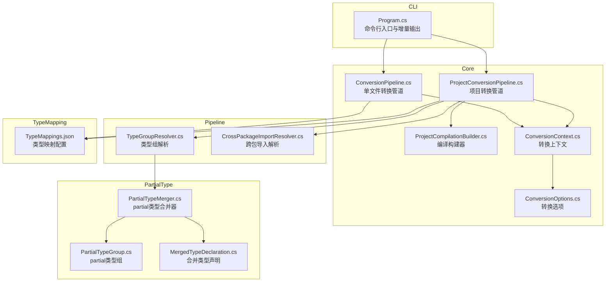
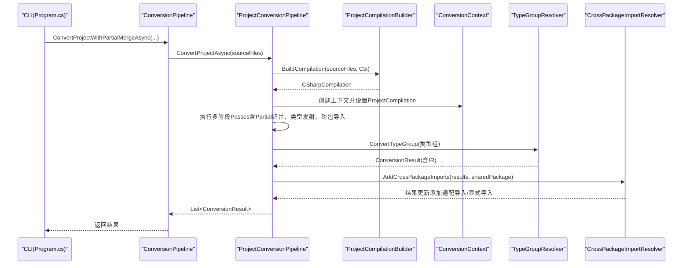
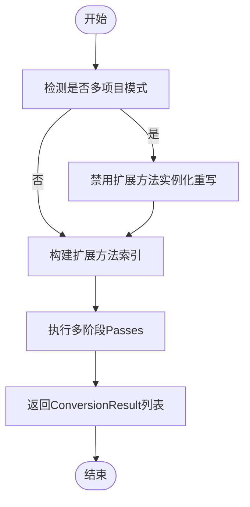
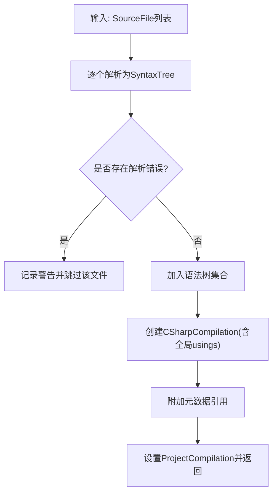
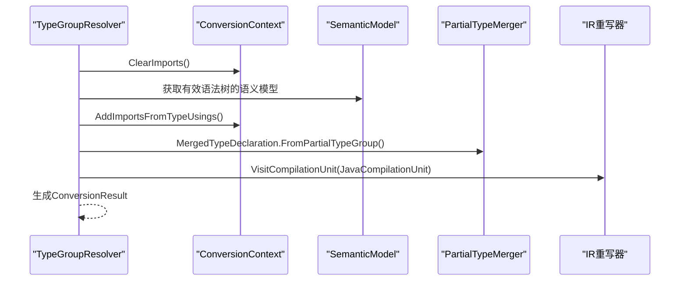
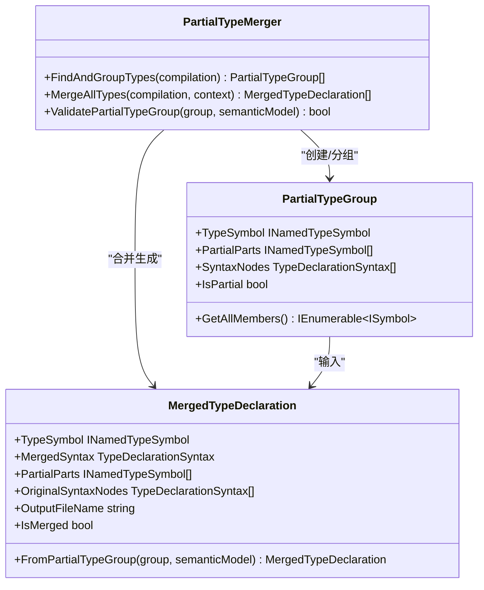
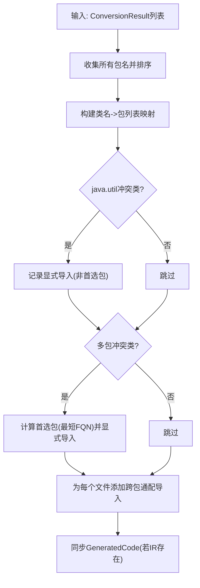
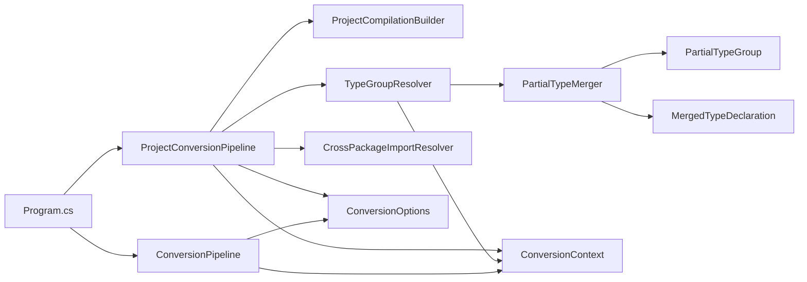

# 项目转换流程

<cite>
**本文档引用的文件**
- [ProjectConversionPipeline.cs](file://src/CSharpToJava.Core/Pipeline/ProjectConversionPipeline.cs)
- [ProjectCompilationBuilder.cs](file://src/CSharpToJava.Core/Pipeline/ProjectCompilationBuilder.cs)
- [TypeGroupResolver.cs](file://src/CSharpToJava.Core/Pipeline/TypeGroupResolver.cs)
- [CrossPackageImportResolver.cs](file://src/CSharpToJava.Core/Pipeline/CrossPackageImportResolver.cs)
- [PartialTypeMerger.cs](file://src/CSharpToJava.Core/PartialType/PartialTypeMerger.cs)
- [PartialTypeGroup.cs](file://src/CSharpToJava.Core/PartialType/PartialTypeGroup.cs)
- [MergedTypeDeclaration.cs](file://src/CSharpToJava.Core/PartialType/MergedTypeDeclaration.cs)
- [ConversionContext.cs](file://src/CSharpToJava.Core/Context/ConversionContext.cs)
- [ConversionOptions.cs](file://src/CSharpToJava.Core/Context/ConversionOptions.cs)
- [ConversionPipeline.cs](file://src/CSharpToJava.Core/Pipeline/ConversionPipeline.cs)
- [Program.cs](file://src/CSharpToJava.CLI/Program.cs)
- [README.md](file://README.md)
- [TypeMappings.json](file://config/TypeMappings.json)
</cite>

## 目录
1. [简介](#简介)
2. [项目结构](#项目结构)
3. [核心组件](#核心组件)
4. [架构总览](#架构总览)
5. [详细组件分析](#详细组件分析)
6. [依赖关系分析](#依赖关系分析)
7. [性能考量](#性能考量)
8. [故障排查指南](#故障排查指南)
9. [结论](#结论)
10. [附录](#附录)

## 简介
本文件面向cs2j项目转换流程，系统性阐述“项目级转换”与“单文件转换”的根本差异，重点覆盖以下主题：
- partial类型合并：基于符号级分析的跨文件类型合并机制
- 跨文件语义分析：通过完整编译上下文实现的全局语义一致性
- 完整编译上下文构建：语法树合并、语义模型构建与引用解析
- ProjectConversionPipeline工作原理：多文件编译、类型组解析、包导入解析与跨文件依赖处理
- ProjectCompilationBuilder编译构建过程：语法树合并、语义模型构建与引用解析
- TypeGroupResolver的partial类型合并实现
- CrossPackageImportResolver的跨包导入问题解决方案
- 实际使用示例：额外语义项目路径添加、增量转换支持与性能优化策略

## 项目结构
cs2j采用分层架构，核心转换逻辑集中在CSharpToJava.Core中，CLI负责命令行入口与增量输出管理，TypeMapping模块提供类型映射配置与索引。

图表来源
- [Program.cs:111-339](file://src/CSharpToJava.CLI/Program.cs#L111-L339)
- [ConversionPipeline.cs:268-339](file://src/CSharpToJava.Core/Pipeline/ConversionPipeline.cs#L268-L339)
- [ProjectConversionPipeline.cs:82-120](file://src/CSharpToJava.Core/Pipeline/ProjectConversionPipeline.cs#L82-L120)
- [ProjectCompilationBuilder.cs:18-78](file://src/CSharpToJava.Core/Pipeline/ProjectCompilationBuilder.cs#L18-L78)
- [TypeGroupResolver.cs:26-205](file://src/CSharpToJava.Core/Pipeline/TypeGroupResolver.cs#L26-L205)
- [CrossPackageImportResolver.cs:56-139](file://src/CSharpToJava.Core/Pipeline/CrossPackageImportResolver.cs#L56-L139)
- [PartialTypeMerger.cs:26-141](file://src/CSharpToJava.Core/PartialType/PartialTypeMerger.cs#L26-L141)
- [PartialTypeGroup.cs:10-49](file://src/CSharpToJava.Core/PartialType/PartialTypeGroup.cs#L10-L49)
- [MergedTypeDeclaration.cs:63-128](file://src/CSharpToJava.Core/PartialType/MergedTypeDeclaration.cs#L63-L128)
- [ConversionContext.cs:113-127](file://src/CSharpToJava.Core/Context/ConversionContext.cs#L113-L127)
- [ConversionOptions.cs:6-94](file://src/CSharpToJava.Core/Context/ConversionOptions.cs#L6-L94)
- [TypeMappings.json](file://config/TypeMappings.json)

章节来源
- [README.md:64-74](file://README.md#L64-L74)
- [Program.cs:111-339](file://src/CSharpToJava.CLI/Program.cs#L111-L339)

## 核心组件
- 项目转换管道（ProjectConversionPipeline）
  - 支持从源文件列表或预构建编译对象进行项目级转换
  - 构建扩展方法索引、执行多阶段转换传递（含partial归并、类型发射、跨包导入等）
- 编译构建器（ProjectCompilationBuilder）
  - 将多个源文件解析为语法树并合并到单一CSharpCompilation
  - 提供必要的元数据引用，确保类型解析与语义分析完整
- 类型组解析器（TypeGroupResolver）
  - 处理类、结构体、接口、枚举、委托的转换
  - 对partial类型进行合并，并收集类型级导入
- partial类型合并器（PartialTypeMerger）
  - 基于Roslyn符号模型识别并合并partial类型
  - 校验类型参数、可访问性与基类一致性
- 跨包导入解析器（CrossPackageImportResolver）
  - 为生成的Java文件添加跨包通配导入，解决类间可见性问题
  - 处理java.util命名冲突与同名类冲突的显式导入
- 转换上下文（ConversionContext）
  - 维护命名空间栈、类型栈、方法栈、导入集合与类型映射服务
- 转换选项（ConversionOptions）
  - 控制目标Java版本、类型映射配置、是否生成JavaDoc、是否启用LINQ重写等

章节来源
- [ProjectConversionPipeline.cs:13-234](file://src/CSharpToJava.Core/Pipeline/ProjectConversionPipeline.cs#L13-L234)
- [ProjectCompilationBuilder.cs:12-131](file://src/CSharpToJava.Core/Pipeline/ProjectCompilationBuilder.cs#L12-L131)
- [TypeGroupResolver.cs:20-461](file://src/CSharpToJava.Core/Pipeline/TypeGroupResolver.cs#L20-L461)
- [PartialTypeMerger.cs:12-285](file://src/CSharpToJava.Core/PartialType/PartialTypeMerger.cs#L12-L285)
- [CrossPackageImportResolver.cs:12-263](file://src/CSharpToJava.Core/Pipeline/CrossPackageImportResolver.cs#L12-L263)
- [ConversionContext.cs:14-234](file://src/CSharpToJava.Core/Context/ConversionContext.cs#L14-L234)
- [ConversionOptions.cs:6-94](file://src/CSharpToJava.Core/Context/ConversionOptions.cs#L6-L94)

## 架构总览
项目转换流程的关键差异在于“项目级转换”与“单文件转换”的语义范围与处理粒度：
- 单文件转换：仅针对当前文件进行解析与转换，不合并partial类型，不进行跨文件语义分析
- 项目级转换：构建完整编译上下文，合并partial类型，进行跨文件语义分析，统一处理包导入与跨包可见性

图表来源
- [Program.cs:236-339](file://src/CSharpToJava.CLI/Program.cs#L236-L339)
- [ConversionPipeline.cs:268-339](file://src/CSharpToJava.Core/Pipeline/ConversionPipeline.cs#L268-L339)
- [ProjectConversionPipeline.cs:82-120](file://src/CSharpToJava.Core/Pipeline/ProjectConversionPipeline.cs#L82-L120)
- [ProjectCompilationBuilder.cs:18-78](file://src/CSharpToJava.Core/Pipeline/ProjectCompilationBuilder.cs#L18-L78)
- [TypeGroupResolver.cs:26-205](file://src/CSharpToJava.Core/Pipeline/TypeGroupResolver.cs#L26-L205)
- [CrossPackageImportResolver.cs:56-139](file://src/CSharpToJava.Core/Pipeline/CrossPackageImportResolver.cs#L56-L139)

## 详细组件分析

### 项目转换管道（ProjectConversionPipeline）
- 职责
  - 接收源文件列表或预构建编译对象，构建转换上下文
  - 执行多阶段Passes：LINQ预处理、编译检查、平台边界检查、扩展方法检查、partial类型归并、类型发射、兼容性发射、跨包导入、模块依赖分析
  - 在多项目模式下禁用扩展方法实例化重写，避免回写已发射项目的副作用
- 关键点
  - 扩展方法索引：在单项目模式扫描当前编译，在多项目模式由调用方预填充
  - IR重写器注入：在类型发射后对结构化IR进行后处理
  - 兼容性支持生成：可集中生成共享兼容类

图表来源
- [ProjectConversionPipeline.cs:152-230](file://src/CSharpToJava.Core/Pipeline/ProjectConversionPipeline.cs#L152-L230)

章节来源
- [ProjectConversionPipeline.cs:13-234](file://src/CSharpToJava.Core/Pipeline/ProjectConversionPipeline.cs#L13-L234)

### 编译构建器（ProjectCompilationBuilder）
- 职责
  - 将源文件解析为语法树并合并到单一CSharpCompilation
  - 添加全局using树与必要的元数据引用，确保类型解析与语义分析完整
- 关键点
  - 全局usings树：保证裸标识符（如Console、List<T>）能正确解析
  - 元数据引用：包含System.Runtime、System.Collections、netstandard等常用程序集
  - 语法树过滤：跳过存在解析错误的文件

图表来源
- [ProjectCompilationBuilder.cs:18-78](file://src/CSharpToJava.Core/Pipeline/ProjectCompilationBuilder.cs#L18-L78)

章节来源
- [ProjectCompilationBuilder.cs:12-131](file://src/CSharpToJava.Core/Pipeline/ProjectCompilationBuilder.cs#L12-L131)

### 类型组解析器（TypeGroupResolver）
- 职责
  - 针对每个类型组（可能为partial合并后的结果）进行转换
  - 收集类型级导入（usings），确定包名，生成JavaCompilationUnit
  - 支持枚举与委托的特殊转换路径
- 关键点
  - 清理导入集合：每次转换前清空，避免跨文件污染
  - 语义模型选择：优先使用属于当前编译的语法树对应的语义模型
  - 合并类型声明：将多个partial部分的成员合并为单一声明
  - IR后处理：对结构化IR应用IR重写器

图表来源
- [TypeGroupResolver.cs:26-205](file://src/CSharpToJava.Core/Pipeline/TypeGroupResolver.cs#L26-L205)
- [PartialTypeMerger.cs:193-225](file://src/CSharpToJava.Core/PartialType/PartialTypeMerger.cs#L193-L225)

章节来源
- [TypeGroupResolver.cs:20-461](file://src/CSharpToJava.Core/Pipeline/TypeGroupResolver.cs#L20-L461)

### partial类型合并器（PartialTypeMerger）
- 职责
  - 遍历命名空间层次，识别partial类型并分组
  - 收集partial各部分的语法节点，合成合并后的类型声明
  - 校验类型参数、可访问性与基类一致性
- 关键点
  - 符号级识别：基于DeclaringSyntaxReferences判断partial类型
  - 成员去重：通过成员键（名称+签名）避免重复
  - 合并声明：合成新的语法节点，移除partial修饰符

图表来源
- [PartialTypeMerger.cs:26-285](file://src/CSharpToJava.Core/PartialType/PartialTypeMerger.cs#L26-L285)
- [PartialTypeGroup.cs:10-101](file://src/CSharpToJava.Core/PartialType/PartialTypeGroup.cs#L10-L101)
- [MergedTypeDeclaration.cs:63-181](file://src/CSharpToJava.Core/PartialType/MergedTypeDeclaration.cs#L63-L181)

章节来源
- [PartialTypeMerger.cs:12-285](file://src/CSharpToJava.Core/PartialType/PartialTypeMerger.cs#L12-L285)
- [PartialTypeGroup.cs:10-101](file://src/CSharpToJava.Core/PartialType/PartialTypeGroup.cs#L10-L101)
- [MergedTypeDeclaration.cs:11-181](file://src/CSharpToJava.Core/PartialType/MergedTypeDeclaration.cs#L11-L181)

### 跨包导入解析器（CrossPackageImportResolver）
- 职责
  - 收集所有包名，为每个生成文件添加跨包通配导入
  - 处理java.util命名冲突与同名类冲突，必要时添加显式单类型导入
  - 支持IR路径与字符串路径两种处理方式
- 关键点
  - 冲突检测：统计类名到包的映射，识别唯一包与首选包
  - java.util冲突：当类名与java.util保留名冲突且仅出现在一个包时，添加显式导入
  - 共享兼容包：将兼容类导入重定向到共享兼容包

图表来源
- [CrossPackageImportResolver.cs:56-139](file://src/CSharpToJava.Core/Pipeline/CrossPackageImportResolver.cs#L56-L139)

章节来源
- [CrossPackageImportResolver.cs:12-263](file://src/CSharpToJava.Core/Pipeline/CrossPackageImportResolver.cs#L12-L263)

### 单文件转换与项目转换的根本区别
- 单文件转换（ConversionPipeline.Convert）
  - 逐文件解析，不合并partial类型
  - 使用内置元数据引用与全局usings树，确保基本类型解析
  - 适用于快速验证或小规模转换
- 项目转换（ProjectConversionPipeline.ConvertProjectAsync）
  - 构建完整编译上下文，合并partial类型
  - 支持跨文件语义分析与包导入解析
  - 适合大规模工程转换与跨模块依赖处理

章节来源
- [ConversionPipeline.cs:115-221](file://src/CSharpToJava.Core/Pipeline/ConversionPipeline.cs#L115-L221)
- [ProjectConversionPipeline.cs:82-120](file://src/CSharpToJava.Core/Pipeline/ProjectConversionPipeline.cs#L82-L120)

## 依赖关系分析
- 组件耦合
  - ProjectConversionPipeline依赖ProjectCompilationBuilder、TypeGroupResolver、CrossPackageImportResolver
  - TypeGroupResolver依赖PartialTypeMerger与转换上下文
  - CLI通过Program.cs协调ConversionPipeline与ProjectConversionPipeline
- 外部依赖
  - Roslyn（Microsoft.CodeAnalysis）用于语法解析与语义分析
  - 类型映射配置（TypeMappings.json）驱动类型转换与包映射
- 可能的循环依赖
  - 当前设计通过清晰的职责划分避免循环依赖；TypeGroupResolver与PartialTypeMerger通过接口与上下文解耦

图表来源
- [ProjectConversionPipeline.cs:124-141](file://src/CSharpToJava.Core/Pipeline/ProjectConversionPipeline.cs#L124-L141)
- [TypeGroupResolver.cs:20-461](file://src/CSharpToJava.Core/Pipeline/TypeGroupResolver.cs#L20-L461)
- [PartialTypeMerger.cs:26-141](file://src/CSharpToJava.Core/PartialType/PartialTypeMerger.cs#L26-L141)
- [ConversionPipeline.cs:376-388](file://src/CSharpToJava.Core/Pipeline/ConversionPipeline.cs#L376-L388)
- [Program.cs:236-339](file://src/CSharpToJava.CLI/Program.cs#L236-L339)

章节来源
- [ProjectConversionPipeline.cs:124-141](file://src/CSharpToJava.Core/Pipeline/ProjectConversionPipeline.cs#L124-L141)
- [TypeGroupResolver.cs:20-461](file://src/CSharpToJava.Core/Pipeline/TypeGroupResolver.cs#L20-L461)
- [PartialTypeMerger.cs:26-141](file://src/CSharpToJava.Core/PartialType/PartialTypeMerger.cs#L26-L141)
- [ConversionPipeline.cs:376-388](file://src/CSharpToJava.Core/Pipeline/ConversionPipeline.cs#L376-L388)
- [Program.cs:236-339](file://src/CSharpToJava.CLI/Program.cs#L236-L339)

## 性能考量
- 并行处理
  - 项目级Passes支持并行执行（EnableParallelProjectPasses），提升大规模项目转换效率
- 增量转换
  - CLI侧通过OutputIncrementalWriteSession与指纹快照实现增量输出，避免重复写入
- 语义缓存
  - ConversionContext在清理导入时清空类型映射缓存，确保每次类型组重新触发导入收集
- 元数据引用优化
  - ProjectCompilationBuilder仅加载必要程序集，减少内存占用与解析时间

章节来源
- [ConversionOptions.cs:93-94](file://src/CSharpToJava.Core/Context/ConversionOptions.cs#L93-L94)
- [Program.cs:224-289](file://src/CSharpToJava.CLI/Program.cs#L224-L289)
- [ConversionContext.cs:182-187](file://src/CSharpToJava.Core/Context/ConversionContext.cs#L182-L187)
- [ProjectCompilationBuilder.cs:83-128](file://src/CSharpToJava.Core/Pipeline/ProjectCompilationBuilder.cs#L83-L128)

## 故障排查指南
- 解析错误
  - ProjectCompilationBuilder会记录并跳过存在解析错误的文件，建议先修复语法错误再进行转换
- 类型解析失败
  - 确认元数据引用完整（System.Runtime、System.Collections、netstandard等）
  - 检查类型映射配置（TypeMappings.json）是否正确加载
- partial类型冲突
  - PartialTypeMerger会校验类型参数、可访问性与基类一致性，冲突处会产生诊断信息
- 跨包导入冲突
  - CrossPackageImportResolver会自动添加显式导入解决冲突，若仍失败请检查包名映射与命名空间映射

章节来源
- [ProjectCompilationBuilder.cs:33-51](file://src/CSharpToJava.Core/Pipeline/ProjectCompilationBuilder.cs#L33-L51)
- [PartialTypeMerger.cs:231-283](file://src/CSharpToJava.Core/PartialType/PartialTypeMerger.cs#L231-L283)
- [CrossPackageImportResolver.cs:95-139](file://src/CSharpToJava.Core/Pipeline/CrossPackageImportResolver.cs#L95-L139)

## 结论
cs2j的项目转换流程通过“完整编译上下文 + partial类型合并 + 跨包导入解析”实现了从C#到Java的高质量转换。相较单文件转换，项目转换提供了更强的语义一致性与工程级能力，适合大规模工程迁移。通过合理的配置与增量策略，可在保证质量的同时显著提升转换效率。

## 附录

### 使用示例：项目转换
- 基本项目转换
  - CLI入口：convert-project
  - 参数：-s 源目录或.csproj/.sln，-d 输出目录
  - 适用场景：将整个项目转换为Java，自动合并partial类型并处理跨包导入
- 增量转换支持
  - CLI内部使用OutputIncrementalWriteSession与输入指纹快照，仅写入变更文件
  - 适合CI/CD流水线与持续集成环境
- 额外语义项目路径添加
  - ConversionPipeline.ConvertProjectWithPartialMergeAsync支持additionalSemanticProjectPaths参数
  - 可将其他项目的源文件纳入语义分析上下文，提升跨项目引用解析准确性
- 性能优化策略
  - 启用并行项目Passes（EnableParallelProjectPasses）
  - 合理配置类型映射与命名空间映射，减少运行时诊断与回退
  - 使用MSBuild工作区加载（若可用）以获得更完整的引用与依赖信息

章节来源
- [README.md:30-48](file://README.md#L30-L48)
- [Program.cs:111-339](file://src/CSharpToJava.CLI/Program.cs#L111-L339)
- [ConversionPipeline.cs:268-339](file://src/CSharpToJava.Core/Pipeline/ConversionPipeline.cs#L268-L339)
- [ConversionOptions.cs:93-94](file://src/CSharpToJava.Core/Context/ConversionOptions.cs#L93-L94)