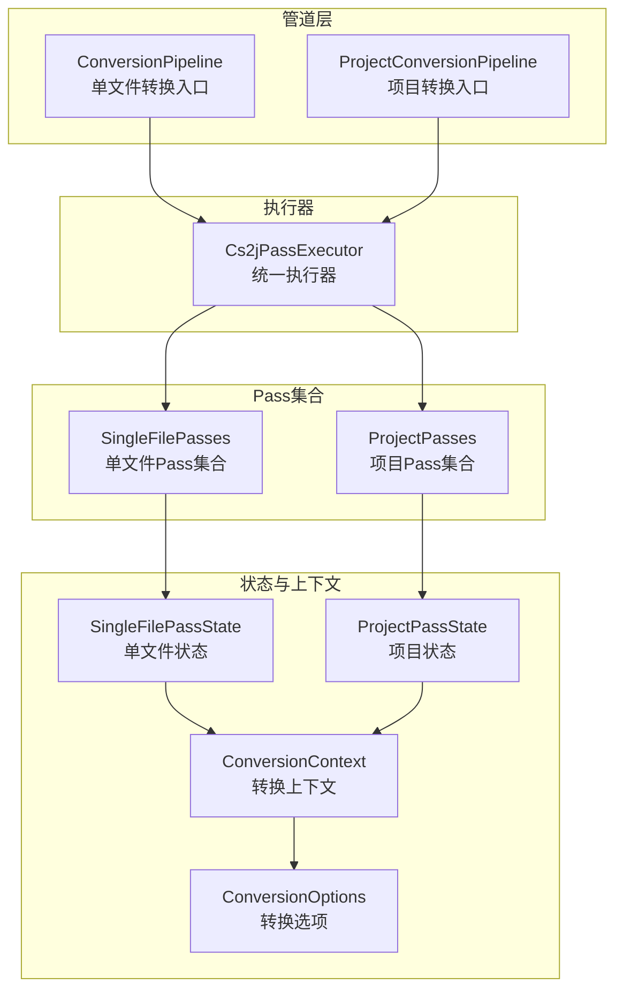
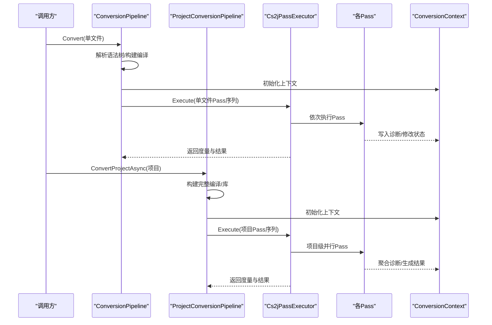
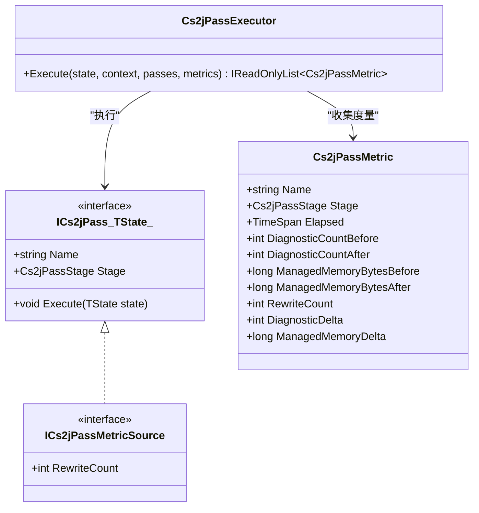
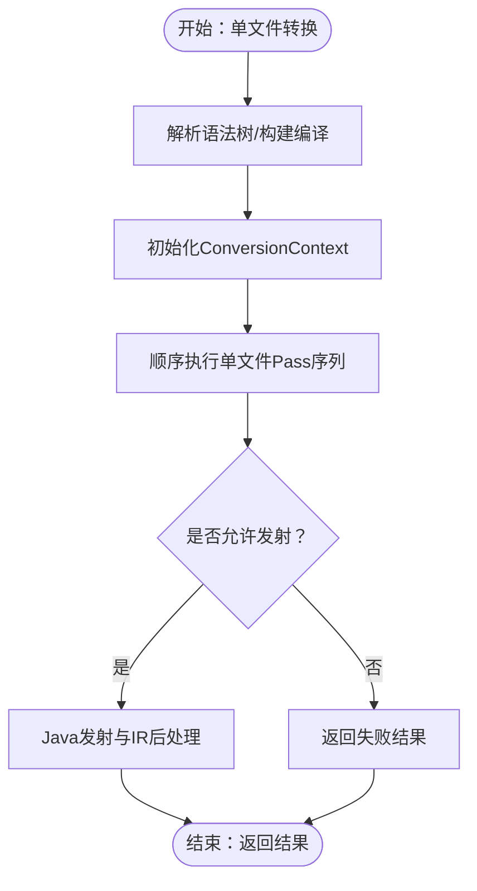
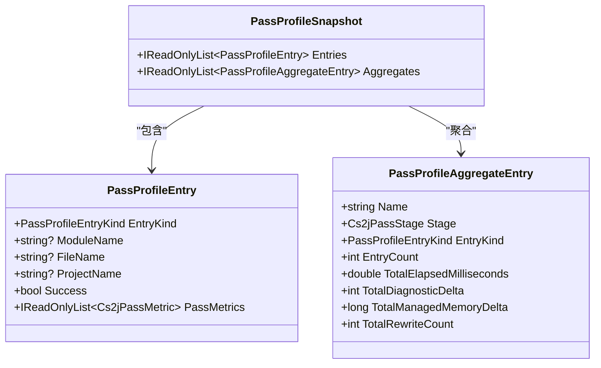
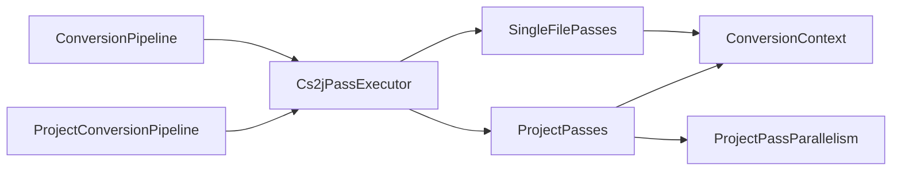

# Pass执行引擎

<cite>
**本文档引用的文件**
- [ConversionPipeline.cs](file://src/CSharpToJava.Core/Pipeline/ConversionPipeline.cs)
- [ProjectConversionPipeline.cs](file://src/CSharpToJava.Core/Pipeline/ProjectConversionPipeline.cs)
- [Cs2jPassInfrastructure.cs](file://src/CSharpToJava.Core/Pipeline/Passes/Cs2jPassInfrastructure.cs)
- [SingleFilePasses.cs](file://src/CSharpToJava.Core/Pipeline/Passes/SingleFilePasses.cs)
- [ProjectPasses.cs](file://src/CSharpToJava.Core/Pipeline/Passes/ProjectPasses.cs)
- [ProjectPassParallelism.cs](file://src/CSharpToJava.Core/Pipeline/Passes/ProjectPassParallelism.cs)
- [PassProfileSnapshot.cs](file://src/CSharpToJava.Core/Pipeline/Planning/PassProfileSnapshot.cs)
- [ConversionContext.cs](file://src/CSharpToJava.Core/Context/ConversionContext.cs)
- [ConversionOptions.cs](file://src/CSharpToJava.Core/Context/ConversionOptions.cs)
- [UnsupportedDomainPasses.cs](file://src/CSharpToJava.Core/Pipeline/Passes/UnsupportedDomainPasses.cs)
</cite>

## 目录
1. [简介](#简介)
2. [项目结构](#项目结构)
3. [核心组件](#核心组件)
4. [架构总览](#架构总览)
5. [详细组件分析](#详细组件分析)
6. [依赖关系分析](#依赖关系分析)
7. [性能考量](#性能考量)
8. [故障排查指南](#故障排查指南)
9. [结论](#结论)
10. [附录](#附录)

## 简介
本文件系统性阐述cs2j的Pass执行引擎，覆盖以下主题：
- 整体架构与调度机制：Pass队列管理、执行顺序控制、状态传播
- 转换管道设计模式：单文件转换管道与项目转换管道的差异与实现策略
- 生命周期管理：初始化、执行、验证、清理各阶段的操作要点
- 扩展与定制：自定义调度策略、性能监控、故障恢复
- 并发处理：并行执行策略、线程安全与资源竞争处理
- 配置与调优：配置项与性能优化建议

## 项目结构
Pass执行引擎位于Pipeline子系统中，围绕统一的Pass接口与执行器组织，分为单文件与项目两类转换管道，分别对应不同的状态对象与Pass集合。



**图表来源**
- [ConversionPipeline.cs:115-221](file://src/CSharpToJava.Core/Pipeline/ConversionPipeline.cs#L115-L221)
- [ProjectConversionPipeline.cs:82-120](file://src/CSharpToJava.Core/Pipeline/ProjectConversionPipeline.cs#L82-L120)
- [Cs2jPassInfrastructure.cs:53-99](file://src/CSharpToJava.Core/Pipeline/Passes/Cs2jPassInfrastructure.cs#L53-L99)
- [SingleFilePasses.cs:12-26](file://src/CSharpToJava.Core/Pipeline/Passes/SingleFilePasses.cs#L12-L26)
- [ProjectPasses.cs:11-21](file://src/CSharpToJava.Core/Pipeline/Passes/ProjectPasses.cs#L11-L21)
- [ConversionContext.cs:14-234](file://src/CSharpToJava.Core/Context/ConversionContext.cs#L14-L234)
- [ConversionOptions.cs:6-94](file://src/CSharpToJava.Core/Context/ConversionOptions.cs#L6-L94)

**章节来源**
- [ConversionPipeline.cs:115-221](file://src/CSharpToJava.Core/Pipeline/ConversionPipeline.cs#L115-L221)
- [ProjectConversionPipeline.cs:82-120](file://src/CSharpToJava.Core/Pipeline/ProjectConversionPipeline.cs#L82-L120)
- [Cs2jPassInfrastructure.cs:53-99](file://src/CSharpToJava.Core/Pipeline/Passes/Cs2jPassInfrastructure.cs#L53-L99)

## 核心组件
- 统一Pass接口与执行器
  - ICs2jPass<TState>定义了Pass的名称、阶段与执行方法
  - Cs2jPassExecutor负责遍历Pass序列，收集度量指标，包装异常
- 单文件转换管道
  - SingleFilePassState承载单文件转换所需的状态
  - 单文件Pass集合包含LINQ降级、编译检查、不支持域检查、平台边界检查、本地互操作检查、上下文归一化、Java发射等
- 项目转换管道
  - ProjectPassState承载项目级状态，含多文件诊断聚合、阻断路径记录、结果集等
  - 项目Pass集合包含LINQ降级（并行化）、编译检查、不支持域/平台边界/本地互操作检查、部分类型归一化、类型发射、兼容性发射、跨包导入、模块依赖等
- 上下文与选项
  - ConversionContext维护命名空间/类型/方法栈、导入、别名、合成记录、类型映射服务等
  - ConversionOptions提供目标Java版本、类型映射配置、Java元数据路径、是否启用LINQ重写、是否优先Stream API、是否重写扩展方法、并行开关等

**章节来源**
- [Cs2jPassInfrastructure.cs:46-99](file://src/CSharpToJava.Core/Pipeline/Passes/Cs2jPassInfrastructure.cs#L46-L99)
- [SingleFilePasses.cs:12-334](file://src/CSharpToJava.Core/Pipeline/Passes/SingleFilePasses.cs#L12-L334)
- [ProjectPasses.cs:11-699](file://src/CSharpToJava.Core/Pipeline/Passes/ProjectPasses.cs#L11-L699)
- [ConversionContext.cs:14-234](file://src/CSharpToJava.Core/Context/ConversionContext.cs#L14-L234)
- [ConversionOptions.cs:6-94](file://src/CSharpToJava.Core/Context/ConversionOptions.cs#L6-L94)

## 架构总览
Pass执行引擎采用“管道+Pass序列”的分层架构：
- 管道层负责输入解析、编译构建、Pass序列装配与结果封装
- 执行器层负责顺序执行、度量采集、异常包装与状态传播
- Pass层按阶段划分（降级、检查、归一化、发射），既可单文件也可项目级并行



**图表来源**
- [ConversionPipeline.cs:115-221](file://src/CSharpToJava.Core/Pipeline/ConversionPipeline.cs#L115-L221)
- [ProjectConversionPipeline.cs:82-120](file://src/CSharpToJava.Core/Pipeline/ProjectConversionPipeline.cs#L82-L120)
- [Cs2jPassInfrastructure.cs:55-98](file://src/CSharpToJava.Core/Pipeline/Passes/Cs2jPassInfrastructure.cs#L55-L98)

## 详细组件分析

### 组件A：Pass执行器与度量体系
- 执行流程
  - 遍历Pass序列，记录执行前诊断数与托管内存
  - 调用Pass.Execute，捕获非包装异常并包装为Cs2jPassExecutionException
  - 记录执行耗时、诊断变化、内存变化、重写计数（若实现ICs2jPassMetricSource）
- 度量模型
  - Cs2jPassMetric包含Pass名称、阶段、耗时、前后诊断数、前后托管内存、重写次数
  - 支持通过Pass实现ICs2jPassMetricSource上报重写统计



**图表来源**
- [Cs2jPassInfrastructure.cs:46-99](file://src/CSharpToJava.Core/Pipeline/Passes/Cs2jPassInfrastructure.cs#L46-L99)

**章节来源**
- [Cs2jPassInfrastructure.cs:55-98](file://src/CSharpToJava.Core/Pipeline/Passes/Cs2jPassInfrastructure.cs#L55-L98)

### 组件B：单文件转换管道
- 输入与状态
  - SingleFilePassState包含请求、上下文、语法树、编译、库、生成代码、阻断标志、Java IR等
- Pass序列（顺序执行）
  - SingleFileLinqDesugarPass：条件性LINQ降级（语法降级+语义重写），重建编译与库
  - SingleFileCompilationCheckPass：校验主编译与当前语法树一致性
  - SingleFileUnsupportedDomainCheckPass：检测不支持域（如WinForms、Maui等）并阻断发射
  - SingleFilePlatformBoundaryCheckPass：检测平台边界API并阻断发射
  - SingleFileNativeInteropCheckPass：检测本地互操作API并阻断发射
  - SingleFileContextNormalizationPass：清理并归一化上下文状态
  - SingleFileJavaEmitPass：执行Java发射与IR后处理（兼容性重写、结构重写、验证重写）
- 结果封装
  - 成功则返回生成代码；失败则汇总诊断



**图表来源**
- [ConversionPipeline.cs:115-221](file://src/CSharpToJava.Core/Pipeline/ConversionPipeline.cs#L115-L221)
- [SingleFilePasses.cs:28-334](file://src/CSharpToJava.Core/Pipeline/Passes/SingleFilePasses.cs#L28-L334)

**章节来源**
- [ConversionPipeline.cs:115-221](file://src/CSharpToJava.Core/Pipeline/ConversionPipeline.cs#L115-L221)
- [SingleFilePasses.cs:28-334](file://src/CSharpToJava.Core/Pipeline/Passes/SingleFilePasses.cs#L28-L334)

### 组件C：项目转换管道
- 输入与状态
  - ProjectPassState包含库、上下文、编译、待发射文件集合、类型组、阻断路径、文件级诊断聚合、结果集等
- Pass序列（项目级并行化）
  - ProjectLinqDesugarPass：对每个语法树进行LINQ语法降级与方法链重写，支持并行确定性执行
  - ProjectCompilationCheckPass：确保编译包含语法树
  - ProjectUnsupportedDomainCheckPass/PlatformBoundaryCheckPass/NativeInteropCheckPass：逐文件并行分析，聚合诊断并记录阻断路径
  - ProjectPartialTypeNormalizationPass：查找并分组部分类型
  - ProjectTypeEmitPass：对类型组进行发射，应用用户与内置IR重写器，按候选路径过滤
  - ProjectCompatibilityEmitPass：根据选项生成兼容性辅助类
  - ProjectCrossPackageImportEmitPass：添加跨包导入
  - ProjectJavaModuleDependencyPass：分析模块依赖（由外部Pass提供）
- 结果与度量
  - 将度量附加到每个结果，支持聚合快照

```mermaid
sequenceDiagram
participant PCP as "ProjectConversionPipeline"
participant EX as "Cs2jPassExecutor"
participant PASSES as "项目Pass序列"
participant PAR as "ProjectPassParallelism"
participant STATE as "ProjectPassState"
PCP->>EX : Execute(项目Pass序列)
EX->>PASSES : 逐Pass执行
PASSES->>PAR : 并行处理语法树/诊断
PAR-->>PASSES : 确定性结果数组
PASSES->>STATE : 聚合诊断/阻断路径/结果
EX-->>PCP : 返回度量与结果
```

**图表来源**
- [ProjectConversionPipeline.cs:124-230](file://src/CSharpToJava.Core/Pipeline/ProjectConversionPipeline.cs#L124-L230)
- [ProjectPasses.cs:143-305](file://src/CSharpToJava.Core/Pipeline/Passes/ProjectPasses.cs#L143-L305)
- [ProjectPassParallelism.cs:5-31](file://src/CSharpToJava.Core/Pipeline/Passes/ProjectPassParallelism.cs#L5-L31)

**章节来源**
- [ProjectConversionPipeline.cs:124-230](file://src/CSharpToJava.Core/Pipeline/ProjectConversionPipeline.cs#L124-L230)
- [ProjectPasses.cs:143-305](file://src/CSharpToJava.Core/Pipeline/Passes/ProjectPasses.cs#L143-L305)
- [ProjectPassParallelism.cs:5-31](file://src/CSharpToJava.Core/Pipeline/Passes/ProjectPassParallelism.cs#L5-L31)

### 组件D：Pass度量与性能观测
- 度量采集
  - 执行前后统计诊断数量与托管内存，计算差值
  - 可选重写计数（如LINQ重写Pass实现ICs2jPassMetricSource）
- 快照与聚合
  - PassProfileSnapshot将每个Pass的度量按名称与阶段聚合，便于报告与对比



**图表来源**
- [PassProfileSnapshot.cs:12-143](file://src/CSharpToJava.Core/Pipeline/Planning/PassProfileSnapshot.cs#L12-L143)

**章节来源**
- [PassProfileSnapshot.cs:12-143](file://src/CSharpToJava.Core/Pipeline/Planning/PassProfileSnapshot.cs#L12-L143)

## 依赖关系分析
- 管道到执行器
  - ConversionPipeline与ProjectConversionPipeline均通过Cs2jPassExecutor执行Pass序列
- 执行器到Pass
  - 执行器不关心Pass内部逻辑，仅调用Execute并收集度量
- Pass到上下文
  - 各Pass通过ConversionContext访问类型映射、诊断收集、导入/别名、方法状态等
- 项目级并行
  - ProjectPassParallelism提供确定性并行执行，避免竞态同时保持顺序一致性



**图表来源**
- [ConversionPipeline.cs:205](file://src/CSharpToJava.Core/Pipeline/ConversionPipeline.cs#L205)
- [ProjectConversionPipeline.cs:197](file://src/CSharpToJava.Core/Pipeline/ProjectConversionPipeline.cs#L197)
- [ProjectPassParallelism.cs:5-31](file://src/CSharpToJava.Core/Pipeline/Passes/ProjectPassParallelism.cs#L5-L31)

**章节来源**
- [ConversionPipeline.cs:205](file://src/CSharpToJava.Core/Pipeline/ConversionPipeline.cs#L205)
- [ProjectConversionPipeline.cs:197](file://src/CSharpToJava.Core/Pipeline/ProjectConversionPipeline.cs#L197)
- [ProjectPassParallelism.cs:5-31](file://src/CSharpToJava.Core/Pipeline/Passes/ProjectPassParallelism.cs#L5-L31)

## 性能考量
- 并行策略
  - 项目级Pass通过ProjectPassParallelism在EnableParallelProjectPasses开启时并行处理语法树，保证结果顺序一致
- 度量与可观测性
  - Cs2jPassExecutor自动采集耗时、诊断变化、内存变化与重写计数，结合PassProfileSnapshot进行聚合分析
- 编译与库重建
  - 单文件与项目级LINQ降级后会重建编译与库，避免重复解析带来的开销
- 选项调优
  - EnableLinqRewrite：关闭可跳过重写阶段，减少编译重建
  - EffectivePreferStreamApi：Java 25默认倾向Stream API，可减少过程化重写
  - EnableParallelProjectPasses：在多核环境下提升项目级Pass吞吐

**章节来源**
- [ProjectPassParallelism.cs:5-31](file://src/CSharpToJava.Core/Pipeline/Passes/ProjectPassParallelism.cs#L5-L31)
- [Cs2jPassInfrastructure.cs:55-98](file://src/CSharpToJava.Core/Pipeline/Passes/Cs2jPassInfrastructure.cs#L55-L98)
- [ConversionOptions.cs:48-93](file://src/CSharpToJava.Core/Context/ConversionOptions.cs#L48-L93)

## 故障排查指南
- 异常包装
  - 执行器将非包装异常包装为Cs2jPassExecutionException，包含Pass名称与阶段，便于定位
- 诊断收集
  - 不支持域/平台边界/本地互操作检查Pass会向ConversionContext.Diagnostics写入错误，阻断发射
- 文件级阻断
  - 项目级Pass通过ProjectPassState.RegisterFileDiagnostics与BlockedFilePaths记录阻断路径，避免输出不完整代码
- 常见问题
  - 语法错误：单文件解析阶段即失败，返回错误诊断
  - 无主编译：单文件库未包含主编译或语法树不在主编译内
  - 未解析扩展方法：项目级扩展方法检查会发出警告，必要时需预填充扩展方法索引

**章节来源**
- [Cs2jPassInfrastructure.cs:77-80](file://src/CSharpToJava.Core/Pipeline/Passes/Cs2jPassInfrastructure.cs#L77-L80)
- [UnsupportedDomainPasses.cs:20-71](file://src/CSharpToJava.Core/Pipeline/Passes/UnsupportedDomainPasses.cs#L20-L71)
- [ProjectPasses.cs:22-68](file://src/CSharpToJava.Core/Pipeline/Passes/ProjectPasses.cs#L22-L68)

## 结论
Pass执行引擎以统一接口与执行器为核心，通过单文件与项目两类管道满足不同规模的转换需求。其设计强调：
- 明确的阶段划分与顺序控制
- 完整的状态传播与诊断聚合
- 可扩展的IR重写与性能度量
- 项目级并行与确定性结果
- 清晰的异常包装与故障恢复

## 附录

### A. 生命周期管理（初始化—执行—验证—清理）
- 初始化
  - 构建TypeMappingRegistry与JavaLibraryIndex（若配置）
  - 创建ConversionContext并注入Options与TypeMappings
- 执行
  - Cs2jPassExecutor顺序执行Pass，收集度量
  - 单文件：直接顺序执行；项目：部分Pass并行执行
- 验证
  - 不支持域/平台边界/本地互操作检查Pass产出诊断
  - Java IR后处理重写器进行结构与API验证
- 清理
  - 归一化Pass清理上下文状态
  - 结果集中保留诊断与度量，便于后续报告

**章节来源**
- [ConversionPipeline.cs:117-136](file://src/CSharpToJava.Core/Pipeline/ConversionPipeline.cs#L117-L136)
- [ProjectConversionPipeline.cs:58-75](file://src/CSharpToJava.Core/Pipeline/ProjectConversionPipeline.cs#L58-L75)
- [SingleFilePasses.cs:204-218](file://src/CSharpToJava.Core/Pipeline/Passes/SingleFilePasses.cs#L204-L218)
- [ProjectPasses.cs:430-440](file://src/CSharpToJava.Core/Pipeline/Passes/ProjectPasses.cs#L430-L440)

### B. 扩展与定制指南
- 自定义调度策略
  - 实现ICs2jPass<TState>并注册到相应管道的Pass序列
  - 若需度量，实现ICs2jPassMetricSource上报重写计数
- 性能监控
  - 使用Cs2jPassExecutor返回的度量集合，结合PassProfileSnapshot进行聚合
- 故障恢复
  - 在Pass中捕获并记录诊断，必要时设置阻断标志阻止发射
  - 对于项目级并行Pass，确保分析结果可合并且顺序确定

**章节来源**
- [Cs2jPassInfrastructure.cs:46-99](file://src/CSharpToJava.Core/Pipeline/Passes/Cs2jPassInfrastructure.cs#L46-L99)
- [PassProfileSnapshot.cs:87-120](file://src/CSharpToJava.Core/Pipeline/Planning/PassProfileSnapshot.cs#L87-L120)

### C. 并发处理能力
- 并行执行策略
  - 项目级Pass通过ProjectPassParallelism在多核环境下并行处理语法树
- 线程安全保证
  - 执行器与Pass不共享可变状态，仅通过TState与ConversionContext交互
- 资源竞争处理
  - 通过确定性并行（固定索引写入结果数组）避免竞态
  - 诊断与阻断路径通过线程安全的数据结构聚合

**章节来源**
- [ProjectPassParallelism.cs:5-31](file://src/CSharpToJava.Core/Pipeline/Passes/ProjectPassParallelism.cs#L5-L31)
- [ProjectPasses.cs:333-355](file://src/CSharpToJava.Core/Pipeline/Passes/ProjectPasses.cs#L333-L355)

### D. 配置选项与性能调优
- 关键选项
  - EnableLinqRewrite：控制是否进行LINQ降级
  - EffectivePreferStreamApi：Java 25默认启用Stream API
  - RewriteExtensionMethods：是否将扩展方法实例化
  - EnableParallelProjectPasses：是否启用项目级并行
  - EmitCompatibilityHelpers/UseCompatibilityPacks/SharedCompatibilityPackage：兼容性辅助类生成策略
- 调优建议
  - 大项目开启EnableParallelProjectPasses
  - 需要更快反馈可关闭EnableLinqRewrite
  - 多核环境配合度量观察并行收益

**章节来源**
- [ConversionOptions.cs:6-94](file://src/CSharpToJava.Core/Context/ConversionOptions.cs#L6-L94)