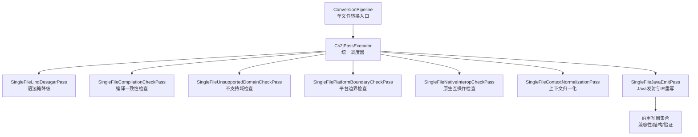
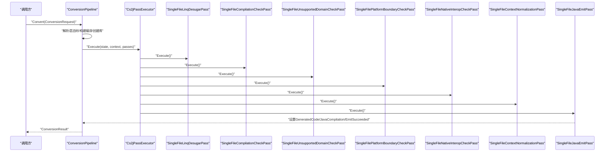
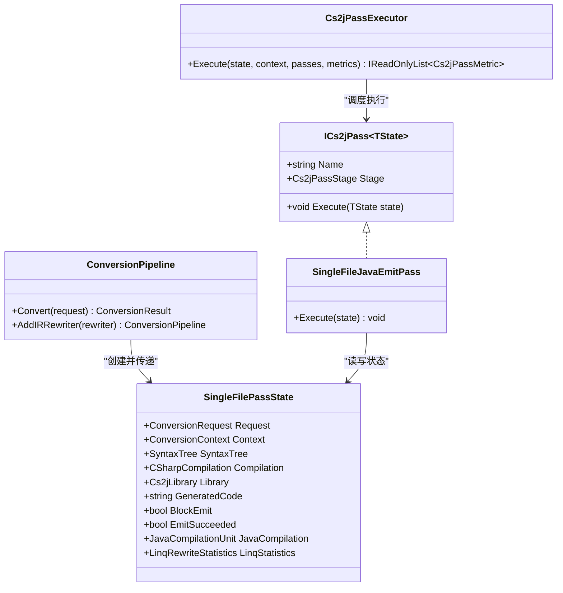

# 单文件转换Pass系统

<cite>
**本文档引用的文件**
- [ConversionPipeline.cs](file://src/CSharpToJava.Core/Pipeline/ConversionPipeline.cs)
- [SingleFilePasses.cs](file://src/CSharpToJava.Core/Pipeline/Passes/SingleFilePasses.cs)
- [Cs2jPassInfrastructure.cs](file://src/CSharpToJava.Core/Pipeline/Passes/Cs2jPassInfrastructure.cs)
- [UnsupportedDomainPasses.cs](file://src/CSharpToJava.Core/Pipeline/Passes/UnsupportedDomainPasses.cs)
- [JavaValidationPasses.cs](file://src/CSharpToJava.Core/Pipeline/Passes/JavaValidationPasses.cs)
- [ConversionContext.cs](file://src/CSharpToJava.Core/Context/ConversionContext.cs)
- [ConversionOptions.cs](file://src/CSharpToJava.Core/Context/ConversionOptions.cs)
- [ITransformer.cs](file://src/CSharpToJava.Core/Abstractions/ITransformer.cs)
- [ProjectConversionPipeline.cs](file://src/CSharpToJava.Core/Pipeline/ProjectConversionPipeline.cs)
- [ProjectPasses.cs](file://src/CSharpToJava.Core/Pipeline/Passes/ProjectPasses.cs)
</cite>

## 目录
1. [简介](#简介)
2. [项目结构](#项目结构)
3. [核心组件](#核心组件)
4. [架构总览](#架构总览)
5. [详细组件分析](#详细组件分析)
6. [依赖关系分析](#依赖关系分析)
7. [性能考虑](#性能考虑)
8. [故障排除指南](#故障排除指南)
9. [结论](#结论)
10. [附录：自定义单文件Pass示例](#附录自定义单文件pass示例)

## 简介
本文件面向cs2j单文件转换Pass系统，系统性阐述单文件Pass的设计架构与执行机制，涵盖Pass生命周期管理、错误处理策略、状态传递机制、内置Pass功能与实现、Pass间依赖关系与执行顺序、统一Pass管理与调度机制，并提供创建自定义单文件Pass的实践指导。

## 项目结构
单文件转换Pass系统位于Pipeline子模块中，围绕ConversionPipeline入口组织，通过统一的Pass基础设施(Cs2jPassInfrastructure)驱动多个单文件Pass的有序执行。核心文件包括：
- 入口与状态：ConversionPipeline、SingleFilePassState
- Pass基础设施：ICs2jPass接口、Cs2jPassExecutor、Cs2jPassStage、Cs2jPassMetric
- 内置单文件Pass：SingleFileLinqDesugarPass、SingleFileCompilationCheckPass、SingleFileUnsupportedDomainCheckPass、SingleFilePlatformBoundaryCheckPass、SingleFileNativeInteropCheckPass、SingleFileContextNormalizationPass、SingleFileJavaEmitPass
- 错误域检查：UnsupportedDomainAnalyzer、PlatformBoundaryAnalyzer、NativeInteropAnalyzer
- Java模块依赖分析：SingleFileJavaModuleDependencyPass、ProjectJavaModuleDependencyPass
- 上下文与选项：ConversionContext、ConversionOptions
- 转换器抽象：ITransformer族

图表来源
- [ConversionPipeline.cs:376-388](file://src/CSharpToJava.Core/Pipeline/ConversionPipeline.cs#L376-L388)
- [Cs2jPassInfrastructure.cs:53-99](file://src/CSharpToJava.Core/Pipeline/Passes/Cs2jPassInfrastructure.cs#L53-L99)
- [SingleFilePasses.cs:28-334](file://src/CSharpToJava.Core/Pipeline/Passes/SingleFilePasses.cs#L28-L334)

章节来源
- [ConversionPipeline.cs:115-221](file://src/CSharpToJava.Core/Pipeline/ConversionPipeline.cs#L115-L221)
- [SingleFilePasses.cs:28-334](file://src/CSharpToJava.Core/Pipeline/Passes/SingleFilePasses.cs#L28-L334)
- [Cs2jPassInfrastructure.cs:46-99](file://src/CSharpToJava.Core/Pipeline/Passes/Cs2jPassInfrastructure.cs#L46-L99)

## 核心组件
- 单文件Pass状态容器SingleFilePassState：承载请求、上下文、语法树、编译对象、库对象、生成代码、发射控制标志、Java IR编译单元与LINQ统计等。
- Pass基础设施：
  - ICs2jPass<TState>：定义Pass接口，包含Name、Stage、Execute方法。
  - Cs2jPassExecutor：统一执行器，负责度量诊断数量、内存变化、执行耗时，捕获异常并包装为Cs2jPassExecutionException。
  - Cs2jPassStage：阶段枚举（Desugar、Check、Normalize、Emit）。
  - Cs2jPassMetric：Pass指标记录（名称、阶段、耗时、诊断前后数量、内存前后字节、重写次数）。
- 上下文与选项：ConversionContext提供命名空间/类型/方法栈、导入类型集合、类型映射服务、诊断收集器、部分类型合并存储、别名注册表等；ConversionOptions控制目标版本、类型映射配置、Java元数据路径、是否生成JavaDoc、是否使用Record、是否使用Optional替代nullable、是否启用LINQ预处理、是否优先Stream API、扩展方法重写策略、兼容层生成策略等。

章节来源
- [SingleFilePasses.cs:12-26](file://src/CSharpToJava.Core/Pipeline/Passes/SingleFilePasses.cs#L12-L26)
- [Cs2jPassInfrastructure.cs:6-51](file://src/CSharpToJava.Core/Pipeline/Passes/Cs2jPassInfrastructure.cs#L6-L51)
- [ConversionContext.cs:14-234](file://src/CSharpToJava.Core/Context/ConversionContext.cs#L14-L234)
- [ConversionOptions.cs:6-103](file://src/CSharpToJava.Core/Context/ConversionOptions.cs#L6-L103)

## 架构总览
单文件转换流程由ConversionPipeline发起，构建Roslyn语法树与语义模型，随后通过Cs2jPassExecutor依次执行一组单文件Pass。每个Pass在特定阶段内完成其职责，状态在Pass之间以SingleFilePassState传递，错误通过DiagnosticCollector收集并在最终ConversionResult汇总。

图表来源
- [ConversionPipeline.cs:115-221](file://src/CSharpToJava.Core/Pipeline/ConversionPipeline.cs#L115-L221)
- [Cs2jPassInfrastructure.cs:53-99](file://src/CSharpToJava.Core/Pipeline/Passes/Cs2jPassInfrastructure.cs#L53-L99)
- [SingleFilePasses.cs:28-334](file://src/CSharpToJava.Core/Pipeline/Passes/SingleFilePasses.cs#L28-L334)

## 详细组件分析

### Pass基础设施与生命周期
- 接口与执行器
  - ICs2jPass<TState>：每个Pass必须实现Name、Stage、Execute方法。
  - Cs2jPassExecutor.Execute：遍历Pass序列，记录执行前后的诊断数量与托管内存，测量耗时，捕获非Cs2jPassExecutionException并包装为统一异常类型，便于定位失败的Pass名称与阶段。
- 生命周期管理
  - 初始化：ConversionPipeline在Convert中创建TypeMappingRegistry、ConversionContext、SingleFilePassState并填充请求、语法树、编译、库对象。
  - 执行：Cs2jPassExecutor.Execute按顺序调用各Pass的Execute，期间可修改状态（如BlockEmit、GeneratedCode、EmitSucceeded、JavaCompilation、LinQ统计）。
  - 结果：根据EmitSucceeded决定成功或失败，最终封装为ConversionResult，包含诊断、Pass指标、LINQ统计、包名、模块依赖等。
- 错误处理策略
  - 语法解析错误：直接收集诊断并返回失败结果。
  - 语义模型不可用：跳过需要语义的Pass并发出警告。
  - 执行异常：统一包装为Cs2jPassExecutionException，包含Pass名称与阶段。
  - 诊断聚合：通过DiagnosticCollector累积，最终在ConversionResult中呈现。
- 状态传递机制
  - SingleFilePassState作为共享状态载体，贯穿所有Pass。例如：BlockEmit用于阻止发射；GeneratedCode保存生成的Java代码；JavaCompilation保留结构化IR以便后续Pass使用；LinQStatistics携带降级与重写统计。

章节来源
- [Cs2jPassInfrastructure.cs:46-99](file://src/CSharpToJava.Core/Pipeline/Passes/Cs2jPassInfrastructure.cs#L46-L99)
- [ConversionPipeline.cs:115-221](file://src/CSharpToJava.Core/Pipeline/ConversionPipeline.cs#L115-L221)
- [SingleFilePasses.cs:12-26](file://src/CSharpToJava.Core/Pipeline/Passes/SingleFilePasses.cs#L12-L26)

### 内置单文件Pass详解

#### 语法树解析与降级Pass（SingleFileLinqDesugarPass）
- 目标：在启用LINQ预处理且不优先Stream API时，先进行语法级降级（查询表达式转方法链），再进行语义级重写（方法链转过程化循环）。
- 关键逻辑：
  - 若启用预处理，对语法树进行降级，重建语法树与编译对象，更新Library与SemanticModel。
  - 对降级后的语法树进行LinqRewriter重写，统计重写数量与跳过链路，再次重建编译与Library。
  - 将统计信息写入Pass与全局状态。
- 影响：为后续发射阶段提供更易处理的语法树，减少运行时复杂度。

章节来源
- [SingleFilePasses.cs:28-118](file://src/CSharpToJava.Core/Pipeline/Passes/SingleFilePasses.cs#L28-L118)

#### 编译一致性检查Pass（SingleFileCompilationCheckPass）
- 目标：确保单文件库包含主编译且当前语法树属于该编译，否则抛出异常。
- 关键逻辑：校验Library.PrimaryCompilation与SyntaxTree归属，必要时更新SemanticModel。

章节来源
- [SingleFilePasses.cs:120-140](file://src/CSharpToJava.Core/Pipeline/Passes/SingleFilePasses.cs#L120-L140)

#### 不支持域检查Pass（SingleFileUnsupportedDomainCheckPass）
- 目标：检测C# WinForms、WPF、Maui、XAML等不支持的命名空间与成员。
- 关键逻辑：扫描using指令、限定名、成员访问表达式，匹配预设不支持前缀，产生错误诊断并可能阻断发射。

章节来源
- [SingleFilePasses.cs:142-160](file://src/CSharpToJava.Core/Pipeline/Passes/SingleFilePasses.cs#L142-L160)
- [UnsupportedDomainPasses.cs:8-72](file://src/CSharpToJava.Core/Pipeline/Passes/UnsupportedDomainPasses.cs#L8-L72)

#### 平台边界检查Pass（SingleFilePlatformBoundaryCheckPass）
- 目标：识别平台特定API（如Registry、EventLog、SerialPort、OS平台判断）与属性，要求隔离后再转换。
- 关键逻辑：基于语义模型解析符号身份，匹配平台类型与成员前缀，产生错误诊断并可能阻断发射。

章节来源
- [SingleFilePasses.cs:162-181](file://src/CSharpToJava.Core/Pipeline/Passes/SingleFilePasses.cs#L162-L181)
- [UnsupportedDomainPasses.cs:74-194](file://src/CSharpToJava.Core/Pipeline/Passes/UnsupportedDomainPasses.cs#L74-L194)

#### 原生互操作检查Pass（SingleFileNativeInteropCheckPass）
- 目标：识别DllImport、LibraryImport、ComImport、MarshalAs、StructLayout、GCHandle、SafeHandle、extern方法等原生互操作特性。
- 关键逻辑：扫描特性、extern方法、调用与类型访问，匹配原生互操作类型前缀，产生错误诊断并可能阻断发射。

章节来源
- [SingleFilePasses.cs:183-202](file://src/CSharpToJava.Core/Pipeline/Passes/SingleFilePasses.cs#L183-L202)
- [UnsupportedDomainPasses.cs:196-313](file://src/CSharpToJava.Core/Pipeline/Passes/UnsupportedDomainPasses.cs#L196-L313)

#### 上下文归一化Pass（SingleFileContextNormalizationPass）
- 目标：在发射前清理与归一化上下文状态，确保类型映射、导入、别名、部分类型合并与合成记录等处于一致状态。
- 关键逻辑：重置ProjectCompilation、清空导入与别名、清空部分类型合并与合成记录缓存、重建SemanticModel。

章节来源
- [SingleFilePasses.cs:204-219](file://src/CSharpToJava.Core/Pipeline/Passes/SingleFilePasses.cs#L204-L219)

#### Java发射与IR重写Pass（SingleFileJavaEmitPass）
- 目标：将C#语法树转换为Java IR，应用用户注册与内置IR重写器，执行结构化验证，最终生成Java代码。
- 关键逻辑：
  - 若BlockEmit为真，直接失败并清空生成代码。
  - 使用CSharpToJavaVisitor生成JavaCompilationUnit。
  - 应用用户注册IR重写器与内置兼容性/结构/验证重写器。
  - 在存在Java元数据时执行API验证与异常检查重写器。
  - 生成字符串代码，保留JavaCompilation以便后续Pass使用。
- 影响：这是唯一能产出成功结果的Pass，其他Pass主要负责前置检查与准备。

章节来源
- [SingleFilePasses.cs:221-334](file://src/CSharpToJava.Core/Pipeline/Passes/SingleFilePasses.cs#L221-L334)

### 依赖关系与执行顺序
- 显式顺序：ConversionPipeline.CreateSingleFilePasses定义了固定顺序，确保先降级与检查，再归一化，最后发射。
- 隐式依赖：
  - SingleFileLinqDesugarPass依赖EnableLinqRewrite与EffectivePreferStreamApi选项。
  - 多数检查Pass依赖语义模型（SemanticModel），若不可用则跳过或发出警告。
  - SingleFileJavaEmitPass依赖前序Pass提供的语法树与编译对象，以及上下文的类型映射与诊断收集器。

章节来源
- [ConversionPipeline.cs:376-388](file://src/CSharpToJava.Core/Pipeline/ConversionPipeline.cs#L376-L388)
- [SingleFilePasses.cs:28-334](file://src/CSharpToJava.Core/Pipeline/Passes/SingleFilePasses.cs#L28-L334)

### 与其他Pass的协作
- 与项目级Pass协作：单文件模式不参与项目级Pass（如PartialTypeNormalization、TypeEmit、CompatibilityEmit、CrossPackageImport、JavaModuleDependency等），这些在ProjectConversionPipeline中实现。
- 与IR重写器协作：SingleFileJavaEmitPass在发射阶段串联用户注册与内置IR重写器，形成统一的IR后处理流水线。
- 与诊断系统协作：所有Pass通过ConversionContext.Diagnostics收集诊断，最终在ConversionResult中统一呈现。

章节来源
- [ProjectConversionPipeline.cs:13-234](file://src/CSharpToJava.Core/Pipeline/ProjectConversionPipeline.cs#L13-L234)
- [ProjectPasses.cs:442-560](file://src/CSharpToJava.Core/Pipeline/Passes/ProjectPasses.cs#L442-L560)
- [SingleFilePasses.cs:221-334](file://src/CSharpToJava.Core/Pipeline/Passes/SingleFilePasses.cs#L221-L334)

## 依赖关系分析

图表来源
- [Cs2jPassInfrastructure.cs:46-99](file://src/CSharpToJava.Core/Pipeline/Passes/Cs2jPassInfrastructure.cs#L46-L99)
- [SingleFilePasses.cs:12-26](file://src/CSharpToJava.Core/Pipeline/Passes/SingleFilePasses.cs#L12-L26)
- [ConversionPipeline.cs:115-221](file://src/CSharpToJava.Core/Pipeline/ConversionPipeline.cs#L115-L221)

章节来源
- [Cs2jPassInfrastructure.cs:46-99](file://src/CSharpToJava.Core/Pipeline/Passes/Cs2jPassInfrastructure.cs#L46-L99)
- [SingleFilePasses.cs:12-26](file://src/CSharpToJava.Core/Pipeline/Passes/SingleFilePasses.cs#L12-L26)
- [ConversionPipeline.cs:115-221](file://src/CSharpToJava.Core/Pipeline/ConversionPipeline.cs#L115-L221)

## 性能考虑
- Pass指标采集：Cs2jPassExecutor在每次Pass执行前后记录诊断数量与托管内存，便于评估Pass开销与潜在泄漏。
- 耗时统计：使用Stopwatch精确测量每个Pass耗时，有助于定位瓶颈。
- 并行化策略：项目级Pass具备并行执行能力（EnableParallelProjectPasses），但单文件Pass默认串行执行，避免状态竞争。
- 语义模型重建：Linq降级与重写会重建语法树与编译对象，注意其成本；仅在必要时触发。

章节来源
- [Cs2jPassInfrastructure.cs:53-99](file://src/CSharpToJava.Core/Pipeline/Passes/Cs2jPassInfrastructure.cs#L53-L99)
- [SingleFilePasses.cs:52-112](file://src/CSharpToJava.Core/Pipeline/Passes/SingleFilePasses.cs#L52-L112)

## 故障排除指南
- 语法解析错误：查看ConversionResult.Diagnostics中严重级别为Error的条目，通常由Roslyn解析阶段产生。
- 语义模型不可用：某些Pass会发出“语义模型不可用”的警告，建议确认编译对象与语法树关联正确。
- 平台边界/原生互操作/不支持域：对应Pass会生成错误诊断，需在转换前隔离相关API或特性。
- 发射失败：检查SingleFileJavaEmitPass是否被BlockEmit阻止，或JavaEmitPass内部异常；可通过Cs2jPassExecutionException定位具体Pass与阶段。
- 诊断重复：BoundaryDiagnosticCollector通过组合路径、行列号、消息等去重，避免重复报告。

章节来源
- [ConversionPipeline.cs:142-150](file://src/CSharpToJava.Core/Pipeline/ConversionPipeline.cs#L142-L150)
- [SingleFilePasses.cs:147-201](file://src/CSharpToJava.Core/Pipeline/Passes/SingleFilePasses.cs#L147-L201)
- [UnsupportedDomainPasses.cs:403-424](file://src/CSharpToJava.Core/Pipeline/Passes/UnsupportedDomainPasses.cs#L403-L424)
- [Cs2jPassInfrastructure.cs:33-44](file://src/CSharpToJava.Core/Pipeline/Passes/Cs2jPassInfrastructure.cs#L33-L44)

## 结论
单文件转换Pass系统通过统一的基础设施实现了清晰的阶段划分与严格的错误处理，借助SingleFilePassState在Pass间传递状态，结合IR重写器与诊断系统，确保转换质量与可观测性。内置Pass覆盖语法降级、编译一致性、不支持域与平台边界、原生互操作隔离、上下文归一化与Java发射等关键环节，形成稳定可靠的单文件转换流水线。

## 附录：自定义单文件Pass示例
以下步骤展示如何创建一个自定义单文件Pass：

1. 定义Pass类并实现ICs2jPass<SingleFilePassState>
   - 实现Name与Stage属性，Stage应选择合适的阶段（Desugar/Check/Normalize/Emit）。
   - 在Execute中读取state.Request、state.Context、state.SyntaxTree、state.Compilation、state.Library等状态。
   - 可根据需要修改state.BlockEmit、state.GeneratedCode、state.EmitSucceeded等标志位。
   - 通过state.Context.Diagnostics记录诊断信息。

2. 在ConversionPipeline中注册自定义Pass
   - 在CreateSingleFilePasses中将自定义Pass实例加入返回的ICs2jPass<SingleFilePassState>[]数组中。
   - 注意Pass的执行顺序，确保前置依赖已满足。

3. 参数传递与结果返回
   - 通过SingleFilePassState共享状态，无需额外返回值。
   - 如需统计信息，可实现ICs2jPassMetricSource并暴露RewriteCount，Cs2jPassExecutor会自动采集。

4. 与转换器/IR重写器协作
   - 若需要结构化IR处理，可在SingleFileJavaEmitPass中注册自定义IR重写器，或在自定义Pass中生成/修改JavaCompilationUnit供后续Pass使用。

参考实现位置
- [SingleFilePasses.cs:28-334](file://src/CSharpToJava.Core/Pipeline/Passes/SingleFilePasses.cs#L28-L334)
- [ConversionPipeline.cs:376-388](file://src/CSharpToJava.Core/Pipeline/ConversionPipeline.cs#L376-L388)
- [Cs2jPassInfrastructure.cs:46-99](file://src/CSharpToJava.Core/Pipeline/Passes/Cs2jPassInfrastructure.cs#L46-L99)