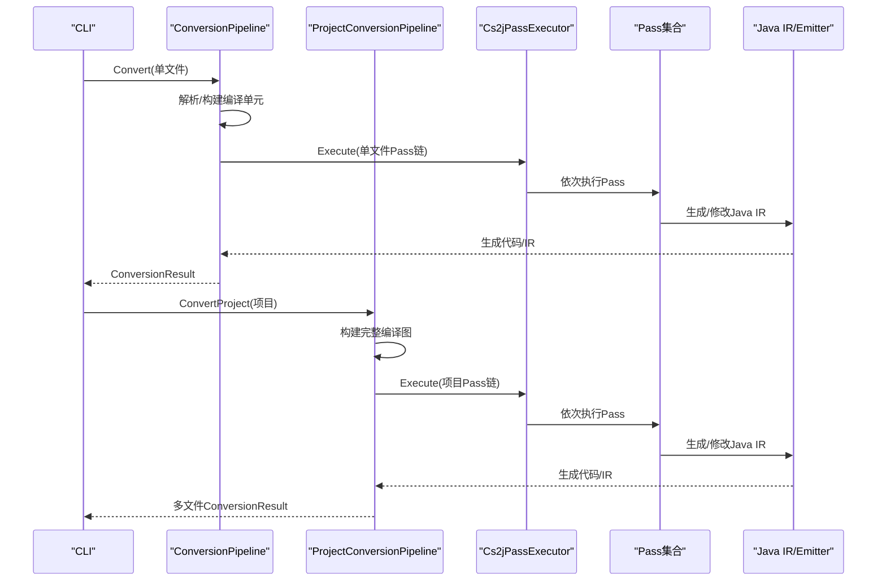
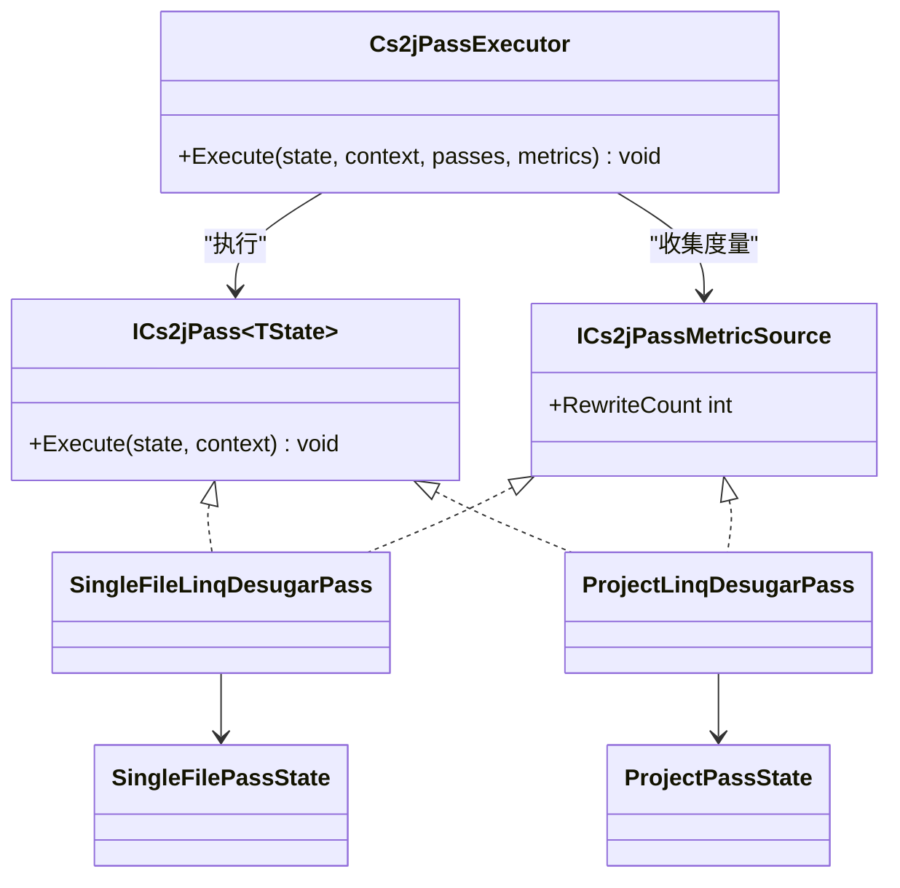
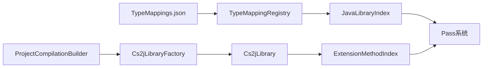
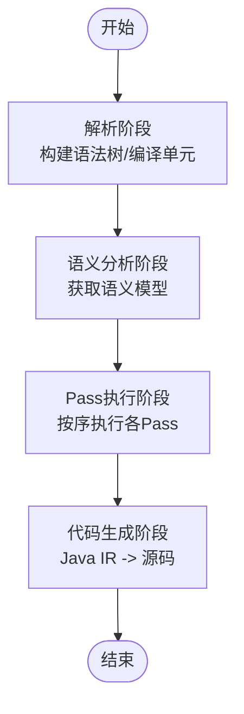

# 转换阶段和Pass

<cite>
**本文引用的文件**
- [README.md](file://README.md)
- [ConversionPipeline.cs](file://src/CSharpToJava.Core/Pipeline/ConversionPipeline.cs)
- [ProjectConversionPipeline.cs](file://src/CSharpToJava.Core/Pipeline/ProjectConversionPipeline.cs)
- [Cs2jPassInfrastructure.cs](file://src/CSharpToJava.Core/Pipeline/Passes/Cs2jPassInfrastructure.cs)
- [SingleFilePasses.cs](file://src/CSharpToJava.Core/Pipeline/Passes/SingleFilePasses.cs)
- [ProjectPasses.cs](file://src/CSharpToJava.Core/Pipeline/Passes/ProjectPasses.cs)
- [JavaValidationPasses.cs](file://src/CSharpToJava.Core/Pipeline/Passes/JavaValidationPasses.cs)
- [ProjectPassParallelism.cs](file://src/CSharpToJava.Core/Pipeline/Passes/ProjectPassParallelism.cs)
- [PassProfileSnapshot.cs](file://src/CSharpToJava.Core/Pipeline/Planning/PassProfileSnapshot.cs)
- [ITransformer.cs](file://src/CSharpToJava.Core/Abstractions/ITransformer.cs)
- [TypeMappings.json](file://config/TypeMappings.json)
- [JavaLibraryIndex.cs](file://src/CSharpToJava.TypeMapping/JavaModel/JavaLibraryIndex.cs)
- [JavaLibraryLoader.cs](file://src/CSharpToJava.TypeMapping/JavaModel/JavaLibraryLoader.cs)
- [JavaLibrary.cs](file://src/CSharpToJava.TypeMapping/JavaModel/JavaLibrary.cs)
- [TypeMappingRegistry.cs](file://src/CSharpToJava.TypeMapping/TypeMappingRegistry.cs)
- [TypeMappingService.cs](file://src/CSharpToJava.Core/Context/TypeMappingService.cs)
- [ConversionContext.cs](file://src/CSharpToJava.Core/Context/ConversionContext.cs)
- [DiagnosticCollector.cs](file://src/CSharpToJava.Core/Context/DiagnosticCollector.cs)
- [ExtensionMethodIndex.cs](file://src/CSharpToJava.Core/Pipeline/ExtensionMethodIndex.cs)
- [TypeGroupResolver.cs](file://src/CSharpToJava.Core/Pipeline/TypeGroupResolver.cs)
- [ProjectCompilationBuilder.cs](file://src/CSharpToJava.Core/Pipeline/ProjectCompilationBuilder.cs)
- [Cs2jLibraryFactory.cs](file://src/CSharpToJava.Core/Pipeline/Cs2jLibraryFactory.cs)
- [Cs2jLibrary.cs](file://src/CSharpToJava.Core/Pipeline/Cs2jLibrary.cs)
- [JavaSyntaxRewriter.cs](file://src/CSharpToJava.Core/Java/JavaSyntaxRewriter.cs)
- [JavaCompilationUnit.cs](file://src/CSharpToJava.Core/Java/JavaCompilationUnit.cs)
- [JavaEmitter.cs](file://src/CSharpToJava.Core/Java/JavaEmitter.cs)
- [LinqRewriteStatistics.cs](file://src/CSharpToJava.Core/LinqRewrite/LinqRewriteStatistics.cs)
- [LinqRewriter.cs](file://src/CSharpToJava.Core/LinqRewrite/LinqRewriter.cs)
- [LinqRewriteObservability.cs](file://src/CSharpToJava.Core/LinqRewrite/LinqRewriteObservability.cs)
- [LinqQueryDesugarer.cs](file://src/CSharpToJava.Core/LinqRewrite/LinqQueryDesugarer.cs)
- [Phase2PassPipelineTests.cs](file://tests/CSharpToJava.Tests/Phase2PassPipelineTests.cs)
- [JavaValidationPassTests.cs](file://tests/CSharpToJava.Tests/JavaValidationPassTests.cs)
</cite>

## 目录
1. [简介](#简介)
2. [项目结构](#项目结构)
3. [核心组件](#核心组件)
4. [架构总览](#架构总览)
5. [详细组件分析](#详细组件分析)
6. [依赖分析](#依赖分析)
7. [性能考虑](#性能考虑)
8. [故障排查指南](#故障排查指南)
9. [结论](#结论)
10. [附录](#附录)

## 简介
本文件面向cs2j转换阶段与Pass系统，系统性阐述从解析、语义分析、转换到代码生成的完整流水线；深入说明Pass的设计理念、分类、执行策略、依赖关系与错误处理；文档化内置Pass的功能与用途，并提供创建自定义Pass与集成到转换管道的方法；最后给出扩展机制与性能优化策略，包括并行执行、缓存与增量处理。

## 项目结构
cs2j采用分层模块化组织：核心转换引擎位于CSharpToJava.Core，包含解析、语义分析、转换器、Pass系统、类型映射与Java IR生成；CLI入口位于CSharpToJava.CLI；类型映射配置位于config目录；测试覆盖转换流程与Pass行为。

```mermaid
graph TB
subgraph "CLI"
CLI["CSharpToJava.CLI"]
end
subgraph "核心引擎"
CORE["CSharpToJava.Core"]
PIPE["Pipeline<br/>转换管道"]
PASS["Pass系统"]
TRANS["转换器集合"]
CTX["上下文/诊断"]
JAVAIR["Java IR"]
end
subgraph "类型映射"
TMREG["TypeMappingRegistry"]
JLIB["JavaLibraryIndex"]
end
subgraph "配置"
CFG["TypeMappings.json"]
end
CLI --> CORE
CORE --> PIPE
PIPE --> PASS
PASS --> TRANS
PASS --> CTX
TRANS --> JAVAIR
CORE --> TMREG
TMREG --> JLIB
CFG --> TMREG
```

图表来源
- [ConversionPipeline.cs:115-221](file://src/CSharpToJava.Core/Pipeline/ConversionPipeline.cs#L115-L221)
- [ProjectConversionPipeline.cs:82-108](file://src/CSharpToJava.Core/Pipeline/ProjectConversionPipeline.cs#L82-L108)
- [TypeMappingRegistry.cs](file://src/CSharpToJava.TypeMapping/TypeMappingRegistry.cs)
- [JavaLibraryIndex.cs](file://src/CSharpToJava.TypeMapping/JavaModel/JavaLibraryIndex.cs)

章节来源
- [README.md:64-74](file://README.md#L64-L74)
- [ConversionPipeline.cs:115-221](file://src/CSharpToJava.Core/Pipeline/ConversionPipeline.cs#L115-L221)
- [ProjectConversionPipeline.cs:82-108](file://src/CSharpToJava.Core/Pipeline/ProjectConversionPipeline.cs#L82-L108)

## 核心组件
- 转换请求与结果
  - 请求对象包含源码、选项与文件名；结果对象包含生成代码、诊断、Pass度量、LINQ统计与IR保留信息。
- 上下文与诊断
  - ConversionContext承载转换选项、类型映射服务、语义模型、诊断收集器等。
- 类型映射与Java库索引
  - TypeMappingRegistry加载TypeMappings.json；JavaLibraryIndex注入标准库元数据以支持Java平台边界检查与模块依赖分析。
- Java IR与发射
  - JavaCompilationUnit保存结构化IR，JavaEmitter负责生成Java源码；IR层重写器可在ToString前对IR进行后处理。

章节来源
- [ConversionPipeline.cs:18-62](file://src/CSharpToJava.Core/Pipeline/ConversionPipeline.cs#L18-L62)
- [ConversionContext.cs](file://src/CSharpToJava.Core/Context/ConversionContext.cs)
- [DiagnosticCollector.cs](file://src/CSharpToJava.Core/Context/DiagnosticCollector.cs)
- [TypeMappingRegistry.cs](file://src/CSharpToJava.TypeMapping/TypeMappingRegistry.cs)
- [JavaLibraryIndex.cs](file://src/CSharpToJava.TypeMapping/JavaModel/JavaLibraryIndex.cs)
- [JavaCompilationUnit.cs](file://src/CSharpToJava.Core/Java/JavaCompilationUnit.cs)
- [JavaEmitter.cs](file://src/CSharpToJava.Core/Java/JavaEmitter.cs)

## 架构总览
cs2j的转换分为两类管道：
- 单文件管道：逐文件解析、构建最小编译单元、执行单文件Pass链。
- 项目管道：构建完整编译图，启用跨文件分析与部分类型归并，执行项目级Pass链。



图表来源
- [ConversionPipeline.cs:115-221](file://src/CSharpToJava.Core/Pipeline/ConversionPipeline.cs#L115-L221)
- [ProjectConversionPipeline.cs:82-108](file://src/CSharpToJava.Core/Pipeline/ProjectConversionPipeline.cs#L82-L108)
- [Cs2jPassInfrastructure.cs:52-83](file://src/CSharpToJava.Core/Pipeline/Passes/Cs2jPassInfrastructure.cs#L52-L83)

## 详细组件分析

### 转换阶段与执行顺序
- 解析阶段
  - 使用Roslyn解析C#源码为语法树；同时注入全局using树以确保裸标识符能正确解析到完全限定类型，从而触发语义映射路径。
- 语义分析阶段
  - 基于语法树构建C#编译单元，注入关键框架程序集引用与隐式usings，获取语义模型供后续Pass使用。
- 转换阶段
  - 执行Pass链：先LINQ降糖，再各类检查与规范化，最后Java发射。
- 代码生成阶段
  - 将Java IR序列化为Java源码字符串；IR层可注册后处理重写器以统一调整生成内容。

章节来源
- [ConversionPipeline.cs:141-205](file://src/CSharpToJava.Core/Pipeline/ConversionPipeline.cs#L141-L205)
- [ConversionPipeline.cs:86-92](file://src/CSharpToJava.Core/Pipeline/ConversionPipeline.cs#L86-L92)
- [ConversionPipeline.cs:152-193](file://src/CSharpToJava.Core/Pipeline/ConversionPipeline.cs#L152-L193)

### Pass系统设计与执行机制
- 接口与执行器
  - ICs2jPass<TState>定义Pass契约；Cs2jPassExecutor负责按序执行Pass并收集度量。
- 度量与可观测性
  - 实现ICs2jPassMetricSource的Pass可上报重写计数；PassProfileSnapshot用于记录Pass执行概要。
- 错误处理
  - 解析错误直接转为诊断；异常捕获并记录；失败时返回空生成结果但保留诊断。



图表来源
- [Cs2jPassInfrastructure.cs:45-83](file://src/CSharpToJava.Core/Pipeline/Passes/Cs2jPassInfrastructure.cs#L45-L83)
- [SingleFilePasses.cs:27-35](file://src/CSharpToJava.Core/Pipeline/Passes/SingleFilePasses.cs#L27-L35)
- [ProjectPasses.cs:142-150](file://src/CSharpToJava.Core/Pipeline/Passes/ProjectPasses.cs#L142-L150)

章节来源
- [Cs2jPassInfrastructure.cs:27-83](file://src/CSharpToJava.Core/Pipeline/Passes/Cs2jPassInfrastructure.cs#L27-L83)
- [PassProfileSnapshot.cs:11-20](file://src/CSharpToJava.Core/Pipeline/Planning/PassProfileSnapshot.cs#L11-L20)

### Pass分类与职责
- 单文件Pass
  - LINQ降糖、编译检查、不支持域检查、平台边界检查、本地互操作检查、上下文规范化、Java发射。
- 项目级Pass
  - LINQ降糖、编译检查、不支持域检查、平台边界检查、本地互操作检查、扩展方法检查、部分类型归一化、类型发射、兼容性发射、跨包导入发射、Java模块依赖分析。

章节来源
- [ConversionPipeline.cs:376-388](file://src/CSharpToJava.Core/Pipeline/ConversionPipeline.cs#L376-L388)
- [ProjectConversionPipeline.cs:124-141](file://src/CSharpToJava.Core/Pipeline/ProjectConversionPipeline.cs#L124-L141)
- [SingleFilePasses.cs:27-220](file://src/CSharpToJava.Core/Pipeline/Passes/SingleFilePasses.cs#L27-L220)
- [ProjectPasses.cs:142-682](file://src/CSharpToJava.Core/Pipeline/Passes/ProjectPasses.cs#L142-L682)

### 内置Pass功能与用途
- LINQ重写Pass
  - 将查询表达式与LINQ调用链降解为过程式代码，便于Java端映射与后续Pass处理。
- Java验证Pass
  - 检查Java平台边界、模块依赖与可用性，生成诊断并影响最终IR。
- 兼容性检查Pass
  - 在项目模式下进行扩展方法、部分类型、跨包导入与兼容类生成等检查与处理。
- 其他检查Pass
  - 编译、不支持域、平台边界、本地互操作等，确保目标Java环境可行性。

章节来源
- [SingleFilePasses.cs:27-220](file://src/CSharpToJava.Core/Pipeline/Passes/SingleFilePasses.cs#L27-L220)
- [ProjectPasses.cs:142-682](file://src/CSharpToJava.Core/Pipeline/Passes/ProjectPasses.cs#L142-L682)
- [JavaValidationPasses.cs:11-119](file://src/CSharpToJava.Core/Pipeline/Passes/JavaValidationPasses.cs#L11-L119)
- [JavaValidationPassTests.cs](file://tests/CSharpToJava.Tests/JavaValidationPassTests.cs)

### 自定义Pass创建与集成
- 设计步骤
  - 定义状态类型（单文件/项目），实现ICs2jPass<TState>接口；如需度量，实现ICs2jPassMetricSource。
  - 在对应管道的Pass列表中注册新Pass，确保执行顺序满足依赖关系。
- 集成位置
  - 单文件管道：在ConversionPipeline.CreateSingleFilePasses中添加。
  - 项目管道：在ProjectConversionPipeline.CreateProjectPasses中添加。
- 示例参考
  - 可参考现有Pass的实现方式与命名约定，保持与上下文、诊断与IR交互的一致性。

章节来源
- [ConversionPipeline.cs:376-388](file://src/CSharpToJava.Core/Pipeline/ConversionPipeline.cs#L376-L388)
- [ProjectConversionPipeline.cs:124-141](file://src/CSharpToJava.Core/Pipeline/ProjectConversionPipeline.cs#L124-L141)
- [SingleFilePasses.cs:27-220](file://src/CSharpToJava.Core/Pipeline/Passes/SingleFilePasses.cs#L27-L220)
- [ProjectPasses.cs:142-682](file://src/CSharpToJava.Core/Pipeline/Passes/ProjectPasses.cs#L142-L682)

### 代码生成与IR后处理
- IR保留与同步
  - 结果对象保留JavaCompilationUnit以便下游Pass直接操作结构化IR；可通过SyncGeneratedCodeFromIR从IR重建字符串。
- IR层重写器
  - 在发射前对Java IR进行统一调整，保证生成代码一致性。

章节来源
- [ConversionPipeline.cs:44-62](file://src/CSharpToJava.Core/Pipeline/ConversionPipeline.cs#L44-L62)
- [JavaSyntaxRewriter.cs](file://src/CSharpToJava.Core/Java/JavaSyntaxRewriter.cs)

### LINQ重写引擎
- 降糖与步骤化
  - LinqQueryDesugarer将复杂查询分解为可追踪的步骤；LinqRewriter.Rules提供规则集；LinqRewriteObservability用于观测与调试。
- 统计与可观测性
  - LinqRewriteStatistics记录重写统计；测试覆盖多阶段重写行为。

章节来源
- [LinqQueryDesugarer.cs](file://src/CSharpToJava.Core/LinqRewrite/LinqQueryDesugarer.cs)
- [LinqRewriter.cs](file://src/CSharpToJava.Core/LinqRewrite/LinqRewriter.cs)
- [LinqRewriteObservability.cs](file://src/CSharpToJava.Core/LinqRewrite/LinqRewriteObservability.cs)
- [LinqRewriteStatistics.cs](file://src/CSharpToJava.Core/LinqRewrite/LinqRewriteStatistics.cs)

## 依赖分析
- 类型映射与Java库
  - TypeMappingRegistry加载TypeMappings.json；JavaLibraryIndex注入标准库元数据，支持Java平台边界检查与模块依赖分析。
- 项目构建与库工厂
  - ProjectCompilationBuilder构建完整编译图；Cs2jLibraryFactory创建库对象；TypeGroupResolver处理类型组与失败回退。
- 扩展方法索引
  - ExtensionMethodIndex在项目模式下扫描并建立扩展方法索引，供后续Pass使用。



图表来源
- [TypeMappingRegistry.cs](file://src/CSharpToJava.TypeMapping/TypeMappingRegistry.cs)
- [JavaLibraryIndex.cs](file://src/CSharpToJava.TypeMapping/JavaModel/JavaLibraryIndex.cs)
- [ProjectCompilationBuilder.cs](file://src/CSharpToJava.Core/Pipeline/ProjectCompilationBuilder.cs)
- [Cs2jLibraryFactory.cs](file://src/CSharpToJava.Core/Pipeline/Cs2jLibraryFactory.cs)
- [Cs2jLibrary.cs](file://src/CSharpToJava.Core/Pipeline/Cs2jLibrary.cs)
- [ExtensionMethodIndex.cs](file://src/CSharpToJava.Core/Pipeline/ExtensionMethodIndex.cs)

章节来源
- [TypeMappingRegistry.cs](file://src/CSharpToJava.TypeMapping/TypeMappingRegistry.cs)
- [JavaLibraryLoader.cs](file://src/CSharpToJava.TypeMapping/JavaModel/JavaLibraryLoader.cs)
- [TypeMappingService.cs](file://src/CSharpToJava.Core/Context/TypeMappingService.cs)
- [TypeGroupResolver.cs](file://src/CSharpToJava.Core/Pipeline/TypeGroupResolver.cs)

## 性能考虑
- 并行执行
  - 项目级Pass支持并行化策略（ProjectPassParallelism），在不影响依赖的前提下提升吞吐。
- 缓存机制
  - JavaLibraryIndex缓存标准库元数据，避免重复解析；TypeMappingRegistry缓存映射配置。
- 增量处理
  - 通过IR保留与IR重写器减少重复字符串处理；Pass度量与可观测性有助于识别热点与瓶颈。
- 执行顺序优化
  - 将代价高的Pass尽量靠前，尽早短路失败路径；将依赖性强的Pass相邻放置，减少中间态切换。

章节来源
- [ProjectPassParallelism.cs](file://src/CSharpToJava.Core/Pipeline/Passes/ProjectPassParallelism.cs)
- [JavaLibraryIndex.cs](file://src/CSharpToJava.TypeMapping/JavaModel/JavaLibraryIndex.cs)
- [TypeMappingRegistry.cs](file://src/CSharpToJava.TypeMapping/TypeMappingRegistry.cs)
- [PassProfileSnapshot.cs:11-20](file://src/CSharpToJava.Core/Pipeline/Planning/PassProfileSnapshot.cs#L11-L20)

## 故障排查指南
- 解析错误
  - 解析阶段出现错误会直接记录诊断并返回失败结果；检查源码语法与全局usings注入。
- 配置问题
  - TypeMappings.json格式错误或缺失会导致初始化失败；检查路径与格式。
- Java平台边界
  - Java验证Pass会报告不支持的类型/方法/模块；根据诊断调整映射或禁用相关特性。
- 项目模式限制
  - 多项目模式下某些特性（如扩展方法重写）会被禁用并发出警告；按提示调整策略。

章节来源
- [ConversionPipeline.cs:118-127](file://src/CSharpToJava.Core/Pipeline/ConversionPipeline.cs#L118-L127)
- [ConversionPipeline.cs:143-150](file://src/CSharpToJava.Core/Pipeline/ConversionPipeline.cs#L143-L150)
- [JavaValidationPassTests.cs](file://tests/CSharpToJava.Tests/JavaValidationPassTests.cs)
- [ProjectConversionPipeline.cs:161-167](file://src/CSharpToJava.Core/Pipeline/ProjectConversionPipeline.cs#L161-L167)

## 结论
cs2j通过清晰的阶段划分与可插拔的Pass系统，实现了从C#到Java的高保真转换。单文件与项目级管道分别满足快速转换与跨文件分析需求；LINQ重写、Java验证与兼容性检查等内置Pass覆盖了关键质量保障点；结合并行执行、缓存与IR后处理，系统在可维护性与性能之间取得平衡。开发者可基于现有接口与模式快速扩展自定义Pass，融入转换流水线。

## 附录
- 关键流程图：Pass执行顺序与依赖关系


图表来源
- [ConversionPipeline.cs:141-205](file://src/CSharpToJava.Core/Pipeline/ConversionPipeline.cs#L141-L205)
- [ProjectConversionPipeline.cs:195-230](file://src/CSharpToJava.Core/Pipeline/ProjectConversionPipeline.cs#L195-L230)