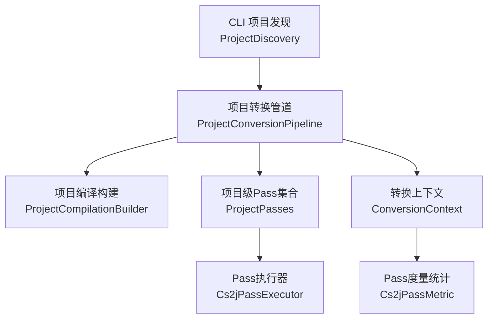
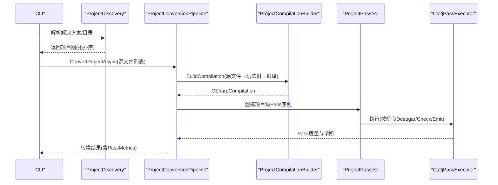
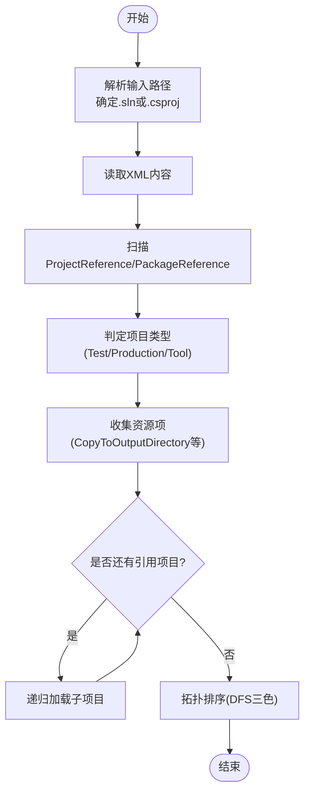
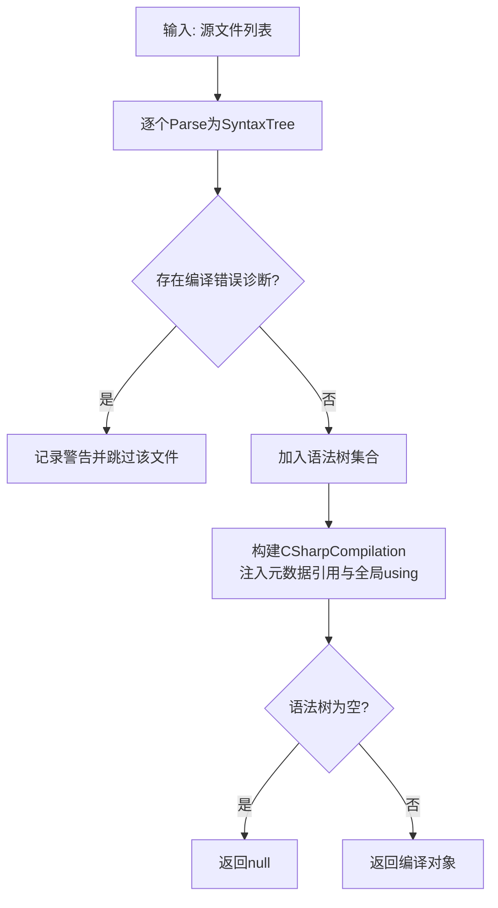
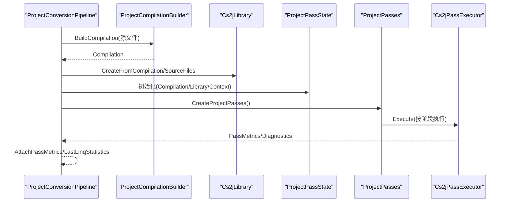
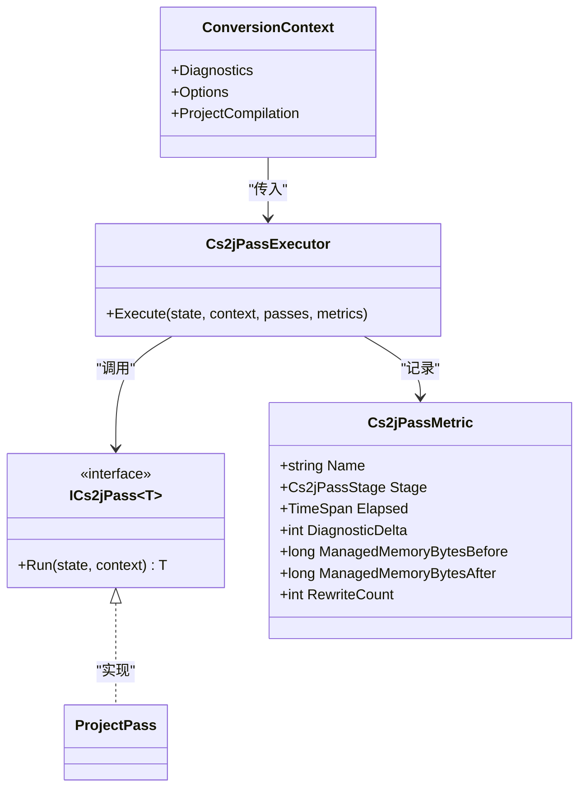
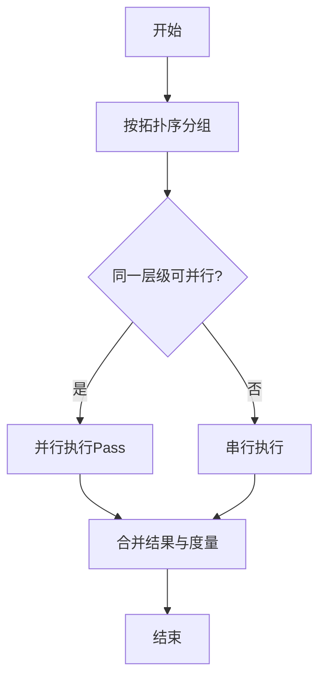
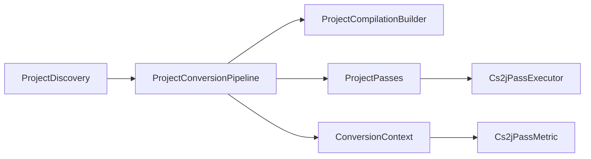

# 项目转换Pass

<cite>
**本文档引用的文件**
- [ProjectConversionPipeline.cs](file://src/CSharpToJava.Core/Pipeline/ProjectConversionPipeline.cs)
- [ProjectDiscovery.cs](file://src/CSharpToJava.CLI/ProjectDiscovery.cs)
- [ProjectCompilationBuilder.cs](file://src/CSharpToJava.Core/Pipeline/ProjectCompilationBuilder.cs)
- [ProjectPasses.cs](file://src/CSharpToJava.Core/Pipeline/Passes/ProjectPasses.cs)
- [ProjectPassParallelism.cs](file://src/CSharpToJava.Core/Pipeline/Passes/ProjectPassParallelism.cs)
- [Cs2jPassInfrastructure.cs](file://src/CSharpToJava.Core/Pipeline/Passes/Cs2jPassInfrastructure.cs)
- [Phase2PassPipelineTests.cs](file://tests/CSharpToJava.Tests/Phase2PassPipelineTests.cs)
- [PlanningTests.cs](file://tests/CSharpToJava.Tests/PlanningTests.cs)
- [LinqQueryDesugarTests.cs](file://tests/CSharpToJava.Tests/LinqQueryDesugarTests.cs)
- [ProjectDiscoveryTests.cs](file://tests/CSharpToJava.Tests/ProjectDiscoveryTests.cs)
- [ParallelOptionsMappingTests.cs](file://tests/CSharpToJava.Tests/ParallelOptionsMappingTests.cs)
- [DisposeCheckedExceptionTests.cs](file://tests/CSharpToJava.Tests/DisposeCheckedExceptionTests.cs)
</cite>

## 目录
1. [引言](#引言)
2. [项目结构](#项目结构)
3. [核心组件](#核心组件)
4. [架构总览](#架构总览)
5. [详细组件分析](#详细组件分析)
6. [依赖分析](#依赖分析)
7. [性能考虑](#性能考虑)
8. [故障排除指南](#故障排除指南)
9. [结论](#结论)

## 引言
本文件面向cs2j项目转换系统的“项目级转换Pass”子系统，系统性阐述其设计理念、实现架构与关键流程。重点覆盖以下方面：
- 项目发现机制：如何从解决方案或目录中解析项目拓扑与依赖关系
- 多文件协调处理：基于完整编译语义的跨文件分析与一致性保证
- 全局状态管理：通过ProjectPassState与ConversionContext在Pass间传递上下文
- 执行策略：Pass顺序、阶段划分、度量统计与失败回退
- 并行处理：项目级并行化策略与资源管理
- 项目Pass与单文件Pass的差异与协作：如何在项目级别实现一致性检查与跨文件引用解析
- 增量更新与性能优化：在大型项目中的内存与吞吐优化手段

## 项目结构
项目转换Pass位于核心库的Pipeline与CLI模块中，围绕ProjectConversionPipeline为核心入口，配合ProjectDiscovery与ProjectCompilationBuilder完成项目发现与编译构建，并通过Pass体系实现跨文件的分析与转换。

图示来源
- [ProjectConversionPipeline.cs:13-234](file://src/CSharpToJava.Core/Pipeline/ProjectConversionPipeline.cs#L13-L234)
- [ProjectDiscovery.cs:36-116](file://src/CSharpToJava.CLI/ProjectDiscovery.cs#L36-L116)
- [ProjectCompilationBuilder.cs:12-78](file://src/CSharpToJava.Core/Pipeline/ProjectCompilationBuilder.cs#L12-L78)
- [ProjectPasses.cs](file://src/CSharpToJava.Core/Pipeline/Passes/ProjectPasses.cs)
- [Cs2jPassInfrastructure.cs](file://src/CSharpToJava.Core/Pipeline/Passes/Cs2jPassInfrastructure.cs)

章节来源
- [ProjectConversionPipeline.cs:13-234](file://src/CSharpToJava.Core/Pipeline/ProjectConversionPipeline.cs#L13-L234)
- [ProjectDiscovery.cs:36-116](file://src/CSharpToJava.CLI/ProjectDiscovery.cs#L36-L116)
- [ProjectCompilationBuilder.cs:12-78](file://src/CSharpToJava.Core/Pipeline/ProjectCompilationBuilder.cs#L12-L78)

## 核心组件
- 项目转换管道（ProjectConversionPipeline）
  - 负责构建项目级编译单元、扫描扩展方法索引、执行项目级Pass序列、聚合度量与诊断信息
  - 提供ConvertProjectAsync与ConvertLibraryAsync两种入口，支持从源文件或已构建编译体进行转换
- 项目发现（ProjectDiscovery）
  - 解析.sln/.csproj，构建项目图（含拓扑排序），识别生产/测试/工具项目类型，收集资源项
- 项目编译构建（ProjectCompilationBuilder）
  - 将源文件解析为语法树并构建CSharpCompilation，注入必要的元数据引用与全局using
- 项目级Pass集合（ProjectPasses）
  - 包含Linq降级、兼容性检查、平台边界检查、原生互操作检查、扩展方法检查、partial类型规范化、Java发射、兼容性支持、跨包导入、模块依赖等
- Pass执行基础设施（Cs2jPassInfrastructure）
  - 定义ICs2jPass接口、Pass执行器与度量记录机制，确保统一的阶段划分与可观测性

章节来源
- [ProjectConversionPipeline.cs:13-234](file://src/CSharpToJava.Core/Pipeline/ProjectConversionPipeline.cs#L13-L234)
- [ProjectDiscovery.cs:36-347](file://src/CSharpToJava.CLI/ProjectDiscovery.cs#L36-L347)
- [ProjectCompilationBuilder.cs:12-131](file://src/CSharpToJava.Core/Pipeline/ProjectCompilationBuilder.cs#L12-L131)
- [ProjectPasses.cs](file://src/CSharpToJava.Core/Pipeline/Passes/ProjectPasses.cs)
- [Cs2jPassInfrastructure.cs](file://src/CSharpToJava.Core/Pipeline/Passes/Cs2jPassInfrastructure.cs)

## 架构总览
项目级转换以“项目发现—编译构建—Pass执行—结果聚合”的流水线方式运行。项目发现负责拓扑与依赖，编译构建提供全量语义模型，Pass执行器按阶段顺序驱动各Pass完成跨文件分析与转换。

图示来源
- [ProjectDiscovery.cs:92-116](file://src/CSharpToJava.CLI/ProjectDiscovery.cs#L92-L116)
- [ProjectConversionPipeline.cs:82-120](file://src/CSharpToJava.Core/Pipeline/ProjectConversionPipeline.cs#L82-L120)
- [ProjectCompilationBuilder.cs:18-78](file://src/CSharpToJava.Core/Pipeline/ProjectCompilationBuilder.cs#L18-L78)
- [ProjectPasses.cs](file://src/CSharpToJava.Core/Pipeline/Passes/ProjectPasses.cs)
- [Cs2jPassInfrastructure.cs](file://src/CSharpToJava.Core/Pipeline/Passes/Cs2jPassInfrastructure.cs)

## 详细组件分析

### 项目发现机制（ProjectDiscovery）
- 功能要点
  - 解析.sln/.csproj，提取项目路径、项目引用、包引用、测试项目判定逻辑
  - 收集资源项（含Resources目录下的非代码文件）
  - 基于DFS拓扑排序输出项目顺序，保证依赖先行
- 关键数据结构
  - ProjectGraph：包含根路径与拓扑序项目列表
  - DiscoveredProject：项目名称、路径、类型、引用与资源项
- 算法流程
  - 递归加载项目，解析XML节点，过滤无效/重复条目
  - 使用三色DFS检测环并生成拓扑序

图示来源
- [ProjectDiscovery.cs:92-116](file://src/CSharpToJava.CLI/ProjectDiscovery.cs#L92-L116)
- [ProjectDiscovery.cs:153-203](file://src/CSharpToJava.CLI/ProjectDiscovery.cs#L153-L203)
- [ProjectDiscovery.cs:298-346](file://src/CSharpToJava.CLI/ProjectDiscovery.cs#L298-L346)

章节来源
- [ProjectDiscovery.cs:36-347](file://src/CSharpToJava.CLI/ProjectDiscovery.cs#L36-L347)
- [ProjectDiscoveryTests.cs:37-69](file://tests/CSharpToJava.Tests/ProjectDiscoveryTests.cs#L37-L69)

### 项目编译构建（ProjectCompilationBuilder）
- 功能要点
  - 将源文件解析为SyntaxTree，过滤含错误诊断的文件
  - 构建CSharpCompilation，注入常用系统程序集与全局using
  - 设置输出类型为动态链接库，便于后续语义分析
- 性能与健壮性
  - 若无有效语法树，返回null以便上层快速失败
  - 统一的元数据引用集合减少缺失类型导致的转换中断

图示来源
- [ProjectCompilationBuilder.cs:18-78](file://src/CSharpToJava.Core/Pipeline/ProjectCompilationBuilder.cs#L18-L78)

章节来源
- [ProjectCompilationBuilder.cs:12-131](file://src/CSharpToJava.Core/Pipeline/ProjectCompilationBuilder.cs#L12-L131)

### 项目转换管道（ProjectConversionPipeline）
- 设计理念
  - 在项目级使用完整编译语义模型，支持跨文件的扩展方法索引、partial类型合并与一致性检查
  - 对多项目模式禁用某些单文件特性（如扩展方法重写），并通过诊断提示用户
- 执行流程
  - 构建Compilation → 创建Cs2jLibrary → 初始化ProjectPassState → 扫描/填充扩展方法索引 → 执行Pass序列 → 聚合度量与诊断 → 返回结果
- 关键Pass序列（按阶段）
  - ProjectLinqDesugarPass（降级LINQ表达式链）
  - ProjectCompilationCheckPass（编译一致性检查）
  - ProjectUnsupportedDomainCheckPass（不支持领域检查）
  - ProjectPlatformBoundaryCheckPass（平台边界检查）
  - ProjectNativeInteropCheckPass（原生互操作检查）
  - ProjectExtensionMethodCheckPass（扩展方法检查）
  - ProjectPartialTypeNormalizationPass（partial类型规范化）
  - ProjectTypeEmitPass（Java类型发射）
  - ProjectCompatibilityEmitPass（兼容性支持发射）
  - ProjectCrossPackageImportEmitPass（跨包导入发射）
  - ProjectJavaModuleDependencyPass（Java模块依赖）

图示来源
- [ProjectConversionPipeline.cs:82-230](file://src/CSharpToJava.Core/Pipeline/ProjectConversionPipeline.cs#L82-L230)
- [ProjectPasses.cs](file://src/CSharpToJava.Core/Pipeline/Passes/ProjectPasses.cs)

章节来源
- [ProjectConversionPipeline.cs:13-234](file://src/CSharpToJava.Core/Pipeline/ProjectConversionPipeline.cs#L13-L234)

### Pass执行与度量（Cs2jPassInfrastructure）
- 执行器职责
  - 统一调用各Pass，记录阶段（Desugar/Check/Emit）、诊断增量、重写次数、托管内存前后值
- 度量聚合
  - 支持文件级与项目级度量快照构建，便于性能分析与回归对比
- 测试验证
  - 通过单元测试验证Pass顺序、诊断增量与度量字段正确性

图示来源
- [Cs2jPassInfrastructure.cs](file://src/CSharpToJava.Core/Pipeline/Passes/Cs2jPassInfrastructure.cs)
- [Phase2PassPipelineTests.cs:10-63](file://tests/CSharpToJava.Tests/Phase2PassPipelineTests.cs#L10-L63)
- [PlanningTests.cs:238-290](file://tests/CSharpToJava.Tests/PlanningTests.cs#L238-L290)

章节来源
- [Phase2PassPipelineTests.cs:10-63](file://tests/CSharpToJava.Tests/Phase2PassPipelineTests.cs#L10-L63)
- [PlanningTests.cs:238-290](file://tests/CSharpToJava.Tests/PlanningTests.cs#L238-L290)

### 项目级并行化（ProjectPassParallelism）
- 并行策略
  - 在项目级对多个源文件或模块采用并行处理，同时保持跨文件一致性
  - 通过拓扑序控制项目间的依赖顺序，避免并发写冲突
- 资源管理
  - 控制并发度，限制同时占用的CPU与内存峰值
  - 使用增量会话与指纹快照，减少重复工作

图示来源
- [ProjectPassParallelism.cs](file://src/CSharpToJava.Core/Pipeline/Passes/ProjectPassParallelism.cs)
- [PlanningTests.cs:434-562](file://tests/CSharpToJava.Tests/PlanningTests.cs#L434-L562)

章节来源
- [ProjectPassParallelism.cs](file://src/CSharpToJava.Core/Pipeline/Passes/ProjectPassParallelism.cs)
- [PlanningTests.cs:434-562](file://tests/CSharpToJava.Tests/PlanningTests.cs#L434-L562)

### 项目Pass与单文件Pass的差异与协作
- 差异点
  - 单文件Pass：面向单一文件的局部分析与转换，Pass更轻量，适合快速迭代
  - 项目Pass：需要完整编译语义，支持跨文件引用解析、扩展方法索引、partial类型合并与一致性检查
- 协作关系
  - 项目Pass在顶层协调，单文件Pass作为内部步骤参与；两者共享相同的度量与诊断框架
  - 项目Pass在多项目模式下禁用某些单文件特性，避免回写已发射项目的副作用

章节来源
- [ProjectConversionPipeline.cs:161-167](file://src/CSharpToJava.Core/Pipeline/ProjectConversionPipeline.cs#L161-L167)
- [Phase2PassPipelineTests.cs:66-90](file://tests/CSharpToJava.Tests/Phase2PassPipelineTests.cs#L66-L90)

### 一致性检查与跨文件引用解析
- 一致性检查
  - 编译检查：确保所有语法树可被成功编译
  - 不支持领域检查：屏蔽WinForms等不支持平台
  - 平台边界检查：阻止访问受限API
  - 原生互操作检查：识别P/Invoke等不兼容特性
- 跨文件引用解析
  - 通过CSharpCompilation提供的符号表与类型系统，解析命名空间、类型与成员引用
  - 扩展方法索引：在多项目场景由调用方预填充，确保静态调用站点可正确映射

章节来源
- [ProjectConversionPipeline.cs:178-193](file://src/CSharpToJava.Core/Pipeline/ProjectConversionPipeline.cs#L178-L193)
- [ProjectPasses.cs](file://src/CSharpToJava.Core/Pipeline/Passes/ProjectPasses.cs)

### 增量更新机制
- 输入指纹与输出增量
  - 基于输入文件与选项令牌生成指纹，判断是否需要重新转换
  - 输出增量写入会话支持复制资源与生成文件的条件重写
- 实践建议
  - 在CI中启用增量模式，仅对变更文件与受影响模块进行转换
  - 结合拓扑序与指纹匹配，避免不必要的Pass执行

章节来源
- [PlanningTests.cs:434-562](file://tests/CSharpToJava.Tests/PlanningTests.cs#L434-L562)

## 依赖分析
- 组件耦合
  - ProjectConversionPipeline依赖ProjectCompilationBuilder与ProjectPasses，通过Cs2jPassExecutor解耦执行细节
  - ProjectDiscovery独立于转换逻辑，仅提供项目图与资源清单
- 外部依赖
  - Roslyn用于语法解析与语义分析
  - .NET系统程序集元数据用于类型解析与映射

图示来源
- [ProjectConversionPipeline.cs:82-230](file://src/CSharpToJava.Core/Pipeline/ProjectConversionPipeline.cs#L82-L230)
- [ProjectDiscovery.cs:92-116](file://src/CSharpToJava.CLI/ProjectDiscovery.cs#L92-L116)
- [ProjectCompilationBuilder.cs:18-78](file://src/CSharpToJava.Core/Pipeline/ProjectCompilationBuilder.cs#L18-L78)
- [ProjectPasses.cs](file://src/CSharpToJava.Core/Pipeline/Passes/ProjectPasses.cs)
- [Cs2jPassInfrastructure.cs](file://src/CSharpToJava.Core/Pipeline/Passes/Cs2jPassInfrastructure.cs)

## 性能考虑
- 并发与内存
  - 采用拓扑序分层并行，限制并发度避免内存峰值过高
  - Pass执行器记录托管内存前后值，便于定位内存热点
- 编译构建
  - 预构建Compilation，避免重复解析；仅对有效语法树构建编译
- 增量转换
  - 使用输入指纹与输出增量会话，减少重复I/O与Pass执行
- 选项与回退
  - 当Stream API不可用时，优先执行LINQ降级Pass，减少运行时依赖

章节来源
- [PlanningTests.cs:238-290](file://tests/CSharpToJava.Tests/PlanningTests.cs#L238-L290)
- [LinqQueryDesugarTests.cs:176-248](file://tests/CSharpToJava.Tests/LinqQueryDesugarTests.cs#L176-L248)

## 故障排除指南
- 常见问题与定位
  - 不支持领域：当源码包含WinForms等不支持类型时，项目Pass会直接失败并返回诊断
  - 平台边界：访问受限API会被平台边界检查拦截
  - 并发与回写：多项目模式下禁用扩展方法重写，避免对已发射项目的二次修改
- 诊断与度量
  - 通过LastPassMetrics与ConversionResult.Diagnostics查看每个Pass的诊断增量与重写次数
  - 使用度量快照对比不同配置下的性能变化

章节来源
- [Phase2PassPipelineTests.cs:92-124](file://tests/CSharpToJava.Tests/Phase2PassPipelineTests.cs#L92-L124)
- [ProjectConversionPipeline.cs:161-167](file://src/CSharpToJava.Core/Pipeline/ProjectConversionPipeline.cs#L161-L167)
- [ParallelOptionsMappingTests.cs:16-32](file://tests/CSharpToJava.Tests/ParallelOptionsMappingTests.cs#L16-L32)
- [DisposeCheckedExceptionTests.cs:207-240](file://tests/CSharpToJava.Tests/DisposeCheckedExceptionTests.cs#L207-L240)

## 结论
项目级转换Pass通过“项目发现—编译构建—Pass执行—结果聚合”的流水线，实现了在大型多项目场景下的跨文件一致性与高性能转换。其关键优势在于：
- 基于完整编译语义的跨文件分析能力
- 明确的阶段划分与可观测性指标
- 可扩展的Pass体系与并行化策略
- 增量更新与资源管理的工程化实践

这些设计共同保障了在复杂项目中的稳定性与可维护性，为cs2j的规模化应用提供了坚实基础。