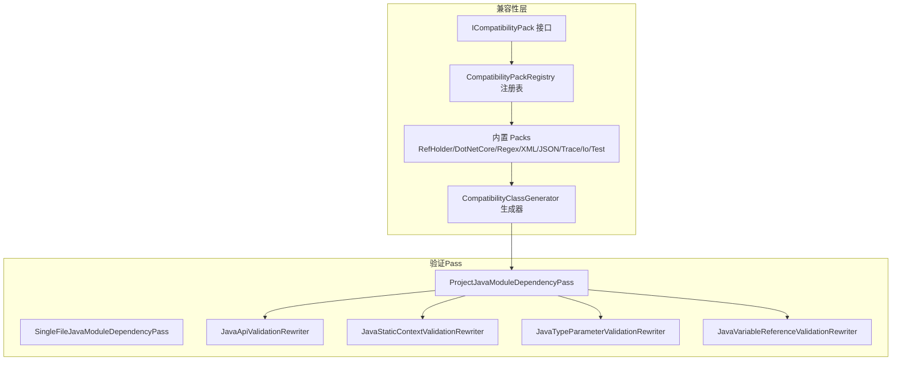
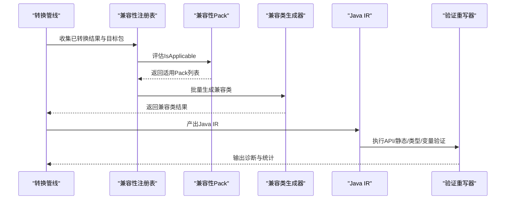
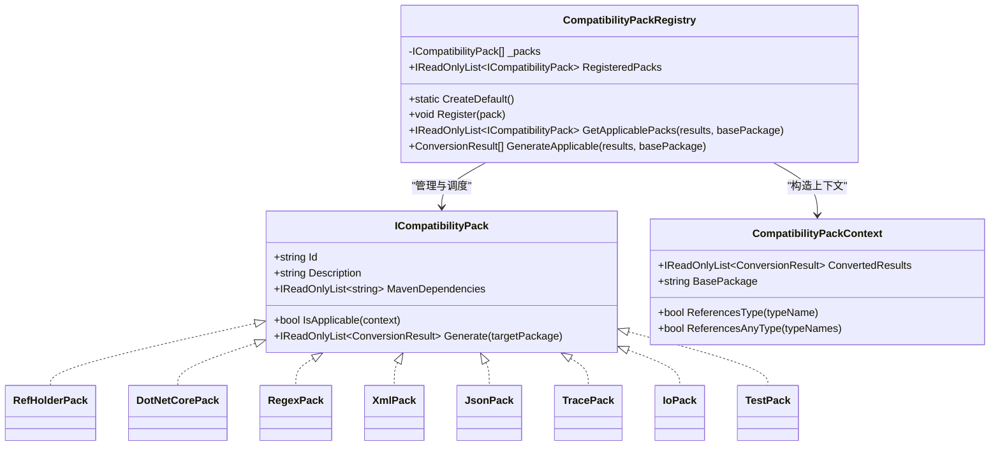
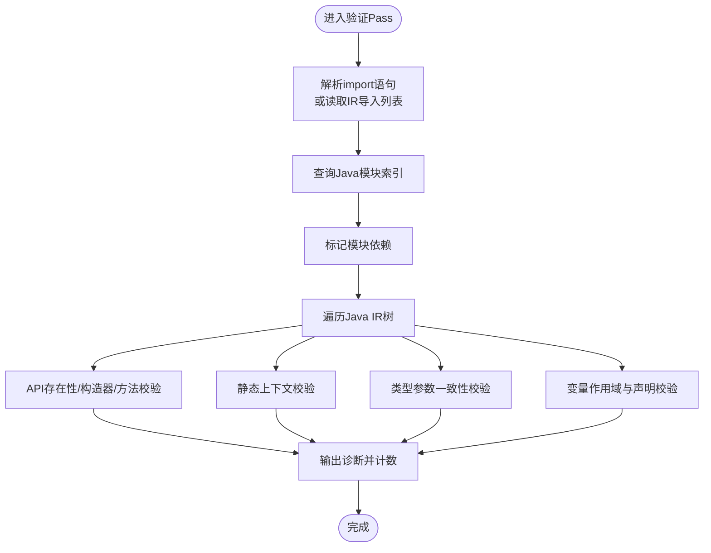
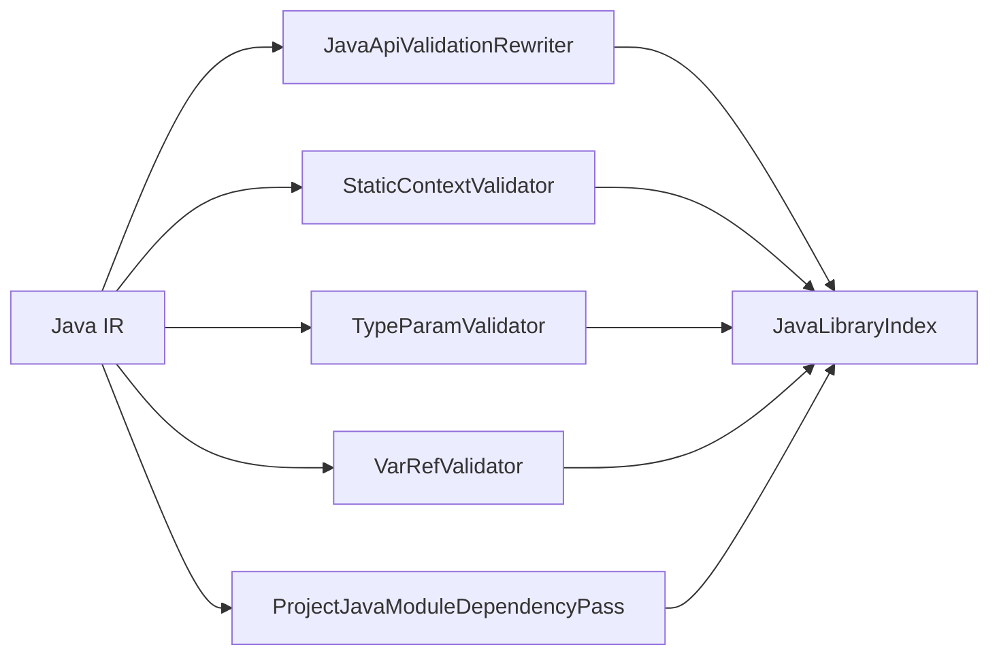

# 验证和兼容性Pass

<cite>
**本文档引用的文件**
- [ICompatibilityPack.cs](file://src/CSharpToJava.Core/Pipeline/Compatibility/ICompatibilityPack.cs)
- [CompatibilityPackRegistry.cs](file://src/CSharpToJava.Core/Pipeline/Compatibility/CompatibilityPackRegistry.cs)
- [Packs.cs](file://src/CSharpToJava.Core/Pipeline/Compatibility/Packs.cs)
- [CompatibilityClassGenerator.cs](file://src/CSharpToJava.Core/Pipeline/CompatibilityClassGenerator.cs)
- [JavaValidationPasses.cs](file://src/CSharpToJava.Core/Pipeline/Passes/JavaValidationPasses.cs)
- [JavaApiValidationRewriter.cs](file://src/CSharpToJava.Core/Java/Rewriters/JavaApiValidationRewriter.cs)
- [JavaStaticContextValidationRewriter.cs](file://src/CSharpToJava.Core/Java/Rewriters/JavaStaticContextValidationRewriter.cs)
- [JavaTypeParameterValidationRewriter.cs](file://src/CSharpToJava.Core/Java/Rewriters/JavaTypeParameterValidationRewriter.cs)
- [JavaVariableReferenceValidationRewriter.cs](file://src/CSharpToJava.Core/Java/Rewriters/JavaVariableReferenceValidationRewriter.cs)
- [JavaValidationPassTests.cs](file://tests/CSharpToJava.Tests/JavaValidationPassTests.cs)
- [TypeMappingServiceValidationTests.cs](file://tests/CSharpToJava.Tests/TypeMappingServiceValidationTests.cs)
</cite>

## 目录
1. [引言](#引言)
2. [项目结构](#项目结构)
3. [核心组件](#核心组件)
4. [架构总览](#架构总览)
5. [详细组件分析](#详细组件分析)
6. [依赖关系分析](#依赖关系分析)
7. [性能考量](#性能考量)
8. [故障排查指南](#故障排查指南)
9. [结论](#结论)
10. [附录](#附录)

## 引言
本文件面向cs2j（C#到Java转换器）的“验证与兼容性Pass”体系，系统化阐述以下内容：
- 验证Pass的设计目标与实现策略：Java语法验证、类型兼容性检查、语义完整性验证
- 兼容性Pass的功能与实现机制：不支持特性检测、替代方案生成、用户提示
- 验证Pass的分类体系：静态验证、动态验证、运行时验证的应用场景
- 自定义验证规则的实现路径：验证器接口、错误报告机制、修复建议生成
- 在整体转换流程中的定位与作用，以及如何在严格性与转换成功率之间取得平衡

## 项目结构
验证与兼容性相关代码主要分布在以下模块：
- 兼容性Pack与生成器：定义可插拔的兼容层包，按需生成桥接类与辅助类
- 验证Pass：在发射阶段对生成的Java IR进行多维度校验
- 测试用例：覆盖验证Pass与类型映射服务的正确性

图表来源
- [ICompatibilityPack.cs:1-86](file://src/CSharpToJava.Core/Pipeline/Compatibility/ICompatibilityPack.cs#L1-L86)
- [CompatibilityPackRegistry.cs:1-63](file://src/CSharpToJava.Core/Pipeline/Compatibility/CompatibilityPackRegistry.cs#L1-L63)
- [Packs.cs:1-179](file://src/CSharpToJava.Core/Pipeline/Compatibility/Packs.cs#L1-L179)
- [CompatibilityClassGenerator.cs:1-800](file://src/CSharpToJava.Core/Pipeline/CompatibilityClassGenerator.cs#L1-L800)
- [JavaValidationPasses.cs:1-131](file://src/CSharpToJava.Core/Pipeline/Passes/JavaValidationPasses.cs#L1-L131)
- [JavaApiValidationRewriter.cs:1-240](file://src/CSharpToJava.Core/Java/Rewriters/JavaApiValidationRewriter.cs#L1-L240)
- [JavaStaticContextValidationRewriter.cs:1-173](file://src/CSharpToJava.Core/Java/Rewriters/JavaStaticContextValidationRewriter.cs#L1-L173)
- [JavaTypeParameterValidationRewriter.cs:1-145](file://src/CSharpToJava.Core/Java/Rewriters/JavaTypeParameterValidationRewriter.cs#L1-L145)
- [JavaVariableReferenceValidationRewriter.cs:1-177](file://src/CSharpToJava.Core/Java/Rewriters/JavaVariableReferenceValidationRewriter.cs#L1-L177)

章节来源
- [ICompatibilityPack.cs:1-86](file://src/CSharpToJava.Core/Pipeline/Compatibility/ICompatibilityPack.cs#L1-L86)
- [CompatibilityPackRegistry.cs:1-63](file://src/CSharpToJava.Core/Pipeline/Compatibility/CompatibilityPackRegistry.cs#L1-L63)
- [Packs.cs:1-179](file://src/CSharpToJava.Core/Pipeline/Compatibility/Packs.cs#L1-L179)
- [CompatibilityClassGenerator.cs:1-800](file://src/CSharpToJava.Core/Pipeline/CompatibilityClassGenerator.cs#L1-L800)
- [JavaValidationPasses.cs:1-131](file://src/CSharpToJava.Core/Pipeline/Passes/JavaValidationPasses.cs#L1-L131)
- [JavaApiValidationRewriter.cs:1-240](file://src/CSharpToJava.Core/Java/Rewriters/JavaApiValidationRewriter.cs#L1-L240)
- [JavaStaticContextValidationRewriter.cs:1-173](file://src/CSharpToJava.Core/Java/Rewriters/JavaStaticContextValidationRewriter.cs#L1-L173)
- [JavaTypeParameterValidationRewriter.cs:1-145](file://src/CSharpToJava.Core/Java/Rewriters/JavaTypeParameterValidationRewriter.cs#L1-L145)
- [JavaVariableReferenceValidationRewriter.cs:1-177](file://src/CSharpToJava.Core/Java/Rewriters/JavaVariableReferenceValidationRewriter.cs#L1-L177)

## 核心组件
- 兼容性Pack接口与上下文
  - ICompatibilityPack定义Pack标识、描述、Maven依赖、适用性判断与生成方法
  - CompatibilityPackContext封装已转换结果与目标包名，提供类型引用检测能力
- 兼容性Pack注册表
  - 提供默认Pack集合注册、按需筛选与批量生成
- 内置Pack族
  - RefHolder、DotNetCore、Regex、XML、JSON、Trace、Io、Test等，覆盖常见桥接需求
- 兼容类生成器
  - 生成Holder类、MSTest兼容类、XML/JSON包装类、通用工具类、正则/Trace兼容类
- 验证Pass（发射后）
  - 项目级模块依赖收集Pass
  - Java API/静态上下文/类型参数/变量引用验证重写器

章节来源
- [ICompatibilityPack.cs:8-86](file://src/CSharpToJava.Core/Pipeline/Compatibility/ICompatibilityPack.cs#L8-L86)
- [CompatibilityPackRegistry.cs:8-63](file://src/CSharpToJava.Core/Pipeline/Compatibility/CompatibilityPackRegistry.cs#L8-L63)
- [Packs.cs:8-179](file://src/CSharpToJava.Core/Pipeline/Compatibility/Packs.cs#L8-L179)
- [CompatibilityClassGenerator.cs:10-326](file://src/CSharpToJava.Core/Pipeline/CompatibilityClassGenerator.cs#L10-L326)
- [JavaValidationPasses.cs:12-131](file://src/CSharpToJava.Core/Pipeline/Passes/JavaValidationPasses.cs#L12-L131)

## 架构总览
验证与兼容性Pass贯穿转换流程的关键阶段：
- 兼容性阶段：基于已转换代码的类型引用，按需生成桥接类，降低外部依赖门槛
- 发射阶段：对生成的Java IR执行多维验证，确保语法、语义与平台可用性
- 结果阶段：汇总模块依赖，为构建配置提供依据

图表来源
- [CompatibilityPackRegistry.cs:37-56](file://src/CSharpToJava.Core/Pipeline/Compatibility/CompatibilityPackRegistry.cs#L37-L56)
- [Packs.cs:14-25](file://src/CSharpToJava.Core/Pipeline/Compatibility/Packs.cs#L14-L25)
- [CompatibilityClassGenerator.cs:20-31](file://src/CSharpToJava.Core/Pipeline/CompatibilityClassGenerator.cs#L20-L31)
- [JavaValidationPasses.cs:17-39](file://src/CSharpToJava.Core/Pipeline/Passes/JavaValidationPasses.cs#L17-L39)
- [JavaApiValidationRewriter.cs:38-55](file://src/CSharpToJava.Core/Java/Rewriters/JavaApiValidationRewriter.cs#L38-L55)

## 详细组件分析

### 兼容性Pack体系
- 设计目标
  - 将C#特性或库映射到Java生态的等价实现或桥接类
  - 通过按需生成减少不必要的依赖与代码膨胀
- 实现机制
  - 以类型引用检测为触发条件，避免无谓生成
  - 通过Maven依赖声明引导构建系统引入第三方库
- 关键接口与上下文
  - ICompatibilityPack.Id/Description/MavenDependencies/IsApplicable/Generate
  - CompatibilityPackContext.ReferencesType/ReferencesAnyType用于判定适用性

图表来源
- [ICompatibilityPack.cs:8-86](file://src/CSharpToJava.Core/Pipeline/Compatibility/ICompatibilityPack.cs#L8-L86)
- [CompatibilityPackRegistry.cs:8-63](file://src/CSharpToJava.Core/Pipeline/Compatibility/CompatibilityPackRegistry.cs#L8-L63)
- [Packs.cs:8-179](file://src/CSharpToJava.Core/Pipeline/Compatibility/Packs.cs#L8-L179)

章节来源
- [ICompatibilityPack.cs:8-86](file://src/CSharpToJava.Core/Pipeline/Compatibility/ICompatibilityPack.cs#L8-L86)
- [CompatibilityPackRegistry.cs:15-56](file://src/CSharpToJava.Core/Pipeline/Compatibility/CompatibilityPackRegistry.cs#L15-L56)
- [Packs.cs:8-179](file://src/CSharpToJava.Core/Pipeline/Compatibility/Packs.cs#L8-L179)

### 兼容类生成器
- 功能
  - 生成Holder类（支持ref/out参数）、MSTest兼容类、XML/JSON包装类、通用工具类、正则/Trace兼容类
  - 统一确定基础包名，保证生成类的可导入性
- 生成策略
  - 按需生成：仅当检测到对应类型引用时才生成
  - 保持与转换器生成的调用风格一致，便于无缝替换

章节来源
- [CompatibilityClassGenerator.cs:20-326](file://src/CSharpToJava.Core/Pipeline/CompatibilityClassGenerator.cs#L20-L326)

### 验证Pass（发射后）
- 项目级模块依赖收集Pass
  - 解析生成代码的import语句，结合Java标准库索引，标注所需模块
  - 支持从IR导入列表与字符串解析两种路径
- Java API验证重写器
  - 校验类型存在性、构造器匹配、方法可见性（含继承链查找）
  - 诊断码：CS2J4001/4002/4003
- 静态上下文验证重写器
  - 检测静态方法中使用类级泛型参数的非法引用
  - 诊断码：CS2J5002
- 类型参数验证重写器
  - 检测泛型类型缺少必要类型实参的使用
  - 诊断码：CS2J5003
- 变量引用验证重写器
  - 维护作用域栈，检查未声明变量引用
  - 诊断码：CS2J5001

图表来源
- [JavaValidationPasses.cs:17-113](file://src/CSharpToJava.Core/Pipeline/Passes/JavaValidationPasses.cs#L17-L113)
- [JavaApiValidationRewriter.cs:38-240](file://src/CSharpToJava.Core/Java/Rewriters/JavaApiValidationRewriter.cs#L38-L240)
- [JavaStaticContextValidationRewriter.cs:36-173](file://src/CSharpToJava.Core/Java/Rewriters/JavaStaticContextValidationRewriter.cs#L36-L173)
- [JavaTypeParameterValidationRewriter.cs:34-145](file://src/CSharpToJava.Core/Java/Rewriters/JavaTypeParameterValidationRewriter.cs#L34-L145)
- [JavaVariableReferenceValidationRewriter.cs:53-177](file://src/CSharpToJava.Core/Java/Rewriters/JavaVariableReferenceValidationRewriter.cs#L53-L177)

章节来源
- [JavaValidationPasses.cs:12-131](file://src/CSharpToJava.Core/Pipeline/Passes/JavaValidationPasses.cs#L12-L131)
- [JavaApiValidationRewriter.cs:23-240](file://src/CSharpToJava.Core/Java/Rewriters/JavaApiValidationRewriter.cs#L23-L240)
- [JavaStaticContextValidationRewriter.cs:17-173](file://src/CSharpToJava.Core/Java/Rewriters/JavaStaticContextValidationRewriter.cs#L17-L173)
- [JavaTypeParameterValidationRewriter.cs:17-145](file://src/CSharpToJava.Core/Java/Rewriters/JavaTypeParameterValidationRewriter.cs#L17-L145)
- [JavaVariableReferenceValidationRewriter.cs:15-177](file://src/CSharpToJava.Core/Java/Rewriters/JavaVariableReferenceValidationRewriter.cs#L15-L177)

### 验证分类体系
- 静态验证
  - 语法与结构层面：变量作用域、类型参数一致性、静态上下文约束
  - 代表性实现：变量引用、类型参数、静态上下文验证重写器
- 动态验证
  - 运行期可用性：API存在性、方法/构造器匹配
  - 代表性实现：Java API验证重写器
- 运行时验证
  - 通过生成兼容类提供替代实现，降低运行时缺失风险
  - 代表性实现：兼容性Pack与生成器

章节来源
- [JavaVariableReferenceValidationRewriter.cs:15-177](file://src/CSharpToJava.Core/Java/Rewriters/JavaVariableReferenceValidationRewriter.cs#L15-L177)
- [JavaTypeParameterValidationRewriter.cs:17-145](file://src/CSharpToJava.Core/Java/Rewriters/JavaTypeParameterValidationRewriter.cs#L17-L145)
- [JavaStaticContextValidationRewriter.cs:17-173](file://src/CSharpToJava.Core/Java/Rewriters/JavaStaticContextValidationRewriter.cs#L17-L173)
- [JavaApiValidationRewriter.cs:23-240](file://src/CSharpToJava.Core/Java/Rewriters/JavaApiValidationRewriter.cs#L23-L240)
- [Packs.cs:8-179](file://src/CSharpToJava.Core/Pipeline/Compatibility/Packs.cs#L8-L179)

### 自定义验证规则实现指南
- 验证器接口与扩展点
  - 基于Java语法重写器模式：继承JavaSyntaxRewriter，重写相应节点访问方法
  - 使用DiagnosticCollector输出诊断，设置唯一诊断码与类别
- 错误报告机制
  - 通过DiagnosticCollector.Warning/Info/Error输出，携带上下文信息
  - 统计诊断数量，便于Pass层面汇总
- 修复建议生成
  - 对于可自动修复的场景，可在生成阶段直接注入兼容类或调整IR
  - 对于不可自动修复的场景，提供明确的诊断码与建议指引

章节来源
- [JavaApiValidationRewriter.cs:23-36](file://src/CSharpToJava.Core/Java/Rewriters/JavaApiValidationRewriter.cs#L23-L36)
- [JavaStaticContextValidationRewriter.cs:17-34](file://src/CSharpToJava.Core/Java/Rewriters/JavaStaticContextValidationRewriter.cs#L17-L34)
- [JavaTypeParameterValidationRewriter.cs:17-32](file://src/CSharpToJava.Core/Java/Rewriters/JavaTypeParameterValidationRewriter.cs#L17-L32)
- [JavaVariableReferenceValidationRewriter.cs:15-27](file://src/CSharpToJava.Core/Java/Rewriters/JavaVariableReferenceValidationRewriter.cs#L15-L27)

## 依赖关系分析
- 兼容性Pack与生成器
  - 通过CompatibilityPackRegistry集中管理，按类型引用动态生成
  - 生成的兼容类统一纳入转换结果，参与后续验证与模块依赖收集
- 验证Pass与Java标准库索引
  - 通过JavaLibraryIndex查询类型/方法/构造器存在性
  - 未加载元数据时，验证Pass降级为无操作
- 模块依赖收集
  - 优先使用IR导入列表；回退到字符串解析import语句
  - 将模块名标注到ConversionResult，便于构建配置

图表来源
- [JavaApiValidationRewriter.cs:25-36](file://src/CSharpToJava.Core/Java/Rewriters/JavaApiValidationRewriter.cs#L25-L36)
- [JavaStaticContextValidationRewriter.cs:19](file://src/CSharpToJava.Core/Java/Rewriters/JavaStaticContextValidationRewriter.cs#L19)
- [JavaTypeParameterValidationRewriter.cs:19](file://src/CSharpToJava.Core/Java/Rewriters/JavaTypeParameterValidationRewriter.cs#L19)
- [JavaVariableReferenceValidationRewriter.cs:17](file://src/CSharpToJava.Core/Java/Rewriters/JavaVariableReferenceValidationRewriter.cs#L17)
- [JavaValidationPasses.cs:19-21](file://src/CSharpToJava.Core/Pipeline/Passes/JavaValidationPasses.cs#L19-L21)

章节来源
- [JavaValidationPasses.cs:12-131](file://src/CSharpToJava.Core/Pipeline/Passes/JavaValidationPasses.cs#L12-L131)
- [JavaApiValidationRewriter.cs:23-240](file://src/CSharpToJava.Core/Java/Rewriters/JavaApiValidationRewriter.cs#L23-L240)

## 性能考量
- 按需生成兼容类
  - 通过类型引用检测避免生成无关类，降低代码体积与编译时间
- 验证Pass的渐进式执行
  - 优先使用IR导入列表，减少字符串解析开销
  - 仅在加载Java元数据时启用API验证，避免无意义的索引查询
- 诊断统计与短路
  - 各验证器维护诊断计数，便于快速定位问题与评估影响范围

## 故障排查指南
- 常见诊断与处理
  - CS2J4001：类型不存在。确认类型映射或引入相应模块
  - CS2J4002：方法不存在。检查继承链或使用兼容类
  - CS2J4003：构造器不匹配。核对参数数量/变长参数
  - CS2J5001：变量未声明。检查作用域与声明顺序
  - CS2J5002：静态方法使用类级泛型参数。移除或改为方法级泛型
  - CS2J5003：泛型类型缺少类型实参。补全类型参数或使用原始类型（谨慎）
- 测试参考
  - JavaValidationPassTests与TypeMappingServiceValidationTests提供了典型用例与期望行为

章节来源
- [JavaApiValidationRewriter.cs:95-142](file://src/CSharpToJava.Core/Java/Rewriters/JavaApiValidationRewriter.cs#L95-L142)
- [JavaVariableReferenceValidationRewriter.cs:152-156](file://src/CSharpToJava.Core/Java/Rewriters/JavaVariableReferenceValidationRewriter.cs#L152-L156)
- [JavaStaticContextValidationRewriter.cs:137-141](file://src/CSharpToJava.Core/Java/Rewriters/JavaStaticContextValidationRewriter.cs#L137-L141)
- [JavaTypeParameterValidationRewriter.cs:128-131](file://src/CSharpToJava.Core/Java/Rewriters/JavaTypeParameterValidationRewriter.cs#L128-L131)
- [JavaValidationPassTests.cs](file://tests/CSharpToJava.Tests/JavaValidationPassTests.cs)
- [TypeMappingServiceValidationTests.cs](file://tests/CSharpToJava.Tests/TypeMappingServiceValidationTests.cs)

## 结论
cs2j的验证与兼容性Pass体系通过“按需兼容+发射后验证”的组合，实现了在保证生成代码质量的同时最大化转换成功率：
- 兼容性Pack与生成器以类型引用为触发条件，提供即插即用的桥接能力
- 多维度验证在发射阶段捕获语法、语义与平台可用性问题
- 通过测试用例与诊断码形成闭环反馈，持续提升转换稳定性与可维护性

## 附录
- 诊断码速查
  - CS2J4001：Java类型未找到
  - CS2J4002：Java方法未找到
  - CS2J4003：Java构造器未找到
  - CS2J5001：变量未声明
  - CS2J5002：静态方法使用类级泛型参数
  - CS2J5003：泛型类型缺少类型实参