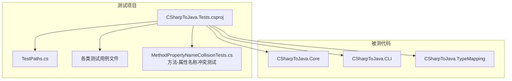
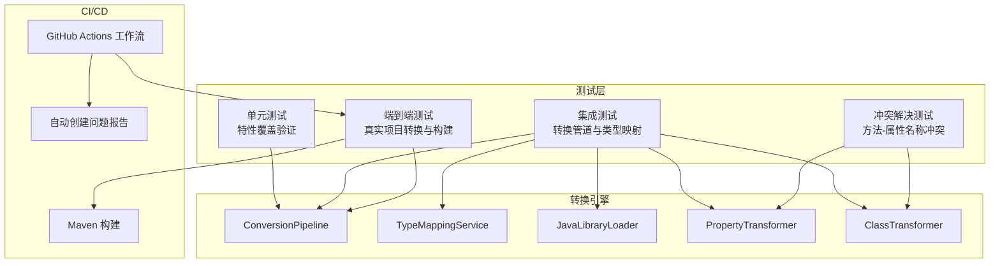
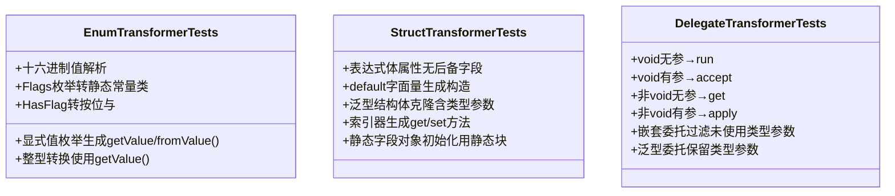
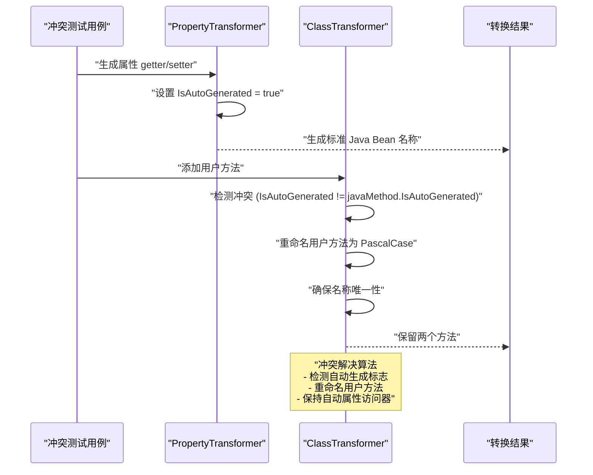
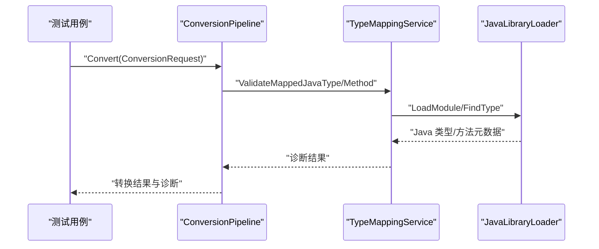
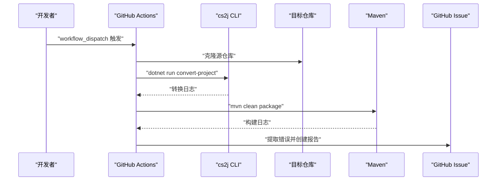
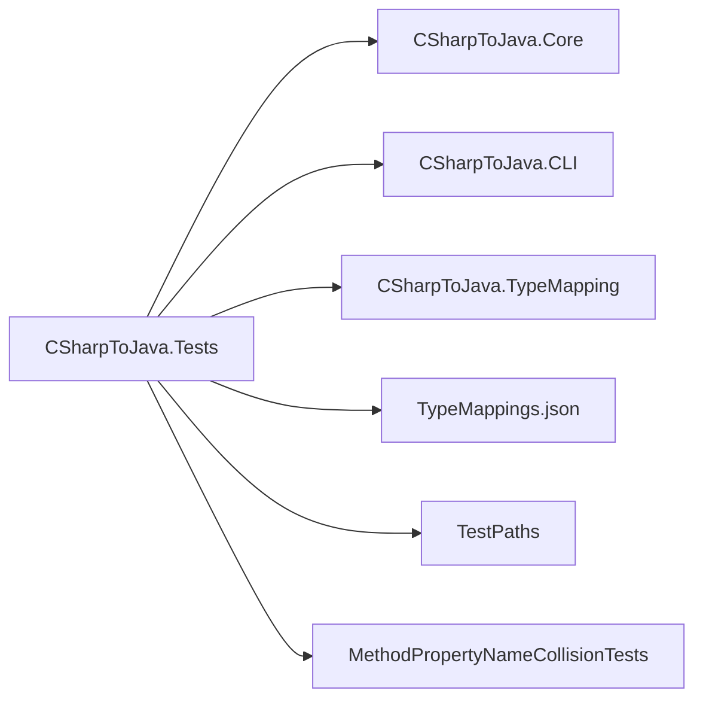

# 测试策略

<cite>
**本文引用的文件**
- [CSharpToJava.Tests.csproj](file://tests/CSharpToJava.Tests/CSharpToJava.Tests.csproj)
- [TestPaths.cs](file://tests/CSharpToJava.Tests/TestPaths.cs)
- [MethodPropertyNameCollisionTests.cs](file://tests/CSharpToJava.Tests/MethodPropertyNameCollisionTests.cs)
- [PropertyTransformer.cs](file://src/CSharpToJava.Core/Transformers/Member/PropertyTransformer.cs)
- [ClassTransformer.cs](file://src/CSharpToJava.Core/Transformers/Type/ClassTransformer.cs)
- [EnumTransformerTests.cs](file://tests/CSharpToJava.Tests/EnumTransformerTests.cs)
- [StructTransformerTests.cs](file://tests/CSharpToJava.Tests/StructTransformerTests.cs)
- [DelegateTransformerTests.cs](file://tests/CSharpToJava.Tests/DelegateTransformerTests.cs)
- [ConversionPipelineIgnoreDirectoryTests.cs](file://tests/CSharpToJava.Tests/ConversionPipelineIgnoreDirectoryTests.cs)
- [JavaLibraryLoaderTests.cs](file://tests/CSharpToJava.Tests/JavaLibraryLoaderTests.cs)
- [TypeMappingServiceValidationTests.cs](file://tests/CSharpToJava.Tests/TypeMappingServiceValidationTests.cs)
- [agl-convert-and-report.yml](file://.github/workflows/agl-convert-and-report.yml)
- [README.md](file://README.md)
</cite>

## 目录
1. [引言](#引言)
2. [项目结构](#项目结构)
3. [核心组件](#核心组件)
4. [架构总览](#架构总览)
5. [详细组件分析](#详细组件分析)
6. [依赖关系分析](#依赖关系分析)
7. [性能考量](#性能考量)
8. [故障排查指南](#故障排查指南)
9. [结论](#结论)
10. [附录](#附录)

## 引言
本文件系统化阐述 cs2j 的测试策略与实践，覆盖测试组织结构、测试分类（单元测试、集成测试、端到端测试）、转换测试模式与边界情况处理、测试用例编写指南与最佳实践、测试数据管理与维护策略，以及持续集成与自动化测试配置说明，并为贡献者提供测试开发指导与规范。

**更新** 新增方法-属性名称冲突解决机制的专门测试套件，涵盖 setter/getter 冲突、声明顺序独立性、参数签名变化等关键场景。

## 项目结构
cs2j 的测试位于 tests/CSharpToJava.Tests，采用 xUnit 测试框架，通过 .NET SDK 项目组织，直接引用核心库与 CLI 项目，确保测试覆盖转换管道、类型映射、语言特性转换等关键模块。测试项目还包含默认类型映射配置的复制逻辑，保证测试在任意工作目录下可运行。

**图表来源**
- [CSharpToJava.Tests.csproj:1-35](file://tests/CSharpToJava.Tests/CSharpToJava.Tests.csproj#L1-L35)
- [TestPaths.cs:1-27](file://tests/CSharpToJava.Tests/TestPaths.cs#L1-L27)
- [MethodPropertyNameCollisionTests.cs:1-213](file://tests/CSharpToJava.Tests/MethodPropertyNameCollisionTests.cs#L1-L213)

**章节来源**
- [CSharpToJava.Tests.csproj:1-35](file://tests/CSharpToJava.Tests/CSharpToJava.Tests.csproj#L1-L35)
- [README.md:72-74](file://README.md#L72-L74)

## 核心组件
- 测试框架与运行环境
  - 使用 xUnit 2.9.3 与 Microsoft.NET.Test.Sdk 17.14.1，启用 Nullable 和隐式 using，便于简洁书写测试。
  - 通过 coverlet.collector 收集覆盖率信息，便于评估测试覆盖面。
- 测试项目引用
  - 直接引用 CSharpToJava.Core、CSharpToJava.CLI、CSharpToJava.TypeMapping 三个核心项目，确保对转换引擎、CLI 行为与类型映射的端到端验证。
- 测试数据与配置
  - 将默认类型映射配置 TypeMappings.json 复制到输出目录，保障测试可在任意工作目录执行。
- 共享路径工具
  - TestPaths 提供定位仓库级 Java 配置目录的能力，统一测试中对 Java 元数据的访问方式。

**章节来源**
- [CSharpToJava.Tests.csproj:1-35](file://tests/CSharpToJava.Tests/CSharpToJava.Tests.csproj#L1-L35)
- [TestPaths.cs:1-27](file://tests/CSharpToJava.Tests/TestPaths.cs#L1-L27)

## 架构总览
测试体系围绕"转换管道 + 类型映射 + 语言特性转换"三大维度展开，结合单元测试与集成测试，覆盖从单个语法特性到项目级转换的完整链路；同时通过 GitHub Actions 实现端到端的自动化转换与构建报告。

**图表来源**
- [ConversionPipelineIgnoreDirectoryTests.cs:1-72](file://tests/CSharpToJava.Tests/ConversionPipelineIgnoreDirectoryTests.cs#L1-L72)
- [JavaLibraryLoaderTests.cs:1-104](file://tests/CSharpToJava.Tests/JavaLibraryLoaderTests.cs#L1-L104)
- [TypeMappingServiceValidationTests.cs:1-180](file://tests/CSharpToJava.Tests/TypeMappingServiceValidationTests.cs#L1-L180)
- [MethodPropertyNameCollisionTests.cs:6-18](file://tests/CSharpToJava.Tests/MethodPropertyNameCollisionTests.cs#L6-L18)
- [agl-convert-and-report.yml:1-254](file://.github/workflows/agl-convert-and-report.yml#L1-L254)

## 详细组件分析

### 单元测试：语言特性转换验证
- 枚举转换（EnumTransformerTests）
  - 验证显式值枚举生成 getValue/fromValue 方法、十六进制值解析、整型转换使用 getValue/values 等行为。
  - Flags 枚举生成静态类常量而非丢弃，HasFlag 转换为按位与检查。
- 结构体转换（StructTransformerTests）
  - 表达式体属性不生成后备字段；default 字面量对结构体生成构造调用；泛型结构体克隆保留类型参数；索引器生成 get/set 方法；静态字段对象初始化使用静态块。
- 委托转换（DelegateTransformerTests）
  - 不同返回值与参数签名的委托映射到函数式接口的 run/accept/get/apply 等方法名；嵌套委托仅保留使用到的外部类型参数；泛型委托保留类型参数。

**图表来源**
- [EnumTransformerTests.cs:1-200](file://tests/CSharpToJava.Tests/EnumTransformerTests.cs#L1-L200)
- [StructTransformerTests.cs:1-200](file://tests/CSharpToJava.Tests/StructTransformerTests.cs#L1-L200)
- [DelegateTransformerTests.cs:1-154](file://tests/CSharpToJava.Tests/DelegateTransformerTests.cs#L1-L154)

**章节来源**
- [EnumTransformerTests.cs:1-200](file://tests/CSharpToJava.Tests/EnumTransformerTests.cs#L1-L200)
- [StructTransformerTests.cs:1-200](file://tests/CSharpToJava.Tests/StructTransformerTests.cs#L1-L200)
- [DelegateTransformerTests.cs:1-154](file://tests/CSharpToJava.Tests/DelegateTransformerTests.cs#L1-L154)

### 冲突解决测试：方法-属性名称冲突机制
- **核心场景**：属性 FirstEdge { get; set; } 生成 setFirstEdge()，用户方法 SetFirstEdge(PathEdge edge) 也映射到 setFirstEdge()。修复后两者都必须存活——用户方法重命名为 PascalCase。
- **声明顺序独立性**：用户方法 SetFirstEdge 在属性 FirstEdge 之前声明时，仍需正确处理冲突。
- **Getter 冲突**：属性 Value { get; } 生成 getValue()，用户方法 GetValue() 也映射到 getValue()，用户方法应重命名为 PascalCase。
- **参数签名变化**：相同名称但不同参数类型或数量的方法不应发生冲突，两者都应保持原名作为 Java 重载。
- **回归测试**：无冲突的属性应生成正常 getter/setter。

**图表来源**
- [MethodPropertyNameCollisionTests.cs:27-65](file://tests/CSharpToJava.Tests/MethodPropertyNameCollisionTests.cs#L27-L65)
- [PropertyTransformer.cs:126](file://src/CSharpToJava.Core/Transformers/Member/PropertyTransformer.cs#L126)
- [ClassTransformer.cs:657-689](file://src/CSharpToJava.Core/Transformers/Type/ClassTransformer.cs#L657-L689)

**章节来源**
- [MethodPropertyNameCollisionTests.cs:1-213](file://tests/CSharpToJava.Tests/MethodPropertyNameCollisionTests.cs#L1-L213)
- [PropertyTransformer.cs:126](file://src/CSharpToJava.Core/Transformers/Member/PropertyTransformer.cs#L126)
- [ClassTransformer.cs:657-689](file://src/CSharpToJava.Core/Transformers/Type/ClassTransformer.cs#L657-L689)

### 集成测试：转换管道与类型映射
- 转换管道忽略目录（ConversionPipelineIgnoreDirectoryTests）
  - 验证项目转换时忽略 .git 等隐藏目录，支持普通文件与部分类型合并场景。
- Java 库加载（JavaLibraryLoaderTests）
  - 验证模块发现、加载、类型查找、构造函数与方法参数信息读取，以及不存在模块的容错。
- 类型映射服务验证（TypeMappingServiceValidationTests）
  - 验证已知类型的映射无诊断、未知类型发出 CS2J4001、未知方法发出 CS2J4002；在提供 Java 元数据路径时，方法名自动推断（如 PascalCase → camelCase）。

**图表来源**
- [ConversionPipelineIgnoreDirectoryTests.cs:1-72](file://tests/CSharpToJava.Tests/ConversionPipelineIgnoreDirectoryTests.cs#L1-L72)
- [JavaLibraryLoaderTests.cs:1-104](file://tests/CSharpToJava.Tests/JavaLibraryLoaderTests.cs#L1-L104)
- [TypeMappingServiceValidationTests.cs:1-180](file://tests/CSharpToJava.Tests/TypeMappingServiceValidationTests.cs#L1-L180)

**章节来源**
- [ConversionPipelineIgnoreDirectoryTests.cs:1-72](file://tests/CSharpToJava.Tests/ConversionPipelineIgnoreDirectoryTests.cs#L1-L72)
- [JavaLibraryLoaderTests.cs:1-104](file://tests/CSharpToJava.Tests/JavaLibraryLoaderTests.cs#L1-L104)
- [TypeMappingServiceValidationTests.cs:1-180](file://tests/CSharpToJava.Tests/TypeMappingServiceValidationTests.cs#L1-L180)

### 端到端测试：真实项目转换与构建
- GitHub Actions 工作流
  - 自动克隆指定源仓库，构建 cs2j，执行 C# 到 Java 转换，随后使用 Maven 执行构建。
  - 解析转换与构建日志中的错误，去重后汇总，必要时自动创建 GitHub Issue 报告。
  - 支持通过 workflow_dispatch 触发，允许自定义源仓库、解决方案路径与输出目录。

**图表来源**
- [agl-convert-and-report.yml:1-254](file://.github/workflows/agl-convert-and-report.yml#L1-L254)

**章节来源**
- [agl-convert-and-report.yml:1-254](file://.github/workflows/agl-convert-and-report.yml#L1-L254)

## 依赖关系分析
- 测试项目对核心项目的依赖
  - CSharpToJava.Tests 直接引用 CSharpToJava.Core、CSharpToJava.CLI、CSharpToJava.TypeMapping，确保测试能够覆盖转换管道、CLI 行为与类型映射。
- 测试数据与配置
  - 通过 Content 项复制 TypeMappings.json 到输出目录，避免测试因工作目录差异导致失败。
- 共享路径工具
  - TestPaths 通过遍历基目录向上查找 config/java 目录，确保 Java 元数据加载的一致性。

**图表来源**
- [CSharpToJava.Tests.csproj:21-33](file://tests/CSharpToJava.Tests/CSharpToJava.Tests.csproj#L21-L33)
- [TestPaths.cs:1-27](file://tests/CSharpToJava.Tests/TestPaths.cs#L1-L27)
- [MethodPropertyNameCollisionTests.cs:1-213](file://tests/CSharpToJava.Tests/MethodPropertyNameCollisionTests.cs#L1-L213)

**章节来源**
- [CSharpToJava.Tests.csproj:1-35](file://tests/CSharpToJava.Tests/CSharpToJava.Tests.csproj#L1-L35)
- [TestPaths.cs:1-27](file://tests/CSharpToJava.Tests/TestPaths.cs#L1-L27)

## 性能考量
- 测试执行效率
  - 使用并行测试运行以缩短整体测试时间；合理拆分测试用例，避免单个测试耗时过长。
- 资源占用控制
  - 对临时目录与文件的清理应放在 finally 中，防止磁盘空间与进程资源泄漏。
- 覆盖率收集
  - 启用 coverlet.collector，定期评估关键模块的覆盖率，识别薄弱环节并补充测试。

## 故障排查指南
- 转换失败或诊断异常
  - 检查 TypeMappingService 的诊断消息（如 CS2J4001/CS2J4002），确认映射类型与方法是否存在于 Java 元数据中。
  - 在未提供 Java 元数据路径时，某些自动推断可能失效，需手动配置映射。
- 项目转换忽略文件
  - 若发现 .git 或其他目录下的文件未被转换，检查转换管道的忽略规则与目录结构。
- 冲突解决失败
  - 检查 PropertyTransformer 是否正确设置 IsAutoGenerated 标志。
  - 验证 ClassTransformer 的冲突检测逻辑是否正确识别用户定义方法与自动生成方法的区别。
  - 确认重命名算法是否正确处理 PascalCase 转换和名称唯一性。
- CI 报告问题
  - 查看工作流日志中的转换与 Maven 构建输出，定位错误上下文；必要时扩大日志截断阈值以便完整复现。

**章节来源**
- [TypeMappingServiceValidationTests.cs:20-52](file://tests/CSharpToJava.Tests/TypeMappingServiceValidationTests.cs#L20-L52)
- [ConversionPipelineIgnoreDirectoryTests.cs:8-37](file://tests/CSharpToJava.Tests/ConversionPipelineIgnoreDirectoryTests.cs#L8-L37)
- [MethodPropertyNameCollisionTests.cs:6-18](file://tests/CSharpToJava.Tests/MethodPropertyNameCollisionTests.cs#L6-L18)
- [agl-convert-and-report.yml:140-170](file://.github/workflows/agl-convert-and-report.yml#L140-L170)

## 结论
cs2j 的测试策略以单元测试为基础，覆盖语言特性转换的细节；以集成测试验证转换管道与类型映射的协同；以端到端测试保障真实项目转换与构建的稳定性。新增的方法-属性名称冲突测试套件专门验证了复杂的名称冲突解决机制，确保用户定义方法与自动生成属性访问器能够和谐共存。配合 GitHub Actions 的自动化流程，形成从本地到云端的全链路质量保障体系。建议持续完善边界情况与异常路径的测试，提升转换器在复杂场景下的鲁棒性。

## 附录

### 测试分类与设计原则
- 单元测试
  - 针对单一转换器或转换规则的行为验证，如枚举、结构体、委托等。
  - 关注边界条件与异常输入，确保转换结果符合预期。
- 冲突解决测试
  - **新增** 专门针对名称冲突场景的测试，验证方法-属性名称冲突的解决机制。
  - 覆盖 setter/getter 冲突、声明顺序独立性、参数签名变化等关键场景。
  - 确保用户定义方法与自动生成方法的和谐共存。
- 集成测试
  - 验证转换管道与类型映射服务的协作，以及 Java 元数据加载与校验。
  - 关注跨模块交互与配置注入（如 JavaMetadataPath）。
- 端到端测试
  - 使用真实项目进行转换与构建，验证整体流程的可用性与稳定性。
  - 通过 CI 自动化执行，快速反馈问题并生成报告。

### 转换测试模式与方法
- 以最小可验证单元为目标，构造简短的 C# 片段，断言生成的 Java 代码片段或诊断信息。
- 对于复杂特性（如 LINQ、记录、异步），采用逐步拆解的方式，先验证基础形态再扩展到高级用法。
- 对于类型映射，优先验证常见类型，再扩展到泛型、数组、集合等复杂形态。
- **新增** 对冲突解决场景，使用明确的断言验证方法名称的重命名和保留策略。

### 边界情况测试与重要性
- 忽略目录与文件：验证转换管道不会误处理 .git 等隐藏目录。
- 未知类型与方法：验证诊断消息的准确性与可读性。
- 元数据缺失：验证在缺少 Java 元数据时的行为与降级策略。
- 嵌套与泛型：验证类型参数的正确传递与过滤。
- **新增** 冲突解决边界：验证不同参数类型/数量的区分、声明顺序的独立性、PascalCase 重命名的唯一性保证。

### 测试用例编写指南与最佳实践
- 命名规范
  - 使用动宾结构命名测试方法，清晰表达断言意图（如 ExplicitValueEnum_GeneratesGetValueAndFromValue）。
  - **新增** 冲突测试使用语义化的命名，如 SetterAndMethod_SameNameAndSignature_UserMethodRenamedToPascalCase。
- 断言策略
  - 优先使用字符串包含断言验证生成代码的关键片段，避免过度依赖格式细节。
  - 对诊断信息使用精确匹配，确保错误码与消息一致。
  - **新增** 冲突测试中，分别断言自动生成方法和用户定义方法的存在性。
- 数据驱动
  - 对相似场景使用参数化或组合策略，减少重复代码。
- 可维护性
  - 将公共的转换辅助封装为私有方法，统一请求构建与断言逻辑。
  - 使用共享路径工具统一访问 Java 配置目录，避免硬编码。
  - **新增** 冲突测试中，使用统一的 Convert 辅助方法简化测试代码。

### 测试数据管理与维护策略
- 类型映射配置
  - 将 TypeMappings.json 复制到测试输出目录，确保测试独立性与可移植性。
- Java 元数据
  - 通过 TestPaths 动态定位 config/java 目录，避免因工作目录差异导致的加载失败。
- 冲突测试数据
  - **新增** 使用简洁的 C# 片段模拟真实场景，避免过度复杂的测试数据。
  - 确保测试用例的可读性和可维护性。

### 持续集成与自动化测试配置
- 触发方式
  - 支持 workflow_dispatch，允许手动触发并自定义源仓库、解决方案路径与输出目录。
- 步骤分解
  - 检出代码、设置 .NET 与 Java/Maven 环境、克隆源仓库、构建转换器、执行转换、Maven 构建、解析错误并创建 Issue。
- 错误报告
  - 自动提取转换与构建日志中的错误，去重并截断输出，必要时创建 GitHub Issue 以便跟踪。
- **新增** 冲突测试集成
  - 在 CI 中包含冲突解决测试，确保新功能的稳定性。
  - 监控冲突测试的执行时间和成功率，及时发现回归问题。

**章节来源**
- [README.md:24-28](file://README.md#L24-L28)
- [agl-convert-and-report.yml:1-254](file://.github/workflows/agl-convert-and-report.yml#L1-L254)
- [MethodPropertyNameCollisionTests.cs:202-212](file://tests/CSharpToJava.Tests/MethodPropertyNameCollisionTests.cs#L202-L212)