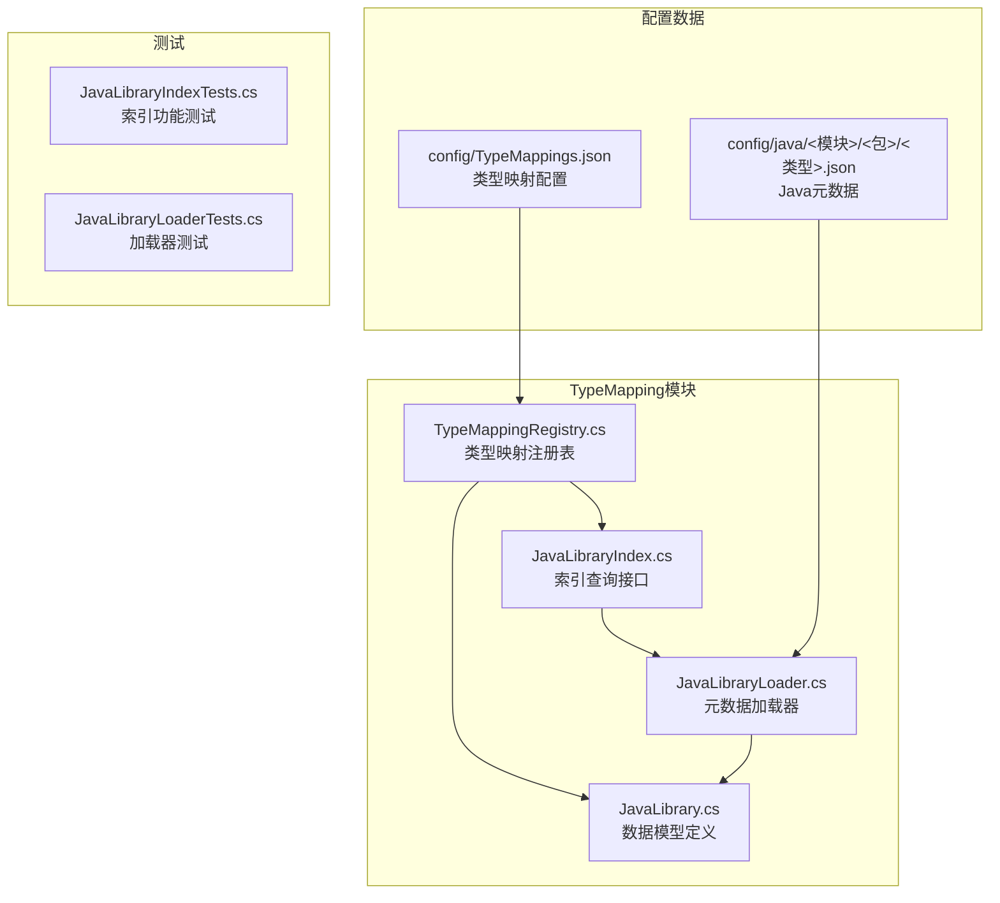
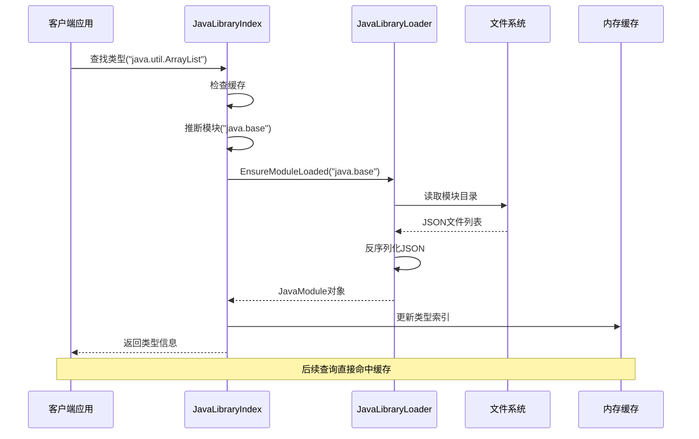
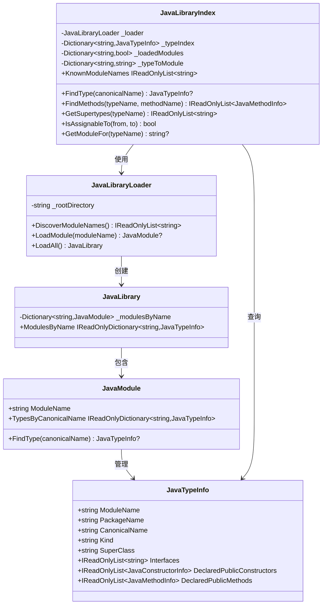
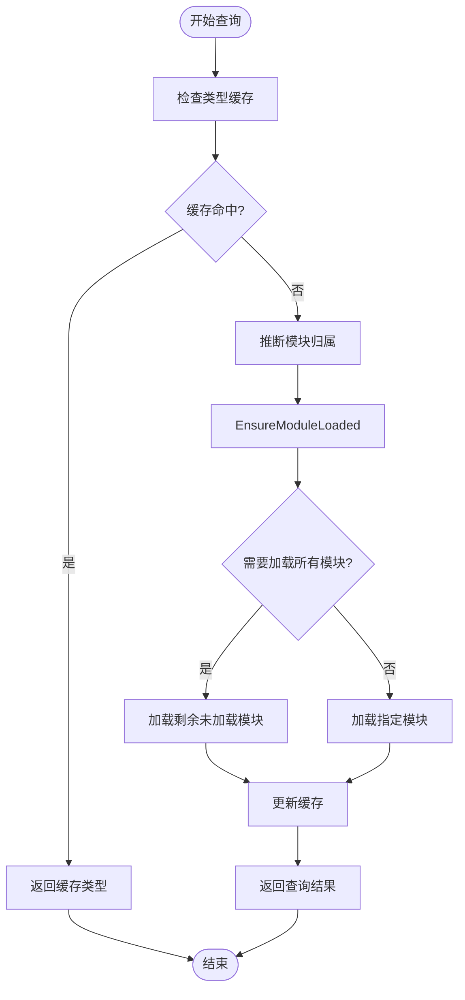
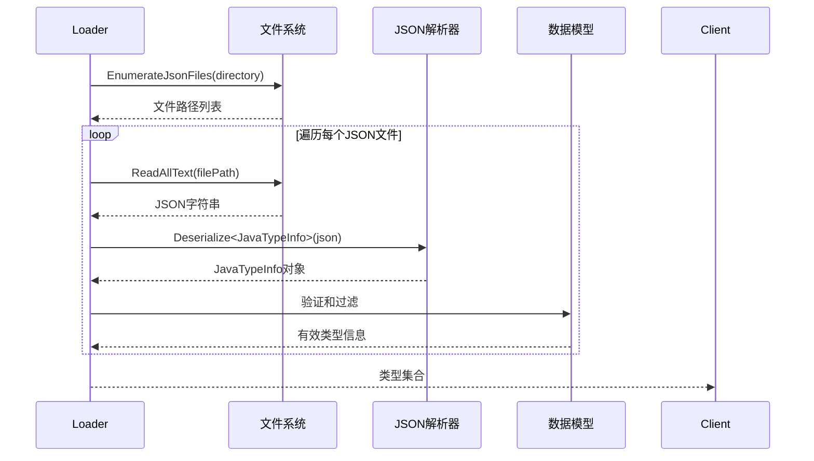
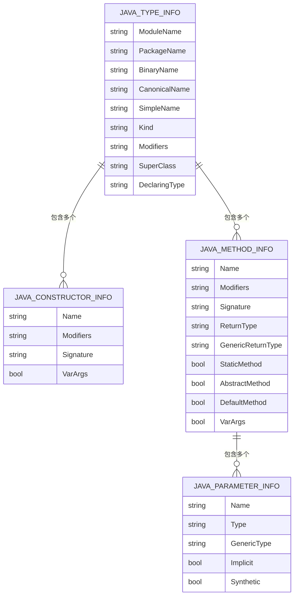
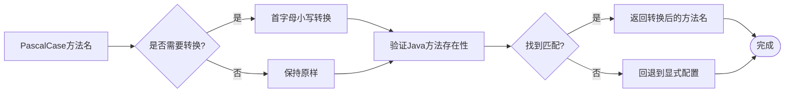
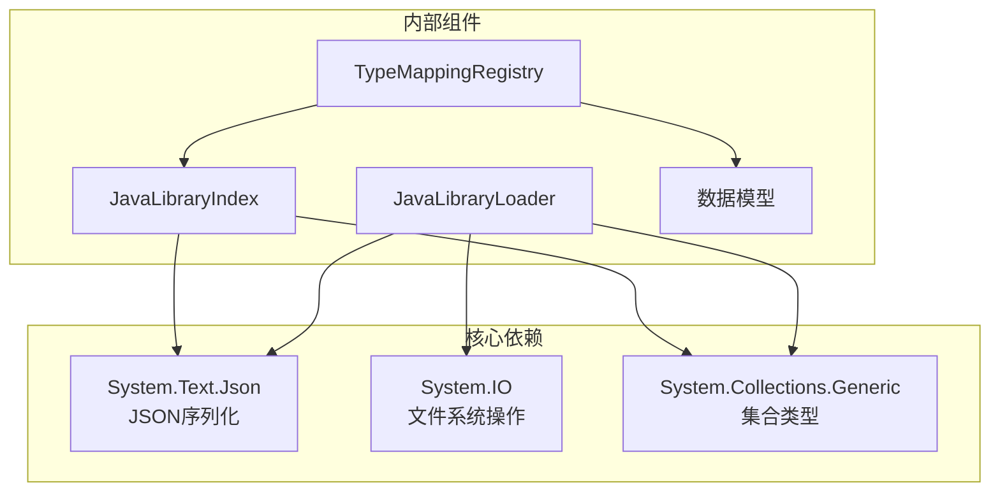

# Java库索引

<cite>
**本文档引用的文件**
- [JavaLibraryIndex.cs](file://src/CSharpToJava.TypeMapping/JavaModel/JavaLibraryIndex.cs)
- [JavaLibraryLoader.cs](file://src/CSharpToJava.TypeMapping/JavaModel/JavaLibraryLoader.cs)
- [JavaLibrary.cs](file://src/CSharpToJava.TypeMapping/JavaModel/JavaLibrary.cs)
- [TypeMappingRegistry.cs](file://src/CSharpToJava.TypeMapping/TypeMappingRegistry.cs)
- [TypeMappings.json](file://config/TypeMappings.json)
- [String.json](file://config/java/java.base/java/lang/String.json)
- [ArrayList.json](file://config/java/java.base/java/util/ArrayList.json)
- [JavaLibraryIndexTests.cs](file://tests/CSharpToJava.Tests/JavaLibraryIndexTests.cs)
- [JavaLibraryLoaderTests.cs](file://tests/CSharpToJava.Tests/JavaLibraryLoaderTests.cs)
- [TestPaths.cs](file://tests/CSharpToJava.Tests/TestPaths.cs)
</cite>

## 目录
1. [简介](#简介)
2. [项目结构](#项目结构)
3. [核心组件](#核心组件)
4. [架构概览](#架构概览)
5. [详细组件分析](#详细组件分析)
6. [依赖关系分析](#依赖关系分析)
7. [性能考虑](#性能考虑)
8. [故障排除指南](#故障排除指南)
9. [结论](#结论)
10. [附录](#附录)

## 简介

cs2j Java库索引系统是一个用于管理Java标准库元数据的高性能查询引擎。该系统通过解析config/java目录下的JSON元数据文件，构建内存中的索引结构，为C#到Java代码转换提供准确的类型信息和方法签名验证。

系统的核心价值在于：
- **懒加载架构**：按需加载模块，避免一次性加载所有元数据
- **智能模块猜测**：基于类型名称推断所属模块，提高查询效率
- **完整的继承关系**：支持类层次结构的完整遍历和类型分配检查
- **自动推导功能**：支持PascalCase到camelCase的方法名转换和Java类型验证

## 项目结构

cs2j项目的Java库索引系统位于TypeMapping子项目中，采用清晰的分层架构：



**图表来源**
- [JavaLibraryIndex.cs:1-291](file://src/CSharpToJava.TypeMapping/JavaLibraryIndex.cs#L1-L291)
- [JavaLibraryLoader.cs:1-111](file://src/CSharpToJava.TypeMapping/JavaLibraryLoader.cs#L1-L111)
- [JavaLibrary.cs:1-168](file://src/CSharpToJava.TypeMapping/JavaLibrary.cs#L1-L168)

**章节来源**
- [README.md:64-74](file://README.md#L64-L74)

## 核心组件

### JavaLibraryIndex - 懒加载索引器

JavaLibraryIndex是整个系统的核心查询接口，实现了以下关键功能：

- **懒加载策略**：仅在首次请求时加载对应模块的类型元数据
- **双重字典缓存**：同时维护类型索引和模块映射，提供O(1)查询性能
- **智能模块猜测**：基于类型名称前缀推断模块归属
- **继承关系遍历**：支持广度优先搜索超类型链

### JavaLibraryLoader - 元数据加载器

负责从文件系统读取和解析JSON元数据文件：

- **模块发现**：自动扫描config/java目录下的所有模块
- **类型解析**：使用System.Text.Json反序列化JSON到强类型对象
- **错误容错**：跳过损坏或不可读的元数据文件
- **延迟加载**：按模块粒度进行延迟加载

### 数据模型体系

系统定义了完整的数据模型来表示Java类型元数据：

- **JavaTypeInfo**：描述单个Java类型的所有元数据
- **JavaConstructorInfo**：表示公共构造函数信息
- **JavaMethodInfo**：表示公共方法信息
- **JavaParameterInfo**：表示方法参数信息

**章节来源**
- [JavaLibraryIndex.cs:11-291](file://src/CSharpToJava.TypeMapping/JavaLibraryIndex.cs#L11-L291)
- [JavaLibraryLoader.cs:16-111](file://src/CSharpToJava.TypeMapping/JavaLibraryLoader.cs#L16-L111)
- [JavaLibrary.cs:92-168](file://src/CSharpToJava.TypeMapping/JavaLibrary.cs#L92-L168)

## 架构概览

系统采用分层架构设计，确保关注点分离和高内聚低耦合：



**图表来源**
- [JavaLibraryIndex.cs:50-68](file://src/CSharpToJava.TypeMapping/JavaLibraryIndex.cs#L50-L68)
- [JavaLibraryLoader.cs:58-66](file://src/CSharpToJava.TypeMapping/JavaLibraryLoader.cs#L58-L66)

### 组件交互流程



**图表来源**
- [JavaLibraryIndex.cs:11-291](file://src/CSharpToJava.TypeMapping/JavaLibraryIndex.cs#L11-L291)
- [JavaLibraryLoader.cs:16-111](file://src/CSharpToJava.TypeMapping/JavaLibraryLoader.cs#L16-L111)
- [JavaLibrary.cs:137-168](file://src/CSharpToJava.TypeMapping/JavaLibrary.cs#L137-L168)

## 详细组件分析

### JavaLibraryIndex - 懒加载索引实现

#### 核心查询算法

JavaLibraryIndex实现了高效的懒加载查询机制：



**图表来源**
- [JavaLibraryIndex.cs:230-249](file://src/CSharpToJava.TypeMapping/JavaLibraryIndex.cs#L230-L249)
- [JavaLibraryIndex.cs:277-289](file://src/CSharpToJava.TypeMapping/JavaLibraryIndex.cs#L277-L289)

#### 模块猜测算法

系统实现了智能的模块归属推断：

| 类型前缀 | 推断模块 | 说明 |
|---------|---------|------|
| java.lang.* | java.base | 标准库核心包 |
| javax.xml.* | java.xml | XML处理相关 |
| javax.naming.* | java.naming | 命名服务 |
| javax.sql.* | java.sql | 数据库访问 |
| javax.script.* | java.scripting | 脚本引擎 |

**章节来源**
- [JavaLibraryIndex.cs:204-228](file://src/CSharpToJava.TypeMapping/JavaLibraryIndex.cs#L204-L228)

### JavaLibraryLoader - 元数据加载机制

#### JSON文件解析流程



**图表来源**
- [JavaLibraryLoader.cs:84-109](file://src/CSharpToJava.TypeMapping/JavaLibraryLoader.cs#L84-L109)

#### 错误处理策略

系统采用渐进式错误处理机制：
- **IO异常**：跳过无法读取的文件
- **JSON解析异常**：记录错误但继续处理其他文件
- **类型验证失败**：忽略不完整的元数据

**章节来源**
- [JavaLibraryLoader.cs:97-109](file://src/CSharpToJava.TypeMapping/JavaLibraryLoader.cs#L97-L109)

### 数据模型详解

#### JavaTypeInfo - 类型元数据结构

JavaTypeInfo是系统的核心数据模型，完整描述了Java类型的信息：



**图表来源**
- [JavaLibrary.cs:92-132](file://src/CSharpToJava.TypeMapping/JavaLibrary.cs#L92-L132)

#### 元数据文件示例

以String类为例，展示完整的元数据结构：

**章节来源**
- [String.json:1-800](file://config/java/java.base/java/lang/String.json#L1-L800)
- [ArrayList.json:1-614](file://config/java/java.base/java/util/ArrayList.json#L1-L614)

### 自动推导功能

TypeMappingRegistry集成了强大的自动推导能力：

#### PascalCase到camelCase转换



**图表来源**
- [TypeMappingRegistry.cs:326-342](file://src/CSharpToJava.TypeMapping/TypeMappingRegistry.cs#L326-L342)

#### 类型存在性验证

系统提供了两级验证机制：
1. **显式配置验证**：检查TypeMappings.json中的映射
2. **自动推导验证**：通过JavaLibraryIndex验证Java类型和方法的存在性

**章节来源**
- [TypeMappingRegistry.cs:387-401](file://src/CSharpToJava.TypeMapping/TypeMappingRegistry.cs#L387-L401)

## 依赖关系分析

### 外部依赖

系统主要依赖以下外部组件：



**图表来源**
- [JavaLibraryLoader.cs:1-2](file://src/CSharpToJava.TypeMapping/JavaLibraryLoader.cs#L1-L2)
- [JavaLibraryIndex.cs:1-1](file://src/CSharpToJava.TypeMapping/JavaLibraryIndex.cs#L1-L1)

### 内部耦合关系

系统采用松耦合设计，主要通过接口和数据模型进行交互：

- **JavaLibraryIndex** 与 **JavaLibraryLoader** 通过构造函数注入依赖
- **TypeMappingRegistry** 通过可选依赖使用JavaLibraryIndex
- **数据模型** 作为纯数据传输对象，无业务逻辑

**章节来源**
- [JavaLibraryIndex.cs:33-40](file://src/CSharpToJava.TypeMapping/JavaLibraryIndex.cs#L33-L40)
- [TypeMappingRegistry.cs:106-112](file://src/CSharpToJava.TypeMapping/TypeMappingRegistry.cs#L106-L112)

## 性能考虑

### 内存优化策略

1. **懒加载机制**：仅在需要时加载模块元数据
2. **双重缓存**：类型索引和模块映射分别缓存
3. **字典比较器**：使用Ordinal比较器提升字符串比较性能
4. **只读集合**：返回不可变集合防止意外修改

### 查询性能优化

1. **哈希查找**：O(1)时间复杂度的类型查找
2. **广度优先遍历**：继承关系遍历使用队列优化
3. **双检查锁定**：避免不必要的同步开销
4. **模块预加载**：已知模块提前加载减少后续等待

### I/O性能优化

1. **批量文件读取**：枚举所有JSON文件后统一处理
2. **异常容错**：单个文件错误不影响整体加载
3. **路径缓存**：模块路径在内存中缓存
4. **异步操作**：支持异步文件系统操作

## 故障排除指南

### 常见问题及解决方案

#### 模块加载失败

**症状**：`LoadModule`返回null
**原因**：模块目录不存在或权限不足
**解决**：检查config/java目录结构和文件权限

#### 类型查询为空

**症状**：`FindType`返回null
**原因**：类型不在当前加载的模块中
**解决**：确认类型名称正确性和模块归属

#### JSON解析错误

**症状**：部分类型缺失
**原因**：JSON文件格式错误
**解决**：修复JSON语法或删除损坏文件

#### 性能问题

**症状**：首次查询响应慢
**原因**：大量模块需要加载
**解决**：预加载常用模块或优化模块组织

### 调试技巧

1. **启用详细日志**：检查模块发现和加载过程
2. **验证文件完整性**：确保所有JSON文件格式正确
3. **监控内存使用**：观察缓存大小和垃圾回收
4. **性能分析**：使用性能分析工具识别瓶颈

**章节来源**
- [JavaLibraryLoaderTests.cs:81-86](file://tests/CSharpToJava.Tests/JavaLibraryLoaderTests.cs#L81-L86)
- [JavaLibraryIndexTests.cs:37-41](file://tests/CSharpToJava.Tests/JavaLibraryIndexTests.cs#L37-L41)

## 结论

cs2j Java库索引系统通过精心设计的架构和高效的实现，为C#到Java代码转换提供了可靠的基础。系统的主要优势包括：

1. **高性能查询**：懒加载和双重缓存确保快速响应
2. **智能推断**：自动模块猜测和方法名转换提升开发体验
3. **健壮性**：完善的错误处理和容错机制
4. **可扩展性**：清晰的架构便于功能扩展和维护

该系统为cs2j项目提供了坚实的Java元数据基础设施，支持复杂的类型映射和方法调用转换需求。

## 附录

### 使用示例

#### 基本类型查询

```csharp
// 创建索引实例
var index = new JavaLibraryIndex("config/java");

// 查询String类型
var stringType = index.FindType("java.lang.String");
if (stringType != null)
{
    Console.WriteLine($"类型: {stringType.CanonicalName}");
    Console.WriteLine($"父类: {stringType.SuperClass}");
    Console.WriteLine($"接口数: {stringType.Interfaces.Count}");
}
```

#### 方法查找示例

```csharp
// 查找ArrayList的add方法重载
var addMethods = index.FindMethods("java.util.ArrayList", "add");
foreach (var method in addMethods)
{
    Console.WriteLine($"方法签名: {method.Signature}");
    Console.WriteLine($"返回类型: {method.ReturnType}");
    Console.WriteLine($"参数数量: {method.Parameters.Count}");
}
```

#### 继承关系分析

```csharp
// 获取ArrayList的所有超类型
var supertypes = index.GetSupertypes("java.util.ArrayList");
Console.WriteLine("超类型列表:");
foreach (var type in supertypes)
{
    Console.WriteLine($"  - {type}");
}
```

### 最佳实践

1. **模块组织**：按照Java标准库结构组织config/java目录
2. **元数据更新**：定期更新JSON文件以反映Java版本变化
3. **性能监控**：监控缓存命中率和内存使用情况
4. **错误处理**：实现适当的异常处理和日志记录
5. **测试覆盖**：编写全面的单元测试确保功能正确性