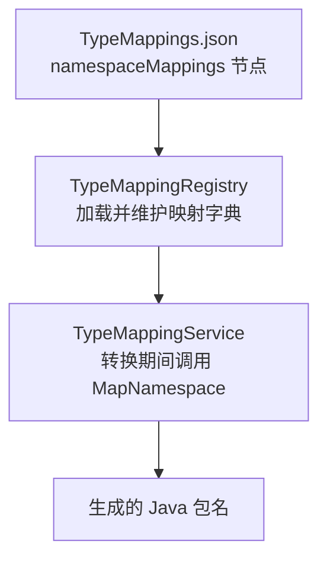
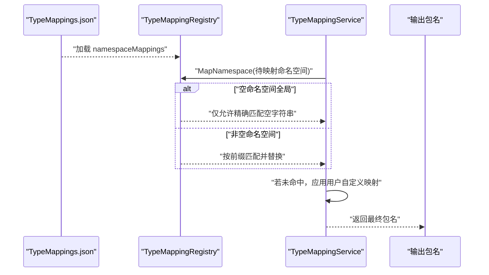

# 命名空间映射规则

<cite>
**本文引用的文件**
- [TypeMappingRegistry.cs](file://src/CSharpToJava.TypeMapping/TypeMappingRegistry.cs)
- [TypeMappingService.cs](file://src/CSharpToJava.Core/Context/TypeMappingService.cs)
- [TypeMappings.json](file://config/TypeMappings.json)
</cite>

## 目录
1. [简介](#简介)
2. [项目结构](#项目结构)
3. [核心组件](#核心组件)
4. [架构总览](#架构总览)
5. [详细组件分析](#详细组件分析)
6. [依赖关系分析](#依赖关系分析)
7. [性能考量](#性能考量)
8. [故障排查指南](#故障排查指南)
9. [结论](#结论)
10. [附录](#附录)

## 简介
本文件系统性阐述 cs2j 中“命名空间映射”规则与实现，重点覆盖以下方面：
- 命名空间映射的匹配策略：前缀匹配算法、空命名空间（全局命名空间）的精确匹配规则、以及字符串替换与路径处理机制
- 全局命名空间（空字符串）的特殊处理：Exact match only 规则与空命名空间优先处理
- 命名空间替换的实现细节：MapNamespace 方法的遍历匹配与替换流程
- 优先级规则：最长匹配原则与精确匹配优先策略
- 实际映射示例：如 System.Collections→java.util、Microsoft.AspNetCore→org.springframework 等常见场景
- 配置最佳实践：嵌套命名空间、通配符模式与特殊命名空间的处理建议
- 常见问题与排查：映射冲突、匹配失败等问题的定位与解决思路

## 项目结构
命名空间映射能力由两层协作实现：
- 配置层：在 TypeMappings.json 的 namespaceMappings 节点中定义映射规则
- 运行时层：TypeMappingRegistry 提供 MapNamespace 方法进行匹配与替换；TypeMappingService 在转换过程中调用 MapNamespace 并结合用户自定义映射进行二次替换



图表来源
- [TypeMappings.json:3254-3362](file://config/TypeMappings.json#L3254-L3362)
- [TypeMappingRegistry.cs:204-209](file://src/CSharpToJava.TypeMapping/TypeMappingRegistry.cs#L204-L209)
- [TypeMappingRegistry.cs:483-505](file://src/CSharpToJava.TypeMapping/TypeMappingRegistry.cs#L483-L505)
- [TypeMappingService.cs:100-118](file://src/CSharpToJava.Core/Context/TypeMappingService.cs#L100-L118)

章节来源
- [TypeMappings.json:3254-3362](file://config/TypeMappings.json#L3254-L3362)
- [TypeMappingRegistry.cs:204-209](file://src/CSharpToJava.TypeMapping/TypeMappingRegistry.cs#L204-L209)
- [TypeMappingRegistry.cs:483-505](file://src/CSharpToJava.TypeMapping/TypeMappingRegistry.cs#L483-L505)
- [TypeMappingService.cs:100-118](file://src/CSharpToJava.Core/Context/TypeMappingService.cs#L100-L118)

## 核心组件
- TypeMappingRegistry：负责加载配置、维护命名空间映射字典，并提供 MapNamespace 方法执行实际匹配与替换
- TypeMappingService：在转换流程中调用 MapNamespace，并支持用户通过 ConversionOptions 的 NamespaceMappings 进行额外替换
- TypeMappings.json：包含 namespaceMappings 配置项，定义 C# 命名空间到 Java 包的映射规则

章节来源
- [TypeMappingRegistry.cs:93-147](file://src/CSharpToJava.TypeMapping/TypeMappingRegistry.cs#L93-L147)
- [TypeMappingService.cs:11-53](file://src/CSharpToJava.Core/Context/TypeMappingService.cs#L11-L53)
- [TypeMappings.json:3254-3362](file://config/TypeMappings.json#L3254-L3362)

## 架构总览
下图展示了从配置到运行时匹配的整体流程：



图表来源
- [TypeMappings.json:3254-3362](file://config/TypeMappings.json#L3254-L3362)
- [TypeMappingRegistry.cs:483-505](file://src/CSharpToJava.TypeMapping/TypeMappingRegistry.cs#L483-L505)
- [TypeMappingService.cs:100-118](file://src/CSharpToJava.Core/Context/TypeMappingService.cs#L100-L118)

## 详细组件分析

### 命名空间映射数据模型与加载
- 数据模型：NamespaceMappingEntry 拥有 CSharpNamespace 与 JavaPackage 字段，分别表示 C# 命名空间模式与 Java 包目标
- 加载逻辑：TypeMappingRegistry 在 LoadMappings 中将每个 NamespaceMappingEntry 放入内部字典，键为 CSharpNamespace，值为 JavaPackage

章节来源
- [TypeMappingRegistry.cs:61-68](file://src/CSharpToJava.TypeMapping/TypeMappingRegistry.cs#L61-L68)
- [TypeMappingRegistry.cs:204-209](file://src/CSharpToJava.TypeMapping/TypeMappingRegistry.cs#L204-L209)

### MapNamespace 匹配策略与算法
- 全局命名空间（空字符串）处理：
  - 仅允许精确匹配（Exact match only），即当输入命名空间为空字符串时，只接受 CSharpNamespace 也为 "" 的条目
  - 若存在多个空字符串映射，按字典遍历顺序返回第一个命中的结果
- 非空命名空间处理：
  - 对每个映射条目，检查输入命名空间是否以 CSharpNamespace 作为前缀
  - 找到首个前缀匹配后，使用字符串替换将该前缀整体替换为 JavaPackage
  - 不进行多轮替换或递归替换，仅做一次替换
- 最长匹配原则：
  - 当存在多个前缀匹配时，按字典遍历顺序返回第一个匹配项
  - 因此，建议将更具体的前缀（更长的前缀）放在前面，以确保优先匹配

```mermaid
flowchart TD
Start(["开始 MapNamespace"]) --> CheckEmpty{"输入命名空间为空？"}
CheckEmpty --> |是| GlobalMatch["遍历映射字典，寻找 CSharpNamespace==\"\" 的条目"]
GlobalMatch --> FoundEmpty{"找到空映射？"}
FoundEmpty --> |是| ReturnEmpty["返回对应 JavaPackage"]
FoundEmpty --> |否| ReturnNull["返回 null"]
CheckEmpty --> |否| PrefixLoop["遍历映射字典，检查每个条目的 CSharpNamespace 是否为前缀"]
PrefixLoop --> MatchFound{"找到前缀匹配？"}
MatchFound --> |是| ReplaceOnce["将前缀替换为 JavaPackage仅一次替换"]
ReplaceOnce --> ReturnReplaced["返回替换后的包名"]
MatchFound --> |否| ReturnNull
```

图表来源
- [TypeMappingRegistry.cs:483-505](file://src/CSharpToJava.TypeMapping/TypeMappingRegistry.cs#L483-L505)

章节来源
- [TypeMappingRegistry.cs:483-505](file://src/CSharpToJava.TypeMapping/TypeMappingRegistry.cs#L483-L505)

### 路径处理与字符串替换机制
- 替换范围：仅对输入命名空间的前缀部分进行替换，不改变其余部分
- 分隔符处理：映射规则基于“.”分隔的命名空间/包层级，替换时保持层级结构
- 无匹配回退：若 MapNamespace 返回 null，则由调用方（TypeMappingService）决定后续处理策略

章节来源
- [TypeMappingRegistry.cs:496-502](file://src/CSharpToJava.TypeMapping/TypeMappingRegistry.cs#L496-L502)
- [TypeMappingService.cs:100-118](file://src/CSharpToJava.Core/Context/TypeMappingService.cs#L100-L118)

### 与用户自定义映射的协同
- TypeMappingService 在调用 MapNamespace 后，若仍未得到期望包名，会进一步检查 ConversionOptions 中的 NamespaceMappings
- 该机制允许在不修改 TypeMappings.json 的情况下，临时覆盖或补充映射规则

章节来源
- [TypeMappingService.cs:100-118](file://src/CSharpToJava.Core/Context/TypeMappingService.cs#L100-L118)

### 配置示例与优先级
- 示例一：System.* → java.lang.*
  - 在 namespaceMappings 中添加条目，使 System 开头的命名空间映射到 java.lang
- 示例二：System.Collections.* → java.util.*
  - 添加更具体前缀映射，确保更长前缀优先匹配
- 示例三：全局命名空间映射
  - 使用空字符串作为 CSharpNamespace，将空命名空间映射到特定包（如 Microsoft.Msagl）

章节来源
- [TypeMappings.json:3254-3362](file://config/TypeMappings.json#L3254-L3362)

## 依赖关系分析
- TypeMappingRegistry 依赖于 TypeMappings.json 的 namespaceMappings 配置
- TypeMappingService 依赖 TypeMappingRegistry 的 MapNamespace 结果，并在其基础上应用用户自定义映射
- 两者之间通过接口清晰分离：配置加载与匹配在 Registry，转换流程与上下文在 Service


图表来源
- [TypeMappings.json:3254-3362](file://config/TypeMappings.json#L3254-L3362)
- [TypeMappingRegistry.cs:483-505](file://src/CSharpToJava.TypeMapping/TypeMappingRegistry.cs#L483-L505)
- [TypeMappingService.cs:100-118](file://src/CSharpToJava.Core/Context/TypeMappingService.cs#L100-L118)

章节来源
- [TypeMappings.json:3254-3362](file://config/TypeMappings.json#L3254-L3362)
- [TypeMappingRegistry.cs:483-505](file://src/CSharpToJava.TypeMapping/TypeMappingRegistry.cs#L483-L505)
- [TypeMappingService.cs:100-118](file://src/CSharpToJava.Core/Context/TypeMappingService.cs#L100-L118)

## 性能考量
- MapNamespace 采用线性遍历字典的方式进行匹配，时间复杂度为 O(N)，N 为映射条目数
- 对于大量映射条目，可通过调整配置顺序（将更常见的前缀置于前面）提升命中概率，减少平均比较次数
- 全局命名空间匹配仅检查空键，开销极低

## 故障排查指南
- 匹配不到任何映射
  - 检查 namespaceMappings 中是否存在对应前缀
  - 确认输入命名空间与配置前缀大小写一致
  - 若需要全局命名空间映射，请确保配置中包含 CSharpNamespace 为 "" 的条目
- 匹配冲突或优先级不符合预期
  - 检查是否存在多个前缀匹配，确认更具体的前缀是否排在前面
  - 注意 MapNamespace 仅做一次替换，不会递归或多次替换
- 用户自定义映射未生效
  - 确认 TypeMappingService 的 NamespaceMappings 是否正确传入
  - 检查自定义映射的前缀是否与输入命名空间匹配

章节来源
- [TypeMappingRegistry.cs:483-505](file://src/CSharpToJava.TypeMapping/TypeMappingRegistry.cs#L483-L505)
- [TypeMappingService.cs:100-118](file://src/CSharpToJava.Core/Context/TypeMappingService.cs#L100-L118)

## 结论
cs2j 的命名空间映射以简洁明确的前缀匹配为核心，辅以全局命名空间的精确匹配与用户自定义映射的灵活补充。通过合理组织 namespaceMappings 的顺序与内容，可以稳定地实现从 C# 命名空间到 Java 包的高保真映射。

## 附录

### 常见映射示例
- System.Collections → java.util
- System.Linq → java.util.stream
- System.Threading.Tasks → java.util.concurrent
- System.Text → java.lang
- System.IO → java.io
- System.Net → java.net
- System.Time → java.time
- System.Collections.Concurrent → java.util.concurrent
- System.Reflection → java.lang.reflect
- System.Text.RegularExpressions → java.util.regex
- System.Numerics → java.math
- System.ComponentModel → javafx.beans
- System.Runtime.Serialization → java.io
- System.Security → java.security
- System.Globalization.CultureInfo → Locale（并配置 java.util.Locale 导入）
- System.Diagnostics → java.lang

章节来源
- [TypeMappings.json:3254-3362](file://config/TypeMappings.json#L3254-L3362)

### 配置最佳实践
- 嵌套命名空间处理
  - 为每个层级的父命名空间提供前缀映射，确保最长匹配优先
- 通配符模式
  - 由于实现为前缀匹配，不支持通配符；请使用尽可能具体的前缀
- 特殊命名空间
  - 全局命名空间（空字符串）仅允许精确匹配，建议用于默认包映射
- 优先级策略
  - 将更具体的前缀映射置于前面，以保证最长匹配优先

章节来源
- [TypeMappingRegistry.cs:483-505](file://src/CSharpToJava.TypeMapping/TypeMappingRegistry.cs#L483-L505)
- [TypeMappings.json:3254-3362](file://config/TypeMappings.json#L3254-L3362)