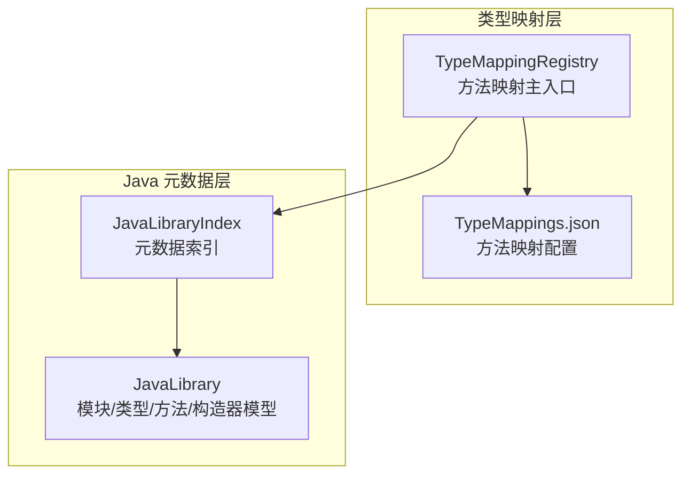
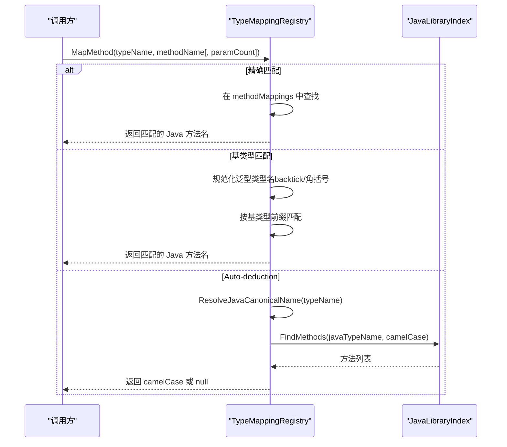
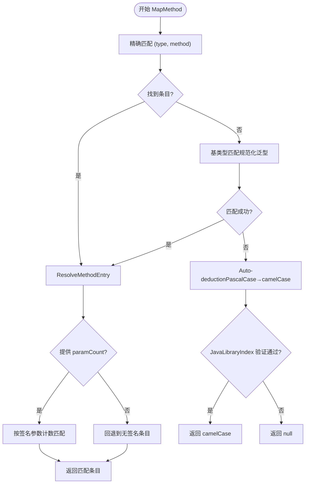
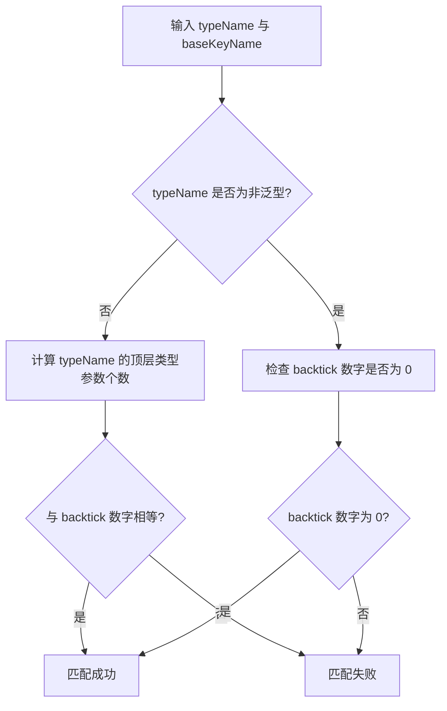
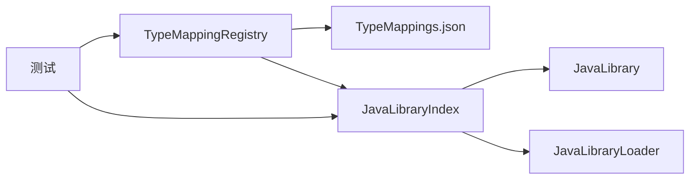

# 方法映射规则

<cite>
**本文引用的文件列表**
- [TypeMappingRegistry.cs](file://src/CSharpToJava.TypeMapping/TypeMappingRegistry.cs)
- [JavaLibraryIndex.cs](file://src/CSharpToJava.TypeMapping/JavaModel/JavaLibraryIndex.cs)
- [JavaLibrary.cs](file://src/CSharpToJava.TypeMapping/JavaModel/JavaLibrary.cs)
- [TypeMappings.json](file://config/TypeMappings.json)
- [MethodOverloadResolutionTests.cs](file://tests/CSharpToJava.Tests/MethodOverloadResolutionTests.cs)
- [JavaLibraryIndexTests.cs](file://tests/CSharpToJava.Tests/JavaLibraryIndexTests.cs)
</cite>

## 目录
1. [简介](#简介)
2. [项目结构](#项目结构)
3. [核心组件](#核心组件)
4. [架构总览](#架构总览)
5. [详细组件分析](#详细组件分析)
6. [依赖关系分析](#依赖关系分析)
7. [性能考量](#性能考量)
8. [故障排除指南](#故障排除指南)
9. [结论](#结论)
10. [附录](#附录)

## 简介
本文件系统性阐述 cs2j 中“方法映射规则”的实现与使用，重点覆盖：
- 方法映射的查找策略：精确匹配、基类型匹配、泛型类型规范化（Roslyn 角括号与 JSON 反引号差异）、回退机制
- 重载解析机制：基于参数数量感知的签名约束处理
- 方法名转换规则：PascalCase 到 camelCase 的自动转换与 Java 库索引验证
- 多重映射条目的处理逻辑：ResolveMethodEntry 的签名参数计数匹配与默认回退策略
- 泛型类型参数计数算法：CountTopLevelTypeArgs 的深度计数逻辑
- 实际映射场景示例：构造函数映射、静态方法映射、实例方法映射、重载方法处理
- 调试与故障排除：Auto-deduction 机制与 JavaLibraryIndex 的作用

## 项目结构
围绕方法映射的核心代码位于 TypeMapping 子项目，主要文件如下：
- TypeMappingRegistry：方法映射主入口，负责加载配置、解析重载、调用 Java 标准库索引进行自动推断与校验
- JavaLibraryIndex：Java 标准库元数据查询索引，支持按类型名查找、方法/构造器查询、继承链查询与可赋值性判断
- JavaLibrary：Java 元数据模型定义（类型、方法、构造器、参数等）
- TypeMappings.json：方法映射配置文件，包含大量常见 .NET 类型到 Java 类型的方法映射条目
- 测试：MethodOverloadResolutionTests 与 JavaLibraryIndexTests 提供行为验证与边界条件覆盖

图表来源
- [TypeMappingRegistry.cs:93-562](file://src/CSharpToJava.TypeMapping/TypeMappingRegistry.cs#L93-L562)
- [JavaLibraryIndex.cs:11-291](file://src/CSharpToJava.TypeMapping/JavaModel/JavaLibraryIndex.cs#L11-L291)
- [JavaLibrary.cs:50-168](file://src/CSharpToJava.TypeMapping/JavaModel/JavaLibrary.cs#L50-L168)

章节来源
- [TypeMappingRegistry.cs:93-562](file://src/CSharpToJava.TypeMapping/TypeMappingRegistry.cs#L93-L562)
- [JavaLibraryIndex.cs:11-291](file://src/CSharpToJava.TypeMapping/JavaModel/JavaLibraryIndex.cs#L11-L291)
- [JavaLibrary.cs:50-168](file://src/CSharpToJava.TypeMapping/JavaModel/JavaLibrary.cs#L50-L168)

## 核心组件
- TypeMappingRegistry
  - 负责加载与解析 TypeMappings.json 中的 methodMappings 条目
  - 提供 MapMethod(typeName, methodName[, paramCount])，支持参数数量感知的重载解析
  - 支持 Auto-deduction：当无显式配置时，尝试将 PascalCase 方法名转为 camelCase，并通过 JavaLibraryIndex 验证 Java 类型是否存在对应方法
  - 提供 ResolveMethodEntry：在多个条目中根据签名参数计数与回退策略选择最佳条目
  - 提供 CountTopLevelTypeArgs：计算泛型类型顶层参数个数，用于 backtick 与角括号格式差异的兼容
  - 提供 ResolveJavaCanonicalName：将 C# 类型名解析为 Java 标准库可用的规范名
- JavaLibraryIndex
  - 按模块懒加载 Java 标准库元数据，提供类型查找、方法/构造器查询、继承链遍历、可赋值性判断
  - 支持模块猜测与全模块加载策略，避免不必要的 IO
- JavaLibrary
  - 定义 JavaTypeInfo、JavaMethodInfo、JavaConstructorInfo、JavaParameterInfo 等模型，承载元数据结构

章节来源
- [TypeMappingRegistry.cs:247-345](file://src/CSharpToJava.TypeMapping/TypeMappingRegistry.cs#L247-L345)
- [TypeMappingRegistry.cs:352-380](file://src/CSharpToJava.TypeMapping/TypeMappingRegistry.cs#L352-L380)
- [TypeMappingRegistry.cs:522-534](file://src/CSharpToJava.TypeMapping/TypeMappingRegistry.cs#L522-L534)
- [JavaLibraryIndex.cs:50-146](file://src/CSharpToJava.TypeMapping/JavaModel/JavaLibraryIndex.cs#L50-L146)
- [JavaLibrary.cs:50-168](file://src/CSharpToJava.TypeMapping/JavaModel/JavaLibrary.cs#L50-L168)

## 架构总览
方法映射的调用流程如下：
- 输入：C# 类型名、方法名、可选参数数量
- 查找策略：
  - 精确匹配：直接在 methodMappings 中按 (type, method) 键查找
  - 基类型匹配：对泛型类型名（backtick 或角括号）进行规范化后匹配父类或接口
  - Auto-deduction：若无显式映射且 JavaLibraryIndex 可用，则尝试 PascalCase → camelCase 并在 Java 类型中验证方法存在性
- 重载解析：ResolveMethodEntry 优先按签名参数计数匹配，否则回退到无签名条目；若均不匹配则返回第一个条目
- 泛型计数：CountTopLevelTypeArgs 计算顶层类型参数个数，确保 backtick 与角括号格式一致

图表来源
- [TypeMappingRegistry.cs:258-345](file://src/CSharpToJava.TypeMapping/TypeMappingRegistry.cs#L258-L345)
- [JavaLibraryIndex.cs:75-84](file://src/CSharpToJava.TypeMapping/JavaModel/JavaLibraryIndex.cs#L75-L84)

## 详细组件分析

### 方法映射主流程与重载解析
- MapMethod(typeName, methodName[, paramCount])
  - 若存在多个条目，先按 paramCount 匹配 MethodMappingEntry.Signature
  - 若无 paramCount 或未命中，回退到首个无签名条目
  - 若所有条目均有签名但均不匹配，返回第一个条目
- Auto-deduction
  - 当无显式映射且 JavaLibraryIndex 可用时，将 PascalCase 方法名转为 camelCase，并在 Java 类型中查找同名方法
  - 仅在转换确实改变了大小写时才尝试验证
- 基类型匹配
  - 支持 Roslyn 的角括号格式与 JSON 配置的 backtick 格式差异
  - 对 backtick 后缀进行归一化，再与 typeName 的顶层泛型参数个数比对，防止误匹配

图表来源
- [TypeMappingRegistry.cs:258-380](file://src/CSharpToJava.TypeMapping/TypeMappingRegistry.cs#L258-L380)

章节来源
- [TypeMappingRegistry.cs:258-380](file://src/CSharpToJava.TypeMapping/TypeMappingRegistry.cs#L258-L380)
- [MethodOverloadResolutionTests.cs:34-94](file://tests/CSharpToJava.Tests/MethodOverloadResolutionTests.cs#L34-L94)

### 方法名转换规则与 Java 库索引验证
- PascalCase → camelCase
  - 使用 PascalToCamelCase 将首字母小写
  - 仅在转换确实改变大小写时才进行后续验证
- Java 库索引验证
  - 通过 JavaLibraryIndex.FindMethods 查询 Java 类型是否具有同名方法
  - 作为 Auto-deduction 的最终判定依据

章节来源
- [TypeMappingRegistry.cs:326-342](file://src/CSharpToJava.TypeMapping/TypeMappingRegistry.cs#L326-L342)
- [TypeMappingRegistry.cs:473-478](file://src/CSharpToJava.TypeMapping/TypeMappingRegistry.cs#L473-L478)
- [JavaLibraryIndex.cs:75-84](file://src/CSharpToJava.TypeMapping/JavaModel/JavaLibraryIndex.cs#L75-L84)

### 泛型类型规范化与参数计数算法
- 规范化策略
  - backtick 形式（如 System.Collections.Generic.HashSet`1）与角括号形式（如 System.Collections.Generic.HashSet<T>）互转
  - 对于非泛型 backtick（如 HashSet`0），要求 typeName 为非泛型
  - 对于泛型 backtick（如 HashSet`1），需计算 typeName 的顶层类型参数个数并与 backtick 数字一致
- 参数计数算法
  - CountTopLevelTypeArgs：从开角括号位置开始，以深度计数法统计顶层逗号分隔的类型参数个数
  - 例如：System.Tuple<int, int, double, double> 返回 4

图表来源
- [TypeMappingRegistry.cs:284-324](file://src/CSharpToJava.TypeMapping/TypeMappingRegistry.cs#L284-L324)
- [TypeMappingRegistry.cs:522-534](file://src/CSharpToJava.TypeMapping/TypeMappingRegistry.cs#L522-L534)

章节来源
- [TypeMappingRegistry.cs:284-324](file://src/CSharpToJava.TypeMapping/TypeMappingRegistry.cs#L284-L324)
- [TypeMappingRegistry.cs:522-534](file://src/CSharpToJava.TypeMapping/TypeMappingRegistry.cs#L522-L534)

### 多重映射条目的处理逻辑
- ResolveMethodEntry
  - 单条目：直接返回
  - 多条目：
    - 若提供 paramCount，优先匹配 MethodMappingEntry.Signature 与之相等的条目
    - 若未提供 paramCount 或未命中，回退到首个无签名条目
    - 若所有条目均有签名但均不匹配，返回第一个条目
- 行为验证
  - 单条目：无论 paramCount 如何，均返回该条目
  - 签名条目：仅在 paramCount 精确匹配时返回
  - 无签名条目：作为默认回退

章节来源
- [TypeMappingRegistry.cs:352-380](file://src/CSharpToJava.TypeMapping/TypeMappingRegistry.cs#L352-L380)
- [MethodOverloadResolutionTests.cs:11-94](file://tests/CSharpToJava.Tests/MethodOverloadResolutionTests.cs#L11-L94)

### JavaLibraryIndex 的查询能力
- FindType：按规范名查找类型
- FindMethods：按类型与方法名查找公共方法集合
- FindConstructors：按类型查找公共构造器集合
- GetSupertypes：按广度优先返回超类型链（不含自身）
- IsAssignableTo：判断可赋值性（自反 + 超类型链）
- GetModuleFor：返回类型所属模块名
- KnownModuleNames：已知模块名列表

章节来源
- [JavaLibraryIndex.cs:50-160](file://src/CSharpToJava.TypeMapping/JavaModel/JavaLibraryIndex.cs#L50-L160)
- [JavaLibraryIndexTests.cs:18-89](file://tests/CSharpToJava.Tests/JavaLibraryIndexTests.cs#L18-L89)

### JavaLibrary 数据模型
- JavaTypeInfo：类型信息（模块名、包名、二进制名、规范名、简单名、修饰符、父类、接口、声明的公共构造器与方法）
- JavaMethodInfo：方法信息（名称、修饰符、签名、返回类型、参数列表、异常、静态/抽象/默认/变长标记）
- JavaConstructorInfo：构造器信息（名称、修饰符、签名、参数列表、异常、变长标记）
- JavaParameterInfo：参数信息（名称、类型、泛型类型、隐式/合成标记）

章节来源
- [JavaLibrary.cs:50-168](file://src/CSharpToJava.TypeMapping/JavaModel/JavaLibrary.cs#L50-L168)

## 依赖关系分析
- TypeMappingRegistry 依赖：
  - TypeMappings.json：方法映射配置
  - JavaLibraryIndex：Java 标准库元数据查询
- JavaLibraryIndex 依赖：
  - JavaLibraryLoader：模块发现与加载
  - JavaLibrary：模块/类型/方法/构造器模型
- 测试依赖：
  - MethodOverloadResolutionTests：验证重载解析与回退策略
  - JavaLibraryIndexTests：验证 JavaLibraryIndex 的查询能力

图表来源
- [TypeMappingRegistry.cs:93-142](file://src/CSharpToJava.TypeMapping/TypeMappingRegistry.cs#L93-L142)
- [JavaLibraryIndex.cs:33-40](file://src/CSharpToJava.TypeMapping/JavaModel/JavaLibraryIndex.cs#L33-L40)
- [JavaLibrary.cs:137-168](file://src/CSharpToJava.TypeMapping/JavaModel/JavaLibrary.cs#L137-L168)

章节来源
- [TypeMappingRegistry.cs:93-142](file://src/CSharpToJava.TypeMapping/TypeMappingRegistry.cs#L93-L142)
- [JavaLibraryIndex.cs:33-40](file://src/CSharpToJava.TypeMapping/JavaModel/JavaLibraryIndex.cs#L33-L40)
- [JavaLibrary.cs:137-168](file://src/CSharpToJava.TypeMapping/JavaModel/JavaLibrary.cs#L137-L168)

## 性能考量
- 懒加载与缓存
  - JavaLibraryIndex 按模块懒加载，首次请求某模块类型时才加载该模块，后续使用内存字典缓存，O(1) 查找
  - 模块猜测与全模块加载策略减少不必要的 IO
- 字典查找
  - TypeMappingRegistry 内部使用字典存储 methodMappings，键为 (typeName, methodName)，查找时间复杂度近似 O(1)
- 算法复杂度
  - CountTopLevelTypeArgs：线性扫描，时间复杂度 O(n)
  - ResolveMethodEntry：最多遍历条目列表一次，时间复杂度 O(k)
- I/O 优化
  - 模块级缓存与双检锁避免重复加载

章节来源
- [JavaLibraryIndex.cs:230-289](file://src/CSharpToJava.TypeMapping/JavaModel/JavaLibraryIndex.cs#L230-L289)
- [TypeMappingRegistry.cs:522-534](file://src/CSharpToJava.TypeMapping/TypeMappingRegistry.cs#L522-L534)

## 故障排除指南
- 问题：Auto-deduction 未生效
  - 检查是否已注入 JavaLibraryIndex（SetJavaLibraryIndex）
  - 确认 PascalCase → camelCase 转换确实改变了大小写
  - 验证 JavaLibraryIndex.FindMethods 返回非空
- 问题：重载解析未按预期返回
  - 确认 MethodMappingEntry.Signature 是否为纯数字字符串
  - 确认 MapMethod 调用时传入了正确的 paramCount
  - 若所有条目均有签名但不匹配，将回退到第一个条目
- 问题：泛型类型匹配失败
  - 检查 typeName 与配置项的 backtick/角括号格式是否一致
  - 使用 CountTopLevelTypeArgs 校验顶层参数个数是否匹配
- 问题：基类型匹配未覆盖
  - 确认 typeName 的前缀与配置项的 typeName 是否满足“精确或命名空间前缀”匹配
  - 非泛型 backtick 仅在 expectedArity==0 时匹配

章节来源
- [TypeMappingRegistry.cs:326-342](file://src/CSharpToJava.TypeMapping/TypeMappingRegistry.cs#L326-L342)
- [TypeMappingRegistry.cs:352-380](file://src/CSharpToJava.TypeMapping/TypeMappingRegistry.cs#L352-L380)
- [TypeMappingRegistry.cs:284-324](file://src/CSharpToJava.TypeMapping/TypeMappingRegistry.cs#L284-L324)
- [TypeMappingRegistry.cs:522-534](file://src/CSharpToJava.TypeMapping/TypeMappingRegistry.cs#L522-L534)

## 结论
cs2j 的方法映射规则通过“精确匹配 + 基类型匹配 + Auto-deduction”的组合策略，结合参数数量感知的重载解析与泛型类型规范化算法，实现了对 .NET 到 Java 方法映射的高鲁棒性与可维护性。配合 JavaLibraryIndex 的元数据验证，能够在缺乏显式配置时自动推断合理的方法名，显著降低配置成本并提升转换质量。

## 附录

### 常见映射场景示例
- 构造函数映射
  - 示例：System.String 的多种构造器映射到 Java 的构造器签名
  - 参考：[String.json:11-200](file://config/java/java.base/java/lang/String.json#L11-L200)
- 静态方法映射
  - 示例：System.String.Equals → Java 的 equals
  - 参考：[TypeMappings.json:1963-1966](file://config/TypeMappings.json#L1963-L1966)
- 实例方法映射
  - 示例：System.String.Substring → Java 的 substring
  - 参考：[TypeMappings.json:1967-1971](file://config/TypeMappings.json#L1967-L1971)
- 重载方法处理
  - 示例：System.Action`N 与 System.Func`N 的 Invoke 映射到 Java 函数式接口的不同方法名
  - 参考：[TypeMappings.json:1778-1841](file://config/TypeMappings.json#L1778-L1841)
- Auto-deduction 场景
  - 示例：当无显式映射时，将 PascalCase 方法名转为 camelCase 并在 Java 类型中验证
  - 参考：[TypeMappingRegistry.cs:326-342](file://src/CSharpToJava.TypeMapping/TypeMappingRegistry.cs#L326-L342)

章节来源
- [TypeMappings.json:1775-1974](file://config/TypeMappings.json#L1775-L1974)
- [String.json:11-200](file://config/java/java.base/java/lang/String.json#L11-L200)
- [TypeMappingRegistry.cs:326-342](file://src/CSharpToJava.TypeMapping/TypeMappingRegistry.cs#L326-L342)