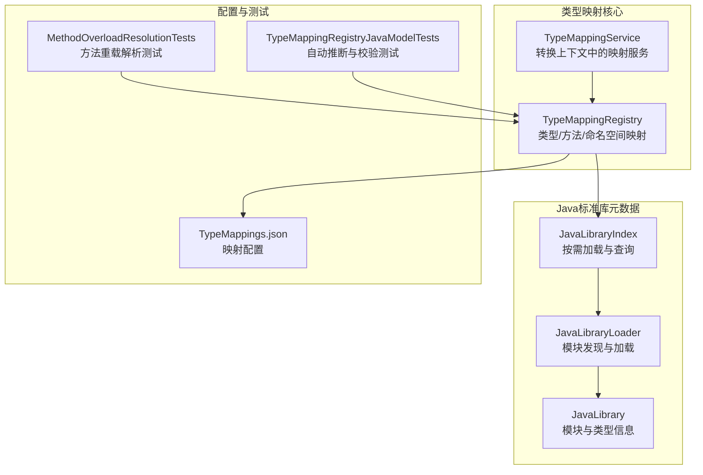
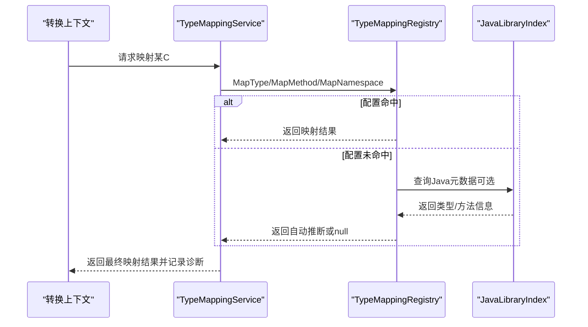
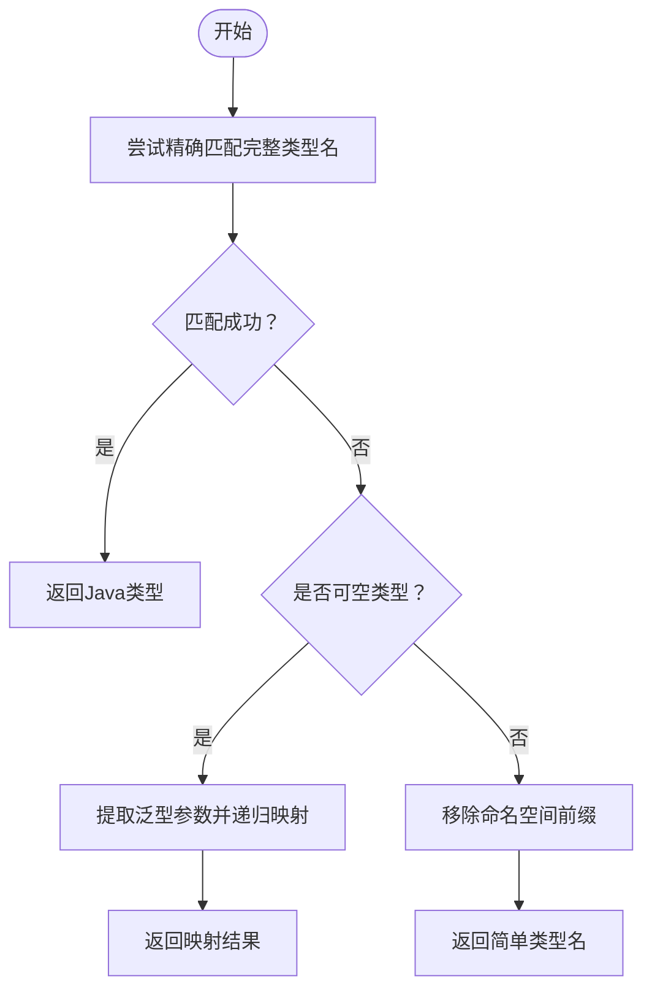
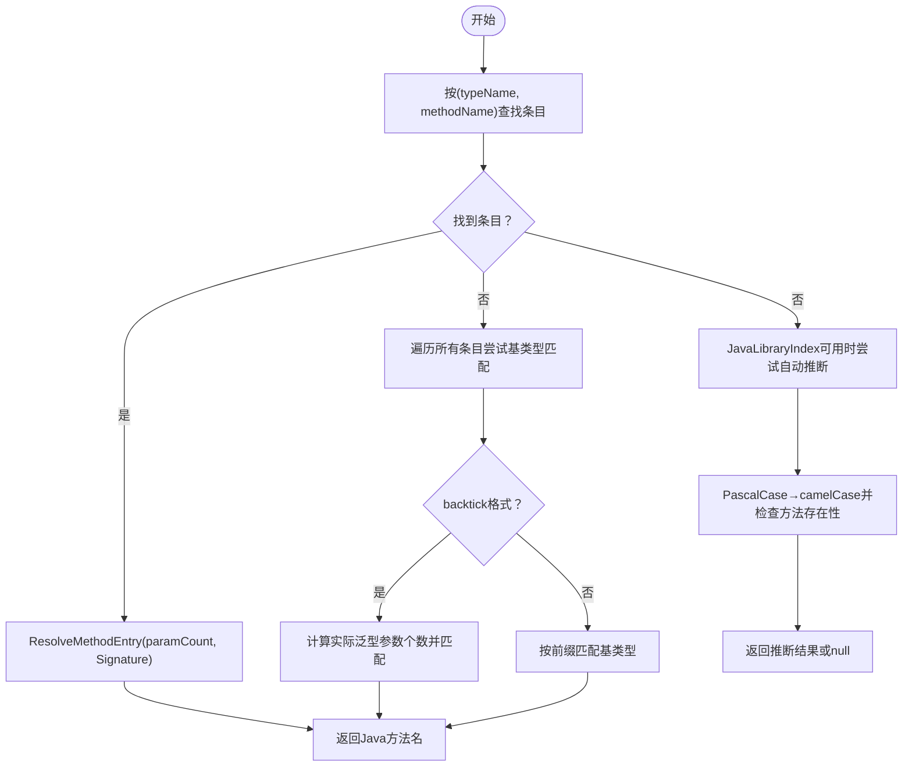
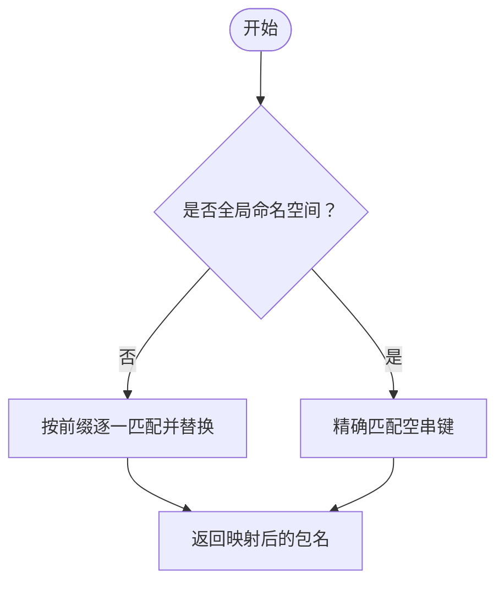
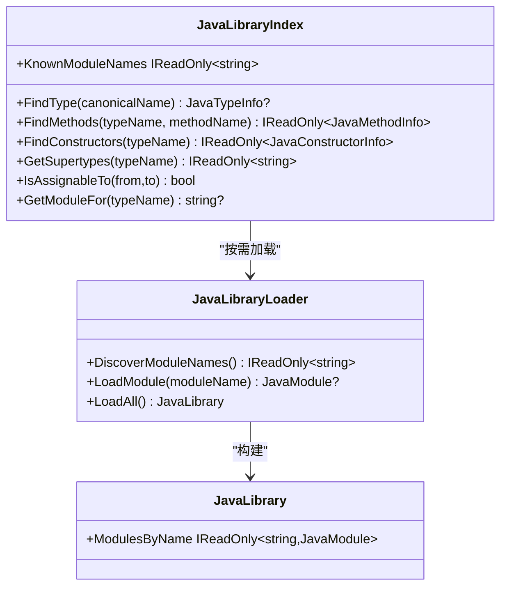
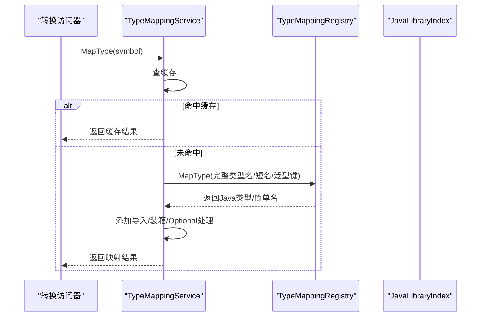
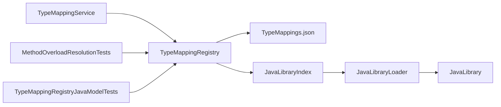

# 映射规则详解

<cite>
**本文引用的文件**
- [TypeMappingRegistry.cs](file://src/CSharpToJava.TypeMapping/TypeMappingRegistry.cs)
- [TypeMappingService.cs](file://src/CSharpToJava.Core/Context/TypeMappingService.cs)
- [TypeMappings.json](file://config/TypeMappings.json)
- [JavaLibraryIndex.cs](file://src/CSharpToJava.TypeMapping/JavaModel/JavaLibraryIndex.cs)
- [JavaLibrary.cs](file://src/CSharpToJava.TypeMapping/JavaModel/JavaLibrary.cs)
- [JavaLibraryLoader.cs](file://src/CSharpToJava.TypeMapping/JavaModel/JavaLibraryLoader.cs)
- [TypeMappingRegistryJavaModelTests.cs](file://tests/CSharpToJava.Tests/TypeMappingRegistryJavaModelTests.cs)
- [MethodOverloadResolutionTests.cs](file://tests/CSharpToJava.Tests/MethodOverloadResolutionTests.cs)
- [MethodTransformer.cs](file://src/CSharpToJava.Core/Transformers/Member/MethodTransformer.cs)
</cite>

## 目录
1. [简介](#简介)
2. [项目结构](#项目结构)
3. [核心组件](#核心组件)
4. [架构总览](#架构总览)
5. [详细组件分析](#详细组件分析)
6. [依赖关系分析](#依赖关系分析)
7. [性能考量](#性能考量)
8. [故障排查指南](#故障排查指南)
9. [结论](#结论)
10. [附录](#附录)

## 简介
本文件面向cs2j类型映射规则系统，系统性阐述类型映射与方法映射的算法与实现，包括：
- 精确匹配、可空类型处理、泛型类型处理、命名空间移除等策略
- 方法映射的重载解析、参数数量感知、签名匹配与基类型继承处理
- 命名空间映射规则：通配符匹配、前缀替换、全局命名空间处理
- 映射优先级与覆盖机制：配置优先级、泛型匹配规则、回退策略
- 各类映射场景示例：基础类型、集合类型、委托类型等
- 调试技巧与性能优化建议

## 项目结构
cs2j由多个子项目组成，类型映射相关的核心位于以下模块：
- TypeMappingRegistry：负责加载与执行映射规则（类型、方法、命名空间）
- TypeMappingService：在转换流程中调用TypeMappingRegistry，提供缓存与诊断
- JavaLibraryIndex/Loader：按需加载Java标准库元数据，支持自动推断与校验
- 配置文件TypeMappings.json：定义类型、方法、命名空间映射规则
- 测试用例：验证方法重载解析、自动推断、校验逻辑等

图表来源
- [TypeMappingRegistry.cs:93-562](file://src/CSharpToJava.TypeMapping/TypeMappingRegistry.cs#L93-L562)
- [TypeMappingService.cs:11-677](file://src/CSharpToJava.Core/Context/TypeMappingService.cs#L11-L677)
- [JavaLibraryIndex.cs:11-291](file://src/CSharpToJava.TypeMapping/JavaModel/JavaLibraryIndex.cs#L11-L291)
- [JavaLibraryLoader.cs:16-111](file://src/CSharpToJava.TypeMapping/JavaModel/JavaLibraryLoader.cs#L16-L111)
- [TypeMappings.json:1-800](file://config/TypeMappings.json#L1-L800)

章节来源
- [TypeMappingRegistry.cs:93-562](file://src/CSharpToJava.TypeMapping/TypeMappingRegistry.cs#L93-L562)
- [TypeMappingService.cs:11-677](file://src/CSharpToJava.Core/Context/TypeMappingService.cs#L11-L677)
- [JavaLibraryIndex.cs:11-291](file://src/CSharpToJava.TypeMapping/JavaModel/JavaLibraryIndex.cs#L11-L291)
- [JavaLibraryLoader.cs:16-111](file://src/CSharpToJava.TypeMapping/JavaModel/JavaLibraryLoader.cs#L16-L111)
- [TypeMappings.json:1-800](file://config/TypeMappings.json#L1-L800)

## 核心组件
- TypeMappingRegistry：集中式映射注册表，支持从JSON配置加载类型映射、方法映射与命名空间映射；提供类型映射、方法映射、命名空间映射、导入收集、Java元数据校验与自动推断等功能。
- TypeMappingService：在转换过程中使用TypeMappingRegistry进行类型与命名空间映射，维护每文件类型符号到Java类型的缓存，处理可空类型、数组、泛型、匿名类型、嵌套类型等复杂情况，并提供Java API有效性诊断。
- JavaLibraryIndex/Loader：按需加载Java标准库元数据，支持类型查找、方法查找、继承链查询、模块发现与懒加载，用于方法名自动推断与映射有效性校验。
- TypeMappings.json：映射配置文件，定义C#类型到Java类型的映射、方法名映射以及命名空间映射规则。

章节来源
- [TypeMappingRegistry.cs:93-562](file://src/CSharpToJava.TypeMapping/TypeMappingRegistry.cs#L93-L562)
- [TypeMappingService.cs:11-677](file://src/CSharpToJava.Core/Context/TypeMappingService.cs#L11-L677)
- [JavaLibraryIndex.cs:11-291](file://src/CSharpToJava.TypeMapping/JavaModel/JavaLibraryIndex.cs#L11-L291)
- [JavaLibraryLoader.cs:16-111](file://src/CSharpToJava.TypeMapping/JavaModel/JavaLibraryLoader.cs#L16-L111)
- [TypeMappings.json:1-800](file://config/TypeMappings.json#L1-L800)

## 架构总览
类型映射系统采用“配置驱动 + 元数据辅助”的双层策略：
- 配置层：TypeMappings.json提供精确映射与回退策略
- 元数据层：JavaLibraryIndex提供Java标准库的类型与方法信息，用于自动推断与校验

图表来源
- [TypeMappingService.cs:71-455](file://src/CSharpToJava.Core/Context/TypeMappingService.cs#L71-L455)
- [TypeMappingRegistry.cs:214-345](file://src/CSharpToJava.TypeMapping/TypeMappingRegistry.cs#L214-L345)
- [JavaLibraryIndex.cs:50-84](file://src/CSharpToJava.TypeMapping/JavaModel/JavaLibraryIndex.cs#L50-L84)

## 详细组件分析

### 类型映射算法
- 精确匹配：优先使用完整类型名（含命名空间与泛型后缀）进行查找
- 可空类型处理：识别System.Nullable<T>或System.Nullable`1<T>，递归映射内部类型
- 泛型类型处理：构造backtick格式键值（如List`1），与配置中的泛型键匹配；同时支持角度括号格式的泛型类型名
- 命名空间移除：若无配置命中，则移除命名空间前缀，仅保留简单类型名
- 导入收集：根据配置项的Imports字段收集必要的Java导入

图表来源
- [TypeMappingRegistry.cs:214-232](file://src/CSharpToJava.TypeMapping/TypeMappingRegistry.cs#L214-L232)
- [TypeMappingRegistry.cs:507-516](file://src/CSharpToJava.TypeMapping/TypeMappingRegistry.cs#L507-L516)

章节来源
- [TypeMappingRegistry.cs:214-232](file://src/CSharpToJava.TypeMapping/TypeMappingRegistry.cs#L214-L232)
- [TypeMappingRegistry.cs:507-516](file://src/CSharpToJava.TypeMapping/TypeMappingRegistry.cs#L507-L516)

### 方法映射与重载解析
- 单一入口：MapMethod(typeName, methodName[, paramCount])
- 重载解析策略：
  - 若存在多条同类型同方法名的映射，优先使用paramCount与MethodMappingEntry.Signature进行精确匹配
  - 若paramCount未指定或不匹配，回退到无签名约束的条目
  - 若所有条目均有签名且均不匹配，回退到第一条条目
- 基类型继承处理：当直接键不匹配时，尝试遍历所有方法映射条目，基于typeName前缀匹配基类型；对backtick格式（如HashSet`1）与角度括号格式（HashSet<T>）进行兼容处理，并通过计数尖括号内顶级逗号数来验证实际泛型参数个数
- 自动推断：当JavaLibraryIndex可用时，尝试将PascalCase方法名转为camelCase，并检查Java类型是否存在该方法

图表来源
- [TypeMappingRegistry.cs:250-345](file://src/CSharpToJava.TypeMapping/TypeMappingRegistry.cs#L250-L345)
- [TypeMappingRegistry.cs:352-380](file://src/CSharpToJava.TypeMapping/TypeMappingRegistry.cs#L352-L380)
- [TypeMappingRegistry.cs:270-324](file://src/CSharpToJava.TypeMapping/TypeMappingRegistry.cs#L270-L324)

章节来源
- [TypeMappingRegistry.cs:250-345](file://src/CSharpToJava.TypeMapping/TypeMappingRegistry.cs#L250-L345)
- [TypeMappingRegistry.cs:352-380](file://src/CSharpToJava.TypeMapping/TypeMappingRegistry.cs#L352-L380)
- [TypeMappingRegistry.cs:270-324](file://src/CSharpToJava.TypeMapping/TypeMappingRegistry.cs#L270-L324)

### 命名空间映射规则
- 全局命名空间：空字符串匹配，精确匹配优先
- 前缀匹配：对非空命名空间，按配置中的前缀逐一尝试，匹配到即替换
- 与转换选项的叠加：若配置未命中，再尝试转换选项中的NamespaceMappings

图表来源
- [TypeMappingRegistry.cs:483-505](file://src/CSharpToJava.TypeMapping/TypeMappingRegistry.cs#L483-L505)
- [TypeMappingService.cs:100-118](file://src/CSharpToJava.Core/Context/TypeMappingService.cs#L100-L118)

章节来源
- [TypeMappingRegistry.cs:483-505](file://src/CSharpToJava.TypeMapping/TypeMappingRegistry.cs#L483-L505)
- [TypeMappingService.cs:100-118](file://src/CSharpToJava.Core/Context/TypeMappingService.cs#L100-L118)

### Java元数据索引与自动推断
- JavaLibraryIndex按模块懒加载，首次查询某类型时才加载对应模块
- 提供FindType/FindMethods/GetSupertypes/IsAssignableTo等查询能力
- TypeMappingRegistry在无显式配置时，利用PascalCase→camelCase自动推断方法名，并通过FindMethods校验

图表来源
- [JavaLibraryIndex.cs:11-291](file://src/CSharpToJava.TypeMapping/JavaModel/JavaLibraryIndex.cs#L11-L291)
- [JavaLibraryLoader.cs:16-111](file://src/CSharpToJava.TypeMapping/JavaModel/JavaLibraryLoader.cs#L16-L111)
- [JavaLibrary.cs:157-168](file://src/CSharpToJava.TypeMapping/JavaModel/JavaLibrary.cs#L157-L168)

章节来源
- [JavaLibraryIndex.cs:11-291](file://src/CSharpToJava.TypeMapping/JavaModel/JavaLibraryIndex.cs#L11-L291)
- [JavaLibraryLoader.cs:16-111](file://src/CSharpToJava.TypeMapping/JavaModel/JavaLibraryLoader.cs#L16-L111)
- [JavaLibrary.cs:157-168](file://src/CSharpToJava.TypeMapping/JavaModel/JavaLibrary.cs#L157-L168)

### 类型映射服务在转换中的应用
- 缓存：每文件级别缓存ITypeSymbol到Java类型的映射，避免重复计算
- 可空类型：根据UseOptionalForNullable选项决定使用Optional或装箱包装
- 数组与泛型：处理数组维度与泛型实参，必要时添加导入
- 匿名类型：通过字段签名合成记录类型名称
- 嵌套类型：处理Dictionary.KeyCollection等嵌套集合类型映射
- Java API校验：通过TypeMappingRegistry.ValidateTypeExists/ValidateMethodExists进行诊断

图表来源
- [TypeMappingService.cs:71-455](file://src/CSharpToJava.Core/Context/TypeMappingService.cs#L71-L455)
- [TypeMappingRegistry.cs:214-232](file://src/CSharpToJava.TypeMapping/TypeMappingRegistry.cs#L214-L232)

章节来源
- [TypeMappingService.cs:71-455](file://src/CSharpToJava.Core/Context/TypeMappingService.cs#L71-L455)
- [TypeMappingRegistry.cs:214-232](file://src/CSharpToJava.TypeMapping/TypeMappingRegistry.cs#L214-L232)

## 依赖关系分析
- TypeMappingRegistry依赖TypeMappings.json配置与JavaLibraryIndex（可选）
- TypeMappingService依赖TypeMappingRegistry，并在转换阶段提供缓存与诊断
- JavaLibraryIndex依赖JavaLibraryLoader与JavaLibrary模型对象
- 测试用例验证方法重载解析、自动推断与校验逻辑

图表来源
- [TypeMappingRegistry.cs:93-562](file://src/CSharpToJava.TypeMapping/TypeMappingRegistry.cs#L93-L562)
- [TypeMappingService.cs:11-677](file://src/CSharpToJava.Core/Context/TypeMappingService.cs#L11-L677)
- [JavaLibraryIndex.cs:11-291](file://src/CSharpToJava.TypeMapping/JavaModel/JavaLibraryIndex.cs#L11-L291)
- [JavaLibraryLoader.cs:16-111](file://src/CSharpToJava.TypeMapping/JavaModel/JavaLibraryLoader.cs#L16-L111)
- [TypeMappings.json:1-800](file://config/TypeMappings.json#L1-L800)

章节来源
- [TypeMappingRegistry.cs:93-562](file://src/CSharpToJava.TypeMapping/TypeMappingRegistry.cs#L93-L562)
- [TypeMappingService.cs:11-677](file://src/CSharpToJava.Core/Context/TypeMappingService.cs#L11-L677)
- [JavaLibraryIndex.cs:11-291](file://src/CSharpToJava.TypeMapping/JavaModel/JavaLibraryIndex.cs#L11-L291)
- [JavaLibraryLoader.cs:16-111](file://src/CSharpToJava.TypeMapping/JavaModel/JavaLibraryLoader.cs#L16-L111)
- [TypeMappings.json:1-800](file://config/TypeMappings.json#L1-L800)

## 性能考量
- 懒加载与模块化：JavaLibraryIndex按模块懒加载，避免一次性加载全部元数据
- 字典查找：TypeMappingRegistry内部使用字典存储映射，查找为O(1)
- 缓存：TypeMappingService为每个文件维护类型符号到Java类型的缓存，减少重复映射开销
- 参数数量感知：MapMethod在重载解析时优先使用paramCount与Signature，避免全量扫描
- 导入去重：TypeMappingService对导入类型进行去重，避免重复import

[本节为通用指导，无需特定文件引用]

## 故障排查指南
- 配置文件缺失或格式错误：TypeMappingRegistry在构造时会抛出TypeMappingConfigurationException，包含配置路径信息
- 方法自动推断失败：当JavaLibraryIndex不可用或Java类型不存在对应方法时，MapMethod返回null；可通过ValidateMethodExists进行诊断
- 类型映射不一致：TypeMappingService提供ValidateMappedJavaType/ValidateMappedJavaMethod进行Java API有效性校验
- 测试验证：参考MethodOverloadResolutionTests与TypeMappingRegistryJavaModelTests，验证重载解析与自动推断行为

章节来源
- [TypeMappingRegistry.cs:130-182](file://src/CSharpToJava.TypeMapping/TypeMappingRegistry.cs#L130-L182)
- [TypeMappingService.cs:627-667](file://src/CSharpToJava.Core/Context/TypeMappingService.cs#L627-L667)
- [TypeMappingRegistryJavaModelTests.cs:11-232](file://tests/CSharpToJava.Tests/TypeMappingRegistryJavaModelTests.cs#L11-L232)
- [MethodOverloadResolutionTests.cs:1-146](file://tests/CSharpToJava.Tests/MethodOverloadResolutionTests.cs#L1-L146)

## 结论
cs2j类型映射系统通过“配置优先 + 元数据辅助”的设计，在保证高可配置性的同时提供了强大的自动推断与校验能力。其核心算法围绕精确匹配、可空类型处理、泛型键值匹配与命名空间移除展开，并在方法映射层面引入参数数量感知与基类型继承兼容，确保复杂场景下的稳定与正确。配合缓存与懒加载机制，系统在性能上具备良好表现。

[本节为总结性内容，无需特定文件引用]

## 附录

### 常见映射场景示例
- 基础类型映射：System.String → String，System.Int32 → int
- 集合类型映射：List<T> → ArrayList（导入java.util.ArrayList），Dictionary<TKey,TValue> → LinkedHashMap（导入java.util.LinkedHashMap）
- 委托类型映射：System.Func<T> → 对应Java函数式接口（根据配置决定）
- 可空类型映射：System.Nullable<T> → Optional<T>（启用UseOptionalForNullable）或装箱类型
- 泛型类型映射：HashSet<T> → HashSet（导入java.util.HashSet），注意backtick键值与角度括号格式的兼容
- 命名空间映射：System.Collections.Generic → java.util（通过配置或转换选项）

章节来源
- [TypeMappings.json:109-766](file://config/TypeMappings.json#L109-L766)
- [TypeMappingService.cs:188-213](file://src/CSharpToJava.Core/Context/TypeMappingService.cs#L188-L213)
- [TypeMappingRegistry.cs:214-232](file://src/CSharpToJava.TypeMapping/TypeMappingRegistry.cs#L214-L232)

### 方法映射与重载解析示例
- 精确匹配：System.String.Contains → contains
- 参数数量感知：同一类型上的不同签名方法，通过Signature字段区分（如"1"、"2"）
- 回退策略：无签名条目作为默认回退
- 自动推断：HashMap.containsKey → containsKey（基于JavaLibraryIndex）

章节来源
- [MethodOverloadResolutionTests.cs:34-94](file://tests/CSharpToJava.Tests/MethodOverloadResolutionTests.cs#L34-L94)
- [TypeMappingRegistryJavaModelTests.cs:88-132](file://tests/CSharpToJava.Tests/TypeMappingRegistryJavaModelTests.cs#L88-L132)
- [TypeMappingRegistry.cs:250-345](file://src/CSharpToJava.TypeMapping/TypeMappingRegistry.cs#L250-L345)

### 调试技巧
- 启用JavaLibraryIndex：在TypeMappingRegistry注入JavaLibraryIndex，以便自动推断与校验
- 使用ValidateTypeExists/ValidateMethodExists：在转换前后对关键类型与方法进行校验
- 查看诊断信息：TypeMappingService在映射失败或跨命名空间冲突时发出警告
- 分步验证：先验证类型映射，再验证方法映射，最后验证导入

章节来源
- [TypeMappingRegistry.cs:387-401](file://src/CSharpToJava.TypeMapping/TypeMappingRegistry.cs#L387-L401)
- [TypeMappingService.cs:627-667](file://src/CSharpToJava.Core/Context/TypeMappingService.cs#L627-L667)