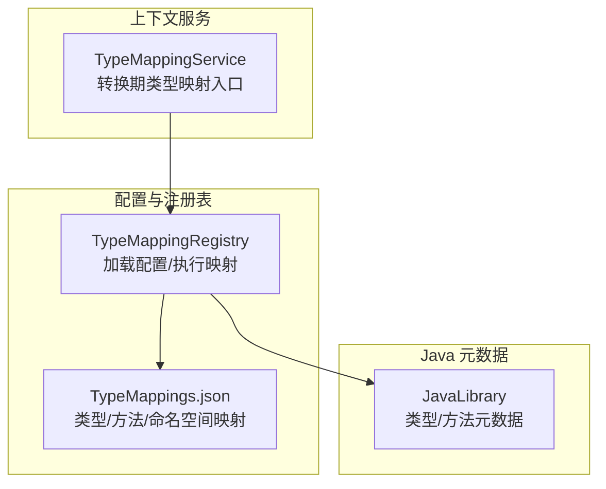
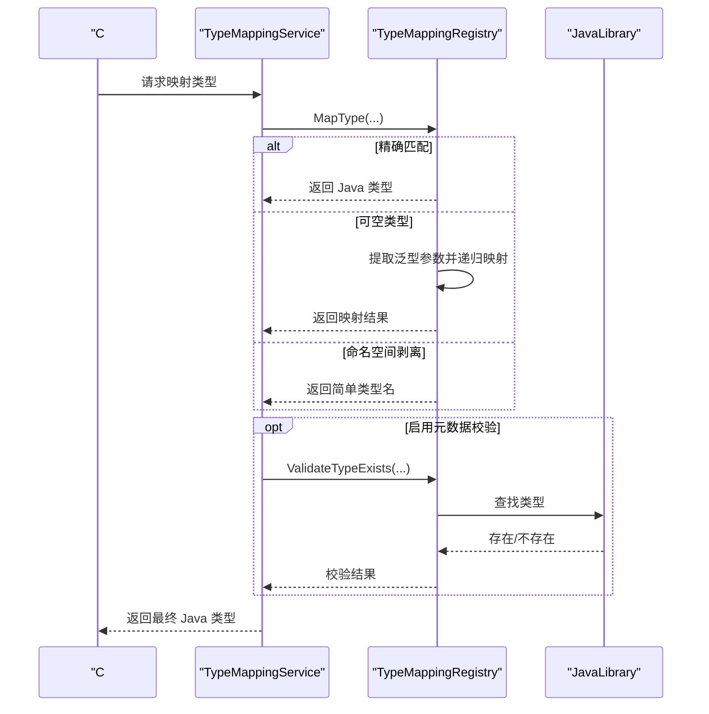
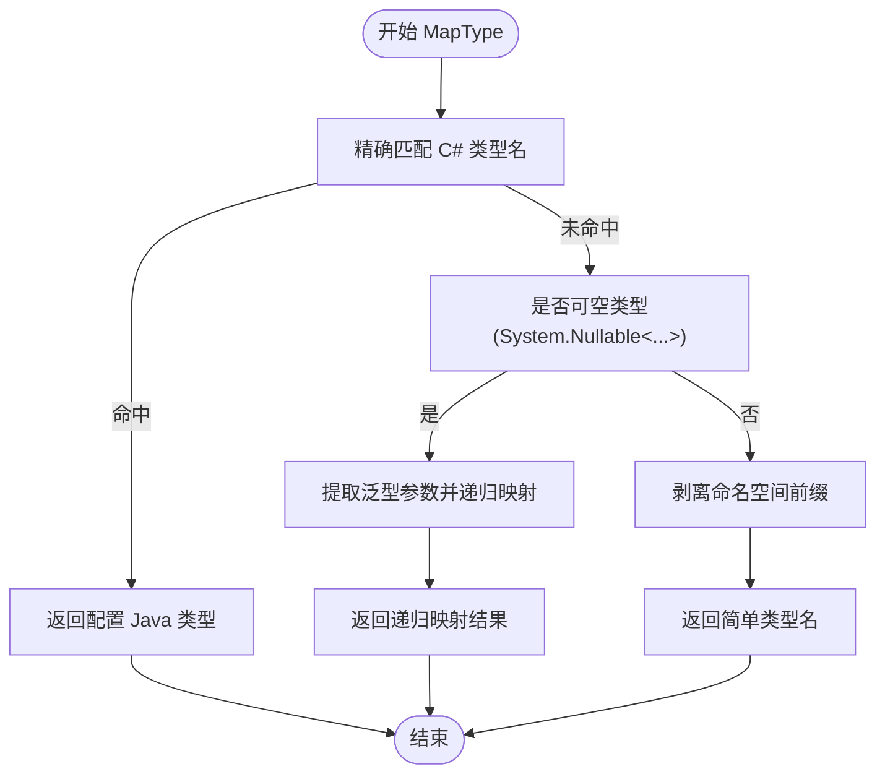
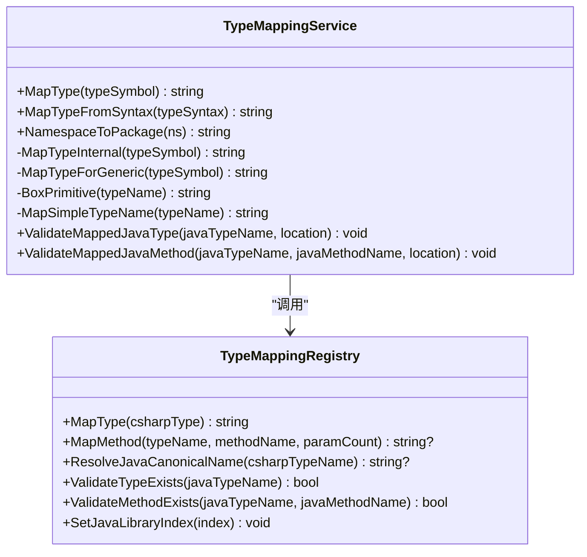
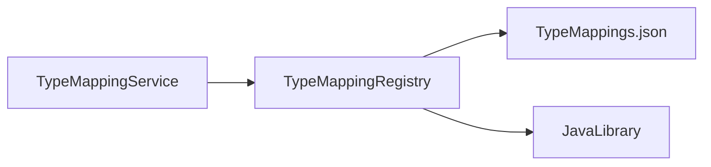

# 类型映射规则

<cite>
**本文引用的文件**
- [TypeMappingRegistry.cs](file://src/CSharpToJava.TypeMapping/TypeMappingRegistry.cs)
- [TypeMappingService.cs](file://src/CSharpToJava.Core/Context/TypeMappingService.cs)
- [TypeMappings.json](file://config/TypeMappings.json)
- [JavaLibrary.cs](file://src/CSharpToJava.TypeMapping/JavaModel/JavaLibrary.cs)
- [TypeMappingRegistryJavaModelTests.cs](file://tests/CSharpToJava.Tests/TypeMappingRegistryJavaModelTests.cs)
- [DelegateTransformerTests.cs](file://tests/CSharpToJava.Tests/DelegateTransformerTests.cs)
- [RecordTransformerTests.cs](file://tests/CSharpToJava.Tests/RecordTransformerTests.cs)
</cite>

## 目录
1. [简介](#简介)
2. [项目结构](#项目结构)
3. [核心组件](#核心组件)
4. [架构总览](#架构总览)
5. [详细组件分析](#详细组件分析)
6. [依赖关系分析](#依赖关系分析)
7. [性能考量](#性能考量)
8. [故障排查指南](#故障排查指南)
9. [结论](#结论)
10. [附录](#附录)

## 简介
本文件系统性阐述 cs2j 类型映射规则与实现，聚焦于以下目标：
- 深入解析类型映射的核心算法：精确匹配、可空类型处理、命名空间剥离与回退策略
- 详述映射优先级与回退机制：配置文件直配、泛型类型参数映射、最后的简单类型名回退
- 文档化特殊类型处理：数组、委托、记录等的映射策略
- 提供丰富映射示例：基础类型、集合、字典等
- 解释映射失败的常见原因与解决方案

## 项目结构
类型映射相关代码主要分布在如下模块：
- 配置与注册表：TypeMappingRegistry 负责加载与执行映射规则
- 上下文服务：TypeMappingService 在转换流程中调用注册表并处理复杂类型（数组、泛型、可空、委托、记录等）
- 标准库元数据：JavaLibrary 提供 Java 标准库类型/方法信息，用于自动推断与验证
- 配置文件：TypeMappings.json 定义 C# 到 Java 的类型映射、方法映射与命名空间映射

图表来源
- [TypeMappingRegistry.cs:130-147](file://src/CSharpToJava.TypeMapping/TypeMappingRegistry.cs#L130-L147)
- [TypeMappingService.cs:71-79](file://src/CSharpToJava.Core/Context/TypeMappingService.cs#L71-L79)
- [JavaLibrary.cs:157-167](file://src/CSharpToJava.TypeMapping/JavaModel/JavaLibrary.cs#L157-L167)

章节来源
- [TypeMappingRegistry.cs:130-147](file://src/CSharpToJava.TypeMapping/TypeMappingRegistry.cs#L130-L147)
- [TypeMappingService.cs:71-79](file://src/CSharpToJava.Core/Context/TypeMappingService.cs#L71-L79)
- [TypeMappings.json:1-800](file://config/TypeMappings.json#L1-L800)

## 核心组件
- TypeMappingRegistry：负责加载配置、执行类型映射、方法映射、命名空间映射、以及基于 Java 标准库的自动推断与验证
- TypeMappingService：在转换过程中调用注册表，处理数组、泛型、可空、委托、记录等复杂类型
- JavaLibrary：封装 Java 标准库类型/方法元数据，支持类型存在性与方法存在性验证
- TypeMappings.json：定义 C# 到 Java 的映射规则与导入列表

章节来源
- [TypeMappingRegistry.cs:93-147](file://src/CSharpToJava.TypeMapping/TypeMappingRegistry.cs#L93-L147)
- [TypeMappingService.cs:11-53](file://src/CSharpToJava.Core/Context/TypeMappingService.cs#L11-L53)
- [JavaLibrary.cs:5-167](file://src/CSharpToJava.TypeMapping/JavaModel/JavaLibrary.cs#L5-L167)
- [TypeMappings.json:1-800](file://config/TypeMappings.json#L1-L800)

## 架构总览
类型映射在转换流程中的交互如下：

图表来源
- [TypeMappingService.cs:71-79](file://src/CSharpToJava.Core/Context/TypeMappingService.cs#L71-L79)
- [TypeMappingRegistry.cs:214-232](file://src/CSharpToJava.TypeMapping/TypeMappingRegistry.cs#L214-L232)
- [TypeMappingRegistry.cs:397-401](file://src/CSharpToJava.TypeMapping/TypeMappingRegistry.cs#L397-L401)

## 详细组件分析

### 组件一：TypeMappingRegistry 类型映射注册表
- 配置加载：支持从文件或内存配置加载，解析 TypeMappings、MethodMappings、NamespaceMappings
- 类型映射主流程：
  - 精确匹配：按完整类型名查找配置
  - 可空类型处理：识别 System.Nullable<T> 或 System.Nullable`1<...>，提取泛型参数并递归映射
  - 命名空间剥离：去除完全限定名前缀，仅保留简单类型名
- 方法映射：支持带签名约束的重载区分；当无显式配置时，结合 Java 标准库进行 PascalCase→camelCase 自动推断
- 命名空间映射：支持全局命名空间与前缀匹配替换
- 元数据集成：提供 ResolveJavaCanonicalName、ValidateTypeExists、ValidateMethodExists 等能力，配合 JavaLibrary 进行校验

图表来源
- [TypeMappingRegistry.cs:214-232](file://src/CSharpToJava.TypeMapping/TypeMappingRegistry.cs#L214-L232)
- [TypeMappingRegistry.cs:507-516](file://src/CSharpToJava.TypeMapping/TypeMappingRegistry.cs#L507-L516)

章节来源
- [TypeMappingRegistry.cs:149-209](file://src/CSharpToJava.TypeMapping/TypeMappingRegistry.cs#L149-L209)
- [TypeMappingRegistry.cs:214-232](file://src/CSharpToJava.TypeMapping/TypeMappingRegistry.cs#L214-L232)
- [TypeMappingRegistry.cs:250-345](file://src/CSharpToJava.TypeMapping/TypeMappingRegistry.cs#L250-L345)
- [TypeMappingRegistry.cs:408-436](file://src/CSharpToJava.TypeMapping/TypeMappingRegistry.cs#L408-L436)
- [TypeMappingRegistry.cs:397-401](file://src/CSharpToJava.TypeMapping/TypeMappingRegistry.cs#L397-L401)

### 组件二：TypeMappingService 类型映射服务
- 缓存：按 ITypeSymbol 缓存映射结果，避免重复计算
- 特殊类型处理：
  - 数组：递归映射元素类型并追加方括号
  - 泛型：构造 backtick 形式的类型键（如 List`1），查询配置后拼接类型参数
  - 可空：根据选项决定使用 Optional 或装箱后的引用类型
  - 匿名类型：通过合成记录匹配策略生成名称
  - 表达式包装：Expression<TDelegate> 直接映射为内部类型
  - IGrouping<K,V>：特殊映射为 Map.Entry<K,List<V>>
  - 委托：转为函数式接口，处理类型参数与嵌套委托
  - 记录：根据选项与特性生成 record 或类
- 名称映射：提供 MapSimpleTypeName 对基础类型进行二次映射（如 String→String）

图表来源
- [TypeMappingService.cs:71-79](file://src/CSharpToJava.Core/Context/TypeMappingService.cs#L71-L79)
- [TypeMappingService.cs:122-455](file://src/CSharpToJava.Core/Context/TypeMappingService.cs#L122-L455)
- [TypeMappingRegistry.cs:214-232](file://src/CSharpToJava.TypeMapping/TypeMappingRegistry.cs#L214-L232)

章节来源
- [TypeMappingService.cs:71-79](file://src/CSharpToJava.Core/Context/TypeMappingService.cs#L71-L79)
- [TypeMappingService.cs:122-455](file://src/CSharpToJava.Core/Context/TypeMappingService.cs#L122-L455)
- [TypeMappingService.cs:479-501](file://src/CSharpToJava.Core/Context/TypeMappingService.cs#L479-L501)

### 组件三：JavaLibrary 元数据模型
- JavaLibrary/JavaModule/JavaTypeInfo/JavaMethodInfo/JavaConstructorInfo 等记录类型描述 Java 标准库的类型与方法签名
- TypeMappingRegistry 提供 ResolveJavaCanonicalName、ValidateTypeExists、ValidateMethodExists 等方法，借助 JavaLibrary 实现类型/方法存在性校验

章节来源
- [JavaLibrary.cs:5-167](file://src/CSharpToJava.TypeMapping/JavaModel/JavaLibrary.cs#L5-L167)
- [TypeMappingRegistry.cs:408-436](file://src/CSharpToJava.TypeMapping/TypeMappingRegistry.cs#L408-L436)
- [TypeMappingRegistry.cs:397-401](file://src/CSharpToJava.TypeMapping/TypeMappingRegistry.cs#L397-L401)

### 组件四：配置文件 TypeMappings.json
- typeMappings：定义 C# 类型到 Java 类型的映射及导入列表
- methodMappings：定义方法名映射，支持通过签名字段区分重载
- namespaceMappings：定义 C# 命名空间到 Java 包的映射

章节来源
- [TypeMappings.json:1-800](file://config/TypeMappings.json#L1-L800)

## 依赖关系分析
- TypeMappingService 依赖 TypeMappingRegistry 执行映射与校验
- TypeMappingRegistry 依赖 JavaLibrary 进行自动推断与验证
- TypeMappings.json 为 TypeMappingRegistry 的配置源

图表来源
- [TypeMappingService.cs:71-79](file://src/CSharpToJava.Core/Context/TypeMappingService.cs#L71-L79)
- [TypeMappingRegistry.cs:130-147](file://src/CSharpToJava.TypeMapping/TypeMappingRegistry.cs#L130-L147)
- [JavaLibrary.cs:157-167](file://src/CSharpToJava.TypeMapping/JavaModel/JavaLibrary.cs#L157-L167)

章节来源
- [TypeMappingService.cs:71-79](file://src/CSharpToJava.Core/Context/TypeMappingService.cs#L71-L79)
- [TypeMappingRegistry.cs:130-147](file://src/CSharpToJava.TypeMapping/TypeMappingRegistry.cs#L130-L147)
- [JavaLibrary.cs:157-167](file://src/CSharpToJava.TypeMapping/JavaModel/JavaLibrary.cs#L157-L167)

## 性能考量
- 缓存：TypeMappingService 对 ITypeSymbol 结果进行缓存，避免重复映射
- 字典查找：TypeMappingRegistry 内部使用字典存储映射，查找时间复杂度近似 O(1)
- 递归映射：可空类型与泛型类型参数会触发递归映射，注意避免深层嵌套导致的性能问题
- 元数据校验：ValidateTypeExists/ValidateMethodExists 依赖 JavaLibrary 查询，建议在批量转换时合理控制调用频率

[本节为通用指导，无需特定文件来源]

## 故障排查指南
- 配置文件缺失或格式错误
  - 现象：启动时报错提示配置文件不存在或 JSON 无效
  - 排查：确认 TypeMappings.json 路径正确且 JSON 格式有效
  - 参考
    - [TypeMappingRegistry.cs:134-141](file://src/CSharpToJava.TypeMapping/TypeMappingRegistry.cs#L134-L141)
    - [TypeMappingRegistry.cs:168-181](file://src/CSharpToJava.TypeMapping/TypeMappingRegistry.cs#L168-L181)
- 类型映射回退为简单类型名
  - 现象：未在配置中找到映射时，返回“去掉命名空间”的简单类型名
  - 原因：精确匹配未命中，可空类型未识别，最终走命名空间剥离
  - 参考
    - [TypeMappingRegistry.cs:214-232](file://src/CSharpToJava.TypeMapping/TypeMappingRegistry.cs#L214-L232)
- 可空类型映射异常
  - 现象：System.Nullable<T> 未被正确识别或递归映射失败
  - 原因：类型名格式不匹配（应为 System.Nullable<...> 或 System.Nullable`1<...>）
  - 参考
    - [TypeMappingRegistry.cs:222-227](file://src/CSharpToJava.TypeMapping/TypeMappingRegistry.cs#L222-L227)
    - [TypeMappingRegistry.cs:507-516](file://src/CSharpToJava.TypeMapping/TypeMappingRegistry.cs#L507-L516)
- 泛型类型映射不生效
  - 现象：List<string> 未按配置映射为 ArrayList
  - 原因：配置键可能使用 backtick 格式（如 List`1），或未包含泛型参数
  - 参考
    - [TypeMappingService.cs:260-291](file://src/CSharpToJava.Core/Context/TypeMappingService.cs#L260-L291)
    - [TypeMappings.json:109-121](file://config/TypeMappings.json#L109-L121)
- 方法映射未命中
  - 现象：Add→add 未命中或驼峰自动推断未生效
  - 原因：缺少 JavaLibrary 索引或 Java 类型不存在对应方法
  - 参考
    - [TypeMappingRegistry.cs:250-345](file://src/CSharpToJava.TypeMapping/TypeMappingRegistry.cs#L250-L345)
    - [TypeMappingRegistryJavaModelTests.cs:87-111](file://tests/CSharpToJava.Tests/TypeMappingRegistryJavaModelTests.cs#L87-L111)
- 类型/方法不存在校验失败
  - 现象：ValidateTypeExists/ValidateMethodExists 报告不存在
  - 原因：JavaLibrary 未加载或类型/方法不在元数据中
  - 参考
    - [TypeMappingRegistry.cs:397-401](file://src/CSharpToJava.TypeMapping/TypeMappingRegistry.cs#L397-L401)
    - [TypeMappingRegistry.cs:438-468](file://src/CSharpToJava.TypeMapping/TypeMappingRegistry.cs#L438-L468)

章节来源
- [TypeMappingRegistry.cs:134-141](file://src/CSharpToJava.TypeMapping/TypeMappingRegistry.cs#L134-L141)
- [TypeMappingRegistry.cs:168-181](file://src/CSharpToJava.TypeMapping/TypeMappingRegistry.cs#L168-L181)
- [TypeMappingRegistry.cs:214-232](file://src/CSharpToJava.TypeMapping/TypeMappingRegistry.cs#L214-L232)
- [TypeMappingRegistry.cs:222-227](file://src/CSharpToJava.TypeMapping/TypeMappingRegistry.cs#L222-L227)
- [TypeMappingRegistry.cs:507-516](file://src/CSharpToJava.TypeMapping/TypeMappingRegistry.cs#L507-L516)
- [TypeMappingService.cs:260-291](file://src/CSharpToJava.Core/Context/TypeMappingService.cs#L260-L291)
- [TypeMappings.json:109-121](file://config/TypeMappings.json#L109-L121)
- [TypeMappingRegistry.cs:250-345](file://src/CSharpToJava.TypeMapping/TypeMappingRegistry.cs#L250-L345)
- [TypeMappingRegistryJavaModelTests.cs:87-111](file://tests/CSharpToJava.Tests/TypeMappingRegistryJavaModelTests.cs#L87-L111)
- [TypeMappingRegistry.cs:397-401](file://src/CSharpToJava.TypeMapping/TypeMappingRegistry.cs#L397-L401)
- [TypeMappingRegistry.cs:438-468](file://src/CSharpToJava.TypeMapping/TypeMappingRegistry.cs#L438-L468)

## 结论
- cs2j 的类型映射以配置驱动为核心，辅以 Java 标准库元数据进行自动推断与校验
- 精确匹配优先，随后处理可空类型与命名空间剥离，形成稳健的回退策略
- TypeMappingService 在转换流程中承担复杂类型（数组、泛型、可空、委托、记录）的映射职责
- 建议在大型项目中启用 JavaLibrary 校验，确保映射结果与真实 API 一致

[本节为总结，无需特定文件来源]

## 附录

### 映射优先级与回退机制
- 精确匹配：按完整类型名查找配置
- 可空类型：System.Nullable<T> → 递归映射 T
- 命名空间剥离：移除前缀，仅保留简单类型名
- 回退策略：若仍无法映射，按简单类型名回退

章节来源
- [TypeMappingRegistry.cs:214-232](file://src/CSharpToJava.TypeMapping/TypeMappingRegistry.cs#L214-L232)

### 特殊类型处理策略
- 数组：递归映射元素类型并追加方括号
- 泛型：构造 backtick 键查询配置，再拼接类型参数
- 可空：Optional 或装箱引用类型
- 匿名类型：通过合成记录匹配策略
- 表达式包装：Expression<TDelegate> 直接映射为内部类型
- IGrouping<K,V>：映射为 Map.Entry<K,List<V>>
- 委托：转为函数式接口，处理类型参数与嵌套委托
- 记录：根据选项与特性生成 record 或类

章节来源
- [TypeMappingService.cs:238-244](file://src/CSharpToJava.Core/Context/TypeMappingService.cs#L238-L244)
- [TypeMappingService.cs:246-326](file://src/CSharpToJava.Core/Context/TypeMappingService.cs#L246-L326)
- [TypeMappingService.cs:188-213](file://src/CSharpToJava.Core/Context/TypeMappingService.cs#L188-L213)
- [TypeMappingService.cs:215-236](file://src/CSharpToJava.Core/Context/TypeMappingService.cs#L215-L236)
- [TypeMappingService.cs:252-258](file://src/CSharpToJava.Core/Context/TypeMappingService.cs#L252-L258)
- [TypeMappingService.cs:298-305](file://src/CSharpToJava.Core/Context/TypeMappingService.cs#L298-L305)
- [DelegateTransformerTests.cs:14-83](file://tests/CSharpToJava.Tests/DelegateTransformerTests.cs#L14-L83)
- [RecordTransformerTests.cs:15-87](file://tests/CSharpToJava.Tests/RecordTransformerTests.cs#L15-L87)

### 常见映射示例
- 基础类型
  - int → int
  - string → String
  - bool → boolean
  - long → long
  - float → float
  - double → double
  - char → char
  - byte/sbyte → byte
  - uint/ushort → int/short
  - void → void
  - object → Object
- 集合与字典
  - List<T> → ArrayList（需导入 java.util.ArrayList）
  - IList<T> → List（需导入 java.util.List）
  - Dictionary<TKey,TValue> → LinkedHashMap（需导入 java.util.LinkedHashMap）
  - IDictionary<TKey,TValue> → Map（需导入 java.util.Map）
  - HashSet<T> → HashSet（需导入 java.util.HashSet）
  - ICollection → Collection（需导入 java.util.Collection）
  - IEnumerable<T> → Iterable（需导入 java.lang.Iterable）
  - IEnumerator<T> → Iterator（需导入 java.util.Iterator）
  - Queue<T> → LinkedList（需导入 java.util.LinkedList）
  - Stack<T> → Stack（需导入 java.util.Stack）
  - PriorityQueue<T> → PriorityQueue（需导入 java.util.PriorityQueue）
  - ReadOnlyCollection<T> → Collections.unmodifiableList（需导入 java.util.Collections）
  - ReadOnlyDictionary<TKey,TValue> → Collections.unmodifiableMap（需导入 java.util.Collections）
  - IReadOnlyCollection<T> → Collection（需导入 java.util.Collection）
  - IReadOnlyList<T> → List（需导入 java.util.List）
  - IReadOnlyDictionary<TKey,TValue> → Map（需导入 java.util.Map）
  - SortedList<TKey,TValue> → TreeMap（需导入 java.util.TreeMap）
  - SortedDictionary<TKey,TValue> → TreeMap（需导入 java.util.TreeMap）
  - SortedSet<T> → TreeSet（需导入 java.util.TreeSet）
  - ISet<T> → Set（需导入 java.util.Set）
  - KeyValuePair<TKey,TValue> → Map.Entry（需导入 java.util.Map）
  - BitArray → BitSet（需导入 java.util.BitSet）
  - ConcurrentDictionary<TKey,TValue> → ConcurrentHashMap（需导入 java.util.concurrent.ConcurrentHashMap）
  - ConcurrentQueue<T> → ConcurrentLinkedQueue（需导入 java.util.concurrent.ConcurrentLinkedQueue）
  - ConcurrentStack<T> → ConcurrentLinkedDeque（需导入 java.util.concurrent.ConcurrentLinkedDeque）
  - ConcurrentBag<T> → ConcurrentLinkedQueue（需导入 java.util.concurrent.ConcurrentLinkedQueue）
  - BlockingCollection<T> → BlockingQueue（需导入 java.util.concurrent.BlockingQueue）
  - IProducerConsumerCollection<T> → BlockingQueue（需导入 java.util.concurrent.BlockingQueue）
- 时间与日期
  - DateTime → LocalDateTime（需导入 java.time.LocalDateTime）
  - DateTimeOffset → OffsetDateTime（需导入 java.time.OffsetDateTime）
  - TimeSpan → Duration（需导入 java.time.Duration）
  - DateOnly → LocalDate（需导入 java.time.LocalDate）
  - TimeOnly → LocalTime（需导入 java.time.LocalTime）
- 其他
  - Guid → UUID（需导入 java.util.UUID）
  - Uri → URI（需导入 java.net.URI）
  - StringBuilder → StringBuilder（需导入 java.lang.StringBuilder）
  - Task/Tasks.ValueTask → CompletableFuture（需导入 java.util.concurrent.CompletableFuture）
  - Exception/ArgumentException/ArgumentNullException → 对应 Java 异常（需导入 java.lang.*）
  - IDisposable → AutoCloseable（需导入 java.lang.AutoCloseable）
  - IComparable/IComparable<T> → Comparable（可选导入 java.lang.*）
  - ICloneable → Cloneable（可选导入 java.lang.*）

章节来源
- [TypeMappings.json:109-800](file://config/TypeMappings.json#L109-L800)

### 方法映射与自动推断
- 显式配置：methodMappings 支持通过签名字段区分重载
- 自动推断：当无显式配置时，若 JavaLibrary 可用，尝试 PascalCase→camelCase 并验证 Java 类型是否存在对应方法
- 测试验证：包含自动推断与回退行为的单元测试

章节来源
- [TypeMappingRegistry.cs:250-345](file://src/CSharpToJava.TypeMapping/TypeMappingRegistry.cs#L250-L345)
- [TypeMappingRegistryJavaModelTests.cs:87-132](file://tests/CSharpToJava.Tests/TypeMappingRegistryJavaModelTests.cs#L87-L132)