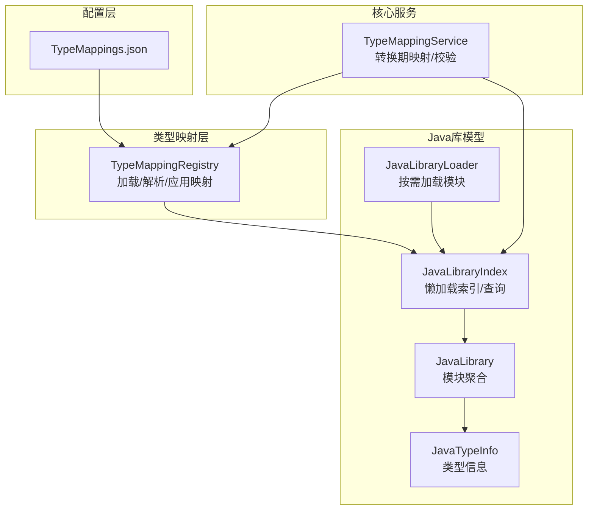
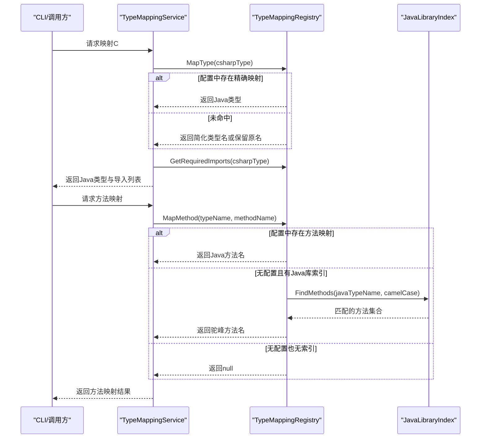
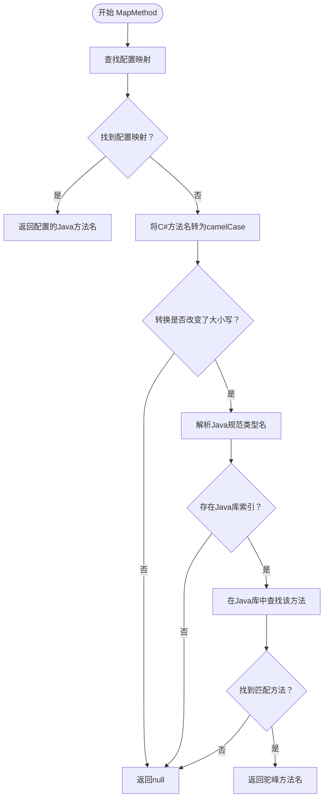
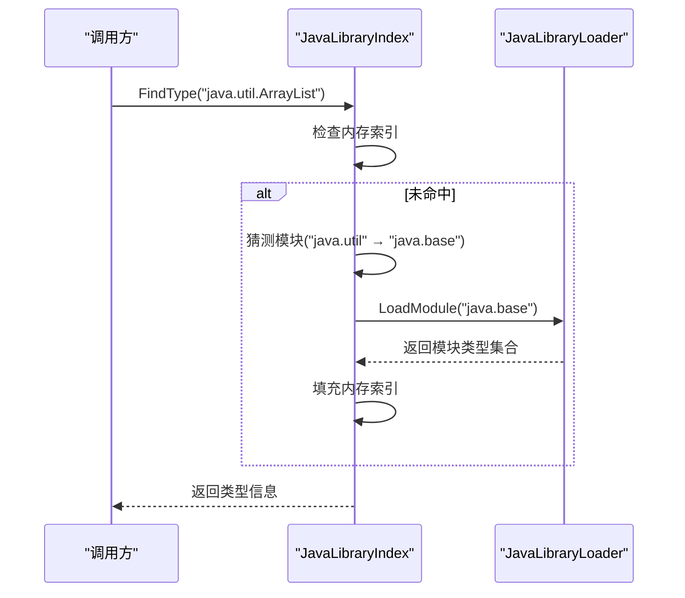

# 类型映射系统

<cite>
**本文档引用的文件**
- [TypeMappings.json](file://config/TypeMappings.json)
- [TypeMappingRegistry.cs](file://src/CSharpToJava.TypeMapping/TypeMappingRegistry.cs)
- [JavaLibrary.cs](file://src/CSharpToJava.TypeMapping/JavaModel/JavaLibrary.cs)
- [JavaLibraryIndex.cs](file://src/CSharpToJava.TypeMapping/JavaModel/JavaLibraryIndex.cs)
- [JavaLibraryLoader.cs](file://src/CSharpToJava.TypeMapping/JavaModel/JavaLibraryLoader.cs)
- [TypeMappingService.cs](file://src/CSharpToJava.Core/Context/TypeMappingService.cs)
- [List.json](file://config/java/java.base/java/util/List.json)
- [String.json](file://config/java/java.base/java/lang/String.json)
- [TypeMappingRegistryJavaModelTests.cs](file://tests/CSharpToJava.Tests/TypeMappingRegistryJavaModelTests.cs)
- [JavaLibraryIndexTests.cs](file://tests/CSharpToJava.Tests/JavaLibraryIndexTests.cs)
- [README.md](file://README.md)
</cite>

## 目录
1. [简介](#简介)
2. [项目结构](#项目结构)
3. [核心组件](#核心组件)
4. [架构总览](#架构总览)
5. [详细组件分析](#详细组件分析)
6. [依赖关系分析](#依赖关系分析)
7. [性能考量](#性能考量)
8. [故障排查指南](#故障排查指南)
9. [结论](#结论)
10. [附录](#附录)

## 简介
本文件面向cs2j类型映射系统，系统通过JSON驱动的配置文件与Java标准库元数据索引实现C#类型到Java类型的精准映射。本文档详细说明：
- JSON驱动的类型映射配置格式与自定义映射规则
- Java库索引的工作原理：自动推导方法名、校验类型存在性
- 内置映射规则（基础类型、泛型、数组、集合、异常等）
- 自定义映射配置示例与最佳实践
- 映射优先级与覆盖机制
- 常见映射问题的解决方案与调试技巧

## 项目结构
cs2j类型映射系统主要由以下模块组成：
- 配置层：TypeMappings.json提供C#到Java的类型、方法、命名空间映射
- 类型映射注册表：TypeMappingRegistry负责加载、解析与应用映射规则
- Java库模型：JavaLibrary、JavaLibraryIndex、JavaLibraryLoader提供Java标准库元数据的查询与缓存
- 核心服务：TypeMappingService在转换过程中调用映射注册表与Java库索引进行类型与方法映射，并执行元数据校验

图表来源
- [TypeMappingRegistry.cs:93-562](file://src/CSharpToJava.TypeMapping/TypeMappingRegistry.cs#L93-L562)
- [JavaLibraryLoader.cs:16-111](file://src/CSharpToJava.TypeMapping/JavaModel/JavaLibraryLoader.cs#L16-L111)
- [JavaLibraryIndex.cs:11-291](file://src/CSharpToJava.TypeMapping/JavaModel/JavaLibraryIndex.cs#L11-L291)
- [JavaLibrary.cs:157-168](file://src/CSharpToJava.TypeMapping/JavaModel/JavaLibrary.cs#L157-L168)
- [TypeMappingService.cs:11-677](file://src/CSharpToJava.Core/Context/TypeMappingService.cs#L11-L677)

章节来源
- [README.md:64-74](file://README.md#L64-L74)

## 核心组件
- TypeMappingRegistry：负责加载JSON配置、建立类型/方法/命名空间映射字典，支持自动推导方法名与类型存在性校验
- JavaLibraryLoader：扫描config/java目录，按模块懒加载JSON元数据
- JavaLibraryIndex：对Java标准库元数据进行索引与查询，支持按名称查找类型、方法、构造器，以及继承关系判断
- JavaLibrary/JavaTypeInfo：承载单个Java类型及其公共成员、接口、父类等信息
- TypeMappingService：在转换流程中调用映射注册表与Java库索引，执行类型映射、导入管理与元数据校验

章节来源
- [TypeMappingRegistry.cs:93-562](file://src/CSharpToJava.TypeMapping/TypeMappingRegistry.cs#L93-L562)
- [JavaLibraryLoader.cs:16-111](file://src/CSharpToJava.TypeMapping/JavaModel/JavaLibraryLoader.cs#L16-L111)
- [JavaLibraryIndex.cs:11-291](file://src/CSharpToJava.TypeMapping/JavaModel/JavaLibraryIndex.cs#L11-L291)
- [JavaLibrary.cs:157-168](file://src/CSharpToJava.TypeMapping/JavaModel/JavaLibrary.cs#L157-L168)
- [TypeMappingService.cs:11-677](file://src/CSharpToJava.Core/Context/TypeMappingService.cs#L11-L677)

## 架构总览
类型映射系统采用“配置驱动 + 元数据索引”的双引擎架构：
- 配置驱动：TypeMappings.json提供显式映射，覆盖常见C#类型到Java类型的对应关系
- 元数据索引：JavaLibraryIndex基于config/java中的JSON元数据，提供类型/方法存在性校验与自动推导能力

图表来源
- [TypeMappingService.cs:71-455](file://src/CSharpToJava.Core/Context/TypeMappingService.cs#L71-L455)
- [TypeMappingRegistry.cs:214-345](file://src/CSharpToJava.TypeMapping/TypeMappingRegistry.cs#L214-L345)
- [JavaLibraryIndex.cs:75-84](file://src/CSharpToJava.TypeMapping/JavaModel/JavaLibraryIndex.cs#L75-L84)

## 详细组件分析

### 组件A：TypeMappingRegistry（类型映射注册表）
职责与特性：
- 加载TypeMappings.json，构建类型映射、方法映射、命名空间映射三类字典
- 支持可空类型展开、泛型类型名规范化（backtick格式与尖括号格式互转）、方法重载识别
- 提供方法名自动推导：将PascalCase转换为camelCase，并在Java库索引中验证是否存在同名方法
- 提供类型/方法存在性校验，用于诊断与质量控制

关键流程图（方法映射与自动推导）：

图表来源
- [TypeMappingRegistry.cs:250-345](file://src/CSharpToJava.TypeMapping/TypeMappingRegistry.cs#L250-L345)

章节来源
- [TypeMappingRegistry.cs:93-562](file://src/CSharpToJava.TypeMapping/TypeMappingRegistry.cs#L93-L562)

### 组件B：JavaLibraryIndex（Java库索引）
职责与特性：
- 懒加载：仅在首次请求某个模块时才从磁盘读取JSON并构建索引
- 查询能力：按类型名查找类型、按类型名+方法名查找方法、按类型名查找构造器、计算继承链
- 模块启发式：根据类型名前缀猜测所属模块（如java.lang、javax.xml等），减少全量加载

序列图（类型查找与模块加载）：

图表来源
- [JavaLibraryIndex.cs:50-68](file://src/CSharpToJava.TypeMapping/JavaModel/JavaLibraryIndex.cs#L50-L68)
- [JavaLibraryLoader.cs:58-78](file://src/CSharpToJava.TypeMapping/JavaModel/JavaLibraryLoader.cs#L58-L78)

章节来源
- [JavaLibraryIndex.cs:11-291](file://src/CSharpToJava.TypeMapping/JavaModel/JavaLibraryIndex.cs#L11-L291)
- [JavaLibraryLoader.cs:16-111](file://src/CSharpToJava.TypeMapping/JavaModel/JavaLibraryLoader.cs#L16-L111)

### 组件C：TypeMappingService（类型映射服务）
职责与特性：
- 在转换过程中统一调用TypeMappingRegistry与JavaLibraryIndex
- 处理复杂类型（泛型、数组、匿名类型、记录合成等）
- 执行Java类型/方法存在性校验，生成诊断信息
- 管理导入语句，避免重复导入与不必要的java.lang.*导入

章节来源
- [TypeMappingService.cs:11-677](file://src/CSharpToJava.Core/Context/TypeMappingService.cs#L11-L677)

### 组件D：JavaLibrary/JavaTypeInfo（Java库模型）
职责与特性：
- JavaLibrary：聚合多个模块
- JavaModule：按模块组织类型
- JavaTypeInfo：描述单个Java类型（模块名、包名、二进制名、简名、种类、修饰符、父类、接口、公开构造器与方法）

章节来源
- [JavaLibrary.cs:157-168](file://src/CSharpToJava.TypeMapping/JavaModel/JavaLibrary.cs#L157-L168)
- [JavaLibrary.cs:92-132](file://src/CSharpToJava.TypeMapping/JavaModel/JavaLibrary.cs#L92-L132)

## 依赖关系分析
- TypeMappingRegistry依赖JavaLibraryIndex以启用自动推导与校验
- TypeMappingService依赖TypeMappingRegistry与JavaLibraryIndex进行运行时映射与校验
- JavaLibraryIndex依赖JavaLibraryLoader进行模块级懒加载
- JavaLibraryLoader依赖config/java目录结构，按模块子目录读取JSON文件

图表来源
- [TypeMappingService.cs:11-677](file://src/CSharpToJava.Core/Context/TypeMappingService.cs#L11-L677)
- [TypeMappingRegistry.cs:93-562](file://src/CSharpToJava.TypeMapping/TypeMappingRegistry.cs#L93-L562)
- [JavaLibraryIndex.cs:11-291](file://src/CSharpToJava.TypeMapping/JavaModel/JavaLibraryIndex.cs#L11-L291)
- [JavaLibraryLoader.cs:16-111](file://src/CSharpToJava.TypeMapping/JavaModel/JavaLibraryLoader.cs#L16-L111)
- [JavaLibrary.cs:157-168](file://src/CSharpToJava.TypeMapping/JavaModel/JavaLibrary.cs#L157-L168)

## 性能考量
- 懒加载与缓存：JavaLibraryIndex按模块懒加载，首次访问后缓存于内存，后续O(1)查找
- 模块启发式：根据类型名前缀快速定位模块，减少全量扫描
- 配置字典：TypeMappingRegistry使用哈希表存储映射，查找时间复杂度O(1)
- 跨文件缓存：TypeMappingService为每个文件维护类型符号到Java类型的缓存，避免重复映射

## 故障排查指南
常见问题与解决思路：
- 映射不生效
  - 检查TypeMappings.json中是否配置了目标C#类型；若使用泛型，请确认backtick格式与尖括号格式的对应
  - 若依赖自动推导，请确保已注入JavaLibraryIndex并正确加载config/java
- 方法名映射失败
  - 确认C#方法名是否为PascalCase；只有转换为camelCase后才会尝试自动推导
  - 使用ValidateMappedJavaMethod进行诊断，查看是否存在CS2J4002警告
- 类型不存在
  - 使用ValidateMappedJavaType进行诊断，查看是否存在CS2J4001警告
  - 确认ResolveJavaCanonicalName是否能正确解析为java.util.*或java.lang.*等规范名
- 导入缺失
  - 检查TypeMappingRegistry.GetRequiredImports返回的导入列表是否被TypeMappingService正确添加
  - 避免重复导入与不必要的java.lang.*导入

调试技巧：
- 启用详细日志与诊断输出（CLI选项--verbose）
- 使用测试用例验证映射行为（参考TypeMappingRegistryJavaModelTests与JavaLibraryIndexTests）
- 分步验证：先验证类型映射，再验证方法映射，最后验证导入

章节来源
- [TypeMappingRegistryJavaModelTests.cs:11-232](file://tests/CSharpToJava.Tests/TypeMappingRegistryJavaModelTests.cs#L11-L232)
- [JavaLibraryIndexTests.cs:8-226](file://tests/CSharpToJava.Tests/JavaLibraryIndexTests.cs#L8-L226)
- [TypeMappingService.cs:627-667](file://src/CSharpToJava.Core/Context/TypeMappingService.cs#L627-L667)

## 结论
cs2j类型映射系统通过“配置驱动 + 元数据索引”实现了高可扩展、可诊断的C#到Java类型映射能力。其核心优势在于：
- 可配置性强：通过TypeMappings.json灵活覆盖各类映射需求
- 可验证性：借助JavaLibraryIndex对映射结果进行存在性校验
- 可扩展性：懒加载与模块化设计便于扩展新的Java库元数据
- 可维护性：清晰的组件边界与测试覆盖保障了系统的稳定性

## 附录

### JSON驱动的类型映射配置格式
- 类型映射（TypeMappings）：C#完全限定类型名 → Java类型名（可为简单名或完整类名），并可指定需要导入的包
- 方法映射（MethodMappings）：指定某类型上的某个方法应映射到Java的哪个方法，支持签名约束（参数数量）
- 命名空间映射（NamespaceMappings）：将C#命名空间映射到Java包

章节来源
- [TypeMappingRegistry.cs:10-68](file://src/CSharpToJava.TypeMapping/TypeMappingRegistry.cs#L10-L68)
- [TypeMappings.json:1-800](file://config/TypeMappings.json#L1-L800)

### Java库索引工作原理
- 模块发现：扫描config/java根目录下的子目录作为模块名
- 类型加载：按需加载模块内的JSON文件，构建类型索引
- 查询接口：按类型名查找类型、按类型+方法名查找方法、按类型名查找构造器、计算继承链
- 模块启发式：根据类型名前缀快速定位模块，减少全量加载

章节来源
- [JavaLibraryLoader.cs:41-78](file://src/CSharpToJava.TypeMapping/JavaModel/JavaLibraryLoader.cs#L41-L78)
- [JavaLibraryIndex.cs:204-228](file://src/CSharpToJava.TypeMapping/JavaModel/JavaLibraryIndex.cs#L204-L228)

### 内置映射规则（节选）
- 基础类型：System.String → String；System.Int32 → int；System.Boolean → boolean；System.Object → Object；System.Void → void
- 泛型类型：System.Collections.Generic.List`1 → ArrayList（导入java.util.ArrayList）；System.Collections.Generic.Dictionary`2 → LinkedHashMap（导入java.util.LinkedHashMap）
- 集合接口：IList`1 → List（导入java.util.List）；IDictionary`2 → Map（导入java.util.Map）；ICollection → Collection（导入java.util.Collection）
- 异常类型：InvalidOperationException → IllegalStateException；OperationCanceledException → java.util.concurrent.CancellationException
- 并发集合：ConcurrentDictionary`2 → ConcurrentHashMap（导入java.util.concurrent.ConcurrentHashMap）
- 时间类型：DateTime → LocalDateTime（导入java.time.LocalDateTime）；DateTimeOffset → OffsetDateTime；TimeSpan → Duration；DateOnly → LocalDate；TimeOnly → LocalTime
- 其他：Guid → UUID（导入java.util.UUID）；Uri → URI（导入java.net.URI）；StringBuilder → StringBuilder（导入java.lang.StringBuilder）

章节来源
- [TypeMappings.json:1-800](file://config/TypeMappings.json#L1-L800)

### 自定义映射配置示例与最佳实践
- 示例：为自定义类型添加映射
  - 在TypeMappings.json中添加一条类型映射，指定C#类型与Java类型，并在imports中声明需要导入的包
- 最佳实践：
  - 优先使用backtick格式的泛型键（如System.Collections.Generic.List`1），以便与TypeMappings.json保持一致
  - 对于方法映射，尽量提供明确的签名约束（参数数量），以避免重载歧义
  - 对于常用第三方库，建议提供命名空间映射，减少跨包导入的复杂度
  - 定期运行诊断工具，检查CS2J4001/CS2J4002警告，确保映射的准确性

章节来源
- [TypeMappingRegistry.cs:184-209](file://src/CSharpToJava.TypeMapping/TypeMappingRegistry.cs#L184-L209)
- [TypeMappingRegistry.cs:352-380](file://src/CSharpToJava.TypeMapping/TypeMappingRegistry.cs#L352-L380)

### 类型映射的优先级与覆盖机制
- 精确匹配优先：TypeMappings.json中的精确键（含泛型backtick）优先于简单类型名
- 可空类型展开：System.Nullable<T>会递归映射内部类型
- 方法映射优先：配置中的方法映射优先于自动推导
- 自动推导次之：当无配置且存在Java库索引时，尝试PascalCase → camelCase并验证方法存在性
- 回退策略：若均未命中，返回简化类型名或保留原名

章节来源
- [TypeMappingRegistry.cs:214-232](file://src/CSharpToJava.TypeMapping/TypeMappingRegistry.cs#L214-L232)
- [TypeMappingRegistry.cs:250-345](file://src/CSharpToJava.TypeMapping/TypeMappingRegistry.cs#L250-L345)

### 常见映射问题与解决方案
- 问题：方法名未自动推导
  - 原因：方法名已是camelCase，不会触发自动推导
  - 解决：在TypeMappings.json中显式配置方法映射
- 问题：类型映射不生效
  - 原因：泛型键格式不匹配（backtick vs尖括号）
  - 解决：统一使用backtick格式的键
- 问题：导入缺失导致编译错误
  - 原因：TypeMappingRegistry.GetRequiredImports未被TypeMappingService正确使用
  - 解决：确保调用AddImportsForType并避免重复导入

章节来源
- [TypeMappingRegistryJavaModelTests.cs:87-132](file://tests/CSharpToJava.Tests/TypeMappingRegistryJavaModelTests.cs#L87-L132)
- [TypeMappingService.cs:525-538](file://src/CSharpToJava.Core/Context/TypeMappingService.cs#L525-L538)