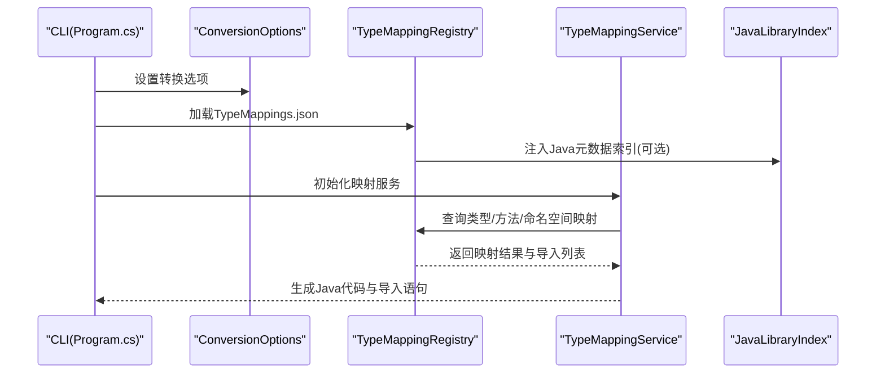
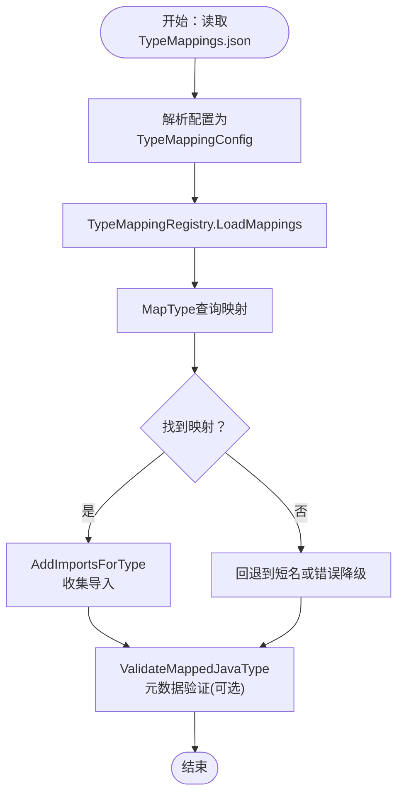
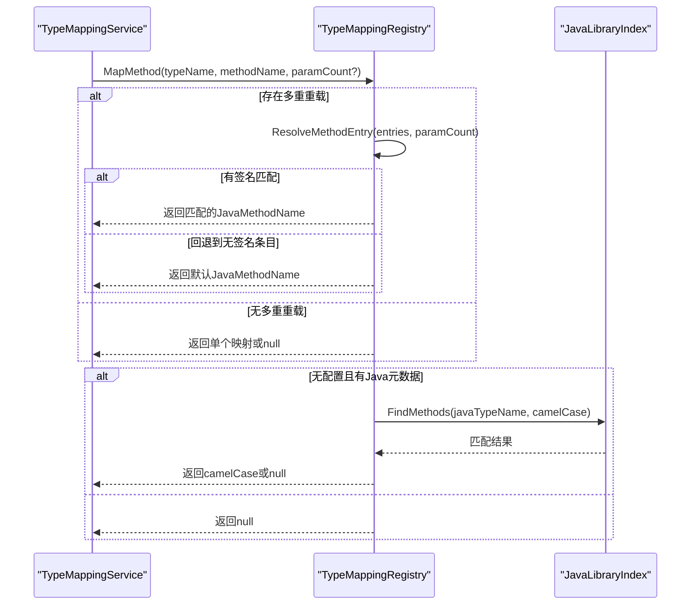
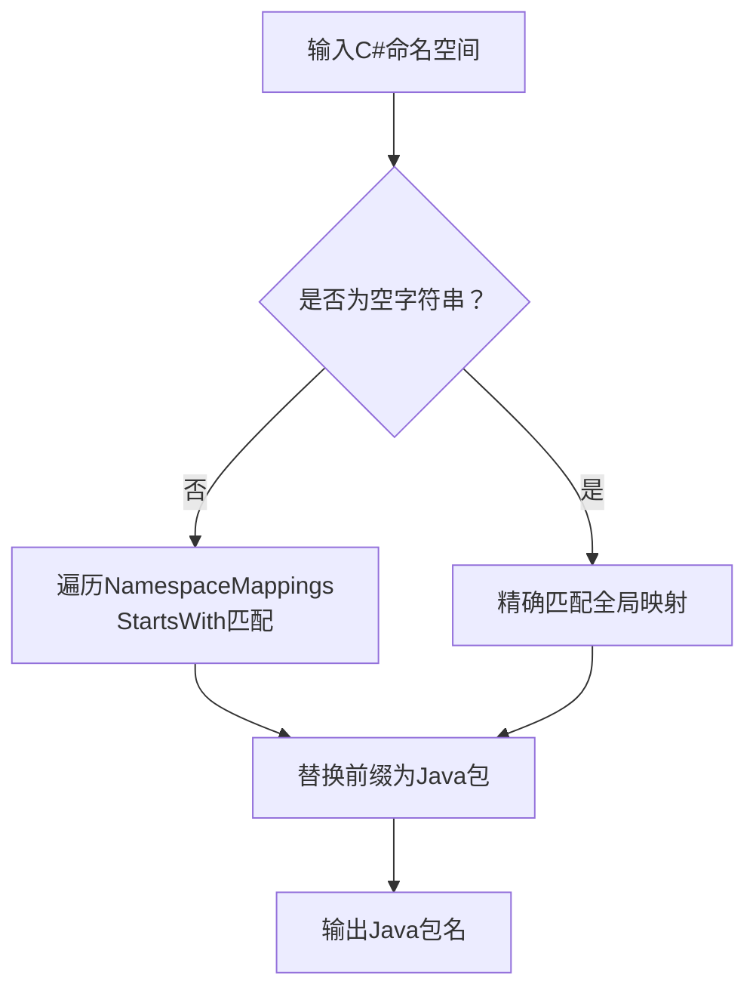
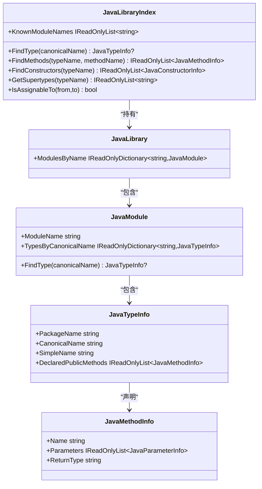
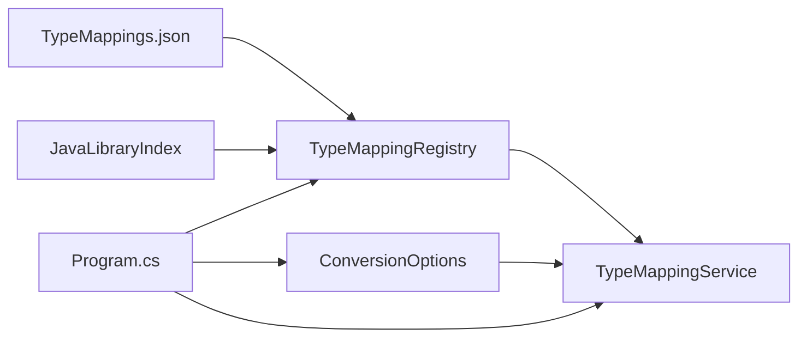

# 自定义映射开发

<cite>
**本文档引用的文件**
- [README.md](file://README.md)
- [TypeMappings.json](file://config/TypeMappings.json)
- [TypeMappingRegistry.cs](file://src/CSharpToJava.TypeMapping/TypeMappingRegistry.cs)
- [TypeMappingService.cs](file://src/CSharpToJava.Core/Context/TypeMappingService.cs)
- [ConversionOptions.cs](file://src/CSharpToJava.Core/Context/ConversionOptions.cs)
- [JavaLibrary.cs](file://src/CSharpToJava.TypeMapping/JavaModel/JavaLibrary.cs)
- [JavaLibraryIndex.cs](file://src/CSharpToJava.TypeMapping/JavaModel/JavaLibraryIndex.cs)
- [Program.cs](file://src/CSharpToJava.CLI/Program.cs)
- [TypeMappingServiceValidationTests.cs](file://tests/CSharpToJava.Tests/TypeMappingServiceValidationTests.cs)
- [MethodOverloadResolutionTests.cs](file://tests/CSharpToJava.Tests/MethodOverloadResolutionTests.cs)
- [TypeMappingRegistryJavaModelTests.cs](file://tests/CSharpToJava.Tests/TypeMappingRegistryJavaModelTests.cs)
- [Map.json](file://config/java/java.base/java/util/Map.json)
- [String.json](file://config/java/java.base/java/lang/String.json)
</cite>

## 目录
1. [简介](#简介)
2. [项目结构](#项目结构)
3. [核心组件](#核心组件)
4. [架构总览](#架构总览)
5. [详细组件分析](#详细组件分析)
6. [依赖关系分析](#依赖关系分析)
7. [性能考虑](#性能考虑)
8. [故障排除指南](#故障排除指南)
9. [结论](#结论)
10. [附录](#附录)

## 简介
本指南面向cs2j（C#到Java转换器）的自定义映射开发，提供从配置文件编写、映射规则设计到测试验证的完整流程。内容涵盖：
- 自定义类型映射：编写TypeMappings.json条目、导入管理与验证
- 自定义方法映射：重载处理、签名匹配与参数类型映射
- 自定义命名空间映射：通配符使用与动态替换策略
- 最佳实践：命名约定、导入管理、性能优化
- 常见场景：第三方库映射、自定义类型映射、复杂泛型映射
- 调试技巧：日志记录、错误诊断、性能分析
- 版本管理与团队协作：配置版本控制、多人协作规范

## 项目结构
cs2j采用模块化架构，核心转换逻辑位于CSharpToJava.Core，类型映射配置与解析在CSharpToJava.TypeMapping中，CLI入口在CSharpToJava.CLI，测试覆盖TypeMappingService与TypeMappingRegistry的行为。

```mermaid
graph TB
subgraph "CLI"
CLI["Program.cs<br/>命令行入口"]
end
subgraph "核心"
Core["TypeMappingService.cs<br/>类型映射服务"]
Options["ConversionOptions.cs<br/>转换选项"]
end
subgraph "映射配置"
Registry["TypeMappingRegistry.cs<br/>映射注册表"]
Config["TypeMappings.json<br/>配置文件"]
end
subgraph "Java元数据"
Index["JavaLibraryIndex.cs<br/>索引"]
Library["JavaLibrary.cs<br/>模型"]
MetaMap["Map.json / String.json<br/>元数据示例"]
end
subgraph "测试"
T1["TypeMappingServiceValidationTests.cs"]
T2["MethodOverloadResolutionTests.cs"]
T3["TypeMappingRegistryJavaModelTests.cs"]
end
CLI --> Options
CLI --> Registry
Registry --> Config
Registry --> Index
Index --> Library
Library --> MetaMap
Core --> Registry
Core --> Options
T1 --> Core
T2 --> Registry
T3 --> Registry
```

**图表来源**
- [Program.cs:1-120](file://src/CSharpToJava.CLI/Program.cs#L1-L120)
- [TypeMappingRegistry.cs:1-120](file://src/CSharpToJava.TypeMapping/TypeMappingRegistry.cs#L1-L120)
- [TypeMappingService.cs:1-120](file://src/CSharpToJava.Core/Context/TypeMappingService.cs#L1-L120)
- [ConversionOptions.cs:1-103](file://src/CSharpToJava.Core/Context/ConversionOptions.cs#L1-L103)
- [JavaLibraryIndex.cs:1-120](file://src/CSharpToJava.TypeMapping/JavaModel/JavaLibraryIndex.cs#L1-L120)
- [JavaLibrary.cs:1-120](file://src/CSharpToJava.TypeMapping/JavaModel/JavaLibrary.cs#L1-L120)
- [TypeMappingServiceValidationTests.cs:1-120](file://tests/CSharpToJava.Tests/TypeMappingServiceValidationTests.cs#L1-L120)
- [MethodOverloadResolutionTests.cs:1-120](file://tests/CSharpToJava.Tests/MethodOverloadResolutionTests.cs#L1-L120)
- [TypeMappingRegistryJavaModelTests.cs:1-120](file://tests/CSharpToJava.Tests/TypeMappingRegistryJavaModelTests.cs#L1-L120)

**章节来源**
- [README.md:64-84](file://README.md#L64-L84)

## 核心组件
- TypeMappingRegistry：负责加载、解析与查询TypeMappings.json，支持类型映射、方法映射、命名空间映射，并可基于Java标准库元数据进行自动推断与验证。
- TypeMappingService：在转换过程中执行具体映射逻辑，包括类型缓存、导入跟踪、命名空间到包的映射、泛型与嵌套类型的处理。
- ConversionOptions：提供转换选项，包括目标Java版本、是否启用JavaDoc、是否使用Optional、是否启用LINQ预处理、命名空间映射字典等。
- JavaLibraryIndex/JavaLibrary：提供Java标准库元数据的索引与查询能力，用于方法名自动推断与类型/方法存在性验证。

**章节来源**
- [TypeMappingRegistry.cs:93-210](file://src/CSharpToJava.TypeMapping/TypeMappingRegistry.cs#L93-L210)
- [TypeMappingService.cs:11-60](file://src/CSharpToJava.Core/Context/TypeMappingService.cs#L11-L60)
- [ConversionOptions.cs:6-94](file://src/CSharpToJava.Core/Context/ConversionOptions.cs#L6-L94)
- [JavaLibraryIndex.cs:11-68](file://src/CSharpToJava.TypeMapping/JavaModel/JavaLibraryIndex.cs#L11-L68)
- [JavaLibrary.cs:92-132](file://src/CSharpToJava.TypeMapping/JavaModel/JavaLibrary.cs#L92-L132)

## 架构总览
cs2j的映射架构以TypeMappings.json为中心，结合TypeMappingRegistry进行配置解析，TypeMappingService在转换时执行映射与导入管理，JavaLibraryIndex提供元数据驱动的方法名推断与验证。



**图表来源**
- [Program.cs:27-98](file://src/CSharpToJava.CLI/Program.cs#L27-L98)
- [TypeMappingRegistry.cs:130-182](file://src/CSharpToJava.TypeMapping/TypeMappingRegistry.cs#L130-L182)
- [TypeMappingService.cs:71-118](file://src/CSharpToJava.Core/Context/TypeMappingService.cs#L71-L118)
- [JavaLibraryIndex.cs:33-40](file://src/CSharpToJava.TypeMapping/JavaModel/JavaLibraryIndex.cs#L33-L40)

## 详细组件分析

### 类型映射开发
- 配置文件编写
  - 在TypeMappings.json中添加TypeMappingEntry，指定csharp与java字段，必要时提供imports。
  - 支持泛型类型（使用反引号语法，如System.Collections.Generic.List`1）。
  - 可通过converter字段扩展自定义转换器（若需要）。
- 导入管理
  - TypeMappingRegistry.GetRequiredImports返回映射所需的Java导入列表。
  - TypeMappingService.AddImportsForTypePublic统一管理导入集合，避免重复与java.lang.*的冗余导入。
- 验证与诊断
  - TypeMappingService.ValidateMappedJavaType/ValidateMappedJavaMethod基于JavaLibraryIndex进行存在性验证，未找到时发出CS2J4001/CS2J4002诊断。
- 测试验证
  - 使用TypeMappingServiceValidationTests验证类型与方法映射的验证行为。



**图表来源**
- [TypeMappingRegistry.cs:184-245](file://src/CSharpToJava.TypeMapping/TypeMappingRegistry.cs#L184-L245)
- [TypeMappingService.cs:525-538](file://src/CSharpToJava.Core/Context/TypeMappingService.cs#L525-L538)
- [TypeMappingServiceValidationTests.cs:19-52](file://tests/CSharpToJava.Tests/TypeMappingServiceValidationTests.cs#L19-L52)

**章节来源**
- [TypeMappings.json:1-120](file://config/TypeMappings.json#L1-L120)
- [TypeMappingRegistry.cs:214-245](file://src/CSharpToJava.TypeMapping/TypeMappingRegistry.cs#L214-L245)
- [TypeMappingService.cs:525-538](file://src/CSharpToJava.Core/Context/TypeMappingService.cs#L525-L538)
- [TypeMappingServiceValidationTests.cs:19-52](file://tests/CSharpToJava.Tests/TypeMappingServiceValidationTests.cs#L19-L52)

### 方法映射开发
- 重载处理
  - TypeMappingRegistry.MapMethod支持同一类型/方法名的多个重载，通过签名字段（如"1","2"）与参数数量进行区分。
  - 当存在签名约束时，优先匹配参数数量；无匹配则回退到无签名条目。
- 签名匹配
  - 支持Roslyn角度括号格式与JSON反引号格式的类型名匹配，自动归一化处理。
  - 通过CountTopLevelTypeArgs计算泛型实参个数，确保重载识别准确。
- 参数类型映射
  - 泛型参数在MapTypeForGeneric中进行装箱处理（基本类型转包装类），保证泛型类型参数正确。
- 自动推断
  - 当无显式配置时，若注入JavaLibraryIndex，则尝试PascalCase→camelCase转换并检查Java元数据是否存在对应方法。



**图表来源**
- [TypeMappingRegistry.cs:250-344](file://src/CSharpToJava.TypeMapping/TypeMappingRegistry.cs#L250-L344)
- [TypeMappingRegistry.cs:352-380](file://src/CSharpToJava.TypeMapping/TypeMappingRegistry.cs#L352-L380)
- [TypeMappingRegistry.cs:522-534](file://src/CSharpToJava.TypeMapping/TypeMappingRegistry.cs#L522-L534)
- [TypeMappingRegistryJavaModelTests.cs:87-132](file://tests/CSharpToJava.Tests/TypeMappingRegistryJavaModelTests.cs#L87-L132)

**章节来源**
- [TypeMappingRegistry.cs:250-344](file://src/CSharpToJava.TypeMapping/TypeMappingRegistry.cs#L250-L344)
- [MethodOverloadResolutionTests.cs:34-94](file://tests/CSharpToJava.Tests/MethodOverloadResolutionTests.cs#L34-L94)
- [TypeMappingRegistryJavaModelTests.cs:87-132](file://tests/CSharpToJava.Tests/TypeMappingRegistryJavaModelTests.cs#L87-L132)

### 命名空间映射开发
- 配置方式
  - 在TypeMappings.json中添加NamespaceMappingEntry，指定csharp与java字段。
  - TypeMappingService.NamespaceToPackage支持全局命名空间（空字符串）与前缀匹配，结合ConversionOptions.NamespaceMappings实现动态替换。
- 通配符策略
  - 通过StartsWith前缀匹配实现“以...开头”的通配符效果，适用于大型库的批量映射。
- 动态替换
  - 结合TypeMappingService的命名空间解析逻辑，可在不同文件上下文中动态决定包名。



**图表来源**
- [TypeMappingRegistry.cs:483-505](file://src/CSharpToJava.TypeMapping/TypeMappingRegistry.cs#L483-L505)
- [TypeMappingService.cs:100-118](file://src/CSharpToJava.Core/Context/TypeMappingService.cs#L100-L118)
- [ConversionOptions.cs:43-43](file://src/CSharpToJava.Core/Context/ConversionOptions.cs#L43-L43)

**章节来源**
- [TypeMappingRegistry.cs:483-505](file://src/CSharpToJava.TypeMapping/TypeMappingRegistry.cs#L483-L505)
- [TypeMappingService.cs:100-118](file://src/CSharpToJava.Core/Context/TypeMappingService.cs#L100-L118)
- [ConversionOptions.cs:43-43](file://src/CSharpToJava.Core/Context/ConversionOptions.cs#L43-L43)

### 元数据驱动的映射与验证
- 元数据索引
  - JavaLibraryIndex按需加载模块，提供FindType/FindMethods/GetSupertypes等查询接口。
  - JavaLibrary/JavaLibraryLoader提供Java标准库元数据的结构化表示。
- 自动推断
  - TypeMappingRegistry.PascalToCamelCase与FindMethods配合，实现从C# PascalCase到Java camelCase的方法名自动推断。
- 存在性验证
  - ValidateTypeExists/ValidateMethodExists在存在元数据时进行严格校验，无元数据时采用乐观策略。



**图表来源**
- [JavaLibraryIndex.cs:11-167](file://src/CSharpToJava.TypeMapping/JavaModel/JavaLibraryIndex.cs#L11-L167)
- [JavaLibrary.cs:137-167](file://src/CSharpToJava.TypeMapping/JavaModel/JavaLibrary.cs#L137-L167)
- [JavaLibrary.cs:13-132](file://src/CSharpToJava.TypeMapping/JavaModel/JavaLibrary.cs#L13-L132)

**章节来源**
- [JavaLibraryIndex.cs:11-167](file://src/CSharpToJava.TypeMapping/JavaModel/JavaLibraryIndex.cs#L11-L167)
- [JavaLibrary.cs:13-132](file://src/CSharpToJava.TypeMapping/JavaModel/JavaLibrary.cs#L13-L132)
- [TypeMappingRegistryJavaModelTests.cs:138-182](file://tests/CSharpToJava.Tests/TypeMappingRegistryJavaModelTests.cs#L138-L182)

## 依赖关系分析
- TypeMappingRegistry依赖TypeMappings.json配置与可选的JavaLibraryIndex元数据。
- TypeMappingService依赖TypeMappingRegistry与ConversionOptions，负责运行时映射与导入管理。
- CLI通过Program.cs初始化转换管道，传递ConversionOptions与映射配置路径。



**图表来源**
- [Program.cs:39-58](file://src/CSharpToJava.CLI/Program.cs#L39-L58)
- [TypeMappingRegistry.cs:130-182](file://src/CSharpToJava.TypeMapping/TypeMappingRegistry.cs#L130-L182)
- [TypeMappingService.cs:37-53](file://src/CSharpToJava.Core/Context/TypeMappingService.cs#L37-L53)

**章节来源**
- [Program.cs:39-58](file://src/CSharpToJava.CLI/Program.cs#L39-L58)
- [TypeMappingRegistry.cs:130-182](file://src/CSharpToJava.TypeMapping/TypeMappingRegistry.cs#L130-L182)
- [TypeMappingService.cs:37-53](file://src/CSharpToJava.Core/Context/TypeMappingService.cs#L37-L53)

## 性能考虑
- 缓存机制
  - TypeMappingService维护每文件的TypeCache，避免重复映射计算。
  - JavaLibraryIndex按模块懒加载，首次访问才加载对应模块，后续O(1)字典查找。
- 导入去重
  - TypeMappingService.AddImport过滤java.lang.*冗余导入，减少不必要的import语句。
- 泛型与嵌套类型
  - MapTypeForGeneric在泛型参数处进行装箱，避免重复装箱逻辑。
- 并行处理
  - ConversionOptions.EnableParallelProjectPasses允许项目级转换阶段并行执行，提升大规模工程转换效率。

**章节来源**
- [TypeMappingService.cs:24-67](file://src/CSharpToJava.Core/Context/TypeMappingService.cs#L24-L67)
- [JavaLibraryIndex.cs:230-290](file://src/CSharpToJava.TypeMapping/JavaModel/JavaLibraryIndex.cs#L230-L290)
- [ConversionOptions.cs:93-93](file://src/CSharpToJava.Core/Context/ConversionOptions.cs#L93-L93)

## 故障排除指南
- 常见诊断码
  - CS2J4001：映射的Java类型在元数据中不存在。
  - CS2J4002：映射的Java方法在元数据中不存在。
- 定位方法
  - 使用TypeMappingServiceValidationTests中的断言模式，验证特定类型/方法映射是否触发相应诊断。
  - 检查TypeMappingRegistryJavaModelTests中的自动推断与验证用例，确认PascalCase→camelCase转换是否符合预期。
- 日志与输出
  - CLI在Verbose模式下输出诊断信息，便于定位问题。
- 元数据缺失
  - 若未设置JavaMetadataPath或未注入JavaLibraryIndex，验证逻辑会跳过，采用乐观策略。

**章节来源**
- [TypeMappingServiceValidationTests.cs:19-82](file://tests/CSharpToJava.Tests/TypeMappingServiceValidationTests.cs#L19-L82)
- [TypeMappingRegistryJavaModelTests.cs:87-132](file://tests/CSharpToJava.Tests/TypeMappingRegistryJavaModelTests.cs#L87-L132)
- [Program.cs:83-97](file://src/CSharpToJava.CLI/Program.cs#L83-L97)

## 结论
cs2j提供了完善的自定义映射开发框架：以TypeMappings.json为核心配置，结合TypeMappingRegistry与TypeMappingService实现灵活的类型、方法与命名空间映射；通过JavaLibraryIndex实现元数据驱动的自动推断与验证。遵循本文档的最佳实践与调试方法，可高效完成第三方库映射、复杂泛型映射与团队协作中的配置管理。

## 附录

### 常见映射场景与解决方案
- 第三方库映射
  - 在TypeMappings.json中添加第三方类型的csharp→java映射，并在imports中声明必要的Java包。
  - 若第三方库方法名不符合Java习惯，使用MethodMappingEntry配置显式映射或依赖自动推断。
- 自定义类型映射
  - 对于自定义C#类型，建议提供简明的java名称与最少导入，避免跨包冲突。
  - 使用TypeMappingService.ValidateMappedJavaType进行类型存在性验证。
- 复杂泛型映射
  - 使用反引号语法（如HashSet`1）与Imports组合，确保泛型参数正确装箱。
  - 通过TypeMappingService.MapTypeForGeneric统一处理泛型参数的装箱逻辑。

**章节来源**
- [TypeMappings.json:109-135](file://config/TypeMappings.json#L109-L135)
- [TypeMappingRegistry.cs:214-245](file://src/CSharpToJava.TypeMapping/TypeMappingRegistry.cs#L214-L245)
- [TypeMappingService.cs:503-523](file://src/CSharpToJava.Core/Context/TypeMappingService.cs#L503-L523)

### 版本管理与团队协作
- 配置版本控制
  - 将TypeMappings.json纳入版本控制系统，每次变更提交时附带变更说明与测试用例。
- 团队协作规范
  - 统一命名约定：C#类型使用完全限定名，Java类型尽量使用canonical形式或明确imports。
  - 重载方法必须提供签名字段，避免歧义。
  - 新增映射前先运行相关测试（MethodOverloadResolutionTests、TypeMappingRegistryJavaModelTests）。

**章节来源**
- [MethodOverloadResolutionTests.cs:34-94](file://tests/CSharpToJava.Tests/MethodOverloadResolutionTests.cs#L34-L94)
- [TypeMappingRegistryJavaModelTests.cs:188-231](file://tests/CSharpToJava.Tests/TypeMappingRegistryJavaModelTests.cs#L188-L231)