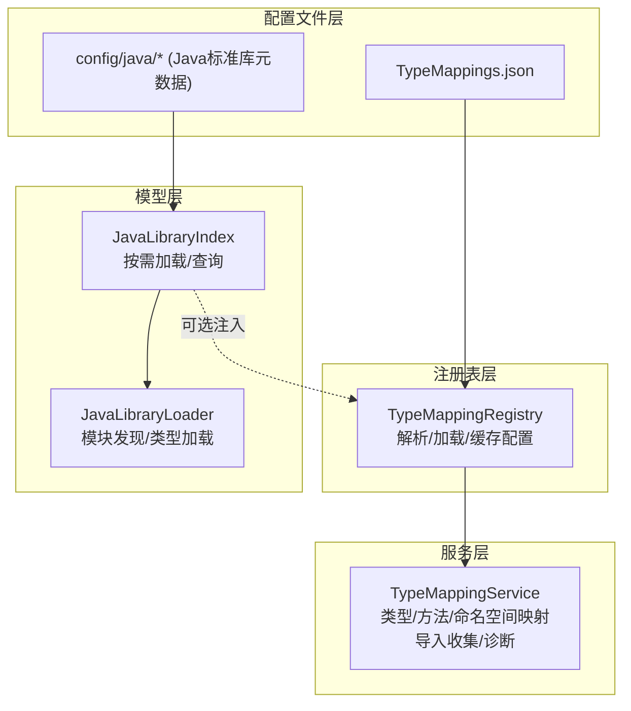
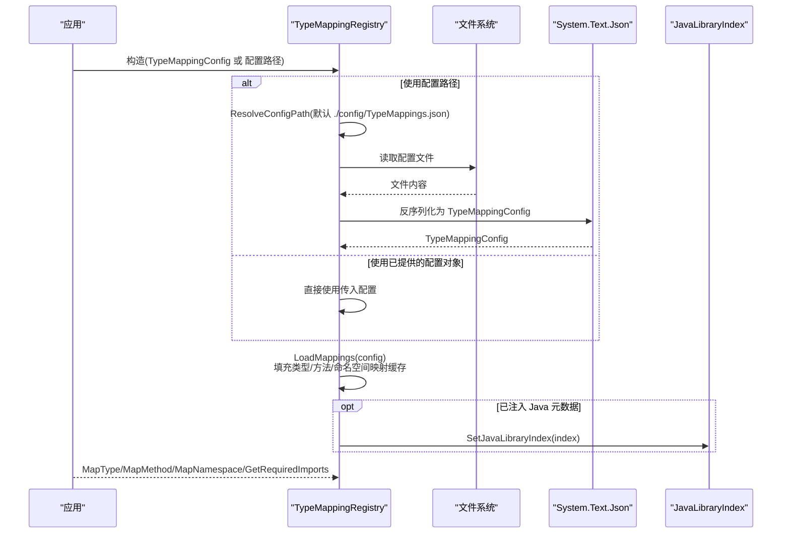
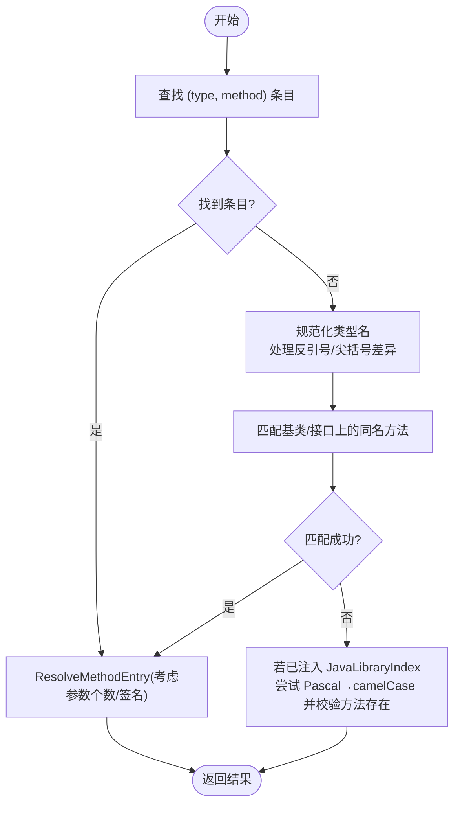
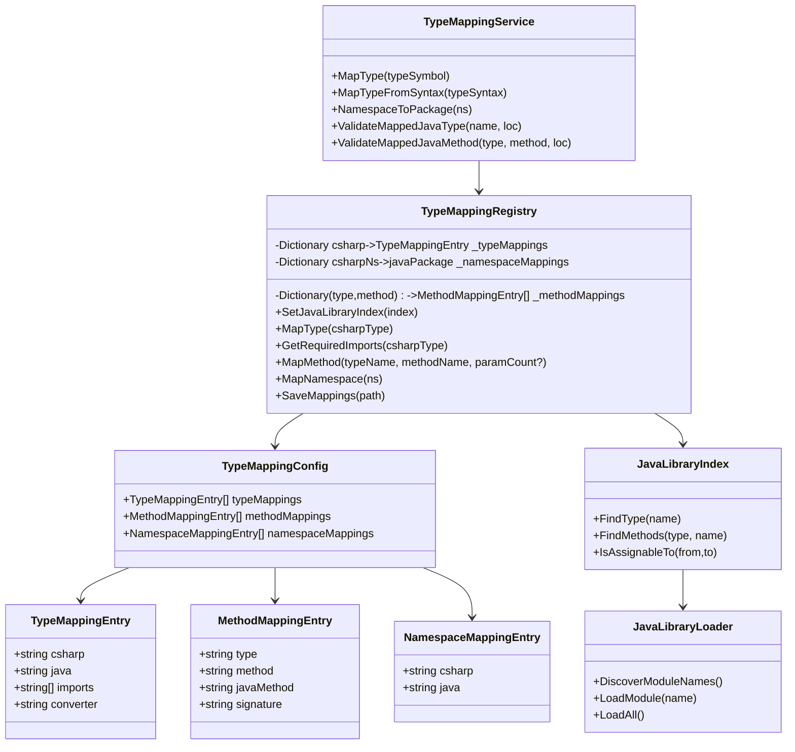

# 配置管理

<cite>
**本文引用的文件**
- [TypeMappings.json](file://config/TypeMappings.json)
- [TypeMappingRegistry.cs](file://src/CSharpToJava.TypeMapping/TypeMappingRegistry.cs)
- [TypeMappingService.cs](file://src/CSharpToJava.Core/Context/TypeMappingService.cs)
- [JavaLibraryIndex.cs](file://src/CSharpToJava.TypeMapping/JavaModel/JavaLibraryIndex.cs)
- [JavaLibraryLoader.cs](file://src/CSharpToJava.TypeMapping/JavaModel/JavaLibraryLoader.cs)
- [Object.json](file://config/java/java.base/java/lang/Object.json)
- [List.json](file://config/java/java.base/java/util/List.json)
- [Map.json](file://config/java/java.base/java/util/Map.json)
- [TypeMappingServiceValidationTests.cs](file://tests/CSharpToJava.Tests/TypeMappingServiceValidationTests.cs)
</cite>

## 目录
1. [简介](#简介)
2. [项目结构](#项目结构)
3. [核心组件](#核心组件)
4. [架构总览](#架构总览)
5. [详细组件分析](#详细组件分析)
6. [依赖关系分析](#依赖关系分析)
7. [性能考量](#性能考量)
8. [故障排查指南](#故障排查指南)
9. [结论](#结论)
10. [附录](#附录)

## 简介
本文件系统性地文档化 cs2j 类型映射配置管理系统，聚焦于 JSON 配置文件的结构与加载机制、配置项的语法规范、验证规则以及常见问题排查。内容覆盖：
- 配置文件 TypeMappings.json 的结构与字段含义
- TypeMappingConfig、TypeMappingEntry、MethodMappingEntry、NamespaceMappingEntry 的定义与用途
- 配置加载流程：默认路径解析、相对路径处理、错误处理
- 语法规则：C# 类型名、Java 类型名、导入列表、转换器名称等字段的格式要求
- 完整配置示例：基础类型映射、泛型类型映射、方法映射、命名空间映射
- 验证规则与常见错误排查

## 项目结构
cs2j 的配置管理由以下层次构成：
- 配置文件层：TypeMappings.json 及 config/java 下的 Java 标准库元数据
- 注册表层：TypeMappingRegistry 负责解析、加载与缓存配置
- 服务层：TypeMappingService 在转换过程中使用注册表进行类型与方法映射，并支持基于 Java 元数据的自动推断与校验
- 模型层：JavaLibraryIndex/JavaLibraryLoader 提供 Java 标准库元数据的索引与加载能力

图表来源
- [TypeMappingRegistry.cs:93-147](file://src/CSharpToJava.TypeMapping/TypeMappingRegistry.cs#L93-L147)
- [TypeMappingService.cs:11-53](file://src/CSharpToJava.Core/Context/TypeMappingService.cs#L11-L53)
- [JavaLibraryIndex.cs:11-40](file://src/CSharpToJava.TypeMapping/JavaModel/JavaLibraryIndex.cs#L11-L40)
- [JavaLibraryLoader.cs:16-36](file://src/CSharpToJava.TypeMapping/JavaModel/JavaLibraryLoader.cs#L16-L36)

章节来源
- [TypeMappingRegistry.cs:93-147](file://src/CSharpToJava.TypeMapping/TypeMappingRegistry.cs#L93-L147)
- [TypeMappingService.cs:11-53](file://src/CSharpToJava.Core/Context/TypeMappingService.cs#L11-L53)
- [JavaLibraryIndex.cs:11-40](file://src/CSharpToJava.TypeMapping/JavaModel/JavaLibraryIndex.cs#L11-L40)
- [JavaLibraryLoader.cs:16-36](file://src/CSharpToJava.TypeMapping/JavaModel/JavaLibraryLoader.cs#L16-L36)

## 核心组件
- TypeMappingConfig：顶层配置对象，包含 typeMappings、methodMappings、namespaceMappings 三个数组字段
- TypeMappingEntry：类型映射条目，字段包括 csharp、java、imports、converter
- MethodMappingEntry：方法映射条目，字段包括 type、method、javaMethod、signature
- NamespaceMappingEntry：命名空间映射条目，字段包括 csharp、java
- TypeMappingRegistry：配置加载与缓存、方法重载解析、命名空间映射、导入收集、保存配置
- TypeMappingService：在转换流程中使用注册表进行映射、导入收集、诊断与 Java 元数据校验
- JavaLibraryIndex/JavaLibraryLoader：按需加载 Java 标准库元数据，支持方法存在性与类型存在性校验

章节来源
- [TypeMappingRegistry.cs:10-68](file://src/CSharpToJava.TypeMapping/TypeMappingRegistry.cs#L10-L68)
- [TypeMappingService.cs:11-53](file://src/CSharpToJava.Core/Context/TypeMappingService.cs#L11-L53)
- [JavaLibraryIndex.cs:11-40](file://src/CSharpToJava.TypeMapping/JavaModel/JavaLibraryIndex.cs#L11-L40)
- [JavaLibraryLoader.cs:16-36](file://src/CSharpToJava.TypeMapping/JavaModel/JavaLibraryLoader.cs#L16-L36)

## 架构总览
配置加载与使用的关键流程如下：

图表来源
- [TypeMappingRegistry.cs:114-182](file://src/CSharpToJava.TypeMapping/TypeMappingRegistry.cs#L114-L182)
- [TypeMappingRegistry.cs:184-209](file://src/CSharpToJava.TypeMapping/TypeMappingRegistry.cs#L184-L209)

章节来源
- [TypeMappingRegistry.cs:114-182](file://src/CSharpToJava.TypeMapping/TypeMappingRegistry.cs#L114-L182)
- [TypeMappingRegistry.cs:184-209](file://src/CSharpToJava.TypeMapping/TypeMappingRegistry.cs#L184-L209)

## 详细组件分析

### 配置文件结构与字段定义
- TypeMappings.json
  - typeMappings：数组，元素为 TypeMappingEntry
  - methodMappings：数组，元素为 MethodMappingEntry
  - namespaceMappings：数组，元素为 NamespaceMappingEntry

- TypeMappingEntry 字段
  - csharp：C# 类型全名或简名（含泛型后缀），用于匹配 Roslyn 解析的类型
  - java：目标 Java 类型名；若为简单类名，可通过 imports 推导完整限定名
  - imports：Java 导入列表，用于生成 import 语句
  - converter：可选，指定自定义转换器名称（用于扩展）

- MethodMappingEntry 字段
  - type：C# 类型名（用于方法重载解析）
  - method：C# 方法名
  - javaMethod：目标 Java 方法名
  - signature：可选，用于重载区分（通常为参数个数字符串）

- NamespaceMappingEntry 字段
  - csharp：C# 命名空间前缀（支持空串表示全局命名空间）
  - java：替换后的 Java 包名

章节来源
- [TypeMappingRegistry.cs:10-68](file://src/CSharpToJava.TypeMapping/TypeMappingRegistry.cs#L10-L68)
- [TypeMappings.json:1-20](file://config/TypeMappings.json#L1-L20)

### 配置加载机制与路径解析
- 默认路径
  - 若未显式提供配置路径，默认从当前工作目录下的 ./config/TypeMappings.json 加载
- 相对路径处理
  - 若提供相对路径，则基于当前工作目录拼接
  - 若提供绝对路径，则直接使用
- 错误处理
  - 文件不存在：抛出 TypeMappingConfigurationException，包含配置路径
  - JSON 反序列化失败：抛出 TypeMappingConfigurationException，包含内部异常
  - IO 异常：抛出 TypeMappingConfigurationException，包含内部异常

章节来源
- [TypeMappingRegistry.cs:114-182](file://src/CSharpToJava.TypeMapping/TypeMappingRegistry.cs#L114-L182)

### 方法映射与重载解析
- 支持按类型+方法名匹配，必要时结合参数个数与 signature 字段进行重载区分
- 当无显式配置时，若已注入 JavaLibraryIndex，可尝试将 PascalCase 方法名转为 camelCase 并检查 Java 类型是否存在该方法
- 支持泛型类型名格式差异（Roslyn 使用尖括号，JSON 使用反引号），在匹配时进行归一化处理

图表来源
- [TypeMappingRegistry.cs:250-345](file://src/CSharpToJava.TypeMapping/TypeMappingRegistry.cs#L250-L345)

章节来源
- [TypeMappingRegistry.cs:250-345](file://src/CSharpToJava.TypeMapping/TypeMappingRegistry.cs#L250-L345)

### 命名空间映射
- 支持以 C# 命名空间前缀匹配并替换为 Java 包名
- 对空字符串（全局命名空间）进行精确匹配
- 与 ConversionOptions 中的命名空间映射策略协同工作

章节来源
- [TypeMappingRegistry.cs:482-505](file://src/CSharpToJava.TypeMapping/TypeMappingRegistry.cs#L482-L505)
- [TypeMappingService.cs:100-118](file://src/CSharpToJava.Core/Context/TypeMappingService.cs#L100-L118)

### 导入收集与生成
- 通过 GetRequiredImports 返回类型映射所需的 Java 导入
- TypeMappingService 在映射过程中自动收集导入，避免重复
- 支持对简单类型名进行 canonical 化（优先 java.lang、java.util，其次根据 imports 推导）

章节来源
- [TypeMappingRegistry.cs:237-245](file://src/CSharpToJava.TypeMapping/TypeMappingRegistry.cs#L237-L245)
- [TypeMappingRegistry.cs:442-468](file://src/CSharpToJava.TypeMapping/TypeMappingRegistry.cs#L442-L468)
- [TypeMappingService.cs:525-538](file://src/CSharpToJava.Core/Context/TypeMappingService.cs#L525-L538)

### Java 元数据集成与自动推断
- JavaLibraryIndex/JavaLibraryLoader 提供按需加载的 Java 标准库元数据
- TypeMappingRegistry 可注入 JavaLibraryIndex，启用：
  - 方法名自动推断：PascalCase → camelCase
  - 类型/方法存在性校验：ValidateTypeExists/ValidateMethodExists
- TypeMappingService 提供 ValidateMappedJavaType/ValidateMappedJavaMethod 诊断接口

章节来源
- [JavaLibraryIndex.cs:11-40](file://src/CSharpToJava.TypeMapping/JavaModel/JavaLibraryIndex.cs#L11-L40)
- [JavaLibraryLoader.cs:16-36](file://src/CSharpToJava.TypeMapping/JavaModel/JavaLibraryLoader.cs#L16-L36)
- [TypeMappingRegistry.cs:106-112](file://src/CSharpToJava.TypeMapping/TypeMappingRegistry.cs#L106-L112)
- [TypeMappingRegistry.cs:387-401](file://src/CSharpToJava.TypeMapping/TypeMappingRegistry.cs#L387-L401)
- [TypeMappingService.cs:614-667](file://src/CSharpToJava.Core/Context/TypeMappingService.cs#L614-L667)

## 依赖关系分析

图表来源
- [TypeMappingRegistry.cs:10-68](file://src/CSharpToJava.TypeMapping/TypeMappingRegistry.cs#L10-L68)
- [TypeMappingService.cs:11-53](file://src/CSharpToJava.Core/Context/TypeMappingService.cs#L11-L53)
- [JavaLibraryIndex.cs:11-40](file://src/CSharpToJava.TypeMapping/JavaModel/JavaLibraryIndex.cs#L11-L40)
- [JavaLibraryLoader.cs:16-36](file://src/CSharpToJava.TypeMapping/JavaModel/JavaLibraryLoader.cs#L16-L36)

章节来源
- [TypeMappingRegistry.cs:10-68](file://src/CSharpToJava.TypeMapping/TypeMappingRegistry.cs#L10-L68)
- [TypeMappingService.cs:11-53](file://src/CSharpToJava.Core/Context/TypeMappingService.cs#L11-L53)
- [JavaLibraryIndex.cs:11-40](file://src/CSharpToJava.TypeMapping/JavaModel/JavaLibraryIndex.cs#L11-L40)
- [JavaLibraryLoader.cs:16-36](file://src/CSharpToJava.TypeMapping/JavaModel/JavaLibraryLoader.cs#L16-L36)

## 性能考量
- 按需加载 Java 元数据：JavaLibraryIndex 仅在首次访问时加载对应模块，避免一次性加载全部元数据带来的开销
- 缓存策略：TypeMappingRegistry 内部使用字典缓存类型/方法/命名空间映射，提升查询效率
- 导入去重：TypeMappingService 使用 HashSet 避免重复导入
- 泛型类型名归一化：在方法映射中对反引号与尖括号格式进行归一化，减少不必要的复杂匹配逻辑

[本节为通用性能建议，不涉及具体文件分析]

## 故障排查指南

- 配置文件未找到
  - 现象：构造 TypeMappingRegistry 时抛出 TypeMappingConfigurationException，提示配置文件不存在
  - 排查：确认默认路径 ./config/TypeMappings.json 是否存在；若使用自定义路径，请确保路径为绝对路径或相对于当前工作目录有效
  - 参考：[TypeMappingRegistry.cs:134-139](file://src/CSharpToJava.TypeMapping/TypeMappingRegistry.cs#L134-L139)

- JSON 反序列化失败
  - 现象：抛出 TypeMappingConfigurationException，包含内部 JsonException
  - 排查：检查 TypeMappings.json 语法是否正确，字段大小写是否符合大小写不敏感规则；确认 JSON 结构与 TypeMappingConfig 定义一致
  - 参考：[TypeMappingRegistry.cs:168-174](file://src/CSharpToJava.TypeMapping/TypeMappingRegistry.cs#L168-L174)

- IO 错误导致无法读取配置
  - 现象：抛出 TypeMappingConfigurationException，包含内部 IOException
  - 排查：检查文件权限、磁盘可用空间、路径拼接是否正确
  - 参考：[TypeMappingRegistry.cs:175-181](file://src/CSharpToJava.TypeMapping/TypeMappingRegistry.cs#L175-L181)

- Java 元数据缺失导致方法/类型校验失败
  - 现象：调用 ValidateMappedJavaType/ValidateMappedJavaMethod 后出现 CS2J4001/CS2J4002 诊断
  - 排查：确认 JavaMetadataPath 正确指向 config/java 目录；确保 JavaLibraryIndex 已注入；检查目标 Java 类型/方法是否存在于元数据中
  - 参考：[TypeMappingServiceValidationTests.cs:19-82](file://tests/CSharpToJava.Tests/TypeMappingServiceValidationTests.cs#L19-L82)

- 方法重载解析不准确
  - 现象：同一类型多个重载方法映射错误
  - 排查：在 MethodMappingEntry 中添加 signature 字段（参数个数字符串），或提供更精确的 type/method 组合
  - 参考：[TypeMappingRegistry.cs:352-380](file://src/CSharpToJava.TypeMapping/TypeMappingRegistry.cs#L352-L380)

- 导入缺失或冲突
  - 现象：生成的 Java 代码缺少 import 或类型歧义
  - 排查：在 TypeMappingEntry 的 imports 中补充完整限定名；确保 TypeMappingService 的导入收集逻辑生效
  - 参考：[TypeMappingRegistry.cs:442-468](file://src/CSharpToJava.TypeMapping/TypeMappingRegistry.cs#L442-L468), [TypeMappingService.cs:525-538](file://src/CSharpToJava.Core/Context/TypeMappingService.cs#L525-L538)

章节来源
- [TypeMappingRegistry.cs:134-181](file://src/CSharpToJava.TypeMapping/TypeMappingRegistry.cs#L134-L181)
- [TypeMappingServiceValidationTests.cs:19-82](file://tests/CSharpToJava.Tests/TypeMappingServiceValidationTests.cs#L19-L82)
- [TypeMappingRegistry.cs:352-380](file://src/CSharpToJava.TypeMapping/TypeMappingRegistry.cs#L352-L380)
- [TypeMappingRegistry.cs:442-468](file://src/CSharpToJava.TypeMapping/TypeMappingRegistry.cs#L442-L468)
- [TypeMappingService.cs:525-538](file://src/CSharpToJava.Core/Context/TypeMappingService.cs#L525-L538)

## 结论
cs2j 的配置管理以 TypeMappings.json 为核心，配合 TypeMappingRegistry 的高效缓存与按需加载机制，实现了灵活而可靠的类型、方法与命名空间映射。通过 JavaLibraryIndex/JavaLibraryLoader 的集成，系统具备自动推断与严格校验的能力，显著提升了转换质量与可维护性。遵循本文档的语法规则与最佳实践，可有效避免常见错误并提升开发效率。

[本节为总结性内容，不涉及具体文件分析]

## 附录

### 配置项语法规则
- csharp 字段
  - 支持完全限定名（含命名空间）与简名
  - 泛型类型使用反引号格式（如 System.Collections.Generic.HashSet`1）
- java 字段
  - 可为简单类名（如 ArrayList），也可为完整限定名（如 java.util.ArrayList）
  - 若为简单类名，需在 imports 中提供完整限定名以便生成 import
- imports 字段
  - 必须为字符串数组，每个元素为 Java 类的完整限定名
- converter 字段
  - 可选，用于指定自定义转换器名称（扩展功能）
- type/method/javaMethod/sigature 字段
  - type/method 用于方法重载定位
  - javaMethod 为目标 Java 方法名
  - signature 用于重载区分（通常为参数个数字符串）

章节来源
- [TypeMappingRegistry.cs:25-68](file://src/CSharpToJava.TypeMapping/TypeMappingRegistry.cs#L25-L68)
- [TypeMappings.json:1-20](file://config/TypeMappings.json#L1-L20)

### 配置示例（路径引用）
- 基础类型映射
  - 示例路径：[TypeMappings.json:1-20](file://config/TypeMappings.json#L1-L20)
- 泛型类型映射
  - 示例路径：[TypeMappings.json:109-121](file://config/TypeMappings.json#L109-L121)
- 方法映射
  - 示例路径：[TypeMappings.json:1-20](file://config/TypeMappings.json#L1-L20)
- 命名空间映射
  - 示例路径：[TypeMappings.json:1-20](file://config/TypeMappings.json#L1-L20)

### Java 元数据示例（路径引用）
- Object 类型元数据
  - 示例路径：[Object.json:1-136](file://config/java/java.base/java/lang/Object.json#L1-L136)
- List 接口元数据
  - 示例路径：[List.json:1-800](file://config/java/java.base/java/util/List.json#L1-L800)
- Map 接口元数据
  - 示例路径：[Map.json:1-800](file://config/java/java.base/java/util/Map.json#L1-L800)

### 验证规则与测试参考
- 类型存在性校验
  - 示例路径：[TypeMappingServiceValidationTests.cs:19-52](file://tests/CSharpToJava.Tests/TypeMappingServiceValidationTests.cs#L19-L52)
- 方法存在性校验
  - 示例路径：[TypeMappingServiceValidationTests.cs:58-82](file://tests/CSharpToJava.Tests/TypeMappingServiceValidationTests.cs#L58-L82)
- 自动推断与管道集成
  - 示例路径：[TypeMappingServiceValidationTests.cs:107-134](file://tests/CSharpToJava.Tests/TypeMappingServiceValidationTests.cs#L107-L134)