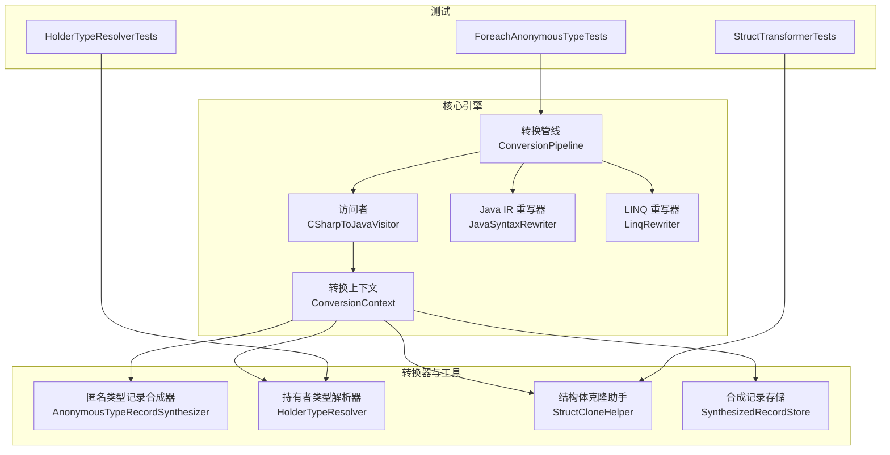
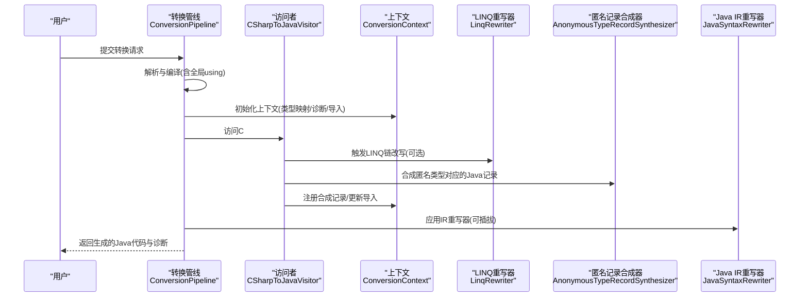
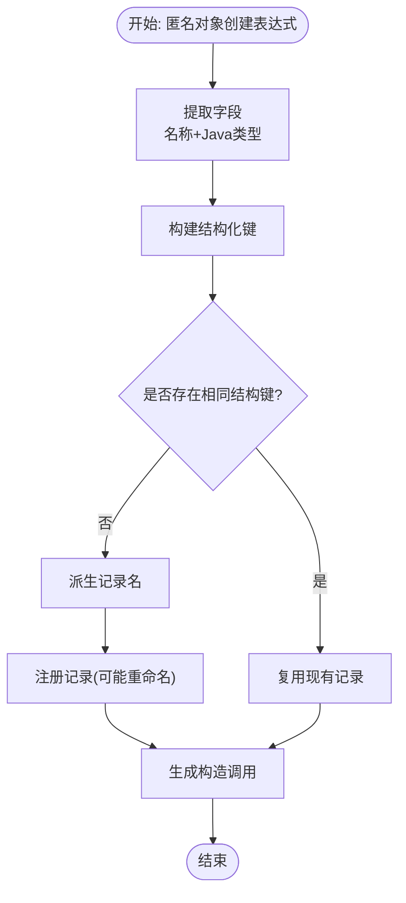
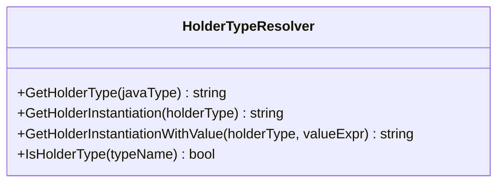
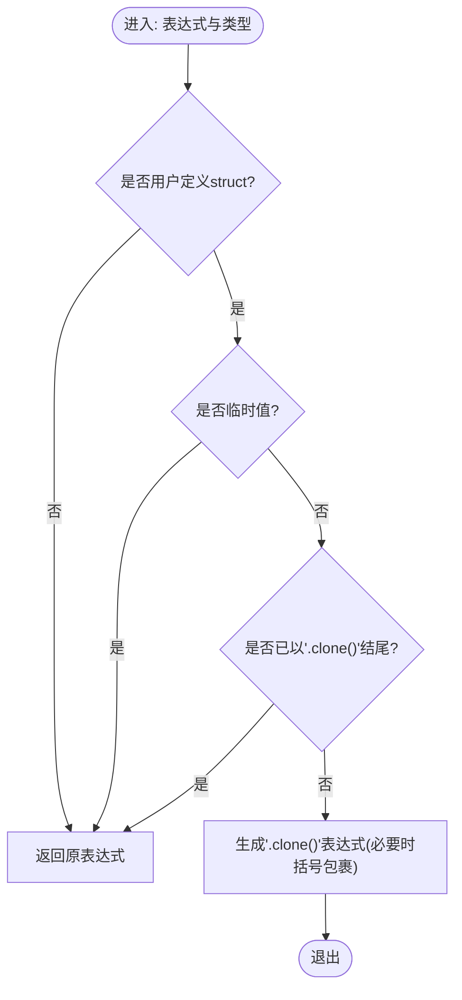
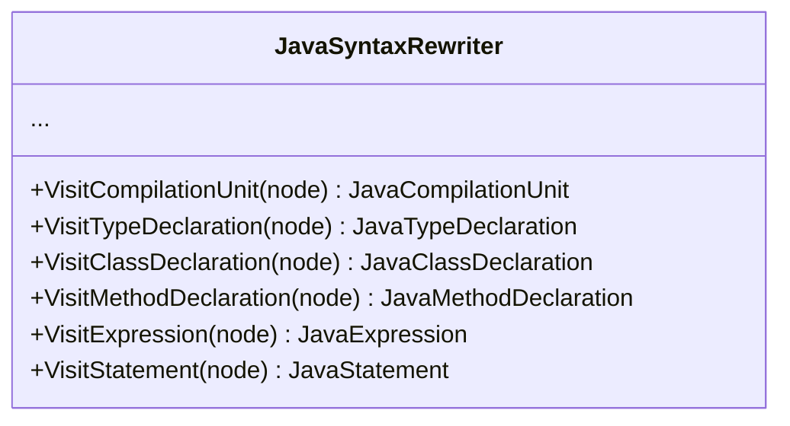
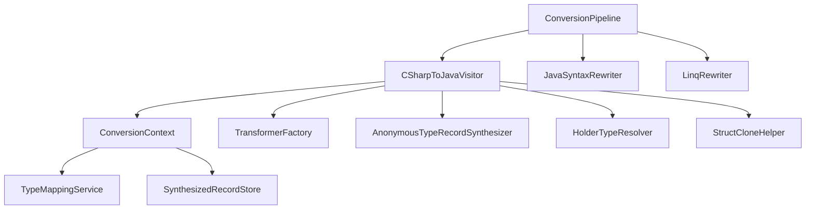

# 分析器和重写器

<cite>
**本文引用的文件**
- [AnonymousTypeRecordSynthesizer.cs](file://src/CSharpToJava.Core/Transformers/AnonymousTypeRecordSynthesizer.cs)
- [HolderTypeResolver.cs](file://src/CSharpToJava.Core/Transformers/HolderTypeResolver.cs)
- [StructCloneHelper.cs](file://src/CSharpToJava.Core/Transformers/StructCloneHelper.cs)
- [JavaSyntaxRewriter.cs](file://src/CSharpToJava.Core/Java/JavaSyntaxRewriter.cs)
- [ConversionContext.cs](file://src/CSharpToJava.Core/Context/ConversionContext.cs)
- [CSharpToJavaVisitor.cs](file://src/CSharpToJava.Core/Visitors/CSharpToJavaVisitor.cs)
- [ConversionPipeline.cs](file://src/CSharpToJava.Core/Pipeline/ConversionPipeline.cs)
- [SynthesizedRecordStore.cs](file://src/CSharpToJava.Core/Context/SynthesizedRecordStore.cs)
- [LinqRewriter.cs](file://src/CSharpToJava.Core/LinqRewrite/LinqRewriter.cs)
- [ForeachAnonymousTypeTests.cs](file://tests/CSharpToJava.Tests/ForeachAnonymousTypeTests.cs)
- [HolderTypeResolverTests.cs](file://tests/CSharpToJava.Tests/HolderTypeResolverTests.cs)
- [StructTransformerTests.cs](file://tests/CSharpToJava.Tests/StructTransformerTests.cs)
- [README.md](file://README.md)
</cite>

## 目录
1. [简介](#简介)
2. [项目结构](#项目结构)
3. [核心组件](#核心组件)
4. [架构总览](#架构总览)
5. [详细组件分析](#详细组件分析)
6. [依赖关系分析](#依赖关系分析)
7. [性能考量](#性能考量)
8. [故障排查指南](#故障排查指南)
9. [结论](#结论)
10. [附录](#附录)

## 简介
本文件面向cs2j（C#到Java）转换器的“分析器与重写器”能力，系统性阐述以下主题：
- 匿名类型记录合成器：如何从C#匿名对象创建表达式推导出Java等价的记录类型，并避免重复合成。
- 持有者类型解析器：为ref/out参数提供Java持有者类型映射与构造策略。
- 结构体克隆助手：在Java中模拟C#值类型复制语义，确保赋值、传参、返回时的深拷贝行为。
- Java语法重写器：以Java IR为载体的深度遍历与节点替换机制。
- 分析阶段与重写阶段的协作：类型推断、符号解析、语义检查与代码生成的流水线。
- 实际用例与测试验证：基于真实测试案例展示分析期识别转换机会、重写期生成最终代码的过程。

## 项目结构
cs2j采用分层与模块化组织：
- 核心引擎位于CSharpToJava.Core，包含转换上下文、访问者、管线、重写器、转换器工厂与各类转换器。
- Java IR层提供统一的中间表示，便于在生成前进行结构性重写。
- 测试用例覆盖关键路径，验证匿名类型、持有者类型、结构体转换等场景。

图表来源
- [ConversionContext.cs:113-127](file://src/CSharpToJava.Core/Context/ConversionContext.cs#L113-L127)
- [CSharpToJavaVisitor.cs:29-116](file://src/CSharpToJava.Core/Visitors/CSharpToJavaVisitor.cs#L29-L116)
- [ConversionPipeline.cs:376-388](file://src/CSharpToJava.Core/Pipeline/ConversionPipeline.cs#L376-L388)
- [JavaSyntaxRewriter.cs:8-375](file://src/CSharpToJava.Core/Java/JavaSyntaxRewriter.cs#L8-L375)
- [LinqRewriter.cs:37-68](file://src/CSharpToJava.Core/LinqRewrite/LinqRewriter.cs#L37-L68)
- [AnonymousTypeRecordSynthesizer.cs:51-86](file://src/CSharpToJava.Core/Transformers/AnonymousTypeRecordSynthesizer.cs#L51-L86)
- [HolderTypeResolver.cs:8-66](file://src/CSharpToJava.Core/Transformers/HolderTypeResolver.cs#L8-L66)
- [StructCloneHelper.cs:13-337](file://src/CSharpToJava.Core/Transformers/StructCloneHelper.cs#L13-L337)
- [SynthesizedRecordStore.cs:9-42](file://src/CSharpToJava.Core/Context/SynthesizedRecordStore.cs#L9-L42)

章节来源
- [README.md:64-74](file://README.md#L64-L74)

## 核心组件
- 匿名类型记录合成器：从匿名对象创建表达式提取字段，构建结构化键用于去重，注册合成记录并在上下文中解析名称冲突，最终生成记录构造调用。
- 持有者类型解析器：根据Java类型选择专用持有者（如IntHolder）或通用ObjectHolder<T>，并提供构造与判别逻辑。
- 结构体克隆助手：识别用户自定义struct、临时值、属性访问、ref/out参数只读性等，必要时插入.clone()并处理括号优先级。
- Java IR重写器：对Java IR节点进行深度优先遍历，按节点类型覆写访问方法，支持在生成前进行结构性调整。
- 转换上下文：集中管理类型映射、诊断、导入、合成记录、部分类型合并、方法状态等；为各转换器提供统一环境。
- 访问者与管线：访问者负责C#语法树到Java IR的转换；管线串联解析、检查、上下文归一化、Java发射与IR重写等阶段。

章节来源
- [AnonymousTypeRecordSynthesizer.cs:51-86](file://src/CSharpToJava.Core/Transformers/AnonymousTypeRecordSynthesizer.cs#L51-L86)
- [HolderTypeResolver.cs:8-66](file://src/CSharpToJava.Core/Transformers/HolderTypeResolver.cs#L8-L66)
- [StructCloneHelper.cs:13-337](file://src/CSharpToJava.Core/Transformers/StructCloneHelper.cs#L13-L337)
- [JavaSyntaxRewriter.cs:8-375](file://src/CSharpToJava.Core/Java/JavaSyntaxRewriter.cs#L8-L375)
- [ConversionContext.cs:14-127](file://src/CSharpToJava.Core/Context/ConversionContext.cs#L14-L127)
- [CSharpToJavaVisitor.cs:15-116](file://src/CSharpToJava.Core/Visitors/CSharpToJavaVisitor.cs#L15-L116)

## 架构总览
cs2j的转换流程分为“分析期”和“重写期”两个阶段：
- 分析期：解析C#语法树，建立语义模型，执行类型推断、符号解析、语义检查与规则匹配（如LINQ链改写、匿名类型记录合成）。
- 重写期：在Java IR层面进行结构性重写，随后生成Java源码字符串。

图表来源
- [ConversionPipeline.cs:115-221](file://src/CSharpToJava.Core/Pipeline/ConversionPipeline.cs#L115-L221)
- [CSharpToJavaVisitor.cs:29-116](file://src/CSharpToJava.Core/Visitors/CSharpToJavaVisitor.cs#L29-L116)
- [LinqRewriter.cs:71-121](file://src/CSharpToJava.Core/LinqRewrite/LinqRewriter.cs#L71-L121)
- [AnonymousTypeRecordSynthesizer.cs:59-86](file://src/CSharpToJava.Core/Transformers/AnonymousTypeRecordSynthesizer.cs#L59-L86)
- [JavaSyntaxRewriter.cs:12-375](file://src/CSharpToJava.Core/Java/JavaSyntaxRewriter.cs#L12-L375)

## 详细组件分析

### 匿名类型记录合成器
- 功能要点
  - 字段提取：从匿名对象初始化器中提取名称与Java类型；对嵌套匿名类型递归合成。
  - 结构化键：基于字段顺序拼接"name:type"串，保证结构不同即视为不同记录。
  - 去重与命名：依据结构化键查找已存在记录；若冲突则追加序号重命名，避免同名冲突。
  - 名称派生：优先从变量声明/赋值目标推断名称，否则生成合成名。
  - 构造调用：生成new RecordName(args...)形式的表达式字符串。
- 关键数据结构
  - SynthesizedRecordField：记录字段名与Java类型。
  - SynthesizedRecordInfo：记录名、字段列表、结构化键。
- 典型应用
  - foreach循环变量类型推断：在变量类型解析前先完成匿名类型记录合成，避免将foreach变量误判为Object。
- 测试验证
  - foreach over LINQ select匿名类型不应为Object；方法链select匿名类型亦同。

图表来源
- [AnonymousTypeRecordSynthesizer.cs:59-86](file://src/CSharpToJava.Core/Transformers/AnonymousTypeRecordSynthesizer.cs#L59-L86)
- [SynthesizedRecordStore.cs:21-34](file://src/CSharpToJava.Core/Context/SynthesizedRecordStore.cs#L21-L34)

章节来源
- [AnonymousTypeRecordSynthesizer.cs:51-243](file://src/CSharpToJava.Core/Transformers/AnonymousTypeRecordSynthesizer.cs#L51-L243)
- [ForeachAnonymousTypeTests.cs:16-86](file://tests/CSharpToJava.Tests/ForeachAnonymousTypeTests.cs#L16-L86)

### 持有者类型解析器
- 功能要点
  - 基元类型映射：int→IntHolder、long→LongHolder等；空或错误类型回退到ObjectHolder<Object>。
  - 构造策略：ObjectHolder<T>使用泛型钻石推断；基元持有者使用默认构造。
  - 类型识别：判断某类型名是否为持有者类型，便于下游逻辑分支处理。
- 应用场景
  - ref/out参数转换：将C# ref/out参数映射为持有者对象，配合ObjectHolder或专用持有者类。
- 测试验证
  - 基元/引用类型映射正确；构造调用符合预期；持有者类型识别准确。

图表来源
- [HolderTypeResolver.cs:8-66](file://src/CSharpToJava.Core/Transformers/HolderTypeResolver.cs#L8-L66)

章节来源
- [HolderTypeResolver.cs:8-66](file://src/CSharpToJava.Core/Transformers/HolderTypeResolver.cs#L8-L66)
- [HolderTypeResolverTests.cs:6-76](file://tests/CSharpToJava.Tests/HolderTypeResolverTests.cs#L6-L76)

### 结构体克隆助手
- 功能要点
  - 用户定义struct识别：排除基元、枚举、Nullable<T>与无源声明类型。
  - 临时值判定：new、方法调用、字面量、default等产生的新鲜值无需克隆。
  - 属性访问判定：属性getter已返回克隆值，调用点不再重复克隆。
  - 只读性分析：ref参数与值参数的“实质只读”分析，支持递归ref转发链检测，避免不必要的ObjectHolder包装。
  - 克隆表达式生成：在简单表达式上直接.append(".clone()")，复杂表达式使用括号包裹。
- 应用场景
  - 结构体赋值、参数传递、返回值处理时插入.clone()，保持C#值类型复制语义。
- 测试验证
  - 表达式体属性不生成虚拟后备字段；default literal生成新实例；泛型struct clone包含类型参数；静态字段对象初始化使用静态块；this = default/other展开为字段级重置/复制；嵌套struct字段深拷贝；运算符重载生成静态方法等。

图表来源
- [StructCloneHelper.cs:315-335](file://src/CSharpToJava.Core/Transformers/StructCloneHelper.cs#L315-L335)

章节来源
- [StructCloneHelper.cs:13-337](file://src/CSharpToJava.Core/Transformers/StructCloneHelper.cs#L13-L337)
- [StructTransformerTests.cs:11-660](file://tests/CSharpToJava.Tests/StructTransformerTests.cs#L11-L660)

### Java语法重写器
- 功能要点
  - 深度优先遍历：对编译单元、类型声明、成员、方法体、语句、表达式逐层访问。
  - 节点替换：子类可覆写Visit*方法以修改具体节点类型，默认返回原节点。
  - 可插拔重写：管线允许注册多个IR重写器，在ToString生成前进行结构性调整。
- 应用场景
  - 在Java IR层面进行代码重构、规范化与优化，再统一输出为Java源码。

图表来源
- [JavaSyntaxRewriter.cs:8-375](file://src/CSharpToJava.Core/Java/JavaSyntaxRewriter.cs#L8-L375)

章节来源
- [JavaSyntaxRewriter.cs:8-375](file://src/CSharpToJava.Core/Java/JavaSyntaxRewriter.cs#L8-L375)
- [ConversionPipeline.cs:99-111](file://src/CSharpToJava.Core/Pipeline/ConversionPipeline.cs#L99-L111)

### 分析器与重写器的协调机制
- 分析期
  - 访问者遍历C#语法树，触发类型映射、符号解析、语义检查与规则匹配（如LINQ改写、匿名类型记录合成）。
  - 上下文维护类型缓存、导入集合、诊断消息、合成记录与方法状态。
- 重写期
  - 在Java IR上应用一系列重写器，完成结构性调整后再生成代码。
- 协作点
  - 匿名类型记录合成在访问者阶段完成，确保后续类型推断不会误判为Object。
  - 结构体克隆在表达式转换与方法体内按需插入，保持值语义一致性。
  - 持有者类型解析贯穿参数转换与out/ref处理，确保Java侧的引用语义与C#一致。

章节来源
- [CSharpToJavaVisitor.cs:29-116](file://src/CSharpToJava.Core/Visitors/CSharpToJavaVisitor.cs#L29-L116)
- [ConversionContext.cs:72-127](file://src/CSharpToJava.Core/Context/ConversionContext.cs#L72-L127)
- [AnonymousTypeRecordSynthesizer.cs:59-86](file://src/CSharpToJava.Core/Transformers/AnonymousTypeRecordSynthesizer.cs#L59-L86)
- [StructCloneHelper.cs:315-335](file://src/CSharpToJava.Core/Transformers/StructCloneHelper.cs#L315-L335)
- [HolderTypeResolver.cs:15-64](file://src/CSharpToJava.Core/Transformers/HolderTypeResolver.cs#L15-L64)

## 依赖关系分析
- 组件耦合
  - 访问者依赖转换上下文与转换器工厂；上下文依赖类型映射服务与合成记录存储。
  - 匿名类型记录合成器与持有者类型解析器、结构体克隆助手均依赖上下文的语义模型与类型映射。
  - Java IR重写器独立于C#语法树，仅操作Java IR节点。
- 外部依赖
  - Roslyn用于解析与语义分析。
  - Java标准库索引用于类型映射与平台边界检查。

图表来源
- [CSharpToJavaVisitor.cs:15-24](file://src/CSharpToJava.Core/Visitors/CSharpToJavaVisitor.cs#L15-L24)
- [ConversionContext.cs:113-127](file://src/CSharpToJava.Core/Context/ConversionContext.cs#L113-L127)
- [SynthesizedRecordStore.cs:9-42](file://src/CSharpToJava.Core/Context/SynthesizedRecordStore.cs#L9-L42)
- [ConversionPipeline.cs:376-388](file://src/CSharpToJava.Core/Pipeline/ConversionPipeline.cs#L376-L388)

章节来源
- [ConversionContext.cs:14-127](file://src/CSharpToJava.Core/Context/ConversionContext.cs#L14-L127)
- [ConversionPipeline.cs:376-388](file://src/CSharpToJava.Core/Pipeline/ConversionPipeline.cs#L376-L388)

## 性能考量
- 语义模型缓存：类型映射与诊断通过上下文集中管理，减少重复计算。
- 去重与命名：合成记录使用结构化键与名称集避免重复定义，降低生成冗余。
- 临时值短路：结构体克隆助手快速识别临时值，避免不必要的克隆插入。
- IR重写器可插拔：仅在必要时应用重写器，减少遍历成本。
- 并行化：项目级转换支持异步并行处理多个文件，提升吞吐。

## 故障排查指南
- 匿名类型被推断为Object
  - 现象：foreach变量或局部变量类型为Object。
  - 排查：确认匿名类型记录是否已在访问阶段合成；检查变量类型解析顺序。
  - 参考测试：ForeachAnonymousTypeTests。
- 持有者类型未正确生成
  - 现象：ref/out参数未映射到持有者类型。
  - 排查：核对HolderTypeResolver映射与构造调用；确认运行时库包含相应持有者类。
  - 参考测试：HolderTypeResolverTests。
- 结构体未克隆导致值语义丢失
  - 现象：赋值或返回后字段被意外共享。
  - 排查：检查StructCloneHelper的临时值与属性访问判定；确认表达式末尾已插入.clone()。
  - 参考测试：StructTransformerTests。
- Java IR重写未生效
  - 现象：期望的结构性调整未出现。
  - 排查：确认IR重写器已注册；检查重写器的Visit*方法是否覆盖了对应节点类型。

章节来源
- [ForeachAnonymousTypeTests.cs:16-86](file://tests/CSharpToJava.Tests/ForeachAnonymousTypeTests.cs#L16-L86)
- [HolderTypeResolverTests.cs:6-76](file://tests/CSharpToJava.Tests/HolderTypeResolverTests.cs#L6-L76)
- [StructTransformerTests.cs:11-660](file://tests/CSharpToJava.Tests/StructTransformerTests.cs#L11-L660)
- [ConversionPipeline.cs:99-111](file://src/CSharpToJava.Core/Pipeline/ConversionPipeline.cs#L99-L111)

## 结论
cs2j通过“分析期”的语义解析与规则匹配、以及“重写期”的Java IR结构性调整，实现了对C#到Java的高保真转换。匿名类型记录合成器、持有者类型解析器与结构体克隆助手分别针对关键语言差异提供了稳健的解决方案；Java IR重写器则为后续优化与定制提供了统一平台。结合测试用例与上下文管理，该体系在大型项目迁移中具备良好的可扩展性与可维护性。

## 附录
- 开发者扩展指南
  - 扩展Java IR重写器：继承JavaSyntaxRewriter并覆写目标节点的Visit*方法，通过ConversionPipeline.AddIRRewriter注册。
  - 自定义匿名类型记录命名策略：通过ConversionContext的合成记录名称解析委托进行扩展。
  - 新增持有者类型映射：在HolderTypeResolver中扩展映射规则，并确保运行时库提供相应类。
  - 结构体克隆策略：在StructCloneHelper中扩展临时值与只读性分析逻辑，以适配更复杂的场景。
- 参考配置与运行
  - CLI选项与使用方式见README。

章节来源
- [README.md:30-63](file://README.md#L30-L63)
- [ConversionPipeline.cs:99-111](file://src/CSharpToJava.Core/Pipeline/ConversionPipeline.cs#L99-L111)
- [ConversionContext.cs:124-127](file://src/CSharpToJava.Core/Context/ConversionContext.cs#L124-L127)