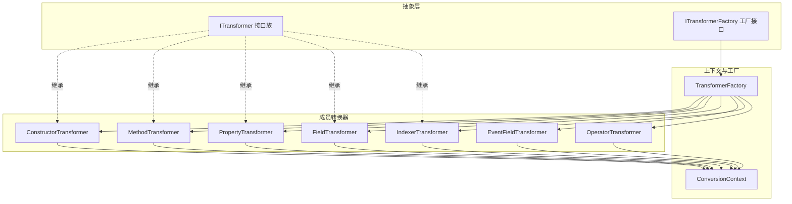
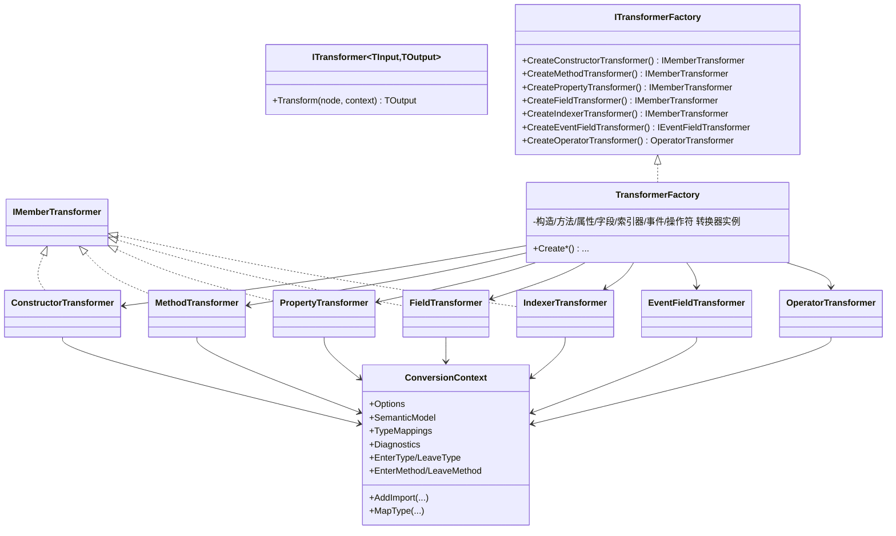
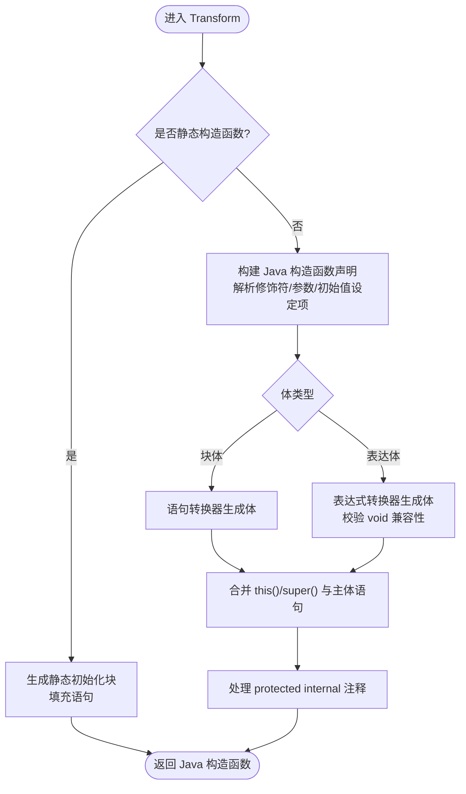
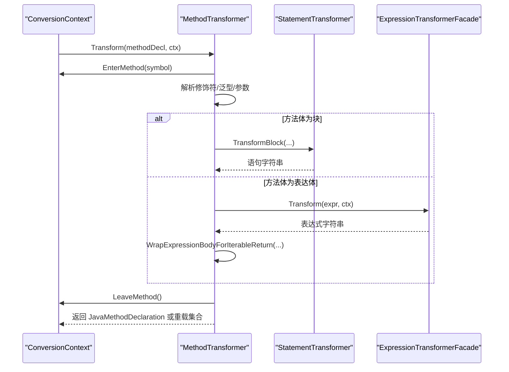
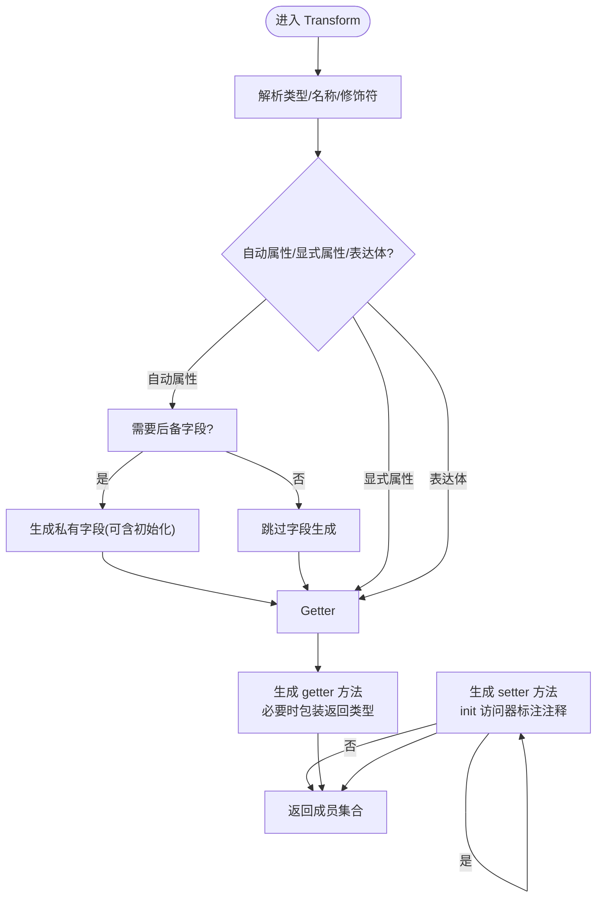
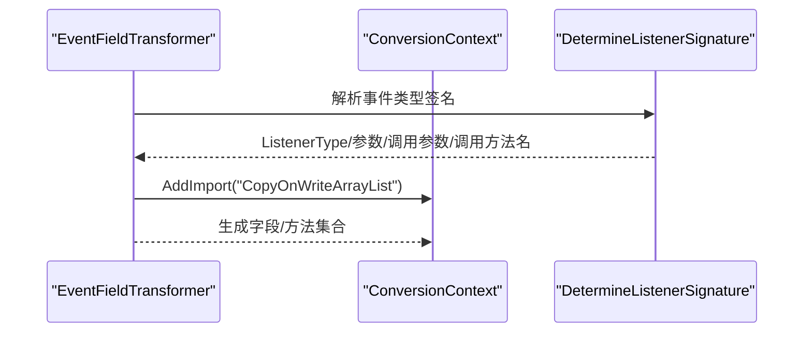
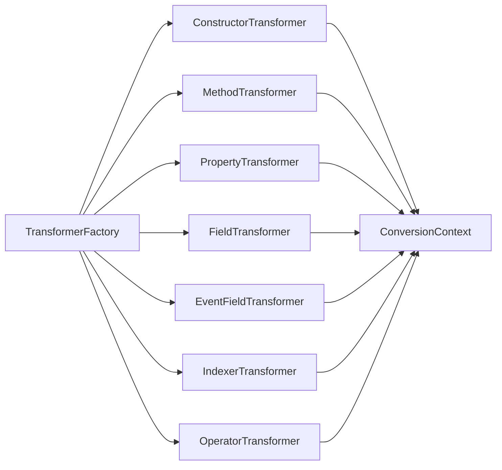

# 成员转换器

<cite>
**本文档引用的文件**
- [ITransformer.cs](file://src/CSharpToJava.Core/Abstractions/ITransformer.cs)
- [ITransformerFactory.cs](file://src/CSharpToJava.Core/Abstractions/ITransformerFactory.cs)
- [TransformerFactory.cs](file://src/CSharpToJava.Core/Transformers/TransformerFactory.cs)
- [ConstructorTransformer.cs](file://src/CSharpToJava.Core/Transformers/Member/ConstructorTransformer.cs)
- [MethodTransformer.cs](file://src/CSharpToJava.Core/Transformers/Member/MethodTransformer.cs)
- [PropertyTransformer.cs](file://src/CSharpToJava.Core/Transformers/Member/PropertyTransformer.cs)
- [FieldTransformer.cs](file://src/CSharpToJava.Core/Transformers/Member/FieldTransformer.cs)
- [EventFieldTransformer.cs](file://src/CSharpToJava.Core/Transformers/Member/EventFieldTransformer.cs)
- [IndexerTransformer.cs](file://src/CSharpToJava.Core/Transformers/Member/IndexerTransformer.cs)
- [OperatorTransformer.cs](file://src/CSharpToJava.Core/Transformers/Member/OperatorTransformer.cs)
- [ConversionContext.cs](file://src/CSharpToJava.Core/Context/ConversionContext.cs)
- [PropertyAssignmentAsSubExpressionTests.cs](file://tests/CSharpToJava.Tests/PropertyAssignmentAsSubExpressionTests.cs)
</cite>

## 目录
1. [简介](#简介)
2. [项目结构](#项目结构)
3. [核心组件](#核心组件)
4. [架构总览](#架构总览)
5. [详细组件分析](#详细组件分析)
6. [依赖关系分析](#依赖关系分析)
7. [性能考量](#性能考量)
8. [故障排查指南](#故障排查指南)
9. [结论](#结论)
10. [附录](#附录)

## 简介
本文件系统性阐述 cs2j 的成员转换器体系，覆盖构造函数、方法、属性、字段、事件（事件字段与显式事件）、索引器以及操作符（重载与隐式/显式转换）等成员类型的转换实现。文档重点说明：
- 各成员转换器的设计原理与控制流
- 访问器转换、事件监听器生成、索引器方法化、操作符重载映射
- 签名匹配、修饰符转换、默认值处理、静态/泛型/匿名方法等特殊场景
- 基于真实测试用例的转换示例路径
- 扩展接口与自定义成员处理指南

## 项目结构
成员转换器位于核心库的“Transformers/Member”目录，配合抽象接口与工厂模式统一管理。转换器通过上下文对象获取语义模型、类型映射、诊断信息与导入集合，并在必要时调用语句/表达式转换器完成体块或表达式的生成。

图表来源
- [ITransformer.cs:12-61](file://src/CSharpToJava.Core/Abstractions/ITransformer.cs#L12-L61)
- [ITransformerFactory.cs:8-32](file://src/CSharpToJava.Core/Abstractions/ITransformerFactory.cs#L8-L32)
- [TransformerFactory.cs:16-58](file://src/CSharpToJava.Core/Transformers/TransformerFactory.cs#L16-L58)
- [ConversionContext.cs:14-28](file://src/CSharpToJava.Core/Context/ConversionContext.cs#L14-L28)

章节来源
- [ITransformer.cs:12-61](file://src/CSharpToJava.Core/Abstractions/ITransformer.cs#L12-L61)
- [ITransformerFactory.cs:8-32](file://src/CSharpToJava.Core/Abstractions/ITransformerFactory.cs#L8-L32)
- [TransformerFactory.cs:16-58](file://src/CSharpToJava.Core/Transformers/TransformerFactory.cs#L16-L58)
- [ConversionContext.cs:14-28](file://src/CSharpToJava.Core/Context/ConversionContext.cs#L14-L28)

## 核心组件
- ITransformer 与派生接口族：定义输入/输出约定，统一转换器契约。
- ITransformerFactory：集中创建与复用成员转换器实例，确保无状态与可注入。
- ConversionContext：贯穿转换过程的状态容器，提供类型映射、导入管理、诊断收集、方法/类型栈、合成记录存储等能力。
- 成员转换器：各司其职，分别处理构造函数、方法、属性、字段、事件、索引器与操作符。

章节来源
- [ITransformer.cs:12-61](file://src/CSharpToJava.Core/Abstractions/ITransformer.cs#L12-L61)
- [ITransformerFactory.cs:8-32](file://src/CSharpToJava.Core/Abstractions/ITransformerFactory.cs#L8-L32)
- [TransformerFactory.cs:16-58](file://src/CSharpToJava.Core/Transformers/TransformerFactory.cs#L16-L58)
- [ConversionContext.cs:14-28](file://src/CSharpToJava.Core/Context/ConversionContext.cs#L14-L28)

## 架构总览
成员转换器采用“接口 + 工厂 + 上下文”的分层架构：
- 接口层：约束输入输出与职责边界
- 工厂层：集中创建与缓存转换器实例，便于 DI 与测试替换
- 转换层：基于语义模型与类型映射进行符号解析与代码生成
- 上下文层：跨节点共享状态，协调导入、诊断、合成记录与方法/类型栈

图表来源
- [ITransformer.cs:12-61](file://src/CSharpToJava.Core/Abstractions/ITransformer.cs#L12-L61)
- [ITransformerFactory.cs:8-32](file://src/CSharpToJava.Core/Abstractions/ITransformerFactory.cs#L8-L32)
- [TransformerFactory.cs:16-58](file://src/CSharpToJava.Core/Transformers/TransformerFactory.cs#L16-L58)
- [ConversionContext.cs:14-28](file://src/CSharpToJava.Core/Context/ConversionContext.cs#L14-L28)
- [ConstructorTransformer.cs:15](file://src/CSharpToJava.Core/Transformers/Member/ConstructorTransformer.cs#L15)
- [MethodTransformer.cs:16](file://src/CSharpToJava.Core/Transformers/Member/MethodTransformer.cs#L16)
- [PropertyTransformer.cs:15](file://src/CSharpToJava.Core/Transformers/Member/PropertyTransformer.cs#L15)
- [FieldTransformer.cs:16](file://src/CSharpToJava.Core/Transformers/Member/FieldTransformer.cs#L16)
- [EventFieldTransformer.cs:10](file://src/CSharpToJava.Core/Transformers/Member/EventFieldTransformer.cs#L10)
- [IndexerTransformer.cs:14](file://src/CSharpToJava.Core/Transformers/Member/IndexerTransformer.cs#L14)
- [OperatorTransformer.cs:15](file://src/CSharpToJava.Core/Transformers/Member/OperatorTransformer.cs#L15)

## 详细组件分析

### 构造函数转换器（ConstructorTransformer）
- 特殊处理
  - 静态构造函数：转换为 Java 静态初始化块，避免生成带参数的构造函数
  - this/基类调用：仅在存在实参时生成 this()/super() 调用；空参 super() 隐式省略
  - 参数修饰符：params 转为变长参数；this 关键字用于构造函数链，体首处理
  - 访问级别：protected internal 统一映射为 protected，并附加注释说明
- 修饰符映射：internal → public；extern → native；unsafe → 忽略
- 体处理：支持块体与表达体；表达体需满足 void 兼容性（赋值/调用/递增/递减）

图表来源
- [ConstructorTransformer.cs:17-142](file://src/CSharpToJava.Core/Transformers/Member/ConstructorTransformer.cs#L17-L142)

章节来源
- [ConstructorTransformer.cs:17-142](file://src/CSharpToJava.Core/Transformers/Member/ConstructorTransformer.cs#L17-L142)

### 方法转换器（MethodTransformer）
- 方法体与返回值
  - yield return：转换为列表累积模式，必要时推断匿名类型记录名
  - 表达体方法：对 IEnumerable/ICollection/IList 返回类型进行 Stream/数组包装适配
  - 异步方法：Task<T> → CompletableFuture<T>
  - Dispose → close：AutoCloseable.close 声明 throws Exception
  - using 语句：为 try-with-resources 可能抛出的异常添加 throws Exception
- 修饰符与签名
  - protected internal → protected；virtual/override/new/abstract/sealed → 对应 Java 修饰符
  - 泛型擦除冲突：同名但类型参数数量不同的重载通过后缀区分
  - 静态方法签名中引用外部类类型参数：提升为方法级类型参数
- 参数与默认值
  - ref/out：转为 Holder 包装（struct 且不可重新赋值的只读 ref 可保持原类型）
  - params：变长参数
  - this：扩展方法首参保留，按需移除以生成实例方法
  - 默认值：不支持，生成重载以模拟（抽象方法不生成重载）
- 特殊方法
  - Clone：抽象 Clone → concrete 实现并调用 super.clone()
  - extern：P/Invoke 无 Java 等价，生成抛出 UnsupportedOperationException 的桩并去除 native 修饰

图表来源
- [MethodTransformer.cs:18-324](file://src/CSharpToJava.Core/Transformers/Member/MethodTransformer.cs#L18-L324)

章节来源
- [MethodTransformer.cs:18-324](file://src/CSharpToJava.Core/Transformers/Member/MethodTransformer.cs#L18-L324)

### 属性转换器（PropertyTransformer）
- 自动属性 vs 显式属性
  - 自动属性：生成私有后备字段（含默认值），仅生成 getter（或 getter/setter）
  - 显式属性：无后备字段，访问器内直接操作现有字段
  - 表达体属性：非自动属性，仅生成 getter
- 访问器可见性
  - 若属性无显式访问修饰符，默认 public
  - 访问器可覆盖属性级修饰符，最终确保单一可见修饰符（private > protected > public）
- 只读/只写
  - 只读：仅有 getter
  - 只写：仅有 setter（init 访问器标注注释）
- 返回类型包装
  - 表达体 getter：对 IEnumerable/ICollection/IList 返回类型进行 Stream/数组包装适配

图表来源
- [PropertyTransformer.cs:17-227](file://src/CSharpToJava.Core/Transformers/Member/PropertyTransformer.cs#L17-L227)

章节来源
- [PropertyTransformer.cs:17-227](file://src/CSharpToJava.Core/Transformers/Member/PropertyTransformer.cs#L17-L227)

### 字段转换器（FieldTransformer）
- 多变量声明：逐个生成 Java 字段，共享注释
- 修饰符映射：const/readonly/static → static/final；volatile 非基本类型建议使用原子引用
- 初始化器适配
  - 集合/列表接口：数组初始化器适配为 Arrays.asList 或流包装
  - IEnumerable/ICollection/IList：数组初始化器转换为流收集
  - 顺序依赖：检测同一声明中后续初始化对先前变量的引用并给出注释提示
- 固定缓冲区：不支持，报错

章节来源
- [FieldTransformer.cs:18-153](file://src/CSharpToJava.Core/Transformers/Member/FieldTransformer.cs#L18-L153)

### 事件转换器（EventFieldTransformer）
- 事件字段与显式事件
  - 事件字段：为每个变量生成监听器集合字段与 add/remove/fire 方法
  - 显式事件：翻译 accessor 体（add/remove），保持参数名为 handler
- 监听器签名推断
  - System.EventHandler：二参 BiConsumer<Object,Object> 或带泛型参数
  - System.Action：Runnable 或 Consumer<T>
  - 其他委托：根据 invoke 方法签名映射 SAM 名称（run/accept/valueXXX）
- 并发安全
  - 使用 CopyOnWriteArrayList 保证并发访问安全
- 可见性规则
  - fireXxx 方法可见性依据事件声明修饰符计算（private/internal/protected/public）
  - static 修饰符从事件声明传播

图表来源
- [EventFieldTransformer.cs:12-127](file://src/CSharpToJava.Core/Transformers/Member/EventFieldTransformer.cs#L12-L127)
- [EventFieldTransformer.cs:152-267](file://src/CSharpToJava.Core/Transformers/Member/EventFieldTransformer.cs#L152-L267)

章节来源
- [EventFieldTransformer.cs:12-127](file://src/CSharpToJava.Core/Transformers/Member/EventFieldTransformer.cs#L12-L127)
- [EventFieldTransformer.cs:152-267](file://src/CSharpToJava.Core/Transformers/Member/EventFieldTransformer.cs#L152-L267)

### 索引器转换器（IndexerTransformer）
- 方法命名策略
  - get：始终为 get
  - set：若包含 Map 接口则为 put，否则为 set
- 多参数索引器
  - 体内方括号语法规范化：[a,b] → [a][b]
- 访问器修饰符
  - 优先使用访问器自身修饰符，否则回退到索引器修饰符
- init 访问器
  - 与 set 访问器类似，但标注“仅在构造期间调用”的注释
- 接口上下文
  - 仅当存在显式 set 访问器时才生成 setter

章节来源
- [IndexerTransformer.cs:16-154](file://src/CSharpToJava.Core/Transformers/Member/IndexerTransformer.cs#L16-L154)

### 操作符转换器（OperatorTransformer）
- 运算符重载
  - 将 C# 运算符方法（如 op_Addition）映射为 Java 静态方法（如 add）
  - 支持 checked 变体后缀以避免重名
  - 语义模型与语法回退路径一致性校验，发出警告而非崩溃
- 隐式/显式转换
  - 将 conversion operator 转换为 toXxx 静态方法
- 泛型提升
  - 静态方法签名中引用外部类类型参数时，提升为方法级类型参数

章节来源
- [OperatorTransformer.cs:52-136](file://src/CSharpToJava.Core/Transformers/Member/OperatorTransformer.cs#L52-L136)
- [OperatorTransformer.cs:142-208](file://src/CSharpToJava.Core/Transformers/Member/OperatorTransformer.cs#L142-L208)

## 依赖关系分析
- 耦合与内聚
  - 成员转换器均依赖 ConversionContext 提供类型映射、导入与诊断；彼此低耦合
  - 工厂集中创建与复用转换器实例，避免重复分配
- 外部依赖
  - 语义模型（SemanticModel）用于类型解析与符号查询
  - 类型映射服务负责 C# 类型到 Java 类型的映射与导入管理
- 循环依赖
  - 无循环依赖：转换器仅向下依赖上下文与工具类，不反向依赖调用者

图表来源
- [TransformerFactory.cs:16-58](file://src/CSharpToJava.Core/Transformers/TransformerFactory.cs#L16-L58)
- [ConversionContext.cs:14-28](file://src/CSharpToJava.Core/Context/ConversionContext.cs#L14-L28)

章节来源
- [TransformerFactory.cs:16-58](file://src/CSharpToJava.Core/Transformers/TransformerFactory.cs#L16-L58)
- [ConversionContext.cs:14-28](file://src/CSharpToJava.Core/Context/ConversionContext.cs#L14-L28)

## 性能考量
- 无状态设计：转换器为无状态对象，由工厂单例持有，减少 GC 压力
- 语义模型复用：通过上下文统一获取 SemanticModel，避免重复解析
- 导入去重：Import 集合去重与包级导入校验，避免冗余 import
- 方法签名优化：静态方法签名中引用外部类类型参数时提前提升，减少运行期装箱与反射

## 故障排查指南
- 属性赋值作为子表达式
  - 症状：属性赋值表达式被错误转换为 void 的 setter 调用
  - 修复：将 setter 提升为前置语句，返回临时变量
  - 测试参考：[PropertyAssignmentAsSubExpressionTests.cs:16-154](file://tests/CSharpToJava.Tests/PropertyAssignmentAsSubExpressionTests.cs#L16-L154)
- 泛型擦除冲突
  - 症状：重载方法因擦除后签名相同导致编译错误
  - 修复：自动添加后缀以区分不同泛型参数数目的重载
  - 参考：方法转换器中对类型擦除冲突的检测与处理
- 事件可见性与并发
  - 症状：fire 方法可见性不符合预期或线程安全问题
  - 修复：按事件修饰符计算 fire 可见性；使用 CopyOnWriteArrayList
  - 参考：事件转换器中的可见性计算与并发集合使用

章节来源
- [PropertyAssignmentAsSubExpressionTests.cs:16-154](file://tests/CSharpToJava.Tests/PropertyAssignmentAsSubExpressionTests.cs#L16-L154)
- [MethodTransformer.cs:44-63](file://src/CSharpToJava.Core/Transformers/Member/MethodTransformer.cs#L44-L63)
- [EventFieldTransformer.cs:87-150](file://src/CSharpToJava.Core/Transformers/Member/EventFieldTransformer.cs#L87-L150)

## 结论
成员转换器体系以清晰的接口与工厂模式为基础，结合上下文状态与类型映射服务，实现了从 C# 成员到 Java 成员的高保真转换。针对静态/泛型/默认值/事件/索引器/操作符等复杂场景，转换器提供了稳健的处理策略与可观测的诊断信息，既保证了转换正确性，也为扩展与定制留出了接口。

## 附录

### 扩展接口与自定义成员处理指南
- 新增成员转换器
  - 实现 IMemberTransformer 接口，或根据具体需求实现 IEventFieldTransformer/OperatorTransformer
  - 在 TransformerFactory 中注册实例，确保单例与可注入
- 自定义签名与修饰符映射
  - 在转换器内部维护映射表或规则，结合 ConversionContext 的类型映射与导入管理
- 事件与索引器的特殊处理
  - 事件：遵循监听器签名推断与并发安全原则
  - 索引器：注意多参数与接口上下文下的方法命名与可见性
- 操作符与默认值
  - 操作符：提供符号到 Java 方法名的映射，必要时处理 checked 变体
  - 默认值：通过生成重载模拟，避免在抽象方法上生成重载

章节来源
- [ITransformer.cs:59](file://src/CSharpToJava.Core/Abstractions/ITransformer.cs#L59)
- [ITransformerFactory.cs:8-32](file://src/CSharpToJava.Core/Abstractions/ITransformerFactory.cs#L8-L32)
- [TransformerFactory.cs:16-58](file://src/CSharpToJava.Core/Transformers/TransformerFactory.cs#L16-L58)