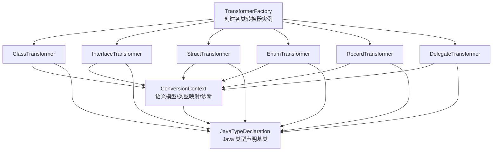
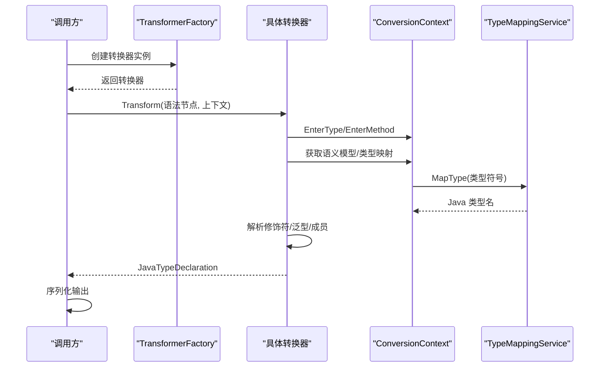
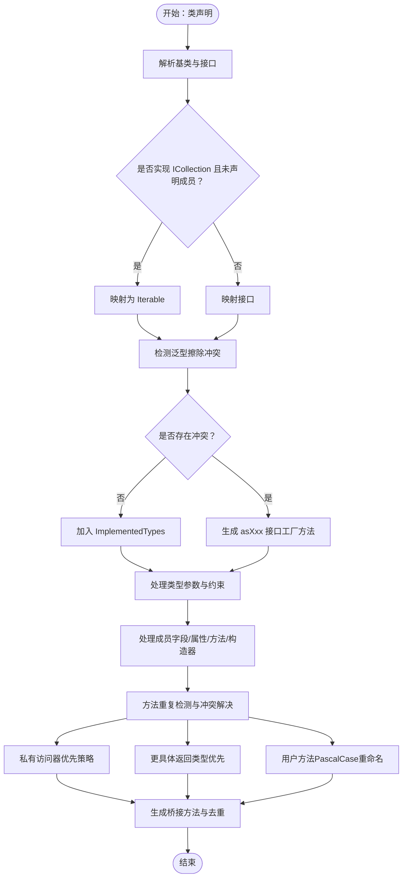
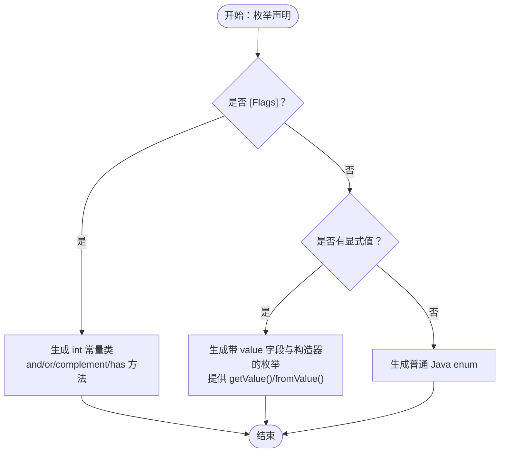
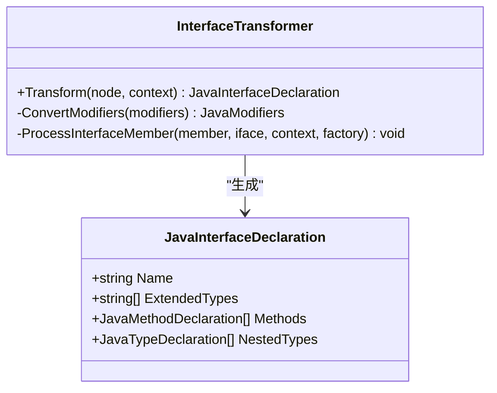
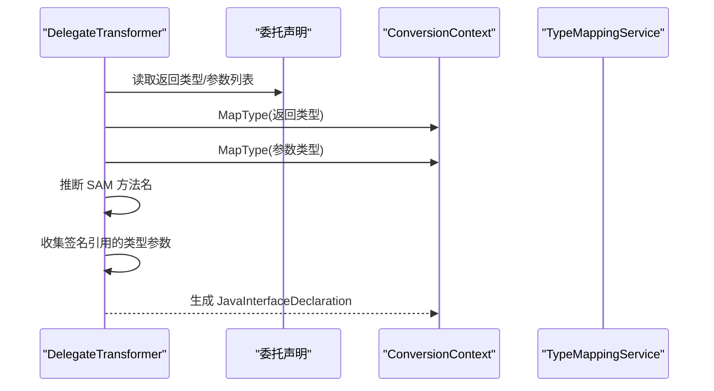
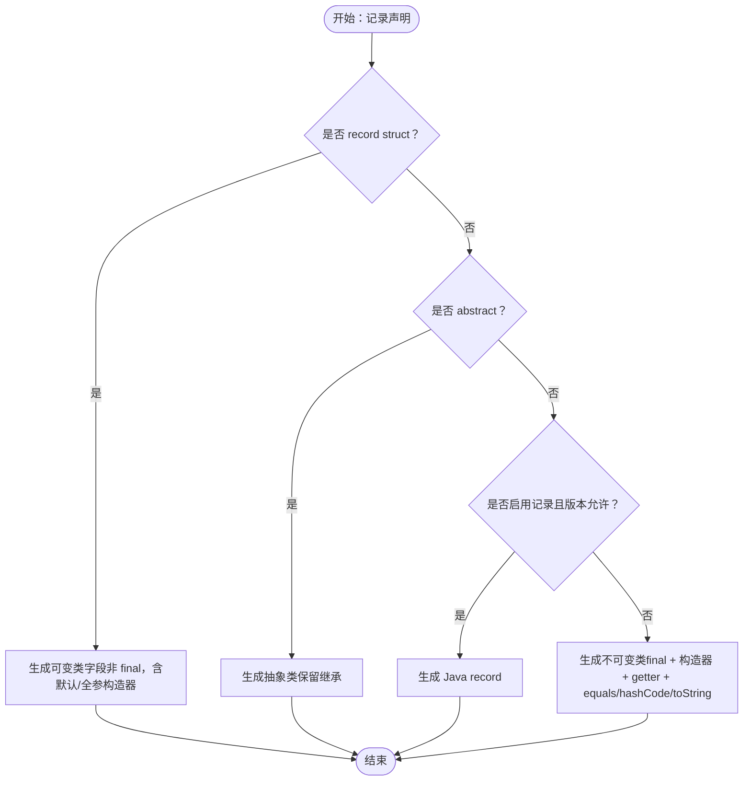
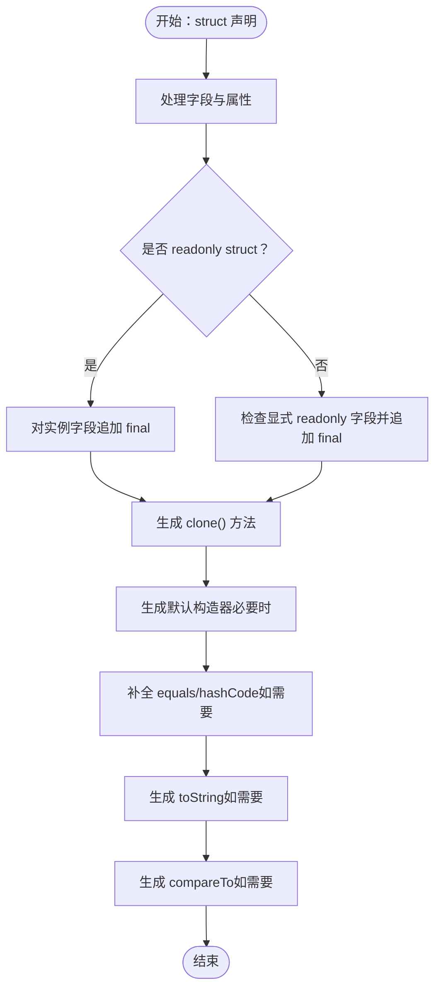
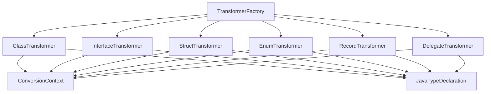

# 类型转换器

<cite>
**本文档引用的文件**
- [ClassTransformer.cs](file://src/CSharpToJava.Core/Transformers/Type/ClassTransformer.cs)
- [EnumTransformer.cs](file://src/CSharpToJava.Core/Transformers/Type/EnumTransformer.cs)
- [InterfaceTransformer.cs](file://src/CSharpToJava.Core/Transformers/Type/InterfaceTransformer.cs)
- [DelegateTransformer.cs](file://src/CSharpToJava.Core/Transformers/Type/DelegateTransformer.cs)
- [RecordTransformer.cs](file://src/CSharpToJava.Core/Transformers/Type/RecordTransformer.cs)
- [StructTransformer.cs](file://src/CSharpToJava.Core/Transformers/Type/StructTransformer.cs)
- [TransformerFactory.cs](file://src/CSharpToJava.Core/Transformers/TransformerFactory.cs)
- [ConversionContext.cs](file://src/CSharpToJava.Core/Context/ConversionContext.cs)
- [ITransformer.cs](file://src/CSharpToJava.Core/Abstractions/ITransformer.cs)
- [JavaTypeDeclaration.cs](file://src/CSharpToJava.Core/Java/JavaTypeDeclaration.cs)
- [JavaMemberDeclaration.cs](file://src/CSharpToJava.Core/Java/JavaMemberDeclaration.cs)
- [PropertyTransformer.cs](file://src/CSharpToJava.Core/Transformers/Member/PropertyTransformer.cs)
- [EnumTransformerTests.cs](file://tests/CSharpToJava.Tests/EnumTransformerTests.cs)
- [RecordTransformerTests.cs](file://tests/CSharpToJava.Tests/RecordTransformerTests.cs)
- [StructTransformerTests.cs](file://tests/CSharpToJava.Tests/StructTransformerTests.cs)
- [MethodPropertyNameCollisionTests.cs](file://tests/CSharpToJava.Tests/MethodPropertyNameCollisionTests.cs)
</cite>

## 更新摘要
**变更内容**
- 新增方法重复检测和冲突解决机制章节，详细说明类转换器如何处理属性访问器与用户定义方法的命名冲突
- 更新类转换器章节，增加方法重复检测算法的详细说明
- 新增冲突解决策略的实现细节，包括PascalCase重命名机制
- 添加相关测试用例说明和示例

## 目录
1. [简介](#简介)
2. [项目结构](#项目结构)
3. [核心组件](#核心组件)
4. [架构总览](#架构总览)
5. [详细组件分析](#详细组件分析)
6. [依赖分析](#依赖分析)
7. [性能考虑](#性能考虑)
8. [故障排除指南](#故障排除指南)
9. [结论](#结论)
10. [附录](#附录)

## 简介
本文件系统性阐述 cs2j 类型转换器的实现架构与设计原理，覆盖以下转换器：
- ClassTransformer：类转换器
- EnumTransformer：枚举转换器
- InterfaceTransformer：接口转换器
- DelegateTransformer：委托转换器
- RecordTransformer：记录转换器
- StructTransformer：结构体转换器

文档重点说明各转换器在继承关系转换、泛型类型映射、属性与字段转换、方法签名调整等方面的处理逻辑；解释名称冲突解决、修饰符映射与访问级别转换机制；并提供来自测试用例的具体示例路径，展示从 C# 到 Java 的类型转换过程。最后给出扩展指南与类型映射规则定制方法。

## 项目结构
类型转换器位于 CSharpToJava.Core/Transformers/Type 目录下，采用"单一职责"的设计：每个类型转换器负责一种 C# 类型到 Java 的转换策略。转换器通过工厂模式统一创建，并由转换上下文提供语义模型、类型映射服务与诊断收集能力。

**图表来源**
- [TransformerFactory.cs:16-58](file://src/CSharpToJava.Core/Transformers/TransformerFactory.cs#L16-L58)
- [ConversionContext.cs:14-233](file://src/CSharpToJava.Core/Context/ConversionContext.cs#L14-L233)
- [JavaTypeDeclaration.cs:8-383](file://src/CSharpToJava.Core/Java/JavaTypeDeclaration.cs#L8-L383)

**章节来源**
- [TransformerFactory.cs:16-58](file://src/CSharpToJava.Core/Transformers/TransformerFactory.cs#L16-L58)
- [ConversionContext.cs:14-233](file://src/CSharpToJava.Core/Context/ConversionContext.cs#L14-L233)
- [JavaTypeDeclaration.cs:8-383](file://src/CSharpToJava.Core/Java/JavaTypeDeclaration.cs#L8-L383)

## 核心组件
- ITransformer 接口族：定义了转换器的统一契约，包括 ITypeTransformer、IMemberTransformer、IDelegateTransformer 等，确保不同类型的转换器遵循一致的输入输出规范。
- JavaTypeDeclaration 及其派生类：封装 Java 类型声明的通用结构（名称、注解、修饰符、类型参数等），并提供序列化输出能力。
- ConversionContext：贯穿转换流程的状态容器，提供语义模型、类型映射服务、诊断收集、导入管理、别名解析等功能。
- TransformerFactory：集中管理所有转换器实例，采用静态单例模式，确保无状态转换器可复用。

**章节来源**
- [ITransformer.cs:12-86](file://src/CSharpToJava.Core/Abstractions/ITransformer.cs#L12-L86)
- [JavaTypeDeclaration.cs:8-383](file://src/CSharpToJava.Core/Java/JavaTypeDeclaration.cs#L8-L383)
- [ConversionContext.cs:14-233](file://src/CSharpToJava.Core/Context/ConversionContext.cs#L14-L233)
- [TransformerFactory.cs:16-58](file://src/CSharpToJava.Core/Transformers/TransformerFactory.cs#L16-L58)

## 架构总览
类型转换器的控制流如下：工厂创建具体转换器 → 上下文进入类型/方法栈 → 转换器读取语法树与语义模型 → 映射类型与修饰符 → 生成 Java 类型声明对象 → 输出字符串。

**图表来源**
- [TransformerFactory.cs:16-58](file://src/CSharpToJava.Core/Transformers/TransformerFactory.cs#L16-L58)
- [ConversionContext.cs:113-127](file://src/CSharpToJava.Core/Context/ConversionContext.cs#L113-L127)
- [ConversionContext.cs:190-194](file://src/CSharpToJava.Core/Context/ConversionContext.cs#L190-L194)

## 详细组件分析

### 类转换器（ClassTransformer）
- 继承关系转换
  - 基类映射：跳过 System.Object，忽略 System.MarshalByRefObject；若符号为抽象类，则追加 Java 抽象修饰符。
  - 接口映射：仅映射直接实现接口，避免重复；对 ICollection<T> 在未声明其成员时替换为 Iterable，以避免强制实现完整 Collection 合约。
  - 泛型擦除冲突检测：当父子类实现相同原始接口（如 Comparator<String> 与 Comparator<Integer>）时，将后续冲突接口提取为工厂方法（如 asIntegerComparator）。
- 泛型类型映射
  - 类型参数约束传播：从符号中读取约束并映射到 Java 边界（where T : IBound → extends Bound）。
  - 声明处协变/逆变：C# 的 out/in 在 Java 中以使用站点变型表达，转换器发出警告。
- 属性与字段转换
  - 自动属性：优先保留显式非私有方法，避免与私有自动属性 setter 冲突。
  - 部分类型去重：基于参数签名（含 ref/out/in 修饰）进行去重，保留重载。
- 方法签名调整
  - 桥接方法：针对 Comparable、Cloneable、Iterator、Iterable 等添加桥接方法，消除 Java 语言差异。
  - 构造器去重：适配器委托构造器（this(new ...)）在 Java 中不必要，直接丢弃；对仅委托的构造器也安全丢弃。
- 访问级别与修饰符
  - C# internal → Java public；protected internal → 仅 protected；无访问修饰符的顶级类型默认 public。
  - new 成员 → Java Override 修饰；virtual 在 Java 默认可用。
- 名称冲突与边界处理
  - 对 CompareTo/Clone 等方法存在桥接冲突时进行移除与替换。
  - 对类型擦除冲突的泛型接口采用工厂方法替代。
- **方法重复检测与冲突解决机制**（**更新**）
  - **重复检测算法**：类转换器实现了 AddMethodIfNotDuplicateInternal 方法，用于检测和处理方法重复冲突。该算法通过擦除签名（ErasedParamSig）来识别具有相同名称和参数类型的冲突方法。
  - **冲突解决策略**：
    - **私有访问器优先**：当自动属性的私有 setter 与用户定义的非私有方法发生冲突时，保留用户定义的方法，替换自动属性的私有 setter。
    - **更具体返回类型优先**：当存在同名方法但返回类型不同时，优先保留更具体的（非 Object）返回类型方法。
    - **用户定义方法重命名**：当用户定义方法与自动生成的属性访问器发生冲突时，将用户定义方法重命名为 PascalCase（例如 setFirstEdge → SetFirstEdge），同时保留自动生成的访问器。
  - **IsAutoGenerated 标志**：属性转换器为自动生成的 getter/setter 设置 IsAutoGenerated = true 标志，类转换器在冲突检测时使用此标志来区分用户定义方法和自动生成的访问器。
  - **唯一性保证**：重命名后的用户定义方法会检查是否与其他方法冲突，如果冲突会在末尾添加数字后缀（如 SetFirstEdge_1）确保唯一性。

**图表来源**
- [ClassTransformer.cs:46-175](file://src/CSharpToJava.Core/Transformers/Type/ClassTransformer.cs#L46-L175)
- [ClassTransformer.cs:177-189](file://src/CSharpToJava.Core/Transformers/Type/ClassTransformer.cs#L177-L189)
- [ClassTransformer.cs:204-229](file://src/CSharpToJava.Core/Transformers/Type/ClassTransformer.cs#L204-L229)
- [ClassTransformer.cs:414-444](file://src/CSharpToJava.Core/Transformers/Type/ClassTransformer.cs#L414-L444)
- [ClassTransformer.cs:618-690](file://src/CSharpToJava.Core/Transformers/Type/ClassTransformer.cs#L618-L690)

**章节来源**
- [ClassTransformer.cs:16-445](file://src/CSharpToJava.Core/Transformers/Type/ClassTransformer.cs#L16-L445)
- [ClassTransformer.cs:618-690](file://src/CSharpToJava.Core/Transformers/Type/ClassTransformer.cs#L618-L690)

### 枚举转换器（EnumTransformer）
- [Flags] 枚举
  - 生成包含 public static final int 常量的 Java 类，提供 and/or/complement/has 等工具方法，bitwise 运算直接映射。
  - 注册为 Flags 枚举，使类型引用返回 int，并注册全限定名以覆盖跨命名空间场景。
- 显式值枚举
  - 若成员带显式值（含十六进制/二进制），生成带构造函数与 value 字段的枚举，提供 getValue()/fromValue()。
  - 注册为显式值枚举，用于转换器在 cast 场景选择合适的方法。
- 普通枚举
  - 直接生成 Java enum；底层类型警告（Java 枚举底层固定 int）。
- 修饰符映射
  - C# internal → Java public；无访问修饰符默认 public。

**图表来源**
- [EnumTransformer.cs:26-138](file://src/CSharpToJava.Core/Transformers/Type/EnumTransformer.cs#L26-L138)
- [EnumTransformer.cs:140-262](file://src/CSharpToJava.Core/Transformers/Type/EnumTransformer.cs#L140-L262)

**章节来源**
- [EnumTransformer.cs:16-318](file://src/CSharpToJava.Core/Transformers/Type/EnumTransformer.cs#L16-L318)
- [EnumTransformerTests.cs:8-200](file://tests/CSharpToJava.Tests/EnumTransformerTests.cs#L8-L200)

### 接口转换器（InterfaceTransformer）
- 基接口映射：遍历 BaseList，映射到 Java 接口的 extends 列表。
- 泛型与约束：复制类转换器的约束传播逻辑，处理 out/in 声明处变型。
- 成员处理
  - 方法：C# 8 默认接口方法（带实现）映射为 Java default 方法；属性/索引器生成抽象方法（无实现）。
  - 事件：仅生成 add/remove 抽象监听器签名，不生成回发方法或后备字段。
  - 嵌套类型：接口内嵌类/接口/枚举均标记为 static。
- 修饰符映射：internal → public；无访问修饰符默认 public。

**图表来源**
- [InterfaceTransformer.cs:16-79](file://src/CSharpToJava.Core/Transformers/Type/InterfaceTransformer.cs#L16-L79)
- [JavaTypeDeclaration.cs:208-264](file://src/CSharpToJava.Core/Java/JavaTypeDeclaration.cs#L208-L264)

**章节来源**
- [InterfaceTransformer.cs:14-230](file://src/CSharpToJava.Core/Transformers/Type/InterfaceTransformer.cs#L14-L230)

### 委托转换器（DelegateTransformer）
- SAM（单一抽象方法）推断：根据返回类型与参数数量推断方法名（Runnable/Consumer/Supplier/Function）。
- 泛型与类型参数
  - 仅包含签名中实际引用的类型参数（过滤未使用的外部类型参数）。
  - 委托自身类型参数与外层类型参数分别处理，out/in 声明处变型转为使用站点变型。
- 参数与返回类型映射：处理 ref/out/in 与 params；预定义 void 返回映射为 Java void。
- 注解：标注 @FunctionalInterface。

**图表来源**
- [DelegateTransformer.cs:17-114](file://src/CSharpToJava.Core/Transformers/Type/DelegateTransformer.cs#L17-L114)
- [ConversionContext.cs:190-194](file://src/CSharpToJava.Core/Context/ConversionContext.cs#L190-L194)

**章节来源**
- [DelegateTransformer.cs:15-239](file://src/CSharpToJava.Core/Transformers/Type/DelegateTransformer.cs#L15-L239)

### 记录转换器（RecordTransformer）
- 记录结构体（record struct）
  - 生成等效的可变 Java 类（非 final 字段），包含默认无参构造器与全参构造器；实现指定接口。
- 抽象记录
  - Java 记录不可为 abstract，故回退为抽象类，保留继承语义。
- 普通记录
  - 当目标 Java 版本支持且启用记录时，生成 Java record；否则生成不可变类（final 类 + 构造器 + getter + equals/hashCode/toString）。
- 关键处理
  - 位置参数 → Java record 组件；组件名进行 Java 关键字转义。
  - 基类/接口：记录可 extends 与 implements。
  - 深度数组 equals/hashCode：使用 Arrays.deepEquals/deepHashCode。
  - 自定义构造器保留；额外成员（属性/方法/运算符）按需生成。

**图表来源**
- [RecordTransformer.cs:17-52](file://src/CSharpToJava.Core/Transformers/Type/RecordTransformer.cs#L17-L52)
- [RecordTransformer.cs:54-117](file://src/CSharpToJava.Core/Transformers/Type/RecordTransformer.cs#L54-L117)
- [RecordTransformer.cs:119-229](file://src/CSharpToJava.Core/Transformers/Type/RecordTransformer.cs#L119-L229)
- [RecordTransformer.cs:427-504](file://src/CSharpToJava.Core/Transformers/Type/RecordTransformer.cs#L427-L504)

**章节来源**
- [RecordTransformer.cs:15-524](file://src/CSharpToJava.Core/Transformers/Type/RecordTransformer.cs#L15-L524)
- [RecordTransformerTests.cs:13-200](file://tests/CSharpToJava.Tests/RecordTransformerTests.cs#L13-L200)

### 结构体转换器（StructTransformer）
- 值语义近似
  - 生成 Java 类，字段默认 public；readonly struct 对实例字段追加 final；对显式 readonly 字段同样追加 final。
  - 强制实现 Cloneable，并生成 clone() 方法以近似 C# 值拷贝语义；对只读结构尝试构造器拷贝，否则逐字段复制。
- 默认构造器
  - C# struct 总有隐式无参构造器；当存在显式有参构造器而缺失无参构造器时，生成默认构造器；若包含结构体字段且未初始化，按 Java 语义初始化为默认值。
- equals/hashCode/toString
  - 若生成了 valueEquals 或 equals(Object)，则补全 hashCode；若无 toString 则生成。
- 比较桥接
  - 若方法体引用 .compareTo()，则生成 compareTo() 并实现 Comparable<T>。
- 字段初始化
  - 静态字段对象初始化移入静态初始化块；实例字段多条初始化语句以注释形式内联到字段初始化器。

**图表来源**
- [StructTransformer.cs:23-103](file://src/CSharpToJava.Core/Transformers/Type/StructTransformer.cs#L23-L103)
- [StructTransformer.cs:126-142](file://src/CSharpToJava.Core/Transformers/Type/StructTransformer.cs#L126-L142)
- [StructTransformer.cs:148-196](file://src/CSharpToJava.Core/Transformers/Type/StructTransformer.cs#L148-L196)
- [StructTransformer.cs:205-292](file://src/CSharpToJava.Core/Transformers/Type/StructTransformer.cs#L205-L292)
- [StructTransformer.cs:437-505](file://src/CSharpToJava.Core/Transformers/Type/StructTransformer.cs#L437-L505)
- [StructTransformer.cs:507-543](file://src/CSharpToJava.Core/Transformers/Type/StructTransformer.cs#L507-L543)
- [StructTransformer.cs:545-581](file://src/CSharpToJava.Core/Transformers/Type/StructTransformer.cs#L545-L581)

**章节来源**
- [StructTransformer.cs:14-835](file://src/CSharpToJava.Core/Transformers/Type/StructTransformer.cs#L14-L835)
- [StructTransformerTests.cs:13-200](file://tests/CSharpToJava.Tests/StructTransformerTests.cs#L13-L200)

## 依赖分析
- 耦合关系
  - 所有类型转换器依赖 ConversionContext 提供的语义模型与类型映射服务。
  - 转换器之间通过 TransformerFactory 协调创建，避免循环依赖。
  - JavaTypeDeclaration 作为统一输出载体，被各类转换器生成并序列化。
- 可能的循环依赖
  - 转换器内部相互调用（如 RecordTransformer 使用成员转换器）属于正常协作，不构成循环依赖。
- 外部依赖
  - Roslyn 语法与语义模型；Java 标准库类型映射；测试框架（xUnit）。

**图表来源**
- [TransformerFactory.cs:16-58](file://src/CSharpToJava.Core/Transformers/TransformerFactory.cs#L16-L58)
- [JavaTypeDeclaration.cs:8-383](file://src/CSharpToJava.Core/Java/JavaTypeDeclaration.cs#L8-L383)

**章节来源**
- [TransformerFactory.cs:16-58](file://src/CSharpToJava.Core/Transformers/TransformerFactory.cs#L16-L58)
- [JavaTypeDeclaration.cs:8-383](file://src/CSharpToJava.Core/Java/JavaTypeDeclaration.cs#L8-L383)

## 性能考虑
- 语义模型缓存：ConversionContext 维护 TypeCache 与 ImportedTypes，减少重复映射与导入计算。
- 去重与冲突检测：类转换器对方法/构造器进行擦除签名去重，避免重复桥接与构造器。
- 生成器优化：接口转换器提前创建 TransformerFactory 实例，避免每次成员处理时重复分配。
- 测试驱动验证：通过测试用例覆盖边界场景（泛型擦除、关键字转义、深数组 equals/hashCode 等），确保生成代码正确性与性能。

## 故障排除指南
- 泛型擦除冲突
  - 现象：子类实现与父类相同的原始泛型接口（如 Comparator<String> 与 Comparator<Integer>）。
  - 处理：类转换器自动提取冲突接口为工厂方法（如 asIntegerComparator），不在实现列表中重复出现。
  - 参考：[ClassTransformer.cs:123-169](file://src/CSharpToJava.Core/Transformers/Type/ClassTransformer.cs#L123-L169)
- 访问修饰符丢失
  - 现象：C# internal 默认映射为 Java public；protected internal 仅保留 protected。
  - 处理：检查转换器修饰符映射逻辑，确认无访问修饰符的顶级类型默认 public。
  - 参考：[ClassTransformer.cs:585-604](file://src/CSharpToJava.Core/Transformers/Type/ClassTransformer.cs#L585-L604)
- 构造器重复或冲突
  - 现象：适配器委托构造器或仅委托的构造器导致重复。
  - 处理：类转换器丢弃适配器委托构造器；对仅委托的构造器安全丢弃。
  - 参考：[ClassTransformer.cs:667-688](file://src/CSharpToJava.Core/Transformers/Type/ClassTransformer.cs#L667-L688)
- equals/hashCode 不一致
  - 现象：生成了 valueEquals 或 equals(Object) 但缺少 hashCode。
  - 处理：结构体转换器自动补全 hashCode；记录转换器生成 equals/hashCode。
  - 参考：[StructTransformer.cs:437-472](file://src/CSharpToJava.Core/Transformers/Type/StructTransformer.cs#L437-L472)
- 关键字冲突
  - 现象：记录组件名为 Java 关键字（如 default、class）。
  - 处理：记录转换器对组件名进行转义（如 defaultValue、classValue）。
  - 参考：[RecordTransformerTests.cs:104-117](file://tests/CSharpToJava.Tests/RecordTransformerTests.cs#L104-L117)
- **方法重复检测与冲突解决**（**新增**）
  - 现象：用户定义的方法与自动生成的属性访问器发生命名冲突，之前可能被静默丢弃。
  - 处理：类转换器通过 IsAutoGenerated 标志识别冲突类型，采用以下策略：
    - 用户定义方法重命名为 PascalCase（如 setFirstEdge → SetFirstEdge）
    - 保留自动生成的属性访问器（如 setFirstEdge）
    - 确保重命名后的名称唯一性，必要时添加数字后缀
  - 参考：[ClassTransformer.cs:618-690](file://src/CSharpToJava.Core/Transformers/Type/ClassTransformer.cs#L618-L690)
  - 测试用例：[MethodPropertyNameCollisionTests.cs:27-65](file://tests/CSharpToJava.Tests/MethodPropertyNameCollisionTests.cs#L27-65)

**章节来源**
- [ClassTransformer.cs:123-169](file://src/CSharpToJava.Core/Transformers/Type/ClassTransformer.cs#L123-L169)
- [ClassTransformer.cs:585-604](file://src/CSharpToJava.Core/Transformers/Type/ClassTransformer.cs#L585-L604)
- [ClassTransformer.cs:667-688](file://src/CSharpToJava.Core/Transformers/Type/ClassTransformer.cs#L667-L688)
- [StructTransformer.cs:437-472](file://src/CSharpToJava.Core/Transformers/Type/StructTransformer.cs#L437-L472)
- [RecordTransformerTests.cs:104-117](file://tests/CSharpToJava.Tests/RecordTransformerTests.cs#L104-L117)
- [ClassTransformer.cs:618-690](file://src/CSharpToJava.Core/Transformers/Type/ClassTransformer.cs#L618-L690)
- [MethodPropertyNameCollisionTests.cs:27-65](file://tests/CSharpToJava.Tests/MethodPropertyNameCollisionTests.cs#L27-65)

## 结论
cs2j 类型转换器通过清晰的接口契约、统一的上下文与工厂模式，实现了从 C# 到 Java 的高保真类型转换。各转换器针对语言差异（如接口默认方法、泛型变型、值类型语义、记录特性等）提供了稳健的适配策略，并通过测试用例持续验证边界场景。类转换器新增的方法重复检测与冲突解决机制进一步增强了转换的可靠性，确保用户定义的方法不会因与自动生成的属性访问器名称冲突而被静默丢弃。开发者可基于现有转换器扩展新的类型映射规则，或在 ConversionContext 中定制类型映射服务以满足特定需求。

## 附录
- 扩展指南
  - 新增类型转换器：实现 ITypeTransformer 接口，在 TransformerFactory 中注册实例；在转换流程中通过工厂创建并使用。
  - 定制类型映射：在 ConversionContext 的 TypeMappingService 中注册映射规则，或通过 TypeMappingRegistry 扩展内置映射。
  - 诊断与日志：利用 ConversionContext.Diagnostics 记录警告与错误，便于定位问题。
  - **方法重复检测扩展**：如需扩展冲突检测机制，可在 JavaMemberDeclaration 中添加更多标识字段，并在类转换器中实现相应的检测逻辑。
- 示例参考
  - 枚举转换示例：[EnumTransformerTests.cs:8-200](file://tests/CSharpToJava.Tests/EnumTransformerTests.cs#L8-L200)
  - 记录转换示例：[RecordTransformerTests.cs:13-200](file://tests/CSharpToJava.Tests/RecordTransformerTests.cs#L13-L200)
  - 结构体转换示例：[StructTransformerTests.cs:13-200](file://tests/CSharpToJava.Tests/StructTransformerTests.cs#L13-L200)
  - **方法重复检测示例**：[MethodPropertyNameCollisionTests.cs:27-65](file://tests/CSharpToJava.Tests/MethodPropertyNameCollisionTests.cs#L27-65)