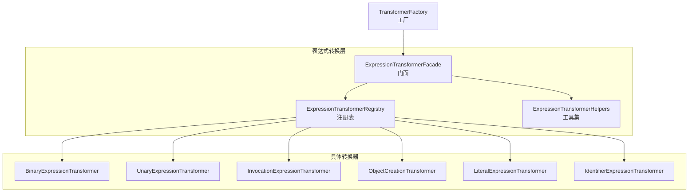
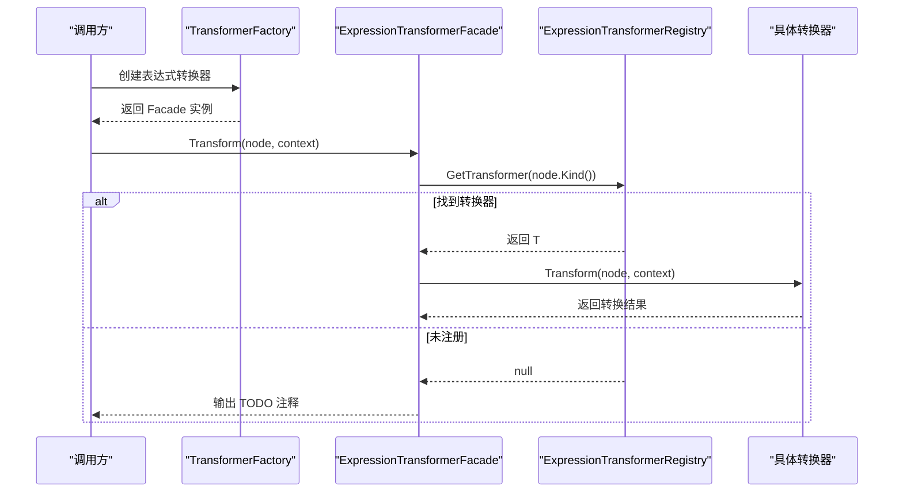
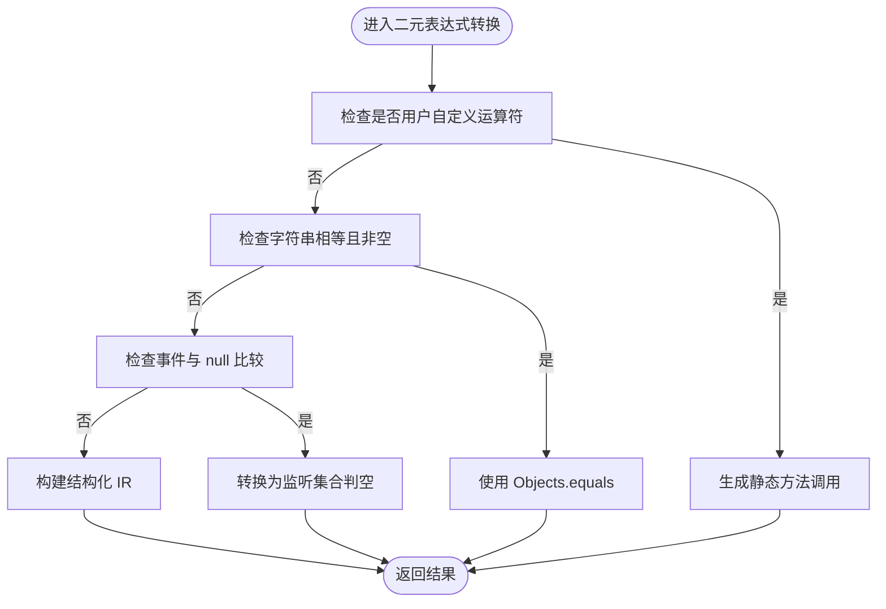
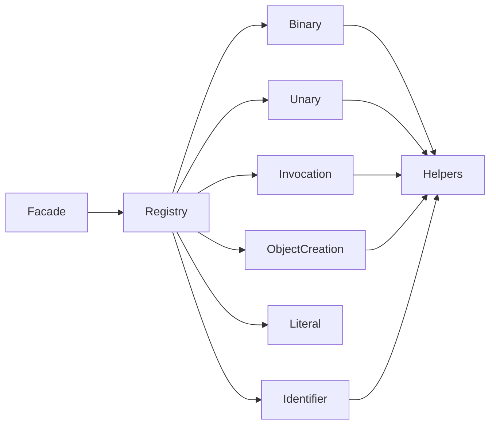

# 表达式转换器

<cite>
**本文档引用的文件**
- [ExpressionTransformerFacade.cs](file://src/CSharpToJava.Core/Transformers/Expression/ExpressionTransformerFacade.cs)
- [ExpressionTransformerRegistry.cs](file://src/CSharpToJava.Core/Transformers/Expression/ExpressionTransformerRegistry.cs)
- [BinaryExpressionTransformer.cs](file://src/CSharpToJava.Core/Transformers/Expression/Transformers/BinaryExpressionTransformer.cs)
- [UnaryExpressionTransformer.cs](file://src/CSharpToJava.Core/Transformers/Expression/Transformers/UnaryExpressionTransformer.cs)
- [InvocationExpressionTransformer.cs](file://src/CSharpToJava.Core/Transformers/Expression/Transformers/InvocationExpressionTransformer.cs)
- [ObjectCreationTransformer.cs](file://src/CSharpToJava.Core/Transformers/Expression/Transformers/ObjectCreationTransformer.cs)
- [LiteralExpressionTransformer.cs](file://src/CSharpToJava.Core/Transformers/Expression/Transformers/LiteralExpressionTransformer.cs)
- [IdentifierExpressionTransformer.cs](file://src/CSharpToJava.Core/Transformers/Expression/Transformers/IdentifierExpressionTransformer.cs)
- [ExpressionTransformerHelpers.cs](file://src/CSharpToJava.Core/Transformers/Expression/Utilities/ExpressionTransformerHelpers.cs)
- [TransformerFactory.cs](file://src/CSharpToJava.Core/Transformers/TransformerFactory.cs)
- [StructTransformer.cs](file://src/CSharpToJava.Core/Transformers/Type/StructTransformer.cs)
</cite>

## 目录
1. [简介](#简介)
2. [项目结构](#项目结构)
3. [核心组件](#核心组件)
4. [架构总览](#架构总览)
5. [详细组件分析](#详细组件分析)
6. [依赖关系分析](#依赖关系分析)
7. [性能考虑](#性能考虑)
8. [故障排除指南](#故障排除指南)
9. [结论](#结论)
10. [附录](#附录)

## 简介
本技术文档系统性阐述 cs2j 表达式转换器的架构与实现，重点覆盖以下方面：
- 门面模式与注册表：ExpressionTransformerFacade 门面与 ExpressionTransformerRegistry 注册表如何协同工作，实现表达式转换器的动态发现与分发。
- 转换器实现细节：二元表达式、一元表达式、方法调用、对象创建、字面量、标识符与成员访问等转换逻辑。
- 优先级处理、类型推导与语法树重构：如何在转换过程中处理运算符优先级、用户自定义运算符、事件比较、字符串相等等特殊情形。
- 常见问题与解决方案：操作符重载映射、泛型约束处理、装箱拆箱与数组流式转换。
- 扩展指南与最佳实践：如何新增表达式转换器、遵循命名与映射约定、避免常见陷阱。

## 项目结构
cs2j 的表达式转换体系位于 CSharpToJava.Core/Transformers/Expression 目录下，采用“门面 + 注册表 + 多个具体转换器”的分层设计：
- 门面层：ExpressionTransformerFacade 提供统一入口，负责将语法节点分派给具体转换器，并支持结构化 IR 输出与类型解析。
- 注册表层：ExpressionTransformerRegistry 通过静态构造与特性自动发现机制，集中管理所有表达式转换器的注册与查询。
- 具体转换器：按表达式类型划分（二元、一元、调用、对象创建、字面量、标识符等），每个转换器实现 IIRExpressionTransformer 接口以支持结构化 IR。
- 工具与辅助：ExpressionTransformerHelpers 提供通用工具（类型适配、数组流式转换、静态接收者推断等）。

图表来源
- [ExpressionTransformerFacade.cs:12-86](file://src/CSharpToJava.Core/Transformers/Expression/ExpressionTransformerFacade.cs#L12-L86)
- [ExpressionTransformerRegistry.cs:17-147](file://src/CSharpToJava.Core/Transformers/Expression/ExpressionTransformerRegistry.cs#L17-L147)
- [BinaryExpressionTransformer.cs:14-42](file://src/CSharpToJava.Core/Transformers/Expression/Transformers/BinaryExpressionTransformer.cs#L14-L42)
- [UnaryExpressionTransformer.cs:14-33](file://src/CSharpToJava.Core/Transformers/Expression/Transformers/UnaryExpressionTransformer.cs#L14-L33)
- [InvocationExpressionTransformer.cs:15-24](file://src/CSharpToJava.Core/Transformers/Expression/Transformers/InvocationExpressionTransformer.cs#L15-L24)
- [ObjectCreationTransformer.cs:17-32](file://src/CSharpToJava.Core/Transformers/Expression/Transformers/ObjectCreationTransformer.cs#L17-L32)
- [LiteralExpressionTransformer.cs:16-32](file://src/CSharpToJava.Core/Transformers/Expression/Transformers/LiteralExpressionTransformer.cs#L16-L32)
- [IdentifierExpressionTransformer.cs:15-28](file://src/CSharpToJava.Core/Transformers/Expression/Transformers/IdentifierExpressionTransformer.cs#L15-L28)
- [TransformerFactory.cs:56-58](file://src/CSharpToJava.Core/Transformers/TransformerFactory.cs#L56-L58)

章节来源
- [ExpressionTransformerFacade.cs:12-86](file://src/CSharpToJava.Core/Transformers/Expression/ExpressionTransformerFacade.cs#L12-L86)
- [ExpressionTransformerRegistry.cs:17-147](file://src/CSharpToJava.Core/Transformers/Expression/ExpressionTransformerRegistry.cs#L17-L147)
- [TransformerFactory.cs:56-58](file://src/CSharpToJava.Core/Transformers/TransformerFactory.cs#L56-L58)

## 核心组件
- ExpressionTransformerFacade（门面）
  - 统一入口：根据 SyntaxKind 查找对应转换器；若未注册则输出 TODO 注释。
  - 结构化 IR：支持 TransformToIR 返回 JavaExpression，无法直接 IR 时包装为 JavaRawExpression 并补充类型信息。
  - 条件访问：TransformWhenNotNull 支持 ?. 链式调用的特殊处理，含 LINQ 方法流式改写与属性到方法映射。
  - 类型解析：ResolveJavaType 使用 Roslyn SemanticModel 解析表达式的 Java 类型。
- ExpressionTransformerRegistry（注册表）
  - 自动发现：扫描带 [TransformerRegistration] 特性的转换器类型，触发其静态构造完成注册。
  - 内联处理器：对缺失专用转换器的 SyntaxKind（如元组、出参声明、ref 表达式等）提供委托式内联处理。
  - 去重警告：重复注册在调试构建中发出警告。
- ExpressionTransformerHelpers（工具集）
  - 数值类型适配：在赋值、索引、参数传递等场景进行显式数值转换或字面量重写。
  - 数组与集合：生成 Arrays.stream/boxed/collect 等组合，支持不同 Java primitive 数组的兼容策略。
  - 静态接收者：推断静态调用目标类型并生成 Java 类型引用，剥离泛型参数。
  - 字面量与原始字符串：处理 C# 11 原始字符串、UTF-8 字面量等。

章节来源
- [ExpressionTransformerFacade.cs:28-86](file://src/CSharpToJava.Core/Transformers/Expression/ExpressionTransformerFacade.cs#L28-L86)
- [ExpressionTransformerRegistry.cs:24-122](file://src/CSharpToJava.Core/Transformers/Expression/ExpressionTransformerRegistry.cs#L24-L122)
- [ExpressionTransformerHelpers.cs:35-114](file://src/CSharpToJava.Core/Transformers/Expression/Utilities/ExpressionTransformerHelpers.cs#L35-L114)

## 架构总览
表达式转换的控制流如下：
- TransformerFactory 将请求委派给 ExpressionTransformerFacade.Instance。
- Facade 从 ExpressionTransformerRegistry 查询对应转换器。
- 若存在专用转换器，调用其 Transform 或 TransformToIR；否则回退到字符串路径并包装为 IR。
- 对于条件访问（?.），Facade 的 TransformWhenNotNull 递归处理链式成员绑定、调用与索引，并在必要时构建 Java Stream 管道。

图表来源
- [TransformerFactory.cs:56-58](file://src/CSharpToJava.Core/Transformers/TransformerFactory.cs#L56-L58)
- [ExpressionTransformerFacade.cs:28-39](file://src/CSharpToJava.Core/Transformers/Expression/ExpressionTransformerFacade.cs#L28-L39)
- [ExpressionTransformerRegistry.cs:146-147](file://src/CSharpToJava.Core/Transformers/Expression/ExpressionTransformerRegistry.cs#L146-L147)

## 详细组件分析

### 二元表达式转换器（BinaryExpressionTransformer）
- 功能要点
  - 支持加减乘除、取模、比较、逻辑与/或、按位与/或/异或、移位、空合并等。
  - 用户自定义运算符：检测 IMethodSymbol.MethodKind 为 UserDefinedOperator，生成静态方法调用（考虑同名类与包限定）。
  - 字符串相等：非空字符串比较使用 Objects.equals，保持 C# 语义。
  - 事件比较：事件与 null 比较转换为监听集合判空。
  - 运算符优先级：WrapOperandIfNeeded 基于预定义优先级表插入括号。
  - IR 生成：优先返回结构化 JavaBinaryExpression/JavaMethodCallExpression，无法 IR 化时回退字符串。
- 示例路径
  - [二元表达式转换入口:47-71](file://src/CSharpToJava.Core/Transformers/Expression/Transformers/BinaryExpressionTransformer.cs#L47-L71)
  - [用户自定义运算符映射:305-350](file://src/CSharpToJava.Core/Transformers/Expression/Transformers/BinaryExpressionTransformer.cs#L305-L350)
  - [字符串相等处理:152-174](file://src/CSharpToJava.Core/Transformers/Expression/Transformers/BinaryExpressionTransformer.cs#L152-L174)
  - [空合并临时变量策略:433-463](file://src/CSharpToJava.Core/Transformers/Expression/Transformers/BinaryExpressionTransformer.cs#L433-L463)

图表来源
- [BinaryExpressionTransformer.cs:118-195](file://src/CSharpToJava.Core/Transformers/Expression/Transformers/BinaryExpressionTransformer.cs#L118-L195)

章节来源
- [BinaryExpressionTransformer.cs:14-465](file://src/CSharpToJava.Core/Transformers/Expression/Transformers/BinaryExpressionTransformer.cs#L14-L465)

### 一元表达式转换器（UnaryExpressionTransformer）
- 功能要点
  - 支持一元正/负、逻辑非、按位非、前置/后置自增/自减、地址取值与指针解引用。
  - 用户自定义一元运算符：检测并生成静态方法调用。
  - 属性/索引自增：复杂场景下通过预语句提升（hoist）与 setter 调用实现，确保返回旧值或新值语义。
  - 指针与地址：输出警告并保留占位注释，Java 不支持不安全代码。
- 示例路径
  - [后置自增/自减提升策略:256-306](file://src/CSharpToJava.Core/Transformers/Expression/Transformers/UnaryExpressionTransformer.cs#L256-L306)
  - [前置自增/自减提升策略:326-374](file://src/CSharpToJava.Core/Transformers/Expression/Transformers/UnaryExpressionTransformer.cs#L326-L374)
  - [属性增量到 setter 的转换:376-413](file://src/CSharpToJava.Core/Transformers/Expression/Transformers/UnaryExpressionTransformer.cs#L376-L413)
  - [索引增量到 put/set 的转换:415-447](file://src/CSharpToJava.Core/Transformers/Expression/Transformers/UnaryExpressionTransformer.cs#L415-L447)

章节来源
- [UnaryExpressionTransformer.cs:14-631](file://src/CSharpToJava.Core/Transformers/Expression/Transformers/UnaryExpressionTransformer.cs#L14-L631)

### 方法调用表达式转换器（InvocationExpressionTransformer）
- 功能要点
  - nameof：转换为 Java 字符串字面量。
  - ReferenceEquals：转换为 ==。
  - 静态 Equals：使用 Objects.equals。
  - 泛型方法：去除调用点类型参数（Java 不允许在调用点指定类型实参）。
  - 委托调用：识别 DelegateInvoke，映射到 SAM 方法（apply/get/accept/run 等）。
  - 事件调用：同一类内的事件调用转换为 fireXxx(...)。
  - 字符串与集合 API：大量 C# BCL 到 Java JDK/第三方库的映射（如 StringHelper、Path/Paths、Random.Next 等）。
- 示例路径
  - [方法组作为委托值的处理:318-369](file://src/CSharpToJava.Core/Transformers/Expression/Transformers/InvocationExpressionTransformer.cs#L318-L369)
  - [Parallel.Invoke 映射:490-500](file://src/CSharpToJava.Core/Transformers/Expression/Transformers/InvocationExpressionTransformer.cs#L490-L500)
  - [Dictionary.Values/Keys 映射:478-481](file://src/CSharpToJava.Core/Transformers/Expression/Transformers/InvocationExpressionTransformer.cs#L478-L481)

章节来源
- [InvocationExpressionTransformer.cs:15-800](file://src/CSharpToJava.Core/Transformers/Expression/Transformers/InvocationExpressionTransformer.cs#L15-L800)

### 对象创建表达式转换器（ObjectCreationTransformer）
- 功能要点
  - new T()：泛型约束处理，无构造约束时回退到 Object()。
  - KeyValuePair 映射：Map.Entry 通过 AbstractMap.SimpleEntry 实现。
  - 异常映射：Exception/ApplicationException → RuntimeException。
  - 函数式接口：委托构造转换为方法引用/lambda。
  - 集合构造：数组参数的包装与收集（Arrays.asList/boxed/collect）。
  - 特殊构造：Rectangle 等类型构造器的参数重排。
- 示例路径
  - [Map.Entry 构造映射:247-276](file://src/CSharpToJava.Core/Transformers/Expression/Transformers/ObjectCreationTransformer.cs#L247-L276)
  - [异常构造映射:278-288](file://src/CSharpToJava.Core/Transformers/Expression/Transformers/ObjectCreationTransformer.cs#L278-L288)
  - [数组到集合包装:447-503](file://src/CSharpToJava.Core/Transformers/Expression/Transformers/ObjectCreationTransformer.cs#L447-L503)

章节来源
- [ObjectCreationTransformer.cs:17-1164](file://src/CSharpToJava.Core/Transformers/Expression/Transformers/ObjectCreationTransformer.cs#L17-L1164)

### 字面量表达式转换器（LiteralExpressionTransformer）
- 功能要点
  - 数值字面量：处理 f/d/m 后缀、UL/lu、大整数溢出（BigInteger）、数字分隔符版本兼容。
  - 字符串字面量：原始字符串（C# 11）→ Java 文本块；verbatim/$@ → 转义处理。
  - UTF-8 字面量：编码为 byte[]。
- 示例路径
  - [数值字面量后缀处理:59-114](file://src/CSharpToJava.Core/Transformers/Expression/Transformers/LiteralExpressionTransformer.cs#L59-L114)
  - [原始字符串与 verbatim 字符串:116-166](file://src/CSharpToJava.Core/Transformers/Expression/Transformers/LiteralExpressionTransformer.cs#L116-L166)
  - [UTF-8 字面量到字节数组:180-187](file://src/CSharpToJava.Core/Transformers/Expression/Transformers/LiteralExpressionTransformer.cs#L180-L187)

章节来源
- [LiteralExpressionTransformer.cs:16-213](file://src/CSharpToJava.Core/Transformers/Expression/Transformers/LiteralExpressionTransformer.cs#L16-L213)

### 标识符与成员访问转换器（IdentifierExpressionTransformer）
- 功能要点
  - LINQ let 变量别名：QueryLetAliases 替换。
  - out/ref 参数：通过 .value 访问持有者。
  - 属性访问：生成 getter()；赋值左侧生成驼峰字段名以便 AssignmentTransformer 转换为 setter。
  - 事件访问：同一类内事件与 null 比较转换为监听集合判空，事件调用转换为 fireXxx(...)。
  - 方法组：非调用上下文生成 Java 方法引用；EventHandler 兼容场景生成显式 lambda。
  - 静态常量：C# 类名形式的 double.MaxValue → Java Double.MAX_VALUE。
- 示例路径
  - [事件访问与 fire 方法:266-316](file://src/CSharpToJava.Core/Transformers/Expression/Transformers/IdentifierExpressionTransformer.cs#L266-L316)
  - [方法组到方法引用:318-369](file://src/CSharpToJava.Core/Transformers/Expression/Transformers/IdentifierExpressionTransformer.cs#L318-L369)
  - [静态常量映射:737-752](file://src/CSharpToJava.Core/Transformers/Expression/Transformers/IdentifierExpressionTransformer.cs#L737-L752)

章节来源
- [IdentifierExpressionTransformer.cs:15-830](file://src/CSharpToJava.Core/Transformers/Expression/Transformers/IdentifierExpressionTransformer.cs#L15-L830)

### 门面与注册表协作流程
- 门面负责：
  - 分派与回退：找不到转换器时输出 TODO 注释。
  - IR 与类型：TransformToIR 优先返回结构化 IR，否则包装为 JavaRawExpression 并设置 ResolvedType。
  - 条件访问：TransformWhenNotNull 递归处理 MemberBinding/Invocation/MemberAccess/ElementAccess，并在必要时构建 Stream 管道。
- 注册表负责：
  - 自动发现：扫描 [TransformerRegistration] 类型，触发静态构造注册。
  - 内联处理器：对缺失专用转换器的 SyntaxKind 提供委托式处理（如元组、出参声明、ref 表达式、栈分配数组等）。
- 示例路径
  - [门面 TransformToIR 与类型解析:50-86](file://src/CSharpToJava.Core/Transformers/Expression/ExpressionTransformerFacade.cs#L50-L86)
  - [条件访问链式处理:97-209](file://src/CSharpToJava.Core/Transformers/Expression/ExpressionTransformerFacade.cs#L97-L209)
  - [注册表自动发现与内联处理器:24-122](file://src/CSharpToJava.Core/Transformers/Expression/ExpressionTransformerRegistry.cs#L24-L122)

章节来源
- [ExpressionTransformerFacade.cs:12-239](file://src/CSharpToJava.Core/Transformers/Expression/ExpressionTransformerFacade.cs#L12-L239)
- [ExpressionTransformerRegistry.cs:17-167](file://src/CSharpToJava.Core/Transformers/Expression/ExpressionTransformerRegistry.cs#L17-L167)

## 依赖关系分析
- 组件耦合
  - Facade 与 Registry：强耦合（Facade 依赖 Registry 的查询能力）。
  - Registry 与各转换器：弱耦合（通过反射与特性发现，减少硬编码依赖）。
  - 转换器与 Helpers：广泛依赖（类型适配、数组/集合流式转换、静态接收者推断）。
- 外部依赖
  - Roslyn 语义模型：用于符号解析、类型推断、ConvertedType 使用。
  - Java 导入管理：通过 ConversionContext.AddImport 注入必要的包导入。
- 循环依赖
  - 未发现循环依赖迹象；转换器之间通过 Facade/Registry 协作，避免直接互相引用。

图表来源
- [ExpressionTransformerFacade.cs:28-39](file://src/CSharpToJava.Core/Transformers/Expression/ExpressionTransformerFacade.cs#L28-L39)
- [ExpressionTransformerRegistry.cs:17-147](file://src/CSharpToJava.Core/Transformers/Expression/ExpressionTransformerRegistry.cs#L17-L147)
- [ExpressionTransformerHelpers.cs:15-800](file://src/CSharpToJava.Core/Transformers/Expression/Utilities/ExpressionTransformerHelpers.cs#L15-L800)

章节来源
- [ExpressionTransformerFacade.cs:12-239](file://src/CSharpToJava.Core/Transformers/Expression/ExpressionTransformerFacade.cs#L12-L239)
- [ExpressionTransformerRegistry.cs:17-167](file://src/CSharpToJava.Core/Transformers/Expression/ExpressionTransformerRegistry.cs#L17-L167)
- [ExpressionTransformerHelpers.cs:15-800](file://src/CSharpToJava.Core/Transformers/Expression/Utilities/ExpressionTransformerHelpers.cs#L15-L800)

## 性能考虑
- 结构化 IR 优先：在可能的情况下返回 JavaExpression，有助于后续优化与诊断。
- 临时变量与 hoist：空合并、属性/索引自增等场景通过预语句提升避免重复计算与副作用。
- 数组到集合包装：对 primitive 数组采用 IntStream.range 系列替代 Arrays.stream，减少装箱与中间对象。
- 语义模型缓存：尽量复用 SemanticModel 查询结果，避免重复解析。

## 故障排除指南
- 未注册的表达式种类
  - 现象：输出 TODO 注释。
  - 处理：为该 SyntaxKind 添加专用转换器或内联处理器。
  - 参考：[未注册回退路径:30-39](file://src/CSharpToJava.Core/Transformers/Expression/ExpressionTransformerFacade.cs#L30-L39)
- 用户自定义运算符未映射
  - 现象：生成静态方法调用但名称不匹配。
  - 处理：确认 OperatorTransformer 的名称映射一致，或在转换器内部修正。
  - 参考：[用户自定义运算符映射:305-350](file://src/CSharpToJava.Core/Transformers/Expression/Transformers/BinaryExpressionTransformer.cs#L305-L350)
- 事件比较与调用
  - 现象：事件与 null 比较或调用未正确转换。
  - 处理：确保事件在同一类内，且符号解析成功；否则回退到字符串路径。
  - 参考：[事件比较与 fire 方法:204-230](file://src/CSharpToJava.Core/Transformers/Expression/Transformers/UnaryExpressionTransformer.cs#L204-L230)
- 泛型约束与 new()
  - 现象：泛型类型参数 new() 生成编译错误。
  - 处理：根据约束选择 ArrayList 等具体类型进行强制转换。
  - 参考：[泛型约束处理:193-204](file://src/CSharpToJava.Core/Transformers/Expression/Transformers/ObjectCreationTransformer.cs#L193-L204)
- 数组流式转换不兼容
  - 现象：short/byte/char/float/boolean 数组无法使用 Arrays.stream。
  - 处理：使用 IntStream.range 系列或 boxed 流。
  - 参考：[数组到流转换:735-783](file://src/CSharpToJava.Core/Transformers/Expression/Utilities/ExpressionTransformerHelpers.cs#L735-L783)

章节来源
- [ExpressionTransformerFacade.cs:28-39](file://src/CSharpToJava.Core/Transformers/Expression/ExpressionTransformerFacade.cs#L28-L39)
- [BinaryExpressionTransformer.cs:305-350](file://src/CSharpToJava.Core/Transformers/Expression/Transformers/BinaryExpressionTransformer.cs#L305-L350)
- [UnaryExpressionTransformer.cs:204-230](file://src/CSharpToJava.Core/Transformers/Expression/Transformers/UnaryExpressionTransformer.cs#L204-L230)
- [ObjectCreationTransformer.cs:193-204](file://src/CSharpToJava.Core/Transformers/Expression/Transformers/ObjectCreationTransformer.cs#L193-L204)
- [ExpressionTransformerHelpers.cs:735-783](file://src/CSharpToJava.Core/Transformers/Expression/Utilities/ExpressionTransformerHelpers.cs#L735-L783)

## 结论
cs2j 表达式转换器通过门面 + 注册表 + 多转换器的架构，实现了对 C# 表达式的高可扩展、语义准确的 Java 转换。其关键优势在于：
- 动态注册与自动发现，降低维护成本；
- 结构化 IR 与类型解析，便于后续优化；
- 针对用户自定义运算符、事件、字符串与集合 API 的专门处理；
- 丰富的工具集支撑数值类型适配、数组/集合流式转换与静态接收者推断。

## 附录

### 扩展指南与最佳实践
- 新增表达式转换器
  - 实现 IIRExpressionTransformer 接口，提供 Transform 与 TransformToIR。
  - 在静态构造函数中通过 ExpressionTransformerRegistry.Register 完成注册。
  - 使用 [TransformerRegistration] 特性参与自动发现。
  - 参考：[注册表注册接口:130-139](file://src/CSharpToJava.Core/Transformers/Expression/ExpressionTransformerRegistry.cs#L130-L139)
- 命名与映射
  - 使用 TypeMappings 进行方法/成员名映射，避免直接硬编码。
  - 属性访问优先生成 getter()，赋值左侧生成驼峰字段名。
  - 参考：[属性访问映射:598-692](file://src/CSharpToJava.Core/Transformers/Expression/Transformers/IdentifierExpressionTransformer.cs#L598-L692)
- 优先级与括号
  - 使用 WrapOperandIfNeeded 基于运算符优先级插入括号，保证语义正确。
  - 参考：[运算符优先级表:394-431](file://src/CSharpToJava.Core/Transformers/Expression/Transformers/BinaryExpressionTransformer.cs#L394-L431)
- 泛型与装箱拆箱
  - 泛型方法调用点去除类型参数；primitive 数组使用 IntStream.range 或 boxed 流。
  - 参考：[泛型方法调用点处理:202-213](file://src/CSharpToJava.Core/Transformers/Expression/Transformers/InvocationExpressionTransformer.cs#L202-L213)
  - 参考：[数组到流转换:735-783](file://src/CSharpToJava.Core/Transformers/Expression/Utilities/ExpressionTransformerHelpers.cs#L735-L783)
- 操作符重载与事件
  - 用户自定义运算符映射到静态方法；事件与 null 比较转换为监听集合判空。
  - 参考：[事件比较:201-230](file://src/CSharpToJava.Core/Transformers/Expression/Transformers/BinaryExpressionTransformer.cs#L201-L230)
- 类型适配
  - 使用 ExpressionTransformerHelpers.AdaptExpressionToTargetType 在赋值/参数/索引等场景进行显式转换。
  - 参考：[类型适配核心逻辑:72-114](file://src/CSharpToJava.Core/Transformers/Expression/Utilities/ExpressionTransformerHelpers.cs#L72-L114)

章节来源
- [ExpressionTransformerRegistry.cs:130-139](file://src/CSharpToJava.Core/Transformers/Expression/ExpressionTransformerRegistry.cs#L130-L139)
- [IdentifierExpressionTransformer.cs:598-692](file://src/CSharpToJava.Core/Transformers/Expression/Transformers/IdentifierExpressionTransformer.cs#L598-L692)
- [BinaryExpressionTransformer.cs:201-230](file://src/CSharpToJava.Core/Transformers/Expression/Transformers/BinaryExpressionTransformer.cs#L201-L230)
- [InvocationExpressionTransformer.cs:202-213](file://src/CSharpToJava.Core/Transformers/Expression/Transformers/InvocationExpressionTransformer.cs#L202-L213)
- [ExpressionTransformerHelpers.cs:72-114](file://src/CSharpToJava.Core/Transformers/Expression/Utilities/ExpressionTransformerHelpers.cs#L72-L114)