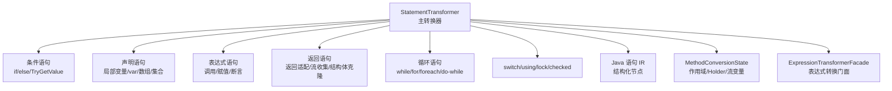
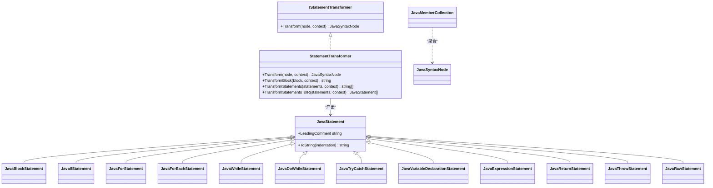
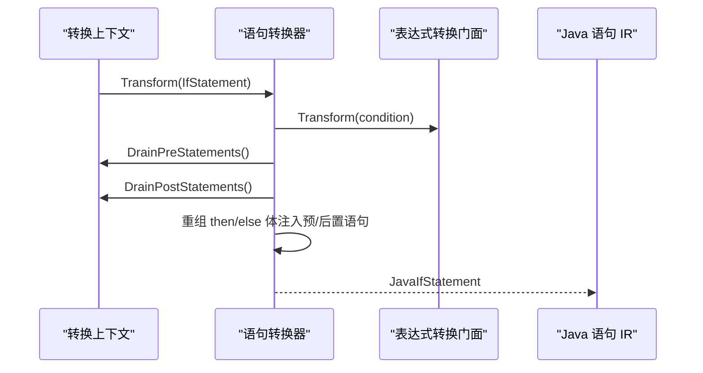
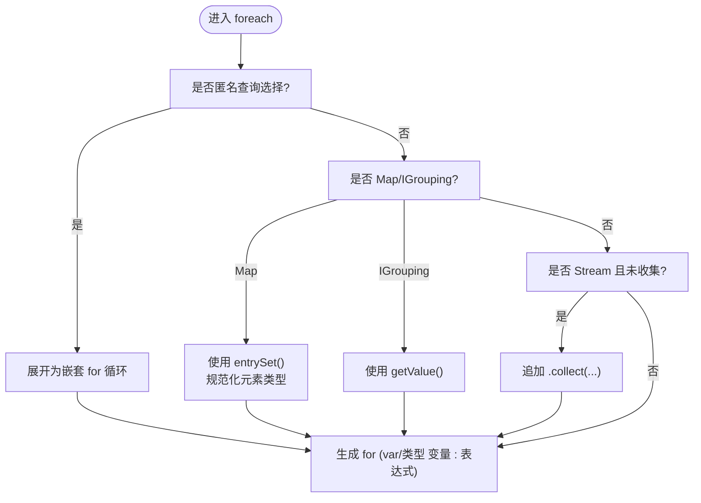
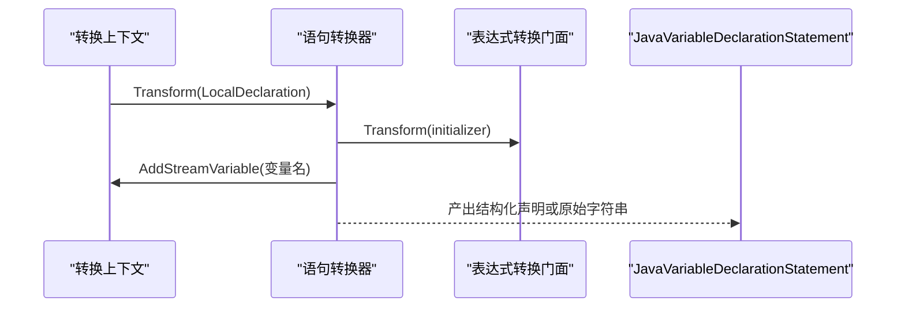
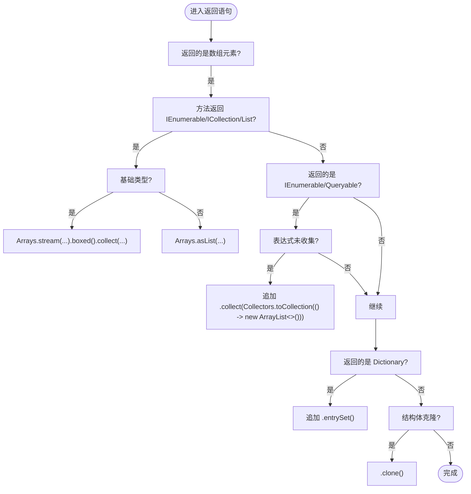
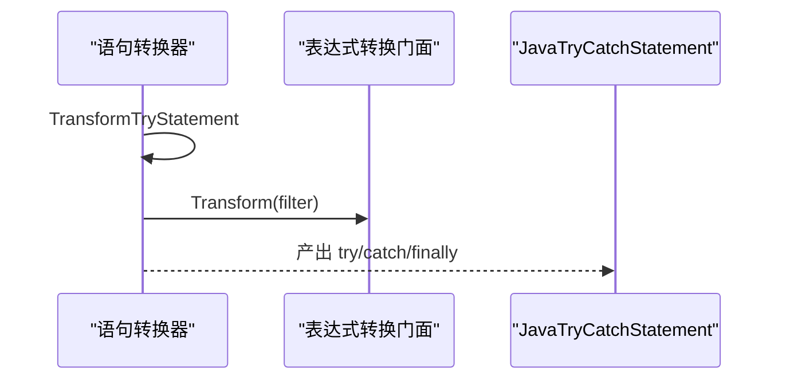
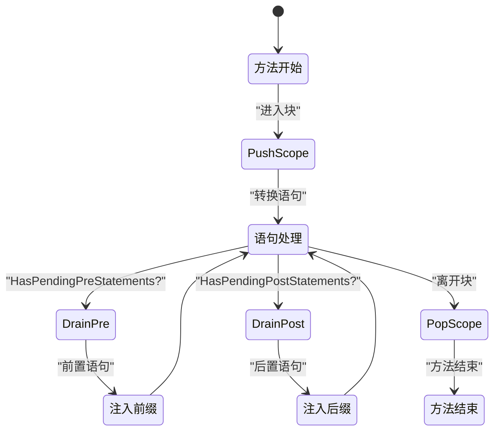
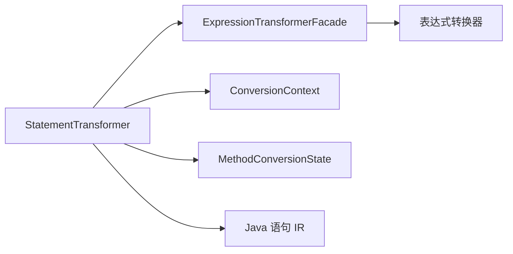

# 语句转换器

<cite>
**本文引用的文件**
- [StatementTransformer.cs](file://src/CSharpToJava.Core/Transformers/Statement/StatementTransformer.cs)
- [StatementTransformer.Conditionals.cs](file://src/CSharpToJava.Core/Transformers/Statement/StatementTransformer.Conditionals.cs)
- [StatementTransformer.Declarations.cs](file://src/CSharpToJava.Core/Transformers/Statement/StatementTransformer.Declarations.cs)
- [StatementTransformer.ExpressionAndReturn.cs](file://src/CSharpToJava.Core/Transformers/Statement/StatementTransformer.ExpressionAndReturn.cs)
- [StatementTransformer.Loops.cs](file://src/CSharpToJava.Core/Transformers/Statement/StatementTransformer.Loops.cs)
- [StatementTransformer.SwitchAndResource.cs](file://src/CSharpToJava.Core/Transformers/Statement/StatementTransformer.SwitchAndResource.cs)
- [StatementTransformer.Utilities.cs](file://src/CSharpToJava.Core/Transformers/Statement/StatementTransformer.Utilities.cs)
- [JavaStatement.cs](file://src/CSharpToJava.Core/Java/JavaStatement.cs)
- [JavaSyntaxNode.cs](file://src/CSharpToJava.Core/Java/JavaSyntaxNode.cs)
- [MethodConversionState.cs](file://src/CSharpToJava.Core/Context/MethodConversionState.cs)
- [ITransformer.cs](file://src/CSharpToJava.Core/Abstractions/ITransformer.cs)
- [README.md](file://README.md)
</cite>

## 目录
1. [简介](#简介)
2. [项目结构](#项目结构)
3. [核心组件](#核心组件)
4. [架构总览](#架构总览)
5. [详细组件分析](#详细组件分析)
6. [依赖关系分析](#依赖关系分析)
7. [性能考量](#性能考量)
8. [故障排查指南](#故障排查指南)
9. [结论](#结论)
10. [附录](#附录)

## 简介
本文件系统性阐述 cs2j 语句转换器的架构与实现，覆盖条件语句、循环语句、声明语句、表达式语句、返回语句、switch 语句、using 语句与异常处理语句的转换逻辑，并深入解析作用域管理、变量声明提升、控制流重构、性能优化与代码质量保障机制。文末提供扩展接口与自定义语句处理指南，帮助开发者在现有框架上进行二次开发。

## 项目结构
语句转换器位于 CSharpToJava.Core 模块下，采用“按功能分组”的文件组织方式：
- StatementTransformer.cs：主入口与通用流程（分支匹配、块转换、注释附加、预/后置语句注入）
- StatementTransformer.Conditionals.cs：if/else、TryGetValue 特例、out/ref 参数条件处理
- StatementTransformer.Declarations.cs：局部变量声明、var 推断、数组与集合初始化、枚举数组默认填充、yield return/break
- StatementTransformer.ExpressionAndReturn.cs：表达式语句、throw、return、Tuple 解构、Debug.Assert、数组排序
- StatementTransformer.Loops.cs：while、for、foreach、do-while、匿名查询展开、流收集策略
- StatementTransformer.SwitchAndResource.cs：switch（含模式匹配降级为 if-else）、try/catch/finally、using、lock、checked/unchecked
- StatementTransformer.Utilities.cs：工具函数（集合类型判断、collect 结尾检测、lambda/方法引用检测、默认值推导、PascalCase）
- JavaStatement.cs：Java 语句 IR（结构化节点），用于下游验证与重写
- JavaSyntaxNode.cs：Java AST 节点基类与成员集合包装
- MethodConversionState.cs：方法级状态（作用域、ref/out Holder、流变量、lambda 捕获等）
- ITransformer.cs：转换器接口族（语句、表达式、类型、成员等）

图表来源
- [StatementTransformer.cs:19-48](file://src/CSharpToJava.Core/Transformers/Statement/StatementTransformer.cs#L19-L48)
- [StatementTransformer.Conditionals.cs:16-338](file://src/CSharpToJava.Core/Transformers/Statement/StatementTransformer.Conditionals.cs#L16-L338)
- [StatementTransformer.Declarations.cs:16-508](file://src/CSharpToJava.Core/Transformers/Statement/StatementTransformer.Declarations.cs#L16-L508)
- [StatementTransformer.ExpressionAndReturn.cs:16-450](file://src/CSharpToJava.Core/Transformers/Statement/StatementTransformer.ExpressionAndReturn.cs#L16-L450)
- [StatementTransformer.Loops.cs:16-545](file://src/CSharpToJava.Core/Transformers/Statement/StatementTransformer.Loops.cs#L16-L545)
- [StatementTransformer.SwitchAndResource.cs:16-294](file://src/CSharpToJava.Core/Transformers/Statement/StatementTransformer.SwitchAndResource.cs#L16-L294)
- [JavaStatement.cs:8-450](file://src/CSharpToJava.Core/Java/JavaStatement.cs#L8-L450)
- [MethodConversionState.cs:8-196](file://src/CSharpToJava.Core/Context/MethodConversionState.cs#L8-L196)

章节来源
- [README.md:64-74](file://README.md#L64-L74)

## 核心组件
- 语句转换器主类：负责根据语法节点种类分派到具体转换方法；维护块作用域；处理注释；统一产出 JavaSyntaxNode。
- Java 语句 IR：提供结构化节点（如 JavaBlockStatement、JavaIfStatement、JavaForStatement、JavaTryCatchStatement 等），便于后续验证与重写。
- 方法级状态机：管理作用域深度、流变量集合、ref/out Holder、lambda 捕获信息、预/后置语句队列，确保 out/ref 语义正确与控制流重构稳定。
- 表达式转换门面：在语句转换中复用表达式转换能力，保证一致性与可扩展性。

章节来源
- [StatementTransformer.cs:17-191](file://src/CSharpToJava.Core/Transformers/Statement/StatementTransformer.cs#L17-L191)
- [JavaStatement.cs:8-450](file://src/CSharpToJava.Core/Java/JavaStatement.cs#L8-L450)
- [MethodConversionState.cs:8-196](file://src/CSharpToJava.Core/Context/MethodConversionState.cs#L8-L196)
- [ITransformer.cs:24-47](file://src/CSharpToJava.Core/Abstractions/ITransformer.cs#L24-L47)

## 架构总览
语句转换器采用“门面 + 分派 + 结构化 IR”的架构：
- 门面：ExpressionTransformerFacade 统一表达式转换入口，避免在各语句转换方法中重复构造转换器实例。
- 分派：主转换器通过 SyntaxKind 分派到具体转换方法，保持职责单一与可测试性。
- 结构化 IR：优先产出结构化 Java 语句节点，无法结构化的回退为原始字符串节点，保证向后兼容与逐步迁移。

图表来源
- [ITransformer.cs:24-47](file://src/CSharpToJava.Core/Abstractions/ITransformer.cs#L24-L47)
- [StatementTransformer.cs:17-191](file://src/CSharpToJava.Core/Transformers/Statement/StatementTransformer.cs#L17-L191)
- [JavaStatement.cs:8-450](file://src/CSharpToJava.Core/Java/JavaStatement.cs#L8-L450)
- [JavaSyntaxNode.cs:14-32](file://src/CSharpToJava.Core/Java/JavaSyntaxNode.cs#L14-L32)

## 详细组件分析

### 条件语句（if/else）
- TryGetValue 特例处理：
  - 否定形式：if (!dict.TryGetValue(key, out var v)) → 先读取再判断 null，必要时在 else 分支补赋值。
  - 肯定形式：if (dict.TryGetValue(key, out var v)) → 正常读取并进入 then 分支。
  - out 已有变量与 ref/out 参数：针对 Holder 类型使用 containsKey 检查与 .value 写回。
- 条件中包含 out/ref 参数：
  - 将表达式转换产生的预/后置语句提升至 if 前或内，保证 out 变量在两种分支均可用。
  - 对临时条件变量进行拆分：仅在 then 分支作用的声明与在 if 外部生效的赋值分别处理。
- 注释保留：对 then/else 分支的注释进行提取与拼接，保持源码风格。

图表来源
- [StatementTransformer.Conditionals.cs:16-338](file://src/CSharpToJava.Core/Transformers/Statement/StatementTransformer.Conditionals.cs#L16-L338)
- [StatementTransformer.cs:165-189](file://src/CSharpToJava.Core/Transformers/Statement/StatementTransformer.cs#L165-L189)

章节来源
- [StatementTransformer.Conditionals.cs:16-338](file://src/CSharpToJava.Core/Transformers/Statement/StatementTransformer.Conditionals.cs#L16-L338)

### 循环语句（while、for、foreach、do-while）
- while：将条件中的 out/ref 参数产生的预/后置语句分别前置与注入到循环体内，保证每次迭代读回最新值。
- for：初始值、条件、增量器分别转换；统一处理预/后置语句的前置与注入。
- foreach：
  - foreach over LINQ 匿名选择：展开为嵌套 for 循环，替换匿名字段访问为真实变量名。
  - foreach over Map：使用 entrySet() 并规范化元素类型为 Map.Entry<K,V>。
  - foreach over IGrouping：使用 getValue() 获取值序列。
  - 流表达式：若表达式为 Stream 且非已收集，追加 .collect(Collectors.toCollection(() -> new ArrayList<>())) 以支持 break/continue/return。
  - 泛型降级：显式类型与集合元素类型不一致时，使用双重泛型强制转换。
- do-while：先转换主体以消耗其预/后置语句，再转换条件并将条件的后置语句注入到主体尾部。

图表来源
- [StatementTransformer.Loops.cs:123-325](file://src/CSharpToJava.Core/Transformers/Statement/StatementTransformer.Loops.cs#L123-L325)
- [StatementTransformer.Loops.cs:331-470](file://src/CSharpToJava.Core/Transformers/Statement/StatementTransformer.Loops.cs#L331-L470)

章节来源
- [StatementTransformer.Loops.cs:16-545](file://src/CSharpToJava.Core/Transformers/Statement/StatementTransformer.Loops.cs#L16-L545)

### 声明语句（局部变量）
- var 类型推断与降级：
  - 若 var 无初始化且语义模型可用，优先从符号类型映射真实类型；否则使用 var。
  - 针对 IEnumerable/ICollection/IList 的 var 声明，若初始化为流表达式，追加 .collect(Collectors.toCollection(() -> new ArrayList<>())) 以避免 Java 推断为 Stream。
  - 数组初始化到集合接口：使用 Arrays.asList()/Arrays.stream().boxed().collect() 包装。
- out/ref 参数：
  - 在条件/循环/表达式中产生的 Holder 声明与读回，通过预/后置语句队列在声明语句前后注入。
- 枚举数组默认填充：对非 Flags 枚举数组，添加 Arrays.fill() 以桥接 C# 与 Java 的默认值差异。
- 结构化 IR：单变量声明且无副作用时，产出 JavaVariableDeclarationStatement，便于下游验证。

图表来源
- [StatementTransformer.Declarations.cs:16-508](file://src/CSharpToJava.Core/Transformers/Statement/StatementTransformer.Declarations.cs#L16-L508)

章节来源
- [StatementTransformer.Declarations.cs:16-508](file://src/CSharpToJava.Core/Transformers/Statement/StatementTransformer.Declarations.cs#L16-L508)

### 表达式语句与返回语句
- 表达式语句：
  - 条件访问 obj?.Method() → if (obj != null) { obj.Method(); }。
  - TryGetValue 作为语句：根据变量类型决定使用 getOrDefault() 或 get()。
  - Debug.Assert/Trace.Assert：直接输出 Java assert 语句，避免名称降级歧义。
  - Tuple 解构：生成临时元组变量与多条赋值语句。
  - 数组排序：对 Array.Sort(keys, items) 重写为基于索引排序并同步重排两个数组。
- 返回语句：
  - 数组元素返回给集合接口：对基础类型数组使用 Arrays.stream(...).boxed().collect(...)，否则使用 Arrays.asList(...)。
  - IEnumerable/Iterable 返回流：若表达式为 System.Linq 类型且未收集，追加 .collect(Collectors.toCollection(() -> new ArrayList<>()))。
  - Dictionary 返回给 Iterable<Entry>：追加 .entrySet()。
  - 结构体返回：在非属性访问器中进行 .clone() 以保持值复制语义。

图表来源
- [StatementTransformer.ExpressionAndReturn.cs:284-450](file://src/CSharpToJava.Core/Transformers/Statement/StatementTransformer.ExpressionAndReturn.cs#L284-L450)

章节来源
- [StatementTransformer.ExpressionAndReturn.cs:16-471](file://src/CSharpToJava.Core/Transformers/Statement/StatementTransformer.ExpressionAndReturn.cs#L16-L471)

### switch 语句、using 语句与异常处理
- switch：
  - 模式匹配：将带模式的 case 降级为 if-else 链，使用 Objects.equals() 或 instanceof/递归条件组合。
  - 普通 switch：格式化枚举标签、处理属性访问简化、合并 default 与 case 标签。
- using：
  - 转换为 try-with-resources，资源声明列表逐个转换类型与初始化。
- 异常处理：
  - try/catch/finally：catch 过滤器转换为 if 包裹；finally 块原样转换。
- 锁与不安全代码：
  - lock → synchronized；固定缓冲区与不安全代码发出诊断提示。

图表来源
- [StatementTransformer.SwitchAndResource.cs:157-208](file://src/CSharpToJava.Core/Transformers/Statement/StatementTransformer.SwitchAndResource.cs#L157-L208)
- [StatementTransformer.SwitchAndResource.cs:210-245](file://src/CSharpToJava.Core/Transformers/Statement/StatementTransformer.SwitchAndResource.cs#L210-L245)

章节来源
- [StatementTransformer.SwitchAndResource.cs:16-405](file://src/CSharpToJava.Core/Transformers/Statement/StatementTransformer.SwitchAndResource.cs#L16-L405)

### 作用域管理、变量声明提升与控制流重构
- 作用域栈：进入/离开块时 PushScope()/PopScope()，维护流变量集合与作用域深度。
- ref/out Holder：为 out/ref 参数分配 Holder 名称，记录活动 Holder，区分只读 ref struct 参数。
- 预/后置语句队列：在条件/循环/表达式中产生的 Holder 声明与读回，通过 DrainPreStatements()/DrainPostStatements() 提升到合适位置。
- 控制流重构：将模式匹配、TryGetValue、数组排序、匿名查询等 C# 特性转换为 Java 可执行的等价控制流。

图表来源
- [MethodConversionState.cs:84-110](file://src/CSharpToJava.Core/Context/MethodConversionState.cs#L84-L110)
- [StatementTransformer.cs:50-58](file://src/CSharpToJava.Core/Transformers/Statement/StatementTransformer.cs#L50-L58)

章节来源
- [MethodConversionState.cs:8-196](file://src/CSharpToJava.Core/Context/MethodConversionState.cs#L8-L196)
- [StatementTransformer.cs:79-163](file://src/CSharpToJava.Core/Transformers/Statement/StatementTransformer.cs#L79-L163)

## 依赖关系分析
- 低耦合：语句转换器通过 ExpressionTransformerFacade 统一调用表达式转换，避免重复构造转换器实例。
- 高内聚：每个转换文件聚焦一类语法节点，职责清晰，便于单元测试与演进。
- IR 友好：优先产出结构化 Java 语句节点，利于下游验证与重写；无法结构化的回退为原始字符串节点。
- 上下文依赖：广泛使用 ConversionContext（类型映射、导入管理、诊断、名称转义、语义模型）与 MethodConversionState（作用域、Holder、流变量）。

图表来源
- [StatementTransformer.cs:17-191](file://src/CSharpToJava.Core/Transformers/Statement/StatementTransformer.cs#L17-L191)
- [ITransformer.cs:24-47](file://src/CSharpToJava.Core/Abstractions/ITransformer.cs#L24-L47)

章节来源
- [StatementTransformer.cs:17-191](file://src/CSharpToJava.Core/Transformers/Statement/StatementTransformer.cs#L17-L191)
- [ITransformer.cs:24-47](file://src/CSharpToJava.Core/Abstractions/ITransformer.cs#L24-L47)

## 性能考量
- 早期终止与短路：在 if/else、switch、foreach 中尽早识别无需收集的场景，避免不必要的 .collect(...)。
- 语义模型缓存：利用 SemanticModel 获取类型信息，减少重复计算；对无法解析的情况提供降级策略（如 var 推断）。
- 字符串拼接优化：在注释拼接与块格式化中使用 StringBuilder，降低中间对象开销。
- 导入管理：集中添加 import，避免重复与遗漏，减少编译期错误导致的回溯成本。

## 故障排查指南
- 诊断输出：遇到不支持特性（fixed、unsafe）时，通过 Diagnostics.Error 输出明确提示与位置信息。
- 锁表达式警告：当 lock 非简单标识符时，输出警告提示锁对象可能变化。
- out/ref 语义缺失：确认预/后置语句队列是否正确注入；检查 Holder 类型与 .value 访问是否正确。
- foreach 流收集：若循环体使用 break/continue/return，确认表达式已追加 .collect(...)；若为 Map/IGrouping，确认已转换为 entrySet()/getValue()。

章节来源
- [StatementTransformer.SwitchAndResource.cs:265-281](file://src/CSharpToJava.Core/Transformers/Statement/StatementTransformer.SwitchAndResource.cs#L265-L281)
- [StatementTransformer.Loops.cs:282-292](file://src/CSharpToJava.Core/Transformers/Statement/StatementTransformer.Loops.cs#L282-L292)

## 结论
语句转换器通过“门面 + 分派 + 结构化 IR”的设计，在保证 C# 语义等价的前提下，将复杂控制流与语言特性转换为 Java 可执行代码。配合方法级状态机与预/后置语句队列，实现了对 out/ref、TryGetValue、LINQ 重写、匿名查询等特性的稳健支持。IR 的引入为后续验证与重写提供了坚实基础，整体具备良好的可扩展性与可维护性。

## 附录

### 扩展接口与自定义语句处理指南
- 新增语句类型支持：
  - 在主转换器中添加 SyntaxKind 分支，返回 JavaSyntaxNode 或结构化 IR。
  - 如需结构化 IR，参考 JavaStatement 家族新增节点类型；如为简单场景，可返回 JavaStatementNode 包装字符串。
- 自定义转换器注册：
  - 实现 ITransformer 接口族（如 IStatementTransformer），并在转换器注册表中暴露静态 Instance 与自注册静态构造。
  - 使用 ExpressionTransformerFacade 统一调度表达式转换，确保一致性。
- 最佳实践：
  - 优先使用结构化 IR，便于下游验证与重写。
  - 严格管理作用域与预/后置语句，确保 out/ref 语义正确。
  - 对模式匹配、TryGetValue、匿名查询等复杂特性，先做 AST 分析再生成等价 Java 代码。
  - 为不支持特性提供明确诊断与手动转换建议。

章节来源
- [ITransformer.cs:24-86](file://src/CSharpToJava.Core/Abstractions/ITransformer.cs#L24-L86)
- [JavaStatement.cs:8-450](file://src/CSharpToJava.Core/Java/JavaStatement.cs#L8-L450)
- [JavaSyntaxNode.cs:14-32](file://src/CSharpToJava.Core/Java/JavaSyntaxNode.cs#L14-L32)