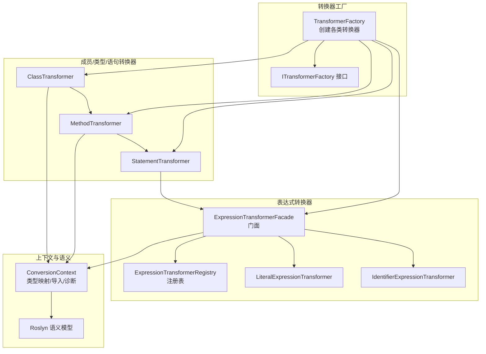
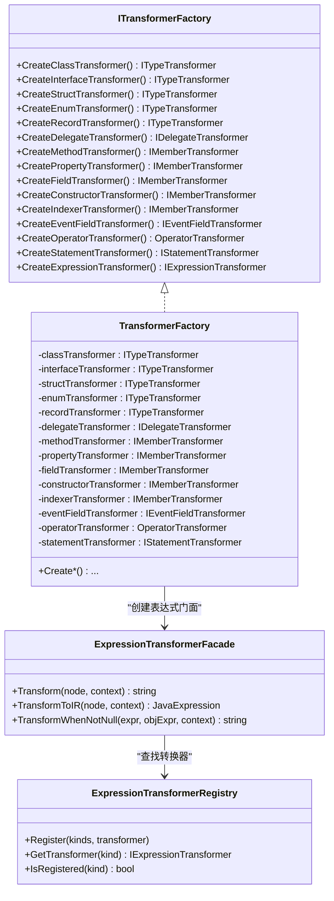
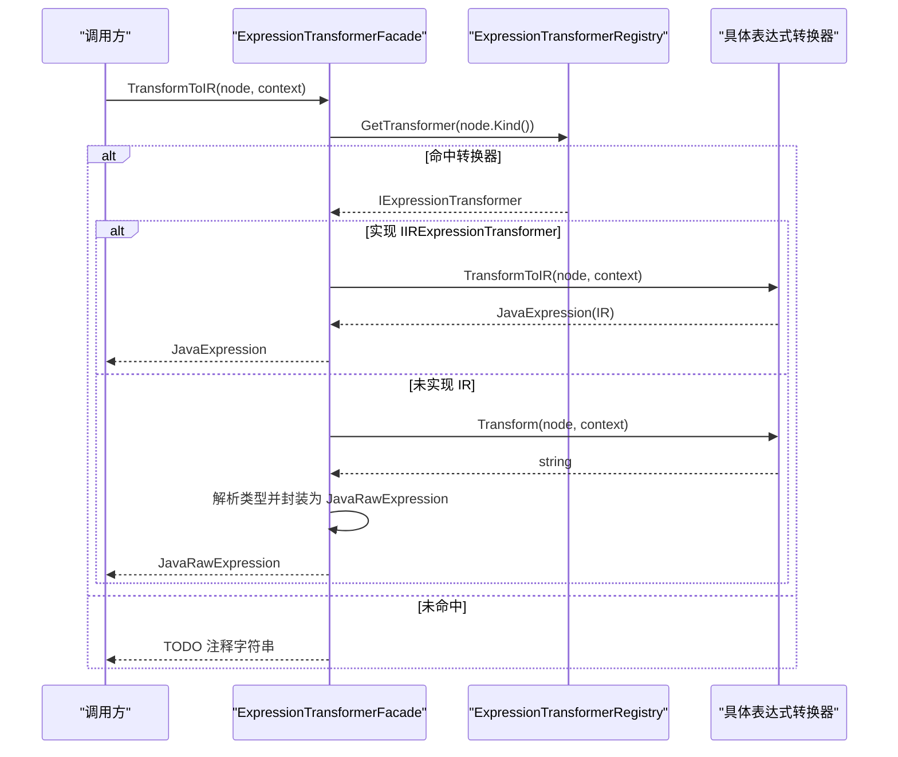
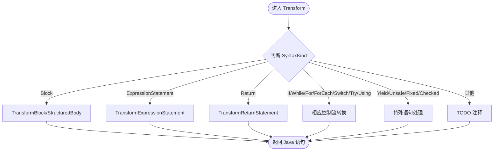
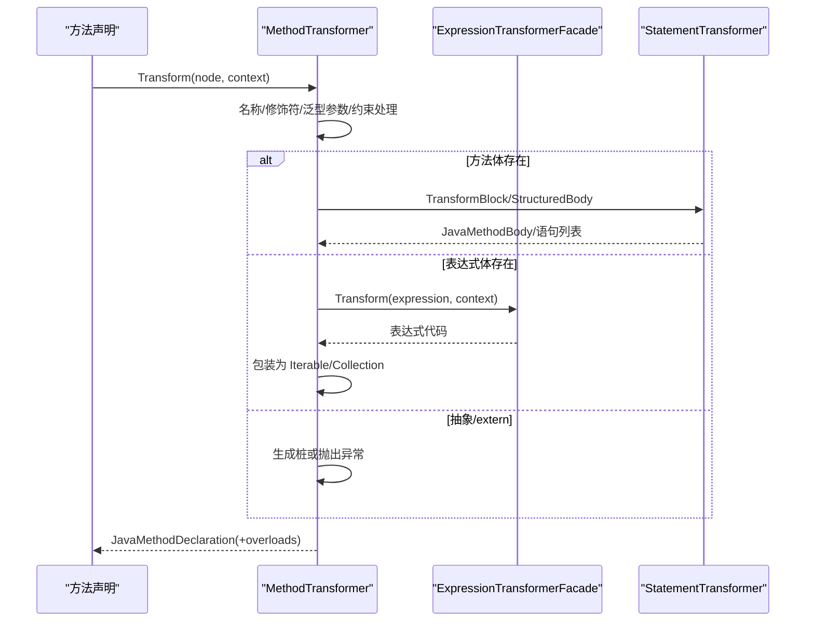
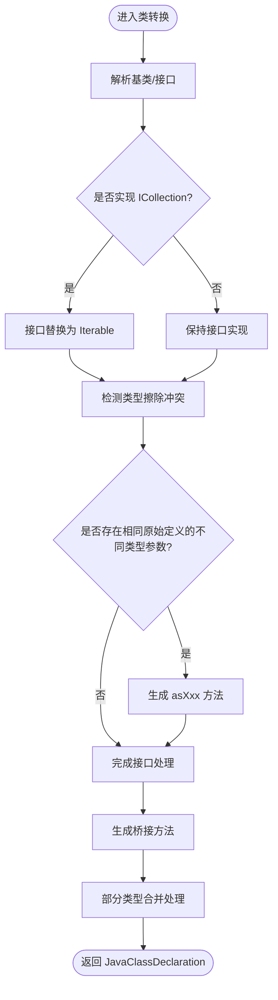
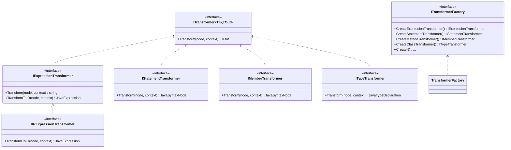
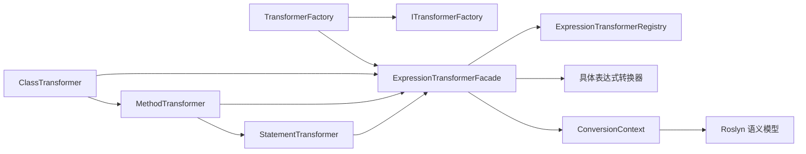

# 转换引擎

<cite>
**本文档引用的文件**
- [TransformerFactory.cs](file://src/CSharpToJava.Core/Transformers/TransformerFactory.cs)
- [ITransformerFactory.cs](file://src/CSharpToJava.Core/Abstractions/ITransformerFactory.cs)
- [ITransformer.cs](file://src/CSharpToJava.Core/Abstractions/ITransformer.cs)
- [ExpressionTransformerFacade.cs](file://src/CSharpToJava.Core/Transformers/Expression/ExpressionTransformerFacade.cs)
- [ExpressionTransformerRegistry.cs](file://src/CSharpToJava.Core/Transformers/Expression/ExpressionTransformerRegistry.cs)
- [LiteralExpressionTransformer.cs](file://src/CSharpToJava.Core/Transformers/Expression/Transformers/LiteralExpressionTransformer.cs)
- [IdentifierExpressionTransformer.cs](file://src/CSharpToJava.Core/Transformers/Expression/Transformers/IdentifierExpressionTransformer.cs)
- [MethodTransformer.cs](file://src/CSharpToJava.Core/Transformers/Member/MethodTransformer.cs)
- [ClassTransformer.cs](file://src/CSharpToJava.Core/Transformers/Type/ClassTransformer.cs)
- [StatementTransformer.cs](file://src/CSharpToJava.Core/Transformers/Statement/StatementTransformer.cs)
</cite>

## 目录
1. [简介](#简介)
2. [项目结构](#项目结构)
3. [核心组件](#核心组件)
4. [架构总览](#架构总览)
5. [详细组件分析](#详细组件分析)
6. [依赖分析](#依赖分析)
7. [性能考虑](#性能考虑)
8. [故障排查指南](#故障排查指南)
9. [结论](#结论)

## 简介
本文件系统性阐述 cs2j 转换引擎的工厂模式与转换器体系，重点覆盖以下方面：
- 工厂模式：统一创建表达式、语句、类型与成员转换器，确保无状态、可共享、可注入替换。
- 表达式转换器：采用注册表 + 门面模式，支持自注册、结构化 IR 输出与回退策略。
- 语句与成员转换器：基于语法种类分派，结合上下文与语义模型进行类型映射与桥接。
- 类型转换器：面向类声明的综合转换，包含泛型约束、接口擦除冲突处理与桥接方法生成。
- 协作关系与数据流：从工厂到转换器再到上下文与语义模型的完整链路。

## 项目结构
cs2j 的转换层位于 CSharpToJava.Core 项目下，按职责划分为抽象层、上下文层、Java IR 层与各转换器子模块。转换器工厂集中于 TransformerFactory，负责创建各类转换器实例；表达式转换器通过 ExpressionTransformerRegistry 自动发现与注册；其他转换器（成员、类型、语句）按接口契约实现各自转换逻辑。

图表来源
- [TransformerFactory.cs:16-58](file://src/CSharpToJava.Core/Transformers/TransformerFactory.cs#L16-L58)
- [ITransformerFactory.cs:8-32](file://src/CSharpToJava.Core/Abstractions/ITransformerFactory.cs#L8-L32)
- [ExpressionTransformerFacade.cs:12-68](file://src/CSharpToJava.Core/Transformers/Expression/ExpressionTransformerFacade.cs#L12-L68)
- [ExpressionTransformerRegistry.cs:17-147](file://src/CSharpToJava.Core/Transformers/Expression/ExpressionTransformerRegistry.cs#L17-L147)
- [MethodTransformer.cs:16-324](file://src/CSharpToJava.Core/Transformers/Member/MethodTransformer.cs#L16-L324)
- [ClassTransformer.cs:16-255](file://src/CSharpToJava.Core/Transformers/Type/ClassTransformer.cs#L16-L255)
- [StatementTransformer.cs:17-48](file://src/CSharpToJava.Core/Transformers/Statement/StatementTransformer.cs#L17-L48)

章节来源
- [TransformerFactory.cs:16-58](file://src/CSharpToJava.Core/Transformers/TransformerFactory.cs#L16-L58)
- [ITransformerFactory.cs:8-32](file://src/CSharpToJava.Core/Abstractions/ITransformerFactory.cs#L8-L32)
- [ExpressionTransformerFacade.cs:12-68](file://src/CSharpToJava.Core/Transformers/Expression/ExpressionTransformerFacade.cs#L12-L68)
- [ExpressionTransformerRegistry.cs:17-147](file://src/CSharpToJava.Core/Transformers/Expression/ExpressionTransformerRegistry.cs#L17-L147)
- [MethodTransformer.cs:16-324](file://src/CSharpToJava.Core/Transformers/Member/MethodTransformer.cs#L16-L324)
- [ClassTransformer.cs:16-255](file://src/CSharpToJava.Core/Transformers/Type/ClassTransformer.cs#L16-L255)
- [StatementTransformer.cs:17-48](file://src/CSharpToJava.Core/Transformers/Statement/StatementTransformer.cs#L17-L48)

## 核心组件
- 转换器工厂（TransformerFactory）
  - 统一创建 ITypeTransformer、IMemberTransformer、IStatementTransformer、IExpressionTransformer 实例。
  - 所有转换器为无状态单例，通过静态字段缓存，保证线程安全与复用。
- 转换器接口族（ITransformer、IExpressionTransformer、IMemberTransformer、ITypeTransformer、IStatementTransformer、IDelegateTransformer、IEventFieldTransformer）
  - 定义统一 Transform 签名与扩展能力（如 IIRExpressionTransformer 支持结构化 IR）。
- 表达式转换器门面与注册表（ExpressionTransformerFacade、ExpressionTransformerRegistry）
  - 门面负责根据 SyntaxKind 查找具体转换器或回退生成 TODO 注释。
  - 注册表通过特性自注册与静态构造器触发，内置若干内联处理器。
- 成员/类型/语句转换器
  - MethodTransformer：方法名映射、参数与返回值处理、yield/表达式体/默认参数等。
  - ClassTransformer：类继承与接口实现、泛型约束、类型擦除冲突与桥接方法。
  - StatementTransformer：块/语句分派、结构化 IR 与注释保留。

章节来源
- [TransformerFactory.cs:16-58](file://src/CSharpToJava.Core/Transformers/TransformerFactory.cs#L16-L58)
- [ITransformer.cs:12-86](file://src/CSharpToJava.Core/Abstractions/ITransformer.cs#L12-L86)
- [ExpressionTransformerFacade.cs:12-68](file://src/CSharpToJava.Core/Transformers/Expression/ExpressionTransformerFacade.cs#L12-L68)
- [ExpressionTransformerRegistry.cs:17-147](file://src/CSharpToJava.Core/Transformers/Expression/ExpressionTransformerRegistry.cs#L17-L147)
- [MethodTransformer.cs:16-324](file://src/CSharpToJava.Core/Transformers/Member/MethodTransformer.cs#L16-L324)
- [ClassTransformer.cs:16-255](file://src/CSharpToJava.Core/Transformers/Type/ClassTransformer.cs#L16-L255)
- [StatementTransformer.cs:17-48](file://src/CSharpToJava.Core/Transformers/Statement/StatementTransformer.cs#L17-L48)

## 架构总览
转换引擎采用“工厂 + 门面 + 注册表”的组合模式：
- 工厂提供统一入口，屏蔽具体转换器实现差异。
- 表达式转换器通过注册表自动发现，减少硬编码维护成本。
- 门面统一处理结构化 IR 与字符串输出的回退策略。
- 上下文（ConversionContext）贯穿所有转换过程，提供类型映射、导入管理、诊断收集与语义查询。

图表来源
- [ITransformerFactory.cs:8-32](file://src/CSharpToJava.Core/Abstractions/ITransformerFactory.cs#L8-L32)
- [TransformerFactory.cs:16-58](file://src/CSharpToJava.Core/Transformers/TransformerFactory.cs#L16-L58)
- [ExpressionTransformerFacade.cs:12-68](file://src/CSharpToJava.Core/Transformers/Expression/ExpressionTransformerFacade.cs#L12-L68)
- [ExpressionTransformerRegistry.cs:17-147](file://src/CSharpToJava.Core/Transformers/Expression/ExpressionTransformerRegistry.cs#L17-L147)

## 详细组件分析

### 表达式转换器体系
- 设计要点
  - 门面（ExpressionTransformerFacade）统一入口，先查注册表，再回退生成 TODO 注释。
  - 结构化 IR（IIRExpressionTransformer）优先：若底层转换器支持 TransformToIR，则直接返回结构化节点；否则包装为 JavaRawExpression 并推断类型。
  - 条件访问（?.）与 LINQ 在门面中特殊处理，构建流式管道或空值保护。
- 关键流程（TransformToIR）
  - 若实现 IIRExpressionTransformer：直接调用 TransformToIR，并在必要时补全解析类型。
  - 否则：调用 Transform 获取字符串，结合 Roslyn 语义模型解析类型，封装为 JavaRawExpression。

图表来源
- [ExpressionTransformerFacade.cs:50-68](file://src/CSharpToJava.Core/Transformers/Expression/ExpressionTransformerFacade.cs#L50-L68)
- [ExpressionTransformerRegistry.cs:146-147](file://src/CSharpToJava.Core/Transformers/Expression/ExpressionTransformerRegistry.cs#L146-L147)

- 典型实现示例
  - 字面量转换（LiteralExpressionTransformer）
    - 支持数值、字符串、字符、null、布尔、UTF-8 字符串等。
    - 数字后缀处理：f/d/m/ul/lu/u/l 映射到 Java 原生类型或大数类型。
    - 原生 Java 版本不支持的特性（如数字下划线、文本块）进行降级处理。
  - 标识符与成员访问（IdentifierExpressionTransformer）
    - 本地变量/参数 → 结构化标识符表达式。
    - 属性读取 → 生成 getter 调用；常量字段 → 直接标识符。
    - 事件与方法组在特定上下文中生成 Java 方法引用或显式 lambda。
    - 基元静态常量（如 Double.MAX_VALUE）与枚举成员访问的特殊处理。

章节来源
- [ExpressionTransformerFacade.cs:12-68](file://src/CSharpToJava.Core/Transformers/Expression/ExpressionTransformerFacade.cs#L12-L68)
- [ExpressionTransformerRegistry.cs:17-147](file://src/CSharpToJava.Core/Transformers/Expression/ExpressionTransformerRegistry.cs#L17-L147)
- [LiteralExpressionTransformer.cs:17-57](file://src/CSharpToJava.Core/Transformers/Expression/Transformers/LiteralExpressionTransformer.cs#L17-L57)
- [LiteralExpressionTransformer.cs:59-114](file://src/CSharpToJava.Core/Transformers/Expression/Transformers/LiteralExpressionTransformer.cs#L59-L114)
- [LiteralExpressionTransformer.cs:116-166](file://src/CSharpToJava.Core/Transformers/Expression/Transformers/LiteralExpressionTransformer.cs#L116-L166)
- [IdentifierExpressionTransformer.cs:16-64](file://src/CSharpToJava.Core/Transformers/Expression/Transformers/IdentifierExpressionTransformer.cs#L16-L64)
- [IdentifierExpressionTransformer.cs:67-208](file://src/CSharpToJava.Core/Transformers/Expression/Transformers/IdentifierExpressionTransformer.cs#L67-L208)

### 语句转换器
- 设计要点
  - 基于 SyntaxKind 分派至对应转换方法，统一返回 JavaStatementNode 或结构化 IR。
  - 块转换支持结构化 IR（TransformBlockToStructuredBody），便于后续优化与可视化。
  - 注释提取与保留，确保转换结果可读性。
- 典型流程
  - Transform：根据节点类型选择分支，委托给专用转换器或内联处理。
  - TransformBlock/TransformBlockToStructuredBody：作用域管理、语句拼接与 IR 化。

图表来源
- [StatementTransformer.cs:19-48](file://src/CSharpToJava.Core/Transformers/Statement/StatementTransformer.cs#L19-L48)
- [StatementTransformer.cs:50-77](file://src/CSharpToJava.Core/Transformers/Statement/StatementTransformer.cs#L50-L77)
- [StatementTransformer.cs:117-163](file://src/CSharpToJava.Core/Transformers/Statement/StatementTransformer.cs#L117-L163)

章节来源
- [StatementTransformer.cs:17-48](file://src/CSharpToJava.Core/Transformers/Statement/StatementTransformer.cs#L17-L48)
- [StatementTransformer.cs:50-77](file://src/CSharpToJava.Core/Transformers/Statement/StatementTransformer.cs#L50-L77)
- [StatementTransformer.cs:117-163](file://src/CSharpToJava.Core/Transformers/Statement/StatementTransformer.cs#L117-L163)

### 成员转换器（方法）
- 设计要点
  - 方法名映射：运算符重载、属性访问器、测试框架注解、大小写转换与关键字转义。
  - 参数处理：ref/out/params/in 与默认参数（Java 不支持）的重载生成策略。
  - 返回类型处理：async → CompletableFuture；IEnumerable/ICollection/IList → 流或集合包装。
  - yield return：转换为列表累积模式，必要时推断匿名类型记录名。
  - 语句体转换：委托给 StatementTransformer，支持结构化 IR。
- 关键流程（表达式体方法）
  - 对返回 IEnumerable/ICollection/IList 的表达式体进行包装，确保 Java 可赋值性。

图表来源
- [MethodTransformer.cs:18-324](file://src/CSharpToJava.Core/Transformers/Member/MethodTransformer.cs#L18-L324)
- [MethodTransformer.cs:681-733](file://src/CSharpToJava.Core/Transformers/Member/MethodTransformer.cs#L681-L733)

章节来源
- [MethodTransformer.cs:16-324](file://src/CSharpToJava.Core/Transformers/Member/MethodTransformer.cs#L16-L324)
- [MethodTransformer.cs:681-733](file://src/CSharpToJava.Core/Transformers/Member/MethodTransformer.cs#L681-L733)

### 类型转换器（类）
- 设计要点
  - 基类与接口映射：跳过不存在的基类（如 MarshalByRefObject），接口实现替换（ICollection<T> → Iterable）。
  - 泛型约束与类型参数：传播约束边界，处理协变/逆变声明站点差异。
  - 类型擦除冲突：当父子类对同一原始接口使用不同类型参数时，提取为工厂方法。
  - 桥接方法：为 Iterator/Iterable/Collection/Comparable/Cloneable 等生成兼容方法。
  - 部分类型合并：对合并后的类型声明进行统一处理，去重成员并同步占位上下文。
- 关键流程（接口实现与擦除冲突）
  - 预扫描类是否实现 ICollection<T>，决定是否将其实接口替换为 Iterable。
  - 检测相同原始定义但类型参数不同的接口，生成工厂方法替代直接实现。

图表来源
- [ClassTransformer.cs:46-175](file://src/CSharpToJava.Core/Transformers/Type/ClassTransformer.cs#L46-L175)
- [ClassTransformer.cs:138-169](file://src/CSharpToJava.Core/Transformers/Type/ClassTransformer.cs#L138-L169)
- [ClassTransformer.cs:242-252](file://src/CSharpToJava.Core/Transformers/Type/ClassTransformer.cs#L242-L252)
- [ClassTransformer.cs:257-445](file://src/CSharpToJava.Core/Transformers/Type/ClassTransformer.cs#L257-L445)

章节来源
- [ClassTransformer.cs:16-255](file://src/CSharpToJava.Core/Transformers/Type/ClassTransformer.cs#L16-L255)
- [ClassTransformer.cs:257-445](file://src/CSharpToJava.Core/Transformers/Type/ClassTransformer.cs#L257-L445)

### 转换器工厂模式
- 设计要点
  - ITransformerFactory 抽象工厂接口，便于依赖注入与测试替身。
  - TransformerFactory 静态单例缓存各转换器实例，确保无状态与共享。
  - 表达式转换器通过 ExpressionTransformerFacade.Instance 提供统一入口。
- 使用模式
  - 通过工厂获取转换器 → 传入 SyntaxNode 与 ConversionContext → 调用 Transform/TransformToIR → 返回 Java 代码或结构化 IR。

图表来源
- [ITransformer.cs:12-86](file://src/CSharpToJava.Core/Abstractions/ITransformer.cs#L12-L86)
- [ITransformerFactory.cs:8-32](file://src/CSharpToJava.Core/Abstractions/ITransformerFactory.cs#L8-L32)
- [TransformerFactory.cs:16-58](file://src/CSharpToJava.Core/Transformers/TransformerFactory.cs#L16-L58)

章节来源
- [ITransformer.cs:12-86](file://src/CSharpToJava.Core/Abstractions/ITransformer.cs#L12-L86)
- [ITransformerFactory.cs:8-32](file://src/CSharpToJava.Core/Abstractions/ITransformerFactory.cs#L8-L32)
- [TransformerFactory.cs:16-58](file://src/CSharpToJava.Core/Transformers/TransformerFactory.cs#L16-L58)

## 依赖分析
- 组件耦合
  - 工厂与转换器：通过接口解耦，工厂仅依赖抽象。
  - 表达式门面与注册表：门面依赖注册表；注册表通过反射自注册，降低硬编码。
  - 转换器与上下文：所有转换器均依赖 ConversionContext（类型映射、导入、诊断、语义模型）。
- 外部依赖
  - Roslyn 语法与语义模型：用于类型解析、符号查询与诊断。
  - Java 导入与类型映射：通过 TypeMappings 与 Java 命名规则进行双向映射。

图表来源
- [TransformerFactory.cs:16-58](file://src/CSharpToJava.Core/Transformers/TransformerFactory.cs#L16-L58)
- [ExpressionTransformerFacade.cs:12-68](file://src/CSharpToJava.Core/Transformers/Expression/ExpressionTransformerFacade.cs#L12-L68)
- [ExpressionTransformerRegistry.cs:17-147](file://src/CSharpToJava.Core/Transformers/Expression/ExpressionTransformerRegistry.cs#L17-L147)
- [MethodTransformer.cs:16-324](file://src/CSharpToJava.Core/Transformers/Member/MethodTransformer.cs#L16-L324)
- [ClassTransformer.cs:16-255](file://src/CSharpToJava.Core/Transformers/Type/ClassTransformer.cs#L16-L255)
- [StatementTransformer.cs:17-48](file://src/CSharpToJava.Core/Transformers/Statement/StatementTransformer.cs#L17-L48)

章节来源
- [TransformerFactory.cs:16-58](file://src/CSharpToJava.Core/Transformers/TransformerFactory.cs#L16-L58)
- [ExpressionTransformerFacade.cs:12-68](file://src/CSharpToJava.Core/Transformers/Expression/ExpressionTransformerFacade.cs#L12-L68)
- [ExpressionTransformerRegistry.cs:17-147](file://src/CSharpToJava.Core/Transformers/Expression/ExpressionTransformerRegistry.cs#L17-L147)
- [MethodTransformer.cs:16-324](file://src/CSharpToJava.Core/Transformers/Member/MethodTransformer.cs#L16-L324)
- [ClassTransformer.cs:16-255](file://src/CSharpToJava.Core/Transformers/Type/ClassTransformer.cs#L16-L255)
- [StatementTransformer.cs:17-48](file://src/CSharpToJava.Core/Transformers/Statement/StatementTransformer.cs#L17-L48)

## 性能考虑
- 单例与无状态：转换器为静态单例，避免重复构造开销。
- 注册表并发：ExpressionTransformerRegistry 使用并发字典，注册阶段通过反射触发，运行期查找为 O(1)。
- 结构化 IR 优先：IIRExpressionTransformer 可直接产出结构化节点，减少二次解析成本。
- 语义模型缓存：ConversionContext 复用 Roslyn 语义模型，避免重复解析。
- 延迟导入与预处理：通过上下文的预/后置语句队列减少重复生成与临时变量。

## 故障排查指南
- 表达式未注册
  - 现象：生成 TODO 注释而非抛错。
  - 处理：确认 ExpressionTransformerRegistry 是否已注册该 SyntaxKind；必要时添加内联处理器或实现转换器并通过特性自注册。
- 类型映射失败
  - 现象：无法解析类型或映射为空。
  - 处理：检查 TypeMappings 配置与命名空间；确认 ConversionContext.MapType 的调用路径。
- 条件访问与 LINQ
  - 现象：?. 链或 LINQ 方法未正确生成流式调用。
  - 处理：核对 ExpressionTransformerFacade.TransformWhenNotNull 的分支与 BuildStreamExpression 的调用。
- 泛型与类型擦除
  - 现象：接口实现冲突或编译报错。
  - 处理：ClassTransformer 会检测并提取冲突接口为工厂方法；必要时手动调整类型参数或接口层次。
- 语义模型不可用
  - 现象：GetSymbolInfo/GetTypeInfo 返回空。
  - 处理：检查 Compilation 与 SemanticModel 的可用性；在缺失时使用语法回退映射。

章节来源
- [ExpressionTransformerFacade.cs:28-39](file://src/CSharpToJava.Core/Transformers/Expression/ExpressionTransformerFacade.cs#L28-L39)
- [ExpressionTransformerRegistry.cs:146-147](file://src/CSharpToJava.Core/Transformers/Expression/ExpressionTransformerRegistry.cs#L146-L147)
- [ClassTransformer.cs:138-169](file://src/CSharpToJava.Core/Transformers/Type/ClassTransformer.cs#L138-L169)

## 结论
cs2j 转换引擎通过工厂模式与注册表机制实现了高内聚、低耦合的转换器体系。表达式转换器的门面与结构化 IR 输出提升了可扩展性与可维护性；成员与类型转换器充分结合语义模型与上下文，处理了复杂语言特性（如泛型、运算符重载、yield、unsafe）。整体设计兼顾初学者可理解性与高级开发者深度定制需求，为大规模 C# 到 Java 转换提供了稳健基础。